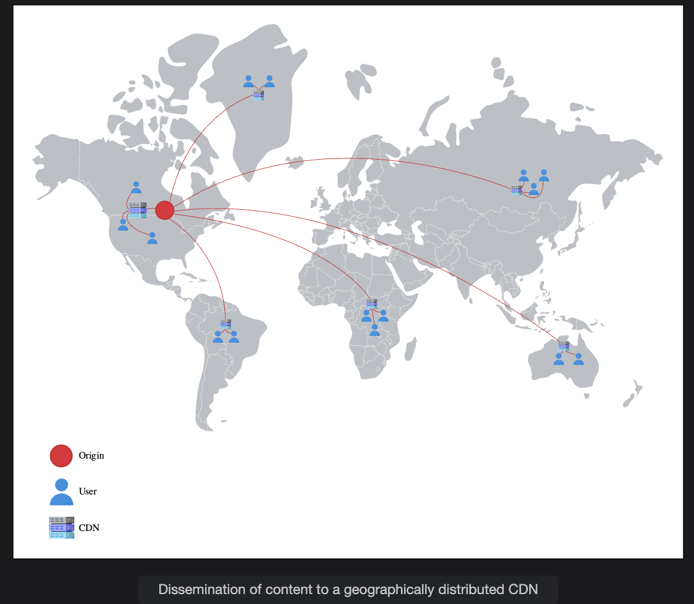
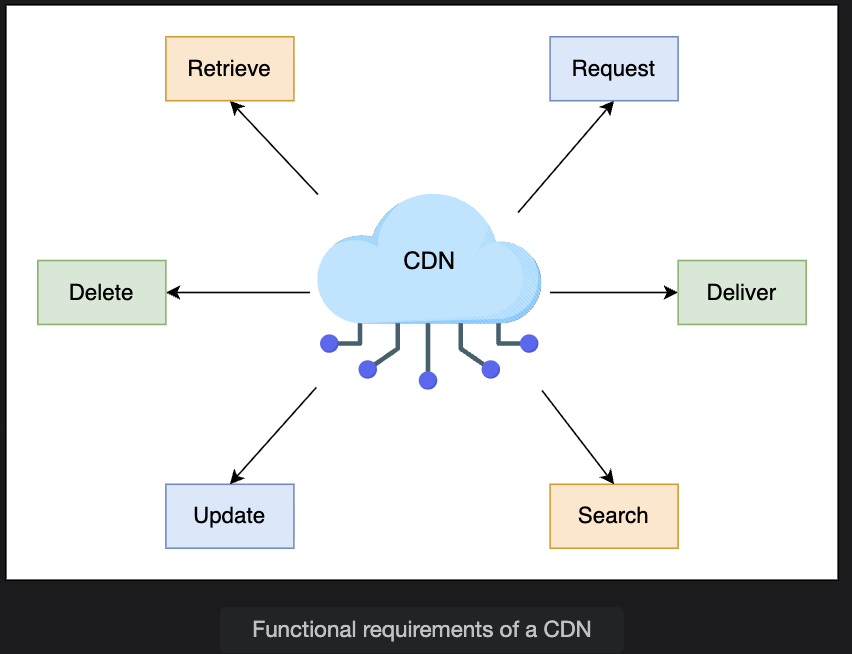
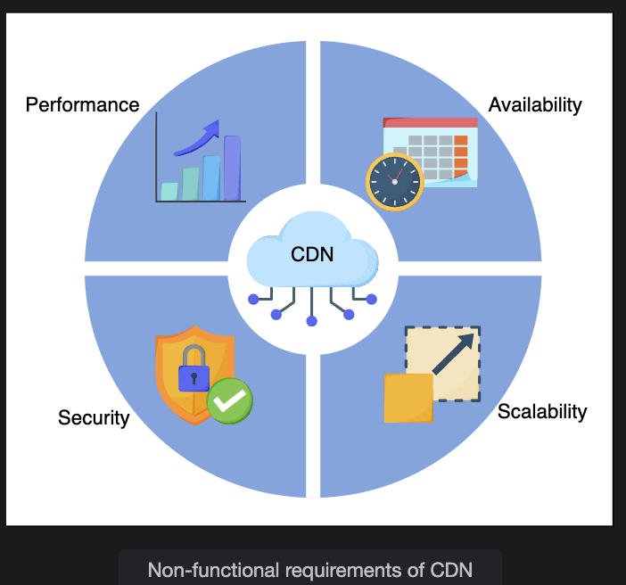

# Content Delivery Network (CDN) Guide

## 🧩 1. What is a CDN?

A Content Delivery Network (CDN) is not just one server — it's a network of servers that are:

- **Geographically distributed** across multiple locations
- **Strategically placed** near end users (at the "network edge")
- **Connected back** to a central origin server (the main data center)

Each of these edge servers is called a **proxy server** — it stands between the client (user) and the origin server.

## ⚙️ 2. How a CDN Works (The Big Picture)

Here's the basic flow:

1. **User requests content** (like a video, image, or web page)
2. The request goes to the **nearest CDN edge server** (not the origin)
3. **If that edge server has the content cached** → it serves it immediately
   - ✅ Result: Much faster response (lower latency)
4. **If it doesn't have it cached** → it fetches it once from the origin server, stores it locally, and serves future requests from there

This mechanism brings data closer to the users, reducing the distance that information must travel.

## 🏙️ 3. Why Proxy Servers Are Placed "at the Edge"

**"Edge"** here means the entry point of the ISP (Internet Service Provider) — very close to users' devices.

By having a small data center (edge node) near users:

- Data travels over a shorter distance → lower propagation delay
- The ISP internal network usually has more bandwidth → less congestion
- The origin server doesn't get overloaded with repeated identical requests

So, edge servers don't just cache data — they intelligently manage how content is delivered to balance performance and cost.

## 💾 4. What Data Does a CDN Store?

A CDN mainly stores two kinds of content:

| Type of Data | Example | How It's Handled |
|--------------|---------|------------------|
| **Static Data** | Images, CSS, JavaScript, PDFs, videos | Cached permanently or with long TTL (Time To Live) |
| **Dynamic Data** | API responses, live video streams | Cached for short duration or streamed via real-time protocols |

For dynamic content (like live sports streaming), CDN providers use protocols like:

- **RTMP** – Real-Time Messaging Protocol
- **HLS** – HTTP Live Streaming
- **RTSP** – Real-Time Streaming Protocol

These allow users to receive continuous, up-to-date content with minimal buffering.

## 🚀 5. How CDN Solves Each Problem

### 🕓 A. High Latency

- CDNs reduce physical distance between users and servers
- Users in India or Japan fetch content from local CDN nodes, not from a U.S. data center
- Fewer network hops → lower propagation + transmission delay → faster response

**Example:**
- **Without CDN:** A request travels 10,000 km (Virginia → India)
- **With CDN:** Request travels 200 km (Delhi → Mumbai CDN node)

### 💡 B. Data-Intensive Applications

- Instead of every user fetching data from the main server, local CDN nodes handle multiple users
- The origin server sends data only once to each CDN node → massive bandwidth savings

**Example:**
- A movie stored in the origin → sent once to CDN in Europe
- That CDN then serves millions of European users locally

✅ **This reduces:**
- Redundant data transfers
- Cross-ISP congestion
- Throughput degradation

### 🧱 C. Data Center Bottlenecks & Single Point of Failure

- Traffic is distributed across multiple CDN nodes
- The origin server's load is drastically reduced since most requests are handled at the edge
- If one CDN node or even a full data center fails → nearby CDN nodes continue serving users

✅ **Result:**
- No single point of failure
- Scalability and reliability improve drastically

## 🧠 6. The "Intelligence" Behind CDNs

CDNs aren't just dumb caches — they're intelligent systems that:

- Decide which content to cache (and when to evict it)
- Choose which edge node should serve a specific user (based on latency, geography, or load)
- Sync content with other edge nodes and the origin server to ensure consistency
- Use routing algorithms (like Anycast DNS) to direct users to the nearest healthy node

## 🌍 Analogy

Think of the origin server as a central warehouse, and CDNs as local retail stores:

- Customers buy from the nearest store (low latency)
- The store occasionally restocks from the main warehouse (data transfer once)
- If one store is closed, customers can go to the next closest one (fault tolerance)

 

> **Note:** A few well-known CDN providers are **Akamai**, **StackPath**, **Cloudflare**, **Rackspace**, **Amazon CloudFront**, and **Google Cloud CDN**.

---

# Does a CDN Cache All Content from the Origin Server?

**Short Answer:** No — a CDN does not cache all content from the origin server. It selectively caches only the most frequently accessed or cacheable content.

## 🧠 Why Not All Content Is Cached

A CDN (Content Delivery Network) is optimized for efficiency and cost-effectiveness, so it only caches what makes sense to store close to users.

### 1. Storage Limitations

- Edge servers have limited storage capacity
- Caching the entire origin dataset would be wasteful and expensive
- CDNs instead cache only "hot" or recently accessed content

### 2. Static vs. Dynamic Content

- **Static content** (images, CSS, JavaScript, videos, etc.) can be safely cached because it rarely changes
- **Dynamic content** (personalized dashboards, live data, user-specific pages) changes frequently and is usually fetched from the origin
- Some CDNs optimize dynamic data delivery using:
  - Dynamic caching
  - Edge computing
  - Route optimization
  
  But they do not fully cache it.

### 3. Cache-Control Policies

The origin server controls caching using HTTP headers, such as:

```http
Cache-Control: public, max-age=3600
```

This example means the resource can be cached publicly for one hour.

- Other headers like `Expires` and `ETag` also influence CDN caching behavior

### 4. Popularity-Based Eviction

- CDNs use algorithms such as **Least Recently Used (LRU)** to evict stale or unpopular items
- This ensures that only high-demand content remains cached

### 5. Security and Privacy

- Sensitive or user-specific content (e.g., banking info, profiles, personal dashboards) must not be cached
- CDNs respect privacy rules and avoid caching restricted data

## ✅ Summary Table

| Type of Content | Cached by CDN? | Notes |
|----------------|----------------|-------|
| Static files (images, CSS, JS, videos) | ✅ Yes | Most common use case |
| Frequently requested API responses | ⚙️ Sometimes | Based on cache headers |
| Personalized or user-specific data | ❌ No | Must be fetched from origin |
| Sensitive data (auth, banking info) | ❌ No | Security restriction |

## Summary

**In summary:** A CDN focuses on caching the most valuable, frequently requested, and static data to improve performance and reduce latency — not every single piece of content.

---

# Requirements

Let's look at the functional and non-functional requirements that we expect from a CDN.

## Functional Requirements

The following functional requirements will be a part of our design:

 - **Retrieve:-** Depending upon the type of CDN models, a CDN should be able to retrieve content from the origin servers. We'll cover CDN models in the coming lesson.

 - **Request:-** Content delivery from the proxy server is made upon the user's request. CDN proxy servers should be able to respond to each user's request in this regard.

 - **Deliver:-** In the case of the push model, the origin servers should be able to send the content to the CDN proxy servers.

 - **Search:-** The CDN should be able to execute a search against a user query for cached or otherwise stored content within the CDN infrastructure.

 - **Update:-** In most cases, content comes from the origin server, but if we run a script in a CDN, the CDN should be able to update the content within peer CDN proxy servers in a PoP.

 - **Delete:-** Depending upon the type of content (static or dynamic), it should be possible to delete cached entries from the CDN servers after a certain period.

 

## Non-functional Requirements

 - **Performance:-** Minimizing latency is one of the core missions of a CDN. The proposed design should have the minimum possible latency.

 - **Availability:-** CDNs are expected to be available at all times because of their effectiveness. Availability includes protection against attacks like DDoS.

 - **Scalability-:** An increasing number of users will request content from CDNs. Our proposed CDN design should be able to scale horizontally as the requirements increase.

 - **Reliability and Security:-** Our CDN design should ensure no single point of failure. Apart from failures, the designed CDN must reliably handle massive traffic loads. Furthermore, CDNs should provide protection to hosted content from various attacks.

 

---
## Building Blocks We Will Use

The design of a CDN utilizes the following building blocks:

### DNS
DNS is the service that maps human-friendly CDN domain names to machine-readable IP addresses. This IP address will take the users to the specified proxy server.

### Load Balancers
Load balancers distribute millions of requests among the operational proxy servers.
