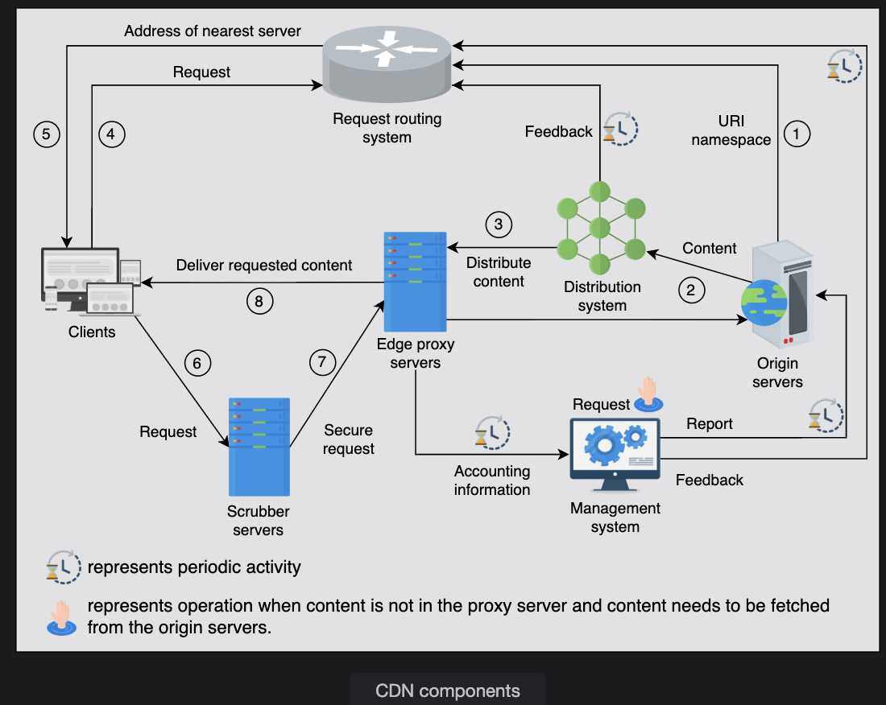

# Design of a CDN (Content Delivery Network)

A Content Delivery Network (CDN) is a distributed system of servers designed to deliver web content efficiently to users worldwide. Its goal is to reduce latency, improve performance, and handle large-scale traffic by caching content close to the end users.

## 🔹 Phase 1: CDN Components

Let's break down the major components of a CDN and their roles.

### 1. 🧑‍💻 Clients

These are end users — like web browsers, mobile apps, or smart TVs — that request content (e.g., videos, images, or web pages).

A user in India accessing a U.S.-hosted website will be routed to the nearest CDN edge node, not the main U.S. data center, to minimize delay.

### 2. 🧭 Routing System

The routing system determines which CDN edge server should serve a user's request.

It considers:

- Geographical proximity of servers to users
- Server load (to avoid overloading one server)
- Content availability (which server already has the requested file)
- Network latency and health

💡 Think of it as a traffic controller — directing users to the most efficient server, not just the closest one.

Common routing techniques include:

- DNS-based routing
- Anycast IP routing
- Application-level redirection

### 3. 🛡️ Scrubber Servers (Security Layer)

These servers protect the CDN from malicious attacks, especially DDoS (Distributed Denial-of-Service) attacks.

When an attack is detected:

- Incoming traffic is routed through the scrubber
- The scrubber filters ("scrubs") malicious packets
- Only clean, legitimate traffic passes to the actual CDN edge

✅ **Result:** CDN performance remains stable and secure, even during an attack.

### 4. 🧠 Proxy Servers (Edge Servers)

These are the core of the CDN — also called edge servers.

- They cache content (e.g., videos, CSS, JS, and images) close to the users
- Frequently accessed data (hot data) is kept in RAM for ultra-fast delivery
- Less frequently used content (cold data) may be stored on SSD or HDD

📈 Edge proxies also:

- Send usage statistics to the management system
- Fetch missing content from upstream servers when not cached

### 5. 🚚 Distribution System

This system distributes new or updated content from the origin server to multiple edge servers worldwide.

- It ensures each edge node has the correct, up-to-date version of popular content
- Uses intelligent techniques like push/pull replication, incremental updates, and broadcasting to minimize bandwidth

### 6. 🏠 Origin Servers

These are the main source of truth — the original content storage.

When a CDN node doesn't have the requested data, it fetches it from here.

The origin may store:

- All website content
- Metadata (like file mappings and access rules)

CDNs never replace origin servers — they complement them to reduce load and latency.

### 7. ⚙️ Management System

Tracks and monitors overall CDN performance:

- Latency
- Server uptime
- Cache hit ratio
- Packet loss
- Bandwidth usage

Used for billing, analytics, and auto-scaling decisions.

Keeps administrators informed about system health and client usage.

## 🔹 Phase 2: CDN Workflow

Here's how all components work together when a user requests content:

### 🔄 Step-by-Step Flow

 


#### 1. Origin server setup

The origin server delegates URI namespaces (e.g., `/images`, `/videos`) to the routing system, defining what CDN will cache.

#### 2. Content distribution

- The origin server publishes content to the distribution system
- The distribution system pushes this content to multiple proxy servers

#### 3. Routing intelligence update

The distribution system reports back to the routing system, telling it:

- Which edge servers have which content
- Which servers are overloaded or slow

#### 4. Client request begins

- A user requests a resource (like `https://example.com/video.mp4`)
- The request goes to the routing system to determine the nearest and optimal CDN node

#### 5. Routing decision

The routing system returns the IP address of the chosen edge server.

#### 6. Traffic scrubbing (if needed)

The request passes through a scrubber server to filter malicious traffic.

#### 7. Edge proxy server response

The edge proxy checks if it has the content cached:

- ✅ **If yes** → It serves the content directly to the client (fast response)
- ❌ **If not** → It fetches it from a parent proxy or the origin server

#### 8. Management and analytics

The edge server logs usage data and sends it to the management system for:

- Billing
- Performance analytics
- Cache optimization

The management system also updates the routing system with performance data.

### 🏗️ Hierarchy of Proxy Servers

Some CDNs have multiple layers of proxy servers:

- **Edge layer** — closest to users
- **Regional or parent layer** — caches larger data sets

If content is missing at the edge, it is fetched from the parent before going to the origin, reducing load and latency.

## ⚡ Summary

| Component | Role | Key Benefit |
|-----------|------|-------------|
| Clients | Request content | Entry point to CDN |
| Routing System | Finds best edge server | Reduces latency |
| Scrubber Servers | Filter attacks | Protects network |
| Proxy Servers | Cache & serve content | Fast delivery |
| Distribution System | Distributes data | Keeps CDN updated |
| Origin Servers | Source of truth | Backup and content origin |
| Management System | Monitors & logs | Optimization & billing |

---
# API Design

This section will discuss the API design of the functionalities offered by CDN. This will help us understand how the CDN will receive requests from the clients, receive content from the origin servers, and communicate to other components in the network. Let's develop APIs for each of the following functionalities:

- Retrieve content
- Deliver content
- Request content
- Search content
- Update content
- Delete content

Content can be anything, like a file, video, audio, or other web object. Here, we'll use the word "content" to refer to all of the above. For clarity, we won't discuss the privacy-related parameters—like if the content is public or private, who should be able to access this content, if it should be encrypted, and so on—in the following APIs.

## Retrieve (Proxy Server to Origin Server)

If the proxy servers request content, the GET method retrieves the content through the `/retrieveContent` API below:

```
retrieveContent(proxyserver_id, content_type, content_version, description)
```

Let's see the details of the parameters:

### Details of Parameters

| Parameter | Description |
|-----------|-------------|
| `proxyserver_id` | This is a unique ID of the requesting proxy server. |
| `content_type` | This data structure will contain information about the requested content. Specifically, it will contain the category (audio, video, document, script, and so on), the type of clients it's requested for, and the requested quality (if any). |
| `content_version` | This represents the version number of the content. For the `/retrieveContent` API, the content_version will contain the current version of the content residing in the proxy server. The content_version will be NULL if no previous version is available at the proxy server. |
| `description` | This specifies the content detail—for example, the video's extension, resolution detail, and so on if the content_type is video. |

The above API gives a response in a JSON file, which contains the text, content types, links to the images or videos in the content, and so on.

```json
"Object_links": [
    {
        "name": "videos"
        "link": "https://app_server.com/api/assets/videos/"
    },
    {
        "name": "illustrations"
        "link": "https://app_server.com/api/assets/illustrations/"
    }
]
```

## Deliver (Origin Server to Proxy Servers)

The origin servers use this API to deliver the specified content, the updated version, to the proxy servers through the distribution system. We call this the `/deliverContent` API:

```
deliverContent(origin_id, server_list, content_type, content_version, description)
```

### Details of Parameters

| Parameter | Description |
|-----------|-------------|
| `origin_id` | This recognizes each origin server uniquely. |
| `server_list` | This identifies the list of servers the content will be pushed to by the distribution system. |
| `content_version` | This represents the updated version of the content at the origin server. The proxy server receiving the content will discard the previous version. |

The rest of the parameters have been explained above already.

## Request (Clients to Proxy Servers)

The users use this API to request the content from the proxy servers. We call this the `/requestContent` API:

```
requestContent(user_id, content_type, description)
```

### Details of Parameter

| Parameter | Description |
|-----------|-------------|
| `user_id` | This is the unique ID of the user who requested the content. |

The specified proxy server returns the particular content to the requested users in response to the above API.

```json
"Object_links": [
    {
        "name": "components"
        "link": "https://cdn.app_server.com/api/components/"
    },
    {
        "name": "css"
        "link": "https://cdn.app_server.com/api/css/"
    },
    {
        "name": "illustrations"
        "link": "https://cdn.app_server.com/api/assets/illustrations/"
    },
    {
        "name": "videos"
        "link": "https://cdn.app_server.com/api/assets/videos/"
    },
    {
        "name": "icons"
        "link": "https://cdn.app_server.com/api/icons/"
    },
    {
        "name": "fonts"
        "link": "https://cdn.app_server.com/api/fonts/"
    }
]
```

## Search (Proxy Server to Peer Proxy Servers)

Although the content is first searched locally at the proxy server, the proxy servers can also probe requested content in the peer proxy servers in the same PoP through the `/searchContent` API. This could flood the query to all proxy servers in a PoP. Alternatively, we can use a data store in the PoP to query the content, though proxy servers will need to maintain what content is available on which proxy server.

The `/searchContent` API is shown below:

```
searchContent(proxyserver_id, content_type, description)
```

## Update (Proxy Server to Peer Proxy Servers)

The proxy servers use the `/updateContent` API to update the specified content in the peer proxy servers in the PoP. It does so when specified isolated scripts run on the CDN to provide image resizing, video resolution conversion, security, and many more services. This type of scripting is known as **serverless scripting**.

The `/updateContent` API is shown below:

```
updateContent(proxyserver_id, content_type, description)
```

### Details of Parameter

| Parameter | Description |
|-----------|-------------|
| `proxyserver_id` | This recognizes the proxy server uniquely in the PoP to update the content. |

The rest of the parameters have been explained above already.

## Note on Delete API

The Delete API isn't discussed here. In our caching chapter, we discussed different eviction mechanisms in detail. Those mechanisms are also applicable for a CDN content eviction. Nevertheless, situations can arise where the Delete APIs may be required. We'll discuss a few content consistency mechanisms, like how much time content stays in the cache, in the next lesson.

---

## API Summary

| API | Direction | Purpose |
|-----|-----------|---------|
| `/retrieveContent` | Proxy Server → Origin Server | Proxy requests content from origin |
| `/deliverContent` | Origin Server → Proxy Servers | Origin pushes updates to multiple proxies |
| `/requestContent` | Client → Proxy Server | User requests content from CDN |
| `/searchContent` | Proxy Server → Peer Proxy Servers | Search for content among nearby proxies |
| `/updateContent` | Proxy Server → Peer Proxy Servers | Share processed content with peers |
