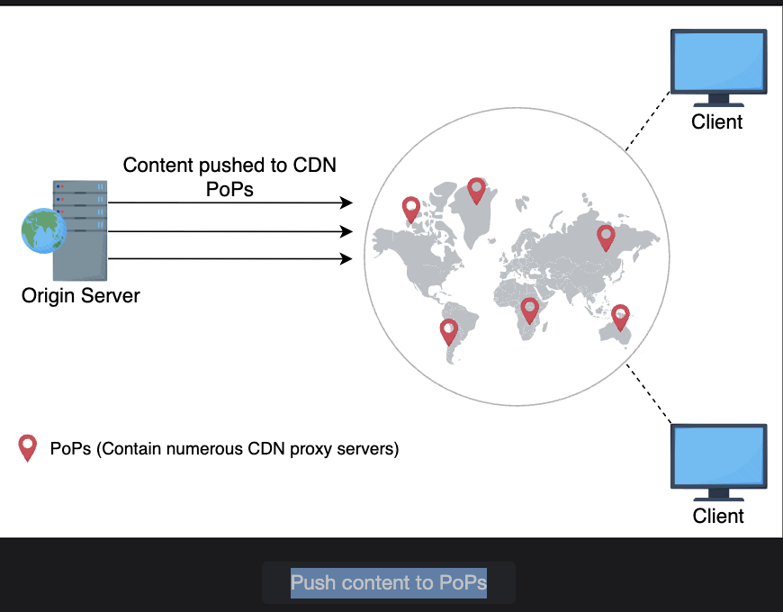
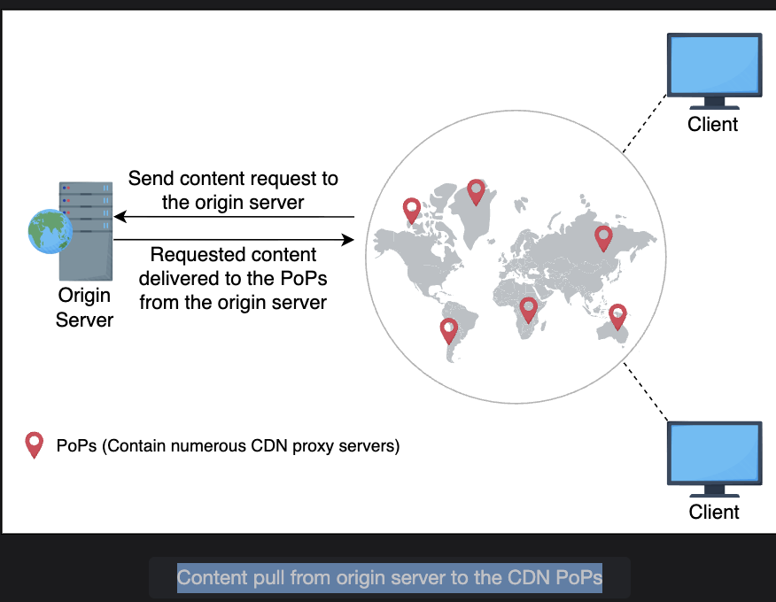
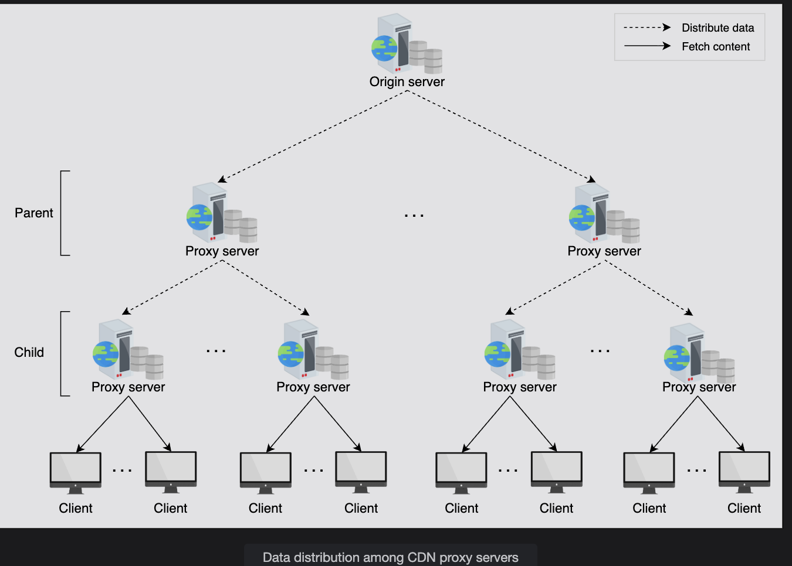
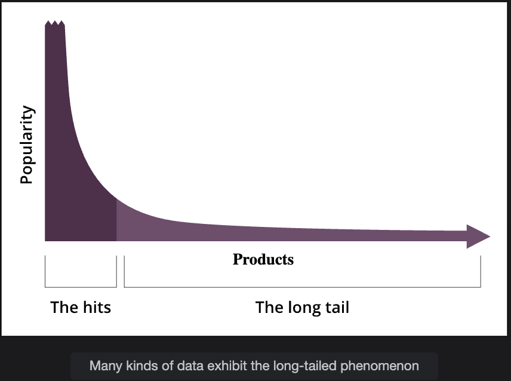
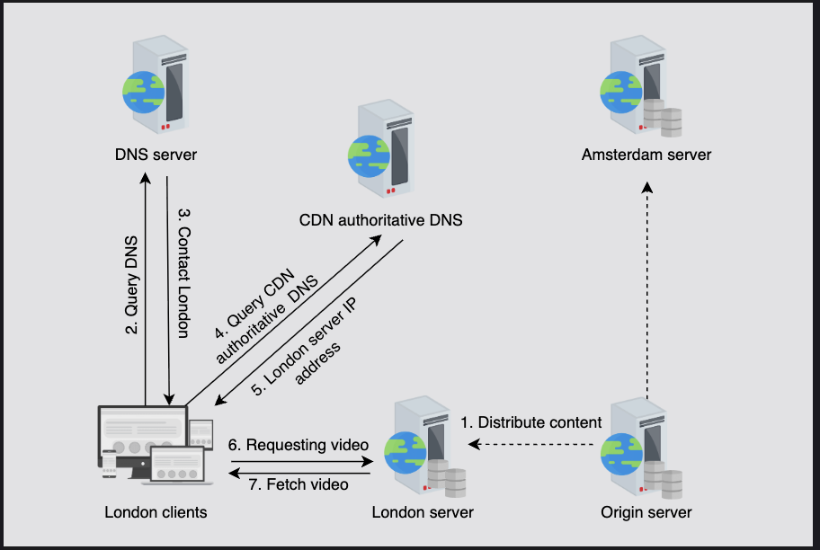

# 🌍 In-depth Investigation of CDN — Part 1

## 🧠 Goal

Understand how CDNs cache content, refresh it, and find the nearest proxy servers to serve it quickly.

This lesson mainly focuses on:

1. CDN caching models: Push vs Pull
2. How dynamic content is optimized
3. How proxy servers are discovered (routing logic, multi-tier CDN, etc.)

## 🏗️ 1. Why Caching Strategy Matters

Every CDN must decide what to store, where, and for how long. If we store too much, we waste space and bandwidth. If we store too little, users will experience cache misses → slower load times.

So, the goal is to find a balance:

- **Popular, static content** → cached near users for long time
- **Frequently changing or user-specific content** → fetched on demand

## ⚙️ 2. CDN Models — Push vs Pull

### 🅿️ Push CDN (Proactive Caching)

**Definition:** The origin server pushes content to CDN proxy servers ahead of time, without waiting for user requests.

**How it works:**

1. The content provider (like YouTube or Netflix) identifies popular/static content
2. This content is "pushed" to multiple CDN edge servers (in various regions)
3. When a user requests that content, it's instantly available nearby — no need to fetch it again

**Best for:** ✅ Static content — files that don't change frequently:

- Product images
- Logos
- CSS/JS files
- App installation packages
- Movie trailers (pre-encoded)

**Advantages:**

- Low latency for end users
- Ensures popular content is always available globally
- Reduces load on origin servers

**Disadvantages:**

- Inefficient if content changes frequently
- Might push unnecessary or rarely used files (wasting bandwidth and storage)

 

**Analogy:** Think of it like a warehouse pre-stocking popular items before customers ask for them.

### 🧲 Pull CDN (Reactive Caching)

**Definition:** The CDN fetches content on demand from the origin server only when a user requests it.

**How it works:**

1. A user requests content
2. If the CDN proxy server doesn't have it, it "pulls" it from the origin server
3. It then caches the content locally for future requests (for a limited time)

**Best for:** ✅ Dynamic or frequently updated content:

- News articles
- Blog posts
- Personalized dashboards
- Live scores
- Social media feeds

**Advantages:**

- Efficient use of cache — only stores content that's actually requested
- Automatically updates when new data appears
- Lower storage cost

**Disadvantages:**

- First request for content is slow (cache miss)
- More requests to origin during high churn
 
**Analogy:** Think of it like a restaurant cooking food only when a customer orders it — fresh, but slower at first.

## 🔁 3. Comparison — Push vs Pull CDN

| Feature | Push CDN | Pull CDN |
|---------|----------|----------|
| **Who initiates content transfer** | Origin Server | CDN / Proxy Server |
| **Ideal for** | Static content | Dynamic content |
| **When content is transferred** | Before requests arrive | When content is requested |
| **Cache freshness** | Must manually update | Automatically refreshed |
| **Storage usage** | High | Low |
| **Latency (first request)** | Very low | Higher (initially) |
| **Use cases** | Static websites, product catalogs, software updates | News feeds, blogs, live data |

## 📰 4. Real-world Example

Imagine your website has:

1. **News Feed** → constantly changing (new articles hourly)
2. **Static Assets** → logo, CSS, JS, images that rarely change

| Content Type | Best CDN Model | Why |
|--------------|----------------|-----|
| News Feed | Pull CDN | Because articles change frequently. Pulling on demand ensures users always get fresh content. |
| Static Assets | Push CDN | Because logos, styles, and static files rarely change, so it's better to pre-distribute them globally. |

### ✅ Correct Answer:

- **Push CDN** → for static assets
- **Pull CDN** → for news feed

## 🧠 5. Why This Hybrid Approach Works Best

Most modern CDNs (like Cloudflare or Akamai) combine both models:

- They use **push** for static data (e.g., JS bundles, product images)
- They use **pull** for dynamic data (e.g., user feeds, comments, live prices)

This hybrid model helps balance:

- **Performance** (fast response for cached content)
- **Freshness** (latest data for dynamic content)
- **Efficiency** (storage and bandwidth cost)

> Note: Most content providers use both pull and push CDN caching approaches to get the benefits of both.

---

# 🧠 Dynamic Content Caching Optimization

Let's start with the problem we're solving.

## 🎯 The Problem

**Static content** (like images, CSS, JS) rarely changes — so caching them on CDN edge servers is easy and effective.

But **dynamic content** — such as user dashboards, news feeds, or recommendations — changes frequently. If we cache it directly like static content, users might see outdated data.

So, CDNs use optimization techniques to cache dynamic content smartly — keeping performance high without sacrificing freshness.

## 🧩 1. Running Scripts at Proxy Servers

Normally, when a user requests dynamic content:

- The origin server executes scripts (like PHP, JSP, or Python code) to generate the page
- This adds latency — because every request must travel to the origin

To optimize this, CDNs can execute some parts of those scripts at edge servers (proxy servers).

### 🧠 Example:

Suppose a website shows weather data based on user location:

Instead of fetching data from the origin every time, the CDN proxy can execute a local script:

1. Detect user location (e.g., by IP)
2. Fetch weather data from a local cache or API for that region

This means faster response and less load on the origin.

**In short:** Move logic closer to the user — execute dynamic parts at the edge when possible.

## 🗜️ 2. Compression Techniques for Dynamic Data

Dynamic data changes often — but much of it is repeated or similar between responses.

So, CDNs use compression techniques to reduce communication costs between:

**Origin ↔ Proxy Servers**

### 🧰 Example: Cloudflare Railgun

**Railgun** compresses dynamic content that cannot be cached easily.

- It only sends the **difference (delta)** between old and new versions of the content
- This can reduce data transfer by up to 99%

**Benefit:** Faster updates and lower bandwidth usage.

## 🧩 3. Edge Side Includes (ESI)

**Edge Side Includes (ESI)** is an XML-like markup language used to assemble web pages dynamically at the CDN edge server.

### Problem It Solves:

Imagine a webpage where only 5% of the data changes (like a "user greeting" or "latest news"), while 95% (header, footer, layout) stays the same.

**Without optimization:**
- The entire page would be fetched again → redundant and wasteful

**With ESI:**
- The page is split into static and dynamic fragments
- CDN caches static parts
- CDN fetches only the dynamic fragments from the origin

### 📄 Example:

```html
<html>
  <body>
    <esi:include src="/header.html" />
    <esi:include src="/dynamic-user-section" />
    <esi:include src="/footer.html" />
  </body>
</html>
```

So the proxy server (not the browser) assembles the final page.

**ESI = "Cache the big picture; update the small changes."**

## 🎥 4. Example: Dynamic Video Content (DASH)

For video streaming (like Netflix or YouTube), CDNs use: **Dynamic Adaptive Streaming over HTTP (DASH)**

- A manifest file lists different video resolutions and segments
- The client requests the most suitable one based on:
  - Network speed
  - Device capability

Netflix extends this with **byte-range URLs** — allowing even finer control over what to fetch and cache.

This ensures smooth playback and optimal bandwidth usage.


<span style="background-color: yellow; color: blue;">in depth(Dash), <a href="./deapth/DASH.md">click here</a></span>

## 🏗️ Multi-Tier CDN Architecture

Now let's talk about how content flows through a CDN network.

### 🧱 The Challenge

The origin server cannot handle direct content distribution to hundreds or thousands of CDN edge servers simultaneously.

That would overload the origin and increase latency.

### 🌲 The Solution: Tree-like Structure

A CDN is built like a tree (hierarchy):

- **Root Node:** Origin server
- **Intermediate Nodes:** Parent proxy servers
- **Leaf Nodes:** Edge (child) proxy servers close to users

Each parent distributes data to its children. This reduces the load on the origin — data "flows down" efficiently.

```
              [Origin Server]
                     │
           ┌─────────┴─────────┐
           │                   │
   [Parent Proxy 1]     [Parent Proxy 2]
       │       │             │      │
 [Edge1]   [Edge2]      [Edge3]  [Edge4]
```

 

### ⚙️ How It Works

**Origin Server**
- Sends content to parent proxy servers
- Keeps track of configurations, updates, and metadata

**Parent Proxy Servers**
- Distribute the received data to edge servers in their region
- Maintain cache consistency and relay updates periodically

**Edge (Child) Servers**
- Serve end users directly
- Cache popular (hot) content for faster access

### 📈 Benefits

✅ **Scalability:** Add more proxy servers to handle more users — no redesign needed.

✅ **Reduced Origin Load:** Origin doesn't have to send data to all edge servers.

✅ **Better Latency:** Users get data from the nearest available edge node.

## 🛠️ Fault Tolerance

Failures can happen — and the CDN must handle them gracefully.

- **If a child proxy fails** → DNS or routing system redirects users to another child node
- **If a parent proxy fails** → the child can connect to a backup parent
- **If the origin server fails** → other replicated origins (hot backups) take over

Each PoP (Point of Presence) has multiple servers for redundancy.

## 🧠 Long-Tail Distribution

Research shows that only a few contents are very popular ("head"), while most others are rarely accessed ("long tail").

A multi-layered cache helps handle this:

- **Popular content** stays in edge caches
- **Less popular items** are stored in upper-tier caches or origin servers


 
This balances cost, storage, and speed.

## ✅ Summary

| Concept | Purpose | Key Benefit |
|---------|---------|-------------|
| Run scripts at proxy | Execute dynamic logic near users | Reduces latency |
| Compression (e.g., Railgun) | Compress dynamic data | Reduces bandwidth |
| Edge Side Includes (ESI) | Assemble dynamic pages at edge | Avoid redundant fetches |
| DASH (Netflix) | Adaptive video streaming | Optimized bandwidth usage |
| Multi-tier architecture | Tree-based CDN | Scalable and efficient |
| Fault tolerance | Backup paths | High availability |

---

# Understanding How a CDN Finds the Nearest Proxy Server

Now that you've learned how content is distributed from the origin server to all CDN proxy servers (the "push" side), the next step is to understand how users fetch data efficiently from these proxy servers (the "pull" side).

## The Main Goal

👉 To make sure each user connects to the best (nearest and least loaded) proxy server.

## ⚙️ Why Finding the Nearest Proxy Server Matters

The core purpose of a CDN is to reduce latency — i.e., make content load faster for the user.

To do that, when a user requests content, the CDN must decide:

**"Which proxy server should serve this user's request?"**

This is not always based purely on geographical distance. Instead, CDNs look at network distance, bandwidth, and server load.

## 🔍 Key Factors That Affect "Nearest" Proxy Selection

There are two main factors a CDN considers:

### 1. 🛣️ Network Distance

This isn't about physical distance — it's about how many hops or routers data travels through, and how fast each link is.

- **Path length:** Shorter routes = lower latency
- **Bandwidth:** High-capacity links = faster data transfer

So, the "nearest" proxy server is the one with:

**The shortest and fastest path to the user, not necessarily the closest geographically.**

### 2. ⚖️ Request Load

Even if a proxy is close, it may be overloaded.

So, the CDN's request routing system monitors:

- CPU load
- Active connections
- Response time

If a proxy is too busy, the routing system redirects new requests to another less loaded proxy nearby.

This keeps performance consistent and avoids server overload.

## 🗺️ Techniques to Route Users to the Nearest Proxy Server

Now let's go over the four common techniques CDNs use to achieve this routing intelligently.

### 🧩 1. DNS Redirection

DNS redirection is the most widely used technique by CDNs like Akamai and Cloudflare.

#### 📘 How It Works

Normally, when a user types a URL (like `facebook.com`):

1. The browser contacts the DNS system to resolve the domain name into an IP address
2. The DNS returns an IP address → user connects to that server

But with DNS redirection, this process is extended.

#### 🔄 Example:

Let's say a user requests:

```
https://video.xyz.com
```

1. The DNS server checks the request and sees "video" in the subdomain
2. Instead of returning a single IP, it redirects the user to another URL, like:

```
cdn.xyz.com
```

3. The CDN's authoritative DNS then returns the IP address of the best proxy server for that user

So the request flow is:

```
User → DNS → cdn.xyz.com → Best Proxy IP
```

 

Now the user connects directly to the chosen proxy server.

#### ⚙️ Two Steps in DNS Redirection

1. **Map clients to a region or network location**
   - (e.g., Asia users → Singapore PoP)

2. **Distribute load among local proxy servers**
   - (e.g., Singapore PoP → select one of 5 available edge nodes)

Both network distance and load balancing are considered.

#### 🧠 Additional Features of DNS Redirection

- **Short TTLs:** DNS records are given a short Time-To-Live so the client re-resolves frequently
  - → This allows redirection to new servers if the load or network conditions change

- **Failover Handling:** If a server fails or a route becomes congested, DNS automatically reroutes users to a healthy node

- **Load Balancing Across Data Centers:** DNS intelligently spreads traffic among multiple PoPs (Points of Presence)

**Result:**
- ✅ Lower latency
- ✅ High reliability
- ✅ Automatic failover

### 🛰️ 2. Anycast Routing

Anycast is a network-level routing method using BGP (Border Gateway Protocol).

#### 📘 How It Works

- All CDN edge servers (worldwide) share the same single IP address
- BGP — the Internet's main routing protocol — automatically sends each user's request to the nearest edge server (based on network path)

#### 🧠 Example:

If Cloudflare assigns IP `104.16.123.96` to its CDN service:

- A user in India may reach the Mumbai data center
- A user in France may reach the Paris data center
- A user in the US may reach the New York data center

**All using the same IP** — but routed intelligently by the Internet itself.

#### Benefits:

- Extremely fast routing
- No extra DNS logic needed
- Excellent failover (if one data center fails, BGP reroutes traffic)

### 🧮 3. Client Multiplexing

In this approach, the CDN gives the client a list of possible proxy servers.

Then the client chooses one to send the request to.

#### ⚠️ Drawback:

Clients don't know server loads or network conditions — so they may pick a suboptimal proxy (e.g., a busy one).

That's why this approach is rarely used in modern CDNs — it's too inefficient.

### 🌐 4. HTTP Redirection

This is the simplest (but least efficient) routing method.

Here's how it works:

1. The client requests content from the origin server
2. The origin responds with an HTTP 3xx redirect, pointing to a CDN URL

#### 🧾 Example:

Facebook might return a redirect like this:

```html
<!––  The code below is taken from Facebook. -->
    <div class="fb_content clearfix " id="content" role="main">
    <div>
    <div class="_8esj _95k9 _8esf _8opv _8f3m _8ilg _8icx _8op_ _95ka">
    <div class="_8esk">
        <div class="_8esl">
        <div class="_8ice">
         
        </div>
        <h2 class="_8eso">Facebook helps you connect and share with the people in your life.</h2>
        </div>
    </div>
    </div>
    </div>
    </div>
```

So instead of serving the logo directly, Facebook redirects the browser to the CDN domain (`static.xx.fbcdn.net`) to download it.

#### Benefits:

- Simple and easy to implement

#### Drawbacks:

- Adds an extra HTTP round trip
- Not as scalable as DNS or Anycast approaches

## 🧠 Important Note

**"Nearest proxy server" ≠ "Geographically closest server."**

For example:

A user in Delhi might be routed to a Singapore data center — not Mumbai — because the network path to Singapore is faster and less congested.

CDNs always prioritize:

- Shortest network path
- Highest bandwidth
- Lowest current load

## ✅ Summary Table

| Technique | Description | Pros | Cons | Used By |
|-----------|-------------|------|------|---------|
| **DNS Redirection** | DNS maps users to best proxy | Reliable, flexible, load-aware | Slight delay due to DNS lookup | Akamai, Cloudflare |
| **Anycast** | Same IP shared by all edges (BGP) | Fast, automatic, resilient | Less control over routing | Cloudflare, Google CDN |
| **Client Multiplexing** | Client chooses from list | Simple to implement | Client may pick overloaded server | Rarely used |
| **HTTP Redirection** | Origin sends redirect URL | Simple, easy setup | Extra round-trip | Used for specific static content |

## 🚀 In Short

When you type a URL:

1. **DNS or Anycast routing** picks your nearest proxy (based on latency + load)
2. You're redirected (DNS or HTTP) to that CDN edge
3. CDN edge serves content — either from cache or by pulling from origin

This intelligent routing ensures:

- ✅ Fastest delivery
- ✅ Load balancing
- ✅ High availability
- ✅ Global scalability
