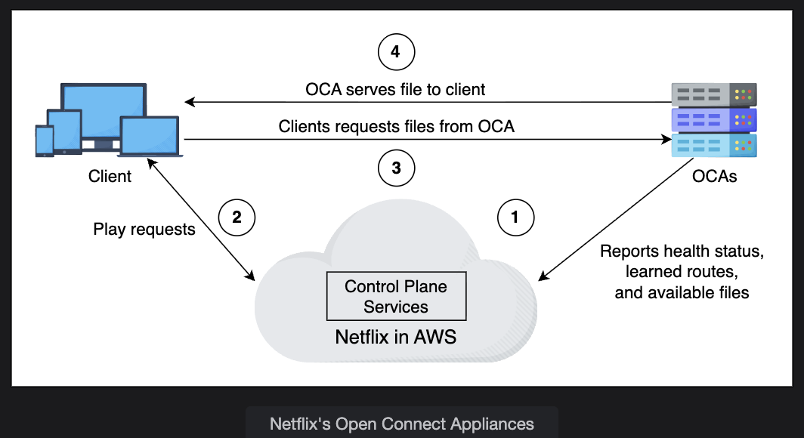

# In-Depth Investigation of CDN (Part 2)

## Topics Covered:

- Content consistency mechanisms
- Proxy server deployment
- CDN as a Service vs. Specialized CDN

## 🎯 1. What Is Content Consistency in a CDN?

When users request data (like images, videos, or API responses), the CDN serves it from its cache (proxy server) instead of always hitting the origin server.

However, that creates a challenge:

❗ **What if the content on the origin server changes, but the CDN still serves the old (stale) version?**

This is called a **content inconsistency problem**.

So, CDNs must ensure that:

- Cached content = Up-to-date version on the origin
- Users don't see outdated data

This is where **content consistency mechanisms** come into play.

## ⚙️ 2. Why Is Consistency Important?

Without proper consistency:

- Users may see old product prices, outdated news, or stale images
- Businesses can face trust issues and incorrect transactions
- Cache efficiency decreases because of redundant re-fetching

CDNs use different consistency mechanisms depending on:

- Whether it's a push or pull model
- The content type (static vs. dynamic)
- The frequency of change

## 🔄 3. Content Consistency Mechanisms

Let's discuss the three main consistency mechanisms used by CDNs:

### 🕒 (a) Periodic Polling

#### 🔹 Concept

In the **pull CDN model**, the proxy server periodically checks with the origin server for updated content.

If any change is detected, it updates the cached data.

#### 🔹 Example

Every 10 minutes, the CDN proxy server sends a request:

```
Hey origin, has the file "news.html" changed?
```

- **If yes** → fetch the new version
- **If no** → keep using the cached copy

#### 🔹 Problem

If the data rarely changes (like a logo image), these periodic polls waste bandwidth and processing time.

To solve this, a concept called **TTR (Time-To-Refresh)** is used.

#### 🧭 Time-To-Refresh (TTR)

TTR determines how frequently a proxy should check for updates.

- **Short TTR** → more frequent updates (good for dynamic data)
- **Long TTR** → less frequent updates (good for static data)

However, even with TTR, unnecessary polling can happen for unchanged content — leading us to a better mechanism: **TTL**.

### ⏳ (b) Time-To-Live (TTL)

#### 🔹 Concept

Instead of polling periodically, each content object has a **TTL (expiration time)** assigned by the origin server.

For example:

```
Image: TTL = 3600 seconds (1 hour)
```

That means:

- The CDN proxy serves this image from cache for 1 hour
- After 1 hour (when TTL expires), it checks the origin:
  - **If content has changed** → fetch and update cache
  - **If not** → renew TTL and keep using cached data

#### 🔹 Benefit

- Reduces unnecessary network calls
- Keeps content fresh
- Saves bandwidth and origin load

#### 🔹 Example in Real Life

When you see:

```http
Cache-Control: max-age=3600
```

in HTTP headers — that's TTL in action.

### 📜 (c) Leases

Leases are a more intelligent and adaptive way to maintain consistency.

#### 🔹 Concept

The origin server grants a **lease** to the proxy server for a fixed time interval.

This lease means:

**"For the next X minutes, I (origin) will notify you (proxy) if the content changes."**

So the proxy doesn't need to poll the origin repeatedly.

#### 🔹 Workflow

1. Proxy requests content from origin
2. Origin sends content + a lease time (say, 30 minutes)
3. If the content changes within 30 minutes, the origin notifies the proxy
4. Proxy renews the lease when it expires

#### 🔹 Benefits

- Significantly reduces the number of update messages
- Keeps cache fresher with minimal communication
- Can adapt dynamically — e.g., extend lease duration when load is high or content changes rarely

#### 🔹 Adaptive Lease

When system load is high, the origin can:

- Increase lease duration to reduce communication
- Shorten lease for rapidly changing content

This is known as **adaptive leasing**.

## 📊 Summary Table of Consistency Mechanisms

| Mechanism | Used In | How It Works | Pros | Cons |
|-----------|---------|--------------|------|------|
| **Periodic Polling** | Pull CDN | Proxy checks origin periodically | Simple, easy to implement | Wastes bandwidth if content rarely changes |
| **TTL (Time-To-Live)** | Push & Pull CDN | Content expires after TTL; then proxy checks origin | Efficient, widely used | May serve slightly stale data until TTL expires |
| **Lease** | Push CDN | Origin grants lease and notifies proxy on update | Low communication overhead, dynamic | Complex to manage, requires callback mechanism |

## 💡 4. Real-Life Example

Imagine a news website that uses a CDN:

| Content Type | CDN Model | Consistency Mechanism | Why |
|--------------|-----------|----------------------|-----|
| Logo Image | Push CDN | TTL (6 hours) | Rarely changes |
| Home Page News Feed | Pull CDN | Periodic Polling (every 1 min) | Updates frequently |
| Stock Prices API | Push CDN | Lease (1 min adaptive) | Must be near real-time but efficient |

## 🧩 5. Key Takeaways

- **Periodic polling** → simple but bandwidth-heavy
- **TTL-based caching** → efficient for moderately dynamic data
- **Leases** → advanced, origin-driven consistency, efficient for large-scale CDNs

Together, these techniques ensure that:

- ✅ Users get fresh data
- ✅ Bandwidth and server load are minimized
- ✅ Origin servers aren't overloaded with redundant requests

---
# Deployment of CDN Proxy Servers

## 🎯 Goal:

To determine where and how to deploy CDN proxy servers to:

- Minimize latency
- Maximize cache hit ratio
- Reduce bandwidth costs
- Improve user experience

## 🧩 1. The Key Questions Before Deployment

Before installing CDN infrastructure, you must answer two fundamental questions:

1. **Where should we place the CDN proxy servers?**
   - → Optimal geographical and network placement for maximum coverage and minimum latency

2. **How many CDN proxy servers should we install?**
   - → Enough to handle traffic, but not so many that it increases cost and redundancy

## 🏗️ 2. Placement of CDN Proxy Servers

### 📍 A. Where to Place the Servers

CDN proxy servers should be installed in network locations with the best connectivity to end-users.

There are two main approaches:

| Type | Description | Example | Pros | Cons |
|------|-------------|---------|------|------|
| **On-Premises (Near IXPs)** | Servers are deployed in data centers near Internet Exchange Points (IXPs) | Google's IXP-level infrastructure | Fast backbone connections, control over performance | Higher cost, requires management of physical infrastructure |
| **Off-Premises (Inside ISPs)** | Servers are placed inside Internet Service Providers' (ISP) networks | Akamai, Netflix Open Connect | Very low latency, close to users | Less control, depends on ISP agreements |

### 💡 What Are IXPs?

An **IXP (Internet Exchange Point)** is a physical infrastructure through which Internet Service Providers (ISPs) and Content Delivery Networks (CDNs) exchange Internet traffic between their networks.

📌 Think of it as a **"meeting point"** where traffic from different networks can transfer efficiently.

## 🚀 3. Real-World CDN Deployment Examples

### 🔹 Akamai & Netflix: Inside ISP Networks

Akamai and Netflix deploy proxy servers directly inside ISPs.

This means when you stream a Netflix movie, the data often doesn't leave your ISP's network — it's already cached nearby.

**Benefits:**

- Lower latency (faster video start)
- Reduced backbone Internet traffic
- Cost savings for ISPs (less external bandwidth)

### 🔹 Google: IXP-Level Infrastructure

Google uses a slightly different model:

- They maintain persistent TCP connections between their IXP-level servers and their main data centers
- They use **Split TCP** — this splits the user's connection:
  - The user's TCP connection terminates at the IXP node
  - Then, data is forwarded via already-open, high-speed TCP connections to Google's main data centers

### ⚙️ Why Google Uses Split TCP

Normally, a TCP connection has two latency overheads:

1. Three-way handshake (connection setup)
2. Slow-start (gradual increase in data transfer rate)

By using Split TCP, Google:

- Avoids these delays on long-distance routes
- Only performs handshake and slow start within the local IXP region (very low round-trip delay)
- Reuses pre-established, high-throughput connections to the main data centers

✅ **Result:** Substantially reduced latency and faster response time for end-users.

### 🔮 Predictive Push (Future Research)

Predictive push involves AI or analytics-driven caching — predicting what content will be requested next and pre-pushing it closer to users before they ask for it.

**For example:**

If many users in Delhi watch a new trailer, the CDN might pre-push that trailer to edge servers across North India.

This area is an active research field in CDN optimization.

## 📏 4. Measuring Optimal Placement

To decide how many and where to place CDN proxy servers, measurement and modeling tools are used.

One such tool is **ProxyTeller**.

### 🔹 ProxyTeller

It evaluates potential CDN deployments using three main performance parameters:

| Metric | Meaning |
|--------|---------|
| **Hit Ratio** | % of requests served from cache (higher = better) |
| **Network Bandwidth** | How much external bandwidth is consumed |
| **Client-Response Time (Latency)** | How fast the client receives data |

It recommends:

- The optimal number of proxy servers
- The best placement locations (geographical or network)

## ⚙️ 5. Other Proxy Placement Algorithms

Apart from ProxyTeller, other algorithms can be used:

| Algorithm | Description |
|-----------|-------------|
| **Greedy Algorithm** | Iteratively places servers at locations that give the most immediate performance gain |
| **Random Placement** | Used for baseline or testing; servers placed randomly to observe impact |
| **Hotspot Algorithm** | Focuses on placing proxies where traffic density (user demand) is highest |

📊 Real-world CDNs often combine these strategies based on traffic heat maps, regional latency, and cost analysis.

## 🧠 6. Why ISPs Benefit from Hosting CDN Nodes

When CDNs like Akamai or Netflix place servers inside an ISP's network, it's a win-win relationship.

### 💰 Economic Benefits

- The ISP reduces the external (international) bandwidth cost
- They can negotiate Service Level Agreements (SLAs) with the CDN providers for revenue or cost benefits

### ⚡ Performance Benefits

- Content is served locally, often just one network hop away
- Users experience faster load times, especially for streaming and large files

### 🏆 Competitive Advantage

- ISPs offering better content speed and reliability attract more customers
- Improves QoE (Quality of Experience) for end-users

## 📊 Example Summary Table

| Deployment Type | Example | Latency | Control | Cost | Ideal For |
|-----------------|---------|---------|---------|------|-----------|
| **ISP-Level (Off-Premises)** | Akamai, Netflix | 🔥 Lowest | Medium | Lower for ISP | Popular, static, or streaming content |
| **IXP-Level (On-Premises)** | Google, Cloudflare | ⚡ Very Low | High | Higher | Dynamic, large-scale, personalized content |

## 🧩 7. Summary

| Concept | Key Idea |
|---------|----------|
| **Deployment Question 1:** | Where should we place CDN proxy servers? → Near IXPs or inside ISPs |
| **Deployment Question 2:** | How many should we install? → Based on hit ratio, bandwidth, latency |
| **ProxyTeller Tool** | Helps measure optimal placement |
| **Split TCP** | Reduces handshake and slow-start delay |
| **Predictive Push** | Future method to pre-cache content near users |
| **ISP Benefits** | Lower cost, happier customers, competitive edge |

## ✅ Final Takeaways

- Placing CDN nodes closer to users (inside ISPs or IXPs) reduces latency and improves speed
- Tools like ProxyTeller help determine optimal number and placement of CDN servers
- Techniques like Split TCP and Predictive Push further reduce latency
- ISPs benefit economically and technically from hosting CDN nodes

---

# CDN as a Service vs Specialized CDN

## 🧩 1. The Big Picture

When a company wants to distribute content (like videos, images, or web pages) faster to users across the world, it has two main choices:

1. **Use an existing CDN provider** (like Cloudflare, Akamai, AWS CloudFront, Fastly) — this is called **CDN as a Service**

2. **Build their own CDN** — this is called a **Specialized (or Private) CDN**

Each choice has trade-offs in cost, control, scalability, and risk.

## ☁️ 2. CDN as a Service (Public CDN)

### 🏗️ What It Is

Most companies don't build their own CDN from scratch. Instead, they rent or subscribe to an existing CDN service — just like using cloud hosting.

### 🧠 How It Works

1. The company signs a contract with a CDN provider (like Akamai, Cloudflare, or AWS CloudFront)

2. The company uploads its content (or configures origin pull) so that the CDN caches that content on its edge proxy servers around the world

3. When users access the company's site, the nearest CDN node delivers the data, reducing latency

### 🌍 Example

Suppose Etsy.com uses Cloudflare CDN:

- Cloudflare has servers across 200+ cities globally
- When a user in India requests an Etsy product image, the image is served from the nearest Cloudflare edge node in Mumbai
- Etsy never manages these servers directly — Cloudflare handles that

### ✅ Advantages of CDN as a Service

| Benefit | Description |
|---------|-------------|
| **No infrastructure management** | The CDN provider maintains all hardware, routing, and caching systems |
| **Instant scalability** | Easily reach users across multiple continents using existing CDN presence |
| **High reliability** | Providers use redundancy, failover, and global PoPs for uptime |
| **Pay-as-you-go** | You only pay for the traffic you use (OPEX, not CAPEX) |

### ⚠️ Concerns and Limitations

Even though CDN as a Service is convenient, it comes with some risks and dependencies:

#### Dependency on CDN Provider

- If the CDN goes down, your content becomes unavailable
- **Example:** If Akamai experiences a global outage, many dependent websites could go offline temporarily

#### Limited Geographic Presence

- Some CDNs don't have proxy servers in certain countries or regions
- Users in those locations may experience higher latency or no access

#### Government or ISP Restrictions

- Some CDN domains or IP ranges may be blocked in certain countries (e.g., content censorship in China or Middle East regions)

#### Limited Control

- You can't modify caching logic deeply or control network-level behavior — it's all managed by the CDN vendor

### 🧩 Note:

Some companies, especially large ones like Netflix, prefer building their own CDN instead of relying entirely on public providers. This leads to the **Specialized CDN** model.

## 🏢 3. Specialized CDN (Private CDN)

### 🏗️ What It Is

A **specialized CDN** (also called a **private CDN**) is built, owned, and managed by the content provider itself. It's custom-designed to serve only its own traffic — not for the general public.

Each PoP (Point of Presence) in this network consists of caching servers, reverse proxies, or application delivery controllers (ADCs).

These servers are optimized for that company's specific content (e.g., videos, gaming assets, etc.).

### 💸 Buy vs Build Decision

Building a CDN from scratch involves:

- High initial setup cost (hardware, deployment, bandwidth contracts, maintenance)
- But lower long-term costs if you serve massive traffic

Hence, it's a **"Buy vs Build"** tradeoff:

| Option | Short-Term | Long-Term | Best For |
|--------|------------|-----------|----------|
| **CDN as a Service** | Cheaper initially | More expensive as scale grows | Startups, small/medium companies |
| **Specialized CDN** | Expensive initially | Cheaper long-term at scale | Large-scale streaming/gaming companies |

### ⚙️ How Specialized CDNs Work

Let's take **Netflix's Open Connect** as the best example.

Netflix built its own CDN infrastructure, called the **Open Connect Appliance (OCA)** network.

Each OCA Node:

- Caches Netflix video content locally (e.g., popular shows/movies)
- Reports health and metrics to the Open Connect control plane hosted on AWS
- Is deployed either:
  - Inside ISPs' networks, or
  - At IXPs (Internet Exchange Points)

**Monitoring:**

All OCA nodes are continuously monitored by Netflix's operations team to ensure smooth functioning and route optimization.

### 🔍 Why Netflix Built Its Own CDN

| Reason | Explanation |
|--------|-------------|
| **Explosive Growth in Demand** | CDN vendors (like Akamai) couldn't scale fast enough to meet Netflix's video streaming traffic |
| **Rising CDN Costs** | Paying for third-party CDNs became extremely expensive at global streaming scale |
| **Data Security** | Netflix needed full control over its video library to prevent data leaks |
| **Performance Optimization** | Full control allowed Netflix to customize TCP algorithms, HTTP modules, and streaming protocols for optimal video delivery |
| **Content Retention** | Netflix wanted to keep popular shows cached longer, which was cost-prohibitive on rented CDNs |

### 💾 Netflix Open Connect Architecture Overview

```
Users (Viewers)
   ↓
ISP-Level OCA (Netflix Appliance)
   ↓
Regional PoP or IXP-Level Node
   ↓
Netflix Origin Servers (AWS)
```

- OCAs serve 95%+ of Netflix traffic directly from local caches
- Only new or rare content comes from Netflix's origin (AWS)
- The hit ratio (~95%) ensures minimal bandwidth to the origin

### 🧠 Specialized CDN Benefits

| Benefit | Description |
|---------|-------------|
| **Full control** | Custom routing, caching, and connection handling |
| **Cost efficiency at scale** | Avoids recurring CDN service charges |
| **Data protection** | Sensitive content stays within company-controlled servers |
| **Optimized for business use case** | Tailored caching and protocols (e.g., adaptive video streaming) |

### ⚠️ Specialized CDN Drawbacks

| Drawback | Explanation |
|----------|-------------|
| **High upfront cost** | Requires large investment in infrastructure, PoPs, and operations |
| **Operational complexity** | You must manage routing, failover, monitoring, and scaling yourself |
| **Limited reach initially** | Building global presence takes time compared to existing CDNs |


 
## 🔁 4. Coexistence: Hybrid CDN Model

Many large companies use a **hybrid approach**:

- They build a private CDN for their most popular, high-traffic content
- They fallback to a public CDN (like CloudFront or Akamai) for:
  - Backup capacity during outages
  - Low-demand regions where private CDN isn't deployed

### 📌 Example:

Netflix uses its Open Connect for 95% of traffic but still relies on AWS for control-plane services and some content management.

## 🧩 5. Summary Comparison

| Aspect | CDN as a Service (Public CDN) | Specialized CDN (Private CDN) |
|--------|-------------------------------|-------------------------------|
| **Ownership** | Third-party | Owned by content provider |
| **Setup Cost** | Low | High |
| **Scalability** | Instant (global PoPs) | Gradual (requires deployment) |
| **Customization** | Limited | Full control |
| **Security** | Controlled by vendor | Fully internal |
| **Example** | Cloudflare, Akamai, AWS CloudFront | Netflix Open Connect |
| **Use Case** | Websites, SaaS, small-medium companies | Video streaming, gaming, large-scale apps |

## 🧩 6. Final Key Takeaways

- **CDN as a Service** = Quick setup, less control, pay-as-you-go model
- **Specialized CDN** = High control, high performance, suitable for massive traffic
- **Netflix Open Connect** = Gold standard example of specialized CDN achieving 95% cache hit ratio
- **Hybrid models** combine both worlds for flexibility and reliability
