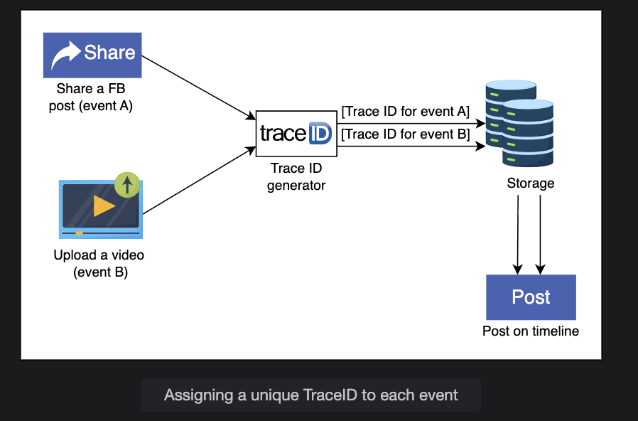

# 🧩 System Design: Sequencer (Unique ID Generator)

## 🧠 1. Motivation — Why Do We Need a Sequencer?

In large distributed systems, millions of events happen every second across multiple servers, data centers, and services. Each event — like a Facebook post, a tweet, a comment, or a photo upload — must be uniquely identifiable.

Without unique IDs, it's impossible to:

- Track or debug specific events
- Ensure data consistency
- Associate related operations (like tracing a request across microservices)
- Maintain order or causality between events

Let's see some real-world motivations 👇


### ✅ 1.1. Example Scenarios

| Use Case | Why We Need Unique IDs |
|----------|------------------------|
| **Social Media Posts** | Two users can post at the same time; each post needs a distinct ID |
| **Database Records** | Every record in a distributed database must have a unique primary key |
| **Event Logging & Tracing** | IDs (like TraceID) help link logs across microservices for debugging |
| **Caching & Messaging** | Message queues (Kafka, RabbitMQ) and cache keys must be uniquely identified to prevent duplication or loss |

### 🧩 1.2. The Distributed Challenge

Traditional relational databases use auto-increment IDs (1, 2, 3, …). But that works only in a single-node system — not in distributed ones.

**Example problem:**

- You have multiple database shards or servers generating IDs in parallel
- Each one might start counting from 1
- **Result:** Duplicate IDs → data inconsistency, overwrites, and chaos

Hence, we need a **distributed unique ID generator (sequencer)** that:

- Works across multiple nodes
- Produces unique IDs globally
- Is time-ordered (so newer events have higher IDs)
- Is fast and fault-tolerant

## 🕓 2. Why a Time-Sortable Unique ID Generator?

### 🔍 2.1. The Need for Ordering

If every ID is just unique but not ordered, we lose information about event sequence.

**For example:**

A tweet with ID X happened before another tweet with ID Y.

If IDs are time-sortable, we can determine this just by comparing IDs.

This is critical for:

- **Event logs and debugging** → "Which request came first?"
- **Feed generation systems** → "Show the newest post first."
- **Causal ordering** → Understanding dependencies between distributed operations

### 🕰️ 2.2. Benefits of Time-Sortable IDs

| Benefit | Description |
|---------|-------------|
| **Causality** | IDs reflect the order of creation; newer events have higher IDs |
| **Efficient Sorting** | You can sort data (like posts or messages) simply by ID |
| **Indexing Optimization** | Time-ordered inserts are efficient in databases (especially on B-trees) |
| **Debugging and Tracing** | Easier to reconstruct event flow and latency patterns |

**Example:** If IDs embed a timestamp, logs can be merged across microservices without needing explicit timestamps everywhere.

## ⚙️ 3. How Do We Design a Sequencer?

Designing a distributed unique ID generator involves balancing uniqueness, ordering, and scalability.

We'll break it down into two parts (like mentioned in your text):

### 🧩 Part 1 — Design of a Unique ID Generator

**Objective:** Generate globally unique IDs in a distributed environment.

#### Three Common Approaches:

| Approach | Description | Pros | Cons |
|----------|-------------|------|------|
| **1. UUID (Universally Unique Identifier)** | 128-bit random identifier (like `550e8400-e29b-41d4-a716-446655440000`) | Simple, decentralized, no coordination needed | Not time-sortable, larger storage size, poor indexing |
| **2. Database Auto-Increment + Coordination** | Use a central DB or coordination service (like Zookeeper) to assign IDs | Simple to implement | Single point of failure, limited scalability |
| **3. Range Handler (Segment Allocation)** | Pre-allocate ID ranges to different servers. Each server generates IDs within its range | No contention, good scalability | Requires coordination when range exhausted |

🧠 **Key trade-off:** UUIDs are scalable but unordered; DB-based are ordered but not scalable. Hence, systems like Twitter Snowflake combine both ideas.

### 🧩 Part 2 — Unique IDs with Causality (Time-Based Sequencer)

This adds time awareness to IDs so they become sortable and traceable.

**Design Principle:** Embed timestamp + machine info + sequence number into the ID.

A common 64-bit structure (like Twitter Snowflake) looks like this:

| Bits | Field | Description |
|------|-------|-------------|
| 41 | **Timestamp** | Time in milliseconds since a custom epoch |
| 10 | **Machine ID** | Identifies the data center and server |
| 12 | **Sequence Number** | Counter for IDs generated in the same millisecond |
| 1 | **Sign Bit** | Reserved / unused |

**Example:**

```
ID = [timestamp | machine_id | sequence]
```

**Benefits:**

- IDs are **unique** (machine and sequence bits ensure no collisions)
- IDs are **time-ordered** (higher timestamp → later event)
- IDs are **scalable** (many nodes can generate independently)

## 🔄 4. Real-World Example — Facebook Canopy

Facebook's Canopy tracing system uses a **TraceID** for every request. When a user performs an action (like loading a post):

- That request touches hundreds of microservices
- Each microservice logs events under the same TraceID
- Developers can then reconstruct the entire call graph or performance bottleneck

💡 This works only if IDs are globally unique and traceable — exactly what a sequencer provides.

## 🧭 5. Summary

| Concept | Description |
|---------|-------------|
| **Goal** | Generate unique, time-sortable identifiers for distributed systems |
| **Why Unique?** | To distinguish millions of parallel events and avoid collisions |
| **Why Time-Sortable?** | To preserve order and causality for debugging, analytics, and feed sorting |
| **Common Designs** | UUID, DB auto-increment, range handlers, or hybrid time-based models (like Snowflake) |
| **Real-World Use** | Facebook Canopy (TraceIDs), Twitter Snowflake, Instagram Media IDs, Kafka offsets, etc. |

### 💬 In short:

A sequencer is a distributed, time-aware unique ID generator that ensures every event in a global system is traceable, ordered, and uniquely identifiable — forming the backbone for observability, scalability, and reliability in modern large-scale systems.
