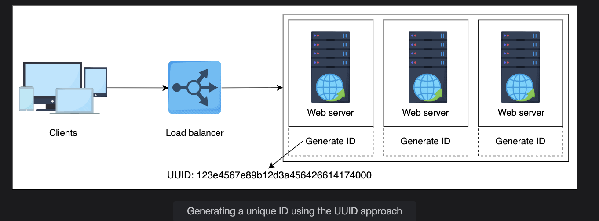
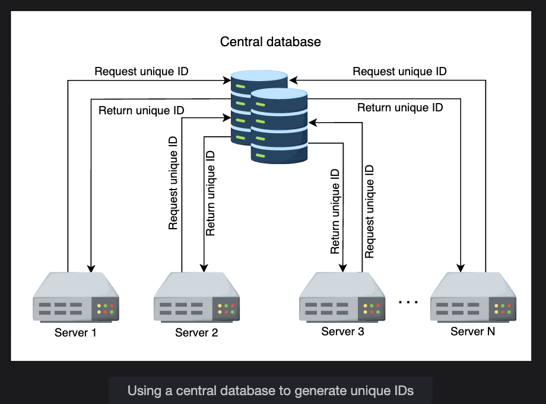
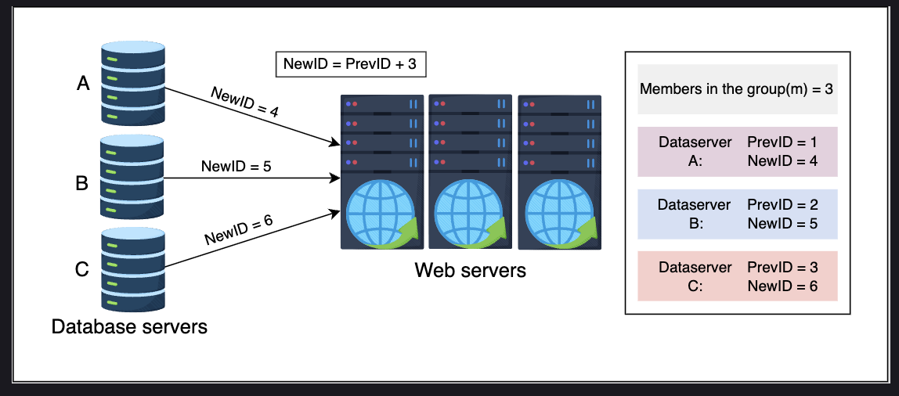
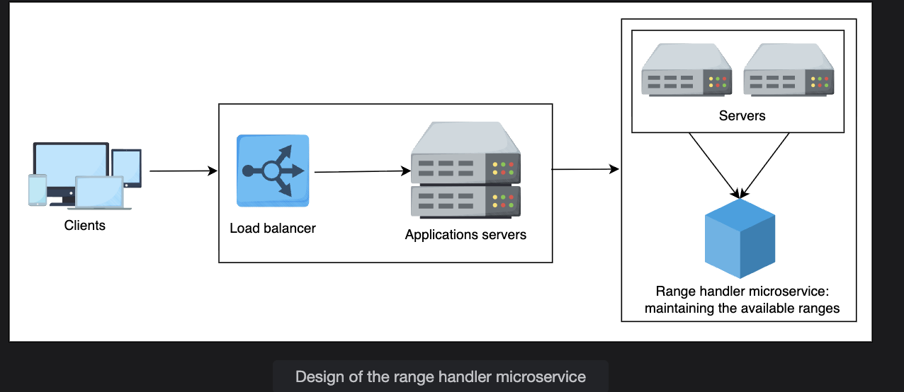

# System Design: Unique ID Generator

In large-scale distributed systems, every event or record must be identified uniquely — whether it's a tweet, a Facebook comment, or an entry in a distributed database. But ensuring uniqueness, scalability, and availability simultaneously is non-trivial when multiple servers are generating IDs concurrently.

Let's explore how to design a system that can generate globally unique, numeric, scalable identifiers.

## 🎯 1. Requirements for Unique Identifiers

| Requirement | Description |
|-------------|-------------|
| **Uniqueness** | Every event must have a distinct identifier. No duplicates — ever |
| **Scalability** | Should support billions of IDs per day without bottlenecks |
| **Availability** | Should not block or fail even if one server or node goes down |
| **64-bit Numeric ID** | The ID must be 64 bits long (sufficient for future scale) |

### 🔢 Why 64-bit Is Enough

Let's verify that 64 bits can support billions of IDs per day for millions of years.

**Calculations:**

- 2^64 = 1.84 × 10^19 possible IDs

If we generate 1 billion IDs per day:

- 365 × 10^9 IDs/year

Then time to wrap around:

- 2^64 / (365 × 10^9) ≈ 50,539,024 years

✅ **Result:** A 64-bit space is more than enough for our foreseeable needs.

## 🧩 2. First Solution — Using UUID

A simple approach is to use **UUID (Universally Unique Identifier)**.

**Example UUID (Version 4):**

```
123e4567-e89b-12d3-a456-426614174000
```

This is a 128-bit random number, usually represented in hexadecimal.




### 🏗️ How It Works

Each machine independently generates random 128-bit IDs using a UUID library. There's no coordination required between servers.

| Property | Description |
|----------|-------------|
| **No Central Dependency** | Each server can generate IDs independently |
| **Highly Scalable** | No synchronization needed between nodes |
| **Low Collision Probability** | Probability of collision is practically zero |

### ❌ Cons of UUID

| Drawback | Explanation |
|----------|-------------|
| **Not 64-bit** | UUIDs are 128 bits — twice our target size |
| **Not Numeric** | Harder for databases to index efficiently |
| **Not Ordered** | Random IDs can't represent creation order |
| **Indexing Overhead** | Slower inserts because of large key size |

### ✅ Evaluation: UUID

| Requirement | Fulfilled? |
|-------------|------------|
| Unique | ✖️ (Almost unique, but not deterministically) |
| Scalable | ✔️ |
| Available | ✔️ |
| 64-bit Numeric | ✖️ |

## 🧱 3. Second Solution — Using a Database

Databases like MySQL or PostgreSQL have auto-increment IDs — e.g., 1, 2, 3, 4, …

We can mimic that logic using a centralized ID provider database.





### 🏗️ How It Works

1. Maintain a table `sequence` with a single column `current_id`
2. Each time an event happens:
   - Fetch `current_id`
   - Return it as the unique ID
   - Increment by 1

### ⚠️ Problem — Single Point of Failure

If this central database goes down, 🚨 all ID generation stops.



### ⚙️ Improved Version — Multi-DB Increment Strategy

To fix the bottleneck, we can:

- Use `m` = number of DB servers
- Each DB increments by `m` instead of 1

**Example:**

If `m = 3` servers:

| Server | Generated IDs |
|--------|---------------|
| A | 1, 4, 7, 10… |
| B | 2, 5, 8, 11… |
| C | 3, 6, 9, 12… |

✅ No collisions when all servers are active.  
🚨 But if one server fails, ID duplication risk arises when reconfiguring `m`.

### 🧠 Example Problem

Suppose Server B fails, and `m` changes from 3 → 2. Now Server A may start generating an ID (say 9) that Server C already created earlier → ❌ collision.

Hence, the database-based approach isn't fully reliable in distributed scenarios.

### ✅ Evaluation: Database Approach

| Requirement | Fulfilled? |
|-------------|------------|
| Unique | ✖️ (Risk of duplication when scaling or failing) |
| Scalable | ✔️ (to some extent) |
| Available | ✔️ |
| 64-bit Numeric | ✔️ |

## 🧮 4. Third Solution — Using a Range Handler

This is the most practical and scalable design.




### 🧠 Core Idea

1. Maintain a central **range handler service**
2. Divide ID space into **chunks (ranges)** — e.g.,
   - Range 1: 1–1,000,000
   - Range 2: 1,000,001–2,000,000
   - Range 3: 2,000,001–3,000,000 …
3. Each application server requests a range from this service
4. The server then generates IDs locally within that range

### 🏗️ How It Works

1. The range handler microservice manages ID ranges
2. When a new server comes online, it asks:
   ```
   Give me a free range.
   ```
3. The handler assigns, say, 300,001–400,000
4. The server:
   - Starts at 300,001
   - Increments locally for each request
   - When it hits 400,000 → requests a new range

### 🖼️ Example Scenario

| Server | Assigned Range | Generated IDs |
|--------|----------------|---------------|
| A | 1–100,000 | 1, 2, 3…100,000 |
| B | 100,001–200,000 | 100,001…200,000 |
| C | 200,001–300,000 | 200,001…300,000 |

✅ All servers can generate IDs independently.  
✅ No collisions.  
✅ High availability.

### ⚙️ Handling Failures

- If the range handler fails → use a failover backup
- The handler's state (allocated ranges) is stored in a replicated datastore
- When restarted, it resumes safely without losing the mapping of assigned ranges

### ⚡ Scaling Across Data Centers

When adding a new data center:

- Distribute range blocks geographically (e.g., by region ID)
- Use consistent hashing to reduce rebalancing
- Apply geo-sharding so nearby users get IDs from the same region (reduces latency)

### ✅ Pros

| Advantage | Description |
|-----------|-------------|
| **No collisions** | Each server has its own exclusive range |
| **Scalable** | Add new servers easily by allocating new ranges |
| **Highly available** | Each server generates locally after range allocation |
| **64-bit numeric** | Range-based IDs fit perfectly within 64-bit |

### ❌ Cons

| Disadvantage | Explanation |
|--------------|-------------|
| **Range loss** | If a server dies mid-range, unused IDs are wasted |
| **Coordination overhead** | Requires a reliable central range handler service |

A common fix is to reduce range size so losses are minimal while still reducing central service calls.

### ✅ Evaluation: Range Handler Approach

| Requirement | Fulfilled? |
|-------------|------------|
| Unique | ✔️ |
| Scalable | ✔️ |
| Available | ✔️ |
| 64-bit Numeric | ✔️ |

## 🧭 5. Summary Comparison

| Approach | Unique | Scalable | Available | 64-bit Numeric |
|----------|--------|----------|-----------|----------------|
| **UUID** | ✖️ | ✔️ | ✔️ | ✖️ |
| **Database** | ✖️ | ✔️ | ✔️ | ✔️ |
| **Range Handler** | ✔️ | ✔️ | ✔️ | ✔️ |

### ✅ Final Choice: Range Handler

It provides a balance of uniqueness, scalability, and availability while maintaining numeric 64-bit IDs.
