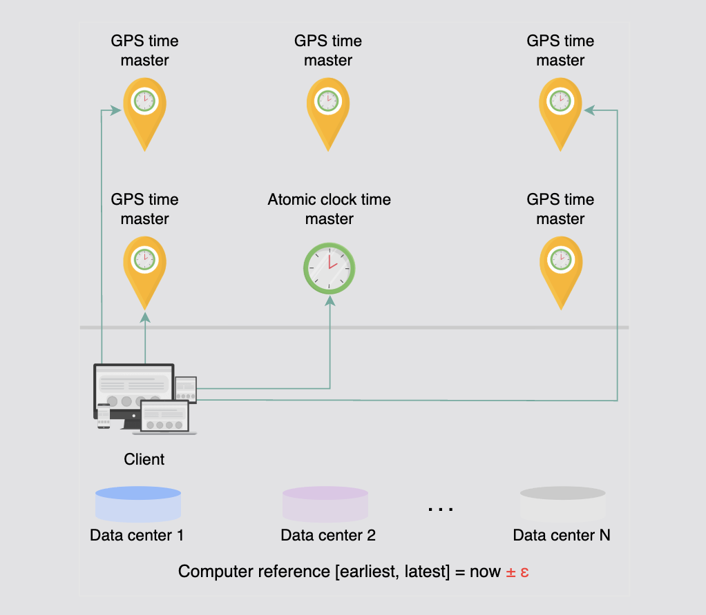
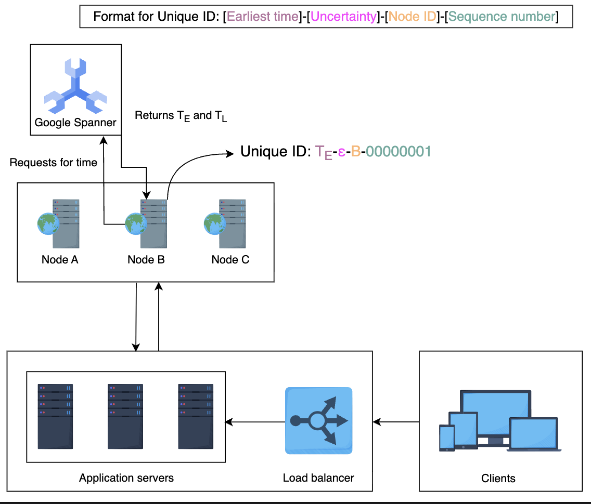

# Causality in Distributed Systems - IDs, Ordering, and Clocks Explained

## Overview

This topic mixes three ideas that often get confused:

1. **Unique IDs**
2. **Ordering of events**
3. **Causality**

Let's explain them slowly, with concrete intuition, then map each clock/approach to what problem it actually solves.

---

## 1️⃣ Why "Unique ID" alone is NOT enough

A unique ID answers only one question:

> "Are these two events different?"

But in distributed systems we also ask:

- "Which event happened before which?"
- "Did one event depend on another?"
- "Or were they independent (concurrent)?"

**That is causality.**

---

## 2️⃣ What exactly is causality?

### Simple rule (very important)

> Event B is causally dependent on event A if B could not have happened unless A happened first.

### Example (Twitter)

**John posts a comment** → Event A

**Peter replies to that comment** → Event B

B depends on A

So we must have:

```
A → B   (A happened-before B)
```

This is **non-concurrent**.

### Concurrent events

**Peter comments on Tweet X**

**John comments on Tweet Y**

These events:

- Don't depend on each other
- Order does NOT matter
- Can happen in parallel

This is **concurrency**, not causality.

---

## 3️⃣ Why do we want IDs that carry causality?

Because some systems must resolve conflicts correctly.

### Example: Distributed Key-Value Store

Two clients update the same key:

```
PUT(x = 5)  ← Client A
PUT(x = 7)  ← Client B
```

**Questions:**

- Did one update overwrite the other?
- Or were they concurrent?
- Which value should win?

To answer this, the system needs **causality information**, not just uniqueness.

---

## 4️⃣ Two big ways to infer causality

There are only two fundamental approaches:

1. **Physical time** (real clocks)
2. **Logical time** (event counters)

Let's go step by step.

---

## 5️⃣ Physical clocks (real time)

### A. Time-of-day clock (wall clock)

**Example:**

```
2026-01-05 10:00:01.123
```

**Problems:**

- NTP can move time backward
- Leap seconds exist
- Clock drift across machines
- Two servers can disagree on "now"

**So time order ≠ event order reliably**

### B. Monotonic counters

**Pros:**

- Always move forward
- High precision
- Good for measuring duration

**But:**

- Not comparable across machines
- Each CPU may have its own counter

👉 **Not usable for global causality**

---

## 6️⃣ Why clock drift is deadly for causality

**Imagine:**

| Server | Local Time |
|--------|------------|
| A | 10:00:05 |
| B | 10:00:00 |

Event on B happens **after** event on A

But timestamp says the opposite ❌

**So physical clocks alone lie in distributed systems.**

---

## 7️⃣ Logical clocks (this is the real solution)

> Logical clocks don't measure time. They measure event order.

### A. Lamport Clock (simple counter)

**Rules:**

1. Every event increments local counter
2. Message carries counter
3. Receiver sets:

```
clock = max(local, received) + 1
```

**Guarantee:**

```
If A → B, then clock(A) < clock(B)
```

**But ❌:**

```
If clock(A) < clock(B), they might still be concurrent
```

**So Lamport clocks can't detect concurrency**

### B. Vector clocks (true causality)

Each node keeps a vector:

```
[A:3, B:7, C:2]
```

**Meaning:**

- A has seen 3 events from A
- 7 from B
- 2 from C

**Comparison rules:**

- `V1 < V2` → V1 happened-before V2
- Neither `<` nor `>` → concurrent

**✅ Can detect:**

- Causality
- Concurrency

**❌ Cost:**

- Vector size grows with number of writers
- Hard to scale

**That's why vector clocks are powerful but expensive**

---

## 8️⃣ Why "happened-before" ≠ real causality

### Important nuance:

Just because:

```
A happened before B
```

does **NOT** mean:

```
B depends on A
```

### Example:

- Peter posts Tweet at 10:00
- John posts unrelated Tweet at 10:01

There is **time order**, but **no causal relationship**

👉 **Application logic is still needed.**

---

## 9️⃣ UNIX timestamps as IDs (time-based IDs)

### Idea

Use:

```
timestamp_in_ms
```

**Max IDs per second:**

```
1000 IDs/sec per server
```

### Pros:

- Simple
- Ordered
- Numeric
- Fits in 64 bits

### Fatal problems

#### ❌ SPOF

If one server generates IDs → single point of failure

#### ❌ Duplicate IDs

Two servers at same millisecond:

```
1700000000000
1700000000000
```

Even with server ID appended:

- Ordering becomes weak
- True causality is not preserved

---

## 🔟 Why timestamp-based IDs have "weak causality"

They assume:

```
earlier timestamp → earlier event
```

**But:**

- Clock drift
- Network delays
- Parallel execution

**Break this assumption.**

So timestamps give:

- Approximate order
- **Not** true happened-before

---

## 1️⃣1️⃣ Why range handler IDs don't preserve causality

Range handler guarantees:

- Uniqueness
- Scalability
- Availability

**But:**

```
ID 1000001
ID 2000001
```

Higher ID does **NOT** mean:

- Happened later
- Depends on previous event

**So:**

❌ No causality  
❌ No ordering semantics

---

## 1️⃣2️⃣ Why there is no perfect solution

This table tells the truth:

| Approach | Unique | Ordered | Causal | Scalable |
|----------|--------|---------|--------|----------|
| UUID | ✔️ | ❌ | ❌ | ✔️ |
| Range handler | ✔️ | ❌ | ❌ | ✔️ |
| UNIX timestamp | ❌ | weak | weak | ✔️ |
| Lamport clock | ❌ | ✔️ | partial | ✔️ |
| Vector clock | ❌ | ✔️ | ✔️ | ❌ |

> 👉 **You must choose what you care about most**

---

## Deep Dive: Comparing Clock Types

### The Trade-off Spectrum

```
Simplicity ←――――――――――――――→ Causality
    
UUID         Timestamp    Lamport    Vector
             Range ID     Clock      Clock

Fast         Medium       Medium     Slow
Scalable     Scalable     Scalable   Limited
No order     Weak order   Partial    Full
No causality Weak causal  One-way    Complete
```

---

## Real-World Examples

### 1. UUID - When you only need uniqueness

**Use case:** Session IDs, request IDs, log correlation

```
550e8400-e29b-41d4-a716-446655440000
```

**Good for:**
- Distributed ID generation
- No coordination needed
- High throughput

**Not good for:**
- Cannot tell which came first
- Cannot detect causality
- Random ordering

---

### 2. UNIX Timestamp - Approximate ordering

**Use case:** Event logs, metrics, approximate sorting

```
1704451200000  // 2024-01-05 10:00:00
```

**Good for:**
- Human-readable time
- Rough ordering
- Simple implementation

**Not good for:**
- Clock skew creates false ordering
- Duplicates possible
- Not true causality

---

### 3. Range Handler - Scalable unique IDs

**Use case:** Database auto-increment replacement

```
Server A: 1000000-1999999
Server B: 2000000-2999999
Server C: 3000000-3999999
```

**Good for:**
- No single point of failure
- Predictable ID space
- High throughput

**Not good for:**
- ID from Server B can come before Server A
- No time information
- No causality

---

### 4. Lamport Clock - Partial ordering

**Use case:** Distributed logs, message ordering

```
Event A: LC=5
Event B: LC=8
Event C: LC=12
```

**Good for:**
- Detecting if A happened before B
- Simple to implement
- Low overhead

**Not good for:**
- Cannot detect concurrent events
- LC(A) < LC(B) doesn't mean A caused B

**Example:**

```
Node A: [0] → [1] → [2] → [3]
Node B:      [1] → [2] → [3] → [4]

Message from A:2 arrives at B
B updates: max(2, 2) + 1 = 3
```

---

### 5. Vector Clock - True causality

**Use case:** Distributed databases, conflict resolution

```
Version 1: [A:1, B:0, C:0]
Version 2: [A:1, B:2, C:0]
Version 3: [A:0, B:2, C:1]
```

**Good for:**
- Detecting causality
- Detecting concurrency
- Conflict resolution

**Not good for:**
- Vector size grows with writers
- Comparison is O(n)
- Hard to scale

**Example:**

```
V1 = [A:2, B:1, C:0]
V2 = [A:3, B:1, C:0]

V2 > V1 → V2 happened after V1 (causal)

V3 = [A:2, B:0, C:1]
V4 = [A:1, B:2, C:0]

V3 ≠ V4 → concurrent (no causality)
```

---

## Decision Matrix

### Choose UUID when:
- ✅ You only need uniqueness
- ✅ High throughput matters
- ✅ No ordering needed
- ❌ Don't care about when events happened

### Choose Timestamp when:
- ✅ Approximate ordering is fine
- ✅ Human-readable time helps
- ✅ You can tolerate duplicates
- ❌ Don't need strict ordering

### Choose Range Handler when:
- ✅ Need numeric IDs
- ✅ High availability required
- ✅ Can partition ID space
- ❌ Don't need time information

### Choose Lamport Clock when:
- ✅ Need event ordering
- ✅ Want low overhead
- ✅ One-way causality is enough
- ❌ Don't need concurrency detection

### Choose Vector Clock when:
- ✅ Need true causality
- ✅ Must detect concurrency
- ✅ Limited number of writers
- ❌ Can accept complexity

---

## The Fundamental Impossibility

### What we want:
- Unique IDs
- Total ordering
- Causality tracking
- Scalability
- Low overhead

### What's possible:
**Pick at most 3.**

This is similar to CAP theorem - you cannot have everything.

---

## Key Insights

### 1. Uniqueness ≠ Ordering

```
UUID: 550e8400-e29b-41d4-a716-446655440000
UUID: 6ba7b810-9dad-11d1-80b4-00c04fd430c8

Which came first? Cannot tell.
```

### 2. Ordering ≠ Causality

```
Event A at 10:00:00
Event B at 10:00:01

B came after A, but did B depend on A? Cannot tell.
```

### 3. Physical Time ≠ Logical Time

```
Server A clock: 10:05
Server B clock: 10:00

Event on B happens AFTER event on A
But timestamps say opposite.
```

### 4. Happened-before ≠ Caused-by

```
Tweet A posted at 9am
Tweet B posted at 10am

B happened after A
But B didn't depend on A
No causal relationship
```

---

## Best Practices

### For Web Applications
Use **UUID** or **Snowflake ID** (timestamp + machine + sequence)

### For Distributed Databases
Use **Vector clocks** with truncation or **Hybrid Logical Clocks**

### For Event Sourcing
Use **Lamport clocks** or **Timestamp + sequence number**

### For Microservices
Use **UUIDs** for request tracing, **timestamps** for logging

### For Conflict Resolution
Use **Vector clocks** or **CRDTs** (which use vector clocks internally)

---

## Final Wisdom

> "In distributed systems, there is no global now."
> 
> — Leslie Lamport

**The best solution depends on your specific requirements:**

- Need to **identify** events? → UUID
- Need to **order** events? → Timestamp or Lamport
- Need to **understand causality**? → Vector clock
- Need to **scale globally**? → Compromise on perfect causality

**Remember:** Every distributed system makes trade-offs. Choose consciously.


# Snowflake ID - Complete Deep Dive

## Introduction

Snowflake looks simple on the surface, but the **why** behind every bit and the hidden failure modes are what usually confuse people.

Let's build this from first principles, then layer the Snowflake design on top.

---

## 1️⃣ What problem Snowflake is trying to solve (exactly)

Snowflake is **not** trying to solve full causality.

It is trying to solve this **specific combination**:

✅ Globally unique IDs  
✅ High throughput (millions/sec)  
✅ No central DB / no coordination per ID  
✅ Numeric, 64-bit  
✅ Roughly time-ordered  

❌ Perfect causality (this is intentionally sacrificed)

**That's the lens you must keep in mind.**

---

## 2️⃣ The 64-bit layout — why this exact split

```
| 1 bit | 41 bits      | 10 bits   | 12 bits |
| sign  | timestamp    | worker ID | sequence|
```

Let's decode **why** each exists, not just what it is.

---

## 3️⃣ Sign bit (1 bit)

- Always **0**
- Keeps the number **positive**
- Avoids signed-long bugs across languages

**No distributed-system magic here** — just engineering hygiene.

---

## 4️⃣ Timestamp (41 bits) — the backbone

### What this timestamp really means

It is:

```
current_time_in_ms - custom_epoch
```

**Using a custom epoch:**

- Saves bits
- Extends usable lifetime

### Why milliseconds?

Because:

- **Microseconds** are unreliable across machines
- **Milliseconds** are realistic with NTP

### Capacity math (important intuition)

```
2^41 milliseconds ≈ 69 years
```

So Snowflake trades:

- **Long-term safety** (69 years)
- For **compact IDs**

This is intentional and acceptable in industry.

---

## 5️⃣ Worker ID (10 bits) — avoiding coordination

```
2^10 = 1024 workers
```

Each worker:

- Can generate IDs **independently**
- **Never clashes** with another worker

### Key idea

> Uniqueness comes from **partitioning the ID space**

This is the same idea as:

- Range handler
- Sharding
- Kafka partitions

Just encoded in bits instead of ranges.

---

## 6️⃣ Sequence number (12 bits) — the real workhorse

```
2^12 = 4096 IDs per millisecond per worker
```

This answers your earlier doubt:

### ❓ What if more than 4096 requests hit in the same millisecond?

**Correct behavior:**

1. The worker **blocks**
2. Waits for the **next millisecond**
3. Resets sequence to **0**

This guarantees:

- No duplication
- Strict ordering within that worker

**So Snowflake trades:**

- Tiny latency (≤ 1 ms)
- For correctness

---

## 7️⃣ How uniqueness is actually guaranteed

An ID is unique because the **tuple** is unique:

```
(timestamp, worker_id, sequence)
```

### Even if:

**Same timestamp, Same sequence**  
→ worker ID differs

**Same timestamp, Same worker**  
→ sequence differs

### Only collision case:

```
Same timestamp
Same worker
Same sequence
```

**Which Snowflake explicitly prevents.**

---

## 8️⃣ Why Snowflake is time-sortable, not time-correct

IDs look like this:

```
[ time ][ worker ][ seq ]
```

So when you sort IDs numerically:

- **Time dominates**
- Worker + sequence refine order

That's why:

- Newer IDs are larger
- Databases love them (append-friendly)

**But ⚠️ this is NOT true causality**

---

## 9️⃣ The "dead period" issue (wasted IDs)

**Dead period** = no IDs generated for some time.

### Example:

1. Time moves forward
2. No requests
3. Timestamp bits still advance

### So:

- Some ID values are **never used**
- This causes:
  - Gaps
  - Earlier exhaustion of the timestamp space

### Why this is acceptable

Because:

- IDs are **identifiers**, not counters
- Gaps don't break uniqueness or ordering

Industry strongly prefers:

> **wasted IDs** > **coordination overhead**

---

## 🔟 The real weakness: physical time dependency

**This is the most important part.**

### Scenario: Clock goes backward

1. Worker A generates IDs at time `T = 1000`
2. NTP adjusts clock backward to `T = 998`
3. Snowflake sees:

```
current_time < last_time
```

### Now what?

**Typical mitigation strategies:**

1. Refuse to generate IDs
2. Block until clock catches up
3. Use last known timestamp

All of these hurt:

- Availability
- Latency
- Simplicity

---

## 1️⃣1️⃣ Why Snowflake has weak causality

### Consider:

- Server A clock is **ahead**
- Server B clock is **behind**
- Event B happens **after** event A
- But `ID(B) < ID(A)`

### So:

```
ID order ≠ happened-before
```

**This violates causality.**

That's why the table says:

> Causality: **weak**

Snowflake only gives:

- Approximate ordering
- **Not** dependency correctness

---

## 1️⃣2️⃣ Why Snowflake still wins in practice

Because **most systems don't need true causality**.

They need:

- Fast writes
- Ordered storage
- Scalable IDs

### Examples:

- Tweets
- Posts
- Logs
- Events
- Messages

For these:

> **"Mostly ordered"** is good enough.

### If causality truly matters:

You need:

- Vector clocks
- Or application-level dependency graphs

**Snowflake is not competing with those.**

---

## 1️⃣3️⃣ One more hidden shortcoming (often missed)

### Worker ID management

Worker IDs must be:

- **Unique**
- **Survive restarts**
- **Not be reused incorrectly**

### If:

```
Two machines get same worker ID → catastrophe
```

This usually requires:

- Zookeeper
- Etcd
- Config service
- Kubernetes StatefulSets

**So Snowflake shifts complexity to infrastructure, not logic.**

---

## 1️⃣4️⃣ Final mental model (lock this in)

### Think of Snowflake as:

> **A distributed, sharded, time-prefixed counter**

- **Time** gives rough order
- **Worker** gives partitioning
- **Sequence** gives local uniqueness

### It is NOT:

- A clock replacement
- A causality engine
- A consensus mechanism

---

## 1️⃣5️⃣ Why logical clocks still matter

**Snowflake answers:**

> "What is a good ID?"

**Logical clocks answer:**

> "What depends on what?"

That's why modern systems often use:

- **Snowflake IDs** for storage
- **Vector/Lamport clocks** for conflict resolution

---

## Final one-line takeaway

> **Snowflake optimizes for scale and order, not truth about time.**

---

## Deep Dive: Bit-by-Bit Breakdown

### Visual Representation

```
┌─┬───────────────────────────────────────┬──────────────┬────────────────┐
│0│     41 bits (timestamp)               │10 bits (ID)  │12 bits (seq)   │
└─┴───────────────────────────────────────┴──────────────┴────────────────┘
 │                                         │              │
 │                                         │              └─ 0-4095 per ms
 │                                         │
 │                                         └─ 0-1023 workers
 │
 └─ Always 0 (positive number)
```

### Example ID Breakdown

**ID:** `1234567890123456789`

Convert to binary:

```
0 | 0001000010100011011001000000111 | 0000000001 | 000000000101
│   │                                │            │
│   │                                │            └─ Sequence: 5
│   │                                │
│   │                                └─ Worker: 1
│   │
│   └─ Timestamp: 17391104007 ms from epoch
│
└─ Sign: 0
```

---

## Real-World Implementation

### Pseudo-code

```python
class SnowflakeIDGenerator:
    def __init__(self, worker_id, custom_epoch):
        self.worker_id = worker_id  # 0-1023
        self.custom_epoch = custom_epoch  # e.g., 1609459200000 (2021-01-01)
        self.sequence = 0
        self.last_timestamp = -1
    
    def generate_id(self):
        timestamp = self.current_time_ms()
        
        # Clock moved backward
        if timestamp < self.last_timestamp:
            raise Exception("Clock moved backward!")
        
        # Same millisecond
        if timestamp == self.last_timestamp:
            self.sequence = (self.sequence + 1) & 4095  # Mask to 12 bits
            
            # Sequence exhausted
            if self.sequence == 0:
                timestamp = self.wait_next_ms(self.last_timestamp)
        else:
            self.sequence = 0
        
        self.last_timestamp = timestamp
        
        # Build the ID
        id = ((timestamp - self.custom_epoch) << 22) | \
             (self.worker_id << 12) | \
             self.sequence
        
        return id
    
    def wait_next_ms(self, last_timestamp):
        timestamp = self.current_time_ms()
        while timestamp <= last_timestamp:
            timestamp = self.current_time_ms()
        return timestamp
    
    def current_time_ms(self):
        return int(time.time() * 1000)
```

---

## Common Pitfalls and Solutions

### 1. Clock Skew Between Servers

**Problem:**

```
Server A: 2024-01-05 10:00:00.500
Server B: 2024-01-05 10:00:00.000

Event on B happens AFTER event on A
But ID(B) < ID(A)
```

**Solutions:**

- Use NTP synchronization
- Accept "approximate ordering"
- Add application-level versioning

### 2. Worker ID Collision

**Problem:**

```
Container A gets worker_id=5
Container A dies
Container B starts and gets worker_id=5
Both generate IDs at same time
```

**Solutions:**

- Use ZooKeeper/Etcd for coordination
- Kubernetes StatefulSets with stable IDs
- Include MAC address or pod name in ID assignment

### 3. Sequence Overflow

**Problem:**

```
4097 requests in same millisecond
Sequence can only go 0-4095
What happens?
```

**Solution:**

```python
if sequence > 4095:
    # Block until next millisecond
    wait_for_next_ms()
    sequence = 0
```

### 4. Custom Epoch Expiry

**Problem:**

```
41 bits = 69 years from custom epoch
If epoch = 2021-01-01
System expires in 2090
```

**Solution:**

- Choose recent epoch to maximize lifetime
- Plan migration strategy
- Consider 64-bit with different split if needed

---

## Comparison: Snowflake vs Alternatives

| Feature | Snowflake | UUID v4 | Database Auto-increment | ULID |
|---------|-----------|---------|------------------------|------|
| Uniqueness | ✅ | ✅ | ✅ | ✅ |
| Sortable | ✅ | ❌ | ✅ | ✅ |
| Size | 64-bit | 128-bit | 64-bit | 128-bit |
| Distributed | ✅ | ✅ | ❌ | ✅ |
| Coordination | Worker ID only | None | DB lock | None |
| Time info | ✅ | ❌ | ❌ | ✅ |
| Clock dependency | ⚠️ Strong | ❌ | ❌ | ⚠️ Strong |
| Causality | Weak | None | Weak | Weak |

---

## When to Use Snowflake

### ✅ Use Snowflake when:

- You need **distributed ID generation**
- **Numeric IDs** are required (database keys)
- **Approximate time ordering** is valuable
- **High throughput** is critical
- You have **infrastructure for worker ID management**

### ❌ Don't use Snowflake when:

- You need **perfect causality**
- You cannot guarantee **clock synchronization**
- You need more than **1024 generators**
- Your system must survive **arbitrary clock jumps**
- You need IDs to be **URL-safe** (use ULID instead)

---

## Advanced: Clock Synchronization Strategies

### 1. NTP with Monitoring

```python
def check_clock_drift():
    ntp_time = get_ntp_time()
    local_time = time.time()
    
    drift = abs(ntp_time - local_time)
    
    if drift > 0.1:  # 100ms
        alert("Clock drift detected: {}s".format(drift))
        
    if drift > 1.0:  # 1s
        halt_id_generation()
```

### 2. Logical Hybrid Clock (HLC)

Combine physical time with logical counter:

```
timestamp = max(physical_time, last_seen_time) + logical_counter
```

This gives:

- Physical time benefits
- Logical clock safety

### 3. TrueTime (Google Spanner approach)

Instead of single timestamp:

```
timestamp = [earliest, latest]  // uncertainty interval
```

Wait until uncertainty passes before committing.

---

## Production Lessons

### Lesson 1: Monitor Clock Skew

```
Max acceptable drift: 100ms
Alert threshold: 50ms
Halt threshold: 200ms
```

### Lesson 2: Worker ID Assignment

```yaml
# Bad: Random assignment
worker_id: random(0, 1023)

# Good: Stable assignment
worker_id: hash(hostname) % 1024

# Best: Coordinated assignment
worker_id: get_from_zookeeper()
```

### Lesson 3: Sequence Exhaustion

```
4096 IDs/ms/worker = 4 million IDs/sec/worker

If you hit this limit:
1. Add more workers
2. Increase sequence bits (reduce worker bits)
3. Consider batch ID generation
```

---

## The Complete Truth Table

| Scenario | Snowflake Behavior | Impact |
|----------|-------------------|--------|
| Normal operation | Generate sequential IDs | ✅ Perfect |
| Clock goes forward | Generate IDs with new timestamp | ✅ Expected |
| Clock goes backward | Throw error or wait | ⚠️ Availability hit |
| Sequence overflow | Wait next millisecond | ⚠️ Tiny latency |
| Worker ID collision | Duplicate IDs | ❌ Catastrophic |
| Two events, server A ahead of B | ID(A) > ID(B) even if B happened after A | ⚠️ Weak causality |

---

## Key Takeaways

### 1. Snowflake is a Pragmatic Compromise

It trades:
- Perfect causality → for → Scalability
- Coordination → for → Speed
- Truth → for → Efficiency

### 2. The Three Guarantees

✅ **Uniqueness:** (timestamp, worker, sequence) tuple is unique  
✅ **Ordering:** IDs are roughly time-ordered  
✅ **Performance:** Millions of IDs per second

### 3. The Three Dependencies

1. **Clock synchronization** (NTP)
2. **Worker ID management** (ZooKeeper/Etcd)
3. **Infrastructure stability** (no arbitrary clock jumps)

### 4. The One Limitation

> **Approximate ordering ≠ True causality**

For true causality, you still need application-level dependency tracking.

---

## Summary

**Snowflake is:**
- A distributed counter with time prefix
- Optimized for scale, not truth
- Perfect for most practical use cases

**Snowflake is NOT:**
- A replacement for logical clocks
- A solution for causality
- Independent of physical time

**Use it when:**
- You need distributed numeric IDs
- Approximate ordering is sufficient
- Performance matters more than perfect causality

**Remember:**
> "In production, good enough and fast beats perfect and slow."

Snowflake embodies this principle.


# Logical Clocks - Complete Deep Dive

## Introduction

This is a deep topic, so I'll explain it slowly, layer by layer, and I'll constantly anchor it to **why systems actually behave this way** instead of just definitions.

---

## 1️⃣ Why we even talk about logical clocks here

So far, all ID strategies you saw (DB, range handler, Snowflake):

- Solve **uniqueness**
- Solve **scalability**
- Sometimes give **approximate ordering**

But they do **not** answer this question:

> "Did event A **cause** event B, or did they just happen around the same time?"

That question is **causality**, not ordering.

**Physical time (timestamps) is unreliable in distributed systems → so we need logical time.**

---

## 2️⃣ Lamport clocks — the simplest logical clock

### Core rule (this is everything):

> If A happened before B, then  
> **Lamport(A) < Lamport(B)**

**But not the reverse.**

---

## 3️⃣ How Lamport clocks work (step-by-step)

Each process keeps:

```
counter = 0
```

### Rules:

1. **Before every local event** → `counter++`
2. **When sending a message** → attach `counter`
3. **When receiving a message with timestamp `t`:**

```
counter = max(counter, t) + 1
```

### Example (concrete)

**Node A:**
```
A1: counter = 1
send msg(timestamp=1)
```

**Node B:**
```
counter = 5
receive msg(1)
counter = max(5,1)+1 = 6
```

Now:

```
A1 (1) → B2 (6)
```

**Correct causality preserved.**

---

## 4️⃣ What Lamport clocks cannot do (very important)

Two events:

```
Event X: timestamp 10
Event Y: timestamp 12
```

**You cannot say:**

```
X → Y
```

They might be:

- Concurrent
- On different nodes
- Unrelated

### Lamport clocks give:

✅ **Partial ordering**  
❌ **No causality detection between arbitrary events**

That's why the text says:

> "We can't simply compare two clock values to infer happened-before."

---

## 5️⃣ Why people still use Lamport clocks

Because they are:

- Simple
- Cheap
- Monotonic
- Useful for ordering logs, commits, messages

### They answer:

> "Give me an order that **respects causality when it exists**."

### They don't answer:

> "Are these two events **causally related**?"

---

## 6️⃣ Vector clocks — full causality tracking

> **Lamport clocks track time**  
> **Vector clocks track history**

### What a vector clock is

Instead of:

```
timestamp = 7
```

We store:

```
[A:2, B:5, C:1]
```

**Meaning:**

> "This event has seen:
> - 2 events from A
> - 5 from B
> - 1 from C"

### Update rules (simple)

**Local event on node A:**
```
A++
```

**Send message:**
- Attach entire vector

**Receive message:**
```
local[i] = max(local[i], received[i]) for all i
then increment own entry
```

---

## 7️⃣ How vector clocks detect causality

Given two vectors **V** and **W**:

### V happened before W if:

```
V[i] ≤ W[i] for all i
AND
V[j] < W[j] for at least one j
```

### Concurrent if:

```
Neither dominates the other
```

**This is true causality, not approximation.**

---

## 8️⃣ Why vector clocks explode in size

Here's the killer problem.

> **Vector clock size = number of participants**

### In theory:

- 3 nodes → 3 counters
- 10 nodes → 10 counters

### In real systems:

- Browsers
- Mobile apps
- IoT devices
- Millions of clients

Now your "ID" becomes:

```
[Client1, Client2, Client3, ..., Client1M]
```

**Impossible to:**

- Store
- Send
- Compare
- Index

That's why the table says:

```
Scalable: weak
ID size: can exceed 64-bit
```

---

## 9️⃣ Why vector clocks are bad as IDs

Vector clocks are:

- **Metadata**
- **Causality trackers**

They are **not** good identifiers because:

- Variable length
- Large
- Hard to index
- Expensive to compare

### They shine in:

- Conflict resolution
- Replicated data stores
- Versioning (e.g., Dynamo-style systems)

---

## 🔟 Why "vector-clock-based IDs" are almost never used

Because IDs must be:

- Compact
- Fast
- Index-friendly
- Stable

**Vector clocks violate all of these.**

So systems **separate concerns**:

| Concern | Tool |
|---------|------|
| Identity | Snowflake / UUID |
| Causality | Vector clocks / HLC |
| Ordering | Logs / offsets |

**Trying to merge all three usually fails.**

---

## 1️⃣1️⃣ Why a "global clock" sounds tempting (but fails)

### The question:

> "Would a global clock solve everything?"

### In theory:

**Yes.**

If:

- One perfect clock
- Zero drift
- Infinite throughput
- Zero latency

Then:

- IDs = timestamps
- Ordering = causality

### In reality:

- Network latency
- Clock skew
- Failures
- Throughput limits

A global clock becomes:

- A bottleneck
- A single point of failure
- A consistency nightmare

That's why the answer says:

> "Time is tricky in distributed systems."

---

## 1️⃣2️⃣ The key trade-off (this is the core lesson)

You **cannot** have all of these perfectly:

- Uniqueness
- Scalability
- Availability
- Compact IDs
- Exact causality

**Every system chooses which to weaken.**

---

## 1️⃣3️⃣ Why modern systems moved to Hybrid Logical Clocks (HLC)

HLC combines:

- **Physical time** (ordering)
- **Logical counters** (causality hints)

It gives:

- Compact IDs
- Mostly correct causality
- Better than Snowflake
- Much cheaper than vector clocks

That's why systems like:

- **Spanner**
- **CockroachDB**
- **Yugabyte**

use HLC-style clocks.

---

## ✅ Final mental model (lock this in)

### Lamport clocks
→ Ordering that respects causality when it exists

### Vector clocks
→ Exact causality, poor scalability

### Snowflake
→ Fast IDs, weak causality

### Global clock
→ Beautiful fantasy, terrible reality

---

## One-line takeaway

> **Vector clocks tell the truth, but the truth is too expensive at scale.**

---

## Deep Dive: Lamport Clocks

### The Algorithm in Detail

```python
class LamportClock:
    def __init__(self):
        self.counter = 0
    
    def local_event(self):
        """Increment on local event"""
        self.counter += 1
        return self.counter
    
    def send_message(self):
        """Return timestamp to attach to message"""
        self.counter += 1
        return self.counter
    
    def receive_message(self, received_timestamp):
        """Update clock on receiving message"""
        self.counter = max(self.counter, received_timestamp) + 1
        return self.counter
```

### Example Timeline

```
Node A                          Node B                          Node C
------                          ------                          ------
t=0  counter=0                  counter=0                       counter=0

t=1  local_event()              
     counter=1                  
     
t=2  send_msg(ts=1) ────────►  
     counter=2                  
     
t=3                             receive_msg(1)
                                counter=max(0,1)+1=2
                                
t=4                             send_msg(ts=2) ─────────────►
                                counter=3
                                
t=5                                                             receive_msg(2)
                                                                counter=max(0,2)+1=3
                                                                
t=6  local_event()
     counter=3
     
t=7                             local_event()
                                counter=4
```

### What We Can Infer

✅ **Can infer:**
- Event at counter=1 happened before event at counter=2
- Message send happened before receive

❌ **Cannot infer:**
- Whether A:3 and B:4 are causally related
- Whether they're concurrent

---

## Deep Dive: Vector Clocks

### The Algorithm in Detail

```python
class VectorClock:
    def __init__(self, node_id, num_nodes):
        self.node_id = node_id
        self.vector = [0] * num_nodes
    
    def local_event(self):
        """Increment own counter"""
        self.vector[self.node_id] += 1
        return self.vector.copy()
    
    def send_message(self):
        """Return vector to attach to message"""
        self.vector[self.node_id] += 1
        return self.vector.copy()
    
    def receive_message(self, received_vector):
        """Merge received vector with local"""
        for i in range(len(self.vector)):
            self.vector[i] = max(self.vector[i], received_vector[i])
        self.vector[self.node_id] += 1
        return self.vector.copy()
    
    def compare(self, other_vector):
        """Compare two vectors for causality"""
        less_than = False
        greater_than = False
        
        for i in range(len(self.vector)):
            if self.vector[i] < other_vector[i]:
                less_than = True
            if self.vector[i] > other_vector[i]:
                greater_than = True
        
        if less_than and not greater_than:
            return "BEFORE"  # self happened before other
        elif greater_than and not less_than:
            return "AFTER"   # self happened after other
        else:
            return "CONCURRENT"  # concurrent events
```

### Example Timeline

```
Node A              Node B              Node C
------              ------              ------
[0,0,0]             [0,0,0]             [0,0,0]

[1,0,0] ────────►
local event         

                    receive + local
                    [1,1,0]
                    
                    [1,2,0] ────────►
                    send                
                                        receive + local
                                        [1,2,1]
                                        
[2,0,0]             [1,3,0]             [1,2,2]
local event         local event         local event

Compare [2,0,0] vs [1,3,0]:
- [2,0,0] has 2>1 in position 0
- [2,0,0] has 0<3 in position 1
→ CONCURRENT (neither dominates)

Compare [1,2,0] vs [1,2,1]:
- All positions: [1,2,0] ≤ [1,2,1]
- Position 2: 0 < 1
→ [1,2,0] BEFORE [1,2,1]
```

---

## The Causality Detection Power

### Lamport Clocks

```
Event A: timestamp = 5
Event B: timestamp = 8

Can we tell if A caused B?
❌ NO - maybe concurrent, maybe causal
```

### Vector Clocks

```
Event A: [2,1,0]
Event B: [3,1,0]

Can we tell if A caused B?
✅ YES - B happened after A (all components ≥, at least one >)

Event C: [1,2,0]
Event D: [2,1,0]

Can we tell if C caused D?
✅ YES - they're CONCURRENT (neither dominates)
```

---

## Why Vector Clocks Don't Scale

### The Size Problem

```
3 nodes:
[A:5, B:3, C:7]
Size: 3 × 8 bytes = 24 bytes

1000 nodes:
[N1:5, N2:3, N3:7, ..., N1000:2]
Size: 1000 × 8 bytes = 8KB per version!

1 million clients:
Size: 1M × 8 bytes = 8MB per version!
```

### The Comparison Problem

```python
def compare_vectors(v1, v2):
    # O(n) where n = number of nodes
    for i in range(len(v1)):
        # Check each component
        ...
```

**With 1M nodes:**
- 1M comparisons per check
- Milliseconds per comparison
- Impossible at scale

---

## Hybrid Logical Clocks (HLC) - The Best of Both Worlds

### The Idea

Combine physical time with logical counter:

```
HLC = (physical_time, logical_counter)
```

### The Algorithm

```python
class HybridLogicalClock:
    def __init__(self):
        self.physical_time = 0
        self.logical_counter = 0
    
    def update(self, received_physical, received_logical):
        current_physical = get_current_time()
        
        if current_physical > self.physical_time and \
           current_physical > received_physical:
            # Physical time advanced
            self.physical_time = current_physical
            self.logical_counter = 0
        elif received_physical > self.physical_time:
            # Received newer physical time
            self.physical_time = received_physical
            self.logical_counter = received_logical + 1
        else:
            # Same physical time
            self.logical_counter = max(self.logical_counter, 
                                      received_logical) + 1
        
        return (self.physical_time, self.logical_counter)
```

### Why HLC is Better

| Feature | Lamport | Vector | Snowflake | HLC |
|---------|---------|--------|-----------|-----|
| Size | Small | Large | Small | Small |
| Causality | Partial | Full | Weak | Good |
| Scalability | ✅ | ❌ | ✅ | ✅ |
| Physical time | ❌ | ❌ | ✅ | ✅ |

---

## Real-World Use Cases

### Lamport Clocks

**Use in:**
- Distributed logs
- Message ordering
- Event sourcing

**Example: Apache Kafka**
- Uses offsets (similar to Lamport timestamps)
- Guarantees order within partition

### Vector Clocks

**Use in:**
- Amazon Dynamo
- Riak
- Conflict detection in replicated stores

**Example: Dynamo**
```json
{
  "key": "user:123",
  "value": "Alice",
  "vector_clock": {
    "node1": 5,
    "node2": 3,
    "node3": 7
  }
}
```

### Hybrid Logical Clocks

**Use in:**
- Google Spanner
- CockroachDB
- YugabyteDB

**Example: CockroachDB**
```
Transaction timestamp: (1704451200000, 5)
                        └─ physical    └─ logical
```

---

## The Complete Comparison

### What Each Clock Answers

| Question | Lamport | Vector | Snowflake | HLC |
|----------|---------|--------|-----------|-----|
| "Are these IDs unique?" | ❌ | ❌ | ✅ | ✅ |
| "Which happened first?" | Partial | ✅ | Approximate | Good |
| "Are they causally related?" | ❌ | ✅ | ❌ | Good |
| "What's the real time?" | ❌ | ❌ | ✅ | ✅ |
| "Can it scale to millions?" | ✅ | ❌ | ✅ | ✅ |

---

## Common Misconceptions

### ❌ Misconception 1: "Lamport clocks show causality"

**Truth:** They show **consistent ordering**, not causality.

```
If A → B, then LC(A) < LC(B)  ✅
If LC(A) < LC(B), then A → B  ❌
```

### ❌ Misconception 2: "Vector clocks solve everything"

**Truth:** They don't scale and aren't good IDs.

### ❌ Misconception 3: "Physical time is good enough"

**Truth:** Clock drift makes it unreliable.

```
Server A: 10:00:05
Server B: 10:00:00 (5 seconds behind)

Event on B happens AFTER event on A
But timestamp suggests opposite!
```

### ❌ Misconception 4: "We can just use a global clock"

**Truth:** It becomes a bottleneck and SPOF.

---

## Choosing the Right Clock

```
Need causality? ─── Yes ─── Many writers? ─── Yes ─── Use HLC
      │                             │
      No                            No
      │                             │
      ▼                             ▼
Need ordering? ─── Yes ────────  Use Vector Clock
      │
      No
      │
      ▼
Just need unique IDs? ────────── Use Snowflake/UUID
```

---

## Key Principles

### 1. Separation of Concerns

```
Identity:   Snowflake / UUID
Ordering:   Lamport / Offsets  
Causality:  Vector / HLC
```

**Don't try to solve all three with one mechanism.**

### 2. Scale vs Accuracy

```
Perfect causality = Large metadata = Poor scaling
Approximate causality = Small metadata = Good scaling
```

**Choose based on your needs.**

### 3. Physical vs Logical

```
Physical time: Good for humans, bad for systems
Logical time: Good for systems, bad for humans
Hybrid: Best of both worlds
```

---

## Summary

### Lamport Clocks
- **What:** Simple counter tracking event order
- **Pros:** Small, fast, scalable
- **Cons:** Can't detect concurrency
- **Use:** Logs, messages, events

### Vector Clocks
- **What:** Per-node counters tracking complete history
- **Pros:** Full causality detection
- **Cons:** Size grows with participants
- **Use:** Conflict resolution, version control

### Snowflake IDs
- **What:** Time + worker + sequence
- **Pros:** Fast, compact, scalable
- **Cons:** Weak causality, clock-dependent
- **Use:** Database IDs, distributed systems

### Hybrid Logical Clocks
- **What:** Physical time + logical counter
- **Pros:** Compact, good causality, scalable
- **Cons:** More complex implementation
- **Use:** Modern distributed databases

---

## The Ultimate Truth

> **There is no perfect clock for distributed systems.**

Every approach trades something:

- Lamport → trades causality for simplicity
- Vector → trades scalability for accuracy
- Snowflake → trades accuracy for speed
- HLC → trades complexity for balance

**Choose based on what matters most to your system.**


### TrueTime API

Google's TrueTime API in Spanner is an interesting option. Instead of a particular time stamp, it reports an interval of time. When asking for the current time, we get back two values: the earliest and latest ones. These are the earliest possible and latest possible time stamps.

Based on its uncertainty calculations, the clock knows that the actual current time is somewhere within that interval. The width of the interval depends, among other things, on how long it has been since the local quartz clock was last synchronized with a more accurate clock source.

Google deploys a GPS receiver or atomic clock in each data center, and clocks are synchronized within about 7 ms. This allows Spanner to keep the clock uncertainty to a minimum. The uncertainty of the interval is represented as epsilon.

The following slides explain how TrueTime's time master servers work with GPS and atomic clocks in multiple data centers.



---

**Spanner guarantees** that two confidence intervals don't overlap (that is, \(A_{earliest} < A_{latest} < B_{earliest} < B_{latest}\)), then B definitely happened after A.

We generate our unique ID using TrueTime intervals. Let's say the earliest interval is \(T_E\), the latest is \(T_L\), and the uncertainty is \(\varepsilon\). We use \(T_E\) in milliseconds as a time stamp in our unique ID.

**Time stamp**: The time stamp is 41 bits. We use \(T_E\) as a time stamp.

**Uncertainty**: The uncertainty is four bits. Since the maximum uncertainty is claimed to be 6–10 ms, we'll use four bits for storing it.

**Worker number**: This is 10 bits. It gives us \(2^{10} = 1,024\) worker IDs.

**Sequence number**: This is eight bits. For every ID generated on the server, the sequence number is incremented by one. It gives us \(2^8 = 256\) combinations. We'll reset it to zero when it reaches 256.

***

Would you like me to convert any other sections?



# Summary of Key Considerations for Distributed ID Generation

## Problem Statement
We need to avoid duplicate identifiers when generating payment or purchase orders in distributed systems.

## Key Trade-offs and Considerations

### 1. Uniqueness Guarantees
- **UUIDs**: Provide **probabilistic guarantees** about non-collision
- **Deterministic approaches**: Require consensus among distributed entities or reads from replicated stores

### 2. Identifier Size Impact
- **Large keys** → Slower tuple updates in databases
- **Optimal size**: Big enough to ensure uniqueness, but not excessively large

### 3. Security and Predictability
- **Guessable IDs** → Risk of data leaks (competitors could infer order volumes)
- **Randomization**: Adding random bits makes IDs harder to guess, but incurs performance costs

### 4. Generation Mechanisms

#### **Simple Counters**
- Faster than timestamp-based approaches
- **Requirement**: Persistent storage of generated IDs
- **Issues**:
  - Multiple concurrent writes can overwhelm databases
  - Database becomes a single point of failure

#### **Timestamp-based Approaches**
- Slower than simple counters
- Relate IDs to time (may be desirable or undesirable depending on requirements)

### 5. Distributed Database Challenges

#### **Hotspotting Problem**
- Monotonically increasing/decreasing IDs create hotspots in distributed databases
- **Example (Google Spanner)**: "Using monotonically increasing values as row keys creates hotspots, leading to reduced performance"

#### **Performance Constraints**
- **Spanner example**: A read-update transaction on a single cell (10ms latency) limits sequence generation to **100 values/second maximum**
- This limit applies to the **entire database**, regardless of client instances or nodes
- **Reason**: A single node always manages the sequence row

### 6. Centralized vs. Distributed Trade-offs
- **Centralized databases**: Auto-increment IDs are fast and simple
- **Distributed databases**: Global ordering becomes slow and complex due to:
  - Consensus requirements
  - Fundamental constraints of distributed systems

### 7. Performance Optimization Opportunity
- **Compromise requirements**: If global ordering and gapless identifiers aren't mandatory
- **Result**: Higher generation rates and better performance

## Recommendations
1. Evaluate uniqueness requirements (probabilistic vs. deterministic)
2. Balance ID size with performance considerations
3. Consider security implications of ID predictability
4. Avoid monotonically increasing IDs in distributed databases to prevent hotspots
5. Accept non-gapless, non-globally-ordered IDs when possible for better performance

---
*Based on distributed systems best practices and Google Spanner documentation*