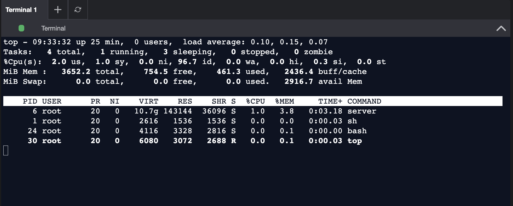

# Prerequisites for a Monitoring System

## 🚀 1. What is Monitoring All About?

A monitoring system has two major goals:

1. **Collect data (metrics)** about your infrastructure and applications
2. **Alert the right people** when something goes wrong

In other words:

**Monitoring = Metrics + Alerting**

It ensures you know when your system is unhealthy before users start complaining.

## ⚙️ 2. Two Ways to Handle Failures

There are two main philosophies in IT operations:

### a. Reactive approach

- Wait until something breaks
- Then fix it

**Example:** Your web server goes down, you get user complaints, then restart it.

**Problem:** You face downtime before action happens. This is like a doctor treating a patient after a heart attack.

### b. Proactive approach

- Monitor your system constantly
- Detect unusual behavior before it leads to failure

**Example:** Your monitoring detects CPU usage is rising abnormally, and you scale up servers automatically.

**Benefit:** Prevents downtime and keeps users happy. Like doing regular checkups to prevent heart issues.

## 📊 3. What Are Metrics?

**Metrics** are measurable data points that tell you how your system is behaving.

### Examples:

- CPU usage (%)
- Memory usage (GB)
- Disk read/write latency (ms)
- HTTP request rate (requests/second)
- Error rate (5xx per minute)
- Database query latency (ms)
- Network throughput (MBps)

**Purpose:** Metrics let you track performance, capacity, and health of your infrastructure.

### 📘 Example:

Let's say you're monitoring a web server:

- **Metric 1:** Requests per second → 500 req/s
- **Metric 2:** Error rate → 1% (normal), suddenly becomes 30% (problem!)
- **Metric 3:** CPU → 95% usage

These metrics tell you your server is under heavy load and possibly failing — an alert should trigger.

## 🧠 4. How to Collect Metrics

There are two models for collecting metrics:

| Strategy | Who sends data? | How it works | Example |
|----------|-----------------|--------------|---------|
| **Pull** | Monitoring system pulls data from servers | Monitoring tool (like Prometheus) periodically calls each server's `/metrics` endpoint | Prometheus pulling metrics from Node Exporter |
| **Push** | Servers push data to monitoring system | Each server sends data periodically to the monitoring service | StatsD or Telegraf pushing data to InfluxDB |

### 🔄 Summary:

- **Pull** = monitoring system requests data (better control, avoids overload)
- **Push** = applications send data periodically (better for firewalled environments)

## 📁 5. Logging and Its Role in Monitoring

**Logs** = textual records of events (errors, warnings, or info messages).

**Example of a log:**

```
[ERROR] 2025-10-22 10:00:32 Service B - DB connection timeout
```

Logs are helpful because:

- They provide context for what happened before/after an issue
- Metrics can be derived from logs (e.g., error counts)
- They store raw data for debugging

**However:** Logs are slower to analyze in real-time — so for instant detection, we rely more on metrics.

### Think of it like this:

- **Metrics** tell you something is wrong
- **Logs** tell you why it went wrong

## 🗃️ 6. Where Do We Store Metrics?

Metrics data should be **persisted (saved)** so you can analyze trends over time. For example:

- CPU usage over 7 days
- Error spikes at specific hours

To store this efficiently, we use a **Time-Series Database (TSDB)** such as:

- Prometheus
- InfluxDB
- Graphite
- VictoriaMetrics

### Why TSDB?

Because it stores:

```
(timestamp, metric_name, value)
```

like:

```
(2025-10-22T10:00, cpu_usage, 85%)
```

That lets you graph and analyze historical performance trends.

## 🧩 7. Application Metrics (Custom Metrics)

Not all useful metrics come from OS or hardware — many come from your app logic.

### Example for a payment app:

- Number of successful payments per minute
- Number of failed payments
- Time taken to process one transaction

You can collect these via **code instrumentation** — adding monitoring libraries (like Micrometer in Spring Boot) to expose metrics to systems like Prometheus or Datadog.

## 🚨 8. Alerting

Alerting is what turns metrics into action.

**An alert = metric + condition + action.**

### Example:

- **Metric:** Error rate
- **Condition:** Error rate > 5% for 3 minutes
- **Action:** Send Slack message, trigger PagerDuty, or auto-scale instance

### Alert Structure:

- **Condition/Threshold:** Define when to alert (e.g., CPU > 90% for 5 min)
- **Action:** Notify engineers, auto-heal, or log escalation

Good alerting systems balance between:

- **Too few alerts** (you miss issues)
- **Too many alerts** (alert fatigue — people start ignoring them)

## 🧱 9. Putting It All Together

| Component | Description | Example |
|-----------|-------------|---------|
| **Metrics** | What you measure | CPU %, latency, errors |
| **Collection** | How you gather metrics | Push or Pull |
| **Storage** | Where you keep them | Prometheus, InfluxDB |
| **Visualization** | How you view trends | Grafana dashboards |
| **Alerting** | How you act on issues | Email, Slack, PagerDuty |
| **Logging** | For debugging context | Application logs |

## 💡 10. Analogy — Think of It Like Human Health

| System Monitoring | Human Body |
|-------------------|------------|
| Metrics | Vitals (heart rate, BP, temperature) |
| Logs | Doctor's notes or test results |
| Alerting | Alarms when vitals exceed safe range |
| Visualization | Health charts or ECG graphs |
| Storage | Medical records (history) |

A healthy system, like a healthy body, needs constant observation.

The following is the formatted Markdown version of your text:

---



## Linux Process Monitoring with `top`

We use the **top** command to view Linux processes. Running this command opens an interactive view of the running system containing a summary of the system and a list of processes or threads.

### Interface Breakdown

The default view consists of the following sections:

* **System Summary:** Located at the very top, this displays how long the machine has been turned on, how many users are logged in, and the average load on the machine for the past few minutes.
* **Task States:** The next line shows the state (running, sleeping, or stopped) of tasks running on the machine.
* **CPU Consumption:** Below the tasks, you will find the specific CPU usage values.
* **Memory Overview:** Lastly, there is an overview of physical memory, indicating how much is free, used, buffered, or available.

---

### Hands-on: Observing CPU Usage Changes

Follow these steps to see a change in the CPU usage:

1. **Quit** the current view by entering `q` in the terminal.
2. **Execute a background script** by running:
```bash
nohup ./script.sh &>/dev/null &

```


*Note: This script contains an infinite loop and will execute in the background.*
3. **Run the `top` command** again to observe the increase in CPU usage.

---
