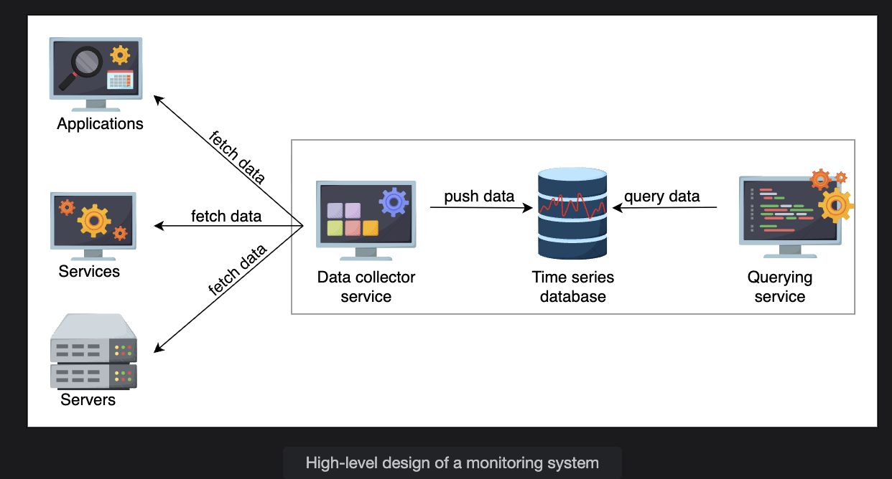

# Design of a Monitoring System

Learn about the initial design of a generic monitoring system.

## Requirements

Let's sum up what we want our monitoring system to do for us:

- Monitor critical local processes on a server for crashes
- Monitor any anomalies in the use of CPU/memory/disk/network bandwidth by a process on a server
- Monitor overall server health, such as CPU, memory, disk, network bandwidth, average load, and so on
- Monitor hardware component faults on a server, such as memory failures, failing or slowing disk, and so on
- Monitor the server's ability to reach out-of-server critical services, such as network file systems and so on
- Monitor all network switches, load balancers, and any other specialized hardware inside a data center
- Monitor power consumption at the server, rack, and data center levels
- Monitor any power events on the servers, racks, and data center
- Monitor routing information and DNS for external clients
- Monitor network links and paths' latency inside and across the data centers
- Monitor network status at the peering points
- Monitor overall service health that might span multiple data centers—for example, a CDN and its performance

We want automated monitoring that identifies an anomaly in the system and informs the alert manager or shows the progress on a dashboard. Cloud service providers provide a health status of their services:

- **AWS:** https://health.aws.amazon.com/health/status
- **Azure:** https://status.azure.com/en-us/status
- **Google:** https://status.cloud.google.com/

## Why Do We Need a Dedicated Monitoring Service?

In a distributed system, why is a dedicated monitoring solution necessary instead of simply relying on individual server logs?

### Benefits of Dedicated Monitoring Service:

- **Reduce operational and maintenance cost** due to fewer people required to monitor huge data centers with millions of servers across the globe. It can help you automatically detect anomalies and assist in debugging for faster resolution

- **Provides insights on overall health of your system** to meet business SLAs

- **Centralized visibility** across the entire system, which makes detecting patterns and correlations easier than relying solely on individual logs

- **Proactive alerting** before issues escalate into outages

- **Historical trend analysis** for capacity planning and performance optimization

## Building Blocks We Will Use

The design of distributed monitoring will consist of the following building block:

- **Blob storage**: We'll use blob storage to store our information about metrics

## High-level Design

The high-level components of our monitoring service are the following:

### 1. Storage

A **time-series database** stores metrics data, such as the current CPU use or the number of exceptions in an application.

**Examples:**
- Prometheus
- InfluxDB
- TimescaleDB
- VictoriaMetrics

### 2. Data Collector Service

This fetches the relevant data from each service and saves it in the storage.

**Functions:**
- Collects metrics from various sources (servers, applications, network devices)
- Aggregates and preprocesses data
- Writes to time-series database
- Can use push or pull model

### 3. Querying Service

This is an API that can query on the time-series database and return the relevant information.

**Functions:**
- Provides REST/GraphQL API for metrics retrieval
- Supports filtering, aggregation, and time-range queries
- Powers dashboards and alerting systems
- Enables ad-hoc investigations and debugging

## Architecture Overview

```
┌─────────────────┐
│   Monitored     │
│    Services     │───┐
└─────────────────┘   │
                      │
┌─────────────────┐   │    ┌──────────────────┐
│    Servers      │───┼───>│ Data Collector   │
└─────────────────┘   │    │    Service       │
                      │    └──────────────────┘
┌─────────────────┐   │              │
│    Network      │───┘              │
│    Devices      │                  ▼
└─────────────────┘         ┌──────────────────┐
                            │  Time-Series DB  │
                            │    (Storage)     │
                            └──────────────────┘
                                     │
                                     ▼
                            ┌──────────────────┐
                            │ Querying Service │
                            │      (API)       │
                            └──────────────────┘
                                     │
                        ┏────────────┴────────────┓
                        ▼                         ▼
                 ┌─────────────┐         ┌──────────────┐
                 │  Dashboard  │         │   Alerting   │
                 │ (Grafana)   │         │    System    │
                 └─────────────┘         └──────────────┘
```

## Key Characteristics

| Characteristic | Description |
|----------------|-------------|
| **Scalability** | Must handle millions of metrics per second |
| **Reliability** | Should continue monitoring even during partial failures |
| **Low Latency** | Real-time or near real-time metric collection and alerting |
| **Data Retention** | Configurable retention policies (e.g., 30 days detailed, 1 year aggregated) |
| **Queryability** | Fast queries for dashboards and historical analysis |

