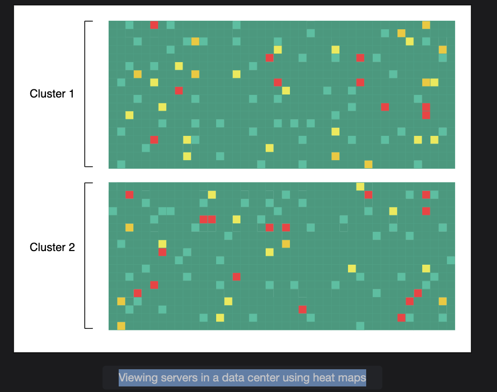

# Heat Maps for Large-Scale System Monitoring

## What Is the Challenge?

In large-scale systems like Google, AWS, or Facebook, there are millions of servers (physical or virtual).

Each server constantly sends monitoring data — for example:

- CPU usage
- Memory consumption
- Disk space
- Network latency
- Alive or dead (status)

Now, imagine trying to visualize all that data at once. If you have 1,000,000 servers — you can't simply show them in a normal dashboard table or chart. You need a compact and visual way to see which servers are healthy and which are failing.

That's where heat maps come in.

## 🌡️ What Is a Heat Map?

A heat map is a data visualization technique where color represents the state or magnitude of something.

For example:

| Color | Meaning |
|-------|---------|
| 🟩 Green | Healthy server (working fine) |
| 🟧 Yellow | Warning (high CPU, memory usage, etc.) |
| 🟥 Red | Critical (server down or not responding) |

A heat map arranges these colors in a grid, making it very easy to spot patterns or failures visually.

## 🏢 How It Works in a Data Center

Let's break down how large data centers use this concept.

Each rack (the physical frame containing multiple servers) can have dozens of servers.

Each data center has:

- Many clusters (groups of racks)
- Each cluster has multiple rows
- Each row has multiple racks
- Each rack has multiple servers

So, servers can be organized hierarchically like:

```
Data Center → Cluster → Row → Rack → Server
```

Now, each server's health status can be mapped to a cell in a heat map.

For example:

```
🟩🟩🟩🟩🟩🟩🟩
🟩🟩🟥🟩🟩🟩🟩
🟩🟩🟩🟩🟩🟩🟩
```

Here, the red cell represents a rack or server that's down.

## 🔍 Using Heat Maps to Troubleshoot

Each cell corresponds to one server or component. The color represents the health.

By scanning the heat map, operators can instantly identify:

- Failing servers (red)
- Overloaded clusters (yellow)
- Normal servers (green)

It becomes visually clear if:

- A specific rack is failing (vertical line of red)
- A cluster-wide problem exists (large red block)
- Or failures are random (scattered red cells)

This helps in quickly diagnosing if the issue is:

- **Localized** (e.g., one rack power issue)
- **Or systemic** (e.g., network or software bug)

## 🌍 Global Heat Maps for Distributed Systems

In massive systems (like AWS or Google Cloud), data centers are spread across the world.

Each server reports a 1-bit health status:

- `1` → alive
- `0` → dead

So, if there are 1,000,000 servers:

```
1 bit × 1,000,000 servers = 1,000,000 bits = 125 KB
```

That means:

**Only 125 KB of data can represent the global health of 1 million servers.**

This can be transmitted quickly to a global monitoring system. The global dashboard can update in real-time, showing which regions are healthy.

For example:

```
+-------------------------------+
| North America: 🟩🟩🟩🟩🟩🟩🟩🟩🟥 |
| Europe:        🟩🟩🟩🟩🟩🟩🟩🟩🟩 |
| Asia:          🟩🟩🟩🟩🟩🟩🟩🟧🟩 |
+-------------------------------+
```



Here, you can instantly spot:

- 1 red (failure) in North America
- 1 yellow (warning) in Asia

## 🧰 Other Uses of Heat Maps

You can use the same idea to visualize other system metrics:

- File system usage (which disks are full)
- Network switches and link health
- API request latency per region
- Database read/write load distribution

So, it's not limited to server status — it can show any metric distribution across a large fleet.

## ✅ Advantages of Using Heat Maps

| Benefit | Description |
|---------|-------------|
| 🧠 Compact Visualization | Can represent 1000s of servers in one small grid |
| ⚡ Fast Diagnosis | Easy to see which cluster/region/rack is failing |
| 🌍 Scalable | Works for globally distributed data centers |
| 💾 Lightweight Data | Health status can be sent as 1-bit per server |
| 🧭 Actionable Insight | Helps SREs quickly find the source of problems |

## ⚙️ Summary

| Concept | Explanation |
|---------|-------------|
| Purpose | To visualize health data for millions of servers efficiently |
| Technique | Use heat maps with colors representing system state |
| Implementation | Organize servers by Data Center → Cluster → Rack → Node |
| Benefits | Fast, compact, scalable visualization for large distributed systems |
| Scalability | Only 125 KB needed to represent 1M server statuses |
| Tools | Modern systems use this (e.g., Google's Borgmon, Facebook's ODS, Prometheus + Grafana with heat map plugins) |

## 🏁 Key Takeaway

In large distributed systems, monitoring isn't just about collecting data — it's about **visualizing it intelligently**.

Heat maps give you a bird's-eye view of your global infrastructure's health, allowing engineers to detect and fix issues faster, at scale.


