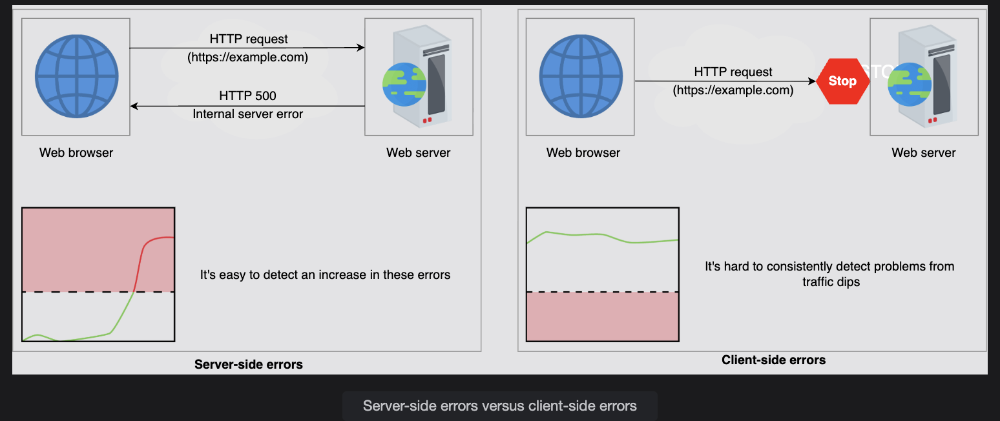
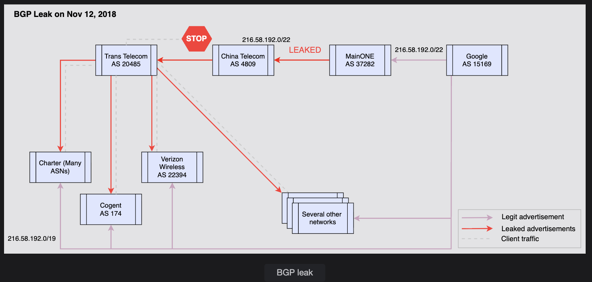

# 🧭 Focus on Client-side Errors in a Monitoring System

## 🧩 Background

In a distributed system, errors can occur both on the server and client sides. Monitoring server-side errors (like 500s or timeouts) is easier because the service owns that infrastructure and can log everything.

But client-side errors — where the problem occurs before the request even reaches the server — are hard to detect.

This section explains why client-side errors are tricky, what causes them, and how such failures appear in real-world systems like Google.

---

## ⚙️ 1. What Are Client-Side Errors?

When a client (like a user's browser or mobile app) tries to reach your service, the request goes through many layers:

```
User → Local Network → ISP → DNS → Internet Routers → CDN → Load Balancer → Your Servers
```

If something breaks before reaching your server, you have a **client-side error**. That means:

- Your backend never saw the request
- Your monitoring logs show no failure (because the request didn't arrive)
- But from the user's perspective — your service is "down"

**So, client-side errors = problems that happen outside your service boundary.**

---

## 🔍 2. Why Are Client-side Errors Hard to Monitor?

Because the server doesn't "see" these failures directly. Monitoring tools like Prometheus, Grafana, or Datadog rely on metrics collected inside your infrastructure.

If the client request never reaches you, there's no log entry, no error counter increment, and no alert.

You may only notice indirect symptoms, such as:

- A dip in overall traffic (fewer incoming requests)
- A drop in average load
- Or complaints from users saying "the site is down" while your servers look fine

However, these signals can produce:

- **False positives** — when legitimate load fluctuations are misinterpreted as problems
- **False negatives** — when real outages affect only a small subset of users, and the average load looks normal


---

## 🧠 3. Common Causes of Client-side Failures

These are typically network-related or infrastructure issues that occur between the client and the service:

| Cause | Description |
|-------|-------------|
| 🌐 DNS resolution failure | Client can't resolve your domain name to an IP address |
| 🚦 Routing failure | The packet path between client and your data center is broken |
| 🧱 Third-party infrastructure failure | Problems in CDNs, ISPs, middleboxes, or proxies |
| 🛰️ BGP (Border Gateway Protocol) leaks | Misconfigurations cause traffic to be routed incorrectly |

These failures are outside your data center but still affect your customers — and that's why distributed monitoring must account for them.

---

## 🧭 4. Real-World Example: The Google BGP Leak

Let's break down one of the biggest real incidents to understand the concept better.

### 🔹 What Happened

1. One of Google's peer ISPs (another Internet provider) accidentally announced routes (paths) that it wasn't supposed to
2. As a result, client traffic that should have gone directly to Google was rerouted through the wrong networks (unintended ISPs)
3. Those ISPs couldn't reach Google, so packets were dropped

**To users:** "Google is down."

**To Google's internal monitoring:** Everything looks fine.

Because Google's servers were up — the problem was on the Internet route, not on their servers.

This kind of problem is called a **BGP Leak**.

---

## 🌍 5. Understanding BGP (Border Gateway Protocol)

To understand the leak, you must know what BGP is.

### 🧩 What is BGP?

The Internet is made up of thousands of **Autonomous Systems (AS)** — basically large networks managed by ISPs or organizations.

- Each AS has routers that announce which IP ranges they can reach (called prefixes)
- BGP is the protocol that helps these systems find routes to each other

**Example:**

```
AS1 (Google) ↔ AS2 (ISP1) ↔ AS3 (ISP2) ↔ AS4 (Client ISP)
```

Each router shares routing tables to say "I can deliver traffic to X network."


### ⚠️ What Is a Route Leak?

A route leak happens when one AS accidentally or maliciously announces routes that aren't theirs, or forwards them incorrectly.

Routers always pick the **most specific route** (the longest prefix match).

**Example:**

- Correct route: `216.58.192.0/19`
- Leaked route: `216.58.192.0/22` → more specific → wins!

So, traffic that should go directly to Google gets misrouted through a wrong network and fails.

---

## 📆 6. Timeline Example

### Event: November 12, 2018

- A BGP leak occurred, affecting Google, Meta, and Amazon
- A network mistakenly announced `216.58.192.0/22`, which overrode Google's legitimate `216.58.192.0/19` route
- All traffic followed the wrong path and got dropped
- Users worldwide were unable to reach Google services

### Another Example: April 16, 2021

- An AS accidentally announced 30,000+ BGP prefixes
- This caused a 13× spike in inbound traffic
- It overwhelmed routers until operators detected the anomaly and fixed it

---

## 🔔 7. Why Monitoring Didn't Catch It

Because:

- Google's monitoring was focused on **internal systems** — CPU, latency, storage, etc.
- From the servers' perspective, nothing was wrong
- The issue occurred **outside their network boundary**, on the Internet routing level

Hence, **client-side monitoring is crucial** — otherwise, these events go undetected until users complain.

---

## 🧰 8. Lessons for Monitoring Design

A robust distributed monitoring system should:

| Strategy | Description |
|----------|-------------|
| 🌍 Global Probing | Deploy synthetic clients (probes) in different regions that periodically make test requests to your service |
| 🧭 Compare Latency and Reachability | Measure if the requests are successful or timing out — even when your internal systems look fine |
| 🧾 Correlate with BGP/DNS Logs | Track routing announcements, DNS lookups, and latency to detect regional routing or resolution failures |
| 🧠 Combine Client + Server Metrics | Have visibility from both ends: what the client sees and what your server records |

---

## ✅ Summary Table

| Concept | Explanation |
|---------|-------------|
| Client-side errors | Failures happening before a request reaches your server |
| Root causes | DNS issues, routing failures, CDN outages, BGP leaks |
| Impact | Users can't reach the service; server monitoring shows "no problem" |
| Why it's hard | No logs or errors appear on the backend |
| Solution | Use external synthetic monitoring (probes), combine network and routing visibility |
| Real incidents | Google BGP leak (2018), major BGP leak (2021) |

---

## 🧭 Key Takeaway

**Monitoring just your servers isn't enough.**

Real reliability comes when you monitor what your users actually experience.

That means tracking client-side reachability, network routes, and DNS health, not just CPU or memory metrics.
