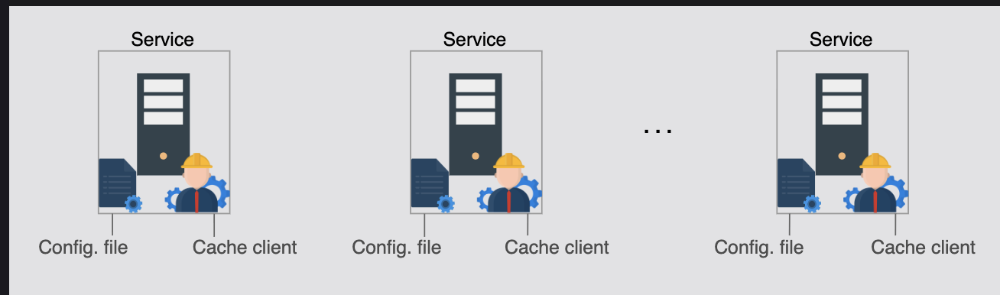
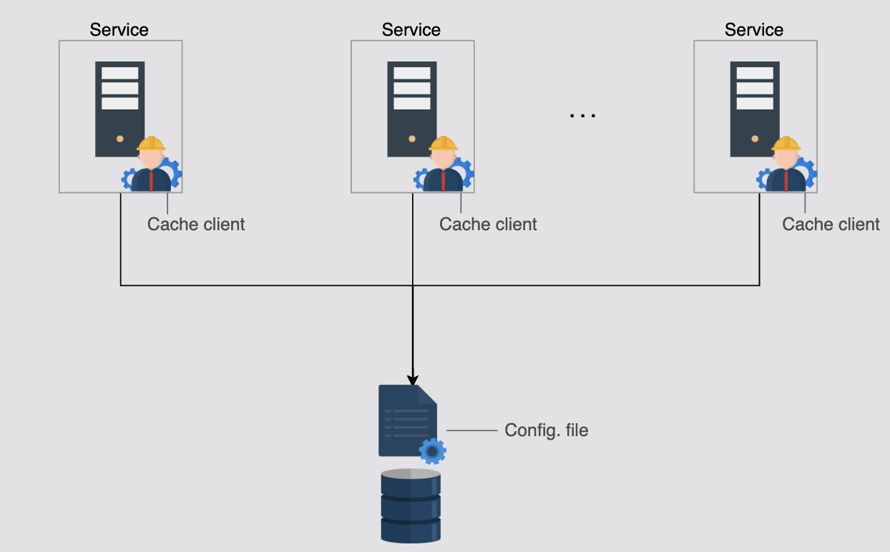
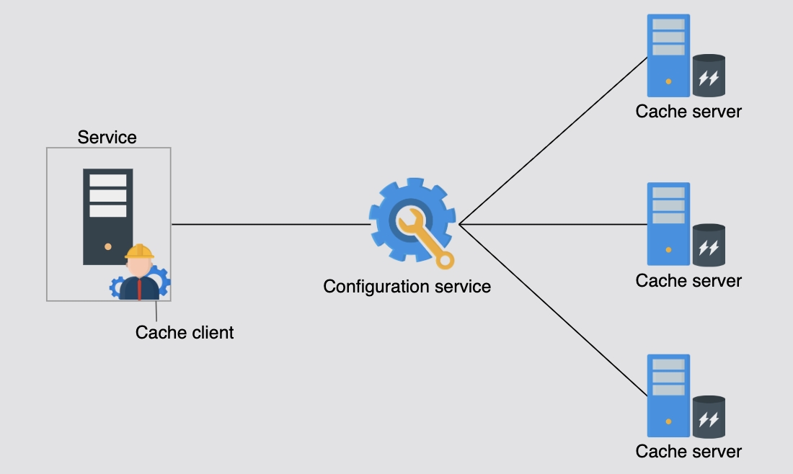
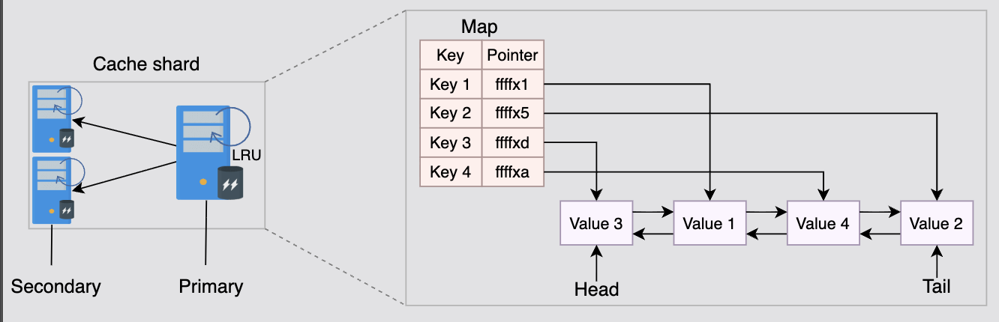
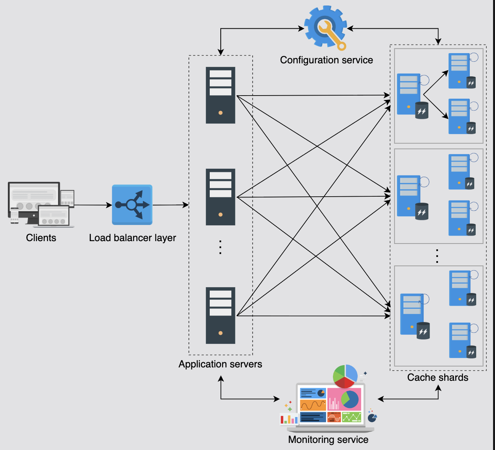

# Detailed Design of a Distributed Cache

Let's understand the detailed design of a distributed cache and resolve the limitations of our high-level design.

## Table of Contents

- [Introduction](#introduction)
- [Find and Remove Limitations](#find-and-remove-limitations)
- [Solution 1: Maintain Cache Servers List](#solution-1-maintain-cache-servers-list)
- [Solution 2: Improve Availability](#solution-2-improve-availability)
- [Solution 3: Internals of Cache Server](#solution-3-internals-of-cache-server)
- [Complete Detailed Design](#complete-detailed-design)
- [Troubleshooting and Optimization](#troubleshooting-and-optimization)
- [Write Strategy for Strong Consistency](#write-strategy-for-strong-consistency)
- [Handling Unequal Distribution](#handling-unequal-distribution)
- [Summary](#summary)

---

## Introduction

This lesson will identify some shortcomings of the high-level design of a distributed cache and improve the design to cover the gaps. We'll take incremental steps toward building a robust, production-ready distributed caching system.

---

## Find and Remove Limitations

Before we get to the detailed design, we need to understand and overcome some challenges:

### Limitation 1: Cache Server Discovery

**Problem**: There's no way for the cache client to realize the addition or failure of a cache server.

**Impact:**
- Cache clients can't detect server failures automatically
- Adding new servers requires manual client updates
- No dynamic scaling capability
- Service degradation during server failures

---

### Limitation 2: Single Point of Failure (SPOF)

**Problem**: The solution will suffer from the problem of single point of failure (SPOF) because we have a single cache server for each set of cache data.

**Impact:**
- If a cache server fails, all its data is unavailable
- No redundancy or backup
- System availability is compromised

**Additional Problem - Hotkey**:
If some of the data on any of the cache servers is frequently accessed (generally referred to as a **hotkey problem**), then our performance will also be slow.

**Example of Hotkey Problem:**
```
Server 1: 1,000 requests/sec (normal load)
Server 2: 100,000 requests/sec (hotkey: "trending_video")
Server 3: 1,000 requests/sec (normal load)

Server 2 is overloaded while others are underutilized!
```

---

### Limitation 3: Cache Server Internals

**Problem**: Our solution didn't highlight the internals of cache servers. That is, what kind of data structures will it use to store and what eviction policy will it use?

**Missing Details:**
- Storage data structure
- Eviction algorithm implementation
- Memory management
- Entry organization

---

## Solution 1: Maintain Cache Servers List

Let's start by resolving the first problem: **How do cache clients discover and track cache servers?**

We'll take incremental steps toward the best possible solution.


---

### Approach 1: Configuration File with Manual Updates

**Design:**
- Have a configuration file in each of the service hosts where the cache clients reside
- Configuration file contains updated health and metadata required for cache clients
- Each copy of the configuration file is updated through a push service by DevOps tools

**Architecture:**
```
┌──────────────┐
│   DevOps     │
│   Tool       │
└──────┬───────┘
       │ Push updates
       ├─────────────┬─────────────┐
       │             │             │
┌──────▼───────┐ ┌──▼──────────┐ ┌▼────────────┐
│ App Server 1 │ │ App Server 2│ │ App Server 3│
│ config.json  │ │ config.json │ │ config.json │
└──────────────┘ └─────────────┘ └─────────────┘
```

**Configuration File Example:**
```json
{
  "cache_servers": [
    {
      "id": "cache1",
      "host": "cache1.example.com",
      "port": 6379,
      "status": "healthy",
      "shard": "A"
    },
    {
      "id": "cache2",
      "host": "cache2.example.com",
      "port": 6379,
      "status": "healthy",
      "shard": "B"
    }
  ],
  "last_updated": "2026-01-18T10:30:00Z"
}
```

**Advantages:**
- Simple to implement
- No additional infrastructure
- Easy to understand

**Disadvantages:**
- Manual updates required
- Deployment overhead
- No automatic failure detection
- Potential for configuration drift
- Human error prone

**Verdict**: ❌ Not suitable for production systems

---

### Approach 2: Centralized Configuration File

**Design:**
- Store the configuration file in a centralized location
- Cache clients fetch updates from central location
- Still requires manual updates for server changes


**Architecture:**
```
         ┌─────────────────┐
         │ Central Config  │
         │     Server      │
         │  (config.json)  │
         └────────┬────────┘
                  │
         ┌────────┼────────┐
         │        │        │
    ┌────▼───┐ ┌─▼──────┐ ┌▼────────┐
    │ Cache  │ │ Cache  │ │ Cache   │
    │Client 1│ │Client 2│ │Client 3 │
    └────────┘ └────────┘ └─────────┘
```

**Advantages:**
- Single source of truth
- No deployment needed for updates
- Easier to maintain consistency
- All clients see same configuration

**Disadvantages:**
- Still requires manual updates
- Must manually monitor server health
- No automatic failure detection
- Central config server becomes SPOF
- Polling overhead for updates

**Verdict**: ⚠️ Better than Approach 1, but still not ideal

---

### Approach 3: Configuration Service (Recommended)

**Design:**
- Use a **configuration service** that continuously monitors the health of cache servers
- Cache clients get notified when a new cache server is added or removed
- No human intervention required for failures or additions
- Automatic health checks and updates


**Architecture:**
```
         ┌─────────────────────────┐
         │ Configuration Service   │
         │  (e.g., ZooKeeper,      │
         │   etcd, Consul)         │
         │                         │
         │  - Health monitoring    │
         │  - Server registry      │
         │  - Change notifications │
         └────┬──────────────┬─────┘
              │              │
      Monitor │              │ Subscribe
              │              │
    ┌─────────▼──┐     ┌────▼─────────┐
    │   Cache    │     │    Cache     │
    │  Servers   │     │   Clients    │
    │            │     │              │
    │ Heartbeat →│     │ ← Updates    │
    └────────────┘     └──────────────┘
```

**How It Works:**

**1. Server Registration:**
```
Cache Server starts:
  1. Register with Configuration Service
  2. Provide metadata (host, port, shard, capacity)
  3. Start sending heartbeats every 5 seconds
```

**2. Health Monitoring:**
```
Configuration Service:
  Every 5 seconds:
    Check heartbeat from each server
    If no heartbeat for 15 seconds:
      Mark server as DOWN
      Notify all cache clients
```

**3. Client Subscription:**
```
Cache Client:
  1. Connect to Configuration Service
  2. Subscribe to cache server updates
  3. Receive initial server list
  4. Get notified of any changes (add/remove/failure)
  5. Update local cache server map
```

**Example Configuration Service Data:**
```json
{
  "servers": {
    "cache1": {
      "host": "cache1.example.com",
      "port": 6379,
      "status": "healthy",
      "shard": "A",
      "last_heartbeat": "2026-01-18T10:30:45Z",
      "capacity_mb": 10240,
      "used_mb": 5120
    },
    "cache2": {
      "host": "cache2.example.com",
      "port": 6379,
      "status": "healthy",
      "shard": "B",
      "last_heartbeat": "2026-01-18T10:30:47Z",
      "capacity_mb": 10240,
      "used_mb": 7680
    },
    "cache3": {
      "host": "cache3.example.com",
      "port": 6379,
      "status": "down",
      "shard": "C",
      "last_heartbeat": "2026-01-18T10:25:30Z"
    }
  }
}
```

**Advantages:**
- ✅ Automatic failure detection
- ✅ No manual intervention needed
- ✅ Real-time updates to clients
- ✅ Dynamic server addition/removal
- ✅ Health monitoring included
- ✅ Most robust solution

**Disadvantages:**
- ❌ Highest operational cost
- ❌ More complex to implement
- ❌ Additional infrastructure dependency
- ❌ Configuration service itself needs to be highly available

**Verdict**: ✅ **Best for production systems**

---

### Comparison of Approaches

| Aspect | Manual Config | Central Config | Configuration Service |
|--------|---------------|----------------|----------------------|
| **Implementation** | Simple | Medium | Complex |
| **Operational Cost** | Low | Medium | High |
| **Auto-detection** | No | No | Yes |
| **Scalability** | Poor | Medium | Excellent |
| **Availability** | Poor | Medium | High |
| **Human Intervention** | High | Medium | Minimal |
| **Production Ready** | ❌ | ⚠️ | ✅ |

---

### Popular Configuration Services

| Service | Type | Best For |
|---------|------|----------|
| **ZooKeeper** | Distributed coordination | Large-scale systems, complex coordination |
| **etcd** | Distributed key-value store | Kubernetes, cloud-native apps |
| **Consul** | Service mesh | Microservices, health checking |
| **Redis Sentinel** | Redis-specific | Redis deployments |

---

## Solution 2: Improve Availability

The second problem relates to **cache unavailability if cache servers fail**. We need to eliminate the single point of failure.

### Solution: Add Replica Nodes

A simple solution is the addition of replica nodes. We can start by adding **one primary and two backup nodes** in a cache shard.

---

### Replication Architecture

**Basic Setup:**
```
Shard A:
  Primary: cache-a-primary (writes & reads)
  Replica 1: cache-a-replica-1 (reads)
  Replica 2: cache-a-replica-2 (reads)

Shard B:
  Primary: cache-b-primary (writes & reads)
  Replica 1: cache-b-replica-1 (reads)
  Replica 2: cache-b-replica-2 (reads)
```

**Visual Representation:**
```
        Write Requests
              ↓
    ┌─────────────────┐
    │ Primary Node    │
    │  (Shard A)      │
    └────┬──────┬─────┘
         │      │
    Sync │      │ Sync
         │      │
    ┌────▼──┐ ┌▼──────┐
    │Replica│ │Replica│
    │   1   │ │   2   │
    └───────┘ └───────┘
         ↑        ↑
         └────┬───┘
         Read Requests
```

---

### Synchronous vs Asynchronous Replication

#### Synchronous Replication (Recommended for close proximity)

**Process:**
```
1. Write request arrives at primary
2. Primary writes to its memory
3. Primary sends to replicas
4. Wait for ALL replicas to acknowledge
5. Return success to client
```

**Advantages:**
- ✅ Strong consistency
- ✅ No data loss
- ✅ Replicas always up-to-date

**Disadvantages:**
- ❌ Higher write latency
- ❌ Write blocked if replica is slow

**When to Use:**
- Replicas in close proximity (same data center)
- Strong consistency required
- Critical data

---

#### Asynchronous Replication

**Process:**
```
1. Write request arrives at primary
2. Primary writes to its memory
3. Return success to client immediately
4. Asynchronously replicate to replicas
```

**Advantages:**
- ✅ Low write latency
- ✅ Writes not blocked by replicas

**Disadvantages:**
- ❌ Eventual consistency
- ❌ Possible data loss if primary fails before replication

**When to Use:**
- Replicas geographically distributed
- Performance more important than consistency
- Acceptable to lose recent writes

---

### Consistency Considerations

**Important**: With replicas, there's always a possibility of inconsistency.

**Solution**: If our replicas are in close proximity, writing over replicas is performed **synchronously** to avoid inconsistencies between shard replicas.

**Example of Inconsistency:**
```
Time T1:
  Primary: user:101 = "Mumbai"
  Replica 1: user:101 = "Delhi" (old)
  Replica 2: user:101 = "Delhi" (old)

Read from Replica 1 → Gets "Delhi" (stale!)
Read from Primary → Gets "Mumbai" (correct)

After sync (T2):
  All nodes: user:101 = "Mumbai"
```

---

### Data Sharding Strategy

**Important**: It's crucial to divide cache data among shards so that neither the problem of unavailability arises nor any hardware is wasted.

**Good Sharding:**
```
Shard A: 30% of data, 30% of traffic
Shard B: 35% of data, 35% of traffic
Shard C: 35% of data, 35% of traffic

Balanced load → All hardware utilized efficiently
```

**Bad Sharding:**
```
Shard A: 10% of data, 5% of traffic → Underutilized
Shard B: 20% of data, 15% of traffic → Underutilized
Shard C: 70% of data, 80% of traffic → Overloaded!

Imbalanced → Wasted resources + performance issues
```

---

### Advantages of Replication

This solution has two main advantages:

#### 1. Improved Availability in Case of Failures

**Scenario: Primary Fails**
```
Before failure:
  Primary (cache-a-primary) ← DOWN
  Replica 1 (cache-a-replica-1) ← Promoted to Primary
  Replica 2 (cache-a-replica-2) ← Continues as Replica

After failover:
  New Primary: cache-a-replica-1
  Replica: cache-a-replica-2
  System continues operating!
```

**Availability Calculation:**
```
Single node: 99% uptime → 3.65 days downtime/year

With 1 primary + 2 replicas:
Probability all 3 fail: 0.01³ = 0.0001%
Uptime: 99.99%+ → < 1 hour downtime/year
```

---

#### 2. Hot Shards Can Have Multiple Nodes for Reads

**Handling Hotkey Problem:**
```
Hotkey: "trending_video" on Shard B

Without replicas:
  Shard B Primary: 100,000 reads/sec → OVERLOADED!

With replicas:
  Shard B Primary: 33,000 reads/sec
  Shard B Replica 1: 33,000 reads/sec
  Shard B Replica 2: 34,000 reads/sec
  Total: 100,000 reads/sec → Load distributed!
```

**Load Balancing Strategy:**
```
Read requests:
  Round-robin across primary + replicas
  OR
  Random selection
  OR
  Least-loaded node

Write requests:
  Always to primary
```

---

### Performance Impact

Not only will such a solution improve availability, but it will also add to the performance.

**Performance Metrics:**

| Metric | Without Replicas | With 2 Replicas |
|--------|------------------|-----------------|
| Read capacity | 50,000 req/s | 150,000 req/s |
| Write capacity | 50,000 req/s | 50,000 req/s |
| Availability | 99% | 99.99%+ |
| Failover time | N/A (total outage) | ~1-5 seconds |

---

## Solution 3: Internals of Cache Server

Each cache server should use three mechanisms to store and evict entries from the cache servers.

### 1. Hash Map

**Purpose**: The cache server uses a hash map to store or locate different entries inside the RAM of cache servers.

**Structure:**
```
Hash Map:
{
  "user:101" → Pointer to memory address 0x1A2B
  "user:102" → Pointer to memory address 0x3C4D
  "user:103" → Pointer to memory address 0x5E6F
  "product:501" → Pointer to memory address 0x7G8H
}
```

**Operations:**
- **Insert**: O(1) average time
- **Lookup**: O(1) average time
- **Delete**: O(1) average time

**Why Hash Map?**
- Fast constant-time access
- Efficient memory usage
- Industry standard for key-value storage

---

### 2. Doubly Linked List

**Purpose**: If we have to evict data from the cache, we require a linked list so that we can order entries according to their frequency of access.

**Structure:**
```
HEAD (Most Recently Used)                    TAIL (Least Recently Used)
   ↓                                                ↓
[user:105] ←→ [user:102] ←→ [product:501] ←→ [user:101]
```

**Why Doubly Linked List?**
- O(1) insertion at head
- O(1) deletion from tail
- O(1) removal from middle (when moving to head)
- Maintains access order efficiently

---

### 3. Eviction Policy: Least Recently Used (LRU)

**Assumption**: Here, we assume the **least recently used (LRU)** eviction policy.

**How LRU Works:**

**Operation 1: Access Existing Entry**
```
Before accessing user:102:
HEAD → [user:105] ←→ [user:102] ←→ [product:501] ←→ [user:101] ← TAIL

After accessing user:102:
HEAD → [user:102] ←→ [user:105] ←→ [product:501] ←→ [user:101] ← TAIL
        (moved to head)
```

**Operation 2: Add New Entry (Cache Not Full)**
```
Before adding user:999:
HEAD → [user:102] ←→ [user:105] ←→ [product:501] ← TAIL

After adding user:999:
HEAD → [user:999] ←→ [user:102] ←→ [user:105] ←→ [product:501] ← TAIL
        (new entry at head)
```

**Operation 3: Add New Entry (Cache Full - Eviction)**
```
Before adding user:999 (cache full, capacity = 4):
HEAD → [user:102] ←→ [user:105] ←→ [product:501] ←→ [user:101] ← TAIL
                                                        ↑
                                                 Least recently used

After adding user:999:
HEAD → [user:999] ←→ [user:102] ←→ [user:105] ←→ [product:501] ← TAIL
        (new)                                        ↑
                                            user:101 evicted
```

---

### Combined Data Structure

**Hash Map + Doubly Linked List = LRU Cache**

```
┌─────────────────────────────────────────────────┐
│              Hash Map                           │
│                                                 │
│  "user:101"  →  Node(user:101, data, ...)      │
│  "user:102"  →  Node(user:102, data, ...)      │
│  "user:105"  →  Node(user:105, data, ...)      │
│  "product:501" → Node(product:501, data, ...)  │
│                                                 │
└────────────────────┬────────────────────────────┘
                     │ Pointers to nodes
                     ↓
┌─────────────────────────────────────────────────┐
│         Doubly Linked List                      │
│                                                 │
│  HEAD ←→ [user:105] ←→ [user:102] ←→ ... ← TAIL│
│          (MRU)                          (LRU)   │
│                                                 │
└─────────────────────────────────────────────────┘
```

**Benefits:**
- O(1) lookup via hash map
- O(1) insertion/deletion via linked list
- O(1) move to head (access update)
- O(1) eviction from tail

---

### Visual Representation: Complete Cache Server

```
┌────────────────────────────────────────────────┐
│         Cache Server (Shard A Primary)         │
│                                                │
│  ┌──────────────────────────────────────────┐ │
│  │         Hash Map (Index)                 │ │
│  │  key → pointer to linked list node       │ │
│  └──────────────────────────────────────────┘ │
│                      ↓                         │
│  ┌──────────────────────────────────────────┐ │
│  │    Doubly Linked List (Access Order)     │ │
│  │  HEAD (MRU) ←→ ... ←→ TAIL (LRU)         │ │
│  └──────────────────────────────────────────┘ │
│                                                │
│  Eviction Policy: LRU                         │
│  Capacity: 10 GB                              │
│  Current Usage: 7 GB                          │
│                                                │
└────────────────────────────────────────────────┘
```


---

### Cache Server with Replication

A depiction of a **sharded cluster along with a node's data structure**:

```
┌──────────────────────────────────────────────────────────┐
│                   Shard A                                │
│                                                          │
│  ┌────────────────┐    Sync    ┌────────────────┐      │
│  │    PRIMARY     │◄──────────►│   REPLICA 1    │      │
│  │                │            │                │      │
│  │  ┌──────────┐  │            │  ┌──────────┐  │      │
│  │  │Hash Map  │  │            │  │Hash Map  │  │      │
│  │  └────┬─────┘  │            │  └────┬─────┘  │      │
│  │  ┌────▼─────┐  │            │  ┌────▼─────┐  │      │
│  │  │DLinklist │  │            │  │DLinklist │  │      │
│  │  └──────────┘  │            │  └──────────┘  │      │
│  │  LRU eviction  │            │  LRU eviction  │      │
│  └────────────────┘            └────────────────┘      │
│         │                              │               │
│         │        Sync                  │               │
│         ▼                              ▼               │
│  ┌────────────────┐                                    │
│  │   REPLICA 2    │                                    │
│  │                │                                    │
│  │  ┌──────────┐  │                                    │
│  │  │Hash Map  │  │                                    │
│  │  └────┬─────┘  │                                    │
│  │  ┌────▼─────┐  │                                    │
│  │  │DLinklist │  │                                    │
│  │  └──────────┘  │                                    │
│  │  LRU eviction  │                                    │
│  └────────────────┘                                    │
│                                                         │
└──────────────────────────────────────────────────────── ┘
```

**Key Points:**
- Each node (primary + replicas) has the same internal structure
- All use hash map + doubly linked list
- All implement the same eviction policy (LRU)
- Synchronous replication keeps them consistent

---

### Delete API Consideration

**Important Note**: It's evident from the explanation above that we don't provide a delete API.

**Why?**
- Eviction is handled by the eviction algorithm (LRU)
- Deletion of expired entries is done through TTL
- Both are managed locally at cache servers

**However**, situations can arise where the delete API may be required.

**Example Scenario:**
```
1. Add item to database:
   DB: product:501 = {"name": "Laptop", "price": 1000}

2. Cache it:
   Cache: product:501 = {"name": "Laptop", "price": 1000}

3. Delete from database:
   DB: product:501 deleted

4. Problem:
   Cache still has: product:501 = {"name": "Laptop", "price": 1000}
   
5. Solution:
   Explicitly delete from cache for consistency
   DELETE("product:501")
```

**When Delete API is Needed:**
- Database record deletion
- Immediate invalidation required
- Consistency is critical
- Can't wait for TTL expiration

---

## Complete Detailed Design

We're now ready to formalize the detailed design after resolving each of the three previously highlighted problems.

### Architecture Diagram


```
┌────────────────────────────────────────────────────────────┐
│                    Load Balancer                           │
└───────────────────────┬────────────────────────────────────┘
                        │
        ┌───────────────┼───────────────┐
        │               │               │
┌───────▼────────┐ ┌────▼────────┐ ┌───▼──────────┐
│ Service Host 1 │ │Service Host2│ │Service Host 3│
│                │ │             │ │              │
│ ┌────────────┐ │ │┌──────────┐ │ │┌───────────┐ │
│ │App Logic   │ │ ││App Logic │ │ ││App Logic  │ │
│ └────┬───────┘ │ │└────┬─────┘ │ │└────┬──────┘ │
│ ┌────▼───────┐ │ │┌────▼─────┐ │ │┌────▼──────┐ │
│ │Cache Client│ │ ││CacheClient││ ││CacheClient│ │
│ └────┬───────┘ │ │└────┬─────┘ │ │└────┬──────┘ │
└──────┼─────────┘ └─────┼───────┘ └─────┼────────┘
       │                 │                │
       └─────────────────┼────────────────┘
                         │
                         │ Subscribe/Query
                         │
              ┌──────────▼───────────┐
              │ Configuration Service│
              │  (ZooKeeper/etcd)   │
              │                     │
              │ - Server registry   │
              │ - Health monitoring │
              │ - Notifications     │
              └──────────┬──────────┘
                         │ Monitor/Register
                         │
        ┌────────────────┼────────────────┐
        │                │                │
┌───────▼────────┐ ┌─────▼───────┐ ┌─────▼────────┐
│   Shard A      │ │  Shard B    │ │  Shard C     │
│                │ │             │ │              │
│ ┌────────────┐ │ │┌──────────┐ │ │┌───────────┐ │
│ │  Primary   │ │ ││ Primary  │ │ ││  Primary  │ │
│ │ HashMap+DL │ │ ││HashMap+DL│ │ ││ HashMap+DL│ │
│ └─────┬──────┘ │ │└────┬─────┘ │ │└────┬──────┘ │
│   Sync│  Sync  │ │ Sync│  Sync │ │ Sync│  Sync  │
│ ┌─────▼──┐┌───▼┐│ │┌───▼─┐┌───▼┐│ │┌───▼─┐┌───▼┐│
│ │Replica1││Rep2││ ││Rep1 ││Rep2││ ││Rep1 ││Rep2││
│ └────────┘└────┘│ │└─────┘└────┘│ │└─────┘└────┘│
└──────┬──────────┘ └──────┬──────┘ └──────┬──────┘
       │                   │                │
       └───────────────────┼────────────────┘
                           │
                    ┌──────▼───────┐
                    │   Database   │
                    │   Cluster    │
                    └──────────────┘
```

---

### Design Summary

Let's summarize the proposed detailed design in a few points:

#### 1. Request Flow
The **client's requests** reach the service hosts through the **load balancers** where the cache clients reside.

**Example:**
```
User Request → Load Balancer → Service Host 3
                                    ↓
                              Cache Client
                                    ↓
                           Consistent Hashing
                                    ↓
                             Cache Server
```

---

#### 2. Cache Server Selection
Each **cache client** uses **consistent hashing** to identify the cache server. Next, the cache client forwards the request to the cache server maintaining a specific shard.

**Process:**
```
1. Request: GET("user:101")
2. Cache client calculates: hash("user:101") = 12345
3. Consistent hashing: 12345 → Shard B
4. Forward request to Shard B primary
```

---

#### 3. Replication
Each **cache server** has primary and replica servers. Internally, every server uses the same mechanisms to store and evict cache entries.

**Characteristics:**
- 1 Primary + 2 Replicas per shard
- Synchronous replication for consistency
- All nodes: Hash Map + Doubly Linked List + LRU
- Read from any node, write to primary only

---

#### 4. Configuration Management
**Configuration service** ensures that all the clients see an updated and consistent view of the cache servers.

**Responsibilities:**
- Health monitoring (heartbeats every 5 seconds)
- Server registration/deregistration
- Notify clients of topology changes
- Maintain consistent view across all clients

---

#### 5. Monitoring Services
**Monitoring services** can be additionally used to log and report different metrics of the caching service.

**Metrics to Monitor:**
- Cache hit ratio
- Cache miss ratio
- Eviction rate
- Memory usage
- Request latency
- Server health status
- Throughput (requests/second)

---

### Important Design Aspect

**Note**: An important aspect of the design is that **cache entries are stored and retrieved from RAM**.

**Why RAM?**
- Extremely fast access (< 100ns)
- No disk I/O overhead
- Suitable for low-latency requirements
- Cost-effective for cache use case

**Comparison:**
```
RAM access:     ~100 nanoseconds
SSD read:       ~150,000 nanoseconds (1,500x slower)
HDD read:       ~10,000,000 nanoseconds (100,000x slower)
```

We discussed the suitability of RAM for designing a caching system in the previous lesson.

---

## Troubleshooting and Optimization

**Question**: Imagine a distributed cache system is underperforming—high latency and frequent cache misses. What steps would you take to diagnose and resolve these issues?

### Diagnostic Steps

#### Step 1: Measure Current Metrics

**Collect data:**
```
Current Metrics:
- Cache hit ratio: 45% (target: >80%)
- Average latency: 50ms (target: <5ms)
- P99 latency: 200ms
- Memory usage: 95% (cache almost full)
- Eviction rate: 1000 evictions/sec (high!)
```

**Analysis**: Low hit ratio + high latency + high eviction = Cache too small

---

#### Step 2: Identify Bottlenecks

**Check each component:**

**1. Cache Client Issues**
```
Symptoms:
- High network latency
- Timeout errors
- Connection pool exhausted

Diagnosis:
- Check network latency to cache servers
- Verify connection pool configuration
- Review consistent hashing distribution

Solutions:
- Increase connection pool size
- Add more cache servers
- Fix consistent hashing (use virtual nodes)
```

**2. Cache Server Issues**
```
Symptoms:
- High CPU usage (>80%)
- Memory exhausted (100%)
- Slow eviction

Diagnosis:
- Review server resource usage
- Check eviction policy efficiency
- Analyze hotkey distribution

Solutions:
- Add more memory
- Optimize eviction algorithm
- Add replicas for hotkeys
```

**3. Network Issues**
```
Symptoms:
- Packet loss
- High network latency
- Timeouts

Diagnosis:
- Network monitoring tools
- Traceroute to cache servers
- Check bandwidth usage

Solutions:
- Upgrade network infrastructure
- Move cache servers closer to app servers
- Use local cache for hottest data
```

---

#### Step 3: Analyze Cache Miss Patterns

**Types of Cache Misses:**

**1. Cold Cache (Compulsory Misses)**
```
Problem: Cache just started, no data loaded
Solution: Implement cache warming
  - Pre-populate frequently accessed data
  - Gradual traffic ramp-up after restart
```

**2. Capacity Misses**
```
Problem: Cache too small for working set
Solution: 
  - Increase cache size (add more servers)
  - Better data distribution
  - Review TTL settings
```

**3. Conflict Misses**
```
Problem: Poor hash distribution
Solution:
  - Use consistent hashing with virtual nodes
  - Review hash function quality
```

**4. Invalidation Misses**
```
Problem: Aggressive TTL or invalidation
Solution:
  - Optimize TTL values
  - Review invalidation strategy
```

---

#### Step 4: Optimize Cache Size

**Calculate Optimal Cache Size:**
```
Working Set Size = Size of frequently accessed data

Example:
- Total dataset: 1 TB
- Frequently accessed (80/20 rule): 200 GB
- Recommended cache size: 200 GB × 1.5 = 300 GB
  (1.5x for overhead and growth)
```

**Horizontal Scaling:**
```
Current: 3 servers × 50 GB = 150 GB (insufficient)
Needed: 300 GB

Options:
1. Add 3 more servers: 6 × 50 GB = 300 GB
2. Upgrade servers: 3 × 100 GB = 300 GB
```

---

#### Step 5: Fix Hotkey Problems

**Identify Hotkeys:**
```
Monitoring shows:
- "trending_post:12345" → 100,000 requests/sec
- Normal keys → 10 requests/sec average

Server 2 (handles this key) is overloaded!
```

**Solutions:**

**A. Add More Replicas**
```
Before:
  Shard B: Primary only → 100,000 req/s

After:
  Shard B: Primary + 4 replicas → 20,000 req/s each
```

**B. Local Caching**
```
Add L1 cache on application servers:
  Application → Local cache (hotkeys) → Distributed cache
  
For "trending_post:12345":
  99% served from local cache
  1% hits distributed cache
```

**C. Key Replication**
```
Store hotkey in multiple shards:
  "trending_post:12345" → Shard A
  "trending_post:12345_copy1" → Shard B
  "trending_post:12345_copy2" → Shard C
  
Distribute reads across copies
```

---

#### Step 6: Optimize TTL

**Review TTL Settings:**
```
Bad TTL:
- Session data: TTL = 1 hour (user active for 5 min)
  → Wasted cache space

- Product catalog: TTL = 10 seconds
  → Too frequent refreshes, high miss rate

Good TTL:
- Session data: TTL = 30 minutes
- Product catalog: TTL = 1 hour
- Static content: TTL = 24 hours
```

---

#### Step 7: Implement Multi-Level Caching

**Architecture:**
```
Request Flow:
  Application
      ↓
  L1: Local Cache (in-process, 100 MB)
      ↓ (miss)
  L2: Distributed Cache (Redis, 100 GB)
      ↓ (miss)
  L3: Database
```

**Benefits:**
- L1 hit: <1ms latency
- L2 hit: 2-5ms latency
- Reduces load on distributed cache

---

### Optimization Checklist

| Issue | Diagnosis | Solution |
|-------|-----------|----------|
| Low hit ratio | Cache too small | Add more servers/memory |
| High latency | Network/CPU bottleneck | Optimize network, add resources |
| Hotkeys | Uneven load distribution | Add replicas, local cache |
| High eviction | Cache capacity insufficient | Increase cache size |
| Frequent misses | Poor TTL settings | Optimize TTL values |
| Server failures | No redundancy | Add replicas |
| Uneven sharding | Poor hash distribution | Use consistent hashing with virtual nodes |

---

## Write Strategy for Strong Consistency

**Question**: How would you design a "write strategy" to ensure strong consistency between a distributed cache and the database?

### Challenge

**Problem**: Keeping cache and database in sync during writes

**Scenarios to Handle:**
1. Write to cache succeeds, database write fails
2. Write to database succeeds, cache write fails
3. Concurrent writes to same key
4. Network partitions

---

### Strategy 1: Write-Through with Two-Phase Commit

**Process:**
```
1. Client sends write request
2. Transaction coordinator starts
3. Phase 1 - Prepare:
   a. Lock cache entry
   b. Lock database row
   c. Validate both ready
4. Phase 2 - Commit:
   a. Write to database
   b. Write to cache
   c. Release locks
5. Return success
```

**Implementation:**
```python
def write_with_consistency(key, value):
    transaction_id = start_transaction()
    
    try:
        # Phase 1: Prepare
        cache_lock = cache.lock(key, transaction_id)
        db_lock = database.lock(key, transaction_id)
        
        # Phase 2: Commit
        database.write(key, value)
        cache.write(key, value)
        
        # Commit transaction
        database.commit(transaction_id)
        cache.commit(transaction_id)
        
        return "SUCCESS"
        
    except Exception as e:
        # Rollback on failure
        database.rollback(transaction_id)
        cache.rollback(transaction_id)
        return f"FAILED: {e}"
        
    finally:
        # Release locks
        if cache_lock:
            cache.unlock(key)
        if db_lock:
            database.unlock(key)
```

**Guarantees:**
- ✅ Strong consistency (cache and DB always in sync)
- ✅ No partial updates
- ✅ ACID properties

**Trade-offs:**
- ❌ Higher write latency (locks + 2 phases)
- ❌ Reduced throughput
- ❌ Complex implementation

---

### Strategy 2: Write-Behind with Version Numbers

**Process:**
```
1. Write to cache with version number
2. Asynchronously write to database
3. Use version numbers to detect conflicts
4. Resolve conflicts using last-write-wins or merge
```

**Implementation:**
```python
def write_with_versioning(key, value):
    # Get current version
    current = cache.get(key)
    new_version = (current.version if current else 0) + 1
    
    # Write to cache with new version
    cache_entry = {
        "value": value,
        "version": new_version,
        "timestamp": time.now(),
        "dirty": True  # Not yet in DB
    }
    cache.write(key, cache_entry)
    
    # Async DB write
    async_queue.push({
        "key": key,
        "value": value,
        "version": new_version
    })
    
    return "SUCCESS"

# Background worker
def db_sync_worker():
    while True:
        entry = async_queue.pop()
        
        # Check if DB has newer version
        db_version = database.get_version(entry.key)
        
        if entry.version > db_version:
            database.write(entry.key, entry.value, entry.version)
            cache.mark_clean(entry.key)
        else:
            # Conflict: DB has newer data
            resolve_conflict(entry)
```

**Guarantees:**
- ✅ Fast writes
- ✅ Eventual consistency
- ✅ Conflict detection

**Trade-offs:**
- ❌ Not strongly consistent
- ❌ Requires conflict resolution
- ❌ May lose data on cache failure

---

### Strategy 3: Database-First with Cache Invalidation

**Process:**
```
1. Write to database first
2. Invalidate (delete) cache entry
3. Next read will populate cache from DB
```

**Implementation:**
```python
def write_db_first(key, value):
    try:
        # Write to database (source of truth)
        database.write(key, value)
        
        # Invalidate cache
        cache.delete(key)
        
        # Optional: Notify other cache servers
        invalidation_queue.broadcast({
            "key": key,
            "action": "delete"
        })
        
        return "SUCCESS"
        
    except DatabaseError as e:
        # Database write failed, cache not touched
        return f"FAILED: {e}"
```

**Read Process:**
```python
def read_with_cache_aside(key):
    # Try cache first
    value = cache.get(key)
    
    if value:
        return value  # Cache hit
    
    # Cache miss - read from DB
    value = database.get(key)
    
    if value:
        # Populate cache
        cache.write(key, value)
    
    return value
```

**Guarantees:**
- ✅ Database is always source of truth
- ✅ Strong consistency (eventually)
- ✅ Simple implementation

**Trade-offs:**
- ❌ Cache miss on every write
- ❌ Slower read after write
- ❌ Extra database load initially

---

### Strategy 4: Change Data Capture (CDC)

**Process:**
```
1. Write to database only
2. Database replication log captures change
3. CDC processor reads log
4. Updates cache based on log entries
```

**Architecture:**
```
Application
    ↓ Write
Database ──→ Replication Log
                ↓
         CDC Processor
                ↓
           Cache Update
```

**Implementation:**
```python
# Application code (simple!)
def write(key, value):
    database.write(key, value)
    return "SUCCESS"

# CDC Processor (separate service)
def cdc_processor():
    while True:
        # Read from database replication log
        changes = db_log.read_changes()
        
        for change in changes:
            if change.operation == "INSERT" or change.operation == "UPDATE":
                # Update cache
                cache.write(change.key, change.new_value)
            elif change.operation == "DELETE":
                # Invalidate cache
                cache.delete(change.key)
```

**Guarantees:**
- ✅ Database is source of truth
- ✅ Eventual consistency
- ✅ Decoupled cache updates
- ✅ Guaranteed cache update (from log)

**Trade-offs:**
- ❌ Requires CDC infrastructure
- ❌ Eventual consistency (delay)
- ❌ More complex architecture

---

### Comparison of Write Strategies

| Strategy | Consistency | Write Latency | Complexity | Best For |
|----------|-------------|---------------|------------|----------|
| **Two-Phase Commit** | Strong | High | High | Financial transactions |
| **Versioning** | Eventual | Low | Medium | High-write workloads |
| **DB-First + Invalidation** | Strong (eventual) | Medium | Low | General purpose |
| **CDC** | Eventual | Low | High | Large-scale systems |

---

### Recommended Approach

**For Strong Consistency**: Use **Database-First with Cache Invalidation**

**Complete Flow:**
```
Write Operation:
1. BEGIN transaction
2. Validate data
3. Write to database
4. COMMIT transaction
5. Delete from cache (all replicas)
6. Return success

Read Operation:
1. Check cache
2. If MISS:
   a. Read from database
   b. Write to cache (with TTL)
3. Return data

This ensures:
- Database is always correct
- Cache never has stale data (deleted on write)
- Simple to implement and reason about
```

---

## Handling Unequal Distribution

**Question**: While consistent hashing is a good choice, it may result in unequal distribution of data, and certain servers may get overloaded. How do we resolve this problem?

### The Problem

**Scenario:**
```
Hash Ring with 3 servers:

Server A: 0° - 100°    (28% of ring)  → 28% of data
Server B: 100° - 200°  (28% of ring)  → 28% of data
Server C: 200° - 360°  (44% of ring)  → 44% of data

Server C is overloaded!
```

---

### Solution: Virtual Nodes

**Concept**: Instead of mapping each physical server to one point on the hash ring, map it to multiple points (virtual nodes).

#### How Virtual Nodes Work

**Setup:**
```
Each physical server gets 150 virtual nodes:

Server A (physical):
  - Server-A-001 → hash position 15°
  - Server-A-002 → hash position 87°
  - Server-A-003 → hash position 142°
  - ... (147 more)
  - Server-A-150 → hash position 355°

Server B (physical):
  - Server-B-001 → hash position 22°
  - Server-B-002 → hash position 91°
  - ... (148 more)

Server C (physical):
  - Server-C-001 → hash position 5°
  - Server-C-002 → hash position 67°
  - ... (148 more)

Total virtual nodes: 3 × 150 = 450 nodes on ring
```

#### Visual Representation

**Without Virtual Nodes:**
```
Ring:
0°──────100°────────200°────────360°
│   A   │    B    │      C      │

Data distribution:
A: 28%
B: 28%
C: 44%  ← Overloaded!
```

**With Virtual Nodes:**
```
Ring:
0°──────90°──────180°──────270°──────360°
│A1|B1|C1|A2|B2|C2|A3|B3|C3|A4|B4|C4...

Virtual nodes evenly distributed

Data distribution:
A: ~33.3%
B: ~33.3%
C: ~33.3%  ← Balanced!
```

---

### Implementation

```python
class ConsistentHashRing:
    def __init__(self, nodes, virtual_node_count=150):
        self.virtual_node_count = virtual_node_count
        self.ring = {}
        self.sorted_keys = []
        
        for node in nodes:
            self.add_node(node)
    
    def add_node(self, node):
        """Add a physical node with virtual nodes"""
        for i in range(self.virtual_node_count):
            # Create virtual node identifier
            virtual_node = f"{node}-vnode-{i}"
            
            # Hash the virtual node to get position on ring
            hash_value = self._hash(virtual_node)
            
            # Map position to physical node
            self.ring[hash_value] = node
            
        # Keep sorted keys for binary search
        self.sorted_keys = sorted(self.ring.keys())
    
    def get_node(self, key):
        """Find which physical node should handle this key"""
        if not self.ring:
            return None
        
        # Hash the key
        hash_value = self._hash(key)
        
        # Binary search to find next virtual node
        index = bisect.bisect_right(self.sorted_keys, hash_value)
        
        # Wrap around if needed
        if index == len(self.sorted_keys):
            index = 0
        
        # Return physical node
        return self.ring[self.sorted_keys[index]]
    
    def _hash(self, key):
        """Hash function (e.g., MD5)"""
        return int(hashlib.md5(key.encode()).hexdigest(), 16)

# Usage
ring = ConsistentHashRing(
    nodes=["cache-server-1", "cache-server-2", "cache-server-3"],
    virtual_node_count=150
)

# Find server for a key
server = ring.get_node("user:101")
print(f"user:101 should go to {server}")
```

---

### Benefits of Virtual Nodes

#### 1. Even Data Distribution

**Without Virtual Nodes:**
```
Physical servers on ring:
Server A: 1 position → may get 10% or 50% of data (random)
Server B: 1 position
Server C: 1 position

Result: Highly uneven distribution
```

**With Virtual Nodes (150 each):**
```
Each server: 150 positions spread across ring
Law of large numbers: Each gets ~33.3% of data

Result: Very even distribution (variance < 1%)
```

---

#### 2. Graceful Degradation on Failures

**Example:**
```
Before failure:
  Server A: 33.3% (150 vnodes)
  Server B: 33.3% (150 vnodes)
  Server C: 33.3% (150 vnodes)

Server B fails:
  Server A takes ~50% of B's vnodes → 33.3% + 16.7% = 50%
  Server C takes ~50% of B's vnodes → 33.3% + 16.7% = 50%
  
Load is redistributed evenly!
```

---

#### 3. Easy Scaling

**Adding new server:**
```
Before (3 servers):
  Each: 33.3% of data

Add Server D:
  Server A: loses 8.3% → 25%
  Server B: loses 8.3% → 25%
  Server C: loses 8.3% → 25%
  Server D: gets 25%
  
Minimal data movement, evenly distributed!
```

---

### Optimal Virtual Node Count

**Guidelines:**

| Number of Physical Servers | Recommended Virtual Nodes | Reasoning |
|----------------------------|---------------------------|-----------|
| 3-10 | 100-150 | Good balance |
| 10-50 | 50-100 | Diminishing returns |
| 50-100 | 20-50 | Too many vnodes = overhead |
| 100+ | 10-20 | Physical distribution is already good |

**Formula:**
```
virtual_nodes_per_server = max(10, 1500 / number_of_servers)

Example:
- 3 servers → 1500/3 = 500 vnodes (use 150 for efficiency)
- 10 servers → 1500/10 = 150 vnodes
- 100 servers → 1500/100 = 15 vnodes
```

---

### Monitoring Load Distribution

**Track these metrics:**

```python
def analyze_distribution(ring, sample_size=10000):
    """Analyze how evenly data is distributed"""
    distribution = defaultdict(int)
    
    # Sample random keys
    for i in range(sample_size):
        key = f"sample_key_{i}"
        node = ring.get_node(key)
        distribution[node] += 1
    
    # Calculate statistics
    for node, count in distribution.items():
        percentage = (count / sample_size) * 100
        print(f"{node}: {percentage:.2f}%")
    
    # Calculate standard deviation
    values = list(distribution.values())
    mean = sum(values) / len(values)
    variance = sum((x - mean) ** 2 for x in values) / len(values)
    std_dev = variance ** 0.5
    
    print(f"\nStandard Deviation: {std_dev:.2f}")
    print(f"Expected: {sample_size / len(distribution):.0f} per node")

# Run analysis
analyze_distribution(ring, sample_size=100000)

# Output:
# cache-server-1: 33.24%
# cache-server-2: 33.51%
# cache-server-3: 33.25%
# Standard Deviation: 23.45
# Expected: 33333 per node
```

**Target Metrics:**
- Each server: 33.3% ± 2% (acceptable)
- Standard deviation: < 50 (good distribution)

---

### Alternative Solutions

#### 1. Weighted Consistent Hashing

For servers with different capacities:

```python
def add_weighted_node(self, node, weight=1.0):
    """Add node with custom weight"""
    # More powerful server gets more virtual nodes
    vnode_count = int(self.virtual_node_count * weight)
    
    for i in range(vnode_count):
        virtual_node = f"{node}-vnode-{i}"
        hash_value = self._hash(virtual_node)
        self.ring[hash_value] = node

# Usage
ring.add_weighted_node("small-server", weight=0.5)   # 75 vnodes
ring.add_weighted_node("medium-server", weight=1.0)  # 150 vnodes
ring.add_weighted_node("large-server", weight=2.0)   # 300 vnodes

# Result:
# small-server: ~14% of data
# medium-server: ~29% of data
# large-server: ~57% of data
```

---

#### 2. Manual Shard Assignment

For predictable workloads:

```
Explicitly define key ranges:

Shard A (Server 1): user:0000000 to user:3333333
Shard B (Server 2): user:3333334 to user:6666666
Shard C (Server 3): user:6666667 to user:9999999

Pros:
- Perfect distribution if key space is known
- Simple to understand

Cons:
- Difficult to rebalance
- Doesn't handle hotkeys well
```

---

## Summary

### Complete Detailed Design Features

✅ **Configuration Service**
- Automatic server discovery
- Health monitoring
- Dynamic topology updates
- No manual intervention

✅ **High Availability**
- Primary + 2 replicas per shard
- Synchronous replication
- Automatic failover
- 99.99%+ uptime

✅ **Efficient Storage**
- Hash map for O(1) lookup
- Doubly linked list for LRU
- Combined structure for optimal performance

✅ **Load Balancing**
- Consistent hashing with virtual nodes
- Even data distribution
- Graceful scaling and failures

✅ **Strong Consistency**
- Database-first write strategy
- Cache invalidation on updates
- Version-based conflict resolution

✅ **Performance Optimization**
- RAM-based storage
- Read replicas for hotkeys
- Multi-level caching
- Optimized TTL values

---

### Key Design Decisions

| Component | Choice | Rationale |
|-----------|--------|-----------|
| **Server Discovery** | Configuration Service (ZooKeeper/etcd) | Automatic, robust, production-ready |
| **Replication** | 1 Primary + 2 Replicas | Balance availability and cost |
| **Data Structure** | HashMap + Doubly Linked List | O(1) operations for all cache ops |
| **Eviction Policy** | LRU | Best for most access patterns |
| **Distribution** | Consistent Hashing + Virtual Nodes | Even distribution, minimal data movement |
| **Write Strategy** | DB-First + Cache Invalidation | Strong consistency, simple |
| **Storage** | RAM (volatile) | Low latency, cost-effective |

---

### Performance Characteristics

**Expected Metrics:**
- **Read Latency**: < 5ms (P99)
- **Write Latency**: < 10ms (P99)
- **Cache Hit Ratio**: > 80%
- **Availability**: 99.99%+
- **Throughput**: 100,000+ ops/sec per server

**Scalability:**
- Linear horizontal scaling
- No single bottleneck
- Supports millions of keys
- Handles billions of requests

---

### Next Steps

For production deployment:
1. Set up monitoring and alerting
2. Implement cache warming strategies
3. Configure backup and disaster recovery
4. Performance testing and tuning
5. Security hardening (encryption, authentication)
6. Capacity planning and cost optimization

---

*Document: Detailed Design of a Distributed Cache - Complete Implementation Guide*