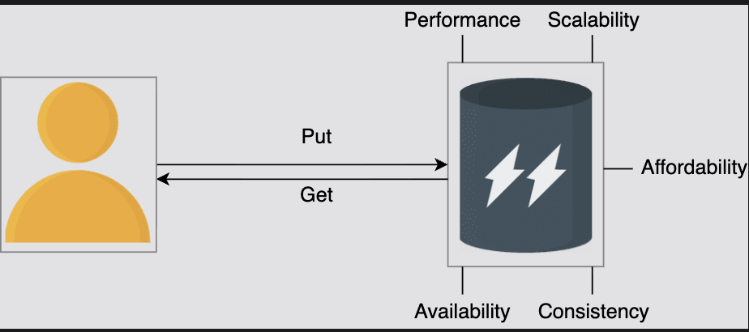
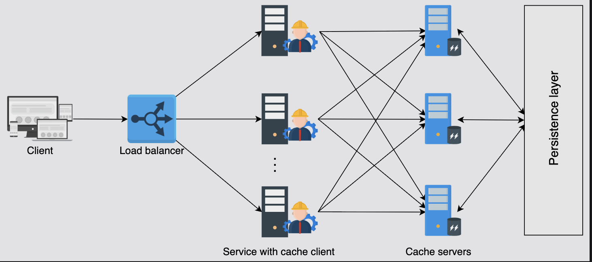

# High-Level Design of a Distributed Cache

Learn how we can develop a high-level design of a distributed cache.

## Table of Contents

- [Introduction](#introduction)
- [Requirements](#requirements)
- [API Design](#api-design)
- [Design Considerations](#design-considerations)
- [High-Level Design](#high-level-design)
- [Key Differences: Cache vs Key-Value Store](#key-differences-cache-vs-key-value-store)
- [How Sharding Mitigates SPOF](#how-sharding-mitigates-spof)
- [Summary](#summary)

---

## Introduction

In this lesson, we'll learn to design a distributed cache. We'll also discuss the trade-offs and design choices that can occur while we progress in our journey towards developing a solution.

A distributed cache is a critical component in modern systems that need to handle high traffic while maintaining low latency. Understanding the requirements, design considerations, and architecture is essential for building an effective caching solution.

---

## Requirements

Let us start by understanding the requirements of our solution.

### Functional Requirements

The following are the functional requirements:

#### 1. Insert Data
The user of a distributed cache system must be able to insert an entry to the cache.

**Operation**: `PUT(key, value)`

**Example:**
```
PUT("user:101", {"name": "Rahul", "city": "Delhi"})
```

---

#### 2. Retrieve Data
The user should be able to retrieve data corresponding to a specific key.

**Operation**: `GET(key)`

**Example:**
```
GET("user:101") → {"name": "Rahul", "city": "Delhi"}
```

---



### Non-Functional Requirements

We'll consider the following non-functional requirements:

#### 1. High Performance
The primary reason for the cache is to enable fast retrieval of data. Therefore, both the insert and retrieve operations must be fast.

**Target Performance:**
- Read latency: < 5ms
- Write latency: < 10ms
- Throughput: 100,000+ ops/second per server

---

#### 2. Scalability
The cache system should scale horizontally with no bottlenecks on an increasing number of requests.

**Scaling Characteristics:**
- Add more cache servers as load increases
- No single bottleneck component
- Linear scalability with additional nodes

---

#### 3. High Availability
The unavailability of the cache will put an extra burden on the database servers, which can also go down at peak load intervals. 

We also require our system to survive:
- Occasional failures of components
- Network outages
- Power failures

**Target Availability:** 99.9% or higher

---

#### 4. Consistency
Data stored on the cache servers should be consistent. For example, different cache clients retrieving the same data from different cache servers (primary or secondary) should be up to date.

**Consistency Levels:**
- **Strong consistency**: All clients see the same data at the same time
- **Eventual consistency**: Clients may see slightly stale data temporarily

**Trade-off**: Strong consistency may impact performance; eventual consistency provides better performance.

---

#### 5. Affordability
Ideally, the caching system should be designed from commodity hardware instead of an expensive supporting component within the design of a system.

**Approach:**
- Use commodity servers (standard x86 hardware)
- Avoid specialized hardware
- Scale with more nodes rather than expensive hardware

---

### Requirements Summary

| Requirement | Target | Priority |
|-------------|--------|----------|
| Performance | < 5ms reads, < 10ms writes | Critical |
| Scalability | Horizontal, linear scaling | High |
| Availability | 99.9%+ uptime | High |
| Consistency | Eventual or strong (configurable) | Medium |
| Affordability | Commodity hardware | Medium |

---

## API Design

The API design for this problem is sufficiently easy since there are only two basic operations.

### Insertion

The API call to perform insertion should look like this:

```
insert(key, value)
```

#### Parameters

| Parameter | Description |
|-----------|-------------|
| `key` | This is a unique identifier (string) |
| `value` | This is the data stored against a unique key (can be string, object, array, etc.) |

#### Return Value
This function returns:
- **Success**: Acknowledgment (e.g., `OK` or `true`)
- **Failure**: Error message depicting the problem at the server end

#### Example Usage

```python
# Insert user profile
result = cache.insert("user:101", {
    "name": "Rahul",
    "city": "Delhi",
    "email": "rahul@example.com"
})

if result == "OK":
    print("Data inserted successfully")
else:
    print(f"Error: {result}")
```

---

### Retrieval

The API call to retrieve data from the cache should look like this:

```
get(key)
```

#### Parameters

| Parameter | Description |
|-----------|-------------|
| `key` | The unique identifier for the data to retrieve |

#### Return Value
This call returns:
- **Cache Hit**: The data object stored against the key
- **Cache Miss**: `null` or error indicating key not found

#### Example Usage

```python
# Retrieve user profile
data = cache.get("user:101")

if data:
    print(f"User name: {data['name']}")
    print(f"City: {data['city']}")
else:
    print("Cache miss - fetch from database")
    data = database.query("SELECT * FROM users WHERE id = 101")
    # Populate cache for future requests
    cache.insert("user:101", data)
```

---

### Complete API Interface

```python
class DistributedCache:
    """
    Distributed Cache Interface
    """
    
    def insert(self, key: str, value: Any, ttl: int = 3600) -> str:
        """
        Insert data into the cache
        
        Args:
            key: Unique identifier
            value: Data to store
            ttl: Time-to-live in seconds (default: 1 hour)
            
        Returns:
            "OK" on success, error message on failure
        """
        pass
    
    def get(self, key: str) -> Any:
        """
        Retrieve data from the cache
        
        Args:
            key: Unique identifier
            
        Returns:
            Data object if found, None if cache miss
        """
        pass
    
    def delete(self, key: str) -> bool:
        """
        Delete data from the cache (optional)
        
        Args:
            key: Unique identifier
            
        Returns:
            True if deleted, False if not found
        """
        pass
```

---

## Key Differences: Cache vs Key-Value Store

**Question**: The API design of the distributed cache looks exactly like the key-value store. What are the possible differences between a key-value store and a distributed cache?

### Answer

Some of the key differences are the following:

#### 1. Persistence

**Key-Value Store:**
- Needs to durably store data (persistence)
- Data survives server restarts
- Written to disk (SSD, HDD)

**Distributed Cache:**
- Used in addition to persistent storage to increase reading performance
- Data may be lost on restart (acceptable)
- Primarily in-memory (RAM)

---

#### 2. Storage Medium

**Key-Value Store:**
- Writes data to non-volatile storage (disk-based)
- Slower but durable
- Examples: RocksDB, LevelDB

**Distributed Cache:**
- Serves data from RAM
- Much faster but volatile
- Examples: Redis, Memcached

---

#### 3. Fault Tolerance

**Key-Value Store:**
- Robust and should survive failures
- Data replication is critical
- Recovery is essential

**Distributed Cache:**
- Can crash and be populated from scratch after recovery
- Cache rebuild from database is acceptable
- Temporary unavailability is tolerable

---

#### 4. Data Completeness

**Key-Value Store:**
- Contains the complete dataset
- Source of truth for data
- All data must be retrievable

**Distributed Cache:**
- Contains subset of frequently accessed data
- Not the source of truth
- Cache misses are expected and handled

---

### Comparison Table

| Aspect | Key-Value Store | Distributed Cache |
|--------|----------------|-------------------|
| **Purpose** | Persistent data storage | Performance optimization |
| **Storage** | Disk (SSD/HDD) | RAM |
| **Durability** | Must persist data | Optional/not required |
| **Speed** | Moderate (disk I/O) | Very fast (memory access) |
| **Data Loss** | Unacceptable | Acceptable (rebuild from DB) |
| **Cost per GB** | Lower | Higher |
| **Use Case** | Primary data store | Secondary layer for speed |
| **Examples** | DynamoDB, Cassandra, MongoDB | Redis, Memcached, Hazelcast |

---

## Design Considerations

Before designing the distributed cache system, it's important to consider some design choices. Each of these choices will be purely based on our application requirements.

### 1. Storage Hardware

If our data is large, we may require sharding and therefore use shard servers for cache partitions.

#### Question: Specialized vs Commodity Hardware?

**Specialized Hardware:**
- ✅ Good performance
- ✅ High storage capacity
- ✅ Optimized for caching workloads
- ❌ Expensive
- ❌ Vendor lock-in

**Commodity Hardware:**
- ✅ Affordable
- ✅ Easy to scale horizontally
- ✅ Standard parts, easy replacement
- ❌ Lower individual server performance
- ✅ Can build large cache from many servers

**General Rule:**
The number of shard servers will depend on:
- Cache's size (total data volume)
- Access frequency (requests per second)
- Budget constraints

---

#### Persistence Consideration

We can consider storing our data on the secondary storage of these servers for persistence while we still serve data from RAM.

**When to Use Persistence:**
- Cache rebuilding takes a long time
- Want to survive reboots without cold start
- Data is expensive to regenerate

**When NOT to Use Persistence:**
- There's a dedicated persistence layer (database)
- Quick rebuild from database is acceptable
- RAM-only provides better performance

**Example Scenario:**
```
Cache with 100GB data, 1 million keys
Rebuild from DB: 30 minutes
With persistence: 2 minutes (read from disk)
```

---

### 2. Data Structures

A vital part of the design has to be the speed of accessing data.

#### Primary Data Structure: Hash Table

**Hash tables** are data structures that take a constant time on average to store and retrieve data.

**Operations:**
- Insert: O(1) average
- Retrieve: O(1) average
- Delete: O(1) average

**Example:**
```
Hash Table:
{
  "user:101" → Memory Address 0x1A2B
  "user:102" → Memory Address 0x3C4D
  "user:103" → Memory Address 0x5E6F
}
```

---

#### Secondary Data Structure: Linked List

We need another data structure to enforce an eviction algorithm on the cached data. In particular, **linked lists** are a good option.

**Why Linked Lists?**
- Constant time insertion/deletion: O(1)
- Easy to maintain order (access time)
- Perfect for LRU/MRU policies

**Combined Structure:**
```
Hash Map + Doubly Linked List = LRU Cache

Hash Map: Fast lookup O(1)
Linked List: Track access order O(1)
```

---

#### Supported Data Types

Even though we discussed in the API design section that we'll use strings for simplicity, it's possible to store different data structures or formats within the cache:

**Supported Types:**
- **Strings**: Simple key-value pairs
- **Hash Maps**: Nested key-value structures
- **Lists**: Ordered collections
- **Sets**: Unordered unique elements
- **Sorted Sets**: Ordered unique elements with scores
- **Binary Data**: Images, files, serialized objects

**Example (Redis-like):**
```python
# String
cache.set("user:name", "Rahul")

# Hash Map
cache.hset("user:101", "name", "Rahul")
cache.hset("user:101", "city", "Delhi")

# List
cache.lpush("recent_orders", "order:501")
cache.lpush("recent_orders", "order:502")

# Set
cache.sadd("online_users", "user:101")
cache.sadd("online_users", "user:102")
```

---

### 3. Cache Client

It's the client process or library that places the insert and retrieve calls.

#### Location Options

**Option 1: Within Serving Host (Internal Use)**
```
┌─────────────────────────┐
│   Application Server    │
│                         │
│  ┌──────────────────┐   │
│  │ Application Code │   │
│  └────────┬─────────┘   │
│           │             │
│  ┌────────▼─────────┐   │
│  │  Cache Client    │   │
│  └──────────────────┘   │
└─────────────────────────┘
```

**Pros:**
- Lower latency (in-process)
- Simpler deployment
- No external dependencies

**Cons:**
- Tight coupling
- Harder to upgrade cache logic

---

**Option 2: Dedicated Cache Client (External Service)**
```
┌──────────────┐      ┌──────────────┐
│ Application  │      │   Dedicated  │
│   Server     │─────→│ Cache Client │
└──────────────┘      └──────┬───────┘
                             │
                      ┌──────▼───────┐
                      │Cache Servers │
                      └──────────────┘
```

**Pros:**
- Decoupled architecture
- Easy to upgrade
- Can serve multiple applications

**Cons:**
- Additional network hop
- More complex infrastructure

---

### 4. Writing Policy

The writing strategy over the cache and database has consistency implications. In general, there's no optimal choice, but depending on our application, the preference of writing policy is significantly important.

#### Writing Policy Options

| Policy | Consistency | Performance | Use Case |
|--------|-------------|-------------|----------|
| **Write-through** | Strong | Slower writes | Banking, orders |
| **Write-back** | Eventual | Fast writes | Analytics, logs |
| **Write-around** | Strong | Medium | Write-heavy workloads |

**Selection Criteria:**
- How critical is data consistency?
- What's the read-to-write ratio?
- Can we tolerate data loss?

---

### 5. Eviction Policy

By design, the cache provides low-latency reads and writes. To achieve this, data is often served from RAM memory. Usually, we can't put all the data in the cache due to the limited size of the cache as compared to the full dataset.

**Problem**: Cache has limited capacity (e.g., 10GB) but dataset is 1TB.

**Solution**: Need to carefully decide what stays in the cache and how to make room for new entries.

#### Common Eviction Policies

**1. Least Recently Used (LRU)**
- Evicts data that hasn't been accessed for the longest time
- **Best for**: Social media, news feeds, content platforms
- **Example**: Recently uploaded content gets more views

**2. Least Frequently Used (LFU)**
- Evicts data accessed least often
- **Best for**: Product catalogs, static content

**3. First In First Out (FIFO)**
- Evicts oldest data first
- **Best for**: Simple scenarios, time-sensitive data

**4. Time To Live (TTL)**
- Data expires after a set time
- **Best for**: Session data, temporary tokens

---

#### Optimizing TTL

Apart from eviction policies, optimizing the **time-to-live (TTL)** value can play an essential role in reducing the number of cache misses.

**TTL Guidelines:**

| Data Type | Recommended TTL | Reasoning |
|-----------|-----------------|-----------|
| User profiles | 1-24 hours | Changes infrequently |
| Product catalog | 1 hour | May update during business hours |
| Session data | 30 minutes | Active user session |
| Real-time scores | 10-60 seconds | Frequently updated |
| Static content | 7 days | Rarely changes |

---

## How Sharding Mitigates SPOF

**Question**: How does sharding help mitigate single points of failure (SPOF) in a distributed cache system?

### Answer

**Sharding** involves dividing the cache data into smaller, manageable chunks (shards) and distributing them across multiple cache servers.

### How Sharding Mitigates SPOF

This approach mitigates **single points of failure (SPOFs)** by ensuring that each shard is stored on a different server.

#### Key Benefits

**1. Isolated Failures**
If one server fails, only the data on the affected shard is lost, while the rest of the system remains intact.

**Example:**
```
3 Cache Servers with Sharding:

Server 1: Keys A-F (100,000 keys)
Server 2: Keys G-M (100,000 keys)
Server 3: Keys N-Z (100,000 keys)

If Server 2 fails:
- Only keys G-M are unavailable (33% of cache)
- Keys A-F and N-Z still accessible (67% of cache)
- System continues operating at reduced capacity
```

**Without Sharding (Single Server):**
```
If the single server fails:
- 100% of cache is unavailable
- Complete system outage
- All requests hit the database
```

---

**2. Load Distribution**

Sharding distributes the load across multiple servers, preventing any single server from becoming a bottleneck.

**Example:**
```
Total Load: 300,000 requests/second

With 3 shards:
Server 1: ~100,000 req/s
Server 2: ~100,000 req/s
Server 3: ~100,000 req/s

Each server handles manageable load.
```

---

**3. Improved Fault Tolerance**

Multiple servers mean the system can tolerate failures of individual servers without complete system failure.

**Availability Calculation:**
```
Single server availability: 99%
System downtime: 1%

With 3 independent shards:
Probability all 3 fail: 0.01³ = 0.0001%
System availability: ~99.99%+
```

---

**4. Replication Support**

Sharding enables easier replication strategies where each shard can have replicas.

**Example:**
```
Shard 1: Primary (Server 1) + Replica (Server 4)
Shard 2: Primary (Server 2) + Replica (Server 5)
Shard 3: Primary (Server 3) + Replica (Server 6)

If Server 1 fails → Failover to Server 4
No data loss, minimal downtime
```

---

### Visual Comparison

**Without Sharding (SPOF):**
```
        All Requests
             ↓
     ┌───────────────┐
     │  Single Cache │  ← SINGLE POINT OF FAILURE
     │    Server     │
     └───────────────┘
             ↓
         Database

If cache fails → All requests hit database → Overload
```

**With Sharding (No SPOF):**
```
        All Requests
             ↓
    ┌────────┼────────┐
    ↓        ↓        ↓
┌───────┐ ┌───────┐ ┌───────┐
│Cache 1│ │Cache 2│ │Cache 3│
│Shard A│ │Shard B│ │Shard C│
└───────┘ └───────┘ └───────┘
    ↓        ↓        ↓
         Database

If Cache 2 fails → Only Shard B requests hit database
Shards A and C continue serving normally
```

---

## High-Level Design

The following depicts our high-level design architecture:

### Architecture Diagram



```
┌─────────────────────────────────────────────────────────────┐
│                      Cache Clients                          │
│  ┌──────────────┐  ┌──────────────┐  ┌──────────────┐      │
│  │ App Server 1 │  │ App Server 2 │  │ App Server 3 │      │
│  │              │  │              │  │              │      │
│  │ Cache Client │  │ Cache Client │  │ Cache Client │      │
│  └──────┬───────┘  └──────┬───────┘  └──────┬───────┘      │
└─────────┼──────────────────┼──────────────────┼─────────────┘
          │                  │                  │
          └──────────────────┼──────────────────┘
                             │
          ┌──────────────────┼──────────────────┐
          │                  │                  │
   ┌──────▼────┐      ┌──────▼────┐      ┌──────▼────┐
   │  Cache    │      │  Cache    │      │  Cache    │
   │ Server 1  │      │ Server 2  │      │ Server 3  │
   │           │      │           │      │           │
   │ Shard A   │      │ Shard B   │      │ Shard C   │
   └─────┬─────┘      └─────┬─────┘      └─────┬─────┘
         │                  │                  │
         └──────────────────┼──────────────────┘
                            │
                     ┌──────▼──────┐
                     │   Database  │
                     │   Servers   │
                     └─────────────┘
```

---

### Main Components

The main components in this high-level design are the following:

#### 1. Cache Client

**Location**: This library resides in the service application servers.

**Responsibilities:**
- Holds all the information regarding cache servers
- Chooses one of the cache servers using a hash and search algorithm for each incoming insert and retrieve request
- Implements consistent hashing for server selection
- Handles serialization/deserialization of data

**Consistency Requirement:**
All the cache clients should have a consistent view of all the cache servers. Also, the resolution technique to move data to and from the cache servers should be the same.

**Why Consistency Matters:**
Otherwise, different clients will request different servers for the same data, leading to:
- Cache misses
- Inconsistent data
- Wasted cache space

**Example:**
```
Cache Client Configuration:
{
  "servers": [
    "cache1.example.com:6379",
    "cache2.example.com:6379",
    "cache3.example.com:6379"
  ],
  "hash_algorithm": "consistent_hashing",
  "virtual_nodes": 150
}

All clients must have identical configuration!
```

---

#### 2. Cache Servers

**Purpose**: These servers maintain the cache of the data.

**Characteristics:**
- Each cache server is accessible by all the cache clients
- Each server is connected to the database to store or retrieve data
- Servers are independent and don't communicate with each other (in basic design)

**Communication Protocol:**
Cache clients use **TCP** or **UDP** protocol to perform data transfer to or from the cache servers.

| Protocol | Advantages | Disadvantages |
|----------|------------|---------------|
| **TCP** | Reliable, ordered delivery | Higher overhead |
| **UDP** | Fast, low overhead | No delivery guarantee |

**Common Choice**: TCP for reliability

---

**Failure Handling:**
However, if any cache server is down, requests to those servers are resolved as a **missed cache** by the cache clients.

**Failure Flow:**
```
1. Client requests "user:101"
2. Hash function selects Server 2
3. Server 2 is down
4. Connection fails
5. Cache client marks as MISS
6. Fetch from database
7. Return to application
8. (Optional) Store in alternative server
```

---

### Data Flow Examples

#### Example 1: Successful Cache Hit

```
1. Application requests GET("user:101")
   ↓
2. Cache Client calculates hash:
   hash("user:101") → Server 2
   ↓
3. Cache Client sends request to Server 2
   ↓
4. Server 2 has data in memory
   ↓
5. Server 2 returns data
   ↓
6. Cache Client returns to application
   
Total time: ~2ms
```

---

#### Example 2: Cache Miss

```
1. Application requests GET("user:999")
   ↓
2. Cache Client calculates hash:
   hash("user:999") → Server 1
   ↓
3. Cache Client sends request to Server 1
   ↓
4. Server 1 doesn't have data (MISS)
   ↓
5. Server 1 queries database
   ↓
6. Database returns data
   ↓
7. Server 1 stores in cache
   ↓
8. Server 1 returns data to client
   ↓
9. Cache Client returns to application
   
Total time: ~50ms (first time)
Next request: ~2ms (cached)
```

---

#### Example 3: Server Failure

```
1. Application requests GET("user:101")
   ↓
2. Cache Client calculates hash:
   hash("user:101") → Server 2
   ↓
3. Cache Client attempts connection to Server 2
   ↓
4. Server 2 is DOWN (connection timeout)
   ↓
5. Cache Client marks as CACHE MISS
   ↓
6. Cache Client queries database directly
   ↓
7. Database returns data
   ↓
8. Cache Client returns to application
   (Server 2 data will be unavailable until recovery)
   
Total time: ~100ms (database query)
```

---

## Summary

### Key Design Decisions

| Component | Decision | Rationale |
|-----------|----------|-----------|
| **Storage** | Commodity hardware + RAM | Cost-effective, scalable |
| **Data Structure** | Hash table + Linked list | O(1) operations for cache |
| **Client Location** | Embedded in app servers | Lower latency, simpler |
| **Writing Policy** | Application-dependent | Balance consistency vs performance |
| **Eviction Policy** | LRU (default) | Works well for most use cases |
| **Sharding** | Consistent hashing | Minimize redistribution, no SPOF |

---

### Requirements Achievement

✅ **High Performance**: RAM-based storage with O(1) operations
✅ **Scalability**: Horizontal scaling with sharding
✅ **High Availability**: Multiple servers, isolated failures
✅ **Consistency**: Configurable (strong or eventual)
✅ **Affordability**: Commodity hardware approach


