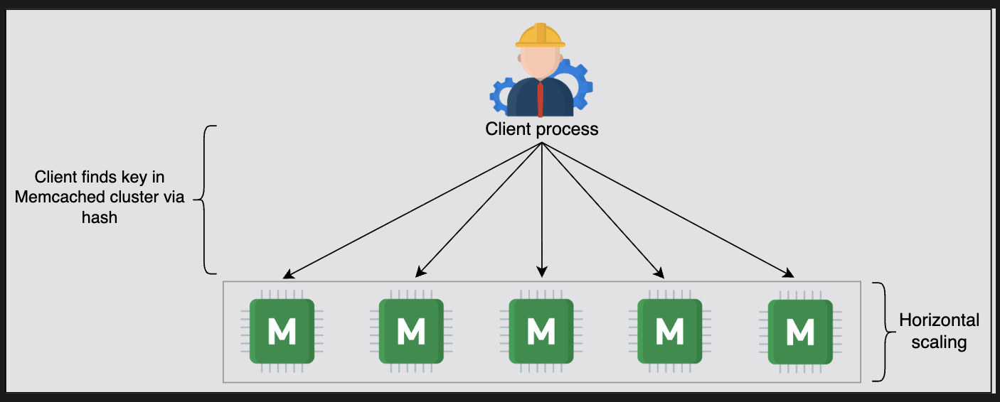
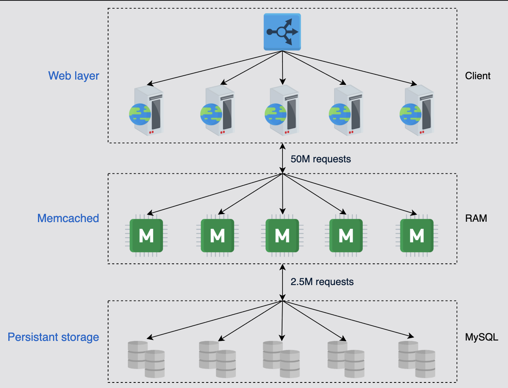
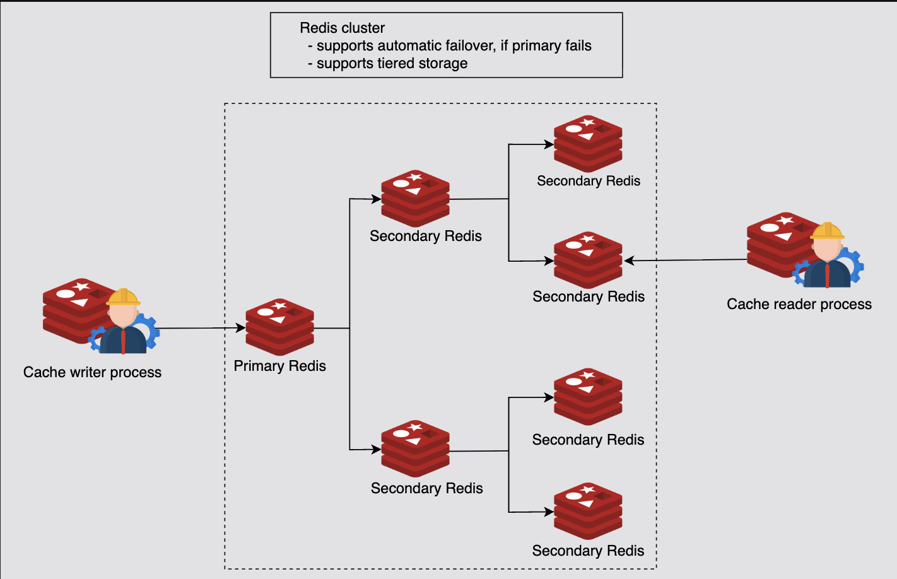
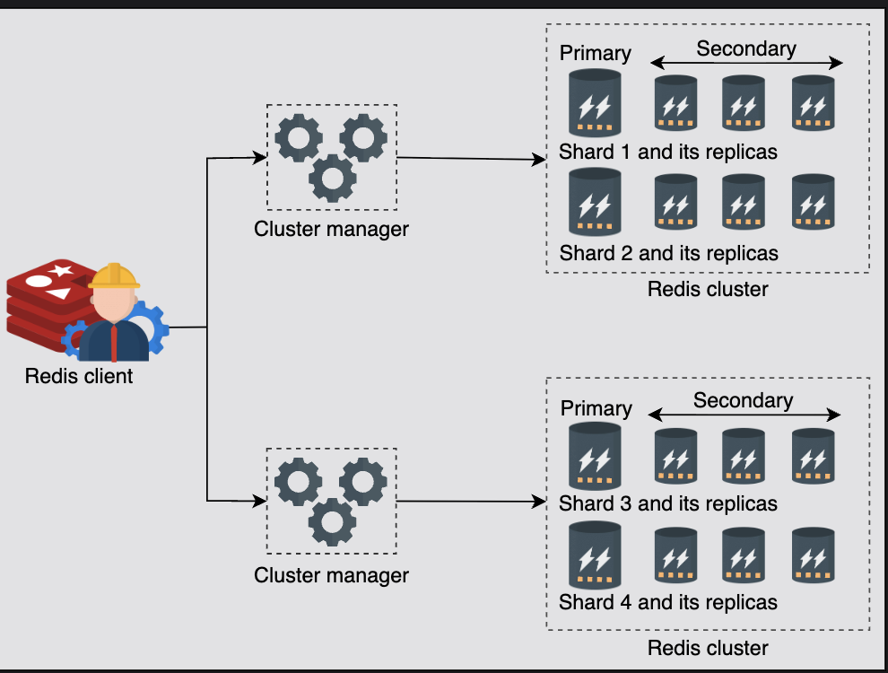
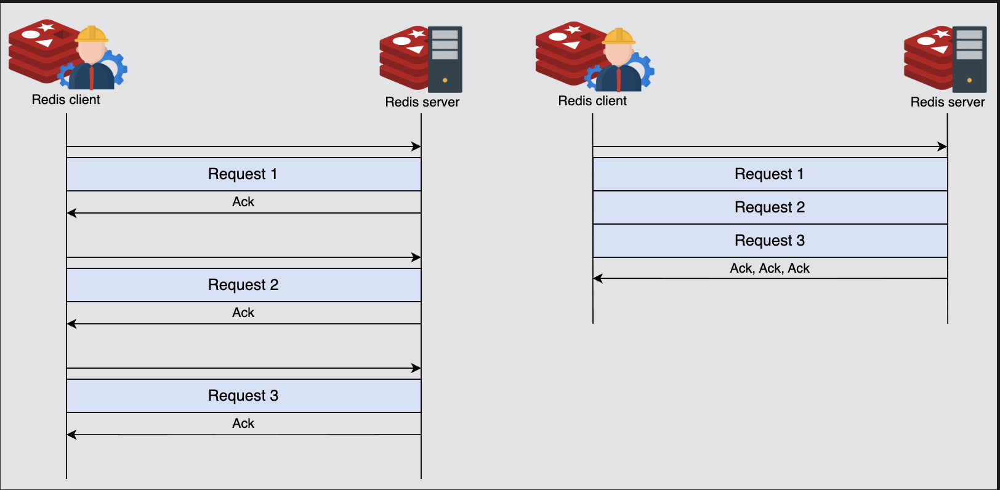

# Memcached versus Redis

Let's compare Memcached and Redis - two of the most popular distributed caching solutions.

## Table of Contents

- [Introduction](#introduction)
- [Memcached](#memcached)
- [Redis](#redis)
- [Detailed Comparison](#detailed-comparison)
- [When to Use Which](#when-to-use-which)
- [Questions and Answers](#questions-and-answers)
- [Summary](#summary)

---

## Introduction

This lesson will discuss some of the widely adopted real-world implementations of a distributed cache. Our focus will be on two well-known open-source frameworks: **Memcached** and **Redis**.

### Common Characteristics

Both are:
- ✅ Highly scalable
- ✅ Highly performant
- ✅ Robust caching tools
- ✅ Follow the client-server model
- ✅ Achieve sub-millisecond latency

Let's discuss each one of them and then compare their usefulness.

---

## Memcached

### History and Overview

**Memcached** was introduced in **2003**. It's a key-value store distributed cache designed to store objects very fast.

### Data Model

Memcached stores data in the form of a **key-value pair**.

**Important Limitation:**
- Both the key and the value are **strings**
- Any data that has been stored will have to be **serialized**
- Memcached **doesn't support and can't manipulate** different data structures

**Example:**
```
Key: "user:101"
Value: "{\"name\":\"Rahul\",\"city\":\"Delhi\"}"  // Must be serialized string

Cannot do:
- In-place modifications
- List operations (push, pop)
- Set operations (add, remove)
```

---

### Architecture

Memcached has a **client and server component**, each of which is necessary to run the system.

#### Design Philosophy

The system is designed in a way that:
- **Half the logic** is encompassed in the server
- **Other half** is in the client

#### Shared-Nothing Architecture

Each server follows the **shared-nothing architecture**:
- Servers are **unaware of each other**
- **No synchronization** between servers
- **No data sharing** between servers
- **No communication** between servers

**Architecture Diagram:**
```
┌──────────────┐  ┌──────────────┐  ┌──────────────┐
│   Client 1   │  │   Client 2   │  │   Client 3   │
│              │  │              │  │              │
│ Hash logic   │  │ Hash logic   │  │ Hash logic   │
└──────┬───────┘  └──────┬───────┘  └──────┬───────┘
       │                 │                 │
       └─────────────────┼─────────────────┘
                         │
        ┌────────────────┼────────────────┐
        │                │                │
┌───────▼──────┐  ┌──────▼─────┐  ┌──────▼─────┐
│ Memcached    │  │ Memcached  │  │ Memcached  │
│  Server 1    │  │  Server 2  │  │  Server 3  │
│              │  │            │  │            │
│ No inter-    │  │ No inter-  │  │ No inter-  │
│ server comm. │  │ server     │  │ server     │
└──────┬───────┘  └──────┬─────┘  └──────┬─────┘
       │                 │                │
       └─────────────────┼────────────────┘
                         │
                  ┌──────▼──────┐
                  │   Database  │
                  └─────────────┘
```

---

### Performance

Due to the disconnected design, Memcached is able to achieve:
- **Almost deterministic query speed**: **O(1)**
- **Millions of keys per second** using a high-end system
- **High throughput**
- **Low latency**

**Performance Metrics:**
```
Single server capacity:
- 100,000+ operations/second
- Sub-millisecond latency
- O(1) lookup time
- Minimal CPU overhead
```

---

### Scalability

As evident from the design of a typical Memcached cluster, Memcached **scales well horizontally**.

**Scaling Process:**
```
3 servers → 6 servers:

Client logic:
  hash(key) % 3 → server
  Changes to:
  hash(key) % 6 → server

Challenge:
  Most keys need to be remapped
  (Use consistent hashing to minimize this)
```

The **client process** is usually maintained with the service host that also interacts with the authoritative storage (back-end database).


---

### Basic Commands

Some of the simple commands of Memcached include the following:

#### GET Command
```bash
get <key_1> <key_2> <key_3> ...
```

**Example:**
```bash
get user:101 user:102
```

**Response:**
```
VALUE user:101 0 24
{"name":"Rahul","age":25}
VALUE user:102 0 26
{"name":"Priya","age":28}
END
```

---

#### SET Command
```bash
set <key> <value> <flags> <exptime> <bytes>
```

**Example:**
```bash
set user:101 0 3600 24
{"name":"Rahul","age":25}
```

**Response:**
```
STORED
```

**Parameters:**
- `key`: user:101
- `flags`: 0 (custom metadata)
- `exptime`: 3600 seconds (1 hour TTL)
- `bytes`: 24 (data length)

---

#### DELETE Command
```bash
delete <key> [<time>]
```

**Example:**
```bash
delete user:101
```

**Response:**
```
DELETED
```

**With delayed deletion:**
```bash
delete user:101 300
# Deletes after 300 seconds
```

---

### Facebook and Memcached

#### Why Facebook Chose Memcached

The data access pattern in Facebook requires:
- **Frequent reads** and **updates**
- Views are presented to users **on the fly** instead of being generated ahead of time

Because Memcached is **simple**, it was an easy choice:
- Memcached started developing in **2003**
- Facebook was developed in **2004**
- In fact, in some cases, Facebook and Memcached teams worked together to find solutions

**Note:** Redis was developed in **2009**, so using Redis wasn't a possibility at Facebook by then.

---

#### Facebook's Memcached Deployment

At Facebook, Memcached sits between the MySQL database and the web layer:

**Scale (as of 2013):**
- **28 TeraBytes of RAM**
- Spread across **800+ servers**
- By approximation of **least recently used (LRU)** eviction policy
- Facebook achieves a **cache hit rate of 95%**

---

#### Architecture at Facebook

```
┌─────────────────────────────────────────────────┐
│              Web Layer                          │
│         50 Million Requests/sec                 │
└────────────────┬────────────────────────────────┘
                 │
                 │ 95% Hit Rate
                 ▼
┌─────────────────────────────────────────────────┐
│          Memcached Layer                        │
│     28 TB RAM across 800+ servers               │
│                                                 │
│  47.5M requests served ───────────────────┐    │
│                                           │    │
└───────────────────────────────────────────┼────┘
                 │                          │
                 │ 5% Miss Rate             │
                 │ 2.5M requests            │
                 ▼                          │
┌─────────────────────────────────────────┐ │
│       Persistence Layer (MySQL)         │ │
│        2.5 Million Requests/sec         │ │
└─────────────────────────────────────────┘ │
         ▲                                  │
         │      Cache population            │
         └──────────────────────────────────┘
```

**Impact:**
- Only **2.5 million requests** (5%) reach the persistence layer
- **47.5 million requests** (95%) served from cache
- **Massive reduction** in database load


---

## Redis

### Overview

**Redis** is a data structure store that can be used as a:
- ✅ Cache
- ✅ Database
- ✅ Message broker

It offers **rich features** at the cost of **additional complexity**.

---

### Key Features

#### 1. Data Structure Store

Redis **understands the different data structures** it stores.

**Advantage:**
- We **don't have to retrieve** data structures from it, manipulate them, and then store them back
- We can make **in-house changes** that save both time and effort

**Example:**
```redis
# Instead of:
GET user:101:cart
# Returns: ["item1", "item2"]
# Modify in application
# SET user:101:cart ["item1", "item2", "item3"]

# Do this:
LPUSH user:101:cart "item3"
# Redis modifies the list directly!
```

---

#### 2. Database

It can **persist all the in-memory blobs** on the secondary storage.

**Persistence Options:**
- **RDB (Redis Database)**: Point-in-time snapshots
- **AOF (Append Only File)**: Log every write operation

**Example:**
```
Every 60 seconds:
  Save snapshot to disk
  
On restart:
  Load from snapshot
  Replay AOF log
  Cache rebuilt in seconds (not hours!)
```

---

#### 3. Message Broker

**Asynchronous communication** is a vital requirement in distributed systems.

Redis can translate **millions of messages per second** from one component to another in a system.

**Use Cases:**
- Pub/Sub messaging
- Task queues
- Real-time notifications
- Event streaming

**Example:**
```redis
# Publisher
PUBLISH notifications "New message from Rahul"

# Subscriber
SUBSCRIBE notifications
# Receives: "New message from Rahul"
```

---

### Advanced Features

#### Built-in Replication

Redis provides a **built-in replication mechanism**:
- Automatic replication
- Master-slave architecture
- Read replicas for scaling

---

#### Automatic Failover

**Redis Sentinel** provides:
- Monitoring
- Notification
- Automatic failover
- Configuration provider

---

#### Persistence Levels

**Different levels of persistence:**
- No persistence (pure cache)
- RDB only (snapshots)
- AOF only (append log)
- RDB + AOF (both)

---

#### Memcached Protocol Compatibility

Apart from that, Redis **understands Memcached protocols**, and therefore:
- Solutions using Memcached can translate to Redis
- Easy migration path
- Backward compatibility

---

### Architecture Benefits

A particularly good aspect of Redis is that it **separates data access from cluster management**.

**Key Principle:**
- It **decouples the control plane from the data plane**
- This results in **increased reliability and performance**

**Architecture:**
```
┌─────────────────────────────────────┐
│        Control Plane                │
│  (Cluster Management, Monitoring)   │
└─────────────────┬───────────────────┘
                  │ Manages
                  ▼
┌─────────────────────────────────────┐
│         Data Plane                  │
│  (Data Access, Replication)         │
└─────────────────────────────────────┘

Benefits:
✅ Reliability: Control failures don't affect data access
✅ Performance: No management overhead on data path
```

---

### Consistency Model

Finally, Redis **doesn't provide strong consistency** due to the use of **asynchronous replication**.

**Why Asynchronous?**
```
Synchronous replication:
  Write → Wait for replicas → Acknowledge
  Latency: 10-50ms ❌

Asynchronous replication:
  Write → Acknowledge immediately → Replicate in background
  Latency: 1-2ms ✅
  
Trade-off: Eventual consistency
```


---

### Redis Cluster

Redis has **built-in cluster support** that provides high availability. This is called **Redis Sentinel**.

#### Cluster Architecture

```
┌──────────────────────────────────────────────────┐
│            Redis Cluster                         │
│                                                  │
│  ┌─────────────┐  ┌─────────────┐              │
│  │ Shard 1     │  │ Shard 2     │              │
│  │             │  │             │              │
│  │ ┌─────────┐ │  │ ┌─────────┐ │              │
│  │ │ Primary │ │  │ │ Primary │ │              │
│  │ └────┬────┘ │  │ └────┬────┘ │              │
│  │      │      │  │      │      │              │
│  │ ┌────▼────┐ │  │ ┌────▼────┐ │              │
│  │ │Replica 1│ │  │ │Replica 1│ │              │
│  │ └─────────┘ │  │ └─────────┘ │              │
│  │ ┌─────────┐ │  │ ┌─────────┐ │              │
│  │ │Replica 2│ │  │ │Replica 2│ │              │
│  │ └─────────┘ │  │ └─────────┘ │              │
│  └─────────────┘  └─────────────┘              │
│         ▲                ▲                       │
└─────────┼────────────────┼───────────────────────┘
          │                │
   ┌──────┴────────────────┴──────┐
   │    Cluster Manager            │
   │  - Failure Detection          │
   │  - Automatic Failover         │
   └───────────────────────────────┘
          ▲
          │
   ┌──────┴──────┐
   │ Monitoring  │
   │ Config Mgmt │
   └─────────────┘
```

---

#### Key Characteristics

**A cluster has:**
- One or more **Redis databases**
- Queried using **multithreaded proxies**

**Automatic Sharding:**
- Each shard has **primary and secondary nodes**
- Number of shards is **configurable**

**Cluster Manager:**
- Detects failures
- Performs automatic failovers
- Monitors health

**Management Layer:**
- Monitoring software
- Configuration components


---

### Pipelining in Redis

Since Redis uses a **client-server model**, each request blocks the client until the server receives the result.

#### The Problem

**Without Pipelining:**
```
Client:
  Send Request 1 → Wait → Receive Response 1
  Send Request 2 → Wait → Receive Response 2
  Send Request 3 → Wait → Receive Response 3

Total time: 3 × RTT + 3 × Processing
Example: 3 × 1ms + 3 × 0.1ms = 3.3ms
```

A Redis client looking to send subsequent requests will have to wait for the server to respond to the first request. So, the **overall latency will be higher**.

---

#### The Solution: Pipelining

Redis uses **pipelining** to speed up the process.

**Pipelining** is the process of:
- Combining multiple requests from the client side
- **Without waiting** for a response from the server
- Reduces the number of **RTT (Round-Trip Time)** spans for multiple requests

**With Pipelining:**
```
Client:
  Send Request 1
  Send Request 2  (don't wait!)
  Send Request 3  (don't wait!)
  Receive Response 1, 2, 3 together

Total time: 1 × RTT + 3 × Processing
Example: 1 × 1ms + 3 × 0.1ms = 1.3ms

Improvement: 3.3ms → 1.3ms (2.5x faster!)
```

---

#### Benefits of Pipelining

The process of pipelining reduces:

1. **Latency through RTT**
   - Multiple requests sent in one RTT
   
2. **Socket I/O time**
   - Fewer system calls
   
3. **Mode switching overhead**
   - System calls in the operating system are expensive
   - Pipelining significantly reduces these

---

#### Server-Side Processing

Pipelining the commands from the client side has **no impact on how the server processes** these requests.

**Example:**
```
Two requests pipelined by client:
  1. SET user:101 "data"
  2. GET invalid:key

Server processes:
  1. SET succeeds → Returns "OK"
  2. GET fails → Returns error

Client receives both responses together
```

The client is **independent** in batching similar commands together to achieve maximum throughput.

---

#### Performance Impact

**Note:** Pipelining improves the latency to a minimum of **five folds** if both the client and server are on the same machine.

**Same Machine (Loopback):**
```
Without pipelining: 0.5ms per request
With pipelining: 0.1ms per request (5x faster)
```

**The true power of pipelining is highlighted in systems where requests are sent to distant machines.**

**Distant Machines:**
```
RTT: 50ms
Processing: 0.1ms

Without pipelining (10 requests):
  Total: 10 × (50ms + 0.1ms) = 501ms

With pipelining (10 requests):
  Total: 50ms + 10 × 0.1ms = 51ms

Improvement: 501ms → 51ms (10x faster!)
```

---

## Detailed Comparison

Even though Memcached and Redis both belong to the **NoSQL family**, there are subtle aspects that set them apart.

### 1. Simplicity

**Memcached:**
- ✅ Simple design
- ❌ Most of the effort for managing clusters left to developers
- ✅ Finer control using Memcached
- ❌ More manual work required

**Redis:**
- ✅ Automates most of the scalability tasks
- ✅ Automates data division
- ⚠️ More complex
- ✅ Less manual work required

**Example:**
```
Memcached:
  Sharding → Client implements
  Replication → Third-party tools
  Failover → Manual

Redis:
  Sharding → Built-in (Redis Cluster)
  Replication → Built-in
  Failover → Automatic (Redis Sentinel)
```

---

### 2. Persistence

**Redis:**
- ✅ Provides persistence
- **AOF (Append Only File)**: Log every write
- **RDB (Redis Database)**: Periodic snapshots

**Memcached:**
- ❌ No persistence support
- ⚠️ Can be catered to by using third-party tools

**Impact:**
```
Cache restart:

Memcached:
  Cold start → Build from scratch → 1-2 hours

Redis with persistence:
  Load from disk → Ready in minutes
```

---

### 3. Data Types

**Memcached:**
- Stores objects in the form of **key-value pairs**
- Both are **strings**
- Must serialize/deserialize all data

**Redis:**
- ✅ **Strings**
- ✅ **Lists** (linked lists)
- ✅ **Sets** (unordered unique elements)
- ✅ **Sorted Sets** (ordered by score)
- ✅ **Hash Maps** (nested key-value)
- ✅ **Bitmaps**
- ✅ **HyperLogLogs** (cardinality estimation)
- ✅ **Streams** (event log)

**Max Size:**
- Maximum key or value size is **configurable**

**Example:**
```redis
# Memcached (only strings)
SET cart:101 "[\"item1\",\"item2\"]"
# Must serialize/deserialize

# Redis (native data structures)
LPUSH cart:101 "item1"
LPUSH cart:101 "item2"
LRANGE cart:101 0 -1
# Direct list operations!
```

---

### 4. Memory Usage

Both tools allow us to set a **maximum memory size** for caching.

**Memcached:**
- Uses the **slab allocation method** for reducing fragmentation
- ⚠️ When we update existing entries' size or store many small objects, there may be **wastage of memory**
- ✅ Nonetheless, there are **configuration workarounds** to resolve such issues

**Redis:**
- More flexible memory management
- Better for variable-sized objects
- Built-in memory optimization

**Slab Allocation in Memcached:**
```
Slab 1: 64-byte chunks
Slab 2: 128-byte chunks
Slab 3: 256-byte chunks

Problem:
  Store 100-byte object → Uses 128-byte chunk
  Waste: 28 bytes

  Many small objects → Fragmentation
```

---

### 5. Multithreading

**Redis:**
- ❌ Runs as a **single process** using **one core**
- ✅ Reduces complexity of multithreaded systems
- ✅ Multiple Redis processes can be executed for concurrency
- ✅ Redis has improved over years by tweaking performance
- ✅ Redis can store **small data items efficiently**

**Memcached:**
- ✅ Can efficiently use **multicore systems**
- ✅ **Multithreading technology**
- ✅ Better for large files

**Recommendation:**
```
File size < 100 KB:
  Redis ✅ (optimized for small items)

File size > 100 KB:
  Memcached ✅ (better multicore utilization)
```

---

### 6. Replication

**Redis:**
- ✅ Automates the replication process via **few commands**
- ✅ Built-in replication
- ⚠️ Scalability through clustering is **complex**

**Memcached:**
- ❌ Replication subject to usage of **third-party tools**
- ✅ Architecturally, Memcached can **scale well horizontally** due to its simplicity

**Replication Example:**
```redis
# Redis (simple!)
REPLICAOF master-host 6379
# Automatic replication starts

# Memcached
# No built-in command
# Must use: Repcached, memcached-replicate, etc.
```

---

### Comparison Table

| Feature | Memcached | Redis |
|---------|-----------|-------|
| **Low latency** | Yes | Yes |
| **Persistence** | Possible via third-party tools | Multiple options (RDB, AOF) |
| **Multilanguage support** | Yes | Yes |
| **Data sharding** | Possible via third-party tools | Built-in solution (Redis Cluster) |
| **Ease of use** | Yes (simple) | Yes (automated) |
| **Multithreading support** | Yes | No (single-threaded) |
| **Support for data structure** | Objects (strings only) | Multiple data structures |
| **Support for transaction** | No | Yes (MULTI/EXEC) |
| **Eviction policy** | LRU | Multiple algorithms (LRU, LFU, TTL, etc.) |
| **Lua scripting support** | No | Yes |
| **Geospatial support** | No | Yes (GEO commands) |
| **Pub/Sub messaging** | No | Yes |
| **Persistence options** | None (third-party) | RDB, AOF, both |
| **Replication** | Third-party tools | Built-in |
| **Automatic failover** | No | Yes (Redis Sentinel) |
| **Cluster mode** | Client-side | Built-in (Redis Cluster) |
| **Best for files** | > 100 KB | < 100 KB |

---

## When to Use Which

### Use Memcached When:

✅ **Smaller, simpler read-heavy systems**
```
Characteristics:
- Simple key-value storage
- Mostly read operations (95%+ reads)
- No need for complex data structures
- No persistence required
- Large file sizes (> 100 KB)
```

✅ **Examples:**
- Session caching
- Page fragment caching
- Database query result caching
- Static content caching

---

### Use Redis When:

✅ **Systems that are complex and are both read- and write-heavy**
```
Characteristics:
- Need complex data structures
- Both reads and writes are common
- Need persistence
- Need pub/sub messaging
- Need transactions
- Need Lua scripting
- Small to medium data sizes
```

✅ **Examples:**
- Real-time analytics
- Leaderboards (sorted sets)
- Rate limiting (counters)
- Session store with complex data
- Message queue
- Real-time notifications
- Geospatial applications

---

### Decision Matrix

| Requirement | Choose |
|-------------|--------|
| Simple key-value only | Memcached |
| Need lists, sets, sorted sets | Redis |
| Large files (> 100 KB) | Memcached |
| Small files (< 100 KB) | Redis |
| Read-heavy (95%+ reads) | Memcached |
| Mixed read/write | Redis |
| No persistence needed | Memcached |
| Need persistence | Redis |
| Multicore utilization | Memcached |
| Single-core optimization | Redis |
| Simple deployment | Memcached |
| Need clustering/failover | Redis |
| Need pub/sub | Redis |
| Need transactions | Redis |
| Need geospatial queries | Redis |

---

## Questions and Answers

### Q1: Based on the implementation details, which of the two frameworks (Memcached or Redis) has a striking similarity with the distributed cache that we designed in the previous lesson?

**Answer:** The answer is **Memcached**.

**Reasons:**

#### 1. Client-Side Hashing
✅ Client software chooses which cache server to use with a **hashing algorithm**

**Our Design:**
```
Cache Client:
  hash(key) → Determine server
  Forward request to selected server
```

**Memcached:**
```
Same approach:
  Client implements consistent hashing
  Client routes requests
```

---

#### 2. Server-Side Hash Table
✅ Server software stores the values against each key using an **internal hash table**

**Our Design:**
```
Each cache server:
  HashMap for O(1) lookup
```

**Memcached:**
```
Same structure:
  Internal hash table
  O(1) operations
```

---

#### 3. LRU Eviction Policy
✅ **Least recently used (LRU)** is used as the eviction policy

**Our Design:**
```
Eviction:
  Doubly linked list
  LRU algorithm
```

**Memcached:**
```
Same approach:
  LRU eviction
  Slab-based memory management
```

---

#### 4. No Inter-Server Communication
✅ There's **no communication** between different cache servers

**Our Design:**
```
Servers:
  Independent
  No synchronization
  Shared-nothing
```

**Memcached:**
```
Same architecture:
  Shared-nothing
  No inter-server communication
```

---

**Summary:**
```
Our Design ≈ Memcached Architecture

Both use:
✅ Client-side routing
✅ Hash table storage
✅ LRU eviction
✅ Shared-nothing architecture

Redis is different:
- Server-side clustering
- Built-in replication
- Complex data structures
```

---

### Q2: Why do third-party tools exist for persisting Memcached data?

**Answer:** It's because a lot of data is read and written to cache servers, and they may occasionally crash for whatever reason.

#### The Problem

**Scenario:**
```
1. Cache server has 100 GB of data in RAM
2. Server crashes (hardware failure, power outage)
3. Server restarts with empty cache
4. Need to rebuild cache from database
```

---

#### Impact of Cold Start

After restarting, **building a cache from scratch** can take up to **hours** in specific scenarios, and that ultimately **reduces system performance**.

**Example:**
```
Cold start timeline:
T0: Server restarts (cache empty)
T1-T120 min: Cache rebuilding
  - All requests miss cache
  - Database overloaded
  - High latency (100ms vs 5ms)
  - Poor user experience

After 2 hours:
  - Cache warmed up
  - Performance normalized
```

---

#### Solution: Persistence

Therefore, **cache data may be persisted to disk** to be loaded on a restart.

**With Persistence:**
```
Restart timeline:
T0: Server crashes
T1: Server restarts
T2-T5 min: Load from disk
  - Read 100 GB from disk
  - Restore to RAM
  - Ready to serve

After 5 minutes:
  ✅ Cache fully operational
  ✅ No database overload
  ✅ Normal performance
```

---

#### Third-Party Solutions for Memcached

**Popular Tools:**
- **memcached-tool**: Dump and restore
- **Repcached**: Replication patch
- **mcrouter**: Facebook's Memcached router with persistence

**Why Third-Party?**
- Memcached designed to be simple
- No built-in persistence
- Community provides solutions

---

### Q3: What is the advantage of storing different data structures as compared to strings only?

**Answer:** The main advantage is that Redis can **modify data in place** without wasting network bandwidth by downloading and uploading.

#### Benefits Breakdown

**1. Network Bandwidth Savings**

**Memcached (String Only):**
```
Add item to shopping cart:

1. GET cart:101
   ← Returns: "[\"item1\",\"item2\"]" (24 bytes)

2. Deserialize in application

3. Add "item3" to array

4. Serialize: "[\"item1\",\"item2\",\"item3\"]" (36 bytes)

5. SET cart:101 "[\"item1\",\"item2\",\"item3\"]"
   → Sends: 36 bytes

Total network: 24 + 36 = 60 bytes
```

**Redis (Native List):**
```
Add item to shopping cart:

1. LPUSH cart:101 "item3"
   → Sends: 6 bytes (just the command)

Total network: 6 bytes

Savings: 60 - 6 = 54 bytes (90% reduction!)
```

---

**2. Time Savings**

**Memcached:**
```
Operation time:
  Network GET: 1ms
  Deserialization: 0.5ms
  Application logic: 0.1ms
  Serialization: 0.5ms
  Network SET: 1ms
  Total: 3.1ms
```

**Redis:**
```
Operation time:
  Network LPUSH: 1ms
  Total: 1ms

3x faster!
```

---

**3. Effort Savings**

**Memcached:**
```java
// Lots of code!
String json = cache.get("cart:101");
List<String> cart = deserialize(json);
cart.add("item3");
String newJson = serialize(cart);
cache.set("cart:101", newJson);
```

**Redis:**
```java
// Simple!
redis.lpush("cart:101", "item3");
```