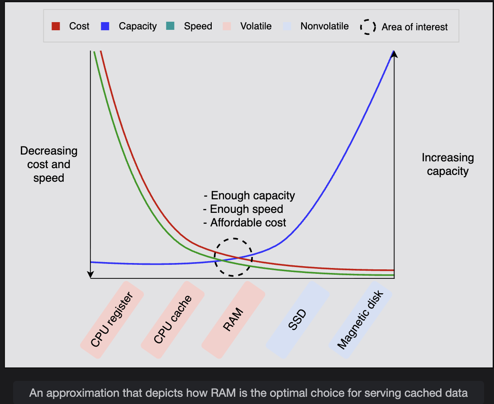

# System Design: The Distributed Cache

Learn the basics of a distributed cache.

## Problem Statement

A typical system consists of these components:

- It has a client who requests the service.
- It has one or more service hosts that entertain client requests.
- It utilizes a database for data storage, which is used by the service.

Under normal circumstances, this abstraction performs fine.

However, as the number of users increases, the number of database queries also increases. As a result, service providers are overburdened, leading to slow performance. In such cases, a cache is added to the system to deal with performance deterioration.

**A cache is a temporary data storage that can serve data faster by keeping data entries in memory.**

Caches store only the most frequently accessed data. When a request reaches the serving host, it retrieves data from the cache (cache hit) and serves the user. However, if the data is unavailable in the cache (cache miss), the data will be queried from the database.

Additionally, the cache is populated with the new value to prevent cache misses in the future.

A cache is a non-persistent storage area used to store data that is repeatedly read and written, providing the end user with lower latency. Therefore, a cache must serve data from a storage component that is fast, has sufficient storage, and is affordable in terms of dollar cost as the caching service scales.

## What is a Distributed Cache?

A distributed cache is a caching system where multiple cache servers coordinate to store frequently accessed data.

Distributed caches are necessary in environments where a single cache server is insufficient to store all the data. At the same time, it's scalable and guarantees a higher degree of availability. Caches are generally small, frequently accessed, short-term storage with fast read time. Caches use the locality of reference principle.

### Benefits of Distributed Caches

Generally, distributed caches are beneficial in these ways:

- They minimize user-perceived latency by precalculating results and storing frequently accessed data.
- They pre-generate expensive queries from the database.
- They store user session data temporarily.
- They serve data from temporary storage even if the data store is down temporarily.
- They reduce network costs by serving data from local resources.
- They can be scaled horizontally by adding more servers, making them ideal for applications with high traffic or large datasets.
- They can reduce the load on databases by offloading frequently accessed data to memory, freeing up database resources for more complex queries and transactions.
- They are typically more highly available than databases, as they are not subject to single points of failure.

## Why Distributed Cache?

As the size of the data required in the cache increases, storing the entire dataset in one system becomes impractical. This is because of the following three reasons:

1. It can be a potential single point of failure (SPOF).
2. A system is designed in layers, and each layer should have its caching mechanism to ensure the decoupling of sensitive data from different layers.
3. Caching at different locations helps reduce the latency of serving at that layer.

### Caching at Different Layers of a System

| System Layer | Technology in Use | Usage |
|--------------|-------------------|-------|
| Web | HTTP cache headers, web accelerators, key-value store, CDNs, and so on | Accelerate retrieval of static web content, and manage sessions |
| Application | Local cache and key-value data store | Accelerate application-level computations and data retrieval |
| Database | Database cache, buffers, and key-value data store | Reduce data retrieval latency and I/O load from database |

Apart from the three system layers above, caching is also performed at DNS and client-side technologies like browsers or end-devices.

## How Does Distributed Caching Work?

Here's an example of how distributed caching can be used in a web application:

1. A web application makes a request to the distributed cache for data.
2. The distributed cache server checks to see if the data is in the cache. If it is, the cache server returns the data to the application.
3. If the data is not in the cache, the cache server retrieves the data from the backend system (e.g., a database) and stores it in the cache for future requests.
4. The cache server then returns the data to the application.

The distributed cache server can be located on the same server as the application or on a separate server. Distributed cache servers are often deployed in a cluster to improve performance and scalability.

By using distributed caching, the web server can avoid retrieving the required data from the database for every request. This can significantly improve the performance of the web application.

## Cache Management Best Practices

To maximize the benefits of distributed caching, adhere to these best practices:

- **Cache eviction**: Implement cache eviction policies, such as Least Recently Used (LRU) or Time to Live (TTL), to maintain a refreshed and relevant cache.
- **Data consistency**: Ensure data consistency between the cache and the primary data source, especially for frequently updated data.
- **Monitoring**: Regularly monitor cache performance metrics, such as hit and miss rates, to identify areas for improvement.
- **Scalability**: Design the cache infrastructure to be scalable, allowing for easy addition of cache nodes as the application grows.

Implementing distributed caching involves selecting the right solution, installing and configuring it on all nodes, defining data partitioning and replication strategies, integrating the cache with the application, and continuously monitoring and fine-tuning performance.

## Use Cases for Distributed Caching

Distributed caching can be used in a variety of scenarios, including:

- **Web applications**: Distributed caches can be used to store frequently accessed web pages, images, and other resources. This can improve the performance and scalability of web applications.
- **E-commerce applications**: Distributed caches can store product catalogs, shopping carts, and other customer data. This can improve the performance and scalability of e-commerce applications.
- **Content delivery networks (CDNs)**: Distributed caches are often used in CDNs to store static content, such as images, CSS, and JavaScript files. This can improve the performance of websites and web applications.
- **Gaming applications**: Distributed caches can store game state data, including player inventory, map data, and leaderboard information. This can improve the performance and scalability of gaming applications.

## Popular Distributed Caching Solutions

There are a number of popular distributed caching solutions available, including:

- **Redis**: An open-source in-memory data structure store that can be used as a distributed cache. It is known for its speed and scalability.
- **Memcached**: Another popular open-source distributed cache. It is simple to use and easily scalable.
- **Hazelcast**: A commercial distributed caching solution that offers several advanced features, including data replication and eventing.
- **Apache Ignite**: An open-source distributed caching and computing platform. It offers several features, including in-memory data processing and distributed SQL queries.

Distributed caching is a powerful way to improve application performance, scalability, and availability.

To use it effectively, focus on caching data that is frequently accessed and rarely changes, set appropriate expiration times to keep data fresh, monitor cache performance regularly, and consider using a cache management library to handle eviction and synchronization efficiently.

## How Will We Design a Distributed Cache?

We'll divide the task of designing and reinforcing the learning of major concepts of distributed cache into five lessons:

1. **Background of Distributed Cache**: It's imperative to build the background knowledge necessary to make critical decisions when designing distributed caches. This lesson will revisit some fundamental yet essential concepts.

2. **High-level Design of a Distributed Cache**: We'll build a high-level design of a distributed cache in this lesson.

3. **Detailed Design of a Distributed Cache**: We'll identify some limitations of our high-level design and work toward a scalable, affordable, and performant solution.

4. **Evaluation of a Distributed Cache Design**: This lesson will assess our design against various non-functional requirements, including scalability, consistency, and availability.

5. **Memcached versus Redis**: We'll discuss well-known industrial solutions, namely Memcached and Redis. We'll also go through their details and compare their features to help us understand their potential use cases and how they relate to our design.

---

in depth(Distributed Cache | Version 2.0 - Enhanced Edition), <a href="./deapth/The-Distributed-Cache.md">click here</a>
