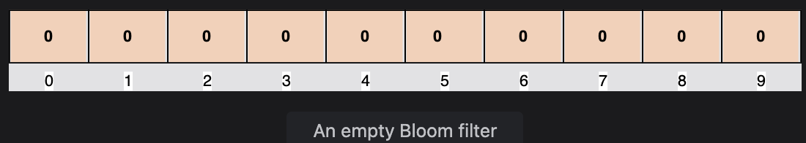
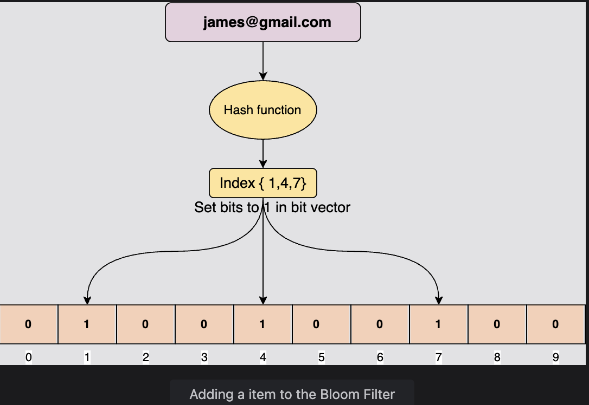
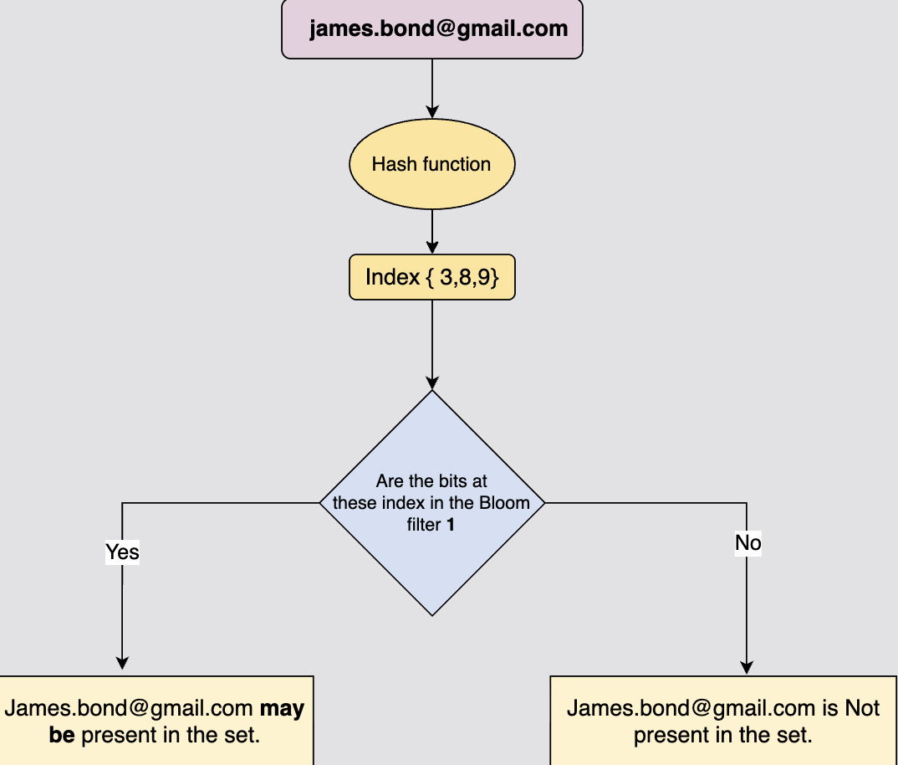

# What is a Bloom Filter?

A comprehensive guide to understanding Bloom filters and their applications.

## Table of Contents

- [Introduction](#introduction)
- [How Does a Bloom Filter Work?](#how-does-a-bloom-filter-work)
- [Adding Items to the Bloom Filter](#adding-items-to-the-bloom-filter)
- [Testing Membership of an Item](#testing-membership-of-an-item)
- [Why Bloom Filters Give False Positive Results](#why-bloom-filters-give-false-positive-results)
- [Bloom Filter Applications](#bloom-filter-applications)
- [Advantages and Limitations](#advantages-and-limitations)

---

## Introduction

A **Bloom filter** is a probabilistic data structure designed to answer the set membership question:

> **"Is this element present in the Set?"**

### Key Characteristics

- **Highly space efficient**: Does not store the actual items
- **Fast lookups**: Can tell very quickly if an item does not exist in a set or if it may be existing in the set
- **Probabilistic**: Can tell if an item **definitely does NOT exist** or if it **may exist**
- **Limitation**: Cannot tell if an item is **definitely present** in a set

### How It Differs from Traditional Data Structures

| Feature | Bloom Filter | Hash Set |
|---------|--------------|----------|
| Space Usage | Minimal (bit vector) | Stores actual items |
| False Positives | Possible | No |
| False Negatives | Never | Never |
| Definite Membership | No | Yes |
| Definite Non-membership | Yes | Yes |

---

## How Does a Bloom Filter Work?

### Structure

An empty Bloom filter is a **Bit Vector** with all bits set to zero.

**Example: 10-bit Bloom Filter**

```
Index:  0  1  2  3  4  5  6  7  8  9
Value: [0][0][0][0][0][0][0][0][0][0]
```


Each cell represents a bit. The number below the bit is its index for a 10-bit vector.

### Core Components

1. **Bit Vector**: Fixed-size array of bits (all initialized to 0)
2. **Hash Functions**: Multiple independent hash functions (typically 3-10)
3. **Operations**: Add and Test membership

---

## Adding Items to the Bloom Filter

To add an element, it must be hashed using multiple hash functions. Bits are set at the index of the hashes in the bit vector.


### Step-by-Step Example

Let's add the email `james@gmail.com` using three hash functions:

#### Step 1: Hash the Element

```
H1(james@gmail.com) = 12021
H2(james@gmail.com) = 23324
H3(james@gmail.com) = 23237
```

#### Step 2: Calculate Indices (mod 10)

To get indices within the bounds of the bit vector:

```
12021 % 10 = 1
23324 % 10 = 4
23237 % 10 = 7
```

#### Step 3: Set Bits at Indices {1, 4, 7}

**Before:**
```
Index:  0  1  2  3  4  5  6  7  8  9
Value: [0][0][0][0][0][0][0][0][0][0]
```

**After adding james@gmail.com:**
```
Index:  0  1  2  3  4  5  6  7  8  9
Value: [0][1][0][0][1][0][0][1][0][0]
        ↑           ↑           ↑
```

### Adding Multiple Items

Let's add more elements:

**Add "Monkey":**
```
H(Monkey) = {1, 2, 5}
```

**Add "Lion":**
```
H(Lion) = {7, 4, 3}
```

**Resulting Bit Vector:**
```
Index:  0  1  2  3  4  5  6  7  8  9
Value: [0][1][1][1][1][1][0][1][0][0]
```

---

## Testing Membership of an Item

For an item whose membership needs to be tested, it is also hashed via the same hash functions.


### Two Possible Outcomes

#### 1. Element Definitely Does NOT Exist

If **any bit is not set**, the element is definitely not in the set.

**Example: Testing "alex@gmail.com"**

```
H1(alex@gmail.com) = 15 → 15 % 10 = 5
H2(alex@gmail.com) = 28 → 28 % 10 = 8
H3(alex@gmail.com) = 33 → 33 % 10 = 3
```

Check indices {5, 8, 3}:

```
Index:  0  1  2  3  4  5  6  7  8  9
Value: [0][1][0][0][1][0][0][1][0][0]
              ↑       ↑           ↑
              3       5           8
              1       0           0  ← Index 8 is 0!
```

**Result**: Index 8 is 0, so "alex@gmail.com" is **definitely NOT in the set** ✔

---

#### 2. Element May Exist (Possible False Positive)

If **all bits are set**, the element **may exist** in the set.

**Example: Testing "james@gmail.com" (actually added earlier)**

```
H(james@gmail.com) = {1, 4, 7}
```

Check indices {1, 4, 7}:

```
Index:  0  1  2  3  4  5  6  7  8  9
Value: [0][1][0][0][1][0][0][1][0][0]
           ↑       ↑           ↑
           1       4           7
           1       1           1  ← All bits are 1!
```

**Result**: All bits are set, so "james@gmail.com" **may be in the set** ✔

---

## Why Bloom Filters Give False Positive Results

Bloom filters can produce **false positives** but **never false negatives**.

### Detailed Example

Let's assume we have added two members to the bloom filter:

**Added Items:**
1. **"Monkey"** with Hash Output: `H(Monkey) = {1, 2, 5}`
2. **"Lion"** with Hash Output: `H(Lion) = {7, 4, 3}`

**Resulting Bit Vector:**
```
Index:  0  1  2  3  4  5  6  7  8  9
Value: [0][1][1][1][1][1][0][1][0][0]
```

### Testing "Tiger" (Not Added)

Now, let's check if "Tiger" exists in the set:

```
H(Tiger) = {2, 7, 3}
```

Check indices {2, 7, 3}:

```
Index:  0  1  2  3  4  5  6  7  8  9
Value: [0][1][1][1][1][1][0][1][0][0]
              ↑  ↑           ↑
              2  3           7
              1  1           1  ← All bits are 1!
```

**Result**: All bits at indices {2, 7, 3} are set to 1.

**Bloom Filter says**: "Tiger" **may be in the set** ❌

**Reality**: We never added "Tiger" to the bloom filter!

### Why This Happens

All the bits at indices {2, 7, 3} have already been set by the previous two elements:
- Index 2 was set by "Monkey"
- Index 3 was set by "Lion"
- Index 7 was set by "Lion"

This is a **false positive result** — the Bloom filter incorrectly suggests that "Tiger" might be in the set.

### Understanding False Positives and False Negatives

| Scenario | Bloom Filter Result | Reality | Outcome |
|----------|---------------------|---------|---------|
| Item is in set, all bits set | May exist ✓ | Exists ✓ | True Positive |
| Item is NOT in set, all bits set | May exist ✗ | Does NOT exist | **False Positive** |
| Item is NOT in set, at least one bit is 0 | Does NOT exist ✓ | Does NOT exist ✓ | True Negative |
| Item is in set, at least one bit is 0 | Does NOT exist | Exists | **NEVER HAPPENS** (No False Negatives) |

### Key Insight

**False Positives**: Possible (Bloom filter says "may exist" but item doesn't)

**False Negatives**: IMPOSSIBLE (if Bloom filter says "does not exist", it's 100% accurate)

---

## Bloom Filter Applications

A Bloom filter is a space-efficient data structure, but it does not store the actual items since it is just a bit vector. It has many real-world applications:

### 1. Content Recommendation Systems

**Medium** uses Bloom filters in its Recommendation module to avoid showing those posts that have already been seen by the user.

**How it works:**
```
User reads article → Add article_id to Bloom filter
When generating recommendations:
  For each article:
    If Bloom filter says "may exist":
      Skip (user may have read it)
    If Bloom filter says "does not exist":
      Include in recommendations (definitely not read)
```

**Benefit**: Saves space by not storing list of all read articles

---

### 2. Database Optimization

**Cassandra** uses Bloom filters to optimize the search of data in an SSTable on the disk.

**How it works:**
```
Before reading from disk:
  Check Bloom filter for key
  If "does not exist":
    Skip disk read (saves expensive I/O)
  If "may exist":
    Perform disk read
```

**Benefit**: Avoids expensive disk I/O for keys that don't exist

---

### 3. Content Delivery Networks (CDNs)

**CDNs** use Bloom filters to avoid caching items that are rarely searched.

**How it works:**
```
When content is requested:
  If Bloom filter says "may exist" (requested before):
    Cache the content
  If "does not exist" (first time request):
    Don't cache (save cache space for popular content)
```

**Benefit**: Cache space is reserved for frequently accessed content

---

### 4. Other Common Applications

| Application | Use Case | Benefit |
|-------------|----------|---------|
| **Web Browsers** | Check if URL is in malicious URL list | Fast security checks |
| **Spell Checkers** | Check if word exists in dictionary | Memory efficient |
| **Blockchain** | Bitcoin uses Bloom filters in SPV clients | Reduce bandwidth |
| **Network Routers** | Packet filtering and routing | High-speed lookups |
| **Weak Password Detection** | Check against common password list | Privacy-preserving |

---

## Advantages and Limitations

### Advantages

1. **Space Efficient**: Uses only a bit vector, not actual data
   - Example: 1 million items can be represented in ~1.2 MB (vs. 100+ MB for storing actual strings)

2. **Fast Operations**: O(k) time complexity where k = number of hash functions
   - Typically k is small (3-10)
   - Much faster than searching through actual data

3. **No False Negatives**: If it says "does not exist", it's 100% accurate

4. **Privacy-Preserving**: Doesn't store actual items, only their "fingerprints"

5. **Scalable**: Can handle billions of elements efficiently

---

### Limitations

1. **False Positives**: May incorrectly say an item exists
   - Probability increases as more items are added
   - Can be reduced by increasing bit vector size

2. **No Deletion**: Standard Bloom filters don't support removing items
   - Solution: Use Counting Bloom Filters (uses counters instead of bits)

3. **No Retrieval**: Cannot retrieve the actual items stored

4. **Fixed Size**: Bit vector size must be determined upfront

5. **Hash Function Dependency**: Performance depends on quality of hash functions

---

### When to Use Bloom Filters

**Use Bloom filters when:**
- You need to test membership in a large set
- Space efficiency is critical
- False positives are acceptable
- False negatives are NOT acceptable
- You don't need to retrieve actual items

**Don't use Bloom filters when:**
- You need 100% accuracy
- You need to delete items frequently
- You need to retrieve actual data
- The set is very small (overhead not worth it)

---

## Summary

### Key Takeaways

1. **Bloom filters** answer "Is X in the set?" probabilistically
2. **Never gives false negatives**: If it says "not present", it's definite
3. **May give false positives**: If it says "may be present", check the actual data source
4. **Space efficient**: Uses only bits, not actual data
5. **Fast**: O(k) operations where k is number of hash functions
6. **Wide applications**: CDNs, databases, recommendation systems, security

### Formula to Remember

```
If any bit is 0 → Element definitely does NOT exist ✓
If all bits are 1 → Element MAY exist (need to verify)
```

---

