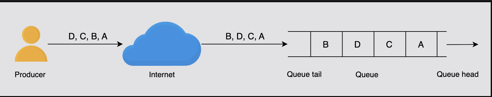
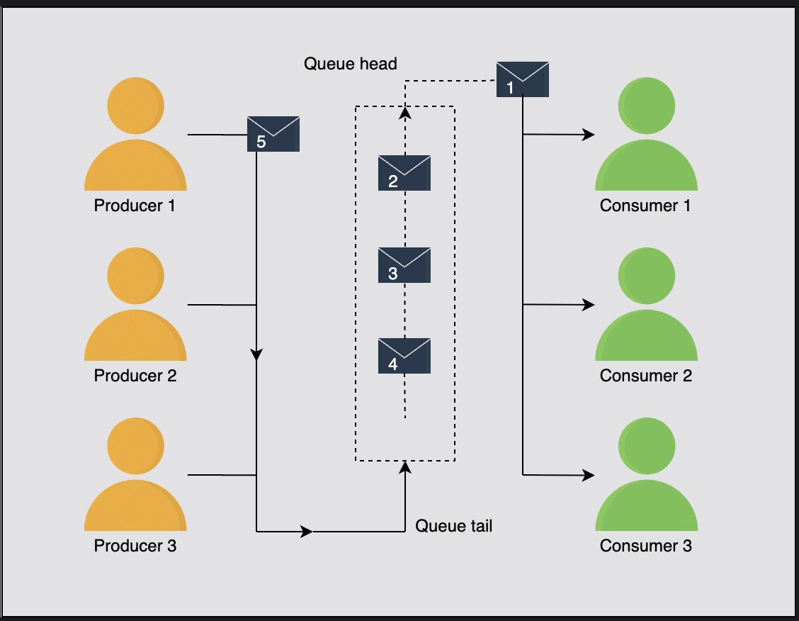

# Considerations of a Distributed Messaging Queue's Design

Learn about the factors that affect the design of a messaging queue.

## Table of Contents

- [Introduction](#introduction)
- [Ordering of Messages](#ordering-of-messages)
- [Effect on Performance](#effect-on-performance)
- [Managing Concurrency](#managing-concurrency)
- [Key Questions Answered](#key-questions-answered)
- [Summary](#summary)

---

## Introduction

Before embarking on our journey to design a distributed messaging queue, let's discuss some major factors that could significantly affect the design. These include:

- The order of messages
- The effect of the ordering on performance
- The management of concurrent access to the queue

We discuss each of these factors in detail below.

---

## Ordering of Messages

A messaging queue is used to receive messages from producers. These messages are consumed by the consumers at their own pace.

### Importance of Ordering

Some operations are **critical** in that they require **strict ordering** of the execution of the tasks, driven by the messages in the queue.

#### Example 1: Chat Messages (Strict Order Required)

For example, while chatting over a messenger application with a friend, the messages should be delivered in order; otherwise, such communication can be confusing, to say the least.

**Scenario:**
```
User A sends:
  1. "Are you free?"
  2. "Let's meet at 5 PM"

If delivered out of order:
  1. "Let's meet at 5 PM"
  2. "Are you free?"
  
Result: Confusing! ❌
```

---

#### Example 2: Emails (Order Less Critical)

Similarly, emails received by a user from different users may not require strict ordering.

**Scenario:**
```
User receives emails:
  - Email from Boss (10:00 AM)
  - Email from Friend (10:05 AM)
  - Email from Newsletter (9:55 AM)

Order of delivery doesn't matter
All can be read independently ✅
```

---

### Two Categories of Message Ordering

Therefore, in some cases, the strict order of incoming messages in the queue is essential, while many use cases can tolerate some reordering.

Let's discuss the following two categories of message ordering in a queue:

1. **Best-effort ordering**
2. **Strict ordering**

---

### Understanding Message Order

In a queue, the order of messages is **implicitly associated with the incoming messages**. Once the messages are put in a queue, the same order is followed in the consumption and processing of these messages.

#### Challenge 1: Concurrent Producers

For **concurrent producers** putting messages in the same queue, the order is not well defined until producers provide order information—for example:
- Timestamps
- Sequence numbers

**Without any ordering information**, the queue puts messages in the queue in whatever order they arrive at the service.

**Example:**
```
Producer A sends: Message 1 (timestamp: 10:00:00.100)
Producer B sends: Message 2 (timestamp: 10:00:00.050)

Without timestamps:
  Queue receives: Message 1, then Message 2
  Order: 1, 2

With timestamps:
  Queue can reorder: Message 2, then Message 1
  Correct chronological order: 2, 1
```

---

#### Challenge 2: Concurrent Consumers

For **concurrent consumers** fetching messages from the same queue, ordering can again become a complicated issue.

**The Problem:**

While the queue can hand over messages one after the other in the same order as they were entered in the queue, two consumers almost concurrently processing two messages might need an application-specific ordering mechanism.

**Solution:**

The queue might help by tagging a message's ordering information, sequence number or timestamp, while handing out a message from the queue.

**Example:**
```
Queue has messages: A, B, C

Consumer 1 gets Message A (seq: 1)
Consumer 2 gets Message B (seq: 2)

Consumer 2 processes faster:
  B completes at time T1
  A completes at time T2
  
Application must handle: B finished before A
Even though A had earlier sequence number
```

---

### Best-Effort Ordering

With the best-effort ordering approach, the system puts the messages in a specified queue **in the same order that they're received**.


#### How It Works

**Example:**

As shown in the following scenario, the producer sends four messages, **A, B, C, and D**, in the same order as illustrated.

Due to **network congestion** or some other issue, **message B is received after message D**.

Hence, the order of messages is **A, C, D, and B** at the receiving end.

**Visualization:**
```
Producer Side (Send Order):
  A → B → C → D

Network (Variable Delays):
  A: 10ms delay
  B: 50ms delay (network congestion!)
  C: 15ms delay
  D: 20ms delay

Server Side (Receive Order):
  A arrives at T+10ms
  C arrives at T+15ms
  D arrives at T+20ms
  B arrives at T+50ms
  
Queue Order: A, C, D, B ❌ (Not production order!)
```

**Key Point:**

Therefore, in this approach, the messages will be put in the queue **in the same order they were received** instead of the order in which they were produced on the client side.

---

#### Characteristics of Best-Effort Ordering

**Advantages:**
- ✅ Simple implementation
- ✅ High throughput
- ✅ Low latency
- ✅ No sorting overhead

**Disadvantages:**
- ❌ No guarantee of production order
- ❌ Network delays affect order
- ❌ Not suitable for order-critical applications

**Use Cases:**
- Email delivery
- Log aggregation
- Non-critical notifications
- Analytics events

---

### Strict Ordering

The **strict ordering** technique preserves the ordering of messages more rigorously. Through this approach, messages are placed in a queue **in the order that they're produced**.

#### Key Requirement

Before putting messages in a queue in the correct sequence, it's crucial to have a mechanism to **identify the order** in which the messages were produced on the client side.

**Common Approaches:**
- Unique identifier
- Timestamp
- Sequence number

Often, a **unique identifier or timestamp** is used to mark a message when it's produced.

---

#### Question: Who'll Be Responsible for Providing the Sequence Numbers?

**Answer:**

The responsibility for providing sequence numbers lies with the **client**.

**How It Works:**

The system facilitates this by offering **essential libraries or APIs** that the client can integrate into their application.

These tools allow the client to:
- Assign sequence numbers to messages as they are produced
- Ensure each message can be tracked and ordered accurately

**Benefits:**

This approach helps maintain consistency and enables the system to process and deliver messages in the intended sequence.

---

### Three Approaches for Ordering Incoming Messages

One of the following three approaches can be used for ordering incoming messages:

#### 1. Monotonically Increasing Numbers

**Description:**

One way to order incoming messages is to assign **monotonically increasing numbers** to messages on the server side.

**How It Works:**
```
Message 1 arrives → Assign ID: 1
Message 2 arrives → Assign ID: 2
Message 3 arrives → Assign ID: 3
...and so on
```

---

**Drawbacks:**

However, there are potential drawbacks to this approach:

**First Drawback: Bottleneck**

When a burst of requests is received, it acts as a **bottleneck** that affects the system's performance because the system has to assign an ID in a specified sequence to a message while the other messages wait for their turn.

**Scenario:**
```
1000 messages arrive simultaneously
System must assign IDs sequentially:
  Message 1: ID = 1 (0ms wait)
  Message 2: ID = 2 (1ms wait)
  Message 3: ID = 3 (2ms wait)
  ...
  Message 1000: ID = 1000 (999ms wait!)

Sequential bottleneck! ❌
```

**Second Drawback: Doesn't Fix Out-of-Order Arrival**

It still doesn't tackle the problem that arises when a message is received before the one that's produced earlier at the client side. Because of this, it **doesn't guarantee** that it will generate the correct order for the messages produced at the client side.

**Example:**
```
Client produces: A (10:00:00), B (10:00:01)
Network: B arrives first, then A

Server assigns:
  B → ID: 1 (arrived first)
  A → ID: 2 (arrived second)

But A was produced before B! ❌
Order is wrong!
```

---

#### 2. Causality-Based Sorting at the Server Side

**Description:**

Keeping in view the drawbacks of using monotonically increasing numbers, another approach that can be used for time-stamping and ordering of incoming messages is **causality-based sorting**.

**How It Works:**

In this approach, messages are **sorted based on the timestamp** that was produced at the client side and are put in a queue accordingly.

**Process:**
```
Messages arrive with client timestamps:
  Message A: timestamp = 10:00:00.100
  Message B: timestamp = 10:00:00.050
  Message C: timestamp = 10:00:00.200

Server sorts by timestamp:
  B (10:00:00.050)
  A (10:00:00.100)
  C (10:00:00.200)

Correct order restored! ✅
```

---

**Major Drawback:**

The major drawback of this approach is that for **multiple client sessions**, the service can't determine the order in terms of **wall-clock time**.

**Why?**

**Problem: Unsynchronized Clocks**

Different clients have different clocks that may not be synchronized:

```
Client 1 clock: 10:00:00 (correct time)
Client 2 clock: 09:55:00 (5 minutes behind)

Client 1 sends Message A: timestamp = 10:00:00
Client 2 sends Message B: timestamp = 09:55:00

Server sorts: B before A ❌
But A was actually sent first!

Clock skew causes incorrect ordering
```

---

#### 3. Using Timestamps Based on Synchronized Clocks (Recommended)

**Description:**

To tackle the potential issues that arise with both of the approaches described above, we can use another appropriate method to assign timestamps to messages that's based on **synchronized clocks**.

**How It Works:**

In this approach, the timestamp (ID) provided to each message through a **synchronized clock** is:
- Unique
- In the correct sequence of production of messages

---

**Handling Concurrent Requests:**

We can tag a **unique process identifier** with the timestamp to make the overall message identifier unique and tackle the situation when two concurrent sessions ask for a timestamp at the exact same time.

**Example:**
```
Two clients request timestamp simultaneously:
  Both get: 10:00:00.123

Add process ID:
  Client 1: 10:00:00.123-process-1
  Client 2: 10:00:00.123-process-2

Now unique! ✅
```

---

**Handling Delayed Messages:**

Moreover, with this approach, the server can easily **identify delayed messages** based on the timestamp and **wait for the delayed messages**.

**Scenario:**
```
Expected messages with timestamps:
  10:00:00.100
  10:00:00.150
  10:00:00.200

Received:
  10:00:00.100 ✅
  10:00:00.200 ✅
  10:00:00.150 ❌ (delayed, arrives later)

Server detects gap:
  Missing: 10:00:00.150
  Waits for delayed message
  Message arrives
  Correct order maintained ✅
```

---

**Using Sequencer Building Block:**

As we discussed in the section on the **sequencer building block**, we can get sequence numbers that fulfill double duty as:
- Sequence numbers
- Globally synchronized wall clock timestamps

**Benefit:**

Using this approach, our service can **globally order messages across client sessions** as well.

---

**Conclusion:**

To conclude, the most appropriate mechanism to provide a unique ID or timestamp to incoming messages, from among the three approaches described above, involves the use of **synchronized clocks**.

---

### Sorting

Once messages are received at the server side, we need to **sort them based on their timestamps**.

Therefore, we use an appropriate **online sorting algorithm** for this purpose.

**Online Sorting:**
- Processes messages as they arrive
- Maintains sorted order incrementally
- Efficient for streaming data

**Algorithms:**
- Insertion sort (for small streams)
- Heap-based sorting (for larger streams)
- Time-window based sorting (for bounded delays)

---

### Question: What If a Message Arrives Late?

**Question:** Suppose that a message sent earlier arrives late due to a network delay. What would be the proper approach to handle such a situation?

**Answer:**

The simple solution in such cases is to **reorder the queue**. Two scenarios can arise from this:

#### Scenario 1: Reordering Successful

**First**, reordering puts the messages in the correct order.

**Example:**
```
Queue state: A, C, D (missing B)
Message B arrives (late)
Reorder: A, B, C, D ✅
All messages now in correct order
```

---

#### Scenario 2: Already Handed Out Newer Messages

**Second**, we've already handed out newer messages to the consumers.

**What Happens:**

If an old message comes when we've already handed out a newer message, we put it in a **special queue**, and the **client handles that situation**.

**Process:**
```
Queue delivers: A, C, D
Consumer already processing: A, C, D

Message B arrives late:
  → Put in "late message queue"
  → Notify client
  → Client decides action
```

---

**Client Options:**

The client may later decide whether to:

**Option 1: Consume the message** if the message does not affect the intended operation

**Example:**
```
Chat application:
  Already displayed: "Hello", "Goodbye"
  Late message: "How are you?"
  
Client decides: Still display it
User can see full conversation
```

**Option 2: Discard it** if it's not needed

**Example:**
```
Stock price updates:
  Current price: $105 (latest)
  Late message: $100 (old price)
  
Client decides: Discard
Old price not relevant anymore
```

---

### Comparison of Ordering Approaches

| Approach | Guarantees Order | Performance | Complexity | Best For |
|----------|-----------------|-------------|------------|----------|
| **Best-Effort** | No | High | Low | Non-critical apps |
| **Monotonic IDs** | Partial | Medium | Low | Single producer |
| **Causality-Based** | Yes (per client) | Medium | Medium | Single session |
| **Synchronized Clocks** | Yes (global) | Medium | High | Multi-session apps |

---

## Effect on Performance

Primarily, a queue is designed for **first-in, first-out (FIFO)** operations. First-in, first-out operations suggest that the first message that enters a queue is always handed out first.

### The Challenge in Distributed Systems

However, it **isn't easy to maintain this strict order** in distributed systems.

**Reality:**

Since message A was produced before message B, it's still **uncertain** that message A will be consumed before message B.

---

### Performance Trade-offs

#### High Throughput Approach

Using **monotonically increasing message identifiers** or **causality-bearing identifiers** provide **high throughput** while putting messages in a queue.

**Why?**
- No sorting required immediately
- Messages placed as they arrive
- Minimal processing overhead

---

#### Strict Order Approach

Though the need for the **online sorting** to provide a strict order takes some time before messages are ready for extraction.

**Impact:**
```
Without sorting:
  Message arrives → Immediately available
  Latency: 1ms

With online sorting:
  Message arrives → Sort → Available
  Latency: 5-10ms (depends on queue size)
```

---

#### Minimizing Latency: Time-Window Approach

To minimize latency caused by the online sorting, we use a **time-window approach**.

**How It Works:**
```
Time window: 100ms

Messages arrive during window:
  T=0ms: Message C
  T=20ms: Message A
  T=50ms: Message D
  T=80ms: Message B

At T=100ms:
  Sort all messages: A, B, C, D
  Release in order

Trade-off:
  Added latency: 100ms
  Guarantee: All messages within window are ordered
```

---

### Ordering at Consumer End

Similarly, for **strict ordering at the receiving end**, we need to **serialize all the requests** to give out messages one by one.

**Impact:**
```
Serialized (Strict Order):
  Consumer 1 gets Message 1
  Consumer 1 finishes
  Consumer 2 gets Message 2
  Consumer 2 finishes
  ...
  
Throughput: Limited by slowest consumer

Parallel (No Strict Order):
  All consumers get messages simultaneously
  Process in parallel
  
Throughput: Much higher ✅
```

**If that's not required**, we have **better throughput and lower latency** at the receiving end.

---

### Why Many Solutions Don't Guarantee Strict Order

Due to the reasons mentioned above, many distributed messaging queue solutions either:
- **Don't guarantee a strict order**, OR
- Have **limitations around throughput**

**Reason:**

As we saw previously, the queues have to perform many additional validations and coordination operations to maintain the order.

**Additional Operations:**
- Timestamp validation
- Sorting algorithms
- Delay detection
- Gap handling
- Serialization for consumers

**Result:** Performance penalty for strict ordering

---

### Performance Summary

| Ordering Level | Throughput | Latency | Use Case |
|---------------|------------|---------|----------|
| **No Ordering** | Very High | Very Low | Logs, analytics |
| **Best-Effort** | High | Low | Emails, notifications |
| **Partial Ordering** | Medium | Medium | Single-session chat |
| **Strict Ordering** | Low | High | Financial transactions |

---

## Managing Concurrency

Concurrent queue access needs proper management. Concurrency can take place at the following stages:

### Two Stages of Concurrency

1. When **multiple messages arrive at the same time**
2. When **multiple consumers request concurrently** for a message

---

### Solution 1: Locking Mechanism (Not Recommended)

**Approach:**

The first solution is to use the **locking mechanism**. When a process or thread requests a message, it should acquire a **lock** for placing or consuming messages from the queue.

**Process:**
```
Producer 1 wants to send:
  1. Acquire lock
  2. Write message
  3. Release lock

Producer 2 waits for lock:
  1. Wait for Producer 1
  2. Acquire lock
  3. Write message
  4. Release lock
```

---

**Drawbacks:**

However, as was discussed earlier, this approach has several drawbacks:
- ❌ **Not scalable**: Single lock becomes bottleneck
- ❌ **Not performant**: High contention causes delays

**Performance Impact:**
```
10 concurrent producers
Each operation: 1ms
Lock wait time: 9ms average

Total latency: 10ms per operation
Without lock: 1ms per operation

10x slowdown! ❌
```

---

### Solution 2: Serialization with Buffers (Recommended)

**Approach:**

Another solution is to **serialize the requests** using the system's buffer at both ends of the queue so that:
- The incoming messages are placed in an order
- Consumer processes also receive messages in their arrival sequence

---

**What Does "Serializing Requests" Mean?**

By serializing requests, we mean that the requests (either for **putting data** or **extracting data**), which come to the server would be:
- **Queued by the OS**
- A **single application thread** will put them in the queue

**Key Point:**

We can assume that both kinds of requests, put and extract come to the **same port**, without any locking.

---

**Benefits:**

It will be a possible **lock-free solution**, providing **high throughput**.

This is a more viable solution because it can help us **avoid the occurrence of race conditions**.

**How It Works:**
```
OS-Level Buffer:
  ┌─────────────────────────┐
  │ Request Queue (OS)      │
  │  - Put Request 1        │
  │  - Get Request 1        │
  │  - Put Request 2        │
  │  - Get Request 2        │
  └───────────┬─────────────┘
              │
              ▼
  ┌───────────────────────┐
  │ Single Thread         │
  │ Processes in order    │
  │ No locks needed!      │
  └───────────────────────┘
```

---

**Performance:**
```
With locking:
  Throughput: 10,000 operations/second
  Latency: Variable (lock contention)

With serialization:
  Throughput: 100,000 operations/second ✅
  Latency: Consistent (predictable)
```

---

### Multiple Queues Approach

Applications might use **multiple queues** with dedicated producers and consumers to keep the ordering cost per queue under check, although this comes at the cost of **more complicated application logic**.

**Strategy:**
```
Single Queue (High Contention):
  All producers → Queue 1 → All consumers
  Bottleneck!

Multiple Queues (Lower Contention):
  Producer Group A → Queue 1 → Consumer Group A
  Producer Group B → Queue 2 → Consumer Group B
  Producer Group C → Queue 3 → Consumer Group C
  
Each queue independent
Lower contention per queue ✅
```

---

**Trade-off:**

**Benefits:**
- ✅ Reduced contention per queue
- ✅ Better performance
- ✅ Independent scaling

**Costs:**
- ❌ More complex application logic
- ❌ Need to manage multiple queues
- ❌ Message routing complexity

---

### Concurrency Solutions Comparison

| Approach | Throughput | Complexity | Scalability | Recommended |
|----------|------------|------------|-------------|-------------|
| **Locking** | Low | Low | Poor | ❌ No |
| **Serialization** | High | Medium | Good | ✅ Yes |
| **Multiple Queues** | Very High | High | Excellent | ✅ For large systems |

---

## Key Questions Answered

In this lesson, we discussed some key considerations and challenges in the design process of a messaging queue and answered the following questions:

### Question 1: Why is the order of messages important, and how do we enforce that order?

**Answer:**

**Importance:**
- Some applications require strict ordering (chat, transactions)
- Others tolerate reordering (emails, logs)

**Enforcement Methods:**
1. **Best-effort ordering** - Simple, fast, no guarantees
2. **Strict ordering** - Uses synchronized timestamps
3. **Causality-based** - Client timestamps with sorting
4. **Time-window approach** - Balance between performance and ordering

---

### Question 2: How does ordering affect performance?

**Answer:**

**Impact on Performance:**
- **Strict ordering** requires sorting and serialization → Lower throughput, higher latency
- **Best-effort ordering** allows parallel processing → Higher throughput, lower latency
- **Time-window approach** adds bounded latency but maintains order within window

**Trade-off:**
```
Ordering Strictness ↑ = Performance ↓
Ordering Strictness ↓ = Performance ↑
```

---

### Question 3: How do we handle concurrency while accessing a queue?

**Answer:**

**Solutions:**
1. **Locking** - Simple but not scalable (not recommended)
2. **Serialization with buffers** - Lock-free, high throughput (recommended)
3. **Multiple queues** - Best for large systems with complex logic

**Best Practice:**
Use OS-level buffering with single-threaded processing for lock-free, high-performance concurrency management.

---

## Summary

### Key Takeaways

#### Message Ordering

**Two Categories:**
1. **Best-Effort Ordering**
   - Messages placed as received
   - High performance
   - No order guarantee
   - Best for: Logs, emails, analytics

2. **Strict Ordering**
   - Messages placed in production order
   - Lower performance
   - Strong order guarantee
   - Best for: Chat, transactions, financial

---

**Three Ordering Approaches:**

| Approach | Pros | Cons | Use Case |
|----------|------|------|----------|
| **Monotonic IDs** | Simple, fast | Doesn't fix network delays | Single server |
| **Causality-Based** | Client timestamps | Clock skew issues | Single client |
| **Synchronized Clocks** | Global ordering | Complex setup | Multi-client systems ✅ |

**Recommended:** Synchronized clocks with sequencer

---

#### Performance Impact

**Ordering Requirements:**
- Strict ordering: Additional sorting overhead (5-10ms added latency)
- Best-effort: Minimal overhead (1-2ms latency)
- Time-window: Bounded delay trade-off

**Consumer Side:**
- Serialized delivery: Lower throughput, strict order
- Parallel delivery: Higher throughput, no order guarantee

---

#### Concurrency Management

**Two Concurrency Points:**
1. Multiple producers sending messages
2. Multiple consumers receiving messages

**Solutions:**
- ❌ **Locking** - Simple but slow (10x performance penalty)
- ✅ **Serialization** - OS buffering, single thread, lock-free
- ✅ **Multiple Queues** - Best for high-scale systems

---

#### Design Decisions

**Critical Trade-offs:**
```
Strict Ordering ←→ High Performance
Simple Design ←→ Distributed Scale
Strong Consistency ←→ High Throughput
```

**Choose Based on:**
- Application requirements
- Ordering criticality
- Performance needs
- Scale requirements

---

