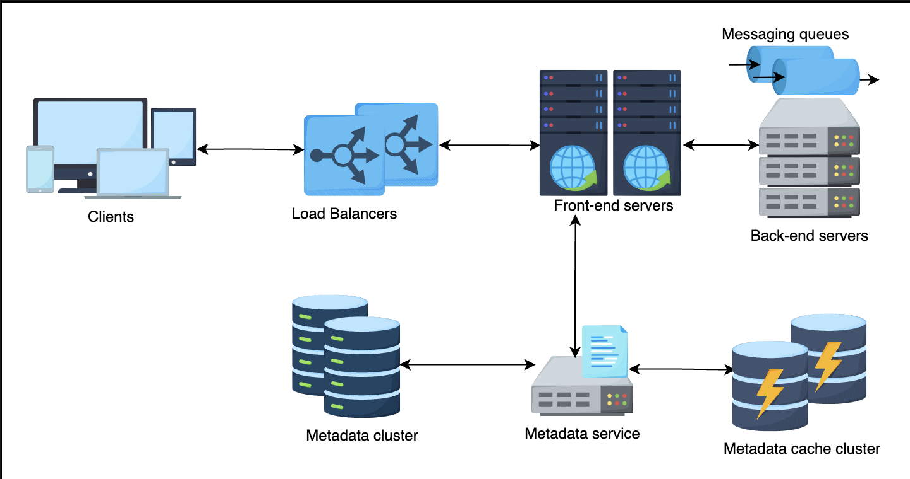
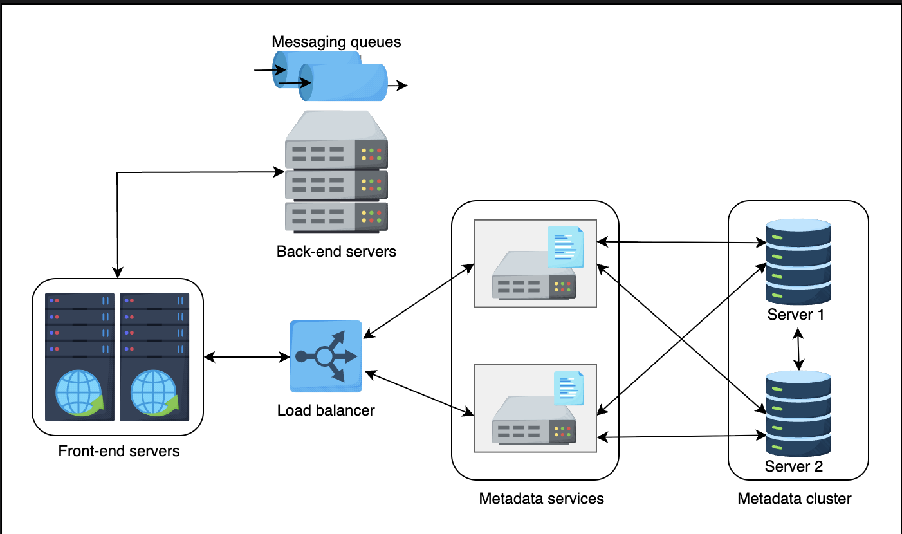
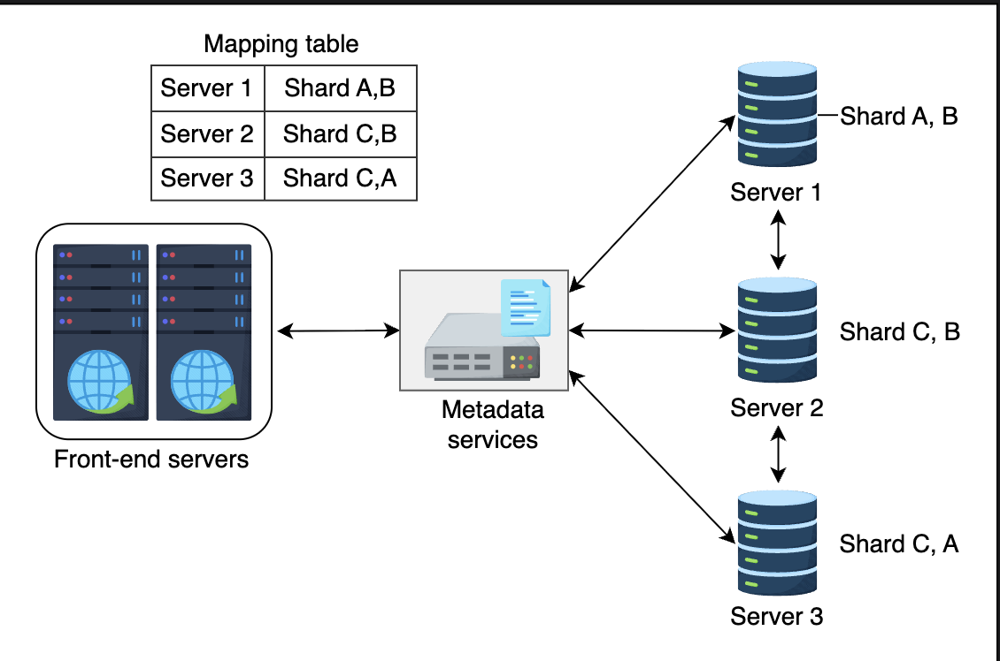
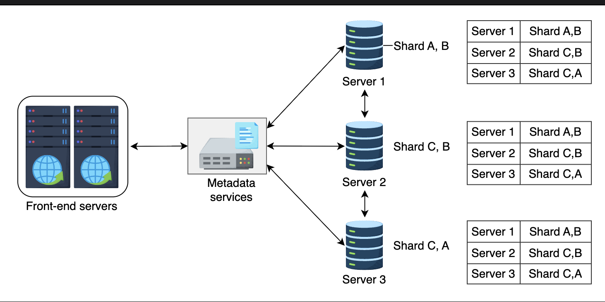

# Design of a Distributed Messaging Queue: Part 1

Learn about the high-level design of a messaging queue and how to scale the metadata of queues.

## Table of Contents

- [Introduction](#introduction)
- [Distributed Messaging Queue](#distributed-messaging-queue)
- [High-Level Design](#high-level-design)
- [Essential Components](#essential-components)
- [Metadata Service Organization](#metadata-service-organization)
- [Summary](#summary)

---

## Introduction

So far, we've discussed the requirements and design considerations of a distributed messaging queue. Now, let's begin with learning about the high-level design of a distributed messaging queue.

---

## Distributed Messaging Queue

Unlike a single-server messaging queue, a distributed messaging queue **resides on multiple servers**.

### Characteristics

A distributed messaging queue has its own challenges. However, it **resolves the drawbacks** of a single-server messaging queue if designed properly.

**Key Improvements:**
- Eliminates single point of failure
- Provides horizontal scalability
- Ensures high availability
- Offers better performance

---

### Focus Areas

The following sections focus on the **scalability, availability, and durability** issues of designing a distributed messaging queue by introducing us to a more fault-tolerant architecture of a messaging queue.

---

## High-Level Design

Before diving deep into the design, let's assume the following points to make the discussion more simple and easy to understand.


### Design Assumptions

In the upcoming material, we discuss how the following assumptions enable us to eliminate the problems in a single-server solution to the messaging queue.

#### Assumption 1: Data Replication

**Queue data is replicated** using either a **primary-secondary** or **quorum-like system** inside a cluster.

**Reference:** Read through the Data Replication lesson for more details.

**How It Works:**
```
Primary-Secondary:
  Primary node handles writes
  Secondary nodes replicate data
  Automatic failover on primary failure

Quorum System:
  Majority of nodes must agree
  More fault-tolerant
  Better consistency guarantees
```

---

#### Assumption 2: Data Partitioning

Our service can use **data partitioning** if the queue gets too long to fit on a server.

**Methods:**

**Option 1: Consistent Hashing**
We can use a consistent hashing-like scheme for this purpose.

**Option 2: Key-Value Store**
Or we may use a key-value store where the key might be the **sequence numbers of the messages**.

**Replication:**
In that case, each shard is appropriately replicated.

**Reference:** Refer to the Partition lesson for more details on this.

**Example:**
```
Large Queue (1 million messages):

Partition by sequence number:
  Shard 1: Messages 1-333,333
  Shard 2: Messages 333,334-666,666
  Shard 3: Messages 666,667-1,000,000

Each shard replicated across 3 nodes
Total: 9 nodes (3 shards × 3 replicas)
```

---

#### Assumption 3: Auto-Scaling

We also assume that our system can **auto-expand and auto-shrink** the resources as per the need to optimally utilize resources.

**Benefits:**
- Cost optimization
- Performance maintenance
- Resource efficiency
- Automatic capacity management

**Example:**
```
Normal load: 10,000 msg/s
  Servers: 5 (sufficient)

Peak load: 100,000 msg/s
  Auto-expand to: 50 servers

Load decreases: 20,000 msg/s
  Auto-shrink to: 10 servers

Resource utilization optimized ✅
```

---

### Architecture Overview

The following figure demonstrates a high-level design of a distributed messaging queue that's composed of several components.

```
High-Level Architecture:

┌─────────────┐  ┌─────────────┐  ┌─────────────┐
│ Producer 1  │  │ Producer 2  │  │ Producer N  │
└──────┬──────┘  └──────┬──────┘  └──────┬──────┘
       │                │                │
       └────────────────┼────────────────┘
                        │
                 ┌──────▼──────┐
                 │    Load     │
                 │  Balancers  │
                 └──────┬──────┘
                        │
        ┌───────────────┼───────────────┐
        │               │               │
   ┌────▼─────┐   ┌────▼─────┐   ┌────▼─────┐
   │Front-End │   │Front-End │   │Front-End │
   │ Server 1 │   │ Server 2 │   │ Server N │
   └────┬─────┘   └────┬─────┘   └────┬─────┘
        │              │              │
        └──────────────┼──────────────┘
                       │
          ┌────────────┼────────────┐
          │            │            │
    ┌─────▼─────┐ ┌───▼──────┐ ┌──▼───────┐
    │ Metadata  │ │ Backend  │ │  Other   │
    │  Service  │ │ Service  │ │ Services │
    └─────┬─────┘ └───┬──────┘ └──────────┘
          │           │
    ┌─────▼─────┐ ┌───▼──────┐
    │ Metadata  │ │  Queue   │
    │  Store    │ │  Storage │
    └───────────┘ └──────────┘
          ▲           ▲
          │           │
   ┌──────┴──────┐    │
   │   Cache     │    │
   └─────────────┘    │
                      │
        ┌─────────────┴─────────────┐
        │                           │
   ┌────▼─────┐               ┌────▼─────┐
   │Consumer 1│               │Consumer N│
   └──────────┘               └──────────┘
```

---

## Essential Components

The essential components of our design are described in detail below.

### 1. Load Balancer

**Purpose:**

The load balancer layer receives requests from producers and consumers, which are forwarded to one of the front-end servers.

**Characteristics:**

This layer consists of **numerous load balancers**. Therefore, requests are accepted with **minimal latency** and offer **high availability**.

**Benefits:**
- ✅ No single point of failure
- ✅ Even distribution of requests
- ✅ Health monitoring of front-end servers
- ✅ Automatic failover

**Example:**
```
Load Balancer Layer:

3 Load Balancers (for redundancy):
  LB1: Handles 33% of traffic
  LB2: Handles 33% of traffic
  LB3: Handles 34% of traffic

If LB1 fails:
  LB2 and LB3 split its traffic
  No service disruption ✅
```

---

### 2. Front-End Service

**Overview:**

The front-end service comprises **stateless machines** distributed across data centers.

**Key Characteristic:** Stateless - No session data stored, can handle any request

---

#### Services Provided by Front-End

The front-end provides the following services:

##### A. Request Validation

**Purpose:** This ensures the validity of a request and checks if it contains all the necessary information.

**Validation Checks:**
- Message format is correct
- Required fields are present
- Message size within limits
- Queue name is valid
- Parameters are well-formed

**Example:**
```
Valid Request:
{
  "queue_name": "orders",
  "message": "Order #12345",
  "priority": "high",
  "timestamp": "2026-01-23T10:30:00Z"
}
✅ All required fields present

Invalid Request:
{
  "message": "Order #12345"
}
❌ Missing queue_name
❌ Missing timestamp
Request rejected
```

---

##### B. Authentication and Authorization

**Purpose:** This service checks if the requester is a valid user and if these services are authorized for use to a requester.

**Two-Step Process:**

**Authentication:** Verify user identity
- Check API keys
- Validate tokens
- Verify credentials

**Authorization:** Verify user permissions
- Can user access this queue?
- Does user have write/read permissions?
- Are there rate limits?

**Example:**
```
User A requests to write to "orders" queue:
  1. Authentication: Valid API key ✅
  2. Authorization: Has write permission ✅
  Result: Request allowed

User B requests to delete "admin" queue:
  1. Authentication: Valid API key ✅
  2. Authorization: Not admin user ❌
  Result: Request denied
```

---

##### C. Caching

**Purpose:** In the front-end cache, metadata information is stored related to the frequently used queues. Along with this, user-related data is also cached here to reduce request time to authentication and authorization services.

**What is Cached:**

**Queue Metadata:**
- Queue name and ID
- Queue configuration
- Access permissions
- Queue statistics

**User Data:**
- Authentication tokens
- User permissions
- Rate limit counters

**Benefits:**
```
Without Cache:
  Every request → Check metadata store
  Latency: 50ms

With Cache:
  Cache hit (95% of requests): 2ms ✅
  Cache miss (5% of requests): 50ms
  
Average latency: ~4.4ms (90% improvement!)
```

---

##### D. Request Dispatching

**Purpose:** The front-end is also responsible for calling two other services, the back-end and the metadata store.

**Responsibility:**

Differentiating calls to both of these services is one of the responsibilities of the front-end.

**How It Works:**
```
Request arrives at front-end:

If metadata operation (create/delete queue):
  → Route to Metadata Service

If data operation (send/receive message):
  → Route to Backend Service

Front-end acts as intelligent router
```

**Example:**
```
Request Type 1: Create Queue
  Front-end → Metadata Service
  
Request Type 2: Send Message
  Front-end → Backend Service
  
Request Type 3: Get Queue Stats
  Front-end → Metadata Service
  
Request Type 4: Receive Message
  Front-end → Backend Service
```

---

##### E. Request Deduplication

**Purpose:** The front-end also tracks information related to all the requests, therefore, it also prevents identical requests from being put in a queue.

**Challenge Identified:**

A question might arise here: **How to identify that two (or more) requests are duplicates?**

---

**Solution:**

There are several ways to identify duplicate messages; however, the most reliable one is to compute the **hash (preferably SHA256)** of the message content (not the message attributes).

**Important Note:** Hash of message **content**, not attributes

**How It Works:**

This way, if incoming messages have the same content, the service will detect duplication based on their hash.

**Process:**
```
Message arrives:
  1. Compute SHA256 hash of content
  2. Check if hash exists in deduplication store
  3. If found → Duplicate (reject)
  4. If not found → Store hash and process message
```

---

**Implementation Details:**

Deciding what to do about duplicates might be as easy as **searching a hash key in a store**.

**If something is found in the store**, this implies a duplicate and the message can be rejected.

**Example:**
```
Message 1: "Order #12345"
  Hash: a3f5c8d9e2...
  Store hash
  Process message ✅

Message 2: "Order #12345" (duplicate!)
  Hash: a3f5c8d9e2... (same hash)
  Found in store → Duplicate detected
  Reject message ❌

Message 3: "Order #12346"
  Hash: b7d2f1a8c4... (different)
  Not in store
  Store hash
  Process message ✅
```

**Deduplication Window:**
```
Store hashes for: 24 hours
After 24 hours: Hash expired
Same message can be reprocessed

Balance:
  Memory usage vs. deduplication window
```

---

##### F. Usage Data Collection

**Purpose:** This refers to the collection of real-time data that can be used for audit purposes.

**What is Collected:**
- Number of requests per user
- Message sizes
- Queue usage statistics
- API call patterns
- Error rates
- Latency metrics

**Use Cases:**
- Audit trails
- Billing and metering
- Performance monitoring
- Security analysis
- Capacity planning

**Example:**
```
Collected Data:
  User: user-789
  Queue: orders
  Operation: send_message
  Timestamp: 2026-01-23T10:30:00Z
  Message size: 1024 bytes
  Latency: 5ms
  Status: success

Used for:
  - Monthly billing (1M messages sent)
  - Security audit (unusual pattern detection)
  - Performance analysis (P99 latency tracking)
```

---

### 3. Metadata Service

**Purpose:**

This component is responsible for:
- **Storing** the metadata of queues
- **Retrieving** the metadata of queues
- **Updating** the metadata of queues

In the metadata store and cache.

---

**Key Responsibility:**

Whenever a queue is created or deleted, the metadata store and cache are updated accordingly.

**Process Flow:**
```
Queue Created:
  1. Front-end receives create request
  2. Metadata service stores in database
  3. Metadata service updates cache
  4. Return success

Queue Deleted:
  1. Front-end receives delete request
  2. Metadata service removes from database
  3. Metadata service invalidates cache
  4. Return success
```

---

**Role:**

The metadata service acts as a **middleware** between the front-end servers and the data layer.

**Data Flow:**
```
Front-End ↔ Metadata Service ↔ Data Layer (Store + Cache)
```

---

**Cache-First Strategy:**

Since the metadata of the queues is kept in the cache, the **cache is checked first** by the front-end servers for any relevant information related to the receipt of the request.

**If a cache miss occurs**, the information is retrieved from the metadata store and the cache is updated accordingly.

**Flow:**
```
Request for queue metadata:

1. Check cache
   ├─ Hit → Return from cache (2ms)
   └─ Miss → Continue to step 2

2. Query metadata store (50ms)
3. Update cache with result
4. Return to front-end

Next request for same queue:
  Cache hit (2ms) ✅
```

---

## Metadata Service Organization

There are **two different approaches** to organizing the metadata cache clusters:

### Approach 1: Small Metadata - Replicated on All Servers

**Scenario:**

If the metadata that needs to be stored is **small** and can **reside on a single machine**, then it's **replicated on each cluster server**.

**How It Works:**

Subsequently, the request can be served from **any random server**.

**Load Balancing:**

In this approach, a load balancer can also be introduced between the front-end servers and metadata services.

---


**Architecture:**
```
┌─────────────┐  ┌─────────────┐  ┌─────────────┐
│ Front-End 1 │  │ Front-End 2 │  │ Front-End 3 │
└──────┬──────┘  └──────┬──────┘  └──────┬──────┘
       │                │                │
       └────────────────┼────────────────┘
                        │
                 ┌──────▼──────┐
                 │    Load     │
                 │  Balancer   │
                 └──────┬──────┘
                        │
        ┌───────────────┼───────────────┐
        │               │               │
   ┌────▼─────┐   ┌────▼─────┐   ┌────▼─────┐
   │Metadata  │   │Metadata  │   │Metadata  │
   │Server 1  │   │Server 2  │   │Server 3  │
   │          │   │          │   │          │
   │(Full     │   │(Full     │   │(Full     │
   │ Copy)    │   │ Copy)    │   │ Copy)    │
   └──────────┘   └──────────┘   └──────────┘

All servers have complete metadata copy
Any server can handle any request
```

**Characteristics:**
- ✅ Simple to implement
- ✅ High availability (any server can respond)
- ✅ Fast reads (no remote calls)
- ⚠️ Limited by single machine capacity
- ❌ Higher memory usage (full replication)

**Best For:**
- Small metadata size (< 10 GB)
- Read-heavy workloads
- Simple deployment

---

### Approach 2: Large Metadata - Sharding Required

**Scenario:**

If the metadata that needs to be stored is **too large**, then one of the following modes can be followed:

---

#### Mode 1: Sharding with Front-End Mapping

**Strategy:**

The first strategy is to use the **sharding approach** to divide data into different shards.

**Partitioning Methods:**

Sharding can be performed based on:
- Some **partition key**, OR
- **Hashing techniques**

As was discussed in the lesson on database partitioning.

**Storage:**

Each shard is stored on a **different host** in the cluster.

**Replication:**

Moreover, each shard is also **replicated on different hosts** to enhance availability.

---

**Mapping Responsibility:**

In this cluster-organization approach, the **front-end server has a mapping table** between shards and the hosts.

**Therefore**, the front-end server is responsible for **redirecting requests** to the host where the data is stored.

---

**Architecture:**
```
┌─────────────────────────────────────────────────┐
│         Front-End Server                        │
│                                                 │
│  Mapping Table:                                 │
│  ┌──────────────────────────────────┐          │
│  │ Queue ID Range    │ Host         │          │
│  ├───────────────────┼──────────────┤          │
│  │ 1-10000          │ Metadata-1   │          │
│  │ 10001-20000      │ Metadata-2   │          │
│  │ 20001-30000      │ Metadata-3   │          │
│  └──────────────────────────────────┘          │
└───────┬───────────────┬───────────────┬─────────┘
        │               │               │
   ┌────▼─────┐   ┌────▼─────┐   ┌────▼─────┐
   │Metadata  │   │Metadata  │   │Metadata  │
   │Server 1  │   │Server 2  │   │Server 3  │
   │          │   │          │   │          │
   │Shard 1   │   │Shard 2   │   │Shard 3   │
   │(1-10K)   │   │(10-20K)  │   │(20-30K)  │
   └──────────┘   └──────────┘   └──────────┘
        │               │               │
   ┌────▼─────┐   ┌────▼─────┐   ┌────▼─────┐
   │Replica 1 │   │Replica 2 │   │Replica 3 │
   └──────────┘   └──────────┘   └──────────┘
```

**Process:**
```
Request for Queue ID 15000:
  1. Front-end checks mapping table
  2. 15000 falls in range 10001-20000
  3. Route to Metadata-2
  4. Metadata-2 returns data
```

**Characteristics:**
- ✅ Scalable to large metadata sizes
- ✅ Front-end has complete routing knowledge
- ✅ Direct routing (single hop)
- ❌ Front-end must maintain mapping table
- ⚠️ Mapping table must be updated on rebalancing

**Best For:**
- Large metadata (> 100 GB)
- Write-heavy workloads
- Predictable access patterns

---

#### Mode 2: Sharding with Distributed Mapping

**Strategy:**

The second approach is **similar to the first one**. However, the mapping table in this approach is **stored on each host** instead of just on the front-end servers.

**Key Difference:**

Because of this, **any random host can receive a request** and forward it to the host where the data resides.

**Suitability:**

This technique is suitable for **read-intensive applications**.

---


**Architecture:**
```
┌─────────────┐  ┌─────────────┐  ┌─────────────┐
│ Front-End 1 │  │ Front-End 2 │  │ Front-End 3 │
└──────┬──────┘  └──────┬──────┘  └──────┬──────┘
       │                │                │
       └────────────────┼────────────────┘
                        │
                Any random server
                        │
        ┌───────────────┼───────────────┐
        │               │               │
   ┌────▼──────────────────────────┐ ┌──▼────────┐
   │ Metadata Server 1             │ │ Metadata  │
   │ ┌──────────────────────────┐  │ │ Server 2  │
   │ │ Mapping Table (Full)     │  │ │           │
   │ │ All shards → hosts       │  │ │ (Same     │
   │ └──────────────────────────┘  │ │  mapping) │
   │                               │ │           │
   │ Shard 1 (local)               │ └───────────┘
   └───────┬───────────────────────┘
           │
      Forward to correct host
           │
   ┌───────▼───────┐
   │ Metadata      │
   │ Server N      │
   │ (Has Shard N) │
   └───────────────┘
```

**Process:**
```
Request for Queue ID 25000:
  1. Front-end sends to any metadata server (Server 1)
  2. Server 1 checks local mapping table
  3. 25000 → Located on Server 3
  4. Server 1 forwards to Server 3
  5. Server 3 returns data
```

**Characteristics:**
- ✅ No mapping table on front-end (simpler)
- ✅ Metadata servers handle routing
- ✅ Better for read-intensive (caching at each server)
- ⚠️ Extra hop (front-end → first server → correct server)
- ❌ Slightly higher latency (two hops)

**Best For:**
- Large metadata with high read load
- Systems where front-end should be simple
- When metadata servers have excess capacity

---

### Comparison of Metadata Organization Approaches

| Approach | Metadata Size | Complexity | Routing | Best For |
|----------|---------------|------------|---------|----------|
| **Full Replication** | Small (< 10 GB) | Low | Direct | Simple systems |
| **Sharding (Front-end mapping)** | Large (> 100 GB) | Medium | Direct (1 hop) | Write-heavy |
| **Sharding (Distributed mapping)** | Large (> 100 GB) | High | Indirect (2 hops) | Read-heavy |

---

## Summary

### Key Takeaways

In our discussion on distributed messaging queues, we focused on the **high-level design** of this type of queue.

Furthermore, we explored each component in the high-level design, including the following:

---

#### 1. Load Balancers

**Purpose:**
- Distribute incoming requests
- Ensure high availability
- Provide fault tolerance

**Characteristics:**
- Multiple load balancers for redundancy
- Minimal latency
- Automatic failover

---

#### 2. Front-End Servers

**Services Required:**

**A. Request Validation**
- Ensure request correctness
- Check required fields

**B. Authentication and Authorization**
- Verify user identity
- Check permissions

**C. Caching**
- Cache queue metadata
- Cache user data
- Reduce latency

**D. Request Dispatching**
- Route to metadata service
- Route to backend service
- Intelligent routing logic

**E. Request Deduplication**
- Compute SHA256 hash
- Detect duplicate messages
- Prevent duplicate processing

**F. Usage Data Collection**
- Collect metrics
- Audit trails
- Billing data

---

#### 3. Metadata Services

**Responsibilities:**
- Store queue metadata
- Retrieve metadata
- Update metadata
- Maintain cache

**Role:**
- Middleware between front-end and data layer
- Cache-first strategy
- Automatic cache updates

---

#### 4. Metadata Clusters and Their Organization

**Three Organization Strategies:**

**Small Metadata:**
- Full replication on all servers
- Any server can respond
- Simple and fast

**Large Metadata - Front-End Mapping:**
- Sharding with mapping on front-end
- Direct routing (1 hop)
- Front-end manages routing

**Large Metadata - Distributed Mapping:**
- Sharding with mapping on all servers
- Indirect routing (2 hops)
- Better for read-heavy workloads

---

### Design Decisions Summary

```
Component Selection:

Load Balancer: Multiple for redundancy
Front-End: Stateless, distributed across DCs
Metadata Service: Cache-first with store backup
Organization: Choose based on metadata size

Data Management:

Replication: Primary-secondary or quorum
Partitioning: Consistent hashing or key-value
Scaling: Auto-expand and auto-shrink

Performance Optimization:

Caching: At multiple layers
Deduplication: SHA256 hash-based
Routing: Direct (1 hop) or indirect (2 hops)
```

---

