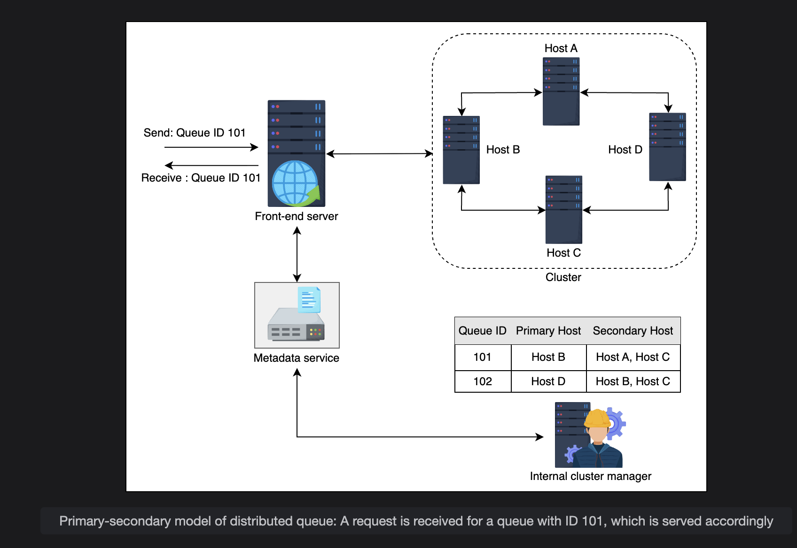
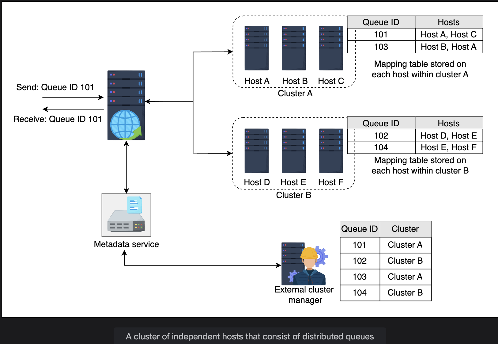

# Design of a Distributed Messaging Queue: Part 2

Learn about the detailed design of a messaging queue and its management at the back-end servers.

## Table of Contents

- [Introduction](#introduction)
- [Back-End Service Overview](#back-end-service-overview)
- [Cluster Managers](#cluster-managers)
- [Replication Models](#replication-models)
- [Message Replication Strategies](#message-replication-strategies)
- [Running Example: Payment Events Queue](#running-example-payment-events-queue)
- [Key Concepts Explained](#key-concepts-explained)
- [Summary](#summary)

---

## Introduction

In the previous lesson, we discussed the responsibilities of front-end servers and metadata services. In this lesson, we'll focus on the **main part of the design** where the queues and messages are stored: the **back-end service**.

### What Part 2 Is Really About

Part 2 answers one main question:

> **Once the front-end decides where a message should go, how does the back-end store it safely, scale it, and survive failures?**

**Core Topics:**
- Message storage
- Replication
- Cluster management
- Failure handling

---

## Back-End Service Overview

This is the **core part of the architecture** where major activities take place.

### What Exactly the Back-End Does

The back-end service is where:
- ✅ Messages are actually stored
- ✅ Ordering is enforced per partition
- ✅ Replication happens
- ✅ Failures are handled

---

### Message Flow

**High-Level Process:**

1. **Producer sends message**
2. **Front-end checks metadata** (which back-end host?)
3. **Front-end forwards message** to correct back-end host
4. **Back-end processes:**
   - Stores message
   - Replicates it
   - Acknowledges success

**Everything after step 3 is Part 2 territory.**

---

### How Front-End Determines the Back-End Host

When the front-end receives a message, it **refers to the metadata service** to determine the host where the message needs to be sent.

**Metadata Information:**
```
Queue: payment-events
Partition: 3
Primary host: backend-3
Replicas: backend-5, backend-7
```

**Action:**
Front-end sends message → `backend-3`

---

### Message Processing

The message is then **forwarded to the host** and is **replicated on the relevant hosts** to overcome a possible availability issue.

**Purpose of Replication:**
- Overcome availability issues
- Ensure data durability
- Enable fault tolerance

---

### Two Replication Models

The message replication in a cluster on different hosts can be performed using one of the following **two models**:

1. **Primary-secondary model**
2. **A cluster of independent hosts**

Before delving into the details of these models, let's discuss the two types of cluster managers responsible for queue management.

---

## Cluster Managers

There are two types of cluster managers responsible for queue management:
- **Internal cluster manager**
- **External cluster manager**

### Why Both Managers Are Needed

**Think in Levels:**

| Level | Manager |
|-------|---------|
| Inside cluster | Internal |
| Across clusters | External |

**Benefits of Separation:**
- ✅ Improves scalability
- ✅ Reduces blast radius
- ✅ Simplifies reasoning

---

### Comparison: Internal vs External Cluster Managers

| Aspect | Internal Cluster Manager | External Cluster Manager |
|--------|-------------------------|-------------------------|
| **Scope** | Manages assignment within a cluster | Manages assignment across clusters |
| **Knowledge** | Knows each and every node within a cluster | Knows about each cluster (not individual hosts) |
| **Monitoring** | Listens to heartbeat from each node | Monitors health of each independent cluster |
| **Responsibilities** | Manages host failure, instance addition/removals | Manages and utilizes clusters |
| **Partitioning** | Partitions queue into parts, assigns primary server per part | May split queue across clusters for equal distribution |

---

### A. Internal Cluster Manager

**Lives inside a cluster** 👉 Node-level control

#### Responsibilities

**What It Knows:**
- Knows **every host** within the cluster

**What It Assigns:**
- Primary hosts
- Secondary hosts (replicas)
- Queue partitions to hosts

**What It Monitors:**
- Listens to the **heartbeat from each node**
- Detects node failures

**What It Manages:**
- Host failure detection
- Instance addition and removals from the cluster
- Leader election (promoting secondary to primary)
- Rebalancing replicas

**What It Does with Queues:**
- Partitions a queue into several parts
- Each part gets a **primary server**

---

**Example:**

**Cluster A contains:**
```
backend-1
backend-2
backend-3
backend-4
```

**Internal Manager Tasks:**
```
Detects: backend-3 is down
Action: Promotes backend-5 as primary
Result: Rebalances replicas
```

**Similar To:**
- Kafka controller
- ZooKeeper-based coordination
- Raft leader election

---

### B. External Cluster Manager

**Lives above clusters** 👉 Cluster-level control

#### Responsibilities

**What It Knows:**
- Knows about each **cluster**
- Does NOT have information on every host inside a cluster

**What It Decides:**
- Which cluster handles which queues
- Load balancing across clusters
- Queue distribution across multiple clusters

**What It Monitors:**
- Monitors the **health of each independent cluster**

**What It Manages:**
- Cluster utilization
- Queue assignment to clusters

**What It Does with Queues:**
- May **split a queue across several clusters**
- Ensures messages for the same queue are equally distributed between several clusters

---

**Example:**

**You have 3 clusters:**
```
Cluster A (India)
Cluster B (EU)
Cluster C (US)
```

**External Manager Decides:**
```
payment-events → Cluster A + B
audit-events   → Cluster C
```

**It does NOT know:**
- Which specific backend-3 or backend-7
- Replica placement within clusters
- Individual host status

**That's the internal manager's job.**

---

## Replication Models

### Model 1: Primary-Secondary Model

In the primary-secondary model, each node is considered a **primary host for a collection of queues**.

**Most Common Approach** ✅

---

#### Characteristics

**Primary Host Responsibility:**
- Receive requests for a particular queue
- Be fully responsible for data replication
- Coordinate with secondary hosts

**Secondary Hosts:**
- Store replicas of the queue
- Can serve read requests
- Can be promoted to primary on failure

---

#### How It Works

**For each queue partition:**
- One node is **Primary**
- Others are **Secondary** (replicas)
- **Only primary accepts writes**

---

#### Example Scenario

Suppose we have **two queues** with the identities **101 and 102** residing on **four different hosts A, B, C, and D**.

**Queue 101 Assignment:**
- **Primary host:** Instance B
- **Secondary hosts:** A and C (where queue 101 is replicated)

**Role Distribution:**

| Role | Server | Queue |
|------|--------|-------|
| Primary | backend-3 | Partition 3 |
| Secondary | backend-5 | Partition 3 |
| Secondary | backend-7 | Partition 3 |

---

#### Message Write Flow

**Process:**

1. **Front-end receives message request**
2. **Identifies primary server** from internal cluster manager through metadata service
3. **Forwards message** to primary instance (Backend-3)
4. **Primary processes:**
   ```
   Backend-3:
     a. Writes message locally
     b. Sends message to replicas (backend-5, backend-7)
     c. Waits for replica acknowledgments
     d. Sends ACK back to front-end
   ```

**Depending on configuration:**
- **Sync replication** → Wait for all replicas
- **Async replication** → ACK immediately

---

#### Message Retrieval and Cleanup

The message is **retrieved from the primary instance**, which is also responsible for:
- Deleting the original message upon usage
- Deleting all of its replicas

---

#### Internal Cluster Manager Role

As shown in the illustration, the **internal cluster manager** is a component that's responsible for:

**Mapping:**
- Between primary host, secondary hosts, and queues

**Selection:**
- Helps in primary host selection

**Requirements:**

Therefore, it needs to be:
- ✅ Reliable
- ✅ Scalable
- ✅ Performant

---

#### Primary Failure Handling

**What happens if primary fails?**

**Automatic Failover Process:**
```
1. Cluster manager detects failure (missed heartbeats)
2. One secondary is promoted to new primary
3. Metadata is updated
4. Front-end routes future writes to new primary
```

**Example:**
```
Before failure:
  Primary: backend-3 ✅
  Secondary: backend-5, backend-7

After backend-3 fails:
  Primary: backend-5 (promoted) ✅
  Secondary: backend-7, backend-8 (new replica)
```

---

#### Advantages

**This gives:**
- ✅ **Strong consistency** (all writes go through primary)
- ✅ **Clear ordering** (primary enforces order)
- ✅ **Simpler consumers** (read from one source)

---

#### Disadvantages

**Downsides:**
- ❌ Primary can become bottleneck (all writes to one node)
- ❌ Failover logic needed (promotes secondary)
- ❌ Write throughput limited by primary capacity

---

#### Visual Representation


```
Primary-Secondary Model:

┌─────────────┐
│  Front-End  │
└──────┬──────┘
       │ Message for Queue 101
       ▼
┌──────────────────────────────────────┐
│  Internal Cluster Manager            │
│                                      │
│  Mapping:                            │
│  Queue 101 → Primary: B              │
│             Replicas: A, C           │
└──────────────────────────────────────┘
       │
       ▼
┌──────────────┐
│   Host B     │
│  (Primary)   │
│              │
│  1. Receive  │
│  2. Store    │
│  3. Replicate├────────┐
└──────┬───────┘        │
       │                │
   ┌───▼────┐      ┌────▼────┐
   │ Host A │      │ Host C  │
   │(Replica│      │(Replica)│
   └────────┘      └─────────┘

Consumer requests Queue 101 → Served by Primary B
```

---

### Model 2: Cluster of Independent Hosts

In the approach involving a cluster of independent hosts, we have **several clusters of multiple independent hosts** that are **distributed across data centers**.

---

#### How It Works

**Characteristics:**
- **No strict primary**
- Any node can accept writes
- Messages distributed across nodes
- Ordering guaranteed **only per node**

---

#### Process Flow

**Message Reception:**

As the front-end receives a message:
1. Determines the **corresponding cluster** via metadata service from external cluster manager
2. Message is forwarded to a **random host in the cluster**
3. Random host **replicates the message** in other hosts where the queue is stored

---

#### Data Distribution

**Example:**

`payment-events` queue spread across:
```
backend-1
backend-2
backend-3
backend-4
```

Producer messages are distributed using:
- Round-robin algorithm
- Hashing techniques

---

#### Question: How Does Random Host Replicate Data?

**Question:** How does a random host within a cluster replicate data—that is, messages—in the queues on other hosts within the same cluster?

**Answer:**

Each host consists of **mapping between the queues and the hosts** within a cluster, making the replication easier.

---

**Detailed Example:**

Assume that we have a cluster, say **Y**, having hosts **A, B, and C**.

This cluster has two queues with IDs **101 and 103** stored on different hosts, as shown in the following table.

**Mapping Table (stored on each host):**

| Queue ID | Stored on Hosts |
|----------|-----------------|
| 101 | A, B |
| 103 | A, B, C |

**This table is stored on each host within cluster Y.**

**Replication Process:**

When a random host receives a message:
```
Host C receives message for Queue 103:
  1. Check local mapping table
  2. Queue 103 is stored on: A, B, C
  3. Replicate message to Host A and Host B
  4. Acknowledge message receipt
```

---

#### Consumer Message Retrieval

The same process is applied to **receive message requests** from the consumer.

Similar to the first approach, the **randomly selected host** is responsible for:
- Message delivery
- Cleanup upon successful processing of the message

---

#### External Cluster Manager Role

Furthermore, another component called an **external cluster manager** is introduced, which is accountable for:

**Mapping:**
- Maintaining the mapping between queues and clusters

**Management:**
- Queue management
- Cluster assignment to a particular queue

---

#### Visual Representation


```
Cluster of Independent Hosts:

                ┌────────────────────────┐
                │ External Cluster Mgr   │
                │                        │
                │ Mapping:               │
                │ Queue 101 → Cluster A  │
                │ Queue 103 → Cluster B  │
                └───────────┬────────────┘
                            │
                ┌───────────┴────────────┐
                │                        │
        ┌───────▼────────┐      ┌────────▼────────┐
        │   Cluster A    │      │   Cluster B     │
        │                │      │                 │
        │  ┌──────────┐  │      │  ┌───────────┐  │
        │  │ Node A1  │  │      │  │ Node B1   │  │
        │  └──────────┘  │      │  └───────────┘  │
        │  ┌──────────┐  │      │  ┌───────────┐  │
        │  │ Node A2  │  │      │  │ Node B2   │  │
        │  └──────────┘  │      │  └───────────┘  │
        │  ┌──────────┐  │      │  ┌───────────┐  │
        │  │ Node A3  │  │      │  │ Node B3   │  │
        │  └──────────┘  │      │  └───────────┘  │
        └────────────────┘      └─────────────────┘

Front-end forwards to random node in cluster
Random node replicates to other nodes
```

**Illustration shows:**
- Two clusters (A and B)
- Multiple nodes in each cluster
- External cluster manager with mapping table
- Queue distribution across clusters

---

#### Advantages

**Benefits:**
- ✅ **Very high write throughput** (no single bottleneck)
- ✅ **No single bottleneck** (distributed writes)
- ✅ Better fault tolerance (no primary dependency)

---

#### Disadvantages

**Challenges:**
- ❌ **Hard to maintain ordering** (writes to multiple nodes)
- ❌ **Consumers need merging logic** (read from multiple nodes)
- ❌ **More complex deduplication** (distributed processing)

---

### Real-World Mapping

**Popular Systems:**

| System | Model Used |
|--------|------------|
| **Apache Kafka** | Primary-based (partition leader) |
| **Some custom queues** | Independent hosts |
| **RabbitMQ** | Primary-secondary (mirrored queues) |
| **Amazon SQS** | Independent hosts (distributed) |

---

### Comparison of Replication Models

| Aspect | Primary-Secondary | Independent Hosts |
|--------|------------------|-------------------|
| **Write Bottleneck** | Yes (primary) | No (distributed) |
| **Ordering** | Strong (per partition) | Weak (per node) |
| **Consistency** | Strong | Eventual |
| **Throughput** | Moderate | Very High |
| **Complexity** | Medium | High |
| **Failover** | Needed (promote secondary) | Not needed |
| **Consumer Logic** | Simple | Complex (merging) |
| **Best For** | Strong ordering needs | High throughput needs |

---

## Message Replication Strategies

**Question:** How is message replication handled in distributed queue systems?

**Answer:**

There are **two ways** to replicate messages in a queue residing on multiple hosts:

1. **Synchronous replication**
2. **Asynchronous replication**

---

### 1. Synchronous Replication

#### How It Works

In synchronous replication:

1. The **primary host is responsible** for replicating the message in all the relevant queues on other hosts
2. **After acknowledgment from secondary hosts**, the primary host then notifies the client regarding the reception of messages

---

#### Process Flow

```
1. Primary receives message
2. Primary writes locally
3. Primary sends to all replicas
4. Wait for ALL replicas to acknowledge
5. Primary acknowledges to client
```

**Timeline:**
```
T0: Message arrives at primary
T1: Primary writes locally (1ms)
T2: Send to replica 1 (2ms)
T3: Send to replica 2 (2ms)
T4: Replica 1 ACKs (1ms)
T5: Replica 2 ACKs (1ms)
T6: Primary ACKs to client

Total: 7ms (includes wait time)
```

---

#### Characteristics

**Advantages:**
- ✅ **Strong consistency**: Messages remain consistent in all queue replicas
- ✅ No data loss
- ✅ All replicas up-to-date

**Disadvantages:**
- ❌ **Extra delay in communication**: Must wait for all replicas
- ❌ **Partial to no availability**: While election is in progress to promote secondary as primary
- ❌ Higher write latency

---

#### When to Use

**Best For:**
- Financial transactions
- Critical data
- Systems requiring strong consistency
- When data loss is unacceptable

---

### 2. Asynchronous Replication

#### How It Works

In asynchronous replication:

1. Once the **primary host receives the messages**, it **acknowledges the client**
2. In the next step, **starts replicating** the message to other hosts

---

#### Process Flow

```
1. Primary receives message
2. Primary writes locally
3. Primary acknowledges client immediately
4. Primary replicates to replicas (in background)
```

**Timeline:**
```
T0: Message arrives at primary
T1: Primary writes locally (1ms)
T2: Primary ACKs to client

Total: 2ms (fast!)

Background:
T3-T10: Replicate to replicas (happens later)
```

---

#### Characteristics

**Advantages:**
- ✅ **Low latency**: Client gets immediate acknowledgment
- ✅ High throughput
- ✅ Better availability

**Disadvantages:**
- ❌ **Replication lag**: Replicas may be behind primary
- ❌ **Consistency issues**: Temporary inconsistency between nodes
- ❌ **Potential data loss**: If primary fails before replication

**Problems:**
- Replication lag
- Consistency issues
- Data loss risk

---

#### When to Use

**Best For:**
- High-throughput systems
- Non-critical data
- Systems tolerating eventual consistency
- Performance-critical applications

---

### Choosing Between Sync and Async

**Based on the needs of an application, we can pick one or the other.**

| Requirement | Choose |
|-------------|--------|
| **Strong consistency needed** | Synchronous |
| **High throughput needed** | Asynchronous |
| **Zero data loss** | Synchronous |
| **Low latency critical** | Asynchronous |
| **Financial data** | Synchronous |
| **Analytics data** | Asynchronous |

---

## Running Example: Payment Events Queue

Let's use one concrete example throughout to map theory to practice.

### Setup

**Assumptions:**
```
Queue name: payment-events
Traffic: Very high volume
Requirements:
  - No message loss
  - High availability
  - Strong ordering per partition

Infrastructure:
  - Multiple clusters
  - Each cluster has multiple servers
```

---

### Queue Partitioning

**Queue:** `payment-events`
**Partitions:** 6

**Partition Assignment:**
```
P0 → backend-1 (Primary) + replicas
P1 → backend-2 (Primary) + replicas
P2 → backend-3 (Primary) + replicas
P3 → backend-4 (Primary) + replicas
P4 → backend-5 (Primary) + replicas
P5 → backend-6 (Primary) + replicas
```

**Each partition:**
- Has its own primary
- Has replicas (typically 2-3)
- Maintains its own order

**Benefits:**
- ✅ **Parallelism**: 6 partitions = 6x throughput
- ✅ **Ordering per partition**: Within P0, messages ordered
- ✅ **Fault isolation**: P0 failure doesn't affect P1-P5

---

### External Manager Splitting Across Clusters

**Very Important Concept:**

For a **high traffic queue**, the external manager can split it across multiple clusters.

**Example:**

```
Queue: payment-events
Traffic: Very high

External Manager Decision:
  Cluster A (India) → Partitions 0, 1, 2
  Cluster B (EU)    → Partitions 3, 4, 5
```

**Result:**
- ✅ Same queue
- ✅ Multiple clusters
- ✅ Horizontal scaling at cluster level

**Consumers may:**
- Read from multiple clusters
- Merge streams from both clusters
- Maintain global order if needed

---

### Complete Flow Example

**Producer sends payment event:**

```
Step 1: Producer → Front-end
  Message: {"payment_id": 12345, "amount": 100}
  
Step 2: Front-end → Metadata Service
  Query: Which cluster and partition for payment-events?
  Response: Cluster A, Partition 3
  
Step 3: Front-end → Metadata Service
  Query: Primary for Partition 3?
  Response: backend-3, replicas: backend-5, backend-7
  
Step 4: Front-end → backend-3 (Primary)
  Send message
  
Step 5: backend-3 (Primary Processing)
  a. Write locally
  b. Replicate to backend-5 ✅
  c. Replicate to backend-7 ✅
  d. ACK to front-end
  
Step 6: Front-end → Producer
  ACK: Message successfully stored
```

---

## Key Concepts Explained

### One-Line Mental Model

> **Front-end decides WHERE, back-end decides HOW, cluster managers decide WHO.**

**Breakdown:**
- **WHERE**: Front-end determines which cluster/partition
- **HOW**: Back-end determines replication strategy
- **WHO**: Cluster managers determine which hosts are primary/secondary

---

### Why This Design Works

| Problem | Solution |
|---------|----------|
| **Single server bottleneck** | Partitioning across multiple servers |
| **Node failure** | Replication with automatic failover |
| **Cluster overload** | External manager distributes load |
| **High throughput needed** | Parallel partitions |
| **Ordering required** | Primary per partition |
| **Scalability** | Add more partitions/clusters |

---

### Design Principles

**Back-end is the data plane:**
- Handles actual data storage
- Manages replication
- Ensures durability

**Primary-secondary is the most practical model:**
- Clear responsibility (primary handles writes)
- Strong consistency
- Simple consumer logic

**Internal manager = node-level control:**
- Knows every host
- Manages within cluster
- Handles failures locally

**External manager = cluster-level control:**
- Knows clusters, not hosts
- Distributes load globally
- Scales horizontally

**Partitioning is the foundation of scale:**
- Enables parallelism
- Provides fault isolation
- Supports horizontal growth

---

### Critical Question: Impact of Slow Internal Cluster Manager

**Question:** If the internal cluster manager suddenly became slower at mapping primaries and secondaries, how might this influence the overall design goals of the back-end service?

**Answer:**

**Immediate Impacts:**

**1. Increased Latency**
```
Normal: Front-end gets primary mapping in 5ms
Slow: Front-end gets primary mapping in 500ms

Message write latency increases 100x!
```

**2. Metadata Cache Misses**
```
Front-end cache invalidates quickly
More queries to slow cluster manager
Cache becomes less effective
```

**3. Failover Delays**
```
Normal failover: 5 seconds
Slow manager failover: 60+ seconds

Longer unavailability during failures
```

**4. Scalability Issues**
```
Adding new nodes takes longer
Rebalancing operations delayed
System can't respond to load changes quickly
```

**Design Goal Impacts:**

| Goal | Impact | Severity |
|------|--------|----------|
| **High Performance** | ❌ Significantly degraded | Critical |
| **High Availability** | ❌ Longer failover times | High |
| **Scalability** | ❌ Slower scaling operations | High |
| **Durability** | ⚠️ Not directly affected | Low |

**Mitigation Strategies:**
1. Aggressive caching at front-end
2. Longer TTL for metadata
3. Optimize cluster manager performance
4. Consider distributed cluster manager (e.g., using Raft/Paxos)

---

## Summary

### Key Takeaways

We have completed the design of a distributed messaging queue and discussed:

#### 1. Back-End Service

**Core Responsibilities:**
- Message storage
- Replication management
- Order enforcement
- Failure handling

---

#### 2. Two Models for Organizing Back-End Servers

**Primary-Secondary Model:**
- One primary per partition
- Strong consistency
- Clear ordering
- Failover required
- **Best for:** Strong consistency needs

**Cluster of Independent Hosts:**
- No single primary
- High throughput
- Distributed writes
- Complex consumer logic
- **Best for:** High-volume systems

---

#### 3. Queue and Message Management

**Processes Described:**
- Message reception at back-end
- Storage mechanisms
- Replication strategies (sync/async)
- Cleanup after processing

---

#### 4. Cluster Managers

**Internal Cluster Manager:**
- Node-level control
- Primary/secondary assignment
- Failure detection
- Leader election

**External Cluster Manager:**
- Cluster-level control
- Queue-to-cluster mapping
- Load distribution
- Global scaling

---

### Design Summary

```
Component Hierarchy:

External Cluster Manager
    │
    ├─ Cluster A
    │   ├─ Internal Manager
    │   ├─ backend-1 (Primary P0)
    │   ├─ backend-2 (Primary P1)
    │   └─ backend-3 (Primary P2)
    │
    └─ Cluster B
        ├─ Internal Manager
        ├─ backend-4 (Primary P3)
        ├─ backend-5 (Primary P4)
        └─ backend-6 (Primary P5)

Flow:
  Producer → Front-End → Metadata Service
          → External Manager (which cluster?)
          → Internal Manager (which host?)
          → Primary Host (store + replicate)
          → ACK back to Producer
```

---

### Final Takeaways

**Three Pillars:**
1. **Partitioning** - Foundation of scale
2. **Replication** - Foundation of durability
3. **Cluster Management** - Foundation of operations

**Success Factors:**
- Choose replication model based on requirements
- Use partitioning for parallelism
- Separate concerns (internal vs external managers)
- Cache metadata aggressively
- Monitor cluster manager performance

---

