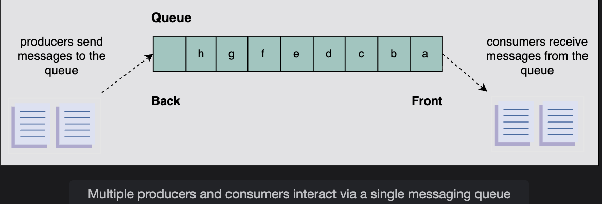

# Requirements of a Distributed Messaging Queue's Design

Learn about the requirements of designing a distributed messaging queue using a strawman solution.

## Table of Contents

- [Requirements](#requirements)
- [Single-Server Messaging Queue](#single-server-messaging-queue)
- [Building Blocks We Will Use](#building-blocks-we-will-use)
- [Summary](#summary)

---

## Requirements

In a distributed messaging queue, data resides on several machines. Our aim is to design a distributed messaging queue that has the following functional and non-functional requirements.

### Functional Requirements

Listed below are the actions that a client should be able to perform:

#### 1. Queue Creation

The client should be able to create a queue and set some parameters—for example:
- Queue name
- Queue size
- Maximum message size

**Industry Standards:**

Generally, most popular services have different size limits:
- **Amazon Simple Queue Service (SQS)**: Maximum size of **256 KB**
- **Microsoft Messaging Queue (MSMQ)**: Maximum size of **4 MB**

---

##### How Do We Send Messages Larger Than the Predefined Size?

Various approaches are used to send messages larger than the specified allowed size.

**Approach 1: Message Chunking**

For example, one approach is to divide the message into small chunks at the sender's side and combine it at the receiver's side. However, this approach incurs extra complexity on both the sender and receiver sides.

**Approach 2: External Storage Reference**

**Amazon SQS Approach:**
Amazon SQS provides extended libraries through which a user can send a message containing a reference to a message payload in Amazon S3 by making calls to several APIs, including:
- `AmazonSQSExtendedClient`
- `ExtendedClientConfiguration`
- And so on

**Microsoft MSMQ Approach:**
Similarly, Microsoft MSMQ provides an `MQSendLargeMessage` API to send a larger message than 4 MB as an XML document.

**Our Assumption:**

Therefore, we will overlook this discussion by assuming that our system supports one of the strategies followed by Amazon or Microsoft.

---

#### 2. Send Message

**Producer entities** should be able to send messages to a queue that's intended for them.

**Characteristics:**
- Producers can send messages asynchronously
- Messages are placed in the designated queue
- Acknowledgment of successful delivery

---

#### 3. Receive Message

**Consumer entities** should be able to receive messages from their respective queues.

**Characteristics:**
- Consumers can retrieve messages from their queues
- Messages can be received in FIFO order (or other ordering)
- Support for message visibility timeout

---

#### 4. Delete Message

The consumer processes should be able to delete a message from the queue **after a successful processing** of the message.

**Importance:**
- Prevents reprocessing of completed messages
- Manages queue size
- Signals successful consumption

---

#### 5. Queue Deletion

Clients should be able to delete a specific queue.

**Considerations:**
- What happens to pending messages?
- Cleanup of associated resources
- Notification to connected producers/consumers

---

### Non-Functional Requirements

Our design of a distributed messaging queue should adhere to the following non-functional requirements:

#### 1. Durability

The data received by the system should be **durable** and **shouldn't be lost**.

**Why It's Critical:**

Producers and consumers can fail independently, and a queue with data durability is critical to make the whole system work, because other entities are relying on the queue.

**Requirements:**
- Messages persisted to disk
- Survive system crashes
- Replication for redundancy
- No data loss guarantees

**Example Scenario:**
```
Producer sends 1,000 messages
System crashes after 500 messages stored
On recovery: All 500 messages still available ✅
```

---

#### 2. Scalability

The system needs to be **scalable** and capable of handling the increased load:
- Number of queues
- Number of producers
- Number of consumers
- Volume of messages

Similarly, when the load reduces, the system should be able to **shrink the resources accordingly**.

**Scalability Dimensions:**
- **Vertical scaling**: Increase server capacity
- **Horizontal scaling**: Add more servers (preferred)
- **Elastic scaling**: Automatic scale up/down based on load

**Example:**
```
Current: 1,000 messages/second
Peak load: 100,000 messages/second

System should:
✅ Scale to handle 100x increase
✅ Scale back down when load normalizes
```

---

#### 3. Availability

The system should be **highly available** for receiving and sending messages.

**Requirement:**

It should continue operating uninterrupted, **even after the failure of one or more of its components**.

**Availability Targets:**
- 99.9% availability (8.7 hours downtime/year)
- 99.99% availability (52 minutes downtime/year)
- 99.999% availability (5.26 minutes downtime/year)

**Failure Scenarios to Handle:**
- Server crashes
- Network partitions
- Hardware failures
- Software bugs
- Data center outages

---

##### How Can Availability Be Maintained When Some Nodes Fail?

**Key Strategies:**

**1. Replication**
- Multiple copies of queue data
- If one node fails, others continue serving
- Automatic failover mechanisms

**2. Redundancy**
- Multiple servers handling same queue
- Load balancing across healthy nodes
- No single point of failure

**3. Health Monitoring**
- Continuous monitoring of node health
- Automatic detection of failures
- Quick failover to healthy nodes

**4. Data Partitioning**
- Distribute queues across multiple nodes
- Failure of one node affects only subset of queues
- Isolated failure domains

**Example:**
```
Queue replicated on 3 nodes:
  Node A (Primary)
  Node B (Replica)
  Node C (Replica)

If Node A fails:
  → Node B promoted to primary
  → System continues operating
  → No service interruption
  
Availability maintained! ✅
```

---

#### 4. Performance

The system should provide **high throughput** and **low latency**.

**Performance Metrics:**

**Throughput:**
- Messages processed per second
- Target: 100,000+ messages/second per server

**Latency:**
- Time from sending to receiving message
- Target: < 10 milliseconds for small messages

**Performance Targets:**
```
Write latency: < 10ms (P99)
Read latency: < 5ms (P99)
Throughput: 100K+ msg/s per node
Queue depth: Support millions of messages
```

---

### Requirements Summary

| Requirement | Target | Priority |
|-------------|--------|----------|
| **Queue Creation** | Support metadata configuration | High |
| **Send Message** | Reliable delivery | Critical |
| **Receive Message** | Ordered retrieval | Critical |
| **Delete Message** | Acknowledgment-based | High |
| **Queue Deletion** | Clean resource removal | Medium |
| **Durability** | Zero data loss | Critical |
| **Scalability** | 100x load increase | High |
| **Availability** | 99.99%+ uptime | Critical |
| **Performance** | <10ms latency, 100K+ msg/s | High |

---

## Single-Server Messaging Queue

Before we embark on our journey to map out the design of a distributed messaging queue, we should recall how queues are used within a single server where the producer and consumer processes are also on the same node.


### How Single-Server Queue Works

A producer or consumer can access a single-server queue by **acquiring the locking mechanism** to avoid data inconsistency.

**Key Concept:**

The queue is considered a **critical section** where only one entity, either the producer or consumer, can access the data at a time.

**Operation Flow:**
```
Producer wants to send message:
  1. Acquire lock on queue
  2. Write message to queue
  3. Release lock

Consumer wants to receive message:
  1. Acquire lock on queue
  2. Read message from queue
  3. Release lock

Only ONE entity accesses queue at a time
```

---

### Limitations of Single-Server Queue

However, several aspects restrain us from using the single-server messaging queue in today's distributed systems paradigm.

**Major Limitations:**

1. **Unavailability**: Becomes unavailable to cooperating processes, producers and consumers, in the event of hardware or network failures

2. **Performance Degradation**: Performance takes a major hit as contention on the lock increases

3. **Lack of Scalability**: Not scalable for high-volume systems

4. **No Durability**: Not durable—data lost on failure

---

### Visual Representation

```
Single-Server Messaging Queue Architecture:

┌─────────────┐
│ Producer 1  │─┐
└─────────────┘ │
                │ All competing
┌─────────────┐ │ for lock
│ Producer 2  │─┤
└─────────────┘ │
                ▼
         ┌──────────────┐
         │    LOCK      │
         └──────┬───────┘
                │
         ┌──────▼───────┐
         │    Queue     │
         │  (In Memory) │
         └──────┬───────┘
                │
         ┌──────┴───────┐
         │    LOCK      │
         └──────┬───────┘
                │
┌───────────────┤
│               │
▼               ▼
┌─────────────┐ ┌─────────────┐
│ Consumer 1  │ │ Consumer 2  │
└─────────────┘ └─────────────┘

Problem: Lock becomes bottleneck!
```

---

### Question: Can We Extend the Design of a Single-Server Messaging Queue to a Distributed Messaging Queue?

**Answer:** Yes, but we need to address significant drawbacks first.

A single-server messaging queue has the following drawbacks:

#### 1. High Latency

As in the case of a single-server messaging queue, a producer or consumer acquires a lock to access the queue.

**Problem:**

Therefore, this mechanism becomes a **bottleneck** when many processes try to access the queue. This increases the latency of the service.

**Example:**
```
10 producers, 10 consumers (20 total)
Average operation: 1ms
Lock wait time: 19ms (waiting for others)

Total latency per operation: 20ms
Without lock contention: 1ms

20x slowdown due to locking! ❌
```

---

#### 2. Low Availability

Due to the **lack of replication** of the messaging queue, the producer and consumer process might be unable to access the queue in events of failure.

**Impact:**

This reduces the system's **availability** and **reliability**.

**Failure Scenario:**
```
Single server hosting queue
Server crashes → Queue unavailable
All producers blocked
All consumers blocked

System downtime: Until server recovers
No failover mechanism ❌
```

---

#### 3. Lack of Durability

Due to the **absence of replication**, the data in the queue might be lost in the event of a system failure.

**Risk:**
```
Queue has 10,000 pending messages
Server crashes (hardware failure)
All 10,000 messages lost forever ❌

No backup
No recovery possible
Data loss unacceptable for critical systems
```

---

#### 4. Scalability

A single-server messaging queue can handle a **limited number** of:
- Messages
- Producers
- Consumers

Therefore, it is **not scalable**.

**Scalability Limits:**
```
Single server capacity:
  - 10,000 messages/second max
  - Limited by: CPU, memory, I/O

Load increases to 100,000 messages/second:
  - Cannot scale vertically beyond hardware limits
  - Cannot add more servers (single-server design)
  - System overwhelmed ❌
```

---

### Path Forward

**To extend the design of a single-server messaging queue to a distributed messaging queue, we need to make extensive efforts to eliminate the drawbacks outlined above.**

**Key Improvements Needed:**

1. **Replace Locks** → Distributed coordination mechanisms
2. **Add Replication** → Multiple copies of data
3. **Implement Partitioning** → Distribute load across servers
4. **Add Durability** → Persistent storage with backups
5. **Enable Horizontal Scaling** → Add servers as needed

---

## Building Blocks We Will Use

The design of a distributed messaging queue utilizes the following building blocks:

### 1. Database(s)

**Purpose**: Will be required to store the metadata of queues and users.

**What to Store:**
- Queue metadata (name, size, creation time)
- User information (authentication, permissions)
- Message metadata (ID, timestamp, priority)
- Subscription information
- Configuration settings

**Example Metadata:**
```
Queue Metadata:
  - queue_id: "queue-12345"
  - queue_name: "order-processing"
  - max_size: 100000
  - max_message_size: 256KB
  - created_at: "2026-01-23T10:00:00Z"
  - owner_id: "user-789"

Message Metadata:
  - message_id: "msg-abc-123"
  - queue_id: "queue-12345"
  - timestamp: "2026-01-23T10:30:00Z"
  - size: 1024 bytes
  - retry_count: 0
```

**Database Requirements:**
- High availability
- ACID transactions for metadata
- Fast queries
- Scalability

---

### 2. Caches

**Purpose**: Important to keep frequently accessed data, whether it be data pertaining to users or queue metadata.

**What to Cache:**

**Queue Metadata:**
- Frequently accessed queue information
- Reduces database load
- Faster queue lookups

**User Data:**
- Authentication tokens
- User permissions
- Access control lists

**Benefits:**
```
Without cache:
  Every request → Database query
  Latency: 50ms
  Database load: High

With cache:
  Cache hit: 1ms ✅
  Cache miss: 50ms (then cache)
  Database load: Reduced by 95%
```

**Cache Strategy:**
- Cache frequently accessed queues
- TTL-based expiration
- Write-through or write-back
- Invalidation on updates

---

### 3. Load Balancers

**Purpose**: Used to direct incoming requests to servers where the metadata is stored.

**Functions:**

**Request Distribution:**
- Distribute incoming requests evenly
- Across multiple metadata servers
- Prevent server overload

**Health Checking:**
- Monitor server health
- Remove failed servers from pool
- Automatic failover

**Benefits:**
```
Without load balancer:
  All requests → Single server
  Server overload
  No fault tolerance

With load balancer:
  Requests distributed across 10 servers
  Each handles 10% of load
  If one fails, others continue
  
Improved performance and availability ✅
```

**Load Balancing Strategies:**
- Round-robin
- Least connections
- Weighted distribution
- Geographic routing

---

### Building Blocks Summary

```
System Architecture Overview:

           ┌──────────────────┐
           │  Load Balancer   │
           └────────┬─────────┘
                    │
        ┌───────────┼───────────┐
        │           │           │
   ┌────▼────┐ ┌───▼─────┐ ┌───▼─────┐
   │Metadata │ │Metadata │ │Metadata │
   │Server 1 │ │Server 2 │ │Server 3 │
   └────┬────┘ └────┬────┘ └────┬────┘
        │           │           │
        └───────────┼───────────┘
                    │
        ┌───────────┼───────────┐
        │           │           │
   ┌────▼────┐ ┌───▼─────┐ ┌───▼─────┐
   │ Cache   │ │Database │ │ Cache   │
   │ Layer   │ │Cluster  │ │ Layer   │
   └─────────┘ └─────────┘ └─────────┘
```

---

## Summary

### Key Takeaways

#### Functional Requirements
1. **Queue Creation** - Support configurable parameters
2. **Send Message** - Reliable message delivery to queues
3. **Receive Message** - Ordered message retrieval
4. **Delete Message** - Acknowledgment-based deletion
5. **Queue Deletion** - Clean removal of queues

---

#### Non-Functional Requirements
1. **Durability** - Zero data loss, persistent storage
2. **Scalability** - Handle 100x load increase
3. **Availability** - 99.99%+ uptime, fault tolerance
4. **Performance** - <10ms latency, 100K+ msg/s throughput

---

#### Single-Server Limitations

**Why Single-Server Doesn't Work:**

| Issue | Impact | Solution Needed |
|-------|--------|-----------------|
| **Lock Contention** | High latency | Distributed coordination |
| **No Replication** | Low availability | Multiple replicas |
| **No Backup** | Data loss risk | Persistent storage |
| **Limited Capacity** | Not scalable | Horizontal scaling |

---

#### Building Blocks for Distributed Design

**Three Core Components:**

1. **Database(s)** - Store queue and user metadata
   - ACID transactions
   - High availability
   - Scalable storage

2. **Caches** - Reduce latency for frequent access
   - 95%+ cache hit rate
   - Sub-millisecond access
   - Reduced database load

3. **Load Balancers** - Distribute requests evenly
   - Fault tolerance
   - Even distribution
   - Health monitoring

---

#### Next Steps

In our discussion on messaging queues, we focused on their functional and non-functional requirements.

**Before moving on to the process of designing a distributed messaging queue, it's essential for us to discuss some key considerations and challenges that may affect the design.**

**Topics to Cover:**
- Message ordering strategies
- Concurrency handling
- Replication mechanisms
- Failure recovery
- Performance optimization

---

