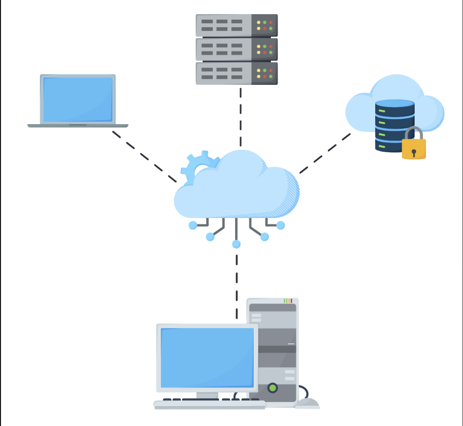

# System Design: The Distributed Messaging Queue

Learn about the messaging queue, why we use it, and important use cases.

## Table of Contents

- [What is a Messaging Queue?](#what-is-a-messaging-queue)
- [Key Components](#key-components-of-a-messaging-queue)
- [Why Use a Messaging Queue](#why-use-a-messaging-queue)
- [Common Messaging Queue Patterns](#common-messaging-queue-patterns)
- [Popular Technologies](#popular-messaging-queue-technologies)
- [Use Cases](#messaging-queue-use-cases)
- [Best Practices](#best-practices-for-implementing-messaging-queues)
- [Message Prioritization](#message-prioritization-without-starvation)
- [Critical Questions and Answers](#critical-questions-and-answers)
- [Design Roadmap](#how-do-we-design-a-distributed-messaging-queue)
- [Summary](#summary)

---

## What is a Messaging Queue?

A **messaging queue** is an intermediate component that connects the interacting entities, known as **producers** and **consumers**.

### Basic Concept

- The **producer** produces messages and places them in the queue
- The **consumer** retrieves the messages from the queue and processes them
- There may be **multiple producers and consumers** interacting with the queue simultaneously

### Visual Representation

```
┌──────────────┐         ┌─────────────┐         ┌──────────────┐
│  Producer    │────────→│   Message   │────────→│   Consumer   │
│ Application  │ Publish │    Queue    │ Consume │ Application  │
└──────────────┘         └─────────────┘         └──────────────┘
```

**Example:**
```
Application A (Producer):
  Generates order events
  Sends to queue: "New Order #12345"

Message Queue:
  Stores message temporarily
  Ensures reliable delivery

Application B (Consumer):
  Retrieves message from queue
  Processes order
  Updates inventory
```

---

## Key Components of a Messaging Queue

The key components of messaging queues include:

### 1. Producers

**Definition**: These are entities or applications that create and send messages to the queue.

**Responsibilities:**
- Generate data or events that need to be processed
- Push them into the messaging system for later consumption
- Don't need to know about consumers

**Example:**
```
Web Server (Producer):
  User signs up
  → Create message: {"event": "user_signup", "user_id": 12345}
  → Send to queue
  → Continue serving other requests (non-blocking!)
```

**Code Example:**
```python
# Producer sending a message
producer.send(
    topic="user-events",
    message={
        "event_type": "signup",
        "user_id": 12345,
        "timestamp": "2026-01-23T10:30:00Z"
    }
)
```

---

### 2. Consumers

**Definition**: Consumers are entities or applications that receive and process messages from the queue.

**Responsibilities:**
- Subscribe to the queue
- Pull messages for processing
- Handle tasks asynchronously and independently from producers

**Example:**
```
Email Service (Consumer):
  Polls queue for new messages
  → Receives: {"event": "user_signup", "user_id": 12345}
  → Sends welcome email
  → Acknowledges message
```

**Code Example:**
```python
# Consumer processing messages
while True:
    message = consumer.poll(timeout=1000)
    
    if message:
        process_signup(message.user_id)
        consumer.acknowledge(message)  # Mark as processed
```

---

### 3. Queues

**Definition**: A queue is a data structure that temporarily holds messages sent by producers until they are consumed by consumers.

**Characteristics:**
- Queues ensure that messages are stored in a **first-in, first-out (FIFO)** order
- Although some systems may implement different ordering mechanisms
- Provide a buffer that **decouples producers and consumers**
- Allow for smoother communication

**Queue Behavior:**
```
Messages in Queue (FIFO):
┌─────────┐
│ Msg #1  │ ← First In (will be processed first)
├─────────┤
│ Msg #2  │
├─────────┤
│ Msg #3  │
├─────────┤
│ Msg #4  │ ← Last In (will be processed last)
└─────────┘
```

**Properties:**
- **Persistence**: Messages stored on disk (survive restarts)
- **Durability**: Guaranteed delivery
- **Ordering**: FIFO, priority, or custom
- **Size limits**: Max queue depth (e.g., 10,000 messages)

---

### 4. Messages

**Definition**: Messages are the data packets that are sent from producers to consumers via the queue.

**Structure:**

Each message typically contains:

**A. Payload (the actual data)**
```json
{
  "order_id": "ORD-12345",
  "customer_id": 789,
  "items": [
    {"product": "Laptop", "quantity": 1},
    {"product": "Mouse", "quantity": 2}
  ],
  "total": 1200.00
}
```

**B. Metadata (headers or properties)**
```json
{
  "message_id": "msg-abc-123",
  "timestamp": "2026-01-23T10:30:00Z",
  "type": "order.created",
  "priority": "high",
  "retry_count": 0,
  "routing_key": "orders.new"
}
```

**Complete Message Structure:**
```
┌─────────────────────────────────┐
│        Message                  │
├─────────────────────────────────┤
│  Metadata:                      │
│    - Message ID                 │
│    - Timestamp                  │
│    - Type                       │
│    - Priority                   │
│    - Routing info               │
├─────────────────────────────────┤
│  Payload:                       │
│    - Actual business data       │
│    - Order details, user info   │
│    - Any serialized content     │
└─────────────────────────────────┘
```

Together, these components enable **efficient and reliable asynchronous communication** in distributed systems, allowing for better resource management and improved system performance.

---

## Why Use a Messaging Queue

A messaging queue has several advantages and use cases.

### Core Benefits

Messaging queues improve **performance, reliability, scalability, and flexibility** in distributed systems by enabling asynchronous, decoupled communication.

---

### 1. Asynchronous Communication

**Benefit**: Producers can send messages without waiting for consumers, reducing latency and preventing bottlenecks.

**Without Queue:**
```
Producer → Wait for Consumer → Complete
Total time: 100ms + 50ms = 150ms

If consumer is slow:
Producer blocked!
```

**With Queue:**
```
Producer → Queue → Continue
Total time: 5ms (just queue write)

Consumer processes later (asynchronously)
Producer never blocked!
```

---

### 2. Buffering and Load Smoothing

**Benefit**: Queues buffer messages during spikes or when consumers are offline, ensuring no data is lost and smoothing out load variations.

**Example:**
```
Normal load: 100 req/s
Spike: 10,000 req/s (100x increase!)

Without queue:
  Consumers overwhelmed → Crash → Data loss

With queue:
  Queue absorbs spike → Stores 10,000 messages
  Consumers process at steady 100 req/s
  Queue drains over time
  ✅ No data loss
```

---

### 3. Decoupling Services

**Benefit**: They decouple services, allowing each component to operate, scale, deploy, and fail independently.

**Coupling Issues (Without Queue):**
```
Service A directly calls Service B:
  - A must know B's location
  - If B is down, A fails
  - Changes to B affect A
  - Cannot deploy independently
```

**Decoupled (With Queue):**
```
Service A → Queue → Service B

Benefits:
✅ A doesn't know about B
✅ If B is down, messages queue up
✅ B can be upgraded independently
✅ A and B can use different technologies
```

This independence simplifies maintenance and fosters more agile development.

---

### 4. Load Balancing

**Benefit**: Queues support load balancing by distributing work across multiple consumers, automatically routing messages to available workers, and maintaining throughput even when some consumers slow down or fail.

**Example:**
```
Single consumer: 100 msg/s capacity
Queue has: 500 msg/s incoming

Without load balancing:
  Consumer overloaded → Latency increases

With load balancing (5 consumers):
  Consumer 1: 100 msg/s
  Consumer 2: 100 msg/s
  Consumer 3: 100 msg/s
  Consumer 4: 100 msg/s
  Consumer 5: 100 msg/s
  Total: 500 msg/s ✅
```

**Automatic Distribution:**
```
┌─────────────┐
│    Queue    │
└──────┬──────┘
       │
   ┌───┼────┬────┬────┐
   │   │    │    │    │
┌──▼┐ ┌▼──┐ ┌▼─┐ ┌▼─┐ ┌▼──┐
│C1 │ │C2 │ │C3│ │C4│ │C5 │
└───┘ └───┘ └──┘ └──┘ └───┘

Round-robin distribution
```

---

### 5. Fault Tolerance

**Benefit**: Messaging systems enhance fault tolerance through persistence, retries, acknowledgments, and dead-letter queues, ensuring reliable delivery and easier troubleshooting.

**Fault Tolerance Mechanisms:**

**A. Persistence**
```
Message written to disk:
  Even if server crashes
  Message survives
  Can be reprocessed
```

**B. Retries**
```
Consumer fails:
  Message returned to queue
  Retry after delay
  Configurable retry count (e.g., 3 attempts)
```

**C. Acknowledgments**
```
Consumer receives message:
  Processes successfully
  Sends ACK to queue
  Queue deletes message

Consumer crashes before ACK:
  Message remains in queue
  Another consumer picks it up
```

**D. Dead-Letter Queues (DLQ)**
```
Message fails 3 times:
  Move to Dead-Letter Queue
  Manual inspection
  Fix issue
  Reprocess or discard
```

---

### 6. Horizontal Scaling

**Benefit**: They make horizontal scaling straightforward—new consumers can be added at any time to increase processing capacity.

**Scaling Example:**
```
Initial setup:
  3 consumers
  300 msg/s capacity

Load increases to 600 msg/s:
  Add 3 more consumers
  Total: 6 consumers
  600 msg/s capacity ✅

No code changes needed!
```

---

### 7. Rate Limiting

**Benefit**: Queues absorb bursts of traffic to protect downstream services.

**Example:**
```
Upstream: 10,000 req/s burst
Downstream: 100 req/s max capacity

Queue:
  Accepts 10,000 req/s
  Stores in buffer
  Releases to downstream at 100 req/s
  
Downstream protected from overload!
```

---

### 8. Priority Handling

**Benefit**: Ensures that critical work is processed first through multiple queues or priority rules.

**Priority Example:**
```
3 Queues:
  HIGH priority: Payment failures, refunds
  MEDIUM priority: Order processing
  LOW priority: Analytics, reports

Consumer checks:
  1. HIGH queue first
  2. If empty → MEDIUM queue
  3. If empty → LOW queue
  
Critical work processed first!
```

---

### Summary

Overall, messaging queues provide a **resilient, scalable backbone** for modern applications, enabling smooth communication and consistent performance under varying loads.

**Key Benefits:**
✅ Asynchronous processing
✅ Load smoothing
✅ Service decoupling
✅ Automatic load balancing
✅ Fault tolerance
✅ Easy scaling
✅ Rate limiting
✅ Priority handling

---

## Common Messaging Queue Patterns

### 1. Point-to-Point

**Definition**: Point-to-point is a **one-to-one** messaging pattern where a producer sends a message to a single consumer via a queue.

**Characteristics:**
- Each message is delivered to **exactly one** designated consumer
- Making it ideal for tasks that must be handled by a specific worker
- The queue tracks consumption and acknowledgments, ensuring **guaranteed delivery**

**Architecture:**
```
Producer → Queue → Single Consumer

┌──────────┐     ┌───────┐     ┌──────────┐
│ Producer │────→│ Queue │────→│ Consumer │
└──────────┘     └───────┘     └──────────┘
```

**Example:**
```
Order Processing:
  1. Web server creates order
  2. Sends to "orders" queue
  3. Single order processor picks it up
  4. Processes payment
  5. Updates inventory
  6. Acknowledges completion
```

**Use Cases:**
- Task queues
- Worker-based systems
- Job scheduling
- Order processing
- Payment processing
- Email sending

**Benefits:**
- ✅ Guaranteed single processing
- ✅ No duplicate work
- ✅ Predictable, isolated processing


---

### 2. Publish/Subscribe (Pub/Sub)

**Definition**: Publish/subscribe (pub/sub) is a **one-to-many** pattern where a publisher sends messages to all subscribers interested in a topic, without knowing who they are.

**Characteristics:**
- Because producers and consumers are **decoupled**, the system scales easily
- Subscribers can **join or leave dynamically**
- **Same message** delivered to **multiple subscribers**

**Architecture:**
```
Publisher → Topic → Multiple Subscribers

                  ┌───────────────┐
                  │  Subscriber 1 │
                  └───────────────┘
                          ▲
┌───────────┐     ┌───────┴──┐
│ Publisher │────→│  Topic   │
└───────────┘     └───────┬──┘
                          ▲
                  ┌───────┴───────┐
                  │  Subscriber 2 │
                  └───────────────┘
                          ▲
                  ┌───────┴───────┐
                  │  Subscriber 3 │
                  └───────────────┘
```

**Example:**
```
User signup event:

Publisher (Web Server):
  User signs up
  Publishes to "user-events" topic

Subscribers:
  1. Email Service → Sends welcome email
  2. Analytics Service → Tracks signup metric
  3. CRM Service → Creates customer profile
  4. Notification Service → Sends push notification

All receive the same message!
```

**Use Cases:**
- Event-driven architectures
- Real-time updates (newsfeeds, stock prices)
- Notification systems
- Broadcast messaging
- Logging and monitoring
- Microservices communication

**Benefits:**
- ✅ Easy to add new subscribers
- ✅ Publisher doesn't know subscribers
- ✅ Scales horizontally
- ✅ Real-time propagation

---

### 3. Request/Reply

**Definition**: Request/reply supports **synchronous, two-way communication**: a client sends a request and waits for a response.

**Characteristics:**
- Used when **immediate feedback** is required
- Synchronous interaction
- Coordinated responses

**Architecture:**
```
Client → Request Queue → Server → Reply Queue → Client

┌────────┐  Request  ┌────────┐  Process  ┌────────┐
│ Client │──────────→│  Queue │──────────→│ Server │
└────────┘           └────────┘           └───┬────┘
    ▲                                         │
    │                Reply                    │
    │                ┌────────┐               │
    └────────────────│  Queue │←──────────────┘
                     └────────┘
```

**Example:**
```
Product availability check:

Client:
  1. Sends request: "Check stock for Product #123"
  2. Includes reply queue ID
  3. Waits for response

Server:
  1. Receives request from queue
  2. Checks database
  3. Sends reply: "In stock: 50 units"
  4. Sends to reply queue

Client:
  1. Receives reply
  2. Displays to user
```

**Use Cases:**
- APIs
- Microservices communication
- Transactional operations
- RPC (Remote Procedure Call)
- Service orchestration
- Checking product availability
- User request fulfillment

**Benefits:**
- ✅ Immediate feedback
- ✅ Coordinated responses
- ✅ Improved user experience
- ✅ Clear request-response flow

This pattern improves user experience by providing timely, coordinated responses.

---

### Pattern Comparison

| Pattern | Communication | Message Flow | Use Case |
|---------|---------------|--------------|----------|
| **Point-to-Point** | One-to-One | Producer → Queue → Single Consumer | Task processing, job queues |
| **Pub/Sub** | One-to-Many | Publisher → Topic → Multiple Subscribers | Event broadcasting, notifications |
| **Request/Reply** | Two-way Sync | Client ↔ Queue ↔ Server | APIs, transactions, RPC |

---

## Popular Messaging Queue Technologies

While the concept is universal, several popular technologies implement these principles, each with different strengths:

### 1. RabbitMQ

**Type**: Message broker

**Description**: A widely used open-source message broker that supports multiple protocols (like AMQP) and complex routing patterns.

**Key Features:**
- Supports multiple messaging patterns
- Flexible routing (topic, fanout, direct)
- Management UI
- Plugin system
- Multi-protocol support

**Best For:**
- Complex routing requirements
- Traditional message queuing
- Enterprise applications

**Example Use:**
```
Order Processing System:
  - Multiple queues for different order types
  - Routing based on order priority
  - Dead-letter queues for failed orders
```

---

### 2. Apache Kafka

**Type**: Distributed streaming platform

**Description**: A high-throughput, distributed streaming platform often used for real-time data pipelines, event sourcing, and log aggregation.

**Key Features:**
- Extremely high throughput (millions of messages/sec)
- Distributed, fault-tolerant
- Message persistence and replay
- Stream processing (Kafka Streams)
- Strong ordering guarantees

**Best For:**
- Real-time data pipelines
- Event sourcing
- Log aggregation
- Stream processing
- Big data ingestion

**Example Use:**
```
Real-time Analytics:
  - Collect clickstream data
  - Process in real-time
  - Feed to analytics dashboard
  - Replay events for debugging
```

---

### 3. Amazon Simple Queue Service (SQS)

**Type**: Fully managed message queue

**Description**: A fully managed message queuing service from AWS, offering reliable, scalable queues that integrate easily with other cloud services.

**Key Features:**
- Fully managed (no servers to maintain)
- Unlimited scalability
- Pay-per-use pricing
- Integration with AWS services
- Standard and FIFO queues

**Best For:**
- AWS-based applications
- Serverless architectures
- Decoupling microservices
- Simple queue requirements

**Example Use:**
```
Serverless Image Processing:
  - Upload image to S3
  - Trigger SQS message
  - Lambda function processes
  - Store result in S3
```

---

### Technology Comparison

| Feature | RabbitMQ | Apache Kafka | Amazon SQS |
|---------|----------|--------------|------------|
| **Type** | Message Broker | Streaming Platform | Managed Queue |
| **Throughput** | Moderate | Very High | High |
| **Persistence** | Optional | Always | Always |
| **Ordering** | Per queue | Per partition | FIFO queue option |
| **Message Replay** | No | Yes | Limited (14 days) |
| **Management** | Self-hosted | Self-hosted | Fully managed |
| **Best For** | Complex routing | Big data, streaming | AWS integration |
| **Latency** | Low (ms) | Low (ms) | Moderate (ms) |

---

## Messaging Queue Use Cases

A messaging queue has many use cases, both in single-server and distributed environments. For example, it can be used for interprocess communication within one operating system. It also enables communication between processes in a distributed environment.

Some of the use cases of a messaging queue are discussed below:

### 1. Sending Many Emails

**Problem**: Emails are used for numerous purposes, including:
- Sharing information
- Account verification
- Password resets
- Marketing campaigns
- And more

All of these emails, written for different purposes, **don't need immediate processing** and, therefore, **don't disturb the system's core functionality**.

**Solution**: A messaging queue can help coordinate a large number of emails between different senders and receivers in such cases.

**Example:**
```
User Registration Flow:

Without Queue:
  1. User submits registration
  2. System sends verification email (3 seconds)
  3. User waits... (bad UX)
  4. Registration complete

With Queue:
  1. User submits registration
  2. Add "send email" to queue (5ms)
  3. Registration complete immediately ✅
  4. Background worker sends email later
```

**Architecture:**
```
┌─────────────┐
│ Web Server  │
│ (Producer)  │
└──────┬──────┘
       │ Create email task
       ▼
┌─────────────┐
│ Email Queue │
└──────┬──────┘
       │
       ├──→ Worker 1 → Send verification email
       ├──→ Worker 2 → Send welcome email
       ├──→ Worker 3 → Send marketing email
       └──→ Worker 4 → Send password reset
```

**Benefits:**
- Fast user response
- Reliable email delivery
- Can retry failed emails
- Rate limiting (avoid spam flags)

---

### 2. Data Post-Processing

**Problem**: Many multimedia applications require processing content to meet the needs of different viewers, such as those for consumption on:
- Mobile phones
- Smart televisions
- Web browsers
- Different resolutions

Oftentimes, applications upload the content into a store and use a messaging queue for post-processing of content offline.

**Solution**: Doing this substantially:
- Reduces client-perceived latency
- Enables the service to schedule offline work at an appropriate time
- Probably late at night when compute capacity is less busy

**Example:**
```
Video Upload Platform:

Immediate Response:
  1. User uploads video (1 GB)
  2. Store original in S3 (10 seconds)
  3. Return success to user ✅
  4. Add processing tasks to queue

Background Processing (Queue):
  Task 1: Transcode to 1080p
  Task 2: Transcode to 720p
  Task 3: Transcode to 480p
  Task 4: Generate thumbnails
  Task 5: Extract subtitles
  Task 6: Create preview clip
  
Process during off-peak hours (2 AM - 6 AM)
When compute is cheap!
```

**Architecture:**
```
User Upload
     ↓
┌─────────────┐
│   Storage   │
│   (S3/GCS)  │
└──────┬──────┘
       │ Publish event
       ▼
┌─────────────┐
│Processing Q │
└──────┬──────┘
       │
       ├──→ GPU Worker 1 → 4K encoding
       ├──→ GPU Worker 2 → 1080p encoding
       └──→ CPU Worker → Thumbnail generation
```

**Benefits:**
- Instant upload confirmation
- Efficient resource usage
- Cost optimization (off-peak processing)
- Parallel processing

---

### 3. Recommender Systems

**Problem**: Some platforms utilize recommender systems to deliver personalized content or information to users.

The recommender system:
- Takes the user's historical data
- Processes it
- Predicts relevant content or information

Since this is a **time-consuming task**, a messaging queue can be incorporated between the recommender system and requesting processes to increase and quicken performance.

**Example:**
```
E-commerce Product Recommendations:

User Action:
  User views Product A (Laptop)

Immediate Response:
  1. Log view event
  2. Add to recommendation queue
  3. Show default recommendations
  4. User continues browsing

Background Processing:
  1. Recommendation engine picks up event
  2. Analyzes: viewing history, purchases, similar users
  3. Computes: "People who viewed laptops also bought..."
  4. Updates user's recommendation cache
  5. Next page load → Personalized recommendations

Processing time: 30 seconds
User doesn't wait!
```

**Architecture:**
```
┌──────────────┐
│  Web Server  │
└───────┬──────┘
        │ User action
        ▼
┌─────────────────┐
│ Events Queue    │
└───────┬─────────┘
        │
        ▼
┌─────────────────┐
│ Recommendation  │
│    Engine       │
│  (ML Model)     │
└───────┬─────────┘
        │ Update cache
        ▼
┌─────────────────┐
│  Redis Cache    │
└─────────────────┘
```

**Benefits:**
- Non-blocking user experience
- Resource-intensive computations offline
- Scalable recommendation processing
- Can batch similar requests

---

### Additional Use Cases

| Use Case | Why Queue? | Example |
|----------|------------|---------|
| **Order Processing** | Decouple checkout from inventory | E-commerce platforms |
| **Log Aggregation** | Buffer logs from multiple sources | Centralized logging |
| **Task Scheduling** | Distribute cron jobs | Periodic reports |
| **Data Synchronization** | Sync between databases | Multi-region replication |
| **Notification Delivery** | Handle spikes in notifications | Push notifications |
| **Payment Processing** | Ensure reliable payment handling | Financial transactions |

---

## Best Practices for Implementing Messaging Queues

### 1. Message Idempotency

**Definition**: Message idempotency ensures that a message can be processed multiple times without causing duplicate actions or inconsistent data.

**Why It's Critical**:

This is particularly essential in distributed systems, where:
- Retries may occur
- Failures happen
- Network issues cause duplicate deliveries

Idempotent design guarantees that **reprocessing produces the same outcome as a single execution**, simplifying error recovery and protecting data integrity.

Overall, it strengthens system reliability and reduces the risk of unintended side effects.

---

**Problem Example (Non-Idempotent):**
```
Message: "Charge user $100"

Processing:
  First attempt: Success → $100 charged
  Network glitch → No ACK received
  Retry: Success → $100 charged again!
  
Total charged: $200 ❌ (should be $100)
```

**Solution (Idempotent):**
```
Message: {
  "idempotency_key": "payment-12345",
  "action": "charge",
  "amount": 100
}

Processing:
  1. Check if idempotency_key processed
  2. If yes → Return cached result (no charge)
  3. If no → Process payment
  4. Store idempotency_key + result
  
Retry with same key → Returns same result
No duplicate charge ✅
```

---

**Implementation Patterns:**

**A. Unique Message IDs**
```python
def process_payment(message):
    payment_id = message['payment_id']
    
    # Check if already processed
    if db.exists(f"processed:{payment_id}"):
        return db.get(f"result:{payment_id}")
    
    # Process
    result = charge_customer(message)
    
    # Store result
    db.set(f"processed:{payment_id}", True)
    db.set(f"result:{payment_id}", result)
    
    return result
```

**B. Natural Idempotency**
```python
# Idempotent: Setting a value
user.status = "active"  # Can run multiple times safely

# Non-idempotent: Incrementing
user.login_count += 1  # Running twice gives wrong result

# Make it idempotent:
if not user.last_login or user.last_login < message.timestamp:
    user.login_count = message.login_count
    user.last_login = message.timestamp
```

---

### 2. Monitoring and Logging

**Purpose**: Monitoring and logging provide visibility into message flow and system health.

**Monitoring**:
- Helps teams detect bottlenecks
- Identify latency spikes
- Detect failures in real time
- Enable proactive intervention

**Logging**:
- Captures key events and errors
- For auditing
- Troubleshooting
- Determining root cause of issues

Together, they improve operational transparency, support informed decisions, and enhance the resilience of messaging systems.

---

**Key Metrics to Monitor:**

| Metric | What It Measures | Alert Threshold |
|--------|------------------|-----------------|
| **Queue Depth** | Number of unprocessed messages | > 10,000 messages |
| **Processing Time** | Time to process each message | P99 > 5 seconds |
| **Consumer Lag** | How far behind consumers are | > 1 hour |
| **Error Rate** | Failed message percentage | > 5% |
| **DLQ Size** | Messages in dead-letter queue | > 100 |
| **Throughput** | Messages/second | Drops below baseline |

---

**Logging Example:**
```python
import logging

logger = logging.getLogger(__name__)

def process_message(message):
    logger.info(
        "Processing message",
        extra={
            "message_id": message.id,
            "timestamp": message.timestamp,
            "queue": message.queue_name
        }
    )
    
    try:
        result = do_work(message.payload)
        
        logger.info(
            "Message processed successfully",
            extra={
                "message_id": message.id,
                "processing_time_ms": result.duration,
                "result": result.status
            }
        )
    except Exception as e:
        logger.error(
            "Message processing failed",
            extra={
                "message_id": message.id,
                "error": str(e),
                "retry_count": message.retry_count
            },
            exc_info=True
        )
        raise
```

---

### 3. Error Handling

Robust error handling ensures message processing continues smoothly even when failures occur.

**Common Techniques:**

#### A. Automatic Retries

For transient issues (network timeouts, temporary database unavailability).

```
Retry Strategy:
  Attempt 1: Immediate
  Attempt 2: Wait 1 second
  Attempt 3: Wait 5 seconds  (exponential backoff)
  Attempt 4: Wait 25 seconds
  Attempt 5: Wait 125 seconds
  
After 5 attempts → Move to Dead-Letter Queue
```

**Implementation:**
```python
def process_with_retry(message, max_retries=5):
    retry_count = 0
    delay = 1  # Initial delay in seconds
    
    while retry_count < max_retries:
        try:
            return process_message(message)
        except RetryableError as e:
            retry_count += 1
            if retry_count >= max_retries:
                send_to_dlq(message)
                raise
            
            time.sleep(delay)
            delay *= 5  # Exponential backoff
```

---

#### B. Dead-Letter Queues (DLQ)

To isolate messages that repeatedly fail.

**Purpose:**
- Prevent poison messages from blocking the queue
- Allow manual inspection of failed messages
- Preserve messages for later reprocessing

**Flow:**
```
Main Queue → Process → Success ✅

Main Queue → Process → Fail → Retry
           → Process → Fail → Retry
           → Process → Fail → DLQ

Dead-Letter Queue:
  - Manual review
  - Fix underlying issue
  - Reprocess or discard
```

**Example:**
```python
def process_message(message):
    try:
        do_work(message)
        acknowledge(message)
    except Exception as e:
        if message.retry_count >= MAX_RETRIES:
            # Send to DLQ
            dlq.send(message, error=str(e))
            logger.error(f"Message sent to DLQ: {message.id}")
        else:
            # Retry
            message.retry_count += 1
            requeue(message)
```

---

#### C. Circuit Breakers

To prevent cascading failures.

**How It Works:**
```
States:
  CLOSED → Normal operation
  OPEN → Stop calling failing service
  HALF_OPEN → Test if service recovered

Transitions:
  CLOSED → OPEN: After N failures
  OPEN → HALF_OPEN: After timeout period
  HALF_OPEN → CLOSED: If test succeeds
  HALF_OPEN → OPEN: If test fails
```

**Example:**
```python
class CircuitBreaker:
    def __init__(self, failure_threshold=5, timeout=60):
        self.failure_count = 0
        self.failure_threshold = failure_threshold
        self.timeout = timeout
        self.state = "CLOSED"
        self.last_failure_time = None
    
    def call(self, func, *args):
        if self.state == "OPEN":
            if time.time() - self.last_failure_time > self.timeout:
                self.state = "HALF_OPEN"
            else:
                raise CircuitOpenError("Circuit is OPEN")
        
        try:
            result = func(*args)
            if self.state == "HALF_OPEN":
                self.state = "CLOSED"
                self.failure_count = 0
            return result
        except Exception as e:
            self.failure_count += 1
            self.last_failure_time = time.time()
            
            if self.failure_count >= self.failure_threshold:
                self.state = "OPEN"
            
            raise
```

**Benefits:**
- Prevents resource exhaustion
- Gives failing services time to recover
- Fails fast instead of waiting

---

Combined with strong logging and monitoring, these strategies help teams diagnose problems, protect data, and maintain reliable system behavior.

---

## Message Prioritization Without Starvation

**Critical Question**: How can message prioritization be implemented in a way that avoids starving lower-priority tasks?

### Short Direct Answer

Message prioritization without starving lower-priority tasks can be achieved by **controlled fairness mechanisms** such as:
- Weighted scheduling
- Aging
- Quota-based consumption
- Time-sliced processing

These approaches ensure high-priority messages are processed first while still **guaranteeing progress** for lower-priority messages.

Now let's explain this deeply, with intuition and examples.

---

### 1️⃣ Why Starvation Happens in Priority Queues

#### Naive Priority Queue

**Simple Priority Rule:**
```
High priority → always consumed first
Low priority  → only if queue is empty
```

**The Problem:**

If high-priority messages keep arriving:
- Low-priority messages **never get processed**
- This is called **starvation**

**Example:**
```
Queue state over time:

T0: [H1, H2, L1, L2]
Process H1

T1: [H2, H3, L1, L2]  (H3 arrives)
Process H2

T2: [H3, H4, L1, L2]  (H4 arrives)
Process H3

T3: [H4, H5, L1, L2]  (H5 arrives)
Process H4

L1 and L2 never processed! ❌
```

---

**Why This Is Unacceptable:**

This is unacceptable in:
- **Payments**: Settlements, reconciliations
- **Notifications**: All users deserve updates
- **Data pipelines**: All data must be processed eventually

So we need **priority + fairness**.

---

### 2️⃣ Technique 1: Weighted Fair Scheduling (Most Common)

#### Idea

Process messages from different priorities in a **fixed ratio**, not absolutely.

**Example Ratio:**
```
High : Medium : Low = 5 : 3 : 1
```

#### Processing Cycle

```
Round 1:
  H H H H H   (5 high-priority messages)
  M M M       (3 medium-priority messages)
  L           (1 low-priority message)

Then repeat the cycle
```

---

#### Why It Works

- ✅ High priority still dominates (5 out of 9 messages)
- ✅ Low priority always gets a turn (1 out of 9 messages)
- ✅ No starvation
- ⚠️ Low priority is slower, but makes progress

**Calculation:**
```
100 messages total:
  High: ~56 messages processed
  Medium: ~33 messages processed
  Low: ~11 messages processed

All priorities make progress!
```

---

#### Where It's Used

- Kafka consumer groups
- Operating system schedulers (CPU scheduling)
- Message brokers (RabbitMQ priority queues)

**Implementation Example:**
```python
class WeightedScheduler:
    def __init__(self):
        self.weights = {
            'HIGH': 5,
            'MEDIUM': 3,
            'LOW': 1
        }
        self.counters = {
            'HIGH': 0,
            'MEDIUM': 0,
            'LOW': 0
        }
    
    def next_queue(self):
        # Find queue that's behind its quota
        for priority in ['HIGH', 'MEDIUM', 'LOW']:
            weight = self.weights[priority]
            if self.counters[priority] < weight:
                self.counters[priority] += 1
                return priority
        
        # Reset counters for next cycle
        self.counters = {p: 0 for p in self.counters}
        return 'HIGH'  # Start new cycle
```

---

### 3️⃣ Technique 2: Aging (Priority Increases Over Time)

#### Idea

The longer a message waits, the **higher its effective priority becomes**.

**Example:**
- Low priority message waiting 10 minutes
- Its priority is boosted automatically
- Eventually becomes high priority

---

#### Formula (Conceptual)

```
effectivePriority = basePriority + (waitingTime * agingFactor)

Example:
  basePriority: LOW = 1
  waitingTime: 600 seconds
  agingFactor: 0.01
  
  effectivePriority = 1 + (600 * 0.01) = 7
  
  Now competes with HIGH priority (base = 10)
```

---

#### Timeline Example

```
T0 (0 min):
  L1: priority = 1 (base)
  
T5 (5 min):
  L1: priority = 1 + (300 * 0.01) = 4
  Still lower than HIGH (10)
  
T10 (10 min):
  L1: priority = 1 + (600 * 0.01) = 7
  Getting close to HIGH
  
T15 (15 min):
  L1: priority = 1 + (900 * 0.01) = 10
  Now equal to HIGH → Gets processed!
```

---

#### Result

- ✅ New high-priority messages go first
- ✅ Old low-priority messages eventually rise and get processed
- ✅ Automatically fair

#### Why This Is Powerful

- ✔ Prevents starvation
- ✔ Preserves urgency for new high-priority work
- ✔ Automatically adapts

**Used In:**
- Operating systems (process scheduling)
- Advanced message brokers
- Custom schedulers

**Implementation:**
```python
import time

class AgingPriorityQueue:
    def __init__(self):
        self.messages = []
        self.base_priorities = {'HIGH': 10, 'MEDIUM': 5, 'LOW': 1}
        self.aging_factor = 0.01  # Priority increase per second
    
    def add(self, message, priority):
        self.messages.append({
            'message': message,
            'base_priority': self.base_priorities[priority],
            'timestamp': time.time()
        })
    
    def get_effective_priority(self, item):
        age = time.time() - item['timestamp']
        return item['base_priority'] + (age * self.aging_factor)
    
    def pop(self):
        if not self.messages:
            return None
        
        # Find message with highest effective priority
        best_idx = max(
            range(len(self.messages)),
            key=lambda i: self.get_effective_priority(self.messages[i])
        )
        
        return self.messages.pop(best_idx)['message']
```

---

### 4️⃣ Technique 3: Quota / Rate-Limited Consumption

#### Idea

Reserve **minimum capacity** for each priority level.

**Example Allocation:**
- 70% → High priority
- 20% → Medium priority
- 10% → Low priority

**Guarantee:**

Even if high priority floods:
- Low priority still gets its **guaranteed slice** (10%)

---

#### Implementation Options

**A. Separate Queues Per Priority**
```
┌──────────────┐
│  High Queue  │ → 70% of consumers
├──────────────┤
│ Medium Queue │ → 20% of consumers
├──────────────┤
│  Low Queue   │ → 10% of consumers
└──────────────┘

Total: 10 consumers
  7 process HIGH
  2 process MEDIUM
  1 process LOW
```

**B. Dedicated Consumers Per Queue**
```python
# Start consumers with quotas
start_consumers('HIGH', count=7)
start_consumers('MEDIUM', count=2)
start_consumers('LOW', count=1)
```

**C. Rate Limits Per Consumer Group**
```
High priority group: 700 msg/s max
Medium priority group: 200 msg/s max
Low priority group: 100 msg/s max

Even if HIGH floods, LOW gets 100 msg/s ✅
```

---

#### Benefits

- ✅ Predictable capacity allocation
- ✅ Guaranteed minimum processing for all priorities
- ✅ Easy to configure and understand

**This is very common in cloud systems** (AWS SQS, Google Cloud Tasks, Azure Service Bus)

---

### 5️⃣ Technique 4: Time-Sliced Priority Processing

#### Idea

Process high priority messages for a **limited time window**, then switch.

**Example:**
```
Process HIGH for 100ms
Process LOW for 20ms
Repeat
```

This prevents long monopolization by high-priority tasks.

---

#### Timeline

```
Time slice execution:

0-100ms:   Process HIGH queue
100-120ms: Process LOW queue
120-220ms: Process HIGH queue
220-240ms: Process LOW queue
240-340ms: Process HIGH queue
...

LOW gets processing time every 120ms ✅
```

---

#### Benefits

- ✅ Predictable latency for all priorities
- ✅ Fair CPU usage
- ✅ Good for worker-based systems
- ✅ Simple to implement

**Implementation:**
```python
import time

def time_sliced_processor():
    while True:
        # Process HIGH for 100ms
        start = time.time()
        while time.time() - start < 0.1:  # 100ms
            msg = high_queue.poll(timeout=0.01)
            if msg:
                process(msg)
        
        # Process LOW for 20ms
        start = time.time()
        while time.time() - start < 0.02:  # 20ms
            msg = low_queue.poll(timeout=0.01)
            if msg:
                process(msg)
```

---

### 6️⃣ Technique 5: Hybrid Queue Design (Real-World Approach)

Most production systems **combine strategies**:
- Multiple queues (per priority)
- Weighted consumption
- Aging fallback

#### Example Flow

```
1. Check high-priority queue
2. If processed N messages → check lower queue
3. If message waited too long → promote it
```

**This balances:**
- ✅ Urgency
- ✅ Fairness
- ✅ Throughput

---

#### Implementation Example

```python
class HybridPriorityQueue:
    def __init__(self):
        self.queues = {
            'HIGH': [],
            'MEDIUM': [],
            'LOW': []
        }
        self.high_processed = 0
        self.max_high_before_switch = 5
    
    def process_next(self):
        # Weighted scheduling: Process 5 HIGH, then check others
        if self.high_processed < self.max_high_before_switch:
            if self.queues['HIGH']:
                self.high_processed += 1
                return self.queues['HIGH'].pop(0)
        
        # Reset counter and check lower priorities
        self.high_processed = 0
        
        # Check for aged low-priority messages
        for priority in ['LOW', 'MEDIUM']:
            for i, msg in enumerate(self.queues[priority]):
                if msg.age() > 300:  # 5 minutes
                    # Promote to HIGH
                    return self.queues[priority].pop(i)
        
        # Normal priority order
        for priority in ['HIGH', 'MEDIUM', 'LOW']:
            if self.queues[priority]:
                return self.queues[priority].pop(0)
        
        return None
```

---

### 7️⃣ Example: Payment System

#### Priorities

**Setup:**
- **HIGH** → Refunds, reversals (customer-facing)
- **MEDIUM** → Settlements (daily processing)
- **LOW** → Reports, analytics (background work)

---

#### Bad Design

**Problem:**
```
Refund flood → reports never run

Day 1: 10,000 refunds → All resources on refunds
Day 2: 12,000 refunds → Reports still waiting
Day 3: 15,000 refunds → Reports backlog growing

Analytics team: "Where are our reports??" ❌
```

---

#### Good Design

**Solution:**
```
Weighted scheduling: 7:2:1

70% capacity: Refunds (still get priority)
20% capacity: Settlements
10% capacity: Reports

Day 1: 10,000 refunds processed
       Reports: 1,000 processed ✅
       
Day 2: 12,000 refunds processed
       Reports: 1,200 processed ✅
       
Analytics team: Happy ✅
Customers: Fast refunds ✅
```

**Benefits:**
- ✅ Refunds dominate (70%)
- ✅ Reports still run slowly in background
- ✅ No business backlog

---

### 8️⃣ One-Paragraph Interview-Ready Answer

> "Message prioritization can avoid starving lower-priority tasks by combining priority with fairness mechanisms. Common approaches include **weighted scheduling**, where each priority level is processed in a defined ratio; **aging**, where the effective priority of waiting messages increases over time; and **quota-based** or **time-sliced processing** that guarantees minimum capacity for lower priorities. In practice, systems often use **multiple queues with controlled consumption rates** to ensure urgent work is handled quickly while still guaranteeing progress for all tasks."

---

### 9️⃣ One-Line Takeaway

**Remember this:**

> **Priority should influence order, not completely block fairness.**

---

### Technique Comparison

| Technique | Complexity | Fairness | Performance | Best For |
|-----------|------------|----------|-------------|----------|
| **Weighted Scheduling** | Low | Good | Excellent | General use |
| **Aging** | Medium | Excellent | Good | Long-running tasks |
| **Quota-based** | Low | Excellent | Good | Cloud systems |
| **Time-sliced** | Low | Good | Excellent | Worker systems |
| **Hybrid** | High | Excellent | Excellent | Production systems |

**Recommendation**: Start with **weighted scheduling** (simple, effective), add **aging** if starvation is still a concern.

---

## Critical Questions and Answers

### Q1: How can message prioritization be implemented in a way that avoids starving lower-priority tasks?

**Answer**: See detailed explanation in [Message Prioritization Without Starvation](#message-prioritization-without-starvation) section above.

---

### Q2: How would a system behave if producers were much faster than consumers and no messaging queue existed? What risks would emerge?

**Answer**: When producers are much faster than consumers and no messaging queue exists, the system can become overwhelmed.

#### Without Queue - System Behavior

**Problem Scenario:**
```
Producer rate: 10,000 req/s
Consumer capacity: 1,000 req/s

Gap: 9,000 req/s cannot be processed!
```

---

#### Risks That Emerge

**1. Dropped Requests**
```
Producer sends 10,000 requests
Consumer can handle 1,000
Result: 9,000 requests dropped ❌

User impact:
  - Lost orders
  - Missing data
  - Failed transactions
```

---

**2. System Crashes**
```
Memory usage:
  Consumers buffer requests in memory
  10,000 req/s × 10 seconds = 100,000 requests
  Memory exhausted → Out of Memory (OOM)
  
Result: Consumer crashes ❌
```

---

**3. Increased Latency**
```
Without buffering:
  Consumer processes 1,000 req/s
  Remaining 9,000 wait in TCP backlog
  Backlog fills up
  
Result: Timeouts and errors ❌
```

---

**4. Producer Blocking**
```
Synchronous calls:
  Producer → Consumer (blocked until response)
  Consumer slow → Producer waits
  Producer threads exhausted
  
Result: Producer slows down or crashes ❌
```

**Overall Throughput:**
```
Without queue:
  Producer: 10,000 req/s → 1,000 req/s (limited by consumer)
  System throughput: 1,000 req/s
  90% requests fail or timeout
```

---

**5. Cascade Failures**
```
Consumer A crashes
  → Producer retries
  → Hits Consumer B
  → Consumer B overloaded
  → Consumer B crashes
  → All consumers down
  
Result: Complete system failure ❌
```

---

#### With Queue - Solution

**How Queue Helps:**
```
Producer rate: 10,000 req/s
Queue: Absorbs overflow
Consumer: Processes 1,000 req/s steadily

Queue depth:
  T0: 0 messages
  T1: 9,000 messages (1 second spike)
  T2-T10: Queue drains at 1,000 msg/s
  T10: Queue empty ✅

No data loss!
```

---

**Benefits:**
```
✅ No dropped requests (buffered)
✅ No crashes (queue handles overflow)
✅ No producer blocking (async)
✅ Smooth consumer load
✅ Can handle spikes efficiently
```

---

**Comparison:**

| Scenario | Without Queue | With Queue |
|----------|---------------|------------|
| **Data Loss** | 90% lost | 0% lost ✅ |
| **Crashes** | Frequent | Rare ✅ |
| **Latency** | High/timeout | Predictable ✅ |
| **Throughput** | 1,000 req/s | 10,000 req/s (peak) ✅ |
| **Resilience** | Fragile | Robust ✅ |

---

**Summary**: Without a buffer like a queue, the system becomes fragile under high load and cannot handle spikes efficiently. The queue acts as a shock absorber that protects both producers and consumers.

---

## How Do We Design a Distributed Messaging Queue?

We divide the design of a distributed messaging queue into the following five lessons:

### 1. Requirements

In this lesson, we focus on the **functional and non-functional requirements** of designing a distributed messaging queue.

We also discuss:
- A single-server messaging queue
- Its drawbacks in distributed systems

**Key Questions:**
- What operations must the queue support?
- What are the performance targets?
- How much data must it handle?

---

### 2. Design Considerations

In this lesson, we discuss several important factors that may affect the design of a distributed messaging queue, including:

**Message Ordering:**
- FIFO (First-In-First-Out)
- Priority-based ordering
- Timestamp-based ordering

**Message Extraction:**
- Pull model (consumers poll)
- Push model (queue pushes to consumers)
- Hybrid approach

**Visibility:**
- When do messages become visible?
- Visibility timeout
- Message locking

**Concurrency:**
- How to handle concurrent producers?
- How to handle concurrent consumers?
- Preventing duplicate processing

---

### 3. Design

In this lesson, we examine the design of a distributed messaging queue in detail.

We also describe:
- **Process of replication** of queues for high availability
- **Interaction between various building blocks** involved in the design
- Architecture components (metadata service, storage, brokers)
- Data flow and message lifecycle

---

### 4. Evaluation

In this lesson, we evaluate the design of a distributed messaging queue based on its **functional and non-functional requirements**.

**Evaluation Criteria:**
- Performance (throughput, latency)
- Scalability (horizontal scaling)
- Availability (fault tolerance)
- Durability (message persistence)
- Ordering guarantees
- Exactly-once delivery

---

### 5. Quiz

At the end of the chapter, we assess your understanding of the design of a distributed message queue through a quiz.

**Topics Covered:**
- Core concepts
- Design trade-offs
- Real-world scenarios
- Troubleshooting

---

## Summary

### Key Takeaways

**What is a Messaging Queue?**
- Intermediate component connecting producers and consumers
- Enables asynchronous, decoupled communication
- Buffers messages for reliable delivery

---

**Core Components:**
1. **Producers** - Generate and send messages
2. **Consumers** - Receive and process messages
3. **Queues** - Store messages temporarily
4. **Messages** - Data packets with payload and metadata

---

**Why Use Messaging Queues?**
- ✅ Asynchronous processing
- ✅ Load smoothing and buffering
- ✅ Service decoupling
- ✅ Load balancing
- ✅ Fault tolerance
- ✅ Easy horizontal scaling
- ✅ Rate limiting
- ✅ Priority handling

---

**Common Patterns:**
1. **Point-to-Point** - One producer, one consumer
2. **Pub/Sub** - One publisher, many subscribers
3. **Request/Reply** - Synchronous two-way communication

---

**Popular Technologies:**
- **RabbitMQ** - Complex routing, traditional messaging
- **Apache Kafka** - High throughput, streaming
- **Amazon SQS** - Fully managed, AWS integration

---

**Best Practices:**
1. **Idempotency** - Handle duplicate processing safely
2. **Monitoring** - Track metrics and errors
3. **Error Handling** - Retries, DLQ, circuit breakers

---

**Message Prioritization:**
- Use weighted scheduling for fairness
- Implement aging to prevent starvation
- Reserve capacity quotas for all priorities
- Remember: **Priority influences order, not blocks fairness**

---

**Critical Insights:**
- Queues are essential for handling load spikes
- Without queues, fast producers overwhelm slow consumers
- Proper queue design prevents data loss and system crashes
- Production systems combine multiple fairness techniques

---

*Document: System Design - The Distributed Messaging Queue | Complete Guide with Patterns and Best Practices*