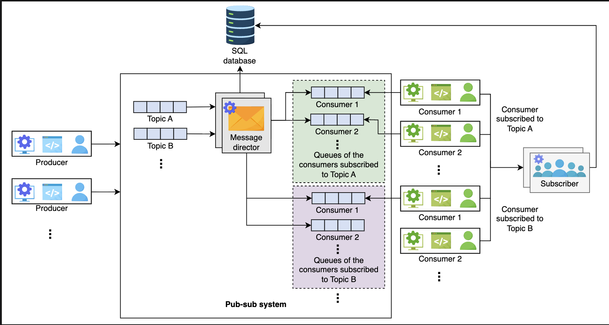
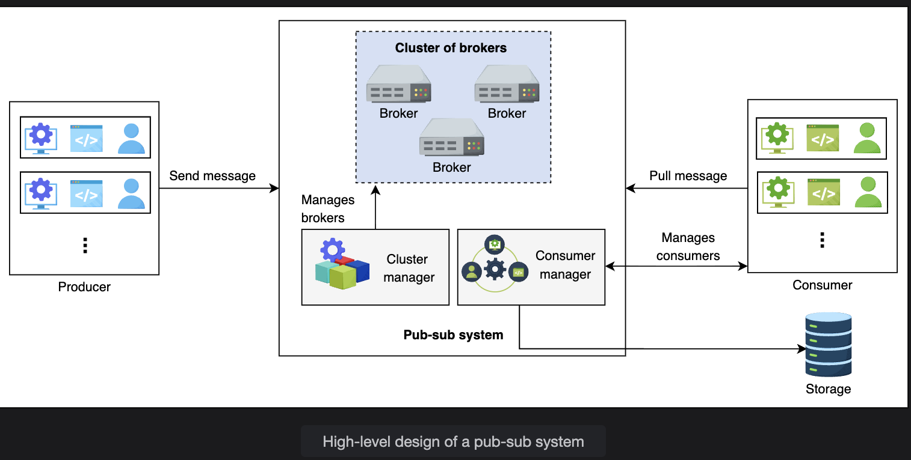
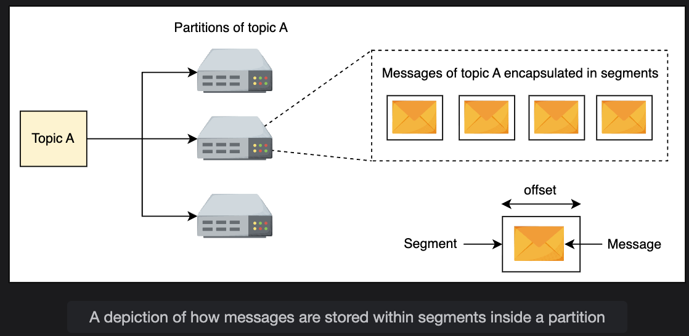
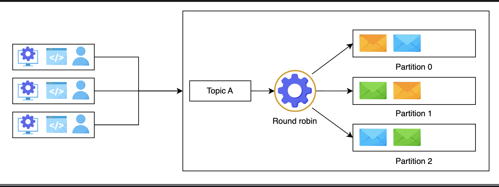
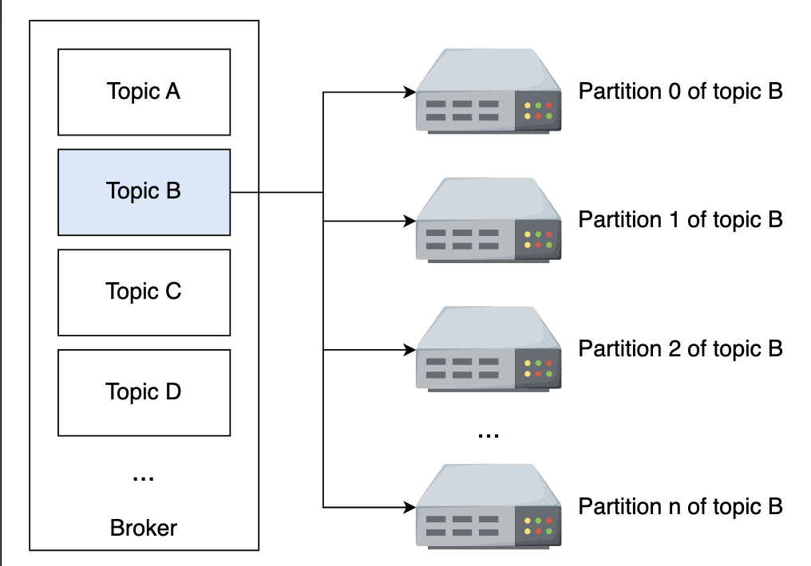
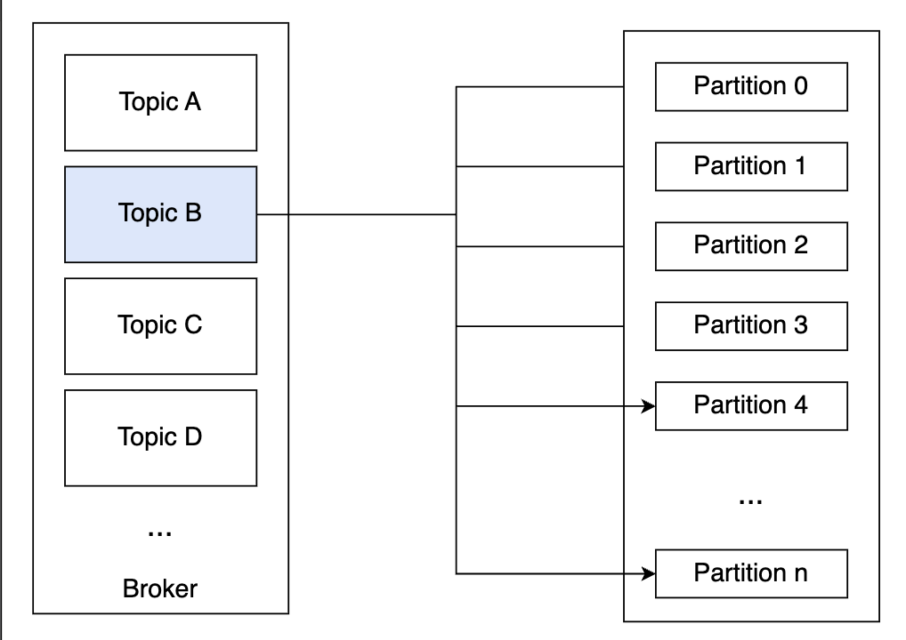
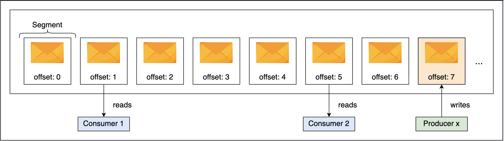
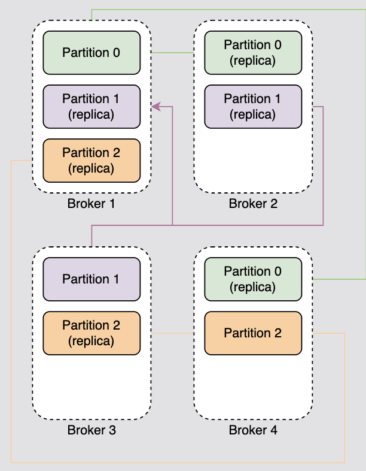
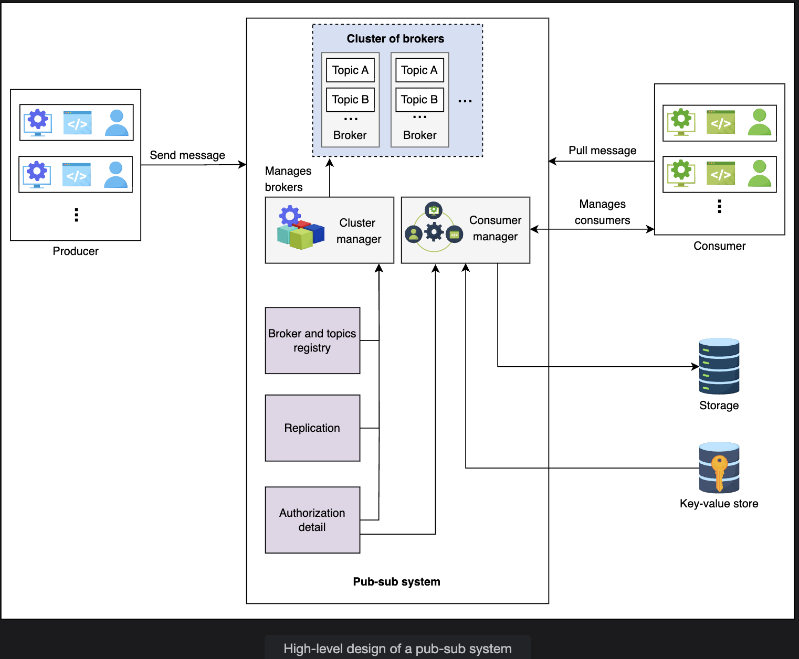

# Design of a Pub-Sub System

Dive into designing a pub-sub system and its components.

## Table of Contents

- [First Design](#first-design)
- [Problems with First Design](#problems-with-first-design)
- [Second Design](#second-design)
- [Broker](#broker)
- [Cluster Manager](#cluster-manager)
- [Consumer Manager](#consumer-manager)
- [Conclusion](#conclusion)

---

## First Design

In the previous lesson, we discussed that a producer writes into topics, and consumers subscribe to a topic to read messages from that topic. Since new messages are added at the end of the queue, we can use **distributed messaging queues** for topics.

### Components Needed

The components we'll need have been listed below:

#### 1. Topic Queue

Each topic will be a **distributed messaging queue** so we can store the messages sent to us from the producer. A producer will write their messages to that queue.

---

#### 2. Database

We'll use a **relational database** that will store the subscription details.

**Purpose:**
- Store which consumer has subscribed to which topic
- Provide consumers with their desired messages

**Why Relational Database:**
- Consumer-related data is structured
- Ensure data integrity

---

#### 3. Message Director

This service will:
- Read the message from the topic queue
- Fetch the consumers from the database
- Send the message to the consumer queue

---

#### 4. Consumer Queue

The message from the topic queue will be **copied to the consumer's queue** so the consumer can read the message.

**Important:** For each consumer, we'll define a **separate distributed queue**.

---

#### 5. Subscriber

When the consumer requests a subscription to a topic, this service will **add an entry into the database**.

---

### How First Design Works

**Process Flow:**

1. The consumer will **subscribe to a topic**, and the system will add the subscriber's details to the database

2. The producer will **write into the topics**

3. The message director will:
   - Read the message from the queue
   - Fetch the details to whom it should add the message
   - Send it to them

4. The consumers will **consume the message from their queue**

**Note:** We'll use **fail-over services** for the message director and subscriber to guard against failures.

---

### Architecture Diagram

```
┌──────────┐
│ Producer │
└────┬─────┘
     │ Write
     ▼
┌────────────┐
│Topic Queue │
└────┬───────┘
     │
     ▼
┌──────────────┐     ┌──────────┐
│   Message    │────→│ Database │
│   Director   │     └──────────┘
└──────┬───────┘     (Subscription
       │              details)
       ├─────────────┬─────────────┐
       │             │             │
       ▼             ▼             ▼
┌──────────┐  ┌──────────┐  ┌──────────┐
│Consumer  │  │Consumer  │  │Consumer  │
│Queue 1   │  │Queue 2   │  │Queue N   │
└────┬─────┘  └────┬─────┘  └────┬─────┘
     │             │             │
     ▼             ▼             ▼
┌──────────┐  ┌──────────┐  ┌──────────┐
│Consumer 1│  │Consumer 2│  │Consumer N│
└──────────┘  └──────────┘  └──────────┘
```

---

## Problems with First Design

Using the distributed messaging queues makes our design simple. However, the **huge number of queues needed** is a significant concern.

### The Scale Problem

**If we have:**
- Millions of subscribers
- Thousands of topics

**Then we need:**
- Millions of queues to define and maintain
- This is **expensive**

---

### The Duplication Problem

Moreover, we'll **copy the same message** for a topic in **all subscriber queues**, which is:
- Unnecessary duplication
- Takes up space

**Example:**
```
Topic A has 1 million subscribers
Message size: 1 KB
Total storage: 1 KB × 1 million = 1 GB per message!

1000 messages = 1 TB of duplicate data
```

---

### Question 1: Avoiding Separate Queues

**Question:** Is there a way to avoid maintaining a separate queue for each reader?

**Answer:**

In messaging queues, the message disappears after the reader consumes it. So, what if we **add a counter for each message**?

**Solution:**
- The counter value **decrements** as a subscriber consumes the message
- It does **not delete the message** until the counter becomes zero
- Now, we **don't need to keep a separate queue** for each reader

**How It Works:**
```
Message published to Topic A
Counter = 3 (3 subscribers)

Subscriber 1 reads → Counter = 2
Subscriber 2 reads → Counter = 1
Subscriber 3 reads → Counter = 0
Message deleted ✓
```

---

### Question 2: Problem with Counter Approach

**Question:** What is the problem with the previous approach?

**Answer:**

The **unread messages can become a bottleneck** if we use the conventional queue API.

**Problem Scenario:**

For example, if **9 out of 10 readers** have consumed the message present at the start of the queue, then:
- That message **won't be deleted** until the tenth consumer has also consumed the message
- The **first nine consumers won't be able to move forward**

**Visualization:**
```
Queue: [Msg1, Msg2, Msg3, Msg4]

Msg1 status:
  - 9 consumers read ✓
  - 1 consumer hasn't read ❌
  - Msg1 blocking queue

Consumers 1-9:
  - Want to read Msg2, Msg3, Msg4
  - Blocked by Msg1 ❌
```

---

**Solution:**

We'll need to **change the storage interface** so that consumers can **independently consume data**.

**Requirements:**
- Our system will need to keep **sufficient metadata**
- Track what information **each consumer has consumed**
- Delete a message when the information has been **consumed by all consumers**

**It resembles the reference count mechanism in Linux's hard link of files.**

**Improved Approach:**
```
Message with independent offsets:

Consumer 1: Offset 5 (read Msg1-5)
Consumer 2: Offset 8 (read Msg1-8)
Consumer 3: Offset 3 (read Msg1-3)

Each consumer independent ✓
No blocking ✓
```

---

## Second Design

Let's consider another approach to designing a pub-sub system.

### High-Level Design

At a high level, the pub-sub system will have the following components:

#### 1. Broker

This server will handle the messages. It will:
- Store the messages sent from the producer
- Allow the consumers to read them

---

#### 2. Cluster Manager

We'll have **numerous broker servers** to cater to our scalability needs.

**Purpose:**
- Supervise the broker's health
- Notify us if a broker fails

---

#### 3. Storage

We'll use a **relational database** to store consumer details, such as:
- Subscription information
- Retention period

---

#### 4. Consumer Manager

This is responsible for **managing the consumers**.

**Example:**
- Verify if the consumer is authorized to read a message from a certain topic or not

---

### Additional Design Considerations

Besides these components, we also have the following design considerations:

#### Acknowledgment

An **acknowledgment** is used to notify the producer that the received message has been stored successfully.

The system will **wait for an acknowledgment from the consumer** if it has successfully consumed the message.

**Flow:**
```
Producer → Message → Broker
              ↓
         ACK ← Broker (stored successfully)

Consumer ← Message ← Broker
              ↓
         ACK → Broker (consumed successfully)
```

---

#### Retention Time

The consumers can **specify the retention period** time of their messages.

**Default:** Seven days (but it is configurable)

**Why Configurable:**
- **Banking applications:** Require the data to be stored for a few weeks as a business requirement
- **Analytical applications:** Might not need the data after consumption

**Example:**
```
Banking app: Retention = 30 days
Analytics: Retention = 1 day
Logging: Retention = 7 days (default)
```

---

### High-Level Architecture

```
┌──────────┐
│ Producer │
└────┬─────┘
     │
     ▼
┌─────────────────────────────┐
│         Broker              │
│  ┌────────┬────────┬──────┐ │
│  │Topic A │Topic B │Topic│ │
│  │  P1 P2 │  P1 P2 │  C  │ │
│  └────────┴────────┴──────┘ │
└─────────────┬───────────────┘
              │
       ┌──────┴──────┐
       │             │
┌──────▼──────┐ ┌───▼──────────┐
│   Cluster   │ │   Consumer   │
│   Manager   │ │   Manager    │
└─────────────┘ └───┬──────────┘
       │            │
       │    ┌───────┴────────┐
       │    │                │
       ▼    ▼                ▼
   ┌────────────┐      ┌──────────┐
   │  Storage   │      │Consumer 1│
   │ (Database) │      └──────────┘
   └────────────┘      ┌──────────┐
                       │Consumer 2│
                       └──────────┘
```

---

## Broker

The broker server is the **core component** of our pub-sub system. It will handle **write and read requests**.

### Broker Structure

A broker will have:
- **Multiple topics**
- Each topic can have **multiple partitions** associated with it

---

### Why Partitions?

We use partitions to:
- Store messages in the local storage for **persistence**
- Improve **availability**

**Partitions contain messages encapsulated in segments.**

---

### Segments and Offsets

**Segments** help identify the start and end of a message using an **offset address**.

**How Consumers Use Segments:**

Using segments, consumers consume the message of their choice from a partition by **reading from a specific offset address**.

**Structure:**
```
Topic A
  ↓
Partition 1
  ↓
┌─────────────────────────────┐
│ Segment 1                   │
│ Offset 0: Message 1         │
│ Offset 1: Message 2         │
│ Offset 2: Message 3         │
├─────────────────────────────┤
│ Segment 2                   │
│ Offset 3: Message 4         │
│ Offset 4: Message 5         │
└─────────────────────────────┘

Consumer reads from Offset 2 → Gets Message 3
```

---

### Topic Characteristics

As we know, a **topic is a persistent sequence of messages** stored in the local storage of the broker.

**Important:** Once the data has been added to the topic, it **cannot be modified**.

---

### Scaling Challenge

**Reading and writing a message** from or to a topic is an **I/O task** for computers, and **scaling such tasks is challenging**.

**This is the reason we split the topics into multiple partitions.**

The data belonging to a single topic can be present in **numerous partitions**.

---

### Example: Topic Partitioning

**Scenario:**

Let's assume we have **Topic A** and we allocate **three partitions** for it.

**Process:**

1. The producers will send their messages to the relevant topic

2. The messages received will be sent to various partitions on the basis of the **round-robin algorithm**

**Note:** We'll use a variation of round-robin: **weighted round-robin**.

**Message Distribution:**
```
Producer sends 9 messages to Topic A

Topic A (3 partitions):

Partition 0: Msg1, Msg4, Msg7
Partition 1: Msg2, Msg5, Msg8
Partition 2: Msg3, Msg6, Msg9

Round-robin distribution ✓
Load balanced ✓
```

---

### Question 3: Ensuring Strict Ordering

**Question:** Strict ordering ensures that the messages are stored in the order in which they are produced. How can we ensure strict ordering for our messages?

**Answer:**

We'll assign each partition a **unique ID**, `partition_ID`.

**Solution:**

The user can provide the `partition_ID` while writing into the system. In this way:
- The messages will be sent to the **specified partition**
- The ordering will be **strict**

**Our API call to write into the pub-sub system looks like this:**

```
write(topic_ID, partition_ID, message)
```

**If the user does not provide the `partition_ID`**, we'll use the **weighted round-robin algorithm** to decide which message has to be sent to which partition.

---

**Design Rationale:**

It might seem strange to give the ability to choose a partition to the client of pub-sub. However, such a facility can be the basis from where **clients can get data for some specific time period**—for example, getting data from yesterday.

For simplicity, we won't include time-based reading in our design.


---

### Question 4: All Partitions on Same Broker

**Question:** What problems can arise if all partitions are on the same broker?

**Answer:**

If the broker **fails or dies**, all the messages in the partitions will be **lost**.

**To avoid this**, we need to make sure that the **partitions are spread on different brokers**.

**Bad Design:**
```
Broker 1 (Single Point of Failure):
  - Partition 1
  - Partition 2
  - Partition 3

If Broker 1 fails:
  All 3 partitions lost ❌
```

**Good Design:**
```
Broker 1: Partition 1
Broker 2: Partition 2
Broker 3: Partition 3

If Broker 1 fails:
  Only Partition 1 affected
  Partitions 2 and 3 still available ✓
```

---

### Question 5: Why Not Use Blob Stores?

**Question:** Why can't we use blob stores like S3 to keep messages, instead of the broker's local storage?

**Answer:**

**Blob stores like S3 are not optimized** for writing and reading **short-sized data**.

**If our data is geo-replicated**, the above problem is **exacerbated**.

---

**Why Local Storage Is Better:**

Therefore, we used the server's **local persistent store** with **append-based writing**.

**Advantages:**
- **Traditional hard disks** are specially tuned to provide good write performance with writing to **contiguous tracks or sectors**
- **Reading throughput and latency** is also good for contiguous regions of the disk because it allows extensive **data caching**

**Performance Comparison:**
```
Blob Store (S3):
  Small writes (1 KB): 50-100ms
  Not optimized ❌

Local Storage (Append-only):
  Small writes (1 KB): 1-5ms
  Optimized for sequential writes ✓
```

---

### Question 6: Finding Messages with Round-Robin

**Question:** If we use a round-robin algorithm to send messages to a partition, how does the system know where to look when it is time to read?

**Answer:**

Our system will need to **keep appropriate metadata persistently**.

**Metadata Tracking:**

This metadata will keep **mappings** between:
- The logical index of segment or messages
- The server identity or partition identifier

**Example Metadata:**
```
Message Metadata:
  Message ID: msg-12345
  Topic: topic-A
  Partition: partition-2
  Offset: 42
  Broker: broker-3

When reading msg-12345:
  1. Check metadata
  2. Find: broker-3, partition-2, offset-42
  3. Read from that location
```

---

### Partition Distribution Across Brokers

We'll **allocate the partitions to various brokers** in the system.

**This just means** that different partitions of the same topic will be in **different brokers**.

We'll follow **strict ordering in partitions** by adding newer content at the end of existing messages.

---

**Architecture Example:**
```
┌────────────────┐  ┌────────────────┐  ┌────────────────┐
│   Broker 1     │  │   Broker 2     │  │   Broker 3     │
│                │  │                │  │                │
│ Topic A - P1   │  │ Topic A - P2   │  │ Topic A - P3   │
│ Topic B - P1   │  │ Topic B - P2   │  │ Topic C - P1   │
└────────────────┘  └────────────────┘  └────────────────┘

Different partitions of same topic
Distributed across brokers ✓
```


---

### Segment Detail

We discussed that a message will be **stored in a segment**. We'll identify each segment using an **offset**.

**Important:** Since these are **immutable records**, the readers are **independent** and they can read messages anywhere from this file using the necessary API functions.

**Segment Structure:**
```
Partition 1:
┌──────────────────────┐
│ Segment 0            │
│ Offset 0-999         │
│ Messages 1-1000      │
├──────────────────────┤
│ Segment 1            │
│ Offset 1000-1999     │
│ Messages 1001-2000   │
├──────────────────────┤
│ Segment 2 (Active)   │
│ Offset 2000-2500     │
│ Messages 2001-2501   │
└──────────────────────┘

Consumer can read from any offset
Independent reading ✓
```


---

### Question 7: Order Across Multiple Topics

**Question:** How would you design a pub-sub system to ensure consumers receive messages in the correct order, even when subscribing to multiple topics or partitions, assuming messages have different timestamps?

**Answer:**

**Challenges:**
- Messages from different topics/partitions have different timestamps
- Need to maintain global ordering

**Solution Approaches:**

**1. Consumer-Side Merge:**
```
Consumer subscribes to:
  - Topic A (receives messages)
  - Topic B (receives messages)

Consumer logic:
  1. Buffer messages from both topics
  2. Sort by timestamp
  3. Process in timestamp order
```

**2. Coordinator Service:**
```
Coordinator:
  1. Receives messages from multiple topics
  2. Sorts by timestamp globally
  3. Delivers in correct order to consumer
```

**3. Partition-Level Ordering with Metadata:**
```
Each message tagged with:
  - Global timestamp
  - Sequence number

Consumer:
  - Reads from multiple partitions
  - Maintains priority queue
  - Processes oldest message first
```

---

## Cluster Manager

We'll have **multiple brokers** in our cluster. The cluster manager will perform the following tasks:

### 1. Broker and Topics Registry

This stores the **list of topics for each broker**.

**Registry Example:**
```
Broker Registry:
  Broker 1:
    - Topic A (Partition 1, 4)
    - Topic B (Partition 2)
  
  Broker 2:
    - Topic A (Partition 2, 5)
    - Topic C (Partition 1)
  
  Broker 3:
    - Topic A (Partition 3, 6)
    - Topic B (Partition 1, 3)
```

---

### 2. Manage Replication

The cluster manager manages replication by using the **leader-follower approach**.

**How It Works:**

**Leader Selection:**
- One of the brokers is the **leader**
- If it fails, the manager decides who the **next leader is**

**Follower Management:**
- In case the follower fails, it **adds a new broker**
- Makes sure to turn it into an **updated follower**
- Updates the **metadata accordingly**

**Replication Strategy:**

We'll keep **three replicas** of each partition on **different brokers**.

**Example:**
```
Partition 1 of Topic A:
  Leader: Broker 1
  Follower 1: Broker 2
  Follower 2: Broker 3

If Broker 1 fails:
  Cluster Manager:
    - Detects failure
    - Promotes Broker 2 to leader
    - Adds new follower (Broker 4)
    - Updates metadata
```

---

### 3. Authorization

The cluster manager handles **authorization** for:
- Broker access
- Topic access
- Controlling message replication across clusters

**Authorization Example:**
```
User X:
  - Can write to Topic A ✓
  - Can read from Topic B ✓
  - Cannot access Topic C ❌

Cluster Manager enforces these rules
```

---

## Consumer Manager

The consumer manager will **manage the consumers**. It has the following responsibilities:

### 1. Verify the Consumer

The manager will:
- Fetch the data from the database
- Verify if the consumer is **allowed to read** a certain message

**Example:**

If the consumer has subscribed to **Topic A** (but not to **Topic B**), then it should **not be allowed** to read from Topic B. The consumer manager verifies the consumer's request.

**Verification Process:**
```
Consumer 1 requests message from Topic B
  ↓
Consumer Manager checks database
  ↓
Consumer 1 subscribed to: Topic A, Topic C
  ↓
Topic B not in subscription list
  ↓
Request denied ❌
```

---

### 2. Retention Time Management

The manager will also verify if the consumer is **allowed to read the specific message** or not.

**Rule:**

If, according to its **retention time**, the message should be inaccessible to the consumer, then it will **not allow** the consumer to read the message.

**Example:**
```
Message published: Jan 1, 2026
Retention time: 7 days
Current date: Jan 10, 2026

Message age: 9 days
Retention expired ✓
Consumer cannot read ❌
```

---

### 3. Message Receiving Options Management

There are **two methods** for consumers to get data:

#### Method 1: Push

Our system **pushes the data** to its consumers.

**Drawback:** This method may result in **overloading the consumers** with continuous messages.

---

#### Method 2: Pull

Consumers **request the system** to read data from a specific topic.

**Drawback:** A few consumers might want to know about a message as soon as it is published, but we do not support this function.

---

**Solution: Support Both**

Therefore, we'll **support both techniques**.

**How It Works:**

Each consumer will **inform the broker** that it:
- Wants the data to be **pushed automatically**, OR
- Needs the data to **read itself**

**Benefits:**
- We can **avoid overloading** the consumer
- Also provide **liberty** to the consumer

**Storage:**

We'll save this information in the **relational database** along with other consumer details.

**Example Configuration:**
```
Consumer 1:
  Mode: PUSH
  Topic: A, B
  
Consumer 2:
  Mode: PULL
  Topic: C
  
Consumer 3:
  Mode: PUSH
  Topic: A
```

---

### 4. Allow Multiple Reads

The consumer manager stores the **offset information** of each consumer.

**Storage:**

We'll use a **key-value store** to store offset information against each consumer.

**Benefits:**
- Allows **fast fetching**
- Increases the **availability** of the consumers

**How It Works:**

If **Consumer 1** has read from **offset 0** and has sent the acknowledgment, we'll **store it**.

So, when the consumer wants to read again, we can **provide the next offset** to the reader for reading the message.

**Example:**
```
Consumer Offset Store:

Consumer 1:
  Topic A, Partition 1: Offset 42
  Topic B, Partition 2: Offset 15

Consumer 2:
  Topic A, Partition 1: Offset 38
  Topic C, Partition 1: Offset 100

Consumer 1 reads next:
  Get offset 42 + 1 = 43
  Read message at offset 43
  Update offset to 43
```

---

## Conclusion

We saw **two designs** of pub-sub:

### Design 1: Using Queues
- Simple approach
- Used distributed messaging queues
- Problem: Too many queues needed
- Problem: Message duplication

---

### Design 2: Custom Storage
- Used our custom storage
- Optimized for writing and reading small-sized data
- Partitions for scalability
- Segments with offsets for independent reads
- Better for large scale

---

### Why Pub-Sub Is Valuable

There are **numerous use cases** of a pub-sub.

**Key Benefits:**

**Decoupling:**
Due to decoupling between producers and consumers:
- The system can **scale dynamically**
- The **failures are well-contained**

**Proper Accounting:**
Additionally, due to proper accounting of data consumption:
- The pub-sub is a **system of choice** for a large-scale system that produces enormous data
- We can determine precisely **which data is needed and not needed**


---

### Summary Table

| Design | Approach | Pros | Cons |
|--------|----------|------|------|
| **First Design** | Message queues | Simple | Too many queues, duplication |
| **Second Design** | Custom storage with partitions | Scalable, efficient | More complex |

---

### Key Components Summary

| Component | Purpose | Key Features |
|-----------|---------|--------------|
| **Broker** | Handle messages | Topics, partitions, segments, offsets |
| **Cluster Manager** | Manage brokers | Registry, replication, authorization |
| **Consumer Manager** | Manage consumers | Verification, retention, push/pull, offsets |
| **Storage** | Store metadata | Subscriptions, retention periods |

---

*Document: Design of a Pub-Sub System | Two Design Approaches and Complete Architecture*