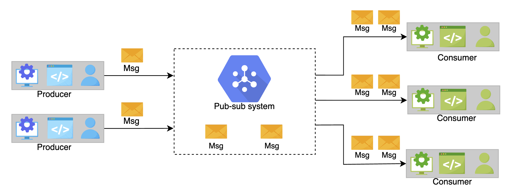

# System Design: The Pub-Sub Abstraction

Get introduced to the basics of designing a pub-sub system.

## Table of Contents

- [What is a Pub-Sub System?](#what-is-a-pub-sub-system)
- [Motivation](#motivation)
- [Summary](#summary)

---

## What is a Pub-Sub System?

**Publish-subscribe messaging**, often known as **pub-sub messaging**, is an asynchronous service-to-service communication method that's popular in serverless and microservices architectures.

### How It Works

Messages can be sent **asynchronously** to different subsystems of a system using the pub-sub system.

**Key Characteristic:**

All the services subscribed to the pub-sub model **receive the message** that's pushed into the system.

---

### Real-World Example

For example, when a famous athlete posts on Instagram or shares a tweet, all of their followers are updated.

**Breaking Down the Example:**

**Components:**
- **Publisher**: The athlete
- **Message**: Their post or tweet
- **Subscribers**: All of their followers

**Process:**
```
Famous Athlete (Publisher)
    ↓
Posts on Instagram (Message)
    ↓
All Followers (Subscribers) receive the update
```

**Characteristics:**
- Athlete doesn't need to know who their followers are
- All followers automatically receive the update
- Followers can subscribe or unsubscribe anytime
- One message reaches many recipients

---

### Visual Representation

```
The Pub-Sub System:

                    ┌──────────────┐
                    │  Publisher   │
                    │   (Athlete)  │
                    └──────┬───────┘
                           │
                    Publishes message
                           │
                           ▼
                  ┌────────────────┐
                  │   Pub-Sub      │
                  │   System       │
                  │   (Topic)      │
                  └────────┬───────┘
                           │
              ┌────────────┼────────────┐
              │            │            │
         Delivers to all subscribers
              │            │            │
        ┌─────▼────┐ ┌────▼─────┐ ┌───▼──────┐
        │Subscriber│ │Subscriber│ │Subscriber│
        │    1     │ │    2     │ │    3     │
        │(Follower)│ │(Follower)│ │(Follower)│
        └──────────┘ └──────────┘ └──────────┘
```

---

## Motivation

The hardware infrastructure of distributed systems consists of **millions of machines**.

### Why Use Pub-Sub?

Using a pub-sub system to communicate asynchronously **increases scalability**.

---

### Key Benefits

#### 1. Decoupling of Components

**Producers and consumers are disconnected and operate independently**, thereby allowing us to:
- Scale them separately
- Develop them separately

**Example:**
```
Producer (Publisher):
  - Doesn't know how many subscribers exist
  - Doesn't know who the subscribers are
  - Continues publishing regardless

Consumer (Subscriber):
  - Doesn't know who published
  - Doesn't know how many other subscribers exist
  - Can subscribe/unsubscribe independently
```

---

#### 2. Greater Scalability

The **decoupling between components**, producers and consumers, allows greater scalability because **adding or removing any component doesn't affect the other components**.

**Scalability in Action:**
```
Initial State:
  1 Publisher
  100 Subscribers
  
Add Subscribers:
  1 Publisher (unchanged)
  1,000 Subscribers
  
Publisher impact: None
Publisher code: No changes needed
System continues operating ✓
```

**Add Publishers:**
```
Initial State:
  5 Publishers
  100 Subscribers
  
Add Publishers:
  50 Publishers
  100 Subscribers (unchanged)
  
Subscriber impact: None
Subscriber code: No changes needed
System continues operating ✓
```

---

### Advantages of Asynchronous Communication

**Asynchronous Nature:**

**Publisher:**
- Publishes message
- Continues immediately (doesn't wait)
- No blocking

**Subscriber:**
- Receives message when ready
- Processes at own pace
- No time pressure

**Comparison:**
```
Synchronous (Traditional):
  Publisher → Waits for all subscribers to respond
  Latency: Sum of all subscriber processing times
  Blocking: Yes ❌

Asynchronous (Pub-Sub):
  Publisher → Publishes and continues
  Latency: Minimal (just publish time)
  Blocking: No ✅
```

---

### Why This Matters for Distributed Systems

**Scale:**
- Millions of machines
- Thousands of services
- Billions of messages

**Requirements:**
- ✅ Services must operate independently
- ✅ Adding components shouldn't require system-wide changes
- ✅ Failures in one component shouldn't cascade
- ✅ System must handle high volume efficiently

**Pub-Sub Solution:**
- Independent scaling of producers and consumers
- No direct dependencies between components
- Asynchronous communication prevents cascading failures
- Horizontal scaling of all components

---

## Summary

### What is Pub-Sub?

**Definition:**
Publish-subscribe messaging is an asynchronous service-to-service communication method popular in:
- Serverless architectures
- Microservices architectures

---

### Core Concepts

**Three Main Components:**

1. **Publisher**
   - Sends messages
   - Doesn't know subscribers
   - Publishes to topic/channel

2. **Message**
   - Data being communicated
   - Sent asynchronously
   - Delivered to all subscribers

3. **Subscriber**
   - Receives messages
   - Doesn't know publisher
   - Subscribes to topic/channel

---

### Key Characteristics

**Asynchronous:**
- Non-blocking communication
- Publishers continue immediately
- Subscribers process when ready

**Decoupled:**
- Publishers and subscribers independent
- No direct connections
- Scale separately

**One-to-Many:**
- One message reaches multiple subscribers
- All subscribers get same message
- Broadcast communication pattern

---

### Main Motivation

**Scalability:**
- Handle millions of machines
- Independent component scaling
- Easy to add/remove components
- No system-wide impact from changes

**Flexibility:**
- Develop components separately
- Deploy components independently
- Update without downtime

**Reliability:**
- No cascading failures
- Component failures isolated
- System continues operating

---

### Real-World Analogy

```
Social Media Example:

Celebrity (Publisher)
    Posts update (Message)
        ↓
All Followers (Subscribers) notified

Characteristics:
- Celebrity doesn't track individual followers
- Followers join/leave independently
- One post reaches millions
- Asynchronous delivery
```

---

## How do we design a pub-sub system?
We have divided the pub-sub system design into the following lessons:

- 1.**Introduction**: In this lesson, we learn about the use cases of the pub-sub system, define its requirements, and design the API for it.

- 2.**Design**: In this lesson, we discuss two designs of the pub-sub system, one with messaging queues and the other with a broker.