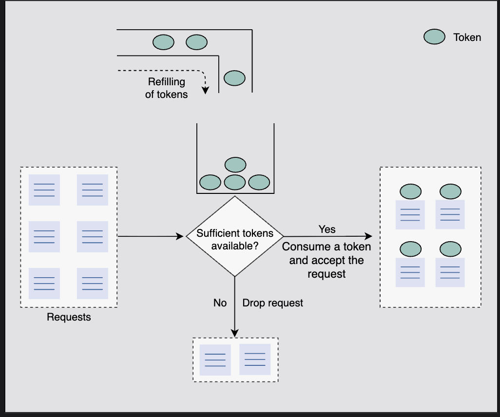
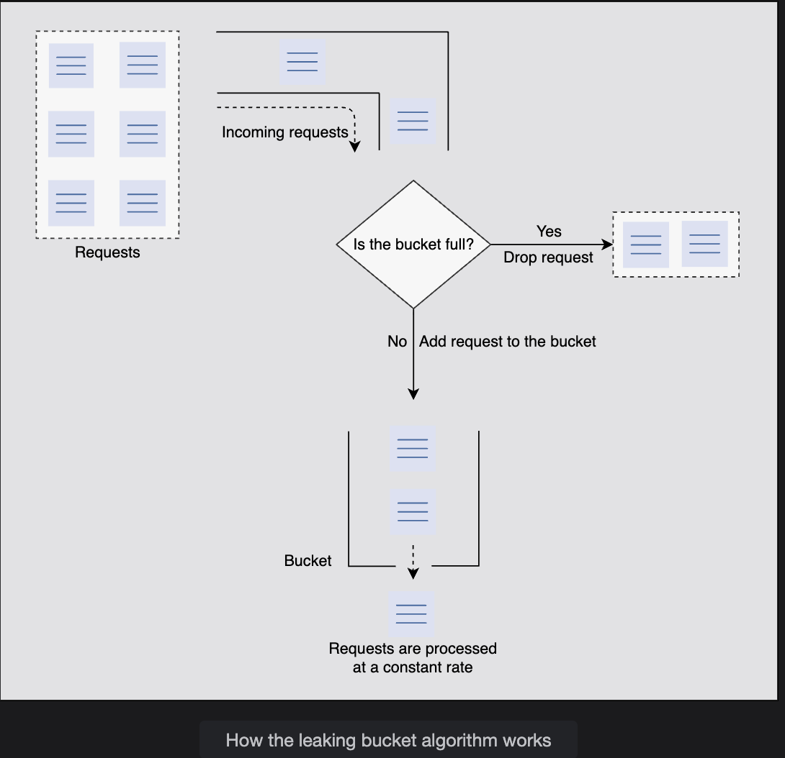
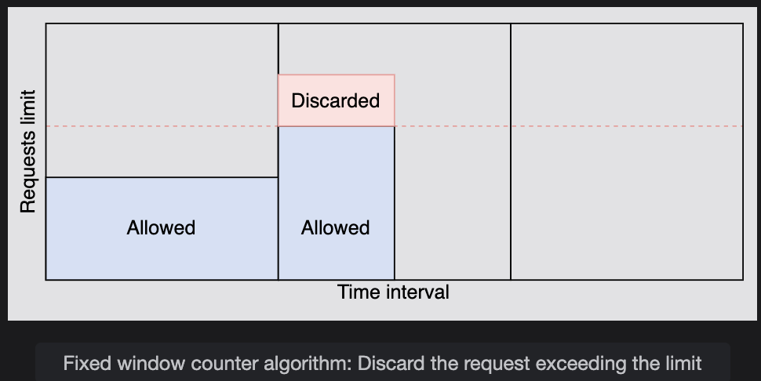
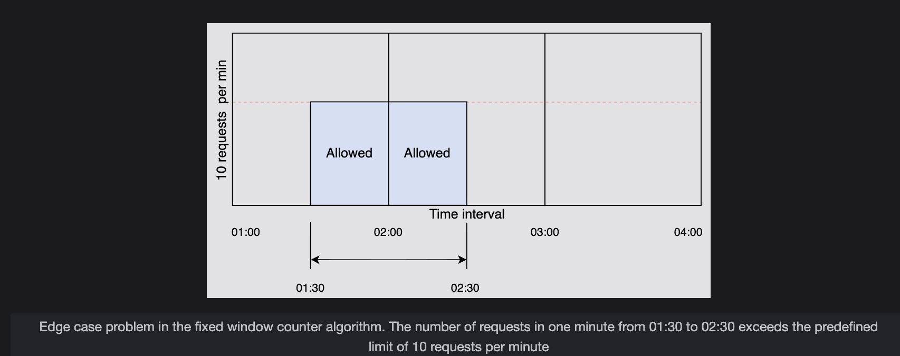
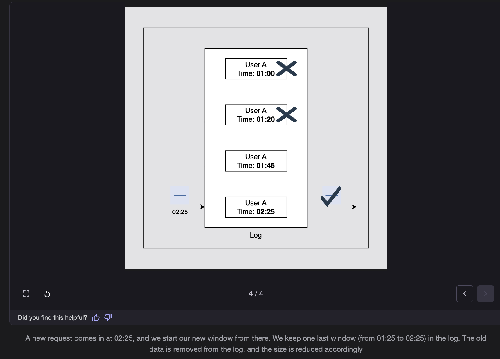
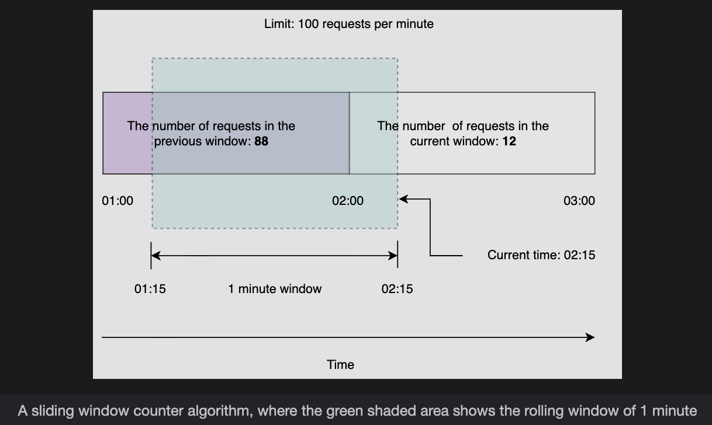

# Rate Limiter Algorithms

> A comprehensive guide to understanding rate limiting algorithms — with intuition, parameters, examples, and comparisons.

---

## Table of Contents

1. [Token Bucket Algorithm](#1-token-bucket-algorithm)
2. [Leaking Bucket Algorithm](#2-leaking-bucket-algorithm)
3. [Fixed Window Counter Algorithm](#3-fixed-window-counter-algorithm)
4. [Sliding Window Log Algorithm](#4-sliding-window-log-algorithm)
5. [Sliding Window Counter Algorithm](#5-sliding-window-counter-algorithm)
6. [Comparison Table](#6-comparison-table)

---

## 1. Token Bucket Algorithm

### Core Intuition

Imagine a **bucket** that holds tokens:
- Every incoming request must take **1 token** to be processed.
- If no token is available → **request is rejected**.
- Tokens are **refilled at a constant rate** over time.
- The bucket has a **maximum capacity** — extra tokens overflow and are discarded.

This creates a system with a **controlled average rate** and **short burst allowance**.

---

### How It Works

Given:
- Rate limit **R** (tokens per second)
- Bucket capacity **C** (max tokens)

**Flow:**
1. A new token is added to the bucket every `1/R` seconds.
2. If the bucket is full (tokens = C), new tokens are **discarded**.
3. If N requests arrive and bucket has ≥ N tokens → **all N are accepted**, tokens consumed.
4. If N requests arrive and bucket has < N tokens → only **available tokens' worth** of requests are accepted.

---

### Essential Parameters

| Parameter | Symbol | Description |
|---|---|---|
| Bucket Capacity | C | Max number of tokens the bucket can hold. Controls max burst size. |
| Rate Limit | R | Number of requests allowed per unit time (tokens/sec). |
| Refill Rate | 1/R | Duration after which one token is added (seconds/token). |
| Request Count | N | Number of incoming requests to compare against available tokens. |

---

### Step-by-Step Example

**Setup:**
```
R = 2 tokens/second
C = 5 tokens (max capacity)
Refill: 1 token every 0.5 seconds
```

| Time | Event | Tokens Before | Tokens After |
|------|-------|--------------|-------------|
| t=0 | Bucket starts full | — | 5 |
| t=0 | 4 requests arrive | 5 | 1 (4 accepted) |
| t=0 | 3 more requests arrive | 1 | 0 (1 accepted, 2 rejected) |
| t=1s | Refill (+2 tokens) | 0 | 2 |
| t=1s | 2 requests arrive | 2 | 0 (2 accepted) |

---

### Mathematical Formula

The maximum number of requests allowed over a time interval `t` is:

```
Max Requests = R × t + C
```

**Why?**
- `R × t` → tokens generated during the interval
- `C` → tokens already stored in the bucket (burst capacity)

**Example:**
```
R = 5 tokens/sec, C = 10, t = 3 seconds

Max = 5 × 3 + 10 = 15 + 10 = 25 requests
```

This means: in 3 seconds, you could use 10 pre-stored tokens instantly, plus 15 new tokens generated over time — totaling 25.

> ⚠️ This is NOT 25 requests all at once. You can use 10 instantly (burst), and the remaining 15 are spread across 3 seconds.

---

### Why It Allows Bursts

If there's **no traffic for a while**, unused capacity accumulates in the bucket (up to `C`). When a sudden spike arrives, all those stored tokens can be consumed at once — allowing a **legal burst**.

```
R = 2/sec, C = 5

[No requests for 3 seconds] → bucket fills to max = 5

[5 requests arrive at once] → all 5 accepted instantly ✅
```

---

### Real Implementation Logic (Lazy Refill)

In real systems, tokens are **not added by a timer every 1/R seconds**. Instead, they are computed lazily on each incoming request:

```python
currentTime = now()
elapsed = currentTime - lastRefillTime
tokensToAdd = elapsed * R

bucket = min(C, bucket + tokensToAdd)
lastRefillTime = currentTime

if bucket >= 1:
    bucket -= 1
    allow_request()
else:
    reject_request()
```

This avoids timers and works efficiently in distributed systems.

---

### Edge Case: Boundary Overrun


### Edge Case: Boundary Overrun

---

> ❓ **Q: Apart from permitting bursts, can the token bucket algorithm surpass the limit at the edges?**

**A: Yes.** The token bucket algorithm can sometimes overrun the defined rate limit at the edges. Here's a concrete example:

**Setup:**
```
C = 3 tokens (bucket capacity)
R = 3 requests/minute (rate limit)
Refill rate = 1 token every 0.33 minutes
```

**Timeline:**

| Time | Event | Tokens | Notes |
|------|-------|--------|-------|
| t=0.00 min | Start | 0 | Bucket empty |
| t=1.00 min | 3 tokens accumulated | 3 | Bucket full |
| t=1.00 min | Burst of 3 requests arrives | 0 | All 3 consumed ✅ |
| t=1.33 min | 1 token refilled | 1 | Per refill rate of 0.33 min |
| t=1.33 min | 1 new request arrives | 0 | Consumed ✅ |

**The Problem:**

Now look at the window from **t=0.66 to t=1.33 minutes** (a duration of 0.67 min — less than 1 full minute):

```
Requests served in this window:
  - 3 requests at t=1.00
  - 1 request  at t=1.33
  ─────────────────────
  Total = 4 requests in < 1 minute
```

But the rate limit is **3 requests per minute** — yet **4 requests passed** in a sub-minute window. This is the edge overrun. It happens because token bucket tracks stored capacity over time, not a strict rolling window count.

---

### Advantages

- ✅ Allows controlled **burst traffic**
- ✅ **Space efficient** — only stores current token count + last refill timestamp (O(1) memory)
- ✅ Simple to implement
- ✅ Works well for APIs, payment systems, login endpoints

### Disadvantages

- ❌ Choosing optimal values for `C` and `R` is difficult
- ❌ Can slightly overrun limits at edges (as shown above)
- ❌ Setting `C` too large allows massive DB spikes; too small causes unnecessary throttling


---

---

## 2. Leaking Bucket Algorithm

### Core Intuition

Imagine a **bucket with a hole at the bottom**:
- Requests **pour in** at a variable rate (like rain).
- They **drip out** at a perfectly constant rate.
- If the bucket overflows (too many requests) → excess requests are **discarded**.

Unlike the token bucket, this algorithm **guarantees a constant output rate** — no bursts allowed on the outbound side.

---

### How It Works

- Incoming requests are added to the **queue (bucket)**.
- Requests are **processed at a fixed rate** `Rout` in **FIFO order**.
- If the bucket is full (size = C), new requests are **discarded**.

---

### Essential Parameters

| Parameter | Symbol | Description |
|---|---|---|
| Bucket Capacity | C | Max number of requests the queue can hold. |
| Inflow Rate | R_in | Variable rate at which requests arrive. |
| Outflow Rate | R_out | Fixed rate at which requests are processed. |

---

### Step-by-Step Example

**Setup:**
```
C = 5 (queue can hold 5 requests)
R_out = 2 requests/second (processes 2 per second)
```

| Time | Incoming | Queue Before | Queue After | Processed | Dropped |
|------|----------|-------------|-------------|-----------|---------|
| t=0s | 4 requests | 0 | 4 | 0 | 0 |
| t=1s | 3 requests | 2 | 5 | 2 | 0 |
| t=2s | 4 requests | 3 | 5 | 2 | 2 |
| t=3s | 0 requests | 3 | 1 | 2 | 0 |

At t=2s: queue had 3, 4 more arrived = 7 needed, but cap is 5 → 2 dropped.

---

### Advantages

- ✅ **No burst traffic** on the output — perfectly smooth
- ✅ Space efficient (3 states: R_in, R_out, C)
- ✅ Ideal for applications requiring a **stable, predictable outflow**

### Disadvantages

- ❌ A sudden burst can fill the queue, causing **recent requests to be dropped**
- ❌ The **constant rate can underutilize** the system during low-traffic periods
- ❌ Choosing optimal bucket size and outflow rate is challenging


---

> ❓ **Q: If the leaking bucket ensures a constant outflow, why not always prefer it over the token bucket for predictable systems?**

**A:** While the constant outflow of the leaking bucket sounds ideal, it comes with real trade-offs that make it a poor fit for many systems:

**1. Bursts are a feature, not just a problem**

Most real-world systems — APIs, web apps, microservices — experience **natural short bursts** of traffic. A user logging in, a batch job triggering, a retry storm. Token bucket handles these gracefully by absorbing them within the burst capacity `C`. Leaking bucket **drops those requests** instead, even if the system is perfectly capable of handling them.

**2. Resource underutilization**

If traffic is low, leaking bucket still processes at `R_out` — it can never "catch up" or serve more when the system has spare capacity. Token bucket, by contrast, accumulates tokens during idle time and can serve a burst when it arrives — making better use of available resources.

**3. Dropped recent requests feel worse to users**

When the leaking bucket queue fills up, it's the **newest, most recent requests** that get dropped (overflow). This is often counterintuitive — users just sending a request get silently rejected while older queued requests are still being processed.

**4. Latency introduced by the queue**

Since requests sit in the queue and are processed at a fixed rate, early requests in a burst get served quickly but later ones experience **artificial queuing delay** — even if the system could process them faster.

**In short:** Use leaking bucket when you need strict, smooth output (e.g., sending data to a downstream system at a fixed rate). Prefer token bucket when your system can handle short spikes and you want to maximize throughput without unnecessary rejections.

---

---


---

---

## 3. Fixed Window Counter Algorithm

### Core Intuition

Divide time into **fixed intervals (windows)** — e.g., every minute. Count requests per window. If the count exceeds the limit, reject requests until the next window begins.

---

### How It Works

1. Time is split into fixed windows (e.g., 60 seconds each).
2. Each window has a **counter starting at 0**.
3. Every incoming request increments the counter.
4. If counter > R (rate limit) → request is **rejected**.
5. At the start of each new window, counter **resets to 0**.

---

### Essential Parameters

| Parameter | Symbol | Description |
|---|---|---|
| Window Size | W | Duration of each time window (e.g., 1 minute). |
| Rate Limit | R | Max requests allowed per window. |
| Request Count | N | Incoming requests this window. Allow if N ≤ R. |

---

### Step-by-Step Example

**Setup:**
```
R = 10 requests per minute
Window = 60 seconds
```

```
Window 1 (00:00 - 01:00): 7 requests → all allowed ✅
Window 2 (01:00 - 02:00): 10 requests → all allowed ✅
Window 2 continued: 3 more requests → all rejected ❌
Window 3 (02:00 - 03:00): counter resets → 10 new requests allowed ✅
```

---

### The Edge Problem (Critical!)

```
Limit: 10 requests/minute

  Window 1 (00:00–01:00)   |   Window 2 (01:00–02:00)
  ...9 requests at 00:59   |   10 requests at 01:01

Between 00:59 and 01:01 (just 2 seconds) → 19 requests passed!
```

A **burst at the boundary** of two windows can effectively double the allowed rate in a short time.

---

### Advantages

- ✅ Space efficient — just a counter per window
- ✅ Simple to implement
- ✅ Services new requests at the start of each window (unlike token bucket which rejects if no tokens)

### Disadvantages

- ❌ **Boundary burst problem** — up to 2× the rate limit can slip through at window edges



---

---

## 4. Sliding Window Log Algorithm

### Core Intuition

Instead of resetting a counter at fixed intervals, **track the exact timestamp of every request**. The "window" slides with time — always looking at the last N seconds/minutes. This eliminates the boundary problem of fixed windows.

---

### How It Works

1. When a request arrives, its **timestamp is stored in a log** (e.g., a sorted list or hash map).
2. **Old timestamps** outside the current time range are removed.
3. Count the remaining logs — if count < rate limit → **allow** the request; otherwise **reject**.
4. Even rejected requests' timestamps are stored (to track traffic accurately).

---

### Essential Parameters

| Parameter | Symbol | Description |
|---|---|---|
| Log Size | L | Max number of timestamps allowed (equivalent to rate limit). |
| Arrival Time | T | Timestamp of each incoming request. |
| Time Range | T_r | The sliding window duration (e.g., 60 seconds). |

---

### Step-by-Step Example

**Setup:**
```
Rate limit: 3 requests per minute
```

```
t=00:00 → Request arrives. Log: [00:00]. Count=1 < 3 → ✅ Allow
t=00:20 → Request arrives. Log: [00:00, 00:20]. Count=2 < 3 → ✅ Allow
t=00:40 → Request arrives. Log: [00:00, 00:20, 00:40]. Count=3 = 3 → ✅ Allow
t=00:50 → Request arrives. Log: [00:00, 00:20, 00:40, 00:50]. Count=4 > 3 → ❌ Reject
            (but timestamp 00:50 is still stored!)
t=01:05 → Request arrives. 
            Remove 00:00 (outside 1-min window from 00:05 to 01:05).
            Log: [00:20, 00:40, 00:50, 01:05]. Count=4 > 3 → ❌ Reject
t=01:25 → Remove 00:20, 00:40.
            Log: [00:50, 01:05, 01:25]. Count=3 = 3 → ✅ Allow
```

No boundary burst problem — the window is always exactly 1 minute, sliding continuously.

---

### Advantages

- ✅ **No boundary condition problem** — unlike fixed window
- ✅ Accurate rate limiting at all times

### Disadvantages

- ❌ **Not space efficient** — stores a timestamp for every request (including rejected ones)
- ❌ Memory grows with traffic volume


---

---

## 5. Sliding Window Counter Algorithm

### Core Intuition

A **hybrid** of Fixed Window Counter + Sliding Window Log. Instead of storing individual timestamps (expensive), it uses an **approximation formula** based on two adjacent fixed windows to simulate a sliding window. Space efficient AND avoids hard boundary problems.

---

### How It Works

The algorithm uses the current window's count + a **weighted portion** of the previous window's count, based on how much the rolling window overlaps with the previous window.

**Formula:**

```
Rate = R_prev × ((window_size - overlap_time) / window_size) + R_curr
```

Where:
- `R_prev` = requests in the previous window
- `R_curr` = requests in the current window
- `overlap_time` = how much the rolling window extends into the previous window

If `Rate < Rate Limit` → **allow** the request; otherwise **reject**.

---

### Step-by-Step Example

**Setup:**
```
Rate limit: 100 requests/minute
Window size: 60 seconds
Previous window requests (R_prev): 88
Current window requests (R_curr): 12
New request arrives at 02:15 (15 seconds into current window)
Overlap with previous window: 60 - 15 = 45 seconds
```

**Calculation:**
```
Rate = 88 × ((60 - 15) / 60) + 12
     = 88 × (45/60) + 12
     = 88 × 0.75 + 12
     = 66 + 12
     = 78

78 < 100 → ✅ Request Allowed
```

The algorithm *approximates* that the 88 requests in the previous window were **evenly distributed**, and uses only the portion that falls within the current rolling window.

---

### Essential Parameters

| Parameter | Symbol | Description |
|---|---|---|
| Rate Limit | R | Max requests per window. |
| Window Size | W | Duration of each fixed time window. |
| Previous Window Count | R_p | Total requests in the previous window. |
| Current Window Count | R_c | Requests received so far in the current window. |
| Overlap Time | O_t | How much the rolling window overlaps with the previous window. |

---

### Advantages

- ✅ **Space efficient** — only needs 4 values (R_prev, R_curr, overlap %, timestamp)
- ✅ **Smooths out bursts** — approximates a true sliding window
- ✅ Eliminates hard boundary spikes of fixed window

### Disadvantages

- ❌ **Assumes even distribution** of previous window's requests — may not be accurate if traffic was bursty


---

---

## 6. Comparison Table

| Algorithm | Space Efficient | Allows Burst? | Notes |
|---|---|---|---|
| **Token Bucket** | ✅ Yes | ✅ Yes — within bucket capacity | Best general-purpose; supports API rate limiting with bursts |
| **Leaking Bucket** | ✅ Yes | ❌ No — constant output rate | Best for stable, predictable processing (e.g., queuing systems) |
| **Fixed Window Counter** | ✅ Yes | ⚠️ Yes — can exceed limit at boundaries | Simple but vulnerable to boundary burst attacks |
| **Sliding Window Log** | ❌ No — stores all timestamps | ⚠️ Yes — when window is nearly empty | Most accurate; too memory-hungry for high traffic |
| **Sliding Window Counter** | ✅ Yes (more than others) | ✅ Smoothed — not hard bursts | Best balance of accuracy and efficiency |

---

### Quick Decision Guide

```
Need burst support + simplicity?          → Token Bucket
Need perfectly smooth output?             → Leaking Bucket
Simple implementation, low traffic?       → Fixed Window Counter
Need maximum accuracy, low traffic?       → Sliding Window Log
Need accuracy + efficiency in production? → Sliding Window Counter
```

---

### A Note on Locking

When implementing rate limiters in distributed or multi-threaded environments, **locks are often needed** to prevent race conditions on shared counters or token buckets. However:

- Low contention → locking overhead is negligible
- High contention → consider **sharding** data across multiple counters with finer-grained locks

Locking is not inherently bad — it's about managing it wisely.

---

