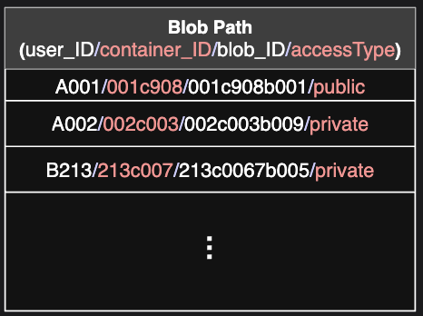
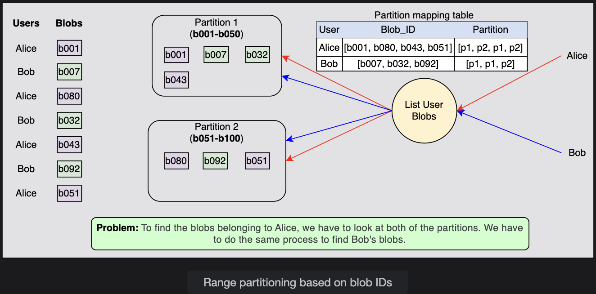
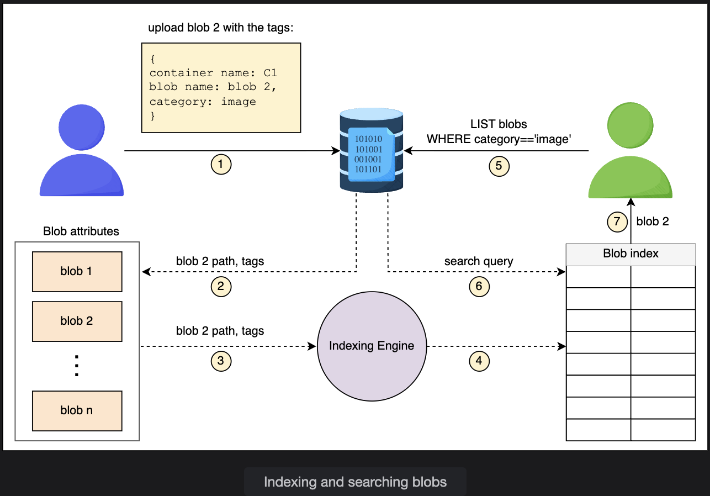
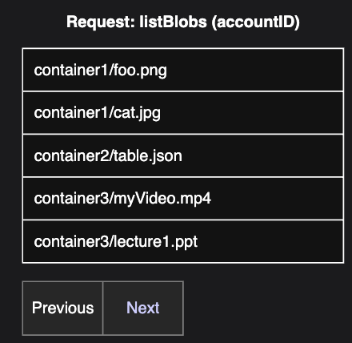
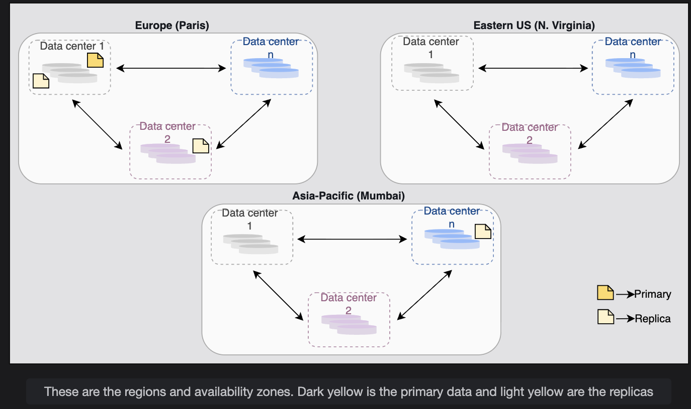
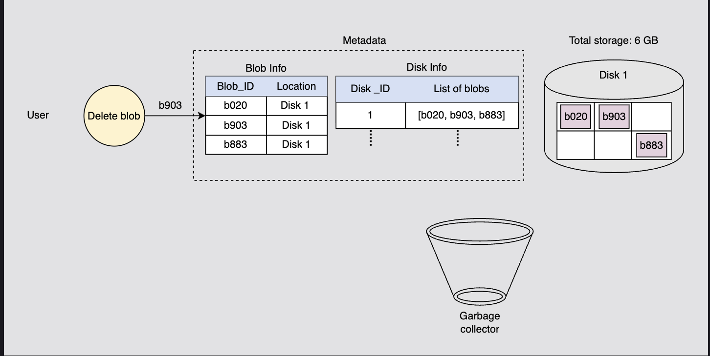
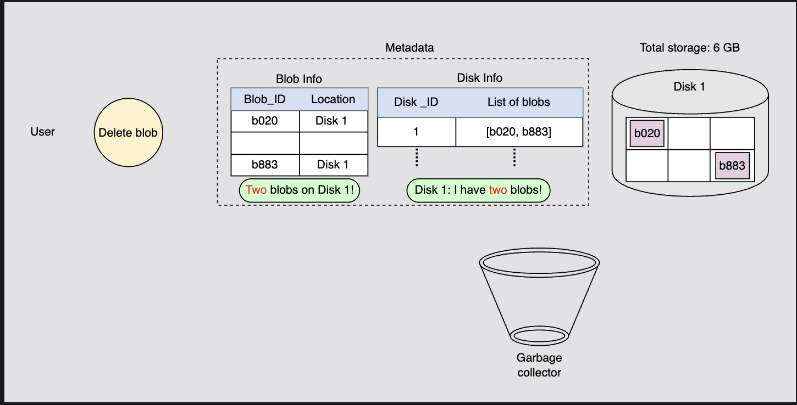

# Blob Store: Design Considerations

> Deep-diving into the implementation details — how blobs are stored, indexed, partitioned, replicated, deleted, streamed, and cached at scale.

---

## Table of Contents

1. [Abstraction Layers](#1-abstraction-layers)
2. [Blob Metadata](#2-blob-metadata)
3. [Partitioning](#3-partitioning)
4. [Blob Indexing](#4-blob-indexing)
5. [Pagination for Listing](#5-pagination-for-listing)
6. [Replication](#6-replication)
7. [Garbage Collection](#7-garbage-collection)
8. [Streaming](#8-streaming)
9. [Caching](#9-caching)
10. [Summary Cheat Sheet](#10-summary-cheat-sheet)

---

## 1. Abstraction Layers

Before making design decisions, we define **three layers of abstraction** that hide internal complexity from users and guide how data is routed, stored, and sharded.

```
┌─────────────────────────────────────────────────┐
│              User's Blob Store Account           │
│                 (account_ID)                     │
│  ┌───────────────────────────────────────────┐  │
│  │             Container                      │  │
│  │             (container_ID)                 │  │
│  │  ┌──────────────────────────────────────┐ │  │
│  │  │               Blob                   │ │  │
│  │  │             (blob_ID)                 │ │  │
│  │  │  {chunks, chunk→datanode mappings}   │ │  │
│  │  └──────────────────────────────────────┘ │  │
│  └───────────────────────────────────────────┘  │
└─────────────────────────────────────────────────┘
```

### Layered Information Table

| Level | Identified By | Contains | Sharded By | Mapping |
|---|---|---|---|---|
| User Account | `account_ID` | List of `container_ID` values | `account_ID` | Account → list of containers |
| Container | `container_ID` | List of `blob_ID` values | `container_ID` | Container → list of blobs |
| Blob | `blob_ID` | List of chunks + chunk→datanode mappings | `blob_ID` | Blob → list of chunks |

> Unique IDs for accounts, containers, and blobs are all generated by a **unique ID generator** system.

These layers allow us to make routing, storage, and sharding decisions independently at each level.

---

## 2. Blob Metadata

### Why Metadata is Needed

Large blobs can't fit in a single contiguous disk location, a single data node, or sometimes even a single machine. So blobs are **split into equal-sized chunks**, distributed across multiple data nodes, and **replicated** for fault tolerance.

The Manager Node must track all of this to reconstruct the blob on reads.

---

### How Chunking Works

```
Blob: video_abc.mp4  (128 MB)
Chunk size: 64 MB

  Chunk 1 (64 MB) ──▶ Data Node d1b1
  Chunk 2 (64 MB) ──▶ Data Node d1b2
```

Each chunk is replicated across **3 replica nodes**:

### Blob Metadata Table (Example: 128 MB blob, 2 chunks)

| Chunk | Primary Data Node | Replica 1 | Replica 2 | Replica 3 |
|---|---|---|---|---|
| 1 | d1b1 | r1b1 | r2b1 | r3b1 |
| 2 | d1b2 | r1b2 | r2b2 | r3b2 |

The Manager Node stores this mapping in Metadata Storage — it's what allows the system to reconstruct any blob from its parts.

---

### Choosing the Right Chunk Size

Chunk size is a critical design parameter. Getting it wrong has real performance consequences:

| Chunk Size | Problem |
|---|---|
| Too **small** | Metadata explodes — more chunks = more rows in metadata per blob. Bad for the single-manager design. |
| Too **large** | Disks struggle to write large contiguous blocks; lower read/write performance. |

**Best practice:** On rotating disks, make chunk size an **integer multiple of the sector size** (the disk's unit of read/write). This aligns I/O operations with the physical hardware.

Other variables that affect chunk size choice: storage type (HDD vs SSD), workload pattern (sequential vs random), streaming vs block access.

---

### What If Blob Size Isn't a Multiple of Chunk Size?

> ❓ **Q: What if the blob size isn't a multiple of our configured chunk size? How does the Manager Node know how many bytes to read for the last chunk?**

**A:** The last chunk will be **partially filled** — it won't contain a full chunk's worth of data. To handle this, the Manager Node also stores the **total size of each blob** in its metadata. When reading, it uses this size to determine exactly how many bytes belong to the last chunk, rather than reading the entire allocated chunk space.

```
Chunk size: 64 MB
Blob size:  100 MB

  Chunk 1: 64 MB  (full)
  Chunk 2: 36 MB  (partial — Manager Node reads exactly 36 MB, not 64 MB)
```

---

### Replica Nodes: Dual Purpose

Replicas aren't just for disaster recovery. They also **serve read/write requests** alongside the primary node — distributing load so the primary node doesn't become a bottleneck.

---

## 3. Partitioning

### The Problem with Naive Partitioning

With billions of blobs across thousands of data nodes, we need to group nodes into **partitions** to make lookups fast. But if we partition blobs purely by `blob_ID` (ignoring account and container), we get:

```
Container: user_123/my_videos

  blob_1  ──▶ Partition A
  blob_2  ──▶ Partition D
  blob_3  ──▶ Partition B
  blob_4  ──▶ Partition F
```

Listing all blobs in a container now requires querying **multiple partitions** — significant overhead.

---

### The Solution: Partition by Full Path

We use the **combination of `account_ID + container_ID + blob_ID`** as the partition key.

```
Partition key = account_ID/container_ID/blob_ID

Example:
  user_123/my_videos/blob_1  ──▶ Partition A
  user_123/my_videos/blob_2  ──▶ Partition A  ← same partition!
  user_123/my_videos/blob_3  ──▶ Partition A  ← same partition!
```

This **co-locates all blobs for a single user/container** on the same partition server — making listing and per-account operations fast.

```
Before (blob_ID only):     After (full path key):
  List user_123/videos       List user_123/videos
  → Query 4 partitions       → Query 1 partition ✅
  → High overhead            → Fast, low overhead
```

> Partition mappings are maintained by the Manager Node and stored in the distributed metadata storage.




---

## 4. Blob Indexing

### The Problem

With billions of blobs, finding specific ones by name, date, or type becomes slow without an index — like searching a book without a table of contents.

### How Blob Indexing Works

When uploading a blob, we attach **key-value tag attributes** to it:

```
Tags on upload:
  container_name = "user_videos"
  blob_name      = "intro.mp4"
  upload_date    = "2024-03-15"
  blob_type      = "video"
  resolution     = "1080p"
```

A **blob indexing engine** reads these tags, indexes them, and exposes them via a searchable blob index:

```
Upload blob with tags
        │
        ▼
[Blob Indexing Engine]
  - Reads new tags
  - Indexes them
  - Adds to Searchable Blob Index
        │
        ▼
[Searchable Blob Index]
  ← Query: "find all videos uploaded after 2024-01-01"
  → Returns: matching blob list instantly
```

Indexing also enables **categorization and sorting** — which is what powers pagination.


---

## 5. Pagination for Listing

### The Problem

A user might have 2,000 blobs under their account. Returning all 2,000 at once causes:
- Slow query response times
- High memory usage
- Poor UI/UX (users don't need 2,000 results at once)

### The Solution: Pagination

Return results in **fixed-size pages** with a **next** button:

```
User requests: list all blobs in my account (2,000 total)

  Page 1: blobs 1–5    [Next →]
  Page 2: blobs 6–10   [← Prev] [Next →]
  Page 3: blobs 11–15  [← Prev] [Next →]
  ...
```

Application owners configure page size based on:
- How long users are expected to wait for a response
- How many results can be returned within that time


---

### Which Blobs Come First?

> ❓ **Q: How do we decide which 5 blobs to return first out of 2,000?**

**A:** We use the **blob index** to sort and categorize blobs **at write time** (during upload). Pre-sorting means when a list request arrives, results are already in order — we don't need to sort 2 billion blobs on the fly.

---

### Continuation Token

To know where page 2 starts after returning page 1, we use a **continuation token**:

```
Response (Page 1):
  {
    blobs: [blob_1, blob_2, blob_3, blob_4, blob_5],
    continuation_token: "eyJibG9iX2lkIjoiYmxvYl82In0="  ← pointer to page 2 start
  }

Next request:
  listBlobs(containerPath, continuation_token="eyJibG9iX2lkIjoiYmxvYl82In0=")
  → Returns blobs 6–10
```

The continuation token is a **string pointer** included in the response whenever more results exist. It tells the system exactly where to resume on the next query.

---

## 6. Replication

Replication happens at **two levels** with different consistency goals:

```
Level 1: Synchronous  → Within a storage cluster  → Strong consistency
Level 2: Asynchronous → Across data centers/regions → High availability
```

---

### Level 1: Synchronous Replication (Within a Storage Cluster)

A **storage cluster** = N racks of storage nodes, each configured as a **fault domain** (independent power + networking).

```
Write request arrives
        │
        ▼
Manager Node identifies data nodes + replica nodes
        │
        ▼
Data written to primary node + ALL replicas in PARALLEL
(using redundant network paths — in-lined data copying)
        │
        ▼
Success returned to client ✅ (only after all replicas confirm)
```

**Why parallel copying is fast:**
- All nodes are nearby (same cluster) → low latency
- Redundant network paths copy to all replicas simultaneously → no sequential bottleneck

This gives us **strong consistency** — any subsequent read from any node in the cluster sees the latest write.

---

### Level 2: Asynchronous Replication (Across Data Centers and Regions)

After the synchronous write succeeds, data is **asynchronously replicated** to other regions:

```
Replication Factor = 3 copies

Copy 1: Local data center (primary region)
  → Protects against: server rack failure, drive failure

Copy 2: Different data center, same region
  → Protects against: fire, flooding in one data center

Copy 3: Data center in a different region
  → Protects against: regional disasters (earthquake, widespread outage)
```

```
Geographic layout:

  Region: US-East
  ├── Data Center A  ←── Copy 1 (primary)
  └── Data Center B  ←── Copy 2

  Region: Asia-Pacific
  └── Data Center C  ←── Copy 3
```

> Read requests are **not served from other regions** until replication to that region is complete. This prevents stale reads across regions.


---

### Replication Summary

| Level | Type | Scope | Consistency | Purpose |
|---|---|---|---|---|
| 1 | Synchronous | Within storage cluster | Strong | Durability + consistency |
| 2 | Asynchronous | Across data centers/regions | Eventual | Availability + disaster recovery |

---

## 7. Garbage Collection

### Why Not Delete Immediately?

A blob's chunks are spread across multiple data nodes. Deleting all of them in real time during a user's delete request would:
- Require coordinating many data nodes simultaneously
- Make the user **wait** for all deletions to complete
- Be unacceptably slow for a real-time operation

### The Two-Phase Deletion Process

```
Phase 1 — Soft Delete (immediate, fast):

  User sends DELETE /blob_xyz
        │
        ▼
  Manager Node marks blob as "DELETED" in metadata
        │
        ▼
  Response returned to user ✅  (fast — just a metadata update)
  Blob is now inaccessible to users
  BUT: chunks still physically exist on data nodes


Phase 2 — Garbage Collection (deferred, async):

  Garbage Collector runs periodically
        │
        ▼
  Scans metadata for blobs marked "DELETED"
        │
        ▼
  For each deleted blob:
    - Frees the chunks from data nodes
    - Cleans up chunk entries from metadata
    - Updates the Disk Info table (free space increases)
        │
        ▼
  Metadata inconsistencies resolved ✅
  Storage space reclaimed ✅
```

### The Acceptable Trade-off

```
Real-time cost:    Fast delete response to user ✅
Deferred cost:     Chunks occupy space for a short time after deletion ⚠️
                   (no user-facing impact — blob is inaccessible immediately)
```

This time delay between deletion and space reclamation is acceptable because the user already has a fast response — they don't experience the deferred cleanup.



---

## 8. Streaming

### The Problem

A 4K video can be several gigabytes. You can't load the entire file into memory before playing it — users would wait minutes before seeing a single frame.

### The Solution: Offset-Based Chunk Streaming

We define a fixed number of bytes `X` to read at a time, and use an **offset** to track position:

```
File: video.mp4  (total: 500 MB)
X = 1 MB per read

Read 1: offset=0      → bytes 0 to (X-1)       → bytes 0–1,048,575
Read 2: offset=X      → bytes X to (2X-1)       → bytes 1,048,576–2,097,151
Read 3: offset=2X     → bytes 2X to (3X-1)      → bytes 2,097,152–3,145,727
...
```

**Offset update rule after each read:**
```
new_offset = current_offset + bytes_just_read
```

> ❓ **Q: How do we know which bytes we've read and which to read next?**

**A:** The **offset value** tracks exactly this. It starts at 0. After reading `X` bytes, the offset becomes `X`. After the next read, it becomes `2X`. The offset always points to the next unread byte — so we always know where we left off and where to resume.

### Why Streaming Works for Users

```
Without streaming:  Load entire 4 GB file → wait 3 minutes → start watching
With streaming:     Load first 1 MB chunk → start watching immediately
                    Next chunk loads in background while you watch the current one
```

This is why platforms like YouTube can start playing a video within seconds of clicking.

---

## 9. Caching

Caching happens at **multiple levels** in the blob store — each targeting a different bottleneck:

---

### Level 1: Client-Side Metadata Cache

```
First read of blob_xyz:
  Client → Manager Node: "Where are the chunks for blob_xyz?"
  Manager Node → Client: chunk-to-datanode mappings
  Client caches this mapping locally

Second read of blob_xyz:
  Client → Data Nodes directly (skips Manager Node entirely) ✅
  → Faster read, reduced Manager Node load
```

---

### Level 2: Front-End Server Partition Map Cache

```
Front-End Servers cache the partition map
  → Instantly know which partition server handles a given blob path
  → No need to ask Manager Node for routing on every request
```

---

### Level 3: Manager Node Chunk Cache

```
Frequently accessed chunks are cached at the Manager Node
  → Reduces disk I/O for hot blobs
  → Enables efficient streaming of large objects
```

---

### Level 4: CDN Caching (Public Blobs)

For publicly accessible blobs, **CDN (Content Delivery Network)** is the primary caching mechanism:

```
User in Asia requests a public blob stored in US-East
  ↓
CDN edge server in Asia checks its cache
  ├── Cache HIT:  Serve directly from Asia edge ✅ (milliseconds)
  └── Cache MISS: Fetch from origin (US-East), cache it, then serve
```

The **TTL (time-to-live)** for CDN caching is set by the origin server via the `Cache-Control` HTTP header. Azure Blob Storage uses Azure CDN for this purpose.

---

### Caching Summary

| Level | Where | What's Cached | Benefit |
|---|---|---|---|
| Client-side | User's machine | Blob chunk → datanode mappings | Skips Manager Node on repeat reads |
| Front-end server | Front-end layer | Partition map | Fast request routing |
| Manager Node | Manager Node memory | Frequently accessed chunks | Reduces disk I/O, faster streaming |
| CDN | Edge servers globally | Public blob content | Low-latency global delivery |

---

## 10. Summary Cheat Sheet

```
BLOB METADATA
  - Blobs split into equal-sized chunks
  - Each chunk: primary node + 3 replica nodes
  - Manager Node stores all chunk → datanode mappings
  - Blob size stored to handle partial last chunks

PARTITIONING
  - Partition key = account_ID + container_ID + blob_ID
  - Co-locates a user's blobs on the same partition server
  - Makes listing and per-account queries fast

BLOB INDEXING
  - Key-value tags assigned at upload time
  - Indexing engine reads tags, populates searchable index
  - Enables fast search, categorization, and sorting

PAGINATION
  - Fixed-size pages returned per request
  - Continuation token points to start of next page
  - Sorting done at write time (pre-sorted index)

REPLICATION
  - Level 1: Synchronous within cluster → strong consistency
  - Level 2: Async across regions → availability + disaster recovery
  - Replication factor = 3 (local DC + same-region DC + different region)

GARBAGE COLLECTION
  - Soft delete: mark as DELETED immediately → fast user response
  - GC runs async: frees chunks + cleans metadata later
  - Trade-off: brief storage overhead vs. fast delete response

STREAMING
  - Read X bytes at a time using an offset pointer
  - Offset starts at 0, incremented by X after each read
  - Enables playback to start before full file is loaded

CACHING
  - Client: chunk mappings (skip Manager Node on repeat reads)
  - Front-end: partition map (fast routing)
  - Manager Node: hot chunks (reduce disk I/O)
  - CDN: public blobs (global low-latency delivery via TTL/Cache-Control)
```

---

