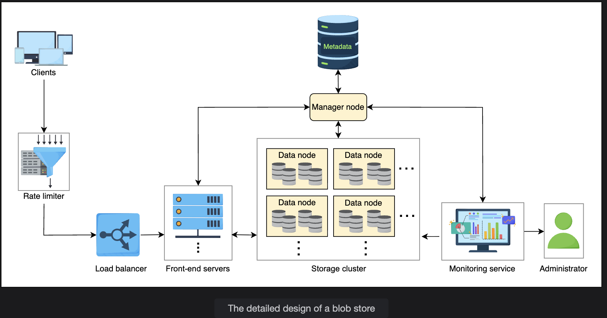

# Design of a Blob Store

> Translating requirements into a concrete system — covering high-level design, API contracts, detailed components, and step-by-step workflows.

---

## Table of Contents

1. [High-Level Design](#1-high-level-design)
2. [API Design](#2-api-design)
3. [Detailed Design — Components](#3-detailed-design--components)
4. [Workflow](#4-workflow)
   - [Writing a Blob](#41-writing-a-blob)
   - [Reading a Blob](#42-reading-a-blob)
   - [Deleting a Blob](#43-deleting-a-blob)
5. [Key Design Questions & Answers](#5-key-design-questions--answers)
6. [Summary](#6-summary)

---

## 1. High-Level Design

At the highest level, a blob store has three core layers:

```
┌────────────┐        ┌──────────────────────┐        ┌───────────────────┐
│            │        │                      │        │                   │
│   Client   │──────▶ │   Front-End Servers  │──────▶ │   Storage Disks   │
│            │        │                      │        │                   │
└────────────┘        └──────────────────────┘        └───────────────────┘

  User / App         Receive & process request         Store blob data
```

**How it flows:**
1. Client sends a request (upload, download, delete, list).
2. Front-end servers receive and process the request.
3. Front-end servers store or retrieve the client's blob from the attached storage disks.

This simple view gets refined significantly in the detailed design below.

---

## 2. API Design

> All operations below require the user to be **registered and authenticated**. Registration/auth flows are excluded for brevity.

---

### 2.1 Create Container

Creates a new container under the logged-in account.

```
createContainer(containerName)
```

| Parameter | Description |
|---|---|
| `containerName` | Name of the container. Must be **unique within the storage account**. |

---

### 2.2 Upload Blob

Uploads a blob (file) into a specified container.

```
uploadBlob(containerPath, blobName, data)
```

| Parameter | Description |
|---|---|
| `containerPath` | Path of the target container — includes `accountID` and `containerID`. |
| `blobName` | Name of the blob. Must be unique within the container. If a blob with the same name exists, the new one receives a **version number**. |
| `data` | The file/binary data to upload. |

> ⚠️ **Note:** For very large blobs, the actual implementation uses a **multi-step streaming call** rather than a single API call. The API above is the logical contract.

---

### 2.3 Download Blob

Retrieves a blob by its unique path or ID.

```
downloadBlob(blobPath)
```

| Parameter | Description |
|---|---|
| `blobPath` | Fully qualified path of the blob, including its unique ID. |

> The response includes **metadata** such as: size, version number, access privileges, name, etc.

---

### 2.4 Delete Blob

Marks a blob for deletion. Actual deletion happens later during **garbage collection**.

```
deleteBlob(blobPath)
```

| Parameter | Description |
|---|---|
| `blobPath` | Path of the blob to delete. |

---

### 2.5 List Blobs

Returns all blobs inside a specific container.

```
listBlobs(containerPath)
```

| Parameter | Description |
|---|---|
| `containerPath` | Path to the container whose blobs you want to list. |

---

### 2.6 Delete Container

Marks a container (and all blobs inside it) for deletion. Deletion happens during garbage collection.

```
deleteContainer(containerPath)
```

| Parameter | Description |
|---|---|
| `containerPath` | Path to the container to delete. |

---

### 2.7 List Containers

Returns all containers under a given account.

```
listContainers(accountID)
```

| Parameter | Description |
|---|---|
| `accountID` | ID of the account whose containers you want to list. |

---

### API Summary Table

| Operation | Signature | Key Notes |
|---|---|---|
| Create Container | `createContainer(containerName)` | Name must be unique per account |
| Upload Blob | `uploadBlob(containerPath, blobName, data)` | Duplicates get a version number |
| Download Blob | `downloadBlob(blobPath)` | Returns blob + metadata |
| Delete Blob | `deleteBlob(blobPath)` | Soft delete → garbage collected later |
| List Blobs | `listBlobs(containerPath)` | Lists all blobs in a container |
| Delete Container | `deleteContainer(containerPath)` | Cascades to all blobs inside |
| List Containers | `listContainers(accountID)` | Lists all containers for an account |

---

## 3. Detailed Design — Components

A production blob store is more than front-end + storage. Here are all the components and what they do:

---

### 3.1 Client

Any user or program that calls the blob store APIs. Could be a browser, mobile app, backend service, or CLI tool.

---

### 3.2 Rate Limiter

Controls how many requests a user or IP address can make within a time window.

```
Functions:
  - Per-user limits (based on subscription tier)
  - Per-IP limits (prevents abuse from a single source)
  - Requests exceeding the limit are rejected before hitting any server
```

---

### 3.3 Load Balancer

Distributes incoming traffic across servers to prevent bottlenecks.

```
Can route based on:
  - Geographic location of the user → different region
  - Data center load → different DC within same region
  - Server load → different server within same DC

Technique: DNS load balancing for cross-region routing
```

---

### 3.4 Front-End Servers

The entry point for all client requests after passing through the rate limiter and load balancer.

```
Responsibilities:
  - Forward upload/delete requests to appropriate storage servers
  - Coordinate with the Manager Node to determine where data lives
  - Return blob paths to clients after successful uploads
```

---

### 3.5 Data Nodes

The actual storage layer — data nodes **hold blob data**.

```
Key concepts:
  - Blobs are split into fixed-size pieces called CHUNKS
  - A data node stores one or more chunks
  - A single blob's chunks may be spread across multiple data nodes
  - Each chunk is replicated for redundancy (managed by the Manager Node)
```

```
Blob: video_abc.mp4 (split into 4 chunks)

  Chunk 1 ──▶ Data Node A  (+ replica on Data Node D)
  Chunk 2 ──▶ Data Node B  (+ replica on Data Node E)
  Chunk 3 ──▶ Data Node C  (+ replica on Data Node A)
  Chunk 4 ──▶ Data Node D  (+ replica on Data Node B)
```

---

### 3.6 Manager Node

The **brain of the blob store** — the most critical component.

```
Responsibilities:
  - Assigns unique IDs to blobs (via a unique ID generator)
  - Splits blobs into chunks
  - Tracks which chunks live on which data nodes
  - Manages free space across data nodes (free-space management system)
  - Stores and retrieves blob metadata from Metadata Storage
  - Manages access privileges (public vs. private blobs)
  - Decides where replicas of chunks are stored
  - Serializes concurrent writes to the same blob name
```

**Access privileges managed by Manager Node:**

| Type | Who can access |
|---|---|
| Private | Only the account that owns the blob |
| Public | Anyone with the blob's URL |

> ⚠️ **Single Point of Failure?** Yes — see [Design Q&A](#5-key-design-questions--answers) for how this is handled.

---

### 3.7 Metadata Storage

A **distributed database** used by the Manager Node to persist all metadata.

Three types of metadata stored:

| Metadata Type | What It Contains |
|---|---|
| **Account metadata** | User account info + list of containers per account |
| **Container metadata** | List of blobs inside each container |
| **Blob metadata** | Where each blob's chunks are stored (chunk-to-data-node mappings) |

---

### 3.8 Monitoring Service

Continuously watches data nodes and the manager node.

```
Monitors:
  - Disk failures requiring human intervention
  - Available storage space across all disks
  - Health and responsiveness of data nodes and manager node

Actions:
  - Alerts the administrator when thresholds are crossed
  - Triggers space-addition workflows when disks are near full
```

---

### 3.9 Administrator

A human operator responsible for:
- Responding to alerts from the monitoring service
- Conducting routine health checks
- Adding storage capacity when needed
- Recovering the system in case of failures

---

### Component Architecture (Full Picture)

```
                         ┌──────────────────┐
                         │   Rate Limiter   │
Client ─────────────────▶│                  │
                         └────────┬─────────┘
                                  │
                         ┌────────▼─────────┐
                         │  Load Balancer   │
                         └────────┬─────────┘
                                  │
                    ┌─────────────▼──────────────┐
                    │      Front-End Servers      │
                    └──────────┬─────────────────┘
                               │
              ┌────────────────▼────────────────┐
              │           Manager Node           │◀── Monitoring Service
              │  (chunk mapping, access, IDs)    │         │
              └──────┬──────────────────┬────────┘         │
                     │                  │              Administrator
              ┌──────▼──────┐   ┌───────▼──────┐
              │  Metadata   │   │  Data Nodes  │
              │  Storage    │   │  (chunks +   │
              │  (DB)       │   │   replicas)  │
              └─────────────┘   └──────────────┘
```


---

## 4. Workflow

We assume the user is logged in and a container already exists. Each blob operation flows through the system as follows.

---

### 4.1 Writing a Blob

```
Step 1: Client sends upload request
         │
         ▼
Step 2: Rate Limiter checks — OK? → Load Balancer forwards to a Front-End Server
         │
         ▼
Step 3: Front-End Server asks Manager Node: "Where should I store this blob?"
         │
         ▼
Step 4: Manager Node:
         ├── Assigns a unique ID to the blob
         ├── Splits the blob into fixed-size chunks
         ├── Checks free space on data nodes
         └── Maps each chunk → a data node (+ replica nodes)
         │
         ▼
Step 5: Front-End Server writes each chunk to the assigned data nodes
         │
         ▼
Step 6: Manager Node stores blob metadata in Metadata Storage
         │
         ▼
Step 7: Client receives the fully qualified blob path:
         format: /accountID/containerID/blobID/accessLevel
```

**Fully Qualified Blob Path Structure:**
```
/user_123/container_456/blob_789/public
   │            │           │       │
   accountID    containerID blobID  access level
```

---

### 4.2 Reading a Blob

```
Step 1: Client sends read request with blob path
         │
         ▼
Step 2: Front-End Server asks Manager Node for blob metadata
         │
         ▼
Step 3: Manager Node checks:
         ├── Is the blob public or private?
         └── Is the requesting client authorized?
         │
         ▼
Step 4: Manager Node returns:
         ├── List of chunks for this blob
         └── Mapping of each chunk → data node
         │
         ▼
Step 5: Client reads each chunk directly from the data nodes
         │
         ▼
Step 6: Client caches the metadata locally
         (future reads of the same blob skip the Manager Node entirely)
```

> **Caching Optimization:** After the first read, the client caches chunk-to-data-node mappings locally. This reduces Manager Node load and speeds up subsequent reads of the same blob.

---

### 4.3 Deleting a Blob

```
Step 1: Client sends delete request with blob path
         │
         ▼
Step 2: Manager Node marks the blob as DELETED in metadata
         (the actual data is NOT immediately removed)
         │
         ▼
Step 3: Garbage Collector (runs periodically):
         ├── Finds blobs marked as deleted
         ├── Frees the chunks on data nodes
         └── Removes the metadata entry
```

**Why soft delete + garbage collection?**
- Immediate deletion is expensive and risky in distributed systems
- Soft delete allows for accidental deletion recovery within a window
- Garbage collection batches deletions for efficiency

---

## 5. Key Design Questions & Answers

---

> ❓ **Q: What does the Manager Node do if a user concurrently writes two blobs with the same name inside the same container?**

**A:** The Manager Node **serializes** such concurrent operations. The blob that arrives first is stored normally. The blob that arrives later is assigned a **version number**, ensuring both are preserved without collision. This is why blob names within a container must be unique — and duplicates get versioned rather than overwritten.

```
Upload: video.mp4  (first)   → stored as video.mp4
Upload: video.mp4  (second)  → stored as video.mp4 (version: 2)
```

---

> ❓ **Q: The client caches blob metadata locally. What happens if the Manager Node moves chunks to new data nodes (e.g., due to disk failure)? Won't the client have stale metadata?**

**A:** Yes — the client's cached metadata becomes stale. When the client tries to read from the old data node location, the **read fails**. At that point:

1. The client detects the failure (connection refused or data not found).
2. The client **flushes its local metadata cache**.
3. The client **fetches fresh metadata** from the Manager Node.
4. The read is retried using the updated chunk-to-data-node mapping.

```
Client reads chunk from Data Node A → ❌ FAIL (node moved/failed)
Client flushes cache
Client fetches new metadata from Manager Node
Client reads chunk from Data Node C → ✅ SUCCESS
```

---

> ❓ **Q: Can the Manager Node be considered a single point of failure? If yes, how do we handle it?**

**A:** Yes — the Manager Node is the central coordinator of the entire system. If it goes down, no reads, writes, or deletes can proceed. This is a critical SPOF.

**Solution: Checkpointing with a Shadow/Backup Manager Node**

```
Checkpointing process:
  ┌─────────────────────────────────────────────────────┐
  │ Manager Node                                        │
  │   - Takes periodic snapshots of its state           │
  │   - Snapshot includes:                              │
  │       ├── All chunk-to-data-node mappings           │
  │       ├── Hardware configuration                    │
  │       ├── Messages in-transit to data nodes         │
  │       └── Operation log (all recent actions)        │
  │   - Snapshots stored in an external snapshot repo   │
  └─────────────────────────────────────────────────────┘

  If Manager Node fails:
    1. Automated system (or admin) detects failure
    2. Shadow/backup Manager Node is activated
    3. Snapshot is loaded → system restored to last checkpoint
    4. Operation log is replayed → recover in-progress operations
    5. Service resumes
```

This minimizes data loss to the window between the last snapshot and the failure, and eliminates the need for a full cold restart.

---

## 6. Summary

### Component Roles at a Glance

| Component | Role |
|---|---|
| Client | Calls blob store APIs |
| Rate Limiter | Enforces per-user and per-IP request limits |
| Load Balancer | Distributes traffic across servers and regions |
| Front-End Servers | Routes requests, coordinates between client and Manager Node |
| Manager Node | Assigns IDs, splits blobs, maps chunks, manages access + metadata |
| Data Nodes | Store actual blob chunks and their replicas |
| Metadata Storage | Distributed DB for account, container, and blob metadata |
| Monitoring Service | Watches disks and nodes, alerts admins |
| Administrator | Responds to alerts, handles failures, adds capacity |

### Key Design Decisions

```
Blobs → split into fixed-size CHUNKS
Chunks → distributed across DATA NODES
Chunks → REPLICATED for redundancy
Blob metadata → stored in METADATA STORAGE (not with the blob)
Manager Node → protected by CHECKPOINTING + shadow node
Read metadata → CACHED at client to reduce Manager Node load
Deletes → SOFT DELETE first, then garbage collected
Concurrent same-name writes → SERIALIZED + VERSIONED by Manager Node
```

---
