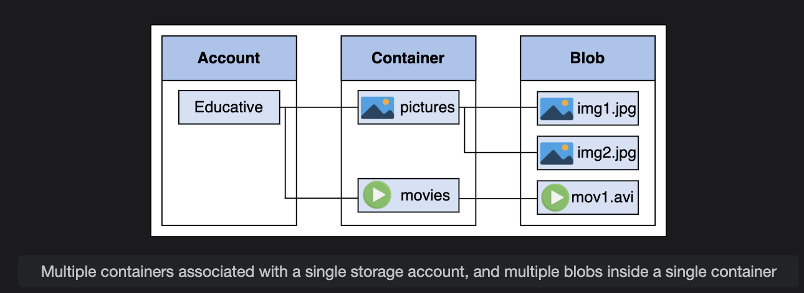
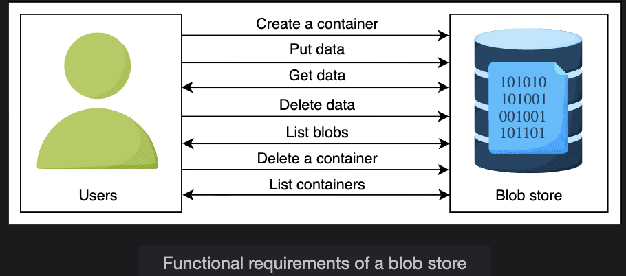
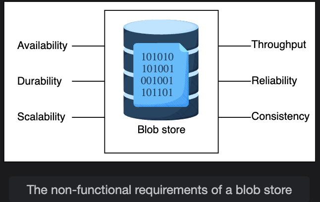

# Blob Store: Requirements & Resource Estimation

> Identifying functional and non-functional requirements, estimating servers, storage, and bandwidth, and selecting the right building blocks for a blob store system.

---

## Table of Contents

1. [Functional Requirements](#1-functional-requirements)
2. [Non-Functional Requirements](#2-non-functional-requirements)
3. [Eventual Consistency in Blob Stores](#3-eventual-consistency-in-blob-stores)
4. [Resource Estimation](#4-resource-estimation)
   - [Assumptions](#assumptions)
   - [Number of Servers](#number-of-servers-estimation)
   - [Storage](#storage-estimation)
   - [Bandwidth](#bandwidth-estimation)
5. [Building Blocks](#5-building-blocks)
6. [Summary Cheat Sheet](#6-summary-cheat-sheet)

---

## 1. Functional Requirements

These define **what the system must do** — the core operations users can perform.

---

### 1.1 Create a Container

Users must be able to create **containers** to logically group blobs.

```
Storage Account
├── Container: user_videos
│   ├── blob: video_abc.mp4
│   └── blob: video_xyz.mp4
├── Container: user_images
│   ├── blob: profile_pic.jpg
│   └── blob: thumbnail.png
└── Container: user_docs
    └── blob: resume.pdf
```

**Rules:**
- One account → many containers
- One container → many blobs
- ❌ Containers **cannot** be nested inside other containers (for simplicity)


---

### 1.2 Put Data (Upload a Blob)

Users must be able to **upload blobs** into a specific container.

```
PUT /container-name/blob-name
Body: <binary data>
```

---

### 1.3 Get Data (Download / Access a Blob)

When a blob is uploaded, the system must generate a **unique URL** for it so the user can retrieve it later.

```
Uploaded:  my-videos/intro.mp4
Generated: https://blobstore.example.com/my-videos/intro.mp4
```

Users access blobs via this URL — directly or programmatically.

---

### 1.4 Delete Data

Users must be able to **delete a blob**. Additionally, the system must support **retention periods** — blobs cannot be deleted before a specified time even if requested.

```
DELETE /container-name/blob-name

With retention:
  Blob created: Jan 1
  Retention set: 90 days
  Earliest deletion allowed: April 1
```

---

### 1.5 List Blobs

Users must be able to **list all blobs** within a specific container.

```
GET /container-name/blobs

Response:
  - video_abc.mp4   (uploaded: 2024-01-10, size: 45 MB)
  - video_xyz.mp4   (uploaded: 2024-01-15, size: 60 MB)
  - thumbnail.jpg   (uploaded: 2024-01-15, size: 18 KB)
```

---

### 1.6 Delete a Container

Users must be able to **delete an entire container** along with all blobs inside it.

> ⚠️ This is a cascading delete — all blobs within the container are deleted too.

---

### 1.7 List Containers

Users must be able to **list all containers** under their account.

```
GET /account/containers

Response:
  - user_videos   (3 blobs, created: 2024-01-01)
  - user_images   (12 blobs, created: 2024-01-05)
  - user_docs     (1 blob,  created: 2024-01-10)
```

---

### Functional Requirements Summary

| # | Operation | Description |
|---|-----------|-------------|
| 1 | Create Container | Group blobs logically under a named container |
| 2 | Put Data | Upload a blob to a container |
| 3 | Get Data | Retrieve a blob via its generated URL |
| 4 | Delete Data | Delete a blob (with optional retention enforcement) |
| 5 | List Blobs | View all blobs inside a container |
| 6 | Delete Container | Remove a container and all its blobs |
| 7 | List Containers | View all containers under an account |


---

## 2. Non-Functional Requirements

These define **how well the system must perform** — quality attributes that make it production-grade.

---

### 2.1 Availability

The system must be **highly available** — users should be able to read and write blobs at all times, even during partial failures.

```
Target: 99.99% uptime
Strategy: Replication across multiple data centers and regions
```

---

### 2.2 Durability

Once a blob is uploaded, it **must not be lost** unless explicitly deleted by the user.

```
Strategy:
  - Replicate each blob across multiple storage nodes
  - Use checksums to detect and repair data corruption
  - Geographic replication for disaster recovery
```

---

### 2.3 Scalability

The system must handle **billions of blobs** growing over time without degradation.

```
YouTube: 250,000 new videos/day × years = billions of blobs
Strategy: Horizontal scaling — add more storage nodes as needed
```

---

### 2.4 Throughput

For transferring **gigabytes of data**, the system must sustain high throughput — not just handle many requests, but transfer large payloads efficiently.

```
A single 4K video = several GBs
Millions of users streaming simultaneously = massive parallel throughput
```

---

### 2.5 Reliability

Failures are inevitable in distributed systems. The design must **detect and recover from failures promptly** with minimal impact on users.

```
Failure types to handle:
  - Disk failure → switch to replica
  - Node failure → reroute requests
  - Network partition → retry with backoff
  - Data corruption → detect via checksum, restore from replica
```

---

### 2.6 Consistency

The system must be **strongly consistent** — all users must see the same view of a blob at any given time.

```
Strong consistency guarantee:
  User A uploads v2 of a blob
  User B immediately reads the blob → must see v2, not v1
```

---

### Non-Functional Requirements Summary

| Requirement | Target | Strategy |
|---|---|---|
| Availability | 99.99%+ uptime | Multi-region replication |
| Durability | No data loss unless deleted | Multi-node replication + checksums |
| Scalability | Billions of blobs | Horizontal scaling |
| Throughput | GB-level transfers | High-bandwidth pipelines |
| Reliability | Fast failure recovery | Redundancy + health monitoring |
| Consistency | Strong consistency | All replicas agree before confirming write |


---

## 3. Eventual Consistency in Blob Stores

> ❓ **Q: Explain eventual consistency in the context of blob stores. Provide a scenario where it might be acceptable.**

### What is Eventual Consistency?

In a **strongly consistent** system, after a write completes, every subsequent read — from any node — returns the updated value immediately.

In an **eventually consistent** system, after a write completes, different nodes may temporarily return different (stale) values. However, given enough time and no new writes, **all nodes will converge** to the same latest value.

```
Strong Consistency:
  t=0: User uploads new profile photo
  t=1: Any server in the world reads it → sees new photo ✅

Eventual Consistency:
  t=0: User uploads new profile photo
  t=1: Server A reads it → sees new photo ✅
  t=1: Server B reads it → sees old photo ⚠️ (not yet replicated)
  t=5: Server B catches up → sees new photo ✅
```

---

### When is Eventual Consistency Acceptable in Blob Stores?

**Scenario: Video Thumbnail Updates on YouTube**

Suppose a content creator updates the thumbnail of a video that was uploaded 6 months ago. This is not a time-critical update — if some users in a different region see the old thumbnail for a few seconds or minutes before the new one propagates, there is no meaningful harm.

```
Creator updates thumbnail in US-East region
  → US-East servers: immediately show new thumbnail ✅
  → Asia-Pacific servers: still show old thumbnail for ~30 seconds ⚠️
  → After replication lag: all regions show new thumbnail ✅
```

**Why it's acceptable here:**
- No financial, security, or correctness consequence from the brief inconsistency
- The data eventually becomes consistent across all nodes
- Strong consistency would require a global lock — introducing significant latency for all users

**Contrast — When it is NOT acceptable:**

A user deletes a private blob (personal medical record, confidential document). In this case, even a brief window where another node still serves the old blob is a **security and compliance violation**. Strong consistency is mandatory here.

---

## 4. Resource Estimation

We use **YouTube** as a reference system to estimate real-world resource needs.

### Assumptions

| Parameter | Value |
|---|---|
| Daily active users | 5 million |
| RPS a single blob server can handle | 500 |
| Average video size | 50 MB |
| Average thumbnail size | 20 KB |
| Videos uploaded per day | 250,000 |
| Read requests per user per day | 20 |

> **Note:** Blob store servers are capped at 500 RPS (vs. 64,000 for a typical web server) because blob operations are **I/O-intensive** — reading/writing large files takes significantly longer than processing a simple API request.

---

### Number of Servers Estimation

We use daily active users as a proxy for peak requests per second:

```
Peak requests/second = 5,000,000 (5 million DAU)
RPS per server       = 500

Servers needed = Peak RPS / RPS per server
               = 5,000,000 / 500
               = 10,000 servers
```

**Result: ~10,000 servers needed at peak load**

---

### Storage Estimation

Storage needed per day for videos and thumbnails (single copy, single resolution):

```
Storage/day = Videos/day × (Size/video + Size/thumbnail)
            = 250,000 × (50 MB + 20 KB)
            = 250,000 × 50.02 MB
            ≈ 12,505,000 MB
            ≈ 12.51 TB/day
```

**Result: ~12.51 TB/day** *(single copy, single resolution)*

> In reality, YouTube stores each video in **7+ resolutions** and replicates across **multiple data centers**, meaning actual storage is far higher — which aligns with the publicly reported 1+ PB/day figure.

---

### Bandwidth Estimation

#### Incoming Traffic (Uploads)

```
Total upload bandwidth = Total storage/day ÷ Seconds in a day
                       = 12.51 TB ÷ 86,400 seconds
                       = 12,510,000 MB ÷ 86,400
                       ≈ 144.8 MB/s
                       ≈ ~1.16 Gbps incoming
```

#### Outgoing Traffic (Downloads / Streaming)

```
Total download bandwidth = (DAU × Requests/user/day × Avg video size) ÷ Seconds in a day
                         = (5,000,000 × 20 × 50 MB) ÷ 86,400
                         = 5,000,000,000 MB ÷ 86,400
                         ≈ 57,870 MB/s
                         ≈ ~463 Gbps outgoing
```

#### Bandwidth Summary

| Traffic Type | Bandwidth |
|---|---|
| Incoming (uploads) | ~1.16 Gbps |
| Outgoing (streaming) | ~463 Gbps |
| **Ratio** | **~400× more outgoing than incoming** |

> This confirms that blob stores are **read-heavy / read-optimized** systems. The infrastructure, caching, and CDN strategy must be designed primarily around **outgoing throughput**.

---

## 5. Building Blocks

The following components are required to build a production-grade blob store:

| Building Block | Role in Blob Store |
|---|---|
| **Rate Limiter** | Controls how frequently users can interact with the system — prevents abuse, protects against upload/download storms |
| **Load Balancer** | Distributes incoming requests evenly across blob store servers — prevents any single server from becoming a bottleneck |
| **Database** | Stores **metadata** about blobs (name, size, owner, container, URL, upload time, retention settings) — not the blobs themselves |
| **Monitoring** | Continuously inspects storage devices and available space — triggers alerts or auto-provisioning when capacity thresholds are approached |

### How They Fit Together

```
User Request
     │
     ▼
[Rate Limiter] ──── Too many requests? → Reject
     │
     ▼
[Load Balancer] ──── Distribute to available blob servers
     │
     ▼
[Blob Server]
  ├── Read/Write blob data → [Storage Layer]
  └── Read/Write metadata → [Database]
                                │
                           [Monitoring]
                     (watches storage capacity,
                      server health, error rates)
```

---

## 6. Summary Cheat Sheet

### Requirements at a Glance

```
Functional (What it does):          Non-Functional (How well it does it):
──────────────────────────          ──────────────────────────────────────
✅ Create container                  ✅ Availability   → 99.99%+ uptime
✅ Upload blob (PUT)                 ✅ Durability     → No data loss
✅ Download blob via URL (GET)       ✅ Scalability    → Billions of blobs
✅ Delete blob (with retention)      ✅ Throughput     → GB-level transfers
✅ List blobs in container           ✅ Reliability    → Fast failure recovery
✅ Delete container (cascade)        ✅ Consistency    → Strong consistency
✅ List containers in account
```

### Estimation Summary (YouTube-scale)

```
Servers needed:    ~10,000 at peak load
Storage/day:       ~12.51 TB (single copy, single resolution)
Incoming BW:       ~1.16 Gbps
Outgoing BW:       ~463 Gbps
Read/Write ratio:  ~400:1 (heavily read-dominant)
```

### Building Blocks

```
Rate Limiter → Load Balancer → Blob Servers → Storage
                                    └──────────→ Metadata DB
                                                      ↑
                                               Monitoring
```

---

*End of Blob Store Requirements & Estimation*