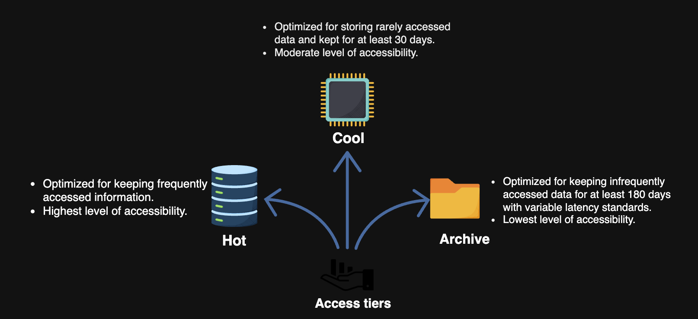

# System Design: A Blob Store

> A comprehensive introduction to blob storage — what it is, why it matters, how major platforms use it, and how Azure manages it in practice.

---

## Table of Contents

1. [What is a Blob Store?](#1-what-is-a-blob-store)
2. [Why Do We Use a Blob Store?](#2-why-do-we-use-a-blob-store)
3. [Azure Storage Access Tiers](#3-azure-storage-access-tiers)
4. [Blob Life Cycle Management Rules](#4-blob-life-cycle-management-rules)
5. [Use Cases](#5-use-cases)
6. [Key Takeaways](#6-key-takeaways)

---

## 1. What is a Blob Store?

A **blob store** is a storage solution designed for **unstructured data** — data that doesn't fit neatly into rows and columns like a relational database.

### What Can Be Stored?

- Photos, images, thumbnails
- Audio and video files
- Binary executable code
- Documents and PDFs
- Any other multimedia or binary content

Every piece of data — regardless of type — is stored as a **blob** (Binary Large Object).

### Flat Data Organization

Unlike traditional file systems, blob stores follow a **flat data organization pattern**:

```
Traditional File System         Blob Store
─────────────────────           ──────────────────────
/videos/                        blob: video_abc123.mp4
  /comedy/                      blob: image_xyz456.jpg
    funny_clip.mp4              blob: audio_def789.mp3
  /drama/
    episode1.mp4
```

There are **no directories or subdirectories** — all blobs live at the same flat level, identified by unique keys or names.

---

### The WORM Principle

Most blob stores are built around a specific access pattern called:

> **WORM — Write Once, Read Many**

This means:
- Data is **written once** and cannot be changed afterward.
- Data can be **read unlimited times**.
- Blobs **cannot be deleted** until a specified retention interval passes.

**Example (Microsoft Azure):**
Blobs in Azure are created once, read many times, and protected from modification or early deletion — preserving critical data integrity.

> ⚠️ **Note:** Not all applications require WORM. But for blob stores, we generally assume blobs are immutable after upload. If a change is needed, a **new version** of the blob is uploaded rather than modifying the existing one.

---

## 2. Why Do We Use a Blob Store?

Blob stores are a **crucial component** of data-intensive applications at scale. The core reasons are:

### Scale of Unstructured Data

| Platform | Daily Storage Added | Key Challenge |
|----------|---------------------|---------------|
| YouTube | **1+ petabyte/day** | Multiple resolutions × multiple data centers |
| Netflix | Hundreds of TBs | Global streaming with low latency |
| Facebook | Exabytes over time | Billions of user-generated media files |

### Real-World Blob Storage Choices

| Platform | Blob Store Used |
|----------|----------------|
| **Netflix** | Amazon S3 |
| **YouTube** | Google Cloud Storage |
| **Facebook** | Tectonic (in-house) |

### Why a Blob Store and Not a Regular Database?

| Requirement | Regular DB | Blob Store |
|---|---|---|
| Store large binary files (GBs) | ❌ Poor fit | ✅ Built for this |
| No structure needed | ❌ Requires schema | ✅ Flat, schema-free |
| Unlimited scale | ❌ Expensive | ✅ Horizontally scalable |
| Stream media | ❌ Not designed for it | ✅ Native support |
| Write once, read often | ❌ Overhead | ✅ Optimized for WORM |

### The YouTube Storage Problem — A Deep Dive

YouTube is a perfect case study for why blob stores exist:

```
1 video uploaded at 1080p
  → Transcoded into: 144p, 240p, 360p, 480p, 720p, 1080p, 4K
  → Each resolution replicated across multiple data centers
  → Each data center in multiple geographic regions

Original upload size: ~2 GB
Total stored size:    ~20–50 GB per video (across all resolutions + replicas)
```

This is why YouTube alone adds **1+ petabyte of new storage every single day** — and why a horizontally scalable, reliable blob store is non-negotiable.

---

## 3. Azure Storage Access Tiers


Cloud providers like Azure don't treat all data equally — data accessed every second has different cost and performance needs than data archived for compliance. Azure handles this with **storage access tiers**.

### Overview

```
Hot Tier          Warm/Cool Tier       Cold/Archive Tier
──────────         ──────────────        ─────────────────
Frequently         Less frequently       Rarely accessed
accessed           accessed              (compliance/backup)
Higher cost        Lower cost            Lowest cost
Instant access     Slightly slower       Retrieval delay
```

> ✅ You can **switch between tiers at any time** — Azure allows dynamic tier transitions based on changing access patterns.

---

### Azure Files vs Azure Blobs

| Feature | Azure Files | Azure Blobs |
|---|---|---|
| **Interface** | Server Message Block (SMB) + REST | REST API + client libraries |
| **Data type** | Structured files (like a shared drive) | Unstructured binary data |
| **Best for** | Shared file access across VMs | Storing/streaming large media at scale |
| **Use case 1** | Cloud migration (lift and shift) | Remote access to app data |
| **Use case 2** | Sharing data across virtual machines | Streaming and random-access scenarios |
| **Use case 3** | Dev/debug tools across multiple VMs | Massively scalable unstructured storage |

**When to choose which:**
- Need a **shared drive** that multiple VMs can mount? → **Azure Files**
- Need to **store and serve large media files** to millions of users? → **Azure Blobs**

---

## 4. Blob Life Cycle Management Rules

As blobs age, they are accessed less frequently — but still need to be retained. Manually managing this at scale is impossible. Azure's **life cycle management rules** automate this process.

### The Three Core Rules

---

### Rule 1 — Tiered Storage Transition (Cost Optimization)

**What it does:** Automatically moves blobs from a **hot access tier** to a **cool access tier** when they haven't been accessed for a defined period.

**Why it matters:**
```
Hot tier:   High performance, high cost   → Active videos, recent uploads
Cool tier:  Lower performance, low cost   → Videos rarely watched after 90 days
Archive:    Minimal cost, slow retrieval  → Compliance data, old backups
```

**Example rule:**
```
If blob not accessed for 30 days  → Move to Cool tier
If blob not accessed for 90 days  → Move to Archive tier
```

This saves significant cost without deleting data or affecting user access for frequently used files.

---

### Rule 2 — Automatic Deletion at End of Life Cycle

**What it does:** Automatically deletes blobs after a defined expiry date or inactivity threshold.

**Why it matters:**
- Prevents accumulation of **stale, outdated blobs** over time
- Enforces **data retention compliance** (e.g., GDPR — data must not be kept beyond its purpose)
- Reduces storage costs without manual cleanup

**Example rule:**
```
If blob is older than 365 days AND marked as "temp"  → Delete automatically
If blob has not been accessed in 180 days             → Delete automatically
```

---

### Rule 3 — Scoped Rules via Filtered Paths

**What it does:** Life cycle rules can be applied to **specific containers or folder paths** within a storage account — not just globally.

**Why it matters:**
- Different data has different life cycle needs
- You don't want to archive your active profile pictures on the same schedule as your archived compliance logs

**Example:**
```
Storage Account
├── /profile-pictures/     → Hot tier always, never archive
├── /video-uploads/        → Transition to cool after 30 days
└── /audit-logs/           → Archive after 7 days, delete after 2 years
```

Each path gets its own rule — giving fine-grained control over cost and compliance.

---

### Life Cycle at a Glance

```
Upload → [Hot Tier] → (30 days inactive) → [Cool Tier] → (90 days inactive) → [Archive] → (365 days) → Deleted
```

---

## 5. Use Cases

Blob storage powers a wide range of real-world applications:

| Use Case | Description | Example |
|---|---|---|
| **Serving media to browsers** | Deliver images, documents instantly to end users | Profile pictures, article thumbnails |
| **Multi-user document storage** | Store documents accessible by multiple users | Google Docs-style file backends |
| **Audio/video streaming** | Broadcast media content at scale with low latency | Netflix, YouTube, Spotify |
| **Backup and disaster recovery** | Store snapshots for restore, failover, and archiving | Database backups, VM snapshots |
| **Data analytics** | Store raw data for processing by on-premises or cloud services | Log files, event data, ML training sets |

### Why Blob Store Fits These Use Cases

```
Large file sizes     → Blob stores handle GBs/TBs per object natively
High read frequency  → Optimized for WORM (write once, read many)
Global access        → CDN-compatible, replicated across regions
Cost efficiency      → Tiered storage reduces cost as data ages
Unlimited scale      → Horizontally scalable with no practical upper limit
```

---

## 6. Key Takeaways

| Concept | Summary |
|---|---|
| **What is a blob** | Any unstructured binary data — video, image, audio, code |
| **Flat organization** | No directories; blobs identified by unique keys |
| **WORM** | Write Once, Read Many — blobs are immutable after upload |
| **Why blob stores exist** | Databases can't scale to petabytes of unstructured media efficiently |
| **Real-world scale** | YouTube adds 1+ PB/day; each video stored in multiple resolutions × regions |
| **Azure tiers** | Hot → Cool → Archive; transition automatically based on access patterns |
| **Life cycle rules** | Automate tier transitions, deletion, and path-scoped policies |
| **Core use cases** | Media streaming, backups, browser serving, analytics, document storage |

---

### Design Principles Going Forward

When designing a blob store system, keep these in mind:

1. **Scalability** — Must support unlimited blob count and petabyte-scale storage
2. **Availability** — Replicate across data centers and regions
3. **Reliability** — Data must not be lost; checksums and replication ensure durability
4. **Cost efficiency** — Tiered storage based on access frequency
5. **Immutability** — Blobs are not modified; new versions are uploaded instead
6. **Flat namespace** — Simple key-based lookup, no directory traversal overhead

---


### How do we design a blob store system?
We have divided the design of the blob store into five lessons and a quiz.

1. **Requirements**: In this lesson, we identify the functional and non-functional requirements of a blob store. We also estimate the resources required by our blob store system.

2. **Design**: This lesson presents a high-level design, the API design, and a detailed design of the blob store, while explaining the details of all components and the workflow.

3. **Design Considerations**: In this lesson, we discuss several key aspects of design. For example, we learn about the database schema, partitioning strategy, blob indexing, pagination, and replication.

4. **Evaluation**: In this lesson, we evaluate our blob store based on our requirements.