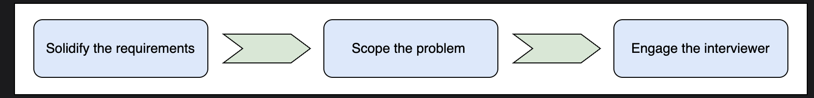

# System Design Interview Guide

## Introduction
A System Design interview is a technical evaluation of a candidate's ability to build robust and scalable systems. Unlike coding interviews, which typically involve a single solution, System Design interviews are open to discussion and involve multiple possible solutions that can be re-iterated.

## Key Aspects of System Design Interviews
It is important to note that System Design questions not only test the technical knowledge of the candidate but also their ability to:
- Approach a problem
- Think critically
- Make trade-offs

Therefore, preparing for a System Design interview is not only about understanding the technical details but also about:
1. Understanding the problem
2. Breaking it down
3. Finding the most optimal solution

## Essential Skills
**Two key skills for approaching the System Design Interview:**

1. How to learn the fundamentals of distributed systems quickly and apply these principles in solving real-world problems
2. How to evaluate candidates while interviewing for System Design

## The Counterintuitive Reality
Here's the counterintuitive part: in the System Design Interview, companies are not actually trying to test your experience with System Design. Successful candidates rarely have much experience working on large-scale systems, and interviewers know this. Again, this discipline has only been around for about fifteen years, and like everything else in software engineering, it is evolving rapidly.

## Approaching Design Questions
### How do we tackle a design question?
Design questions are open ended, and they're intentionally vague to start with. Such vagueness mimics the reality of modern day business.

**Example:**  
Interviewers often ask about a well-known problem,—for example, designing WhatsApp. Now, a real WhatsApp application has numerous features, and including all of them as requirements for our WhatsApp clone might not be a wise idea due to the following reasons:

1. We'll have limited time during the interview.
2. Working with some core functionalities of the system should be enough to exhibit our problem-solving skills.

We can tell the interviewer that there are many other things that a real WhatsApp does that we don't intend to include in our design. If the interviewer has any objections, we can change our plan of action accordingly.

## Best Practices
Here are some best practices that we should follow during a System Design interview:

1. **Ask clarifying questions:** An applicant should ask the right questions to solidify the requirements.
2. **Scope properly:** Applicants need to scope the problem to make a good attempt at solving it within the limited time frame (35-40 minutes).
3. **Communicate clearly:** It's not a good idea to silently work on the design. Instead, engage with the interviewer to ensure they understand your thought process.

## Scaling Considerations
Designing and operating a bigger system requires careful thinking because designs often don't linearly scale with increasing demands on the system.

### Common Interview Question
**Question:** Why don't we design a system that's already capable of handling more work than necessary or predicted?

**Answer:** Over-provisioning a system upfront leads to unnecessary complexity and cost. In System Design, we aim for a scalable architecture, building a system that can handle current loads efficiently while making it easy to scale horizontally or vertically as demand grows. Designing for hypothetical peak load from day one wastes resources and can result in over-engineered solutions that are harder to maintain and evolve.

## The Designer's Responsibility
As designers, we need to provide fault tolerance at the design level because almost all modern systems use off-the-shelf components, and there are millions of such components. So, something will always be breaking down, and we need to hide this undesirable reality from our customers.

## Distributed System Principles
Distributed systems give us guideposts for mature software principles. These include:

- **Robustness:** The ability to maintain operations during a crisis
- **Scalability**
- **Availability**
- **Performance**
- **Extensibility**
- **Resiliency:** The ability to return to normal operations post-disruption

Such terminology also acts as a common language between interviewer and candidate.

**Example:** We might say that we need to make a trade-off between availability and consistency when network components fail because the CAP theorem indicates that we can't have both under network partitions. Such common language helps with communication and shows that we're well-versed in both theory and practice.