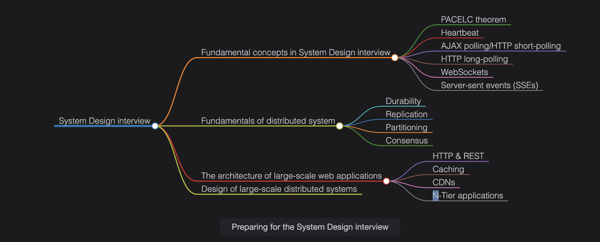
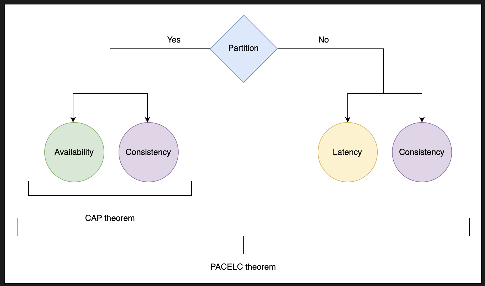

## Designing Systems Without Experience
How do we design a system in an interview if we have never built one in real life? To crack the System Design interview, we'll need to prepare in four areas:

- Fundamental concepts in System Design interview
- Fundamentals of distributed system
- The architecture of large-scale web applications
- Design of large-scale distributed systems
- Each of these dimensions flows into the next.

## Strategic Preparation Importance
Why is it important to prepare strategically?

How we prepare for an interview at Amazon will probably differ from how we'd prepare for one at Slack. While the overall interview process shares similarities across various companies, there are also distinct differences that we must prepare for. This is one of the reasons why preparing strategically is so important.

## Fundamental concepts in System Design interview
### PACELC Theorem

### Introduction
The CAP theorem doesn't answer the question: "What choices does a distributed system have when there are no network partitions?". The PACELC theorem answers this question.

The PACELC theorem states the following about a system that replicates data:
==if statement==: A distributed system can tradeoff between availability and consistency if there's a partition.  
==else statement==: When the system normally runs without partitions, the system can tradeoff between latency and consistency.  

### Detailed Explanation
The first three letters of the theorem, PAC, are the same as the CAP theorem. The ELC is the extension here. The theorem assumes we maintain high availability by replication. When there's a failure, the CAP theorem prevails. If there isn't a failure, we still have to consider the tradeoff between consistency and latency of a replicated system.

### Technical Breakdown

#### 1. Background
- **CAP theorem** says:  
  In the presence of a network partition (P), a distributed system must choose between Consistency (C) and Availability (A).
  
- **PACELC theorem** extends CAP by saying:  
  Even when there is no partition (Else, E), the system must still trade-off between Latency (L) and Consistency (C).

Systems fall into different categories depending on their behavior during partitions (P) and normal operation (E).

#### 2. System Categories

✅ **PC/EC → Partition + Consistency / Else Consistency**

**Examples:** BigTable, HBase

**Behavior:**
- During partition (P): Prefer Consistency (some requests may fail)
- No partition (E): Maintain Consistency (even with higher latency)

**Summary:** Always prioritize data correctness, never compromise on consistency.

✅ **PA/EL → Partition + Availability / Else Latency**

**Examples:** Dynamo, Cassandra

**Behavior:**
- During partition (P): Prefer Availability (may serve stale data)
- No partition (E): Aim for lower latency over strict consistency

**Summary:** Optimize for speed and availability, accepting occasional stale data.

✅ **PA/EC → Partition + Availability / Else Consistency**

**Example:** MongoDB

**Behavior:**
- During partition (P): Prefer Availability
- No partition (E): Ensure Consistency

**Summary:** Stay available during failures, consistent during normal operation.

#### 3. Bank System Analogy

**PC/EC (BigTable, HBase):**
- Network failure: "Service unavailable" rather than wrong balance
- Normal operation: Careful sync → slower but always correct

**PA/EL (Dynamo, Cassandra):**
- Network failure: Show last known balance (possibly outdated)
- Normal operation: Fast response over fully synced data

**PA/EC (MongoDB):**
- Network failure: Keep serving requests
- Normal operation: Ensure all data is consistent

**Key:**
- P = during Partition
- E = Else (normal situation)
Choices: C (Consistency), A (Availability), L (Latency)

### Heartbeat Mechanism
A heartbeat message is a mechanism that helps us detect failures in a distributed system:

1. **Centralized:** All servers periodically send heartbeat to central server
2. **Decentralized:** Servers randomly select peers to send heartbeats
3. **Failure Detection:** Missing heartbeats indicate potential failure/crash

### AJAX polling  
### HTTP long-polling  
### WebSockets  
### Server-sent events (SSEs)  

# Fundamentals of Distributed Systems

## Core Concepts
Understanding distributed systems fundamentals provides the framework for what's possible:

- Architecture limitations
- Trade-offs (e.g., consistency vs. write throughput)
- System strengths and weaknesses

### Key Topics:

#### Data Durability and Consistency
Understanding:
- Storage solution failure characteristics
- Corruption rates in read-write processes
- Impact on system design

#### Replication
- Key to data durability and consistency
- Involves:
  - Data backup
  - Process repetition at scale

#### Partitioning (Sharding)
- Divides data across different nodes
- Complements replication by:
  - Distributing processes
  - Reducing pure replication reliance

#### Consensus
One of our nodes is in Seattle, another is in Beijing, and another is in London. There is a system request at 7:05 a.m. Pacific Daylight Time. Given the travel time of data packets, can this be recorded and properly synchronized in the remote nodes, and can it be concurred? This is a simple problem of consensus—all the nodes need to agree, which will prevent faulty processes from running and ensure consistency and replication of data and processes across the system.  

Example scenario:
- Nodes in Seattle, Beijing, London
- Request at 7:05 a.m. PDT
- Challenges:
  - Data packet travel time
  - Synchronization across nodes
  - Agreement on system state

Ensures:
- Prevention of faulty processes
- Data/process consistency
- Proper replication

#### N-tier Applications
- Processing at multiple levels:
  - Client
  - Server
  - Other servers
- Key considerations:
  - Tier interactions
  - Process responsibility distribution

#### HTTP and REST
- **HTTP:** Foundational internet protocol
- **REST:** Design principles for:
  - Efficient, scalable systems
  - Component isolation
  - Open API advantages

#### DNS and Load Balancing
Example:
- 99 users → balanced across 3 servers (33 each)
- Benefits:
  - Prevents server overload
  - Ensures system stability
- Key skill: Proper request routing

## Stream Processing

### Definition
Processing data continuously as it arrives (vs. batch processing)

### Characteristics
- Real-time processing (like water flowing in a pipe)
- Uniform logic applied to each data item

### When to Use
Continuous data flows:
- Logs
- Sensors
- Social media
- Stock prices

### Advantages
1. Real-time insights
2. Memory efficient (no bulk storage needed)
3. Low latency

### Examples
- Netflix: Real-time recommendations
- Stock markets: Fraud detection
- Uber: Live tracking

**Remember:** Stream = real-time, continuous, immediate results