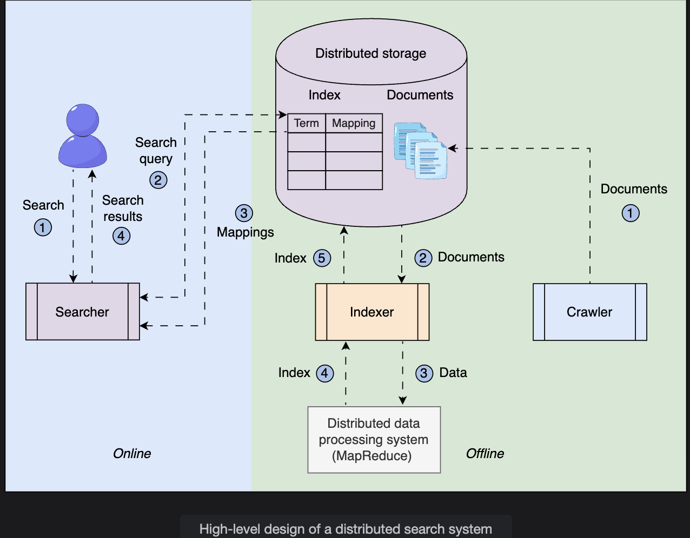
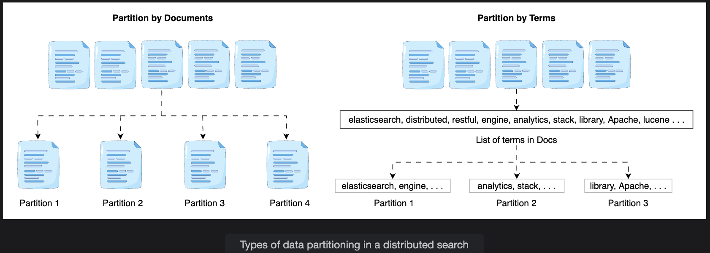
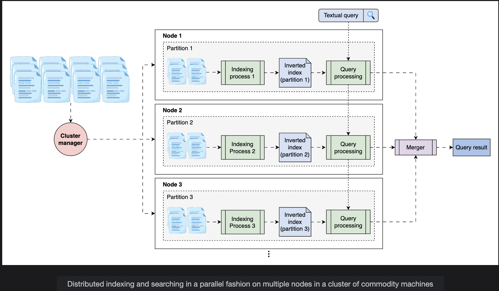
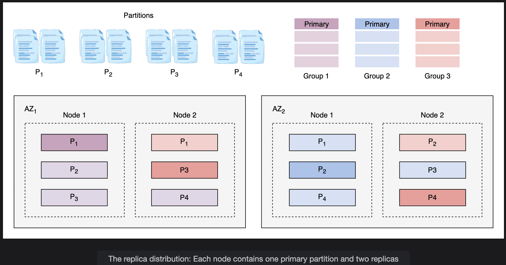

# Design of a Distributed Search System

> A walkthrough of how distributed search works — from high-level architecture through partitioning strategies, MapReduce-based indexing, parallel searching, and replica distribution across availability zones.

---

## Table of Contents

1. [High-Level Design](#1-high-level-design)
2. [API Design](#2-api-design)
3. [Distributed Indexing and Searching](#3-distributed-indexing-and-searching)
4. [Replication](#4-replication)
5. [Summary](#5-summary)

---

## 1. High-Level Design

A distributed search system operates in **two distinct phases**:

```
┌─────────────────────────────────────────────────────────────────┐
│                     OFFLINE PHASE                               │
│   (runs in background — no user interaction)                    │
│                                                                 │
│   Content Sources (YouTube, websites, etc.)                     │
│          │                                                      │
│          ▼                                                      │
│      [Crawler]                                                  │
│   - Fetches content                                             │
│   - Extracts text + metadata (title, description, transcript)   │
│   - Formats as JSON documents                                   │
│          │                                                      │
│          ▼                                                      │
│   [Distributed Storage]  ← Raw JSON documents stored here      │
│          │                                                      │
│          ▼                                                      │
│      [Indexer]                                                  │
│   - Fetches documents from storage                              │
│   - Builds inverted indexes using MapReduce                     │
│   - Stores resulting index table back to distributed storage    │
│          │                                                      │
│          ▼                                                      │
│   [Distributed Storage]  ← Index tables stored here            │
└─────────────────────────────────────────────────────────────────┘

┌─────────────────────────────────────────────────────────────────┐
│                      ONLINE PHASE                               │
│   (real-time — serves user queries)                             │
│                                                                 │
│   User submits search query                                     │
│          │                                                      │
│          ▼                                                      │
│      [Searcher]                                                 │
│   - Parses the query                                            │
│   - Maps query terms to the index                               │
│   - Handles spell correction                                    │
│   - Ranks results by relevance                                  │
│          │                                                      │
│          ▼                                                      │
│   Ranked results returned to user                               │
└─────────────────────────────────────────────────────────────────┘
```

### Component Responsibilities

| Component | Phase | Role |
|---|---|---|
| **Crawler** | Offline | Fetches content, extracts metadata, creates JSON documents |
| **Distributed Storage** | Both | Stores raw documents and the built index |
| **Indexer** | Offline | Builds inverted indexes from documents using MapReduce |
| **Searcher** | Online | Parses queries, looks up the index, returns ranked results |

---

## 2. API Design

The search API is intentionally simple — users send text, the system returns results.

### Search

```
search(query)
```

| Parameter | Description |
|---|---|
| `query` | The textual search string entered by the user. One or more words. |

```
Example calls:

  search("distributed search engine")
  search("machine learning tutorial beginners")
  search("elasticsearch vs solr")
```

The searcher handles everything internally: query parsing, spell correction, index lookup, relevance ranking, and result formatting.

---

## 3. Distributed Indexing and Searching

### The Core Problem

Building an inverted index over billions of documents on a single machine is impractical — the index can reach petabytes in size, and a single machine's RAM, CPU, and storage cannot keep up.

**Solution:** Distribute the work across a **cluster of low-cost commodity nodes**, coordinated by a **cluster manager**.

---

### Document vs Term Partitioning

Two strategies exist for splitting data across nodes:

#### Strategy 1: Term Partitioning

```
Split the dictionary of terms across nodes.

  Node A: handles terms starting with A-F
  Node B: handles terms starting with G-M
  Node C: handles terms starting with N-Z

Query: "search engine"
  "search" goes to Node C
  "engine" goes to Node A
  Results must be merged across Node A and Node C
```

| Pros | Cons |
|---|---|
| High concurrency per term | Multi-word queries require expensive cross-node data transfer |
| Node specialization | Node hotspots if some term ranges are more popular |

---

#### Strategy 2: Document Partitioning (Chosen)

```
Split documents into subsets. Each node indexes its own subset.

  Node 1: indexes documents 1 to 10,000
  Node 2: indexes documents 10,001 to 20,000
  Node 3: indexes documents 20,001 to 30,000

Query: "search engine"
  Sent to ALL nodes simultaneously
  Each node searches its local index
  Results merged centrally
```

| Pros | Cons |
|---|---|
| Less inter-node communication | Every query goes to every node |
| Simpler to implement | More nodes means more query fan-out |
| Multi-word queries handled locally per node | |

**Why document partitioning is preferred:** Queries are small text strings — cheap to broadcast to all nodes. In term partitioning, merging large posting lists across nodes is expensive. Document partitioning wins on overall efficiency.



---

### How the System Works

The system uses a **cluster manager** that applies a **MapReduce model** to parallelize index computation.

#### MapReduce in Brief

```
MapReduce handles datasets that exceed single-server capacity:

  Map phase:    Each node processes its partition independently
                Produces local key-value pairs (term to document mappings)

  Reduce phase: Results from all nodes are aggregated
                Produces the final merged inverted index
```

---

#### Indexing Flow (Step by Step)

```
Step 1: Crawler collects the full document set

Step 2: Cluster manager splits documents into N partitions
         - Based on data size and node availability
         - A hashing function assigns each document to a partition
         - Cluster manager monitors node health via periodic heartbeats

Step 3: Cluster manager runs indexing simultaneously on all N nodes
         - Each node indexes only its assigned partition
         - Each node produces a local "tiny" inverted index
         - N smaller indexes instead of one giant index
```

```
Visualization (N = 4 partitions):

  Full Document Set
        |
        |-- Partition 1 --> Node 1 --> Local Index 1
        |-- Partition 2 --> Node 2 --> Local Index 2
        |-- Partition 3 --> Node 3 --> Local Index 3
        `-- Partition 4 --> Node 4 --> Local Index 4
```

---

#### Searching Flow (Step by Step)

```
Step 1: User submits a search query

Step 2: Query is sent to ALL N nodes simultaneously (parallel search)

Step 3: Each node searches its local index
         Returns a list of term-to-document mappings for the query terms

Step 4: Merger aggregates all lists from all nodes

Step 5: Merger sorts the aggregated list by term frequency (relevance)

Step 6: Top ranked results returned to the user
```

```
Visualization:

  Query: "search engine"
        |
        |-- Node 1 searches Local Index 1 --> results_1
        |-- Node 2 searches Local Index 2 --> results_2
        |-- Node 3 searches Local Index 3 --> results_3
        `-- Node 4 searches Local Index 4 --> results_4
                                                  |
                                             [Merger]
                                        Aggregates + ranks
                                                  |
                                        Top results to user
```

---

### Colocation

**Colocation** means indexing and searching happen **on the same nodes** — not on separate clusters.

```
Each node:
  - Stores its partition of documents
  - Maintains its local inverted index
  - Answers search queries against its local index

Benefits:
  No data transfer between a separate indexing cluster and search cluster
  Smaller working set per node fits in RAM
  Large datasets handled by working on smaller partitions in parallel
```

---

### Global Replication Across Data Centers

The entire cluster design can be replicated across multiple data centers worldwide:

```
  Data Center (US-East)     Data Center (EU-West)     Data Center (Asia-Pacific)
  ---------------------     ---------------------     --------------------------
  Full cluster replica      Full cluster replica      Full cluster replica
  (all N partitions)        (all N partitions)        (all N partitions)
```

**Benefits of global replication:**

| Benefit | Explanation |
|---|---|
| No SPOF | If one data center fails, others continue serving queries |
| Low latency | Users routed to nearest data center |
| Maintainability | Individual DCs can be upgraded without global downtime |
| Scalability | More data centers = more users served per second globally |

---

## 4. Replication

Within a single data center, **each partition is also replicated** across multiple nodes. Instead of one group of N nodes, the system maintains **R groups** where R is the replication factor. Each group independently contains all partitions needed to answer any query.

```
Without replication:
  Node 2 fails -> Partition 2 is lost -> Queries return incomplete results

With replication (R = 3):
  Node 2 fails -> Replica nodes have copies of Partition 2 -> Query continues
```

A **load balancer** distributes queries across groups and retries on failures.

---

### Replication Factor and Replica Distribution

**Example setup:**
- 4 document partitions: P1, P2, P3, P4
- Replication factor: 3 (each partition stored on 3 nodes)
- 2 availability zones: AZ1 and AZ2
- 2 nodes per availability zone (4 nodes total)

```
         AZ1                        AZ2
  +------------------+      +------------------+
  |     Node 1       |      |     Node 3       |
  | Primary    : P1  |      | Primary    : P3  |
  | Replica    : P2  |      | Replica    : P4  |
  | Replica    : P4  |      | Replica    : P2  |
  +------------------+      +------------------+

  +------------------+      +------------------+
  |     Node 2       |      |     Node 4       |
  | Primary    : P2  |      | Primary    : P4  |
  | Replica    : P1  |      | Replica    : P1  |
  | Replica    : P3  |      | Replica    : P3  |
  +------------------+      +------------------+
```

**For Partition P4 (example):**
```
  Primary replica:  Node 4 in AZ2
  Second replica:   Node 3 in AZ2
  Third replica:    Node 1 in AZ1

  -> 2 copies in AZ2, 1 copy in AZ1
  -> If AZ2 fails entirely -> 1 copy survives in AZ1
```

Each node serves as:
- **Primary** for one partition
- **Replica** for two other partitions

**Key rule:** All nodes build indexes in the same order to reach a consistent state across all replicas.


---

### Indexing with Replicas

```
New documents arrive for Partition 2

  -> Forwarded to all 3 replicas of Partition 2 simultaneously
  -> All 3 nodes compute the index update in parallel
  -> Consistent state maintained across all replicas

If primary node fails during indexing:
  -> Indexing continues on the two replica nodes
  -> No data loss, no interruption
```

---

### Searching with Replicas

```
Query arrives

  -> Load balancer selects ONE replica per partition for this query
  -> Results from selected replicas merged and returned

Effect on read capacity:
  1 group (no replication):   1x read capacity
  3 groups (R = 3):           3x read capacity
```

Each group is hosted in a **different Availability Zone** — so even if an entire AZ fails, other groups continue serving queries.

---

## 5. Summary

### Architecture at a Glance

```
OFFLINE PHASE:
  Crawler -> JSON Documents -> Distributed Storage
                                      |
                                 [Indexer + MapReduce]
                                      |
                               N Local Inverted Indexes
                               (one per partition node)

ONLINE PHASE:
  User Query
       |
  [Load Balancer]  <-- routes to one of R replica groups
       |
  [All N nodes in selected group searched in parallel]
       |
  [Merger: aggregate + rank by term frequency]
       |
  Top results returned to user
```

### Key Design Decisions

| Decision | Choice | Reason |
|---|---|---|
| Partitioning strategy | Document partitioning | Less inter-node communication than term partitioning |
| Indexing model | MapReduce on commodity cluster | Handles petabyte-scale data cost-effectively |
| Colocation | Indexing + searching on same nodes | No data transfer between separate clusters |
| Replication factor | 3 | Balances redundancy, cost, and read throughput |
| Replica placement | Across availability zones | Survives full AZ failure |
| Global deployment | Multi data center | Low latency + no global SPOF |

### What Each Design Choice Achieves

```
Document partitioning  -> Scalability + low inter-node cost
MapReduce              -> Parallelism + handles data beyond single-machine RAM
Colocation             -> Efficiency + smaller per-node working set
Replication (R=3)      -> 3x read capacity + fault tolerance
AZ distribution        -> Availability during data center failures
Multi-DC deployment    -> Global availability + low user latency
```

---

