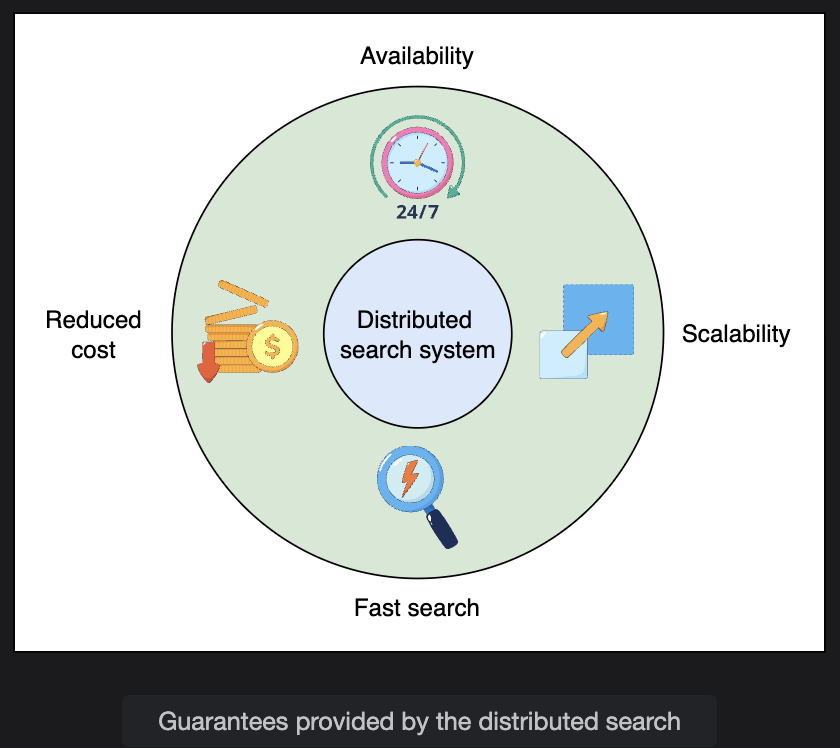

# Evaluation of a Distributed Search's Design

> Analyzing how the distributed search architecture satisfies each non-functional requirement — availability, scalability, fast search, and cost reduction — and exploring caching opportunities and trade-offs.

---

## Table of Contents

1. [Availability](#1-availability)
2. [Scalability](#2-scalability)
3. [Fast Search on Big Data](#3-fast-search-on-big-data)
4. [Reduced Cost](#4-reduced-cost)
5. [Caching: Opportunities and Trade-offs](#5-caching-opportunities-and-trade-offs)
6. [Requirements Compliance Summary](#6-requirements-compliance-summary)
7. [Conclusion](#7-conclusion)

---

## 1. Availability

**Goal:** The system must remain accessible to users even during node failures, AZ outages, or regional disasters.

### How the Design Achieves It

#### Distributed Storage as the Foundation

```
Distributed storage persists two critical datasets:

  1. Raw documents crawled by the indexer
  2. Inverted index files generated by indexing nodes

Distributed storage replicates data across regions:
  -> Supports cross-region deployment
  -> Enables disaster recovery if an entire region goes down
```

#### Multi-AZ Cluster Deployment

```
Indexing and search clusters are deployed across multiple Availability Zones:

  AZ1: Indexer cluster + Searcher cluster (Group 1)
  AZ2: Indexer cluster + Searcher cluster (Group 2)
  AZ3: Indexer cluster + Searcher cluster (Group 3)

  AZ1 goes down?
    -> Traffic redirected to AZ2 or AZ3
    -> No user-facing outage

  Within each AZ:
    -> Redundant nodes provide intra-AZ failover
    -> One node fails -> another node in the same cluster absorbs its load
```

#### Indexing is Off the Critical Path

```
User sends search query
       |
       v
[Searcher Cluster]  <-- reads from local cached index
       |
       v
Results returned to user   <- NO dependency on live indexing

Indexing runs OFFLINE:
  New documents arrive -> indexer processes them -> pushes to distributed storage
  Searcher nodes download updated index files asynchronously

  Result: Search queries do not wait for indexing to complete
          No replication delay impacts search availability
```

This decoupling is the key availability insight: **search never blocks on indexing**.

```
Availability timeline:

  t=0:  New documents ingested, indexing starts
  t=1:  Indexing completes, index file pushed to distributed storage
  t=2:  Searcher nodes download updated index file
  t=3:  Queries reflect updated content

  During t=0 to t=2: Search is still fully available
                      (serving results from the previous index version)
```

---


## 2. Scalability

**Goal:** The system must handle growing document volumes and increasing query load without redesign.

### How the Design Achieves It

#### Horizontal Scaling via Partitioning

```
Increasing indexing capacity:
  Add more document partitions + add more indexer nodes
  -> Each node handles a smaller subset of documents
  -> Total indexing throughput scales linearly

Increasing search capacity:
  Add more searcher nodes (each downloads a copy of the relevant index partition)
  -> More nodes = more parallel query handlers
  -> Total query throughput scales linearly
```

#### Independent Scaling of Indexing and Search

```
Scenario A: Document ingestion spike (e.g., major news event, batch upload)

  High indexing load   -> Scale up ONLY the indexer cluster
  Search load normal   -> Searcher cluster unchanged
  Cost:  targeted, minimal

Scenario B: Search traffic spike (e.g., peak shopping season, viral event)

  Search load high     -> Scale up ONLY the searcher cluster
  Indexing load normal -> Indexer cluster unchanged
  Cost: targeted, minimal

Without separation:
  Both scenarios would require scaling ALL nodes together -> expensive
```

```
Scaling dimensions:

  +------------------+---------------------+
  | Load Type        | What to Scale       |
  +------------------+---------------------+
  | More documents   | Add indexer nodes   |
  | More partitions  | Expand both clusters|
  | More queries     | Add searcher nodes  |
  | More regions     | Deploy new AZ group |
  +------------------+---------------------+
```

---

## 3. Fast Search on Big Data

**Goal:** Users must receive results in milliseconds, regardless of index size.

### How the Design Achieves It

#### Parallel Search Across Partitions

```
Instead of one node searching a massive index:

  Query: "machine learning tutorial"
        |
        +----> Searcher Node 1 (searches Partition 1)  -> partial results
        +----> Searcher Node 2 (searches Partition 2)  -> partial results
        +----> Searcher Node 3 (searches Partition 3)  -> partial results
        `----> Searcher Node N (searches Partition N)  -> partial results
                                                              |
                                                         [Merger]
                                                    Aggregates + ranks
                                                              |
                                                    Final results to user

Total query time ≈ time to search ONE partition (not all N)
because all N partitions are searched simultaneously.
```

#### Why This Works at Scale

```
Without partitioning:
  1 node, 1 TB index  -> scan 1 TB to answer a query
  Time: slow (proportional to total data size)

With N partitions, N nodes:
  Each node holds (1 TB / N) of index
  All N nodes searched in parallel
  Time: fast (proportional to 1/N of total data size)

Adding more nodes -> smaller partitions -> faster queries
```

---

## 4. Reduced Cost

**Goal:** Build and operate the system efficiently using low-cost hardware.

### How the Design Achieves It

#### Commodity Hardware

```
No need for specialized, expensive servers.
The system runs on standard commodity nodes:
  -> Lower hardware cost per node
  -> Easy to replace failed nodes
  -> Cloud instances are cheap and abundant
```

#### Targeted Re-indexing on Failure

```
Node failure scenario:

  Without smart design:
    Node X fails -> re-index the ENTIRE document set
    Cost: enormous (hours or days of computation)

  With partitioned design:
    Node X fails -> re-index ONLY the documents in Node X's partition
    Cost: proportional to partition size, not total index size

  Example:
    Total documents: 10 billion
    Partitions: 1,000
    Documents per partition: 10 million

    Node fails -> re-index 10 million documents (0.1% of total)
    Not 10 billion documents (100%)
```

#### Cost vs Performance Balance

```
Scale up (more nodes):    Higher cost, faster queries, higher throughput
Scale down (fewer nodes): Lower cost, slower queries, lower throughput

The architecture allows fine-grained cost tuning by adjusting:
  - Number of partitions
  - Number of indexer nodes
  - Number of searcher nodes
  - Number of AZ replica groups (replication factor)
```

---

## 5. Caching: Opportunities and Trade-offs

> **Scenario:** You are a software engineer for a rapidly growing e-commerce site with slow search response times, especially during peak loads. Identify components of the distributed search that can benefit from caching, and the trade-offs to consider.

---

### Where Caching Helps

#### Cache 1: Searcher Node — Hot Index Segments in RAM

```
What: Frequently queried index partitions cached in RAM on searcher nodes
Why:  Disk reads are slow (milliseconds); RAM reads are fast (nanoseconds)

Without cache:  Every query reads index from disk
With cache:     Popular index segments served from RAM instantly

Best for: Terms that appear in many queries
          (e.g., product categories: "shoes", "laptop", "deal")
```

#### Cache 2: Merger Node — Query Result Cache

```
What: Cache the final ranked results for recently or frequently seen queries
Why:  Identical queries are common, especially for popular searches

Without cache:  "nike shoes" queried 10,000 times -> 10,000 full index lookups
With cache:     First query computes result, next 9,999 served from cache

Best for: Top-N most popular queries (e.g., trending products, homepage suggestions)
```

#### Cache 3: Front-End / API Layer — Response Cache

```
What: Cache serialized search responses at the API layer (e.g., CDN or Redis)
Why:  Avoid hitting the search cluster entirely for identical requests

Best for: Anonymous users searching common terms
          (personalization is not needed, so caching is safe)
```

---

### Trade-offs to Consider

#### Trade-off 1: Cache Freshness vs Performance

```
E-commerce problem: Product availability changes constantly
  - A cached result may show an out-of-stock item as available
  - A new product launch won't appear in search until cache expires

Solution options:
  Short TTL (e.g., 30 seconds):  Fresh data, but less cache benefit
  Long TTL (e.g., 10 minutes):   Better performance, but stale results risk

  Best practice: Use short TTL for inventory-sensitive queries
                 Use longer TTL for static content (category pages, brand names)
```

#### Trade-off 2: Personalized Results Can't Be Cached Globally

```
Personalized search: "shoes" for User A -> running shoes (based on history)
                     "shoes" for User B -> dress shoes (based on history)

A shared cache entry for "shoes" would return the same result to both users.

Solution: Cache only for non-personalized queries
          OR cache per user (but this explodes cache size significantly)
          OR cache the base result and apply personalization as a post-processing step
```

#### Trade-off 3: Cache Invalidation Complexity

```
When a new product is added or a price changes:
  -> All cached results containing that product may be stale
  -> Invalidating the right cache entries is hard

Naive approach: Invalidate ALL entries on any product update
  -> Cache is constantly cleared -> no performance benefit during high-update periods

Better approach: Tag cache entries by product category or affected terms
  -> Only invalidate entries related to changed products
  -> Requires more complex cache management logic
```

#### Trade-off 4: Memory Cost

```
Caching large index segments in RAM is expensive:

  Index partition size: 50 GB
  Searcher nodes: 100
  RAM per node: 128 GB

  If we cache entire partitions in RAM:
    50 GB of 128 GB used for cache -> 39% of RAM consumed by cache
    Less RAM for query processing -> potential performance degradation elsewhere

  Solution: Cache only the HOT 20% of index data that answers 80% of queries
            (Pareto principle applied to caching)
```

---

### Caching Summary

| Cache Location | What's Cached | Benefit | Key Trade-off |
|---|---|---|---|
| Searcher node RAM | Hot index segments | Near-zero disk I/O for popular terms | Memory cost; cold segments still hit disk |
| Merger node | Recent/frequent query results | Skips full index lookup for repeat queries | Stale results if products change |
| API / CDN layer | Serialized search responses | Reduces load on entire search stack | Can't cache personalized results |

---

## 6. Requirements Compliance Summary

| Requirement | Mechanism | Status |
|---|---|---|
| **Availability** | Multi-AZ deployment, distributed storage replication, offline indexing decoupled from search | Meets requirement |
| **Scalability** | Partitioning enables horizontal scaling; independent scaling of indexer and searcher clusters | Meets requirement |
| **Fast search** | Parallel query execution across N partitions; merger aggregates results; RAM caching | Meets requirement |
| **Reduced cost** | Commodity hardware; only affected partition re-indexed on node failure | Meets requirement |

### How Design Decisions Serve Multiple Requirements

```
Partitioning:
  -> Scalability (add more partitions/nodes)
  -> Fast search (smaller index per node -> faster lookup)
  -> Reduced cost (only re-index failed partition, not entire dataset)

Separation of indexing and search:
  -> Availability (search never waits for indexing)
  -> Scalability (independent scaling of each cluster)
  -> Fast search (dedicated resources for query serving)

Distributed storage:
  -> Availability (replication across regions)
  -> Reduced cost (no redundant index recomputation)
  -> Scalability (shared storage decouples indexers from searchers)

Multi-AZ deployment:
  -> Availability (failover across zones)
  -> Scalability (more AZ groups = more query capacity)
```

---

## 7. Conclusion

Single-node search systems cannot scale to meet modern search workloads. As document volumes grow to petabytes and query rates reach hundreds of millions per day, the limitations of centralized architecture become insurmountable.

The distributed search design resolves this through three core principles:

```
1. PARALLELISM
   Partition data across many nodes
   Execute searches simultaneously across all partitions
   -> Query time independent of total data size

2. ISOLATION
   Separate indexing and search into dedicated clusters
   -> No resource contention
   -> Independent scaling
   -> Indexing never degrades search availability

3. COMMODITY HARDWARE
   Use low-cost, replaceable nodes instead of expensive specialized machines
   -> Lower capital cost
   -> Targeted recovery on failure (re-index one partition, not everything)
   -> Elastic scaling on cloud infrastructure
```

Together, these principles produce a system that achieves:

```
High availability      -> Multi-AZ + distributed storage replication
Horizontal scalability -> Add nodes/partitions as load grows
Low query latency      -> Parallel search + RAM caching
Low operational cost   -> Commodity hardware + targeted re-indexing
```

---

