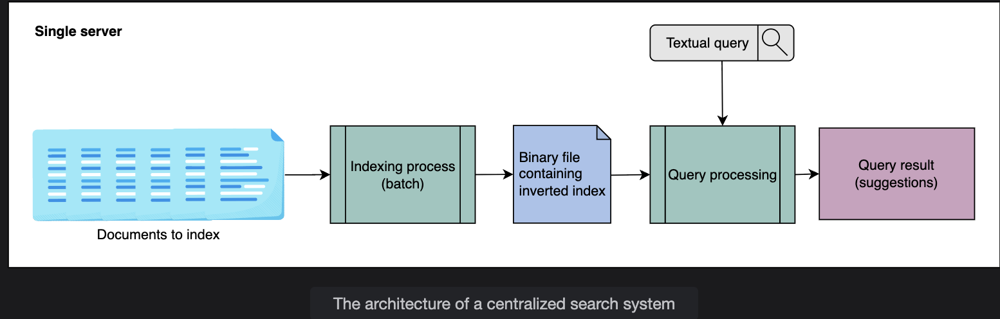

# Indexing in a Distributed Search

> Understanding how indexes work, why simple approaches fail at scale, how inverted indexes solve the problem, and why centralized indexing breaks down at petabyte scale.

---

## Table of Contents

1. [What is Indexing?](#1-what-is-indexing)
2. [Simple Document Index](#2-simple-document-index)
3. [Inverted Index](#3-inverted-index)
4. [Searching from an Inverted Index](#4-searching-from-an-inverted-index)
5. [Factors of Index Design](#5-factors-of-index-design)
6. [Centralized Indexing — Problems](#6-centralized-indexing--problems)
7. [Key Design Questions & Answers](#7-key-design-questions--answers)
8. [Summary](#8-summary)

---

## 1. What is Indexing?

**Indexing** is the organization and manipulation of data done to facilitate **fast and accurate information retrieval**.

```
Without indexing:
  Search query arrives
       │
       ▼
  Scan every document, one by one
  Count occurrences of the search term in each
       │
       ▼
  Return results  ← could take minutes or hours at scale

With indexing:
  Search query arrives
       │
       ▼
  Look up the term directly in the pre-built index
       │
       ▼
  Return results in milliseconds ✅
```

The goal of indexing is to do the expensive work **upfront at write time**, so that **reads (searches) are fast**.

---

## 2. Simple Document Index

### The Naive Approach

The simplest index assigns a unique ID to each document and stores it in a table:

### Simple Document Index Table

| ID | Document Content |
|----|-----------------|
| 1 | Elasticsearch is the distributed and analytics engine that is based on REST APIs. |
| 2 | Elasticsearch is a Lucene library-based search engine. |
| 3 | Elasticsearch is a distributed search and analytics engine built on Apache Lucene. |

### Why This Doesn't Scale

To search for a term in this structure, you must:

```
Step 1: Traverse ALL documents (every row in the table)
Step 2: Count occurrences of the search term in each document
Step 3: Rank and return results

With 3 documents   → fast
With 3 billion documents → could take minutes or hours
```

### Response Time Depends On

- **Data organization strategy** — how the data is laid out in storage
- **Size of the data** — more documents = longer scan
- **Processing speed and RAM** — limited by single-machine resources

### The Fuzzy Search Problem

For fuzzy (approximate) search, it gets even worse:

```
User searches: "Elasticsrch" (typo)

Simple index must:
  1. Traverse ALL documents to find candidate strings
  2. Run pattern-matching on each
  3. Find the closest match
  4. Count its occurrences across all documents

→ Every query becomes a full scan with expensive string matching
→ Completely impractical at scale
```

---

## 3. Inverted Index

### Core Idea

Instead of storing documents as whole units, **split them into individual words** and build a map from **words → documents** (the reverse of the document → words direction, hence "inverted").

### Building the Inverted Index

```
Step 1: Split each document into individual words (tokenize)

Step 2: Remove stop words — frequently occurring words that add no
        search value: "to", "the", "is", "they", "and", "a", etc.

Step 3: Identify all unique terms remaining

Step 4: For each unique term, record:
          - Which documents contain it
          - How many times it appears in each document
          - Where (position) it appears in each document
```

### The Document-Term Matrix

Using the three example documents:

```
Doc 1: "Elasticsearch is the distributed and analytics engine that is based on REST APIs."
Doc 2: "Elasticsearch is a Lucene library-based search engine."
Doc 3: "Elasticsearch is a distributed search and analytics engine built on Apache Lucene."
```

After tokenization and stop word removal, the inverted index looks like this:

### Inverted Index Table

Format: `([documents], [frequencies], [[positions]])`

| Term | Mapping: ([doc], [freq], [[loc]]) |
|------|----------------------------------|
| elasticsearch | ([1, 2, 3], [1, 1, 1], [[1], [1], [1]]) |
| distributed | ([1, 3], [1, 1], [[4], [4]]) |
| restful | ([1], [1], [[5]]) |
| search | ([1, 2, 3], [1, 1, 1], [[6], [4], [5]]) |
| analytics | ([1, 3], [1, 1], [[8], [7]]) |
| engine | ([1, 2, 3], [1, 1, 1], [[9], [5], [8]]) |
| heart | ([1], [1], [[12]]) |
| elastic | ([1], [1], [[15]]) |
| stack | ([1], [1], [[16]]) |
| lucene | ([2, 3], [1, 1], [[9], [12]]) |
| library | ([2], [1], [[10]]) |
| Apache | ([3], [1], [[11]]) |

### Reading the Mapping

Each entry has three lists:

| List | Meaning |
|---|---|
| `[doc]` | Which documents contain this term |
| `[freq]` | How many times the term appears in each of those documents |
| `[[loc]]` | The exact position(s) of the term in each document (2D because a term can appear multiple times in one doc) |

**Example — reading the `search` entry:**
```
search → ([1, 2, 3], [1, 1, 1], [[6], [4], [5]])

  Appears in: documents 1, 2, and 3
  Frequency:  once in each document
  Position:   word #6 in doc 1, word #4 in doc 2, word #5 in doc 3
```

---

### Stop Words — Design Trade-off

> ❓ **Q: If stop words are removed to shrink the index for storage and performance improvement, what design trade-off does that reveal about search behavior?**

**A:** Removing stop words makes a fundamental assumption: **words like "the", "is", "a", "to" carry no meaningful search signal**. That assumption holds most of the time — but not always.

**Where stop word removal works well:**
```
Query: "distributed search engine"
Stop words removed: none in this case
Result: highly relevant documents returned ✅
```

**Where stop word removal breaks:**
```
Query: "to be or not to be"  (Shakespeare)
After removing stop words: "" (empty query)
Result: nothing returned ❌

Query: "The Who"  (band name)
After removing stop words: "" (empty — both are stop words)
Result: nothing returned ❌

Query: "How to search"
After removing "to": "How search"
Result: potentially different, less accurate results ⚠️
```

**The core trade-off:**

| Removing Stop Words | Keeping Stop Words |
|---|---|
| ✅ Smaller index size | ❌ Larger index |
| ✅ Faster search | ❌ Slower search |
| ✅ Less storage | ❌ More storage |
| ❌ Breaks phrase/exact searches | ✅ Supports exact phrase matching |
| ❌ Fails on titles that are stop words | ✅ Handles any query correctly |

**Modern solution:** Many search systems use **positional indexes** and handle stop words contextually — removing them for general keyword search but preserving them for exact phrase queries (e.g., when a user puts quotes around their search).

---

### Advantages of an Inverted Index

- ✅ Enables **full-text search** efficiently
- ✅ **Pre-computes term frequencies** — no need to count occurrences at query time
- ✅ Supports many search algorithms: boolean, proximity, relevance ranking, and more
- ✅ Lookup is O(1) per term (HashMap-like structure) instead of O(n) document scan

### Disadvantages of an Inverted Index

- ❌ **Storage overhead** — the index itself takes up significant space alongside the original documents
- ❌ **Maintenance cost** on document changes:

```
Adding a document:
  1. Extract all terms from the new document
  2. For each term: add new row OR update existing row in the index

Deleting a document:
  1. Find all index entries that reference this document
  2. Remove the document from each term's mapping
  3. If no documents remain for a term → remove the term row entirely

Updating a document:
  Effectively a delete + add (most expensive operation)
```

---

## 4. Searching from an Inverted Index

### Example: Searching "search engine"

The query has two terms. Look each up in the index:

| Term | Documents | Positions |
|---|---|---|
| search | [1, 2, 3] | pos 6 in doc1, pos 4 in doc2, pos 5 in doc3 |
| engine | [1, 2, 3] | pos 9 in doc1, pos 5 in doc2, pos 8 in doc3 |

**Intersection:** Both terms appear in documents 1, 2, and 3.

```
For each document, compute adjacency:

Doc 1: "search" at pos 6, "engine" at pos 9 → gap = 3
Doc 2: "search" at pos 4, "engine" at pos 5 → gap = 1 ← closest (likely most relevant)
Doc 3: "search" at pos 5, "engine" at pos 8 → gap = 3
```

Smaller gap between term positions → the phrase appears closer together → **higher relevance score** → ranked higher in results.

---

### What If Too Many Documents Match a Single Term?

> ❓ **Q: Would returning all matched documents work when a single term appears in millions of documents?**

**A:** No. Returning millions of results is not useful or practical. Instead:

```
Step 1: Find all documents containing the term
Step 2: Score each document for relevance to the query
         (using term frequency, position, document authority, etc.)
Step 3: Sort by relevance score (descending)
Step 4: Return only the top N results (e.g., top 10 or top 80)
```

This is why search engines return "about 2,340,000,000 results" but only show 10 per page — the full list is computed, but only the top results are served.

---

## 5. Factors of Index Design

When designing an index, these five factors must be balanced:

| Factor | Key Question | Design Implication |
|---|---|---|
| **Size of the index** | How much RAM is needed? | Index must fit in RAM for low-latency search — large indexes require distribution |
| **Search speed** | How fast can a term be found? | HashMap-based inverted index gives near O(1) lookup |
| **Maintenance** | How efficiently can the index be updated? | Add/update/delete all require index modifications — must be optimized |
| **Fault tolerance** | What happens if hardware fails or data is corrupted? | Partitioning + replication prevent single points of failure |
| **Resilience** | Can the system resist gaming? | SEO schemes try to exploit ranking — index design must guard against manipulation |

---

## 6. Centralized Indexing — Problems

### Architecture

In a centralized system, all components (crawler, indexer, searcher) run on **a single node**:

```
┌─────────────────────────────────────────┐
│           Single Powerful Node           │
│                                          │
│  Documents → [Indexer] → inverted index  │
│              (binary file)               │
│                   │                      │
│              [Searcher]                  │
│                   │                      │
│              Query results               │
└─────────────────────────────────────────┘
```

The indexer converts documents into a binary inverted index file. The searcher reads that file, computes intersections of inverted lists, and returns results.


### Three Core Problems

---

#### Problem 1: Single Point of Failure (SPOF)

```
If the single node goes down:
  → No search queries can be processed
  → Entire search service is unavailable
  → No redundancy or failover
```

---

#### Problem 2: Server Overload

```
Many users + complex queries = server stress

Complex query example:
  "distributed search engine for real-time analytics"
  → 5 terms × millions of documents each
  → Large intersection computations
  → All on one CPU/RAM
```

---

#### Problem 3: Index Size Exceeds Single Machine Capacity

```
Google 2022 stats:
  Web pages:  hundreds of billions
  Total size: ~100 petabytes
  Inverted index size: also in petabytes

Single machine RAM: at most a few TBs (generously)

Loading petabytes of index into RAM on one machine:
  → Physically impossible
  → Even if possible: prohibitively expensive
  → Search response time would be very slow
```

```
Analogy:
  Searching 1 book from a shelf of 100 books   → easy, fast
  Searching 1 book from a shelf of 1 million   → slow, impractical

Search time grows with the volume of data searched.
```

### Why Distributed is the Answer

| Problem | Centralized Failure | Distributed Solution |
|---|---|---|
| SPOF | One failure = total outage | Replicate across nodes; one fails, others serve |
| Server overload | One machine handles all load | Distribute queries across many nodes |
| Index size | Can't fit petabytes in one RAM | Shard the index across hundreds of machines |
| Cost | One huge expensive machine | Many cheap commodity servers |
| Attack surface | Single target, high impact | Distributed — attacks affect only part of system |

> Attacks on centralized indexing have a **higher blast radius** than attacks on a distributed system — another reason to distribute.

---

## 7. Key Design Questions & Answers

Already covered inline above:
- **Stop word trade-off** → Section 3
- **Too many documents per term** → Section 4
- **Centralized SPOF** → Section 6

---

## 8. Summary

```
INDEXING APPROACHES:

  Simple Document Index:
    → Store whole docs with IDs
    → Search = full scan of all docs
    → O(n) per query — unusable at scale

  Inverted Index:
    → Split docs into terms, remove stop words
    → Map: term → [documents, frequencies, positions]
    → Search = O(1) lookup per term
    → Pre-computed at write time → fast reads

INVERTED INDEX TRADE-OFFS:
    ✅ Fast search, full-text support
    ❌ Storage overhead + maintenance cost on updates

STOP WORD REMOVAL TRADE-OFF:
    ✅ Smaller index, faster search
    ❌ Breaks exact phrase queries (e.g. "to be or not to be", "The Who")

CENTRALIZED INDEXING PROBLEMS:
    ❌ SPOF — one failure = total outage
    ❌ Server overload — one node handles all queries
    ❌ Index too large — petabytes can't fit in one machine's RAM

→ Solution: Distributed indexing (covered in next lessons)
```

---

