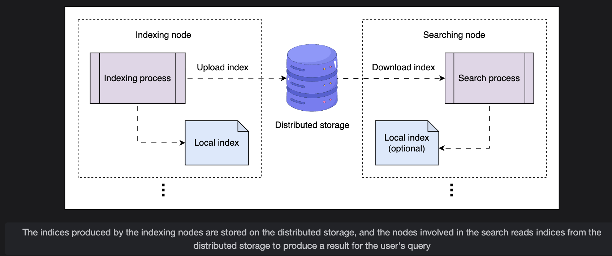
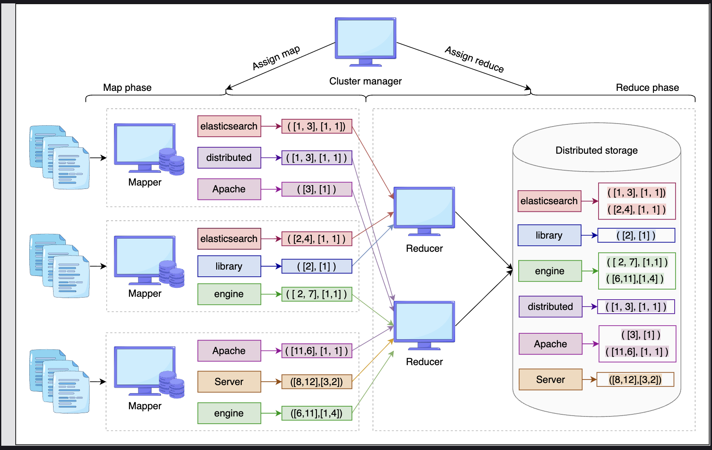

# Scaling Search and Indexing

> Resolving the resource contention and scalability problems of colocated indexing and searching — by separating roles, using distributed storage, and applying MapReduce for efficient parallel index generation.

---

## Table of Contents

1. [Problems with the Previous Design](#1-problems-with-the-previous-design)
2. [Initial Solution — Compute Once, Distribute](#2-initial-solution--compute-once-distribute)
3. [Final Solution — Separate Indexing and Searching](#3-final-solution--separate-indexing-and-searching)
4. [Detailed Workflow](#4-detailed-workflow)
5. [Indexing with MapReduce](#5-indexing-with-mapreduce)
6. [Key Design Questions and Answers](#6-key-design-questions-and-answers)
7. [Summary](#7-summary)

---

## 1. Problems with the Previous Design

The colocated design from the previous lesson — where indexing and searching run on the same nodes — has two critical problems at scale.

---

### Problem 1: Resource Contention from Colocation

```
Single Node (previous design):
  +----------------------------------+
  |  [Indexer]      [Searcher]       |
  |  CPU-heavy      CPU-heavy        |
  |  RAM-heavy      RAM-heavy        |
  |                                  |
  |  Both compete for the same       |
  |  CPU, RAM, disk I/O              |
  +----------------------------------+

Result:
  Indexing slows down searching
  Searching slows down indexing
  Both degrade each other's performance
```

Additionally, you cannot scale them independently:
- Indexing load spikes when many new documents arrive
- Search load spikes during peak user traffic
- With colocation, scaling one means scaling both — wasteful and inflexible

---

### Problem 2: Redundant Index Recomputation

```
With replication factor R = 3:

  Node 1 (primary):  computes inverted index  <- full pipeline, hundreds of ops
  Node 2 (replica):  computes inverted index  <- same work, again
  Node 3 (replica):  computes inverted index  <- same work, again

Index construction is a heavy pipeline involving hundreds of operations.
Doing it 3 times on 3 machines to get the same result is pure waste.
```

---

### Problems Summary

| Problem | Root Cause | Impact |
|---|---|---|
| Resource contention | Indexing + searching share the same node's CPU/RAM | Both operations slow down under load |
| No independent scaling | Roles are tied together | Can't scale search without scaling indexing |
| Redundant computation | Every replica recomputes the same index | Wasted CPU and memory across all replicas |

---

## 2. Initial Solution — Compute Once, Distribute

A natural first fix: **compute the inverted index once on the primary node**, then distribute the resulting binary file to replicas — avoiding redundant computation.

```
Primary node:
  Computes inverted index once
  Produces index binary file
        |
        +----> Replica 1: receives index file (no recomputation)
        +----> Replica 2: receives index file (no recomputation)
        +----> Replica 3: receives index file (no recomputation)
```

This saves CPU and memory on every replica. But it introduces new problems.

---

### Disadvantages of This Approach

> **Q: What are the disadvantages of computing the index once on the primary and distributing it to replicas?**

**A: Two key problems emerge:**

**1. Transmission Latency**

```
Inverted indexes can be very large (GBs or TBs at scale).
Copying a large index file to each replica takes time.

  Primary has updated index
        |
        v
  Transfer to Replica 1:  ~minutes for large indexes
  Transfer to Replica 2:  ~minutes
  Transfer to Replica 3:  ~minutes

  During transfer: replicas serve stale index data
```

**2. Update Propagation Complexity**

```
New documents arrive continuously -> index changes frequently

Strategy: replicas fetch the latest version after
          a threshold number of indexing operations is reached

  Operations 1-99:   replicas use old index file
  Operation 100:     threshold hit -> all replicas pull updated index
  Operations 101-199: replicas use version from op 100

Problems:
  - Stale data between threshold intervals
  - All replicas pulling simultaneously causes a bandwidth spike
  - Threshold tuning becomes a balancing act between freshness and overhead
```

This approach improves on recomputation but still has scaling and freshness limitations — motivating the full separation below.

---

## 3. Final Solution — Separate Indexing and Searching

Modern cloud infrastructure provides **high network bandwidth** and **scalable distributed storage**, making it practical to run indexing and search on completely separate clusters. The key insight is:

> Index files can be stored in distributed storage and read by searcher nodes — eliminating both recomputation and tight coupling between the two roles.

---

### Three-Component Architecture

```
+-------------------+     +----------------------+     +-------------------+
|                   |     |                      |     |                   |
|  Indexer Cluster  | --> |  Distributed Storage | --> |  Searcher Cluster |
|  (dedicated to    |     |  (stores raw docs    |     |  (dedicated to    |
|   index building) |     |   + index files)     |     |   query serving)  |
|                   |     |                      |     |                   |
+-------------------+     +----------------------+     +-------------------+
```

| Component | Role |
|---|---|
| **Indexer Cluster** | Dedicated nodes that compute inverted indexes from document partitions |
| **Distributed Storage** | Stores raw document partitions AND the computed index binary files |
| **Searcher Cluster** | Dedicated nodes that serve user queries using downloaded index files |

---


### Why Separation Fixes Both Problems

```
Problem 1 — Resource contention:
  Before: Indexing + searching fight over same node's resources
  After:  Each has its own cluster -> no interference

Problem 2 — Redundant recomputation:
  Before: Each replica recomputes the same index
  After:  Index computed ONCE by indexer -> stored -> searchers download it
          Multiple searchers can read the same file without recomputing

Bonus — Independent scaling:
  High indexing load? -> Scale up indexer cluster only
  High search traffic? -> Scale up searcher cluster only
  No need to scale both together
```

---

## 4. Detailed Workflow

### Full System Flow

```
INDEXING PIPELINE:

  Raw Documents (from Crawler)
        |
        v
  [Indexer Cluster]
  N nodes, each processing one document partition
        |
        v
  Inverted index produced as binary file
  Stored on local disk of each indexer node
        |
        v (asynchronous push)
  [Distributed Storage]
  Binary index files backed up here
  Provides fault tolerance: if an indexer node fails,
  replacement node retrieves index from storage
        |
        v (download)
  [Searcher Cluster]
  Searcher nodes download index files from distributed storage
  Frequently queried index segments cached in RAM for fast access


SEARCH PIPELINE:

  User submits query
        |
        v
  [Merger Node]
  Broadcasts query to ALL searcher nodes simultaneously
        |
        v (parallel)
  Each Searcher Node:
    Searches its local index segment
    Returns matching document mappings
        |
        v
  [Merger Node]
  Aggregates results from all searcher nodes
  Ranks by relevance (term frequency, position, etc.)
        |
        v
  Top ranked results returned to user


INDEX FRESHNESS:

  New documents indexed -> indexer produces updated index files
  -> pushed to distributed storage
  -> searcher nodes fetch updated files
  -> search results reflect new content
```

---

### Fault Tolerance

```
Indexer node failure:
  -> Cluster manager detects via heartbeat
  -> Replacement node spun up
  -> Downloads last index file from distributed storage
  -> Resumes indexing from that point

Searcher node failure:
  -> Load balancer stops routing to it
  -> Other searcher nodes handle the load
  -> Replacement downloads index file from distributed storage
  -> Re-joins the searcher cluster
```

---

## 5. Indexing with MapReduce

To handle indexing at massive scale efficiently, the indexer cluster uses the **MapReduce framework**.

### Overview

```
Input:  Set of document partitions (from distributed storage)
Output: Aggregated inverted index (stored back to distributed storage)

Two phases:
  1. Map phase    -> extract and filter terms in parallel
  2. Reduce phase -> combine intermediate results into final index
```

---

### Components

#### Cluster Manager

```
Responsibilities:
  - Assigns document partitions to Mapper nodes
  - Routes Mapper output to the correct Reducer nodes
  - Monitors node health via heartbeats
  - Fault tolerance: if a node fails, reschedules its task on a healthy node
  - Reuses nodes as both Mappers and Reducers to maximize utilization
```

#### Mappers

```
Each Mapper receives one document partition.
For each document in the partition:
  1. Tokenize the document into terms
  2. Remove stop words
  3. Record (term, document_ID, frequency, position) tuples

Output: intermediate inverted index (local, partial)

All Mappers run in PARALLEL -> fast even for billions of documents
```

#### Reducers

```
Each Reducer receives intermediate output for a specific set of terms
(routed by the cluster manager).

For each term:
  1. Merge all (document_ID, frequency, position) entries from all Mappers
  2. Produce final consolidated mapping for that term

Output: final inverted index entries
        -> written to binary file
        -> pushed to distributed storage
```

---

### End-to-End MapReduce Flow

```
Document Partitions (input)
        |
        +-------> Mapper 1  (processes Partition 1)
        |            |
        +-------> Mapper 2  (processes Partition 2)  -> Intermediate indexes
        |            |
        +-------> Mapper 3  (processes Partition 3)
        |            |
        `-------> Mapper 4  (processes Partition 4)
                     |
                     | (all Mappers complete)
                     v
        +-------> Reducer 1  (aggregates terms A-F)
        |
        +-------> Reducer 2  (aggregates terms G-M)  -> Final inverted index
        |
        `-------> Reducer 3  (aggregates terms N-Z)
                     |
                     v
              [Distributed Storage]
              Final index binary file stored
```


---

### Why Reducers Must Wait for Mappers

> **Q: Why can Reducers only start after Mappers finish, and how does this affect resource utilization?**

**A:** Reducers depend on the **output data from all Mappers** to perform correct aggregation. A Reducer combines entries for a given term from ALL partitions — if even one Mapper hasn't finished, the Reducer would produce an incomplete (wrong) result.

```
Example: aggregating the term "search"

  Mapper 1 output: "search" appears in docs [1, 5, 9]
  Mapper 2 output: "search" appears in docs [12, 44]
  Mapper 3 output: "search" appears in docs [67]
  Mapper 4 output: still running...

  If Reducer starts now:
    "search" -> [1, 5, 9, 12, 44, 67]  <- INCOMPLETE, missing Mapper 4's results
    Wrong result served to users
```

**Impact on resource utilization:**

```
Timeline:

  t=0 to t=T:    All Mappers running
                 Reducer nodes are IDLE (waiting)

  t=T:           All Mappers complete
                 Reducer nodes START

  Idle time = T (the full duration of the Map phase)
```

This creates a resource idle period. The mitigation used in practice is **node reuse**:

```
Cluster manager reuses Mapper nodes as Reducers after Map phase completes.

  t=0 to t=T:    Nodes act as Mappers
  t=T onwards:   Same nodes act as Reducers

Result: No dedicated idle Reducer nodes during the Map phase.
        Same hardware serves both roles -> maximizes utilization.
```

---

## 6. Key Design Questions and Answers

> **Q: How does separating indexing and searching improve overall performance?**

**A:** Separation gives three concrete improvements:

**1. No resource contention**
```
Before: One node handles both -> each operation steals resources from the other
After:  Dedicated clusters    -> indexing uses its full resources
                                 searching uses its full resources
                                 neither degrades the other
```

**2. Independent scaling**
```
Scenario A: Many new videos uploaded today (high indexing load)
  Before: Must scale all nodes (indexers + searchers together)
  After:  Scale only the indexer cluster -> cheaper, faster

Scenario B: High user search traffic (Super Bowl, breaking news)
  Before: Must scale all nodes
  After:  Scale only the searcher cluster -> targeted and efficient
```

**3. Elimination of redundant computation**
```
Before: R replicas each compute the same index -> R times the CPU cost
After:  Index computed once by indexer
        Stored in distributed storage
        R searcher nodes download the same file -> 1 times the CPU cost
        Replication is just file copying, not recomputation
```

---

## 7. Summary

### Architecture Evolution

```
Previous Design (Colocated):

  Node = Indexer + Searcher
  Problems: contention, no independent scaling, redundant computation


Initial Fix (Compute once, distribute):

  Primary computes index -> sends to replicas
  Problems: transmission latency, update propagation complexity


Final Design (Fully separated):

  Indexer Cluster -> Distributed Storage -> Searcher Cluster
  No contention, independent scaling, zero redundant computation
```

### Key Design Decisions

| Decision | Benefit |
|---|---|
| Separate indexer and searcher clusters | Eliminates resource contention |
| Distributed storage as the bridge | Decouples producers (indexers) from consumers (searchers) |
| Index computed once, distributed via storage | Eliminates redundant computation across replicas |
| MapReduce for indexing | Parallelizes index construction across billions of documents |
| Node reuse (Mappers become Reducers) | Maximizes hardware utilization during idle phase |
| Searchers cache hot index segments in RAM | Reduces disk I/O for frequently queried terms |
| Searchers fetch updates from distributed storage | Keeps search results fresh as new content is indexed |

### MapReduce at a Glance

```
Input:   Document partitions
Map:     Each partition processed in parallel -> intermediate index
Reduce:  Intermediate results aggregated -> final inverted index
Output:  Binary index file stored in distributed storage

Key constraint: Reducers wait for all Mappers to finish
Mitigation:     Reuse Mapper nodes as Reducers -> no idle hardware
```

---

