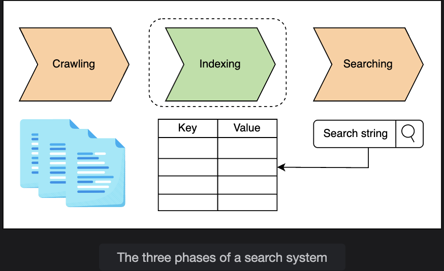

# System Design: The Distributed Search

> An introduction to why search systems exist, what they're made of, and how we'll approach designing one from the ground up.

---

## Table of Contents

1. [Why Do We Need a Search System?](#1-why-do-we-need-a-search-system)
2. [What is a Search System?](#2-what-is-a-search-system)
3. [How Will We Design a Distributed Search System?](#3-how-will-we-design-a-distributed-search-system)

---

## 1. Why Do We Need a Search System?

Search bars are everywhere — on e-commerce sites, video platforms, documentation portals, and the open web. They exist because the alternative — manually browsing through content — becomes completely impractical at scale.

### The Scale Problem

| Platform | Scale | Without Search |
|---|---|---|
| Educative | Hundreds of courses | Users scroll through pages reading every course name |
| YouTube | Billions of videos | Would take **months** to find a specific video by browsing |
| The Internet | Billions of websites, each with many pages | Practically **unusable** — users lost in irrelevant data |

### What Search Actually Does

A search system acts as a **filter** for massive amounts of data. Instead of making users navigate through everything, it surfaces only what's relevant to their specific query — in seconds or less.

```
Without search:
  User wants "Introduction to Machine Learning" on YouTube
  → Scroll through millions of videos
  → Read titles one by one
  → Give up after page 3

With search:
  User types "Introduction to Machine Learning"
  → Relevant results in < 1 second ✅
```

This is why behind every search bar — whether on a small website or a global search engine — there is a search system doing significant work.

---

## 2. What is a Search System?

A search system takes **text input (a search query)** from the user and returns **relevant content** within a few seconds or less.

### Three Core Components

```
┌─────────────┐     ┌─────────────┐     ┌─────────────┐
│             │     │             │     │             │
│   Crawler   │────▶│   Indexer   │────▶│  Searcher   │◀── User Query
│             │     │             │     │             │
└─────────────┘     └─────────────┘     └─────────────┘
  Fetches content    Builds searchable    Responds to
  & creates docs     index from docs      queries using
                                          the index
```


---

### Component 1: Crawler

The crawler is responsible for **discovering and fetching content** from the web (or a specific platform) and turning that content into structured documents.

```
Web / Platform content
       │
       ▼
  [Crawler]
  - Visits pages/URLs
  - Reads content
  - Creates structured documents
       │
       ▼
  Documents ready for indexing
```

> **Note:** The crawler is covered in detail in a separate dedicated chapter. This chapter focuses on **indexing**.

---

### Component 2: Indexer

The indexer takes the documents produced by the crawler and builds a **searchable index** — a data structure optimized for fast lookups.

```
Documents
    │
    ▼
[Indexer]
- Processes text
- Extracts keywords/terms
- Builds an inverted index:
    "machine learning" → [doc_3, doc_17, doc_204, ...]
    "neural network"   → [doc_17, doc_89, doc_501, ...]
    │
    ▼
Searchable Index (stored efficiently)
```

Without an index, every search query would require scanning the full content of every document — which is impossibly slow at scale.

---

### Component 3: Searcher

The searcher takes a user's query, runs it against the index built by the indexer, and returns ranked, relevant results.

```
User Query: "machine learning tutorial"
       │
       ▼
  [Searcher]
  - Parses the query
  - Looks up terms in the index
  - Ranks matching documents by relevance
  - Returns top results
       │
       ▼
  Results page shown to user ✅
```

---

### The Three Phases Together

```
Phase 1 — Crawling:
  Content sources ──▶ Crawler ──▶ Documents

Phase 2 — Indexing:
  Documents ──▶ Indexer ──▶ Searchable Index

Phase 3 — Searching:
  User Query ──▶ Searcher ──▶ Index lookup ──▶ Ranked Results
```

All three phases must work correctly and efficiently for a search system to be useful.

---

## 3. How Will We Design a Distributed Search System?

The design of a distributed search system is broken into **five lessons**, each building on the previous:

---

### Lesson 1 — Requirements

Defining what the system must and must not do, and estimating the resources needed to support it.

```
Covers:
  ✅ Functional requirements    (what the system does)
  ✅ Non-functional requirements (how well it does it)
  ✅ Resource estimation         (servers, storage, bandwidth for a given query load)
```

---

### Lesson 2 — Indexing

Understanding the core mechanism that makes search fast — with a worked example.

```
Covers:
  ✅ How indexing works (with example)
  ✅ Centralized architecture of distributed search systems
  ✅ Trade-offs of centralized vs distributed indexing
```

---

### Lesson 3 — Initial Design

The first concrete design of the full system.

```
Covers:
  ✅ High-level system design
  ✅ API design
  ✅ Details of the indexing process
  ✅ Details of the searching process
```

---

### Lesson 4 — Final Design

Revisiting the initial design with a critical eye and making it production-ready.

```
Covers:
  ✅ Evaluating weaknesses of the initial design
  ✅ Revamping the design for better scalability
  ✅ Handling large-scale distributed challenges
```

---

### Lesson 5 — Evaluation

Verifying that the final design actually satisfies the requirements defined in Lesson 1.

```
Covers:
  ✅ Mapping design decisions to each requirement
  ✅ Confirming functional and non-functional compliance
```

---

### Design Roadmap at a Glance

```
Lesson 1         Lesson 2         Lesson 3         Lesson 4         Lesson 5
────────         ────────         ────────         ────────         ────────
Requirements  →  Indexing      →  Initial       →  Final         →  Evaluation
& Estimation     Background       Design           Design
                                  (API +           (Scalable
                                  components)       revision)
```

---

