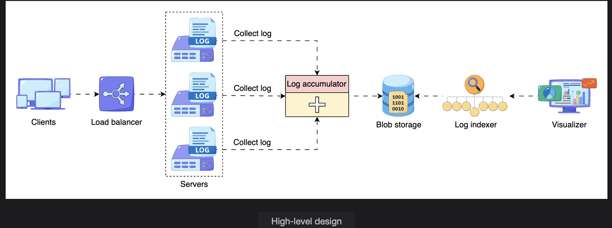
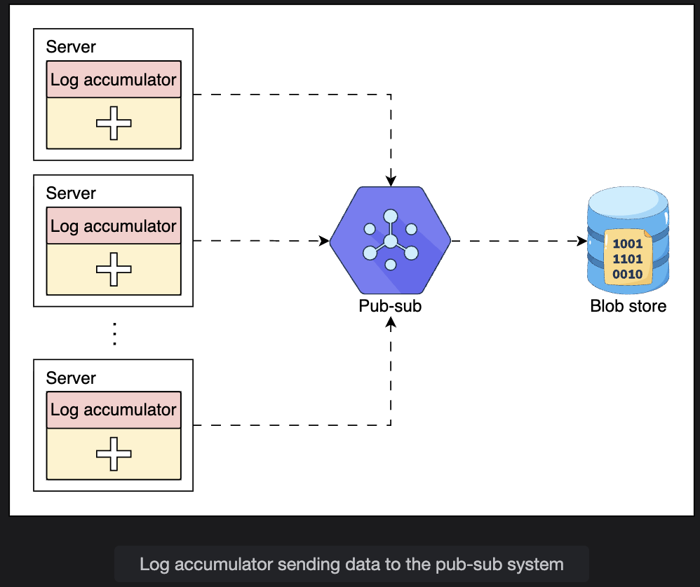
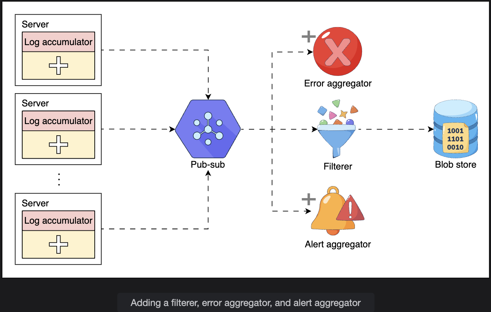
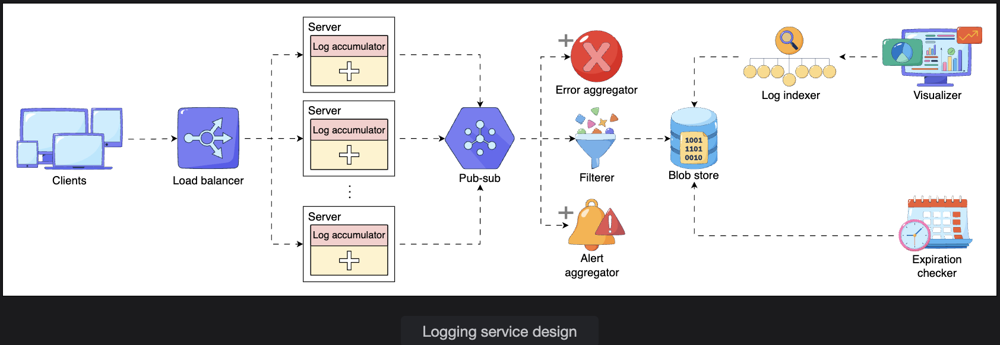

# Design of a Distributed Logging Service

> Building a logging system that handles massive log volumes without impacting application performance — using async accumulators, pub-sub architecture, and distributed storage.

---

## Table of Contents

1. [Requirements](#1-requirements)
2. [Building Blocks](#2-building-blocks)
3. [API Design](#3-api-design)
4. [Initial Design](#4-initial-design)
5. [Logging at Various Levels](#5-logging-at-various-levels)
6. [Multi-Tenant vs Single-Tenant Logging](#6-multi-tenant-vs-single-tenant-logging)
7. [Scaling the Design](#7-scaling-the-design)
8. [Log Retention and Expiration](#8-log-retention-and-expiration)
9. [End-to-End Request Tracing](#9-end-to-end-request-tracing)
10. [Case Study: High-Traffic Online Banking](#10-case-study-high-traffic-online-banking)
11. [Final Design Overview](#11-final-design-overview)
12. [Conclusion](#12-conclusion)

---

## 1. Requirements

> **Note:** This design does not incorporate sampling — all logs are captured.

### Functional Requirements

| # | Requirement | Description |
|---|---|---|
| 1 | **Write logs** | Any service in the distributed system must be able to write to the logging system |
| 2 | **Search logs** | Users must be able to search logs effortlessly and trace application flow end to end |
| 3 | **Store logs** | Logs must reside in distributed storage for easy, reliable access |
| 4 | **Centralized visualizer** | A unified view of logs from all globally distributed services |

### Non-Functional Requirements

| # | Requirement | Description |
|---|---|---|
| 1 | **Low latency** | Logging is I/O-intensive and must never block the application's critical path |
| 2 | **Scalability** | Must handle increasing log volumes and growing numbers of concurrent users |
| 3 | **Availability** | The logging system must be highly available — it can't go down during incidents |

---

## 2. Building Blocks

| Building Block | Role in This Design |
|---|---|
| **Pub-Sub System** | Absorbs and buffers massive volumes of log messages from all nodes |
| **Distributed Search** | Enables efficient querying and filtering of stored logs |

---

## 3. API Design

### Write a Log Entry

```
writeLog(unique_ID, message_to_be_logged)
```

| Parameter | Description |
|---|---|
| `unique_ID` | A numeric ID composed of `application_id + service_id + timestamp`. Identifies the source and enables causality ordering. |
| `message_to_be_logged` | The log message content stored against the unique key. |

```
Example call:

  writeLog(
    unique_ID = "app_ecommerce.svc_payment.1710505921000",
    message_to_be_logged = '{"level":"ERROR","event":"gateway_timeout","order_id":"5678","duration_ms":5003}'
  )
```

---

### Search Logs

```
searchLogs(keyword) -> List of matching log entries
```

| Parameter | Description |
|---|---|
| `keyword` | The search term used to find log entries containing that string. |

```
Example call:

  searchLogs("gateway_timeout")
  -> Returns all log entries containing "gateway_timeout" across all services and nodes
```

---

## 4. Initial Design

### Core Components

```
+------------------+     +-----------------+     +------------------+     +--------------+
|  Distributed     |     |  Log            |     |  Blob            |     |  Log         |
|  Services        | --> |  Accumulator    | --> |  Storage         | --> |  Indexer     |
|  (all nodes)     |     |  (per node)     |     |  (distributed)   |     |              |
+------------------+     +-----------------+     +------------------+     +--------------+
                                                                                  |
                                                                                  v
                                                                          +--------------+
                                                                          |  Visualizer  |
                                                                          +--------------+
```


| Component | Role |
|---|---|
| **Log Accumulator** | Agent on each node that collects logs and ships them to central storage |
| **Storage** | Blob storage that holds all accumulated logs centrally |
| **Log Indexer** | Indexes the stored log files to enable fast distributed search |
| **Visualizer** | Unified interface for viewing and exploring logs across all services |

### The Scalability Problem

```
System with millions of servers
  Each server generates logs continuously
  Single log accumulator must handle ALL incoming logs

  Result: The accumulator becomes a bottleneck
          As servers scale, the accumulator cannot keep up
          Logs are dropped or delayed
```

This motivates the move to a pub-sub based design.

---

## 5. Logging at Various Levels


### On a Single Server

A single server often hosts **multiple applications and microservices** simultaneously. For example, an e-commerce server may run both the authentication service and the cart service at the same time.

```
Single Server
+------------------------------------------------+
|  [Auth Service]          [Cart Service]        |
|  Generates logs          Generates logs        |
|        |                       |               |
|        +----------+------------+               |
|                   |                            |
|          [Log Accumulator]                     |
|          - Receives logs from all services     |
|          - Stores logs locally (buffer)        |
|          - Pushes to pub-sub system            |
+------------------------------------------------+
          |
          v (asynchronous, background worker)
  [Pub-Sub System]
```

### The Unique ID Structure

Each log entry uses a **unique ID** composed of three parts:

```
unique_ID = application_id + service_id + timestamp

Example:
  app_ecommerce.svc_auth.1710505921000
       |              |          |
       application    service    unix timestamp (ms)
       identifier     identifier (determines ordering)
```

This ID serves two purposes:
- **Identification:** Which application and service generated this log
- **Causality:** Timestamp allows ordering events chronologically across services

---

### Why Asynchronous Logging Matters

```
Synchronous logging (BAD for production):

  Application receives request
        |
        v
  [Process request]
        |
        v
  [Write log to disk]  <- blocks here until I/O completes (milliseconds)
        |
        v
  Return response to user

  Every request is slowed by log I/O.
  Under high traffic: log I/O becomes the bottleneck.


Asynchronous logging (CORRECT approach):

  Application receives request
        |
        v
  [Process request]
        |
        +---> [Background worker: write log]  <- happens in parallel, non-blocking
        |
        v
  Return response to user immediately

  Application performance is unaffected by logging I/O.
```


### The Latency vs Persistence Trade-off

```
Option A: Write logs synchronously to disk
  + Guarantee: log is persisted before returning
  - Performance: every request blocked by I/O

Option B: Buffer logs in RAM, flush asynchronously
  + Performance: no blocking, minimal latency impact
  - Risk: if process crashes before flush, buffered logs are lost

Mitigation for Option B:
  - Redundant log accumulators (if one crashes, another continues)
  - Short flush intervals (flush every 100ms, not every 10 seconds)
  - Async persistence to pub-sub (pub-sub provides its own durability)
```

---

## 6. Multi-Tenant vs Single-Tenant Logging

> **Q: How does logging differ between hosting on a multi-tenant cloud (e.g., AWS) vs. exclusive infrastructure (e.g., Facebook)?**

### Single-Tenant (Exclusive Infrastructure): Facebook Example

```
Facebook scale:
  Millions of machines
  Logs reaching several petabytes per hour

Architecture:
  Each machine --> [Scribe (pub-sub)] --> Distributed storage
                        |
                  Data retained for a few days
                  Multiple downstream systems process it

  Scribe is Facebook's internal pub-sub system for log ingestion.
```

**What single-tenant allows:**
```
1. Shared pub-sub instance across all services
   -> Better storage and processing utilization
   -> No strict separation overhead

2. No encryption requirement between internal services
   -> Faster log processing (no encryption/decryption overhead)
   -> Simpler pipeline

3. Application-specific log management
   -> Each team/application can customize how their logs are handled
   -> No cross-tenant isolation requirements

4. Global optimization
   -> Can make system-wide tuning decisions for one organization's needs
```

---

### Multi-Tenant (Shared Cloud): AWS / Azure Example

```
Multiple customers share the same underlying infrastructure.
Customer A's logs must NEVER be visible to Customer B.
```

**What multi-tenancy requires:**
```
1. Strict log separation:
   Separate pub-sub instance per tenant (or per application)
   Separate storage buckets per tenant with isolated access controls

2. End-to-end encryption:
   Logs encrypted in transit (TLS between every component)
   Logs encrypted at rest (AES-256, customer-managed keys)
   Performance penalty: encryption adds CPU overhead and latency

3. Tenant-scoped access control:
   RBAC enforced at every layer
   Tenant A's engineers cannot query Tenant B's logs even accidentally

4. Compliance isolation:
   Different tenants may have different regulatory requirements
   (HIPAA, PCI-DSS, GDPR) -> different retention, audit, and access policies
```

### Comparison Table

| Aspect | Single-Tenant (Facebook) | Multi-Tenant (AWS) |
|---|---|---|
| Log separation | Not required | Mandatory — strict isolation per tenant |
| Encryption | Optional internally | Required end-to-end (performance cost) |
| Pub-sub instances | Shared across the org | One per tenant or application |
| Storage | Shared, globally optimized | Isolated per tenant |
| Cost | Lower (shared resources) | Higher (isolation overhead) |
| Compliance | One org's requirements | Per-tenant requirements (HIPAA, PCI, GDPR) |

> **Special case:** Sensitive applications like banking require encryption **before** logging — not just at the transport or storage layer. Even internal staff should not be able to read unencrypted log content.

---

## 7. Scaling the Design

### The Full Scaled Architecture

All servers in a data center push logs to a **horizontally scalable pub-sub system**. Multiple pub-sub instances per data center prevent bottlenecks.

```
All servers in data center
        |
        v (async, background workers)
[Pub-Sub System]  <-- horizontally scalable, multiple instances
        |
        +---------> [Filterer]
        |              Identifies which application generated each log
        |              Routes logs to the correct blob storage partition
        |
        +---------> [Error Aggregator]
        |              Identifies ERROR-level messages in real time
        |              Notifies the client/service immediately
        |
        +---------> [Alert Aggregator]
                       Identifies FATAL/CRITICAL messages
                       Notifies stakeholders and monitoring tools (PagerDuty, etc.)
        |
        v
[Blob Storage]
(logs partitioned per application)
        |
        +---------> [Log Indexer]
        |              Indexes stored logs for efficient search
        |
        +---------> [Visualizer]
                       Unified view across all services and nodes
```

### The Three Downstream Processors

#### Filterer

```
Input:  Raw log stream from pub-sub
Output: Logs routed to the correct application-specific storage

Why needed:
  Logs from hundreds of applications flow through the same pub-sub
  Without filtering, all logs land in one undifferentiated pile
  Filterer reads application_id from unique_ID and routes accordingly

  app_ecommerce logs --> blob_storage/ecommerce/
  app_payments logs  --> blob_storage/payments/
  app_auth logs      --> blob_storage/auth/
```

#### Error Aggregator

```
Input:  Log stream from pub-sub
Output: Real-time error notifications to application teams

Why needed:
  Errors should be surfaced immediately, not discovered hours later
  Error aggregator scans for level=ERROR messages
  Triggers immediate alerts: Slack, email, PagerDuty

  Without this: engineer discovers errors by searching logs manually, hours later
  With this:    engineer gets a notification within seconds of the first error
```

#### Alert Aggregator

```
Input:  Log stream from pub-sub
Output: Notifications to monitoring tools for FATAL/CRITICAL events

Why needed:
  FATAL errors mean the application is crashing
  Requires immediate response (on-call engineer, incident management)

  Alert aggregator triggers:
  - Incident creation in PagerDuty
  - SMS/phone call to on-call engineer
  - Dashboard status change (green -> red)
  - Auto-remediation workflows (restart service, scale up, etc.)
```

---

## 8. Log Retention and Expiration

### Expiration Checker

A dedicated **expiration checker** component manages log lifecycle:

```
Expiration Checker responsibilities:
  1. Scan logs for expiration dates
  2. Move expired-but-retained logs to cold storage (cheaper)
  3. Delete logs that have exceeded their retention period
```

### Retention Policies by Log Type

```
+----------------------+------------------+---------------------------+
| Log Type             | Retention Period | Storage Tier              |
+----------------------+------------------+---------------------------+
| Regular app logs     | Days to weeks    | Hot -> Cold -> Delete     |
| Error/debug logs     | 30-90 days       | Hot -> Cold -> Delete     |
| Security audit logs  | 1-3 years        | Hot -> Cold -> Archive    |
| Compliance logs      | 3-7 years        | Cold -> Archive (WORM)    |
| Financial records    | 7+ years         | Archive (immutable)       |
+----------------------+------------------+---------------------------+
```

```
Storage tier lifecycle:

  New log created
       |
       v
  [Hot Storage]         <- fast access, high cost, short retention (days/weeks)
       |
       v (after X days)
  [Warm Storage]        <- slower access, medium cost (months)
       |
       v (after Y months)
  [Cold Storage]        <- slow access, low cost (years)
       |
       v (after retention period expires)
  [Deleted]
```

> Compliance logs (financial, healthcare) are often stored in **WORM (Write Once, Read Many)** storage that physically prevents deletion until the retention period ends. This satisfies regulatory requirements and legal hold obligations.

---

## 9. End-to-End Request Tracing

### The Problem

A single user API call may fan out to hundreds of microservices and thousands of nodes. Without correlation, the logs for that single request are scattered across the entire system with no way to link them.

```
User submits order
  -> API Gateway fans out to 8 services
  -> Each service runs on 100 nodes
  -> All 800 nodes generate logs concurrently

Logs in storage:
  14:32:01  auth-svc   node-47  "Token validated"
  14:32:01  order-svc  node-12  "Order received"
  14:32:02  payment    node-83  "Charge initiated"
  14:32:02  auth-svc   node-23  "Token validated"  <- different request!
  14:32:02  payment    node-83  "Charge failed"    <- which request?
  ...

Impossible to reconstruct a single request's flow from this.
```

### The Solution: Unique ID Propagation

```
Step 1: Front-end server receives the user request
        Front-end queries a Sequencer for a globally unique ID

Step 2: The unique ID is appended to ALL fanned-out service calls

Step 3: Every service that handles this request includes the unique ID
        in every log entry it generates

Step 4: To reconstruct the full request flow:
        Search logs WHERE unique_ID = "req_abc123"
        -> Returns all log entries across all services for that one request
```

```
Example with unique ID:

  14:32:01  auth-svc   node-47  req_id=abc123  "Token validated"
  14:32:01  order-svc  node-12  req_id=abc123  "Order received"
  14:32:02  payment    node-83  req_id=abc123  "Charge initiated"
  14:32:02  auth-svc   node-23  req_id=xyz789  "Token validated"  <- different request
  14:32:02  payment    node-83  req_id=abc123  "Charge failed"    <- same request abc123

  Filter by req_id=abc123:
  -> All 4 entries for this request, clear and complete
```

### Causality Ordering

The unique ID generated by the **Sequencer** has a special property:

```
If ID_1 < ID_2, then ID_1 represents an event that happened BEFORE ID_2

This means:
  - Logs for a request can be sorted by unique_ID in ascending order
  - The sorted sequence reflects the ACTUAL causal order of events
  - Even if clock skew causes wall-clock timestamps to be unreliable,
    the sequencer-generated ID preserves correct ordering
```

```
Reconstructed request flow for req_id=abc123 (sorted by sequence):

  1. auth-svc:    Token validated
  2. order-svc:   Order received
  3. payment:     Charge initiated
  4. payment:     Charge failed   <- root cause identified immediately
```

> **Windows Azure Storage (WAS) Alternative Approach:** Instead of centralizing all raw logs, WAS stores logs on local disks and uses a distributed grep-like utility to search across all nodes simultaneously. This avoids the overhead of shipping petabytes of raw logs to central storage, while still providing a unified search view.

---

## 10. Case Study: High-Traffic Online Banking

> **Q: How would you design a distributed logging system for a high-traffic online banking application, ensuring security, performance, and scalability?**

Banking logging has the strictest requirements: every transaction must be logged (no sampling), logs must be tamper-proof, access must be audited, and retention must satisfy regulations.

### Architecture

```
Banking Services (all nodes)
        |
        v (TLS encrypted, async)
[Log Accumulator]
- Masks PII and card data before logging
- Batches log entries for efficiency
- Compresses before transmission
        |
        v
[Kafka Message Queue]
- Buffers high-volume log ingestion
- Partitioned by transaction type and region
- Provides durable, ordered log delivery
        |
        +---------> [Hot Storage (e.g., Elasticsearch)]
        |              Real-time search, last 30-90 days
        |              Role-based access control enforced
        |
        +---------> [Cold Storage (e.g., S3 + Glacier)]
        |              Long-term retention (7+ years)
        |              Immutable WORM storage for compliance
        |              Encrypted with customer-managed keys
        |
        +---------> [Error/Alert Aggregator]
                       Real-time fraud signal detection
                       Immediate alert on anomalies
```

### Security Layer

```
In transit:
  TLS 1.3 between every component (accumulator -> Kafka -> storage)
  No plaintext log data ever crosses the network

At rest:
  AES-256 encryption on all log storage
  Customer-managed encryption keys (not managed by cloud provider)
  Logs encrypted BEFORE writing, not just at the storage layer

Access control:
  RBAC: teller vs. compliance officer vs. security team have different access
  All log access itself is logged (meta-audit trail)
  Privileged access requires multi-factor authentication

Data masking:
  Card numbers: 4111-1111-1111-1111 -> ****-****-****-1111
  Account numbers: 123456789 -> *****6789
  SSNs, passwords: [REDACTED]
  Applied at the accumulator before any log leaves the service
```

### Compliance Requirements

```
PCI-DSS (payment card industry):
  - Log all access to cardholder data
  - Retain logs for minimum 1 year (3 months immediately accessible)
  - Protect logs against modification (WORM storage)
  - Review logs daily for anomalies

SOX (financial reporting):
  - Retain audit logs for 7 years
  - Demonstrate log integrity (hash chaining)

GDPR:
  - No PII in logs unless legally justified
  - Right to erasure: ability to delete specific user's log data on request
```

### Performance Optimizations

```
Batching:
  Accumulate 100 log entries or wait 50ms (whichever comes first)
  Then flush as a single batch write
  Reduces I/O operations by ~100x compared to writing one-by-one

Compression:
  Logs are highly repetitive (same field names, similar values)
  gzip compression typically achieves 10-20x reduction in log size

Time-based indexing:
  Index partitioned by time (hourly or daily buckets)
  Queries filtered by time range only search relevant index partitions
  "Find all errors in the last 2 hours" searches 2 index buckets, not all history

Async pipeline:
  All log writing happens off the critical transaction path
  Transaction processing never waits for logging I/O to complete
```

### Scalability

```
Horizontal scaling:
  Kafka partitioned by transaction type and region
  -> Add more partitions/brokers as volume grows

Multi-region replication:
  Primary log storage in home region
  Replicated to at least one other region for disaster recovery
  Ensures log availability even if an entire region goes offline

Monitoring the monitoring system:
  Dedicated metrics on Kafka consumer lag, storage fill rates, error rates
  Alerts if log pipeline falls behind (could indicate attack or failure)
  Automatic retry with exponential backoff on delivery failures
```

---

## 11. Final Design Overview

```
INGESTION:
  All service nodes
       |
       v (async, background workers)
  Log Accumulators (per node)
  - Receive logs from all services on the node
  - Buffer locally in RAM
  - Push to pub-sub asynchronously
       |
       v
  Pub-Sub System (horizontally scaled, multiple instances per DC)
       |
  +----+----+----+
  |    |    |    |
  v    v    v    v

PROCESSING (parallel from pub-sub):
  [Filterer]            Routes logs to correct app storage
  [Error Aggregator]    Surfaces errors immediately
  [Alert Aggregator]    Triggers FATAL alerts in real time

STORAGE:
  Blob Storage (partitioned per application)
  Expiration Checker -> moves to cold storage or deletes based on retention policy

SEARCH & VISUALIZATION:
  Log Indexer -> indexes blob storage
  Visualizer  -> unified UI for search, filtering, dashboards

TRACING:
  Sequencer provides unique IDs with causality ordering
  Unique IDs propagated across all fanned-out services
  Enables end-to-end reconstruction of any request
```

---

## 12. Conclusion

```
KEY TAKEAWAYS:

1. PURPOSE
   Logging traces event flow and reduces MTTR through root cause analysis.
   Essential for visibility in distributed systems where failures cascade.

2. ASYNC IS NON-NEGOTIABLE
   Logging is I/O-intensive.
   Must run asynchronously to avoid blocking the critical request path.
   Buffer in RAM, flush to pub-sub in the background.

3. PUB-SUB AS THE BACKBONE
   Absorbs massive log volumes across millions of nodes.
   Decouples producers (services) from consumers (filterer, aggregators, storage).
   Enables horizontal scaling without changing the logging client interface.

4. DOWNSTREAM PROCESSORS ADD INTELLIGENCE
   Filterer:          Routes logs to the right place
   Error Aggregator:  Surfaces errors immediately
   Alert Aggregator:  Triggers incident response for FATAL events

5. RETENTION IS NOT FOREVER
   Regular logs: days to weeks
   Compliance logs: 3-7 years
   Expiration checker automates lifecycle transitions

6. REQUEST TRACING REQUIRES CORRELATION IDs
   Unique IDs from a sequencer, propagated to all fanned-out services
   Enable reconstruction of any request's complete end-to-end flow
   Causality-preserving IDs (ID1 < ID2 means ID1 happened first)

7. SECURITY VARIES BY DEPLOYMENT MODEL
   Single-tenant: shared resources, lower overhead, org-wide optimization
   Multi-tenant: strict isolation per tenant, encryption required, higher cost
   Banking/financial: encryption before logging, WORM storage, PCI-DSS compliance
```

---

