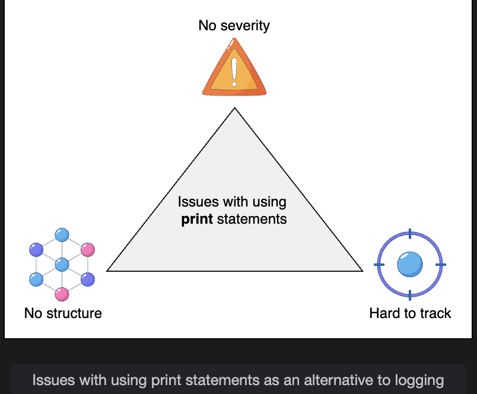

# System Design: Distributed Logging

> Understanding why logging is foundational to distributed systems, why simple alternatives fail at scale, and what security concerns must be addressed from the start.

---

## Table of Contents

1. [What is Logging?](#1-what-is-logging)
2. [Why Logging is Critical in Distributed Systems](#2-why-logging-is-critical-in-distributed-systems)
3. [Why Print Statements Don't Work](#3-why-print-statements-dont-work)
4. [What Logging Enables](#4-what-logging-enables)
5. [Security Concerns in Distributed Logging](#5-security-concerns-in-distributed-logging)
6. [Summary](#6-summary)

---

## 1. What is Logging?

A **log file** is a persistent record of specific events that occurred within a software application — capturing what happened, when it happened, and in what context.

### What Gets Logged

```
Transaction data:
  "Payment of $49.99 processed for user_id=1234 at 14:32:01 UTC"

Service actions:
  "Auth service: token validated for user_id=1234, session started"

Errors and warnings:
  "ERROR: Database connection pool exhausted at 14:32:03 UTC"

System events:
  "INFO: Node 3 restarted after health check failure at 14:31:58 UTC"
```

Logs are the **paper trail** of a running system — without them, what happens inside a production environment is invisible.


---

## 2. Why Logging is Critical in Distributed Systems

### The Distributed Complexity Problem

In a single-process application, debugging is straightforward — you can step through code linearly. In a distributed system, a single user request might touch dozens of services running on different nodes in different data centers simultaneously.

```
User clicks "Buy Now"
        |
        v
  [API Gateway]  ->  [Auth Service]  ->  [Inventory Service]
                                               |
                                         [Payment Service]  ->  [Notification Service]
                                               |
                                         [Order Service]   ->  [Warehouse Service]

  Something fails. Which service? Which node? At what point in the chain?
  Without logs: no way to know.
  With logs: trace the exact request path and find the failure point.
```

### What Logs Provide

| Need | How Logging Helps |
|---|---|
| **Failure diagnosis** | Identify which service, node, or request caused the failure |
| **Root cause analysis** | Trace the chain of events leading up to an error |
| **Mean time to repair (MTTR)** | Faster diagnosis -> faster fix -> less downtime |
| **Request tracing** | Follow a single request across all services it touched |
| **Performance monitoring** | Identify slow services, bottlenecks, or resource exhaustion |

---

### Causality: The Hardest Part

Multiple services running concurrently across many nodes generate interleaved log entries. Without causality information, it is impossible to reconstruct the correct event order for a specific request.

```
Logs without causality (raw output from 3 nodes):

  14:32:01  Node1  "Request received"
  14:32:01  Node3  "Request received"
  14:32:02  Node2  "Payment processed"
  14:32:02  Node1  "Auth failed"
  14:32:02  Node3  "Order created"
  14:32:03  Node2  "Notification sent"

  Which payment belongs to which request?
  Which auth failure caused which downstream effect?
  Impossible to tell.

Logs with causality (request_id + trace_id added):

  14:32:01  Node1  req_id=A  "Request received"
  14:32:01  Node3  req_id=B  "Request received"
  14:32:02  Node2  req_id=B  "Payment processed"
  14:32:02  Node1  req_id=A  "Auth failed"
  14:32:02  Node3  req_id=B  "Order created"
  14:32:03  Node2  req_id=B  "Notification sent"

  Now clear: req_id=A failed at auth. req_id=B completed successfully.
```

A logging service manages this causality data, enabling engineers to **visualize performance** and **trace individual requests** end-to-end across the entire distributed system.

---

## 3. Why Print Statements Don't Work

Print statements are the first instinct of a developer debugging locally. They completely break down in production distributed systems.

### The Four Failures of Print Statements

#### Failure 1: No Severity Levels

```
print("User logged in")          <- is this informational? a warning? an error?
print("Database unreachable")    <- same format as the line above

A logging system provides:
  INFO:  "User logged in"
  ERROR: "Database unreachable"
  WARN:  "Response time > 500ms"
  DEBUG: "Cache miss for key user_1234"

Severity levels allow operators to:
  - Filter only ERRORs during an incident
  - Suppress DEBUG logs in production
  - Set alerts on CRITICAL level events
```

#### Failure 2: No Persistence

```
print() writes to standard output (stdout).

  Process crashes  -> stdout buffer lost -> logs gone forever
  Container restarts -> previous stdout gone
  Node reboots -> stdout gone

A logging system writes to:
  - Persistent disk storage
  - Centralized log aggregation service
  - Durable distributed storage (replicated)

Logs survive crashes and are available for post-mortem analysis.
```

#### Failure 3: No Structure

```
print("Error processing order 1234 for user 5678 at checkout")
  <- free-form text, hard to parse, hard to query

Structured logging:
  {
    "level": "ERROR",
    "timestamp": "2024-03-15T14:32:01Z",
    "service": "order-service",
    "event": "order_processing_failed",
    "order_id": "1234",
    "user_id": "5678",
    "stage": "checkout"
  }

Structured logs can be:
  - Queried: find all errors for user_id=5678
  - Aggregated: count errors per service per hour
  - Alerted: trigger PagerDuty when error rate > threshold
```

#### Failure 4: No Aggregation

```
Distributed system: 500 nodes, each printing to its own stdout

  To investigate an incident:
    SSH into node 1   -> grep through stdout -> nothing
    SSH into node 2   -> grep through stdout -> nothing
    ...
    SSH into node 347 -> found it (2 hours later)

Centralized logging:
  All 500 nodes ship logs to one place
  Single query: "find all ERROR logs in the last 10 minutes"
  Result: immediate, across all nodes simultaneously
```

### Print vs Logging: Side-by-Side

| Feature | Print Statement | Logging System |
|---|---|---|
| Severity levels | None | INFO, WARN, ERROR, DEBUG, CRITICAL |
| Persistence | No (stdout only) | Yes (disk + replicated storage) |
| Structure | Free-form text | Structured (JSON, key-value) |
| Centralized | No (per-node stdout) | Yes (aggregated from all nodes) |
| Causality tracking | No | Yes (request IDs, trace IDs) |
| Queryable | No | Yes (filter, aggregate, alert) |
| Survives crashes | No | Yes |

---

## 4. What Logging Enables

A well-designed logging system supports four critical operational scenarios:

### Scenario 1: Troubleshooting

```
Issue: Users report checkout is failing intermittently.

Without logs: "We'll need to reproduce it and add some print statements"
              -> Hours or days to diagnose

With logs: Query: level=ERROR AND service=checkout AND last_30_minutes
           Result: "Payment gateway timeout after 5s" -> 47 occurrences
           Root cause found in seconds.
```

### Scenario 2: Security and Compliance

```
Regulatory requirements (GDPR, PCI-DSS, HIPAA, SOC 2) mandate:
  - Who accessed what data and when
  - What changes were made and by whom
  - Evidence of unauthorized access attempts

Logs provide the audit trail required for:
  - Internal security policy enforcement
  - External compliance audits
  - Regulatory reporting
```

### Scenario 3: Breach Detection and Response

```
Security team notices anomaly:
  - 10,000 failed login attempts from IP 192.168.1.x in 5 minutes
  - Unusual data export: user downloaded 2GB from an internal DB
  - API key used from two geographies simultaneously

Logs surface these patterns.
Without logs: breach may go undetected for weeks or months.
With logs + alerting: detected in real time, response initiated immediately.
```

### Scenario 4: Product Analytics

```
User behavior logs feed business intelligence:
  - Which features are used most?
  - Where do users drop off in the checkout flow?
  - What search queries return no results? (product gap analysis)
  - Which recommendations lead to purchases?

Same log infrastructure powers both operational and product decisions.
```

---

## 5. Security Concerns in Distributed Logging

> **Q: What are some security concerns to consider when designing a distributed logging system? How would you mitigate them?**

Logging systems are a high-value target for attackers and a high-risk surface for accidental data exposure. Security must be designed in from the start — not bolted on later.

---

### Concern 1: Sensitive Data in Logs (Data Leakage)

```
Problem:
  Developers accidentally log sensitive fields:

  "Processing payment: card_number=4111111111111111, cvv=123"
  "Auth attempt: username=alice, password=hunter2"
  "User profile: ssn=123-45-6789, dob=1985-03-15"

  Logs are often shared broadly (across teams, to third-party tools).
  One log leak exposes millions of users' private data.
```

**Mitigations:**

```
1. PII scrubbing at the logger level:
   Before writing to log, redact known sensitive fields.
   card_number=4111111111111111 -> card_number=[REDACTED]
   password=hunter2             -> password=[REDACTED]

2. Allowlist logging (log only approved fields):
   Define which fields are safe to log.
   Reject or redact everything else by default.

3. Developer education + code review:
   Enforce logging policies in pull request reviews.
   Automated static analysis to flag logging of sensitive variables.

4. Data classification:
   Tag data as PUBLIC, INTERNAL, CONFIDENTIAL, RESTRICTED.
   Logging system rejects CONFIDENTIAL/RESTRICTED fields automatically.
```

---

### Concern 2: Log Tampering and Integrity

```
Problem:
  An attacker who gains access to log storage can:
  - Delete logs covering their tracks after a breach
  - Modify log entries to frame another user or service
  - Insert fake log entries to confuse incident responders

  If logs can be tampered with, they are worthless as evidence.
```

**Mitigations:**

```
1. Append-only log storage:
   Logs can be written but never modified or deleted.
   Implemented at the storage layer (immutable writes).

2. Cryptographic hashing / log chaining:
   Each log entry includes a hash of the previous entry (like a blockchain).
   Tampering with any entry breaks the hash chain -> immediately detectable.

3. Write-once, read-many (WORM) storage:
   Hardware or cloud storage policies that physically prevent modification.
   (e.g., AWS S3 Object Lock, Azure Immutable Blob Storage)

4. Separate log storage permissions:
   Services that generate logs have WRITE-ONLY access to log storage.
   No service (including the one that wrote the logs) can read or delete them.
   Only the dedicated log analysis team has read access.
```

---

### Concern 3: Unauthorized Access to Logs

```
Problem:
  Logs contain sensitive operational data:
  - Internal API endpoints and service architecture
  - Error messages that reveal implementation details (useful for attackers)
  - User IDs, session tokens, IP addresses
  - Internal IP ranges and infrastructure topology

  If anyone can read all logs, a single compromised account exposes everything.
```

**Mitigations:**

```
1. Role-Based Access Control (RBAC) on log storage:
   Developer:       Can read logs for their own service only
   SRE / On-call:   Can read all service logs during incidents
   Security team:   Can read security and audit logs
   Executive:       Can read aggregated dashboards only (no raw logs)

2. Log segregation:
   Separate security/audit logs from application logs.
   Different storage buckets, different access policies.
   Security logs have stricter access controls.

3. Encrypted log storage:
   Logs encrypted at rest (AES-256).
   Encryption keys managed separately (key management service).
   Even if storage is breached, logs are unreadable without the key.

4. Encrypted log transmission:
   Logs shipped from nodes to aggregation service over TLS.
   Prevents interception of logs in transit.
```

---

### Concern 4: Log Injection Attacks

```
Problem:
  An attacker crafts malicious input that, when logged, creates false entries:

  User submits username: "admin\nINFO: User admin logged in successfully"

  Log output:
    INFO: Failed login attempt for user: admin
    INFO: User admin logged in successfully   <- injected! looks like a success

  This poisons the audit trail and can confuse security monitoring tools.
```

**Mitigations:**

```
1. Sanitize all external input before logging:
   Escape or strip newline characters (\n, \r) from user-supplied values.
   Replace control characters that could affect log formatting.

2. Structured logging (JSON):
   If logs are structured JSON, injected newlines are encoded harmlessly:
   {"user": "admin\nINFO: fake entry"} -> the newline is inside a JSON string,
   not interpreted as a new log line.

3. Input validation upstream:
   Validate and sanitize user input at the API layer before it reaches logging.
```

---

### Concern 5: Log Volume as a DoS Vector

```
Problem:
  An attacker floods the system with requests that each generate large log entries.
  Log storage fills up -> legitimate logs are dropped -> monitoring goes blind.
  Or the logging pipeline becomes a bottleneck -> application slowdown.
```

**Mitigations:**

```
1. Rate limiting on log ingestion:
   Cap the number of log entries per service per second.
   Excess entries are sampled or dropped (with a counter tracking dropped count).

2. Log sampling for high-volume events:
   Instead of logging every occurrence of a frequent event:
   Log 1 in 100 occurrences, with a count field showing how many were skipped.
   {"event": "cache_miss", "sampled_rate": "1/100", "total_occurrences": 9847}

3. Separate log storage quotas per service:
   Each service has a storage quota.
   One noisy service cannot fill up storage and starve others.

4. Circuit breakers on the logging pipeline:
   If a service is generating logs at 100x its normal rate, trigger an alert
   and throttle that service's log output automatically.
```

---

### Security Concerns Summary

| Concern | Risk | Key Mitigations |
|---|---|---|
| Sensitive data in logs | PII/credentials exposed via log access | PII scrubbing, allowlist fields, data classification |
| Log tampering | Attacker covers tracks, destroys evidence | Append-only storage, hash chaining, WORM storage |
| Unauthorized log access | Internal architecture exposed, user data leaked | RBAC, log segregation, encryption at rest and in transit |
| Log injection | Audit trail poisoned with fake entries | Input sanitization, structured JSON logging |
| DoS via log flooding | Monitoring goes blind, application slows | Rate limiting, sampling, per-service quotas |

---

## 6. Summary

```
WHAT IS LOGGING:
  Persistent, structured records of system events
  Essential for visibility into production environments

WHY IT MATTERS IN DISTRIBUTED SYSTEMS:
  Single request touches many services across many nodes
  Causality tracking (request IDs, trace IDs) stitches the flow together
  Without logs: failures are invisible and diagnosis takes days
  With logs: root cause found in seconds

WHY PRINT STATEMENTS FAIL:
  No severity levels      -> can't filter by importance
  No persistence          -> lost on crash or restart
  No structure            -> can't query or aggregate
  No centralization       -> can't search across 500 nodes at once

WHAT LOGGING ENABLES:
  Troubleshooting         -> trace failures to root cause
  Security/compliance     -> audit trail for regulations
  Breach detection        -> catch attacks in real time
  Product analytics       -> understand user behavior

SECURITY REQUIREMENTS:
  Prevent data leakage    -> scrub PII, use allowlists
  Ensure integrity        -> append-only, hash chaining, WORM
  Control access          -> RBAC, encryption at rest + in transit
  Block injection         -> sanitize input, use structured logging
  Prevent DoS             -> rate limiting, sampling, per-service quotas
```

---


### How will we design a distributed logging system?
We will explore the design of a distributed logging system across the following lessons:

1. **Introduction**: Discuss how logging operates at a distributed level, including strategies for structuring logs and managing file size.

2. **Design**: Define the requirements, API design, and detailed architecture of the logging service.