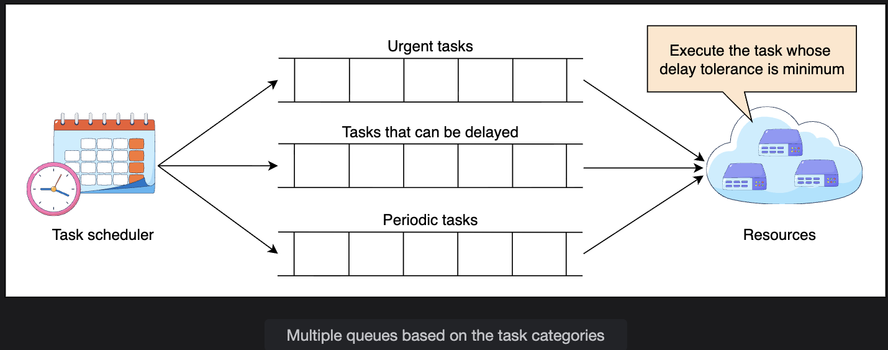
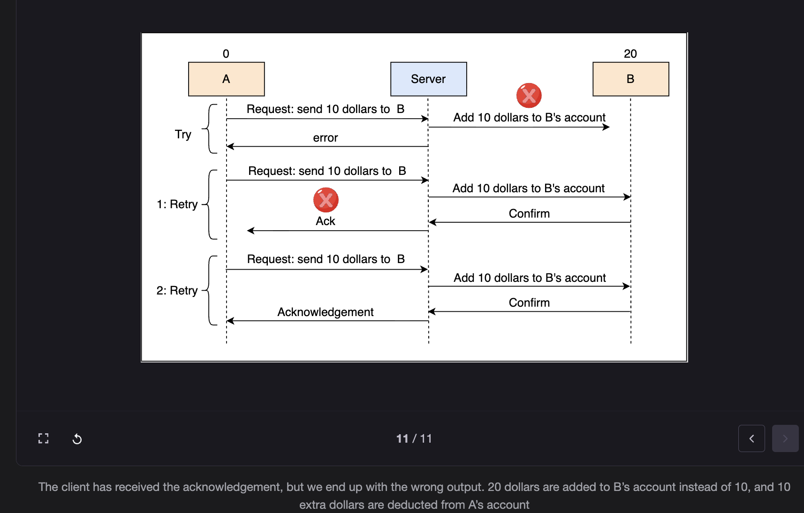
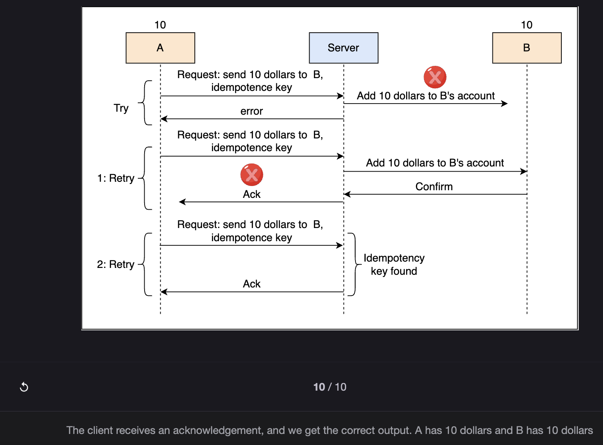

# Design Considerations of a Distributed Task Scheduler

> Managing task prioritization, preventing resource monopolization, ensuring idempotency, and securing untrusted task execution in a shared environment.

---

## Table of Contents

1. [Queueing Strategy](#1-queueing-strategy)
2. [Execution Cap](#2-execution-cap)
3. [Prioritization and Delay Tolerance](#3-prioritization-and-delay-tolerance)
4. [Resource Capacity Optimization](#4-resource-capacity-optimization)
5. [Task Idempotency](#5-task-idempotency)
6. [Scheduling and Executing Untrusted Tasks](#6-scheduling-and-executing-untrusted-tasks)
7. [Key Design Questions and Answers](#7-key-design-questions-and-answers)
8. [Summary](#8-summary)

---

## 1. Queueing Strategy

### The Problem with First Come, First Served (FCFS)

The simplest queueing strategy is **FCFS** — tasks are dequeued in submission order and assigned to available nodes.

```
FCFS Queue:

  [Task A: 4-hour ML training job]  <- submitted first, running
  [Task B: 2-second security alert] <- waiting behind Task A
  [Task C: 1-second payment check]  <- waiting behind Task A and B

  Result: Task B and Task C (urgent, fast) blocked by Task A (slow, non-urgent)
  This is called HEAD-OF-LINE BLOCKING.
```

**Head-of-line blocking consequences:**
- Urgent tasks (security notifications, payment alerts) are delayed
- System reliability and availability degrade
- SLA violations for time-sensitive work
- Pure FCFS is **insufficient** for any system with mixed task urgency

---

### The Solution: Priority-Based Multiple Queues

Tasks are classified into three priority tiers, each with its own queue:

```
+------------------+     +--------------------+     +------------------+
|  Urgent Queue    |     |  Delayable Queue   |     |  Periodic Queue  |
|                  |     |                    |     |                  |
| Cannot be delayed|     | Can wait for       |     | Run on a fixed   |
| e.g., security   |     | resources          |     | schedule         |
| alerts, live     |     | e.g., feed updates,|     | e.g., every hour,|
| notifications    |     | recommendations    |     | daily reports    |
+------------------+     +--------------------+     +------------------+
        |                         |                         |
        v                         v                         v
  Scheduled first          Scheduled second           Scheduled third
  (highest priority)       (medium priority)          (lowest priority)
```

| Queue | Task Type | Example | Scheduling Priority |
|---|---|---|---|
| **Urgent** | Cannot be delayed | Security alerts, live stream notifications, disaster safety marks | First |
| **Delayable** | Can wait for resources | Friend suggestions, feed updates, content recommendations | Second |
| **Periodic** | Fixed schedule | Hourly reports, daily billing runs, weekly analytics | Third |

---

### Preventing Starvation

With a pure priority queue, low-priority tasks could wait indefinitely if urgent tasks keep arriving — a condition called **starvation**.

```
Starvation scenario:

  Urgent queue always has tasks
  Scheduler always picks from urgent queue first
  Delayable tasks: submitted at t=0, still waiting at t=4 hours

Prevention: Delay tolerance monitoring

  System continuously tracks how long each task has been waiting
  If a delayable task approaches its delay tolerance limit:
    -> Scheduler PROMOTES it to the urgent queue
    -> Task processed immediately

  Result:
    No task waits longer than its defined delay tolerance
    Bounded waiting requirement satisfied
```

```
Starvation prevention flow:

  Task D submitted (delayable), delay tolerance = 30 minutes
  t=0:   Task D enters delayable queue
  t=25:  Approaching 30-minute limit — scheduler detects this
  t=25:  Task D PROMOTED to urgent queue
  t=26:  Task D executed (within tolerance) ✅
```

---

## 2. Execution Cap

### The Problem: Resource Monopolization

Some tasks run longer than expected — often due to bugs (infinite loops, deadlocks) or unexpected data volumes. Without a limit, these tasks:

```
Task X: Expected to run for 5 minutes
        Due to a bug, enters an infinite loop
        Running for 3 hours with no sign of stopping

  Worker Node 12: fully occupied by Task X
  Tasks Y, Z, W: queued, waiting for Node 12 to free up
  Deadline for Task Y: missed
  Deadline for Task Z: missed
  Deadline for Task W: missed

  One buggy task monopolizes a node for hours.
```

---

### The Solution: Execution Cap Enforcement

```
Client specifies ExecutionCap when submitting a task:
  "This task should complete within 10 minutes."

If no cap is specified:
  System applies a DEFAULT upper bound
  (prevents unbounded resource usage even for clients who forget to set a cap)

Enforcement:
  Task starts at t=0
  ExecutionCap = 10 minutes
  At t=10: Scheduler checks — task still running?
    -> YES: Scheduler TERMINATES the task
            Releases resources immediately
            Notifies the client: "Task exceeded execution cap"
    -> NO:  Task completed normally, no action needed
```

---

### Handling Legitimate Long-Running Tasks

Not all long-running tasks are bugs. ML model training, large data pipelines, and video processing can legitimately take hours.

```
Strategy for long-running legitimate tasks:

  Pause and Resume:
    Scheduler may PAUSE a long-running task when urgent work arrives
    Resources released temporarily for urgent task
    Long-running task RESUMED when resources free up again

  Checkpointing (client responsibility):
    Client implements periodic state saves during execution:
      t=0:   Training starts, epoch 1
      t=1h:  Checkpoint saved: model state at epoch 10
      t=2h:  Checkpoint saved: model state at epoch 20
      t=2.5h: Machine fails!
      t=2.6h: Task rescheduled to a new machine
      t=2.7h: Task RESUMES from epoch 20 checkpoint (not from epoch 1)

  Without checkpointing: 2.5 hours of work lost on failure
  With checkpointing: only ~30 minutes of work lost
```

---

## 3. Prioritization and Delay Tolerance

### What is Delay Tolerance?

**Delay tolerance** is a per-task parameter defining the **maximum acceptable wait time** before a task must start execution.

```
Delay tolerance examples:

  Task: "Mark user as safe during earthquake"
  Delay tolerance: 500ms   <- must start within half a second
  Why: If delayed, the safety confirmation feature is useless

  Task: "Send live stream notification"
  Delay tolerance: 2 seconds  <- must start within 2 seconds
  Why: Viewers join within seconds; late notification means missed viewership

  Task: "Suggest friends to a user"
  Delay tolerance: 24 hours   <- can wait a full day
  Why: Friend suggestions are not time-critical

  Task: "Generate weekly analytics report"
  Delay tolerance: 2 hours    <- run anytime in a 2-hour window
  Why: Report needed by morning, exact timing doesn't matter
```

### How the Scheduler Uses Delay Tolerance

```
Scheduler prioritization rule:
  "Tasks with SHORTER delay tolerance get scheduled FIRST"

  Task A: delay_tolerance = 500ms   <- scheduled first
  Task B: delay_tolerance = 5s      <- scheduled second
  Task C: delay_tolerance = 1 hour  <- scheduled third
  Task D: delay_tolerance = 24 hours <- scheduled last

This ensures urgent tasks always meet their deadlines while flexible
tasks wait without blocking time-critical work.
```

---

### How is Delay Tolerance Determined?

> **Q: How do we determine the value of delay tolerance?**

**A:** Delay tolerance is set by **application owners or clients** based on the task's category and severity. The task scheduling system can also apply defaults per task category.

**Facebook example — delay tolerance spectrum:**

```
Feature                         Delay Tolerance   Reason
---------------------------     ---------------   -------
Mark safe during earthquake     Milliseconds      Life-safety feature; delay = useless
Live stream notification        1-2 seconds       Viewers join immediately; late = missed
Payment fraud alert             < 5 seconds       Fraud window is narrow
Post notification               30-60 seconds     Users can wait a few seconds
New follower notification       1-5 minutes       Not time-critical
Content recommendation          Hours             Background job, no urgency
Friend suggestion               Days              Personalization can wait
Weekly engagement report        Days              Reporting window is wide
```

**Pricing implication:**
```
Higher priority = higher cost (resource-intensive scheduling)
Lower priority  = lower cost  (best-effort scheduling)

Clients carefully categorize tasks to balance urgency and cost:
  "This task MUST run in 1 second" -> pay for urgent tier
  "This task can wait 24 hours"    -> pay for economy tier
```

---

## 4. Resource Capacity Optimization

### The Peak vs Off-Peak Problem

```
Typical resource utilization pattern:

  09:00-18:00 (business hours): >80% CPU utilization  <- overloaded
  22:00-06:00 (night hours):    <20% CPU utilization  <- mostly idle

  Without optimization:
    Peak:     Tasks queue up, delays increase, SLAs missed
    Off-peak: Machines sitting idle, paying for unused capacity
```

### Strategies for Balancing Utilization

**Strategy 1: Defer Non-Urgent Work to Off-Peak Hours**

```
Non-urgent tasks (friend suggestions, batch analytics, report generation):
  -> Held in the delayable queue during peak hours
  -> Released to worker nodes during off-peak periods

  Result:
    Peak hours:    Resources dedicated to urgent work
    Off-peak:      Idle resources put to work on deferred tasks
    Overall utilization: smooth and high across 24 hours
```

**Strategy 2: Dynamic Scaling (Scale-Out / Scale-In)**

```
Demand rises (peak):
  System detects: task queue depth growing, CPU utilization > threshold
  -> SCALE OUT: provision additional worker instances (cloud VMs)
  -> Queue drains faster
  -> SLAs maintained

Demand falls (off-peak):
  System detects: queue nearly empty, CPU utilization < threshold
  -> SCALE IN: terminate excess worker instances
  -> Infrastructure cost reduced
  -> No wasted spend on idle machines

Cloud platforms do this automatically with auto-scaling groups.
```

```
Utilization without optimization:

  Peak:     ████████████████████████ 95% (overloaded, tasks failing)
  Off-peak: ████                      20% (wasting money)

Utilization with optimization:

  Peak:     ████████████████          70% (healthy, all SLAs met)
  Off-peak: ████████████████          65% (non-urgent batch work fills the gap)
```

---

## 5. Task Idempotency

### The Problem: Duplicate Execution

When a task completes successfully but the **completion acknowledgment fails** (e.g., due to a network error), the scheduler cannot tell if the task succeeded. It retries the task — potentially executing it twice.

```
Money transfer scenario:

  Task: "Transfer $10 from Account A to Account B"

  Execution 1:
    $10 deducted from A
    $10 added to B
    Task completes successfully
    Acknowledgment sent to scheduler... NETWORK ERROR

  Scheduler: "No acknowledgment received -> task failed -> retry"

  Execution 2 (retry):
    $10 deducted from A AGAIN   <- A now has $20 missing
    $10 added to B AGAIN        <- B now has $20 extra

  Result: Data corruption — duplicate transaction
```

---

### The Solution: Idempotency

An **idempotent** task produces the **same result regardless of how many times it is executed**.

```
Idempotent money transfer:

  Task includes a unique transaction_id: "txn_abc123"

  Execution 1:
    Check: has txn_abc123 been processed?  -> NO
    Execute: deduct $10 from A, add $10 to B
    Record: txn_abc123 = COMPLETED
    Acknowledgment fails (network error)

  Execution 2 (retry):
    Check: has txn_abc123 been processed?  -> YES (found in DB)
    Skip execution entirely (deduplication)
    Return: "txn_abc123 already completed"

  Result: Correct state — $10 transferred exactly once ✅
```

### Making Tasks Idempotent: Patterns

**Pattern 1: Unique Identifier + Deduplication Check**
```
Every task execution is tagged with a unique ID.
Before executing, check if that ID already has a result.
If yes: return the existing result.
If no: execute and record the result.

Used for: financial transactions, database writes, API calls
```

**Pattern 2: Overwrite (not append)**
```
Video upload idempotency:

  Task: "Upload video intro.mp4 for user_1234"
  Unique identifier: filename + user_id = "user_1234/intro.mp4"

  Execution 1: Uploads file, stored at user_1234/intro.mp4
  Execution 2 (retry): Same file, same path -> OVERWRITES existing file

  Result: Final state is identical regardless of how many times it ran.
  (Overwrite is safe here; the content is the same each time.)
```

**Pattern 3: Checkpointing for Long Tasks**
```
Long task with multiple steps:

  Step 1: Process records 1-1000    -> checkpoint saved
  Step 2: Process records 1001-2000 -> checkpoint saved
  Step 3: Process records 2001-3000 -> FAILURE

  On retry:
    Check last checkpoint -> Step 2 completed
    Resume from Step 3 (records 2001-3000 only)
    Steps 1 and 2 NOT re-executed

  Result: Each record processed exactly once, no duplicates.
```



---

### Infinite Loop / Unresponsive Task Handling

> **Q: How should we handle task execution that can never complete because of an infinite loop in the payload?**

**A:** Through execution time limits combined with checkpointing:

```
Identifying runaway tasks:
  Task assigned ExecutionCap = 10 minutes
  Task is still running after 12 minutes
  Scheduler: this task is unresponsive or in an infinite loop
  Action: TERMINATE the task, release resources

The challenge — distinguishing faulty vs legitimate:
  A faulty task:   still running after 10 min because of an infinite loop
  A legit task:    still running after 10 min because it has a lot of data to process

  These look identical from the scheduler's perspective.

Resolution at the application layer:
  Legitimate long-running tasks implement checkpointing.
  If terminated, they resume from the last checkpoint.
  A genuinely infinite-looping task:
    -> Terminated at cap
    -> Retried from last checkpoint
    -> Loops again -> terminated again -> retried again
    -> After TotalAttempts exhausted -> marked DEAD
    -> Client notified to fix their code
```

---

## 6. Scheduling and Executing Untrusted Tasks

### What Are Untrusted Tasks?

In a shared cloud environment, tasks submitted by different tenants may contain:

```
Bugs:
  Memory leaks that exhaust a node's RAM
  Disk writes that fill up a node's storage
  CPU-intensive loops that starve other tasks

Malicious code:
  Attempts to read other tenants' data
  Exploits OS vulnerabilities to gain elevated privileges
  Launches network attacks from within the cloud infrastructure
  Intentionally disrupts neighboring tasks (noisy neighbor attack)
```

If one tenant's task can affect other tenants or the infrastructure, **the entire platform's security and reliability is compromised**.

---

### Defense 1: Authentication and Authorization

```
Strict access control to all resources:

  Who can submit tasks?
    -> Only authenticated clients with valid credentials
    -> API key or token validation on every request

  What can a submitted task access?
    -> Only the resources explicitly granted to that tenant
    -> No cross-tenant data access (strict RBAC)
    -> No access to system-level resources (OS, other tenants' disks)

  Principle of least privilege:
    Task gets the minimum permissions needed to complete its work.
    A video encoding task should have:
      READ access to the source video file
      WRITE access to the output directory
      NO access to: other users' files, databases, network services
```

---

### Defense 2: Sandboxing

```
Isolation mechanism: Run each task in an isolated execution environment

  Container-based sandboxing (Docker):
    Each task runs in its own container
    Container has its own filesystem (cannot see the host filesystem)
    Container has its own network namespace
    Container cannot see or access other containers' processes
    Container killed after task completes -> clean slate for next task

  VM-based sandboxing:
    Stronger isolation than containers
    Each task runs in its own virtual machine
    VM has no visibility into the host OS or other VMs
    Higher overhead but better isolation for highly untrusted workloads
```

```
Sandboxing protections:

  Without sandbox:
    Task reads /etc/passwd -> gets system user list
    Task writes to /var/data -> corrupts shared data
    Task kills process 1234 -> kills another tenant's service

  With sandbox (container):
    Task reads /etc/passwd -> sees only the container's user (nobody)
    Task writes to /var/data -> writes to the container's isolated filesystem
    Task kills process 1234 -> kills nothing (container has its own PID namespace)
```

---

### Defense 3: Performance Isolation

```
Resource abuse patterns to detect and stop:

  CPU monopolization:
    Task consumes 100% of CPU for extended period
    -> Monitor: detect abnormally high CPU usage
    -> Action: throttle task to its allocated CPU quota
               or terminate if consistently exceeding limits

  Memory overuse:
    Task allocated 2 GB RAM, consuming 8 GB (memory leak or attack)
    -> Monitor: detect actual usage vs allocated usage
    -> Action: terminate task immediately, alert client

  Disk abuse:
    Task writing gigabytes of data to disk unexpectedly
    -> Monitor: track disk write rates and total writes per task
    -> Action: stop writes beyond quota, terminate if malicious pattern

  Network abuse:
    Task generating unusual outbound traffic (DDoS from within the cloud)
    -> Monitor: track network egress per task
    -> Action: terminate task, block client account, alert security team
```

---

### Security Layered Defense Summary

```
Layer 1: AUTHENTICATION + AUTHORIZATION
  Who can submit?     -> Only verified clients
  What can they run?  -> Only within their permissions

Layer 2: SANDBOXING
  Where does it run?  -> Isolated container or VM
  What can it see?    -> Only its own resources (filesystem, network, processes)

Layer 3: PERFORMANCE ISOLATION
  How much can it use? -> CPU, RAM, disk, network — all quota-enforced
  What happens if it cheats? -> Throttled or terminated immediately
```

---

## 7. Key Design Questions and Answers

### Q: What if a long task is 90% complete when the machine fails?

**A:** The task scheduler reschedules the task on a different machine. Two approaches preserve progress:

```
Approach 1: Idempotency
  Task designed to produce the same result if run from scratch.
  Re-execution from the beginning produces the correct final state.
  Cost: 90% of work is repeated.

Approach 2: Checkpointing (preferred for long tasks)
  Task saves its state periodically during execution.
  On failure: rescheduled task reads the last checkpoint and RESUMES.
  Cost: only the work since the last checkpoint is repeated.

Best practice: combine both
  Idempotency ensures correctness even if checkpointing fails.
  Checkpointing minimizes re-work after failure.
  Together: fault-tolerant and resource-efficient.
```

---

## 8. Summary

```
QUEUEING:
  FCFS is insufficient -> head-of-line blocking degrades urgent tasks
  Solution: Three priority queues (Urgent, Delayable, Periodic)
  Anti-starvation: promote tasks approaching delay limit to urgent queue

EXECUTION CAP:
  Prevents resource monopolization from buggy or long-running tasks
  Client sets cap; system applies default if none specified
  On timeout: task terminated, resources released, client notified
  Long tasks: support pause/resume + checkpointing for fault tolerance

PRIORITIZATION:
  Delay tolerance = maximum acceptable wait before execution starts
  Shorter delay tolerance = higher priority
  Set by clients/owners based on task category and urgency
  Higher priority = higher cost; incentivizes careful categorization

RESOURCE CAPACITY OPTIMIZATION:
  Defer non-urgent work to off-peak hours
  Scale out during peak demand, scale in during off-peak
  Goal: smooth, high utilization across the full 24-hour cycle

TASK IDEMPOTENCY:
  Problem: retry after ACK failure can cause duplicate execution
  Solution: unique task IDs + deduplication check before execution
  Patterns: dedup ID check, overwrite semantics, checkpointing
  Result: correct final state regardless of how many times task runs

UNTRUSTED TASK SECURITY:
  Authentication + Authorization -> only verified clients, least privilege
  Sandboxing (containers/VMs)   -> complete process and filesystem isolation
  Performance isolation          -> CPU/RAM/disk/network quotas enforced
  Any violation                 -> throttle or terminate immediately
```

---

