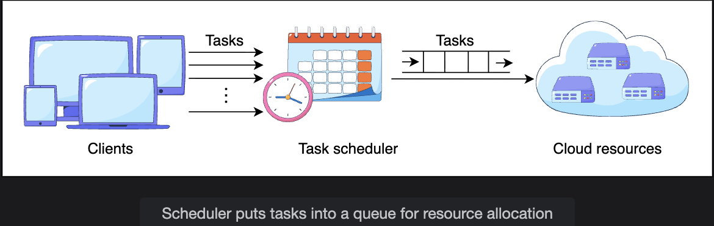
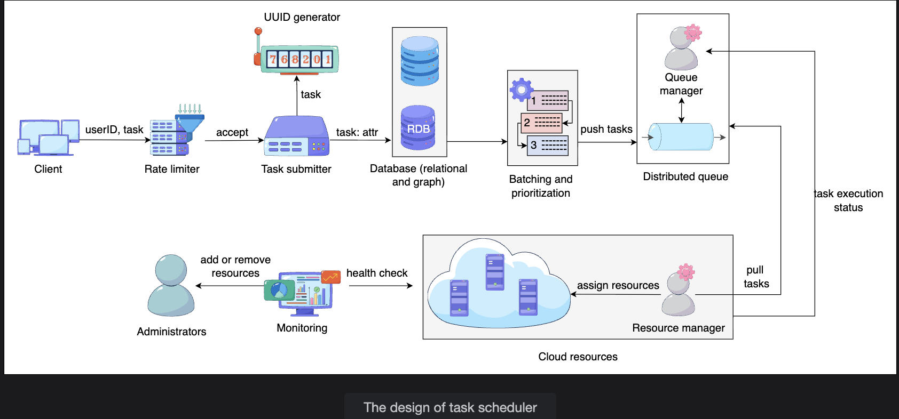

# Design of a Distributed Task Scheduler

> Examining the core components — rate limiter, task submitter, queue, resource manager, and monitoring — and how they integrate into a scalable, fault-tolerant scheduling system.

---

## Table of Contents

1. [Core Components Overview](#1-core-components-overview)
2. [Why Tasks Go Into a Queue](#2-why-tasks-go-into-a-queue)
3. [Task Submission Format](#3-task-submission-format)
4. [Detailed Component Design](#4-detailed-component-design)
5. [Database Schema](#5-database-schema)
6. [Why Store Tasks in a Database First?](#6-why-store-tasks-in-a-database-first)
7. [Full System Flow](#7-full-system-flow)
8. [Summary](#8-summary)

---

## 1. Core Components Overview

Scheduling operates at two distinct levels:

| Context | Scheduler Type | Key Concerns |
|---|---|---|
| Organization running its own cluster | Internal scheduler | Available capacity, job priority, execution order |
| Cloud provider | Multi-tenant scheduler | Strong isolation, fairness, priority controls across customers |

Regardless of context, the high-level components remain consistent:

```
+------------+      +---------------+      +-----------+
|            |      |               |      |           |
|  Clients   | -->  |   Scheduler   | -->  | Resources |
|            |      |               |      |           |
+------------+      +---------------+      +-----------+

Clients:    Entities initiating task execution (individuals, services, orgs)
Scheduler:  Matches clients to resources, determines execution order
Resources:  Computing infrastructure where tasks actually run (CPU, RAM, disk)
```

---

## 2. Why Tasks Go Into a Queue

Incoming tasks are not executed immediately — they are placed in a queue for three reasons:

```
Reason 1: Resource Availability
  Sufficient resources may not be immediately free.
  Task queued -> waits for a worker node to have capacity
  vs. rejected immediately because nothing is available

Reason 2: Dependencies
  Some tasks must wait for other tasks to complete first.
  Task B depends on Task A -> Task B queued until Task A finishes

Reason 3: Decoupling
  Clients hand off work asynchronously without waiting for execution.
  Client submits task -> gets an ID immediately -> continues doing other work
  Execution happens independently, in the background
```

**Important design constraint:**
```
This design assumes each task fits within the resource limits of a SINGLE node.

  If a task needs more than one node:
    -> Application layer must decompose it into smaller tasks
    -> OR use a higher-level cluster orchestrator (e.g., Kubernetes, Spark)

Long-running tasks:
  Applications should support periodic CHECKSUMMING
  (save progress snapshots at intervals)
  If a long task fails at hour 5 of an 8-hour run:
    -> Resume from last checkpoint (hour 4), not from the beginning
```

---

## 3. Task Submission Format

When a client submits a task, it includes:

### Resource Requirements

Exact quantification of resource needs is difficult for clients. Instead, the system offers **tiered resource categories**:

```
Tier      CPU Cores    RAM     Disk    Use Case
------    ---------    -----   ------  ---------------------------
Basic     1 core       2 GB    10 GB   Simple scripts, cron jobs
Regular   4 cores      8 GB    50 GB   Data processing, API tasks
Premium   16 cores     64 GB   500 GB  ML training, video encoding
```

This simplifies submission (clients pick a tier, not exact specs) and simplifies scheduling (the scheduler knows exactly what a "Regular" task needs).

### Task Dependencies

Tasks are classified by their relationship to other tasks:

```
Independent Tasks:
  No prerequisites
  Can run in PARALLEL with other independent tasks
  Example: "Encode video in 1080p" and "Encode video in 720p"
           (both can run simultaneously on different workers)

Dependent Tasks:
  Must execute SEQUENTIALLY based on a provided list of prerequisites
  Example: "Validate content" must complete BEFORE "Distribute to CDN"
  Stored as a Directed Acyclic Graph (DAG) in the graph database
```

```
DAG Example (media processing pipeline):

  [Upload complete]
        |
        v
  [Validate content]  ----+
        |                 |
        v                 v
  [Encode 1080p]    [Encode 720p]   <- parallel (independent)
        |                 |
        +--------+--------+
                 |
                 v
  [Push to CDN]                     <- dependent on both encodes completing
                 |
                 v
  [Notify user]
```

---

## 4. Detailed Component Design


### 4.1 Clients

Any individual, organization, or service that needs to submit tasks for asynchronous execution.

---

### 4.2 Rate Limiter

```
Purpose: Controls how many tasks a client can submit within a time window.

Policy:
  Limit determined by:
    - Client's subscription tier (basic, pro, enterprise)
    - Current system load (stricter limits during peak periods)

  If limit exceeded:
    -> Task is REJECTED with a clear error message
    -> Client must retry later or upgrade subscription
    -> System stability is preserved

Example:
  Basic plan:       100 task submissions/hour
  Pro plan:         10,000 task submissions/hour
  Enterprise plan:  Unlimited (subject to fair use)

  Client on basic plan submits task #101 in the same hour:
  -> Rejected: "Rate limit exceeded. Retry after 14 minutes."
```

---

### 4.3 Task Submitter

The task submitter is a **cluster of nodes** (not a single server) to ensure high availability.

```
Task submitter responsibilities:
  1. Admits tasks that pass the rate limiter
  2. Requests a unique ID from the ID generator
  3. Writes task data to the database

Cluster design:
  +------------------+
  | Submitter Node 1 |  <- active
  | Submitter Node 2 |  <- active
  | Submitter Node 3 |  <- standby
  +------------------+
        |
  [Cluster Manager]
  - Monitors nodes via heartbeats
  - Maintains mapping: task -> admitting node
  - If Node 1 fails -> reassigns its in-flight tasks to Node 2 or 3
  - Cluster Manager itself is REPLICATED to prevent SPOF
```

**Why a cluster (not a single node)?**

```
Single task submitter:
  -> Single point of failure
  -> All task submissions fail if it goes down

Cluster of submitters:
  -> Any node can admit any task
  -> One node fails -> others continue without interruption
  -> Horizontally scalable: add more nodes as submission volume grows
```

---

### 4.4 Unique ID Generator

```
Purpose: Assigns a globally unique identifier to each admitted task.

Properties:
  - Globally unique: no two tasks in the system share an ID
  - Ordered: lower ID = earlier submission (enables causality tracking)
  - High throughput: must generate IDs as fast as tasks are submitted

Used for:
  - Tracking task status throughout its lifecycle
  - Referencing tasks in the queue, database, and monitoring
  - Enabling dependency resolution (Task B lists Task A's ID as prerequisite)
```

---

### 4.5 Database

Two separate databases store different types of task data:

#### Relational Database (RDB) — Task Metadata

```
Stores:
  - Task IDs, user IDs
  - Resource requirements (tier)
  - Execution caps (maximum allowed runtime)
  - Retry counts and retry limits
  - Current status
  - Scheduling type (once, daily, weekly, etc.)
  - Delay tolerance

Best for:
  Structured, queryable metadata
  Status updates throughout the task lifecycle
  Batch selection: "find the top K highest-priority tasks to push to the queue"

Geo-replication:
  RDB replicated across data centers
  Multiple scheduler instances in different DCs share the same task state
  Improves both scale and geographic resilience
```

#### Graph Database (GDB) — Task Dependencies

```
Stores:
  The Directed Acyclic Graph (DAG) of dependent tasks

  Node = a task
  Edge = "must run before" relationship
  A -> B means Task A must complete before Task B can start

Why a graph database:
  DAG relationships are complex and deeply nested
  Relational databases handle them poorly (expensive recursive queries)
  Graph databases natively traverse these relationships efficiently

Key operation: Topological Sort
  Determines the correct execution order from the DAG
  Ensures no task starts before all its prerequisites are complete

  Example DAG:
    Validate -> Encode_1080p -> CDN_Push -> Notify
             -> Encode_720p  -> CDN_Push

  Topological sort order:
    1. Validate
    2. Encode_1080p (parallel with step 3)
    3. Encode_720p  (parallel with step 2)
    4. CDN_Push     (after both encodes complete)
    5. Notify       (after CDN_Push)
```

---

### 4.6 Batching and Prioritization

```
Why batching:
  Pushing one task at a time to the queue is inefficient
  Batching groups tasks and pushes the top K priority tasks together
  K determined by: available resources + subscription levels

Priority criteria:
  Tasks in the RDB are ranked by attributes like:
  - Delay tolerance (low tolerance = high priority)
  - Execution cap (short max runtime = schedule sooner)
  - Subscription level (enterprise tasks ahead of basic)
  - Submission time (older waiting tasks get priority boost to prevent starvation)

  Top K tasks selected -> pushed to the distributed queue
```

---

### 4.7 Distributed Queue

```
Purpose: Holds tasks waiting to be executed.

Key properties:
  Persistence:
    Tasks persist in the queue even if queue nodes fail
    No task is lost due to a queue node crash

  Visibility:
    When a worker picks up a task, it becomes INVISIBLE to others
    (prevents two workers from running the same task simultaneously)
    If the worker fails before completing:
      -> Visibility timeout expires
      -> Task becomes VISIBLE again
      -> Another worker picks it up and retries

  Retry enforcement:
    Queue tracks how many times each task has been attempted
    If max retries exceeded -> task removed from queue -> marked DEAD
```

```
Queue visibility mechanism:

  Task T is in queue (VISIBLE)
        |
        v
  Worker W1 picks up Task T
  Task T becomes INVISIBLE (timeout: 5 minutes)
        |
        v
  Scenario A: W1 completes successfully
    -> Queue Manager deletes Task T permanently
    -> Task status -> COMPLETED

  Scenario B: W1 crashes after 2 minutes
    -> 5-minute visibility timeout expires (no completion signal)
    -> Task T becomes VISIBLE again
    -> Worker W2 picks it up
    -> Task retried
```

---

### 4.8 Queue Manager

```
Purpose: Manages the distributed queue's operations.

Responsibilities:
  1. Task visibility: controls when tasks are visible or hidden from workers
  2. Deletion: removes successfully completed tasks
  3. Retry limit enforcement: removes tasks that exceed max retry count
  4. Queue selection: routes tasks to the appropriate queue based on load

  Peak vs off-peak queue management:
    Peak hours:   route urgent tasks to high-throughput queues
                  deprioritize batch/background jobs
    Off-peak:     process deferred batch jobs from lower-priority queues
                  maximize resource utilization during quiet periods
```

---

### 4.9 Resource Manager

```
Purpose: Tracks available resources and assigns them to tasks.

Responsibilities:
  1. Resource tracking:
     Maintains real-time view of free CPU, RAM, disk across all worker nodes
     Updated every time a task starts (resources reserved) or ends (resources freed)

  2. Task assignment:
     Pulls task from queue
     Finds a worker node that matches the task's resource tier
     Assigns task to that node

  3. Execution monitoring:
     Monitors each running task's resource consumption
     If a task exceeds its allocated resource limits:
       -> Task TERMINATED immediately
       -> Resources reclaimed
       -> Task marked as FAILED (retry if within retry limit)

  4. Execution cap enforcement:
     Task running longer than its ExecutionCap:
       -> Task TERMINATED
       -> Status: TIMED_OUT
```

```
Resource assignment flow:

  Task T: Premium tier (16 cores, 64 GB RAM) pulled from queue
        |
        v
  Resource Manager queries: "which workers have >= 16 cores and >= 64 GB free?"
        |
        v
  Candidates: [Node_47, Node_203, Node_891]
        |
        v
  Resource Manager selects Node_47 (lowest current load)
  Reserves 16 cores + 64 GB RAM on Node_47
        |
        v
  Task T dispatched to Node_47 for execution
```

---

### 4.10 Monitoring Service

```
Purpose: Checks the health of resources and the resource manager itself.

What it monitors:
  Worker node health:
    Each worker sends periodic heartbeats to the monitoring service
    Heartbeat missed -> node flagged as potentially failed
    Consecutive misses -> node declared FAILED
    Resource Manager notified -> resources on that node marked unavailable
    Tasks on that node rescheduled

  Resource Manager health:
    Monitoring service watches the resource manager itself
    If resource manager fails -> alert raised -> standby takes over

  Resource utilization:
    CPU, memory, disk usage across the fleet
    Under-utilized machines -> alert: consolidate tasks
    Over-utilized machines -> alert: redistribute tasks or scale out

Administrative alerts:
  Failed resources -> alert administrators to REPAIR
  Consistently failed resources -> alert to DECOMMISSION
  Unused resources -> alert to shut down (cost optimization)
```

---

## 5. Database Schema

### Relational Database — Tasks Table

| Column | Data Type | Description |
|---|---|---|
| `TaskID` | Integer | Uniquely identifies each task |
| `UserID` | Integer | ID of the task owner |
| `SchedulingType` | VarChar | `once`, `daily`, `weekly`, `monthly`, or `annually` |
| `TotalAttempts` | Integer | Maximum retries allowed if execution fails |
| `ResourceRequirements` | VarChar | Resource tier: `Basic`, `Regular`, or `Premium` |
| `ExecutionCap` | Time | Maximum execution time allowed (clock starts when resources are allocated) |
| `Status` | VarChar | `waiting`, `in_progress`, `done`, or `failed` |
| `DelayTolerance` | Time | Maximum acceptable delay before the task must start |
| `ScriptPath` | VarChar | Path to the script to execute (must be accessible to the worker node, e.g., mounted shared storage) |

### Schema Design Notes

```
SchedulingType:
  "once"    -> run one time, then archive
  "daily"   -> re-enqueue every 24 hours
  "weekly"  -> re-enqueue every 7 days
  Recurring tasks are re-inserted into the queue after each successful execution.

TotalAttempts:
  Combined with the queue's retry tracking.
  Task retried up to TotalAttempts times before being marked DEAD.

ExecutionCap:
  Clock starts when resources are ALLOCATED (not when task is submitted).
  Prevents tasks from running indefinitely if they hang.

DelayTolerance:
  Used during prioritization: tasks with low delay tolerance get higher priority.
  If delay tolerance is exceeded, user is notified (bounded waiting requirement).

ScriptPath:
  Worker node must have access to this path.
  Common approach: mount shared distributed storage (like Google Drive in Colab)
  so all worker nodes can access the same script file.
```

---

## 6. Why Store Tasks in a Database First?

> **Q: Why do we store tasks in a database before pushing to the queue? Why not push directly to the queue?**

**A: Four critical reasons make direct queue submission problematic:**

### Reason 1: Durability

```
Direct to queue:
  Client submits task -> pushed directly to queue
  Queue node crashes before task is processed -> task is LOST
  Client has no idea their task is gone

Database first:
  Client submits task -> persisted to database -> acknowledged to client
  Queue node crashes -> task still in database
  On recovery: task re-read from database, re-pushed to queue
  Task is NEVER lost
```

### Reason 2: Dependency Resolution

```
Direct to queue:
  Task B submitted -> pushed to queue immediately
  Task B starts running -> fails (Task A hasn't finished yet)
  No way to enforce ordering in the queue alone

Database + Graph DB:
  Task B submitted -> stored in RDB + dependency stored in GDB
  Scheduler reads DAG -> topological sort
  Task B is NOT pushed to queue until Task A completes
  Correct execution order guaranteed
```

### Reason 3: Batching and Prioritization

```
Direct to queue:
  Tasks pushed in submission order
  No opportunity to reorder by priority
  Low-priority task submitted first -> runs before high-priority task submitted 1ms later

Database first:
  All tasks accumulate in the database
  Scheduler reads the database, ranks by priority (delay tolerance, subscription tier, etc.)
  Top K highest-priority tasks pushed to the queue as a batch
  Priority is enforced correctly regardless of submission order
```

### Reason 4: Query and Status Tracking

```
Direct to queue:
  Queue is not designed for querying metadata
  "Show me all tasks for user_id=1234" -> impossible to query a queue efficiently
  "How many tasks are waiting?" -> hard to answer

Database first:
  All task metadata in the RDB -> fully queryable
  Status updates throughout lifecycle: waiting -> in_progress -> done
  Users can query status at any time
  Operations team can monitor queue depth, failure rates, etc.
```

---

## 7. Full System Flow

```
TASK SUBMISSION:

  Client submits task
        |
        v
  [Rate Limiter]
  Within quota?  Yes -> continue   No -> reject with error
        |
        v
  [Task Submitter Cluster]
  Admits task, requests unique ID
        |
        +---> [Unique ID Generator] -> returns task_id
        |
        v
  [Database]
  RDB: stores task metadata + status = "waiting"
  GDB: stores dependency edges (if dependent task)
        |
        v
  Client receives: task_id + "submitted successfully"


SCHEDULING LOOP (continuous):

  [Scheduler reads RDB]
  Identifies top K priority tasks (by delay tolerance, tier, etc.)
  Checks GDB: are all dependencies met for each candidate?
        |
        v
  [Scheduler pushes eligible tasks to Distributed Queue]


EXECUTION:

  [Queue Manager] makes tasks visible to workers
        |
        v
  [Resource Manager] pulls task from queue
  Finds a matching worker node (right resource tier)
  Reserves resources on that node
  Dispatches task
        |
        v
  Task executes on worker node
        |
        v
  SUCCESS:
    Worker signals completion
    Queue Manager deletes task from queue
    Resource Manager updates: resources freed
    RDB status updated: "done"

  FAILURE:
    Worker signals failure OR visibility timeout expires
    Task becomes visible in queue again
    Retry count incremented in RDB
    If retries < TotalAttempts -> retried
    If retries >= TotalAttempts -> removed from queue, status = "failed"


MONITORING (continuous):

  [Monitoring Service] checks heartbeats from all worker nodes
  Failed node detected:
    -> Resource Manager notified
    -> Resources on that node marked unavailable
    -> Tasks on that node re-queued for rescheduling
    -> Administrator alerted
```

---

## 8. Summary

### Component Roles at a Glance

| Component | Role |
|---|---|
| Clients | Submit tasks for asynchronous execution |
| Rate Limiter | Enforces per-client submission quotas |
| Task Submitter (cluster) | Admits tasks, gets IDs, writes to DB — HA via clustering |
| Unique ID Generator | Assigns globally unique, ordered task IDs |
| RDB | Stores task metadata, status, and scheduling attributes |
| GDB | Stores DAG of task dependencies for topological ordering |
| Distributed Queue | Holds tasks awaiting execution with visibility + retry semantics |
| Queue Manager | Manages visibility, deletion, retries, and queue selection |
| Resource Manager | Tracks free resources, assigns tasks, enforces execution caps |
| Monitoring Service | Detects failures, alerts admins, triggers rescheduling |

### Why the Design is Resilient

```
No single point of failure:
  Task Submitter  -> clustered
  Cluster Manager -> replicated
  Database        -> geo-replicated
  Queue           -> distributed + persistent
  Scheduler       -> can run as multiple instances

No task loss:
  Tasks persisted to DB before acknowledgment
  Queue persists tasks until explicit deletion on success
  Failed tasks become visible again for retry
  Failed nodes trigger rescheduling of their tasks

No indefinite waiting:
  DelayTolerance tracked in DB
  Exceeded tolerance -> user notified
  Bounded waiting requirement satisfied
```

---

