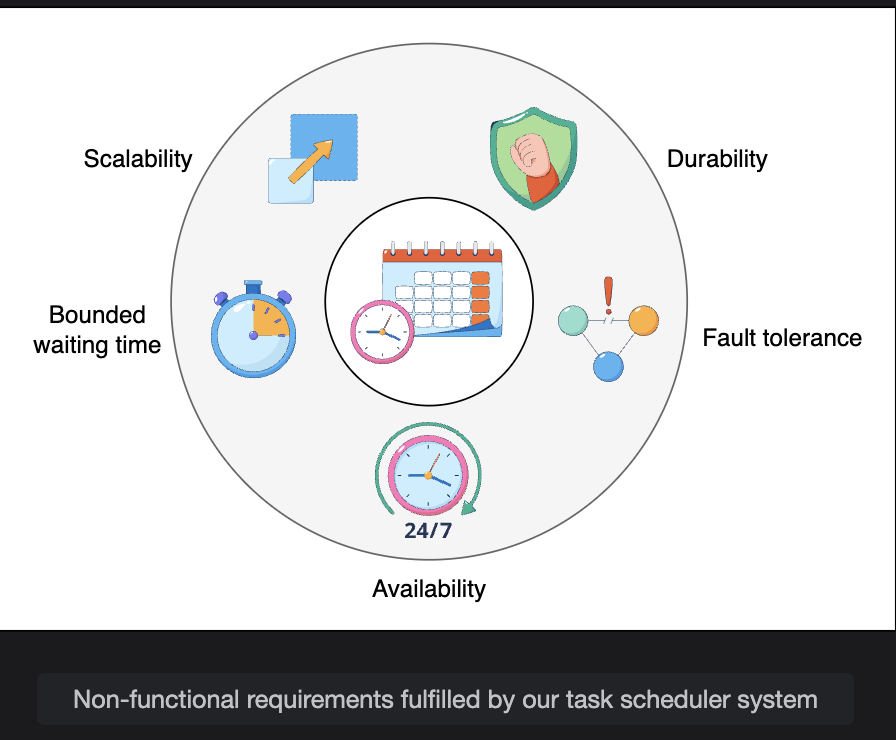

# Evaluation of a Distributed Task Scheduler's Design

> Verifying that the design fulfills every non-functional requirement, applying it to a real-world photo-sharing app scenario, and drawing together the key lessons of the system.

---

## Table of Contents

1. [Requirements Compliance](#1-requirements-compliance)
   - [Availability](#availability)
   - [Durability](#durability)
   - [Scalability](#scalability)
   - [Fault Tolerance](#fault-tolerance)
   - [Bounded Waiting Time](#bounded-waiting-time)
2. [Case Study: Cloud-Based Photo-Sharing App](#2-case-study-cloud-based-photo-sharing-app)
3. [Conclusion](#3-conclusion)
4. [Full Summary](#4-full-summary)

---

## 1. Requirements Compliance

### Availability

**Requirement:** The system must be highly available to schedule and execute tasks.

**How the design meets it:**

```
Every component is distributed and replicated:

  Rate Limiter:
    Replicated across multiple nodes
    One node fails -> other rate limiter nodes continue enforcing quotas
    No availability gap

  Task Submitter:
    Cluster of nodes (not a single server)
    Cluster manager monitors via heartbeats
    Node fails -> cluster manager reassigns its tasks to healthy nodes
    Cluster manager itself is replicated to prevent SPOF

  Distributed Queue:
    Queue persisted across multiple nodes
    One queue node fails -> tasks remain in other queue nodes
    No tasks lost, no scheduling gap

  Resource Monitoring:
    Continuous monitoring detects failed resources
    Automatically provisions replacements or reallocates work
    Resources added or removed to match demand in real time
```

```
Availability chain — every link is resilient:

  Client -> [Rate Limiter (replicated)]
          -> [Task Submitter (clustered)]
          -> [Database (geo-replicated)]
          -> [Distributed Queue (distributed)]
          -> [Resource Manager]
          -> [Worker Nodes]
          -> [Monitoring Service]

  No single component failure can take down the full pipeline.
```

---

### Durability

**Requirement:** Submitted tasks must not be lost.

**How the design meets it:**

```
Two-phase persistence model:

  Phase 1: Immediate persistence on submission
    Client submits task
         |
         v
    Task written to PERSISTENT DISTRIBUTED DATABASE
    Client receives acknowledgment: "task_id=XYZ, submitted successfully"
         |
         (task now safe in durable storage)
         v

  Phase 2: Deferred queue insertion near execution time
    Scheduler reads database, selects top-K priority tasks
    Pushes them to distributed queue close to when they will execute
    Tasks remain in the database until successfully completed

  Why this guarantees durability:
    - Tasks are in durable DB from the moment of submission
    - If the scheduler crashes before pushing to queue -> task still in DB -> recovered on restart
    - If the queue crashes -> tasks still in DB -> re-pushed when queue recovers
    - Tasks are only DELETED from storage after confirmed successful execution
```

```
Durability guarantee timeline:

  t=0:  Client submits task
  t=0+: Task persisted to distributed DB (geo-replicated)
  t=0+: Client receives confirmation
  t=30m: Scheduler pushes task to queue (near execution time)
  t=31m: Task executes successfully
  t=31m: Task deleted from queue AND marked DONE in DB

  Failure scenario:
  t=0:  Task persisted to DB
  t=15m: Scheduler crashes
  t=16m: Standby scheduler takes over
  t=16m: Reads DB -> finds pending task -> continues normally
  TASK IS NEVER LOST ✅
```

---

### Scalability

**Requirement:** The system must handle increasing volumes of tasks.

**How the design meets it:**

Every layer scales horizontally — no architectural redesign required as volume grows:

```
Scaling dimension -> How to scale

Task submission rate is too high:
  -> Add more nodes to the Task Submitter cluster
  -> Each new node handles a share of incoming submissions

Database cannot handle more read/write throughput:
  -> Add more nodes to the Distributed Relational Database (sharding)
  -> Scale the Graph Database independently for dependency resolution

Queue throughput is insufficient:
  -> Add more queue partitions
  -> Add queues specialized for specific task types (video encoding queue,
     moderation queue, etc.)
  -> Each specialized queue scales independently

Compute is not enough to run all tasks:
  -> Provision additional worker nodes (cloud auto-scaling)
  -> Resource manager automatically discovers and uses new nodes

Tenant count grows:
  -> Add per-tenant queue instances (multi-tenant isolation maintained)
  -> Rate limiter scales independently to enforce per-tenant quotas
```

```
Scalability summary:

  Component          | Scaling Method
  -------------------|----------------------------------
  Rate Limiter       | Add nodes to the rate limiter cluster
  Task Submitter     | Add nodes to the submitter cluster
  Database (RDB)     | Horizontal sharding + read replicas
  Database (GDB)     | Add graph DB nodes
  Distributed Queue  | Add partitions or specialized queues
  Worker Nodes       | Cloud auto-scaling (scale-out/in)
  Resource Manager   | Add resource manager replicas
```

---

### Fault Tolerance

**Requirement:** The system must operate uninterrupted despite component faults.

**How the design meets it:**

```
Fault scenario 1: Worker node fails mid-task

  Task T assigned to Worker Node 12
  Node 12 crashes at 60% task completion
        |
        v
  Queue: Task T's visibility timeout expires (no completion signal)
  Task T becomes VISIBLE again in the queue
        |
        v
  Resource Manager: picks up Task T, assigns to Worker Node 47
  Task T retried from scratch (or from last checkpoint if checkpointing implemented)
        |
        v
  Task T completes successfully on Node 47
  ZERO TASK LOSS ✅

Fault scenario 2: Task has an infinite loop

  Task T running for longer than its ExecutionCap
  Scheduler detects timeout
  Task T TERMINATED
  Resources released immediately
  User NOTIFIED: "Task exceeded execution limit"
  Retry policy evaluated (retry if within TotalAttempts limit)

Fault scenario 3: Task repeatedly fails

  Task T fails on attempt 1 -> retried
  Task T fails on attempt 2 -> retried
  Task T fails on attempt 3 -> TotalAttempts exhausted
  Task T status -> DEAD
  Task removed from queue
  User NOTIFIED: "Task failed after maximum retries"
  No zombie tasks consuming resources indefinitely ✅

Fault scenario 4: Scheduler node fails

  Standby scheduler detects failure (via heartbeat monitoring)
  Standby scheduler promoted to primary (leader election)
  Reads last known state from geo-replicated database
  Continues scheduling with minimal gap
  NO TASKS LOST (all in durable DB) ✅
```

---

### Bounded Waiting Time

**Requirement:** Tasks must not wait indefinitely. If wait exceeds a threshold, users must be notified.

**How the design meets it:**

```
Mechanism: Delay tolerance monitoring

  Every task has a DelayTolerance value (maximum acceptable wait before starting)

  Scheduler continuously monitors:
    How long has each task been waiting?
    Is it approaching its delay tolerance limit?

  Action at threshold:
    Task approaching delay tolerance -> promoted to urgent queue
    Processed immediately

  If system cannot schedule even after promotion (extreme overload):
    User notified: "Task cannot be scheduled within the expected window.
                   Please retry or upgrade your resource tier."

  Result:
    No task waits beyond its defined delay tolerance without the user knowing
    Bounded waiting requirement fully satisfied
```

```
Bounded waiting flow:

  Task submitted, delay_tolerance = 30 minutes
  t=0:   Task enters delayable queue
  t=25:  Scheduler detects: 5 minutes until tolerance exceeded
  t=25:  Task promoted to urgent queue
  t=26:  Task executed (within tolerance) ✅

  OR (under extreme load):
  t=30:  Task could not be started even from urgent queue
  t=30:  User notified: "Scheduling delayed — please retry" ✅
         (user knows, task is not silently stuck)
```

---

### Requirements Compliance Summary

| Requirement | Mechanism | Status |
|---|---|---|
| **Availability** | Every component replicated/clustered; monitoring adds/removes resources | Met |
| **Durability** | Tasks persisted to geo-replicated DB immediately on submission; deleted only after confirmed success | Met |
| **Scalability** | Horizontal scaling at every layer: submitter, DB, queue, worker nodes | Met |
| **Fault Tolerance** | Queue retry semantics; execution caps; max retry limits; scheduler leader election | Met |
| **Bounded Waiting** | Delay tolerance tracked per task; promotion to urgent queue before limit; user notification on breach | Met |


---

## 2. Case Study: Cloud-Based Photo-Sharing App

> **Scenario:** Millions of daily photo uploads. After each upload, four tasks must run: thumbnail generation, content moderation, metadata indexing, and watermarking. These tasks are independent but must follow a specific order. Critical tasks (moderation) should be prioritized. Failed tasks should retry up to 3 times; after that, notify the user.

---

### Task Analysis

```
Upload complete -> four tasks must run in this order:

  1. Content Moderation     <- MUST run first (block distribution if content violates policy)
  2. Thumbnail Generation  <- runs after moderation clears (or in parallel — see below)
  3. Metadata Indexing     <- runs after moderation clears
  4. Watermarking          <- runs after moderation clears

  Dependencies stored in the Graph DB as a DAG:

  [Content Moderation]
          |
          +-----------> [Thumbnail Generation]  (parallel)
          |
          +-----------> [Metadata Indexing]      (parallel)
          |
          +-----------> [Watermarking]           (parallel)

  Steps 2, 3, 4 are INDEPENDENT of each other and run in parallel
  after step 1 completes. Only step 1 is a prerequisite for all others.
```

---

### Q1: Priorities, Dependencies, and Resource Allocation

**Priorities:**

```
Task                    Priority Queue   Delay Tolerance   Reason
-------------------     --------------   ---------------   ------
Content Moderation      Urgent           < 5 seconds       Must run before distribution;
                                                           safety-critical
Thumbnail Generation    Delayable        60 seconds        Users can wait briefly for thumbnail
Metadata Indexing       Delayable        2 minutes         Search index can lag slightly
Watermarking            Periodic         10 minutes        Non-urgent, batch-friendly
```

**Dependency resolution:**

```
Graph DB stores the DAG:
  [Upload Complete event]
       |
       v
  [Moderation Task]  <- stored as prerequisite for all others
       |
  Topological sort determines execution order:
    1. Moderation runs first
    2. Once Moderation status = DONE in DB:
       -> Thumbnail, Indexing, Watermarking all become eligible
       -> All three pushed to queue simultaneously
       -> Run in parallel on separate worker nodes
```

**Resource allocation:**

```
Use tiered resource requirements:

  Content Moderation:     Regular tier  (needs ML inference: 4 CPU, 8 GB RAM)
  Thumbnail Generation:   Basic tier    (image resize: 1 CPU, 2 GB RAM)
  Metadata Indexing:      Basic tier    (DB write: 1 CPU, 2 GB RAM)
  Watermarking:           Basic tier    (image overlay: 1 CPU, 2 GB RAM)

Resource Manager:
  Assigns moderation task to a Regular-tier worker node
  Assigns thumbnail, indexing, watermarking to Basic-tier worker nodes
  (Three Basic tasks can run simultaneously on the same or different nodes)

Efficiency:
  Moderation runs on dedicated resources (not sharing with low-priority tasks)
  Three parallel tasks after moderation -> 3x faster than sequential execution
```

---

### Q2: Task Failures and Retries

```
Retry configuration:
  TotalAttempts = 3 (set in database schema at submission time)
  Each task type configured independently

Retry flow:

  Content Moderation attempt 1: FAILS (ML service temporarily unavailable)
  -> Task returns to queue, retry count = 1
  -> Scheduler picks it up from urgent queue (high priority maintained on retry)

  Content Moderation attempt 2: FAILS (timeout)
  -> Task returns to queue, retry count = 2

  Content Moderation attempt 3: SUCCESS ✅
  -> Status updated: DONE
  -> Downstream tasks (Thumbnail, Indexing, Watermarking) unlocked

  OR:

  Content Moderation attempt 3: FAILS
  -> retry count = 3 = TotalAttempts
  -> Task status: DEAD
  -> Removed from queue
  -> User notified: "Your photo could not be moderated after 3 attempts.
                     Please re-upload or contact support."
  -> Downstream tasks: CANCELLED (moderation prerequisite not met)
```

**Why moderation failures block downstream tasks:**
```
Thumbnail, Indexing, Watermarking are gated on Moderation completing.
If Moderation is DEAD:
  -> No thumbnail shown to the user (photo not visible in feed)
  -> No metadata indexed (photo not searchable)
  -> No watermark applied
This is the correct behavior: don't distribute content that failed moderation.
```

---

### Q3: Scalability and High Availability

**Scalability:**

```
Millions of uploads/day:

  = Millions of moderation tasks
  + Millions of thumbnail tasks
  + Millions of indexing tasks
  + Millions of watermarking tasks
  = ~4 million tasks per day from uploads alone

Scaling strategy:
  Specialized queues per task type:
    moderation_queue    -> high-priority, high-capacity
    thumbnail_queue     -> basic-tier workers
    indexing_queue      -> basic-tier workers
    watermarking_queue  -> batch-friendly, off-peak scheduling

  Each queue scales independently:
    Moderation backlog grows -> add more ML inference worker nodes
    Watermarking can run at night -> no scaling needed during peak hours

  Rate limiter per user:
    Prevents any single user from monopolizing the scheduler
    (e.g., a script uploading 100,000 photos simultaneously)
```

**High Availability:**

```
Component            | HA Mechanism
---------------------|-------------------------------------------
Rate Limiter         | Replicated across multiple nodes
Task Submitter       | Cluster of nodes + cluster manager replica
Database (RDB + GDB) | Geo-replicated across multiple data centers
Distributed Queues   | Distributed, persistent (no single queue node = SPOF)
Resource Manager     | Replicated with leader election
Worker Nodes         | Auto-scaling group; failed nodes replaced automatically
Monitoring Service   | Watches all components; triggers alerts + remediation

Upload flow during partial outage:
  One data center goes down
  -> Geo-replicated DB ensures task data is safe in other DCs
  -> Traffic rerouted to healthy DC
  -> Processing continues without user-visible interruption
```

---

## 3. Conclusion

```
Task schedulers operate at two levels:

  OS-level scheduler:
    Manages processes on a single machine
    Multi-feedback queues, CPU time slicing
    Scope: one node, shared memory

  Data center-level (distributed) scheduler:
    Manages billions of tasks across many machines and data centers
    Requires distributed coordination, fault tolerance, and multi-tenant fairness
    Scope: thousands of nodes, distributed state
```

**Key lessons from the full design:**

```
1. FIFO queues are insufficient for mixed-urgency workloads
   Solution: Multiple priority queues (Urgent, Delayable, Periodic)
             + delay tolerance parameter for per-task prioritization

2. Single queues become bottlenecks
   Solution: Distributed queues that scale horizontally
             + specialized queues per task type

3. Task dependencies require more than a queue
   Solution: DAG stored in a Graph Database
             + topological sort determines correct execution order
             + tasks only pushed to queue when prerequisites are met

4. Resource utilization requires active management
   Solution: Monitoring service dynamically adds/removes resources
             + non-urgent tasks deferred to off-peak hours
             + cloud auto-scaling for demand spikes

5. Reliability requires fault-tolerant task execution
   Solution: Queue retry semantics (visibility timeout)
             + execution caps (terminate runaway tasks)
             + max retry limits (prevent zombie tasks)
             + idempotency (correct results even after retries)

6. Multi-tenant environments require security
   Solution: Authentication + RBAC
             + sandboxing (containers/VMs)
             + performance isolation (quota enforcement)
```

---

## 4. Full Summary

### Non-Functional Requirements Met

```
Availability:      Replicated + clustered at every layer → no SPOF
Durability:        Persist to DB first → delete only after confirmed success
Scalability:       Horizontal scaling at every layer → no architectural ceiling
Fault Tolerance:   Queue retries + execution caps + leader election → uninterrupted
Bounded Waiting:   Delay tolerance + urgent promotion + user notification → no silent delays
```

### Design Decisions at a Glance

```
Problem                          Solution
-------------------------------  -------------------------------------------
FCFS head-of-line blocking       Three priority queues + delay tolerance
Task dependencies                DAG in Graph DB + topological sort
Resource monopolization          Execution caps with timeout termination
Duplicate execution on retry     Task idempotency (deduplication IDs)
Untrusted code in shared env     Sandboxing + RBAC + performance isolation
Peak/off-peak utilization gap    Deferred scheduling + cloud auto-scaling
Long task failure recovery       Checkpointing + resume from last save point
Starvation of low-priority tasks Promote tasks approaching delay limit
Single points of failure         Replicate and cluster every component
```

### Photo App Task Lifecycle (End to End)

```
Photo uploaded
     |
     v
[Rate Limiter] -> rejects if user over quota
     |
     v
[Task Submitter] -> creates 4 task records in RDB + DAG in GDB
     |
     v
[Scheduler] -> reads DAG -> Moderation is prerequisite -> pushes ONLY Moderation first
     |
     v
[Moderation Worker] -> executes content check
     |
  Success?
  YES -> status = DONE -> Thumbnail, Indexing, Watermarking pushed to queue
  NO  -> retry (up to 3) -> if all fail: DEAD, downstream CANCELLED, user notified
     |
     v
[Thumbnail + Indexing + Watermarking workers] -> run in PARALLEL
     |
     v
All tasks complete -> user's photo is live, indexed, watermarked ✅
```

---

