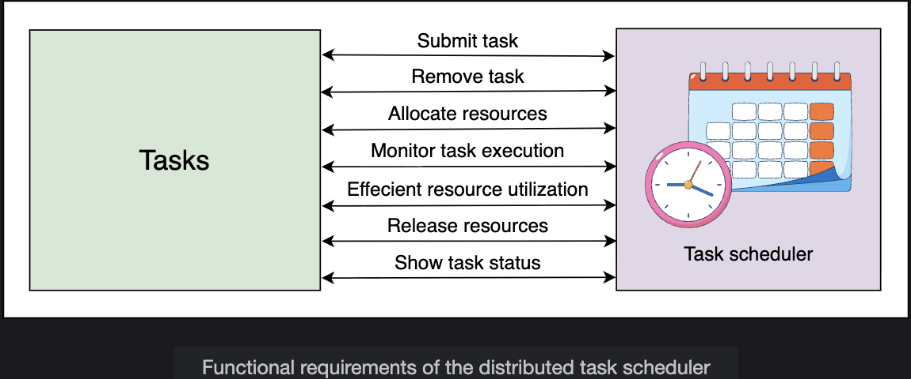
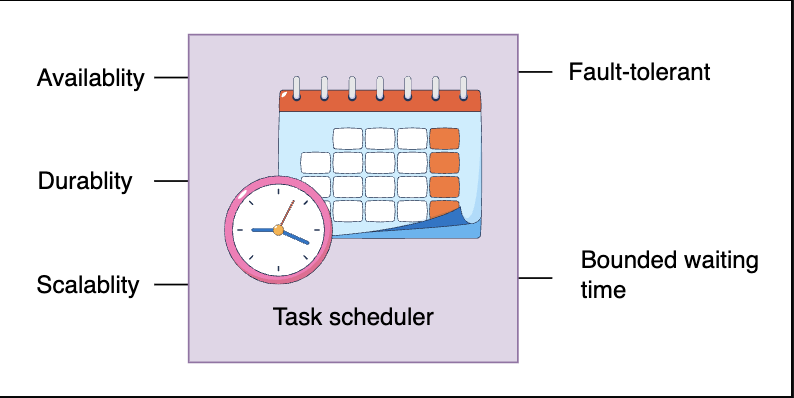
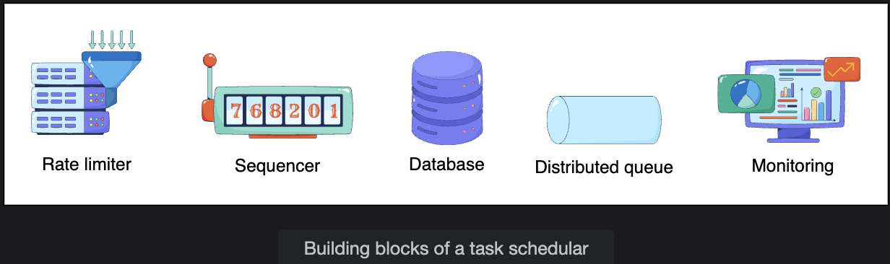

# Requirements of a Distributed Task Scheduler

> Defining what the system must do, how well it must do it, and which infrastructure building blocks make it possible.

---

## Table of Contents

1. [Functional Requirements](#1-functional-requirements)
2. [Non-Functional Requirements](#2-non-functional-requirements)
3. [Building Blocks](#3-building-blocks)
4. [Summary Cheat Sheet](#4-summary-cheat-sheet)

---

## 1. Functional Requirements

These define the **core operations** the distributed task scheduler must support.

---

### 1.1 Submit Tasks

Users can submit tasks for execution, specifying what work needs to be done, what resources it needs, and any scheduling constraints (e.g., run at a specific time, run after another task).

```
Task submission includes:
  - Task definition (what to run)
  - Resource requirements (CPU cores, memory, storage)
  - Priority level (urgent, normal, low)
  - Scheduling constraints (run at 3am, run after task_X completes)
  - Retry policy (retry 3 times on failure, with exponential backoff)
  - Deadline (must complete by time T)
```

---

### 1.2 Allocate Resources

The system assigns the necessary resources to each task based on its requirements and current resource availability.

```
Resource allocation process:

  Task submitted: "needs 4 CPU cores, 8 GB RAM"
        |
        v
  Scheduler checks available machines
        |
        v
  Finds Machine 47: 6 CPU cores available, 12 GB RAM free
        |
        v
  Assigns Task to Machine 47
  Reserves 4 cores + 8 GB RAM on that machine
        |
        v
  Task begins execution

Key principles:
  - Light tasks should NOT occupy heavy resources (wasteful)
  - Heavy tasks should NOT be assigned to under-resourced machines (will fail)
  - Fairness: all tenants receive equitable access within their cost class
```

**The fairness requirement explained:**

```
Multi-tenant environment: Tenant A and Tenant B share the same cluster

  Without fairness:
    Tenant A submits 10,000 tasks simultaneously
    -> Tenant A consumes all available resources
    -> Tenant B's tasks wait indefinitely (starvation)

  With fairness:
    Each tenant gets a proportional share of resources based on their cost class
    Tenant A's burst does not starve Tenant B
    Resource quotas enforced per tenant
```

---

### 1.3 Remove Tasks

Users can cancel submitted tasks that have not yet completed.

```
Cancel scenarios:
  - Task waiting in queue (not yet started)  -> remove from queue immediately
  - Task currently executing                 -> send stop signal, reclaim resources
  - Task in a retry cycle                    -> cancel pending retry, mark as cancelled

State after cancellation:
  Task marked as CANCELLED in the database
  Resources released back to the pool
  User notified of cancellation confirmation
```

---

### 1.4 Monitor Task Execution

The system continuously tracks task execution and automatically reschedules tasks that fail.

```
Monitoring responsibilities:

  Health checks:
    Worker nodes send periodic heartbeats to the scheduler
    No heartbeat received -> node assumed failed -> tasks rescheduled

  Task-level tracking:
    Task starts   -> status: RUNNING
    Task succeeds -> status: COMPLETED, resources released
    Task fails    -> status: FAILED, retry policy evaluated
    Retry limit reached -> status: DEAD, user notified

  Execution timeout:
    Task running longer than its defined timeout
    -> Scheduler marks it as TIMED_OUT
    -> Resources reclaimed
    -> Retry or notify user depending on policy
```

```
Failure handling flow:

  Task assigned to Worker Node 12
        |
        v
  Worker Node 12 fails (hardware crash)
        |
        v
  Scheduler detects: no heartbeat from Node 12
        |
        v
  All tasks on Node 12 marked as FAILED
        |
        v
  Scheduler reassigns each task to a healthy node
        |
        v
  Tasks resume execution (no manual intervention required)
```

---

### 1.5 Efficient Resource Utilization

Resources (CPU and memory) must be used efficiently to optimize both time and cost.

```
Inefficiency examples to avoid:

  Under-utilization:
    Machine has 32 CPU cores, task only needs 1
    -> Assigning this task alone wastes 31 cores
    -> Scheduler should bin-pack: assign multiple small tasks to fill the machine

  Over-allocation:
    Task requests 16 GB RAM but typically uses 2 GB
    -> Wastes 14 GB that could serve other tasks
    -> Scheduler should track actual usage and adjust future allocations

  Mismatched placement:
    GPU-optimized task assigned to a CPU-only machine
    -> Task runs slower or fails
    -> Scheduler must match task resource TYPE to machine capabilities
```

```
Efficiency techniques:
  Bin packing:    Fill machines with complementary small tasks
  Right-sizing:   Learn actual usage patterns, adjust future allocations
  Preemption:     Allow high-priority tasks to preempt lower-priority ones
                  (low-priority task paused and rescheduled to free resources)
```

---

### 1.6 Release Resources

The system immediately reclaims resources after a task completes, making them available for new tasks.

```
Resource release timeline:

  Task completes at t=10:00:00.000
        |
        v
  Scheduler notified: task COMPLETED
        |
        v
  Resources marked as AVAILABLE at t=10:00:00.001
        |
        v
  Next task in queue can be assigned to these resources

Importance: Delayed resource release = lower throughput
            Every second of delay is a second another task waits unnecessarily
```

---

### 1.7 Show Task Status

Users can query the current status of their submitted tasks at any time.

```
Possible task statuses:

  SUBMITTED   -> Task received, awaiting scheduling
  QUEUED      -> Task in the execution queue, waiting for resources
  RUNNING     -> Task actively executing on a worker node
  COMPLETED   -> Task finished successfully
  FAILED      -> Task failed, within retry limit
  RETRYING    -> Task being retried after failure
  TIMED_OUT   -> Task exceeded its maximum execution time
  CANCELLED   -> Task cancelled by the user
  DEAD        -> Task exhausted all retries, permanently failed
```

```
Status query example:

  User: getTaskStatus(task_id="task_8675309")
  Response: {
    "task_id": "task_8675309",
    "status": "RUNNING",
    "worker_node": "node-47",
    "started_at": "2024-03-15T14:32:01Z",
    "elapsed_seconds": 47,
    "estimated_completion": "2024-03-15T14:35:00Z"
  }
```

---

### Functional Requirements Summary

| # | Requirement | Core Question It Answers |
|---|---|---|
| 1 | Submit Tasks | How does work enter the system? |
| 2 | Allocate Resources | Which machine runs which task? |
| 3 | Remove Tasks | How does a user cancel work in flight? |
| 4 | Monitor Execution | What happens when tasks or nodes fail? |
| 5 | Efficient Utilization | How is resource waste minimized? |
| 6 | Release Resources | How quickly do freed resources become reusable? |
| 7 | Show Task Status | How does a user know what's happening with their task? |

---


## 2. Non-Functional Requirements

These define the **quality attributes** that make the scheduler production-grade.

---

### 2.1 Availability

The system must be **highly available** — capable of scheduling and executing tasks at all times, even during component failures.

```
Why availability is critical:
  Background task schedulers are often invisible to users — until they go down.
  If the scheduler is unavailable:
    - No new tasks are scheduled
    - Running tasks may not recover from failures (no rescheduling)
    - Queued tasks continue to accumulate, creating a backlog
    - SLA violations occur

Target: 99.99%+ uptime
Strategy: Redundant scheduler nodes, replica task queues, multi-AZ deployment
```

---

### 2.2 Durability

Submitted tasks must **not be lost** — even if the scheduler crashes immediately after a task is submitted.

```
Durability guarantee:

  User submits task at t=0
  Scheduler crashes at t=1 (before the task starts)
  Scheduler recovers at t=5

  Expected behavior:
    Task is still in the system at t=5
    Scheduler picks it up and executes it
    User never knows the scheduler crashed

  How:
    Tasks persisted to durable storage immediately upon submission
    (before acknowledging success to the user)
    Recovery reads from durable storage, not in-memory state
```

---

### 2.3 Scalability

The system must **handle increasing volumes of tasks** without redesign or performance degradation.

```
Scale dimensions:

  Number of tasks:
    1,000 tasks/day -> 1,000,000 tasks/day -> 1,000,000,000 tasks/day
    Scheduler must handle each scale without architectural changes

  Number of tenants:
    10 tenants -> 10,000 tenants
    Per-tenant queues and quotas must scale independently

  Number of worker nodes:
    100 machines -> 100,000 machines
    Resource tracking must scale with fleet size

Strategy:
  Horizontal scaling of scheduler nodes
  Partitioning of task queues
  Distributed resource state management
```

---

### 2.4 Fault Tolerance

The system must **operate uninterrupted** despite component failures.

```
Components that can fail and how the system handles each:

  Worker Node fails:
    -> Heartbeat stops -> Scheduler detects failure
    -> Tasks on failed node rescheduled to healthy nodes
    -> No tasks lost

  Scheduler Node fails:
    -> Replica scheduler takes over (leader election)
    -> Tasks in the queue are still in durable storage
    -> New scheduler leader picks up from last known state
    -> No tasks lost, minimal scheduling gap

  Database fails:
    -> Read from replica
    -> Writes buffered until primary recovers
    -> No tasks lost

  Network partition:
    -> Tasks within each partition continue locally
    -> Cross-partition coordination deferred
    -> Reconciliation on reconnection
```

---

### 2.5 Bounded Waiting Time

Tasks must **not wait indefinitely** before execution. If wait time exceeds a defined threshold, the user must be notified.

```
Without bounded waiting:
  Task submitted at t=0
  System overloaded -> task queued
  No resources available for 3 hours
  User has no idea when (or if) their task will run

With bounded waiting:
  Task submitted at t=0
  Wait time threshold: 30 minutes
  At t=30: "Your task has been queued for 30 minutes.
            Estimated start time: 14:45 UTC.
            Would you like to increase priority or cancel?"

This prevents:
  - Silent failures (tasks stuck in queue forever)
  - User frustration from lack of visibility
  - SLA violations (task was supposed to start within X minutes)
```

---

### Non-Functional Requirements Summary

| Requirement | Target | Key Strategy |
|---|---|---|
| **Availability** | 99.99%+ uptime | Redundant scheduler nodes, multi-AZ |
| **Durability** | No task loss on crash | Persist to durable storage before acknowledging |
| **Scalability** | Billions of tasks, thousands of tenants | Horizontal scaling, queue partitioning |
| **Fault Tolerance** | No interruption on component failure | Replicas, leader election, heartbeat monitoring |
| **Bounded Waiting** | Notify users before deadline breach | Wait time tracking, threshold-based alerts |

---


## 3. Building Blocks

The distributed task scheduler is composed of five infrastructure components:


---

### Rate Limiter

```
Purpose: Limits the number of tasks any single user or tenant can submit
         in a given time window.

Why needed:
  Without rate limiting:
    One tenant submits 1 billion tasks simultaneously
    -> Overwhelms the scheduler's ingestion pipeline
    -> Queue grows unboundedly
    -> Other tenants' tasks are starved
    -> System becomes unstable

  With rate limiting:
    Each tenant limited to X task submissions per second
    Excess submissions rejected with a meaningful error message
    System stability maintained under any submission pattern

Role in overall design:
  First line of defense at the ingestion boundary
  Protects all downstream components from overload
```

---

### Sequencer

```
Purpose: Assigns unique, ordered identifiers to each submitted task.

Why needed:
  - Every task needs a globally unique ID for tracking and reference
  - IDs should encode ordering information (task submitted earlier gets lower ID)
  - Enables causality: if Task A must run before Task B, IDs enforce ordering

Properties of the sequencer-generated ID:
  If ID_A < ID_B, then Task A was submitted before Task B
  -> Enables chronological sorting of tasks in the queue
  -> Supports dependency chains (Task B waits for Task A)

Example:
  Task submitted at 14:32:01.000 -> ID: 1710505921000001
  Task submitted at 14:32:01.005 -> ID: 1710505921005002
  ID ordering reflects submission ordering
```

---

### Database(s)

```
Purpose: Stores all task-related information persistently.

What gets stored:
  Task metadata:
    - task_id, owner, submission_time
    - resource requirements (CPU, memory, storage)
    - priority, deadline, retry policy
    - current status, assigned worker node
    - execution history (start time, end time, exit code)

  Resource state:
    - Available machines and their current resource levels
    - Which tasks are assigned to which machines

  Tenant data:
    - Quotas, usage, billing

Why distributed database:
  Single DB -> SPOF + scalability ceiling
  Distributed DB -> replicated, sharded, no single failure point
```

---

### Distributed Queue

```
Purpose: Arranges tasks in execution order, decoupling submission from execution.

How it works:
  Producer side (scheduler):
    Tasks enter the queue in priority + submission order

  Consumer side (worker nodes):
    Worker nodes poll the queue for the next available task
    Task dequeued when a worker picks it up
    If worker fails before completing: task returned to queue

Why a queue (not direct assignment):
  Direct assignment:
    Scheduler must know which workers are available right now
    Worker goes down -> scheduler must re-route immediately
    Tightly coupled, fragile

  Queue-based:
    Scheduler puts task in queue, doesn't care which worker takes it
    Workers pull from queue when ready (pull model)
    Worker goes down -> task remains in queue for another worker
    Loosely coupled, resilient
```

---

### Monitoring

```
Purpose: Continuously checks resource health and detects failed tasks.

What it monitors:
  Worker node health:
    Each worker sends a heartbeat every N seconds
    No heartbeat received -> node flagged as potentially failed
    Consecutive missed heartbeats -> node declared FAILED
    All tasks on that node rescheduled

  Task execution health:
    Task running longer than its timeout -> flagged as TIMED_OUT
    Task exit code non-zero -> flagged as FAILED
    Retry policy evaluated

  Queue health:
    Queue depth growing unboundedly -> alert (more workers needed)
    Task wait time exceeding threshold -> notify submitting user

  Resource utilization:
    CPU / memory usage across all worker nodes
    Under-utilized machines -> consolidate tasks
    Over-utilized machines -> redistribute tasks
```

---

### Building Blocks Summary

```
Task Submission Flow:

  User submits task
        |
        v
  [Rate Limiter]      <- rejects if over quota
        |
        v
  [Sequencer]         <- assigns unique ordered ID
        |
        v
  [Database]          <- persists task immediately (durability)
        |
        v
  [Distributed Queue] <- task enters execution queue
        |
        v
  Worker Node picks up task from queue
        |
        v
  [Monitoring]        <- tracks execution, detects failures
        |
        v
  Task completes -> [Database] updated -> resources released
```

---

## 4. Summary Cheat Sheet

### Requirements at a Glance

```
Functional (What it does):           Non-Functional (How well):
──────────────────────────           ──────────────────────────
Submit tasks                          Availability  -> 99.99%+ uptime
Allocate resources (fair + efficient) Durability    -> no task loss on crash
Remove (cancel) tasks                 Scalability   -> billions of tasks
Monitor execution + auto-reschedule   Fault tolerance -> survives component failures
Efficient resource utilization        Bounded waiting -> notify before deadline breach
Release resources immediately
Show task status (7 states)
```

### Building Blocks at a Glance

```
Rate Limiter      -> Protects system from submission overload (per-tenant quotas)
Sequencer         -> Globally unique, ordered task IDs (enables causality)
Database          -> Durable task persistence (survives crashes)
Distributed Queue -> Decouples submission from execution (resilient worker model)
Monitoring        -> Detects failures, triggers rescheduling, alerts on wait times
```

### Task Lifecycle

```
SUBMITTED -> QUEUED -> RUNNING -> COMPLETED
                  |         |
                  v         v
               CANCELLED  FAILED -> RETRYING -> DEAD (if retries exhausted)
                                          |
                                     TIMED_OUT
```

---

