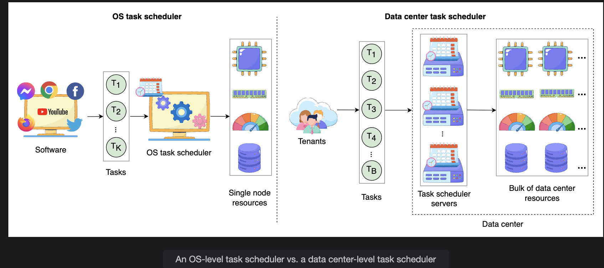

# System Design: The Distributed Task Scheduler

> Understanding what task schedulers are, why distributed systems need dedicated schedulers, and how we'll approach designing one at scale.

---

## Table of Contents

1. [What is a Task Scheduler?](#1-what-is-a-task-scheduler)
2. [When to Use a Task Scheduler](#2-when-to-use-a-task-scheduler)
3. [Distributed Task Scheduling](#3-distributed-task-scheduling)
4. [Why a Distributed Scheduler is Necessary](#4-why-a-distributed-scheduler-is-necessary)
5. [Design Roadmap](#5-design-roadmap)
6. [Summary](#6-summary)

---

## 1. What is a Task Scheduler?

A **task** is a unit of computational work that requires resources — CPU, memory, storage, or network bandwidth — for a specific duration.

### Tasks in the Real World

Not all processing can or should happen synchronously (i.e., while the user waits). Compute-intensive or time-consuming work is offloaded to **background tasks** that run asynchronously.

**Example: Uploading a photo or video to Instagram**

```
User hits "Post"
       |
       v
Upload request returns IMMEDIATELY to the user (fast, responsive UI)
       |
       v (background, asynchronous)
Background Task 1: Encode media into multiple resolutions
  (360p, 480p, 720p, 1080p, 4K)

Background Task 2: Validate content
  - Copyright check
  - Content monetization eligibility
  - Policy compliance (nudity, violence, etc.)

Background Task 3: Distribute to followers' feeds

All of these run asynchronously, coordinated by a task scheduler.
The user never waits for them.
```

**Example: Posting a comment on Facebook**

```
User posts a comment
       |
       v
UI updates OPTIMISTICALLY (shows the comment immediately, before backend confirms)
       |
       v (background, asynchronous)
Background Task: Distribute comment notification to all followers
  - User A (1M followers) -> 1M notification events queued
  - Each event is a task, scheduled and dispatched by the task scheduler
```

This pattern — **respond immediately, process asynchronously** — is fundamental to making large-scale systems feel fast and responsive to users.

---

### The Core Role of a Scheduler

In any system, tasks compete for **limited resources**. The scheduler mediates this competition:

```
Without a scheduler:
  All tasks attempt to run simultaneously
  Resources exhausted -> tasks fail, system slows, user experience degrades

With a scheduler:
  Tasks queued and allocated resources intelligently
  System-level goals met: fair allocation, high utilization, no starvation
  Task-level goals met: deadlines honored, priorities respected
```

A task scheduler **intelligently allocates resources** to ensure both:
- **Task-level goals:** individual tasks complete on time, in priority order
- **System-level goals:** overall resource utilization is maximized, no resource starvation

---

## 2. When to Use a Task Scheduler

Task schedulers are used at different scales, from a single machine to a global data center network.

---

### Use Case 1: Single OS Node (Local Scheduler)

```
Single machine running many processes simultaneously:
  - Web browser
  - IDE
  - Music player
  - Background virus scan

One CPU (or a few cores) must be shared among all processes.

OS scheduler solution: Multi-level Feedback Queue (MLFQ)
  - Assigns CPU time slices to processes
  - Higher-priority processes get more CPU time
  - Prevents any single process from monopolizing the CPU
```

---

### Use Case 2: Cloud Computing Services

```
Cloud provider (AWS, Azure, GCP):
  - Thousands of customers (tenants)
  - Each tenant submits millions of tasks
  - Tasks distributed across millions of physical machines in data centers worldwide

An OS-level scheduler handles ONE machine.
A data center needs to schedule tasks across MILLIONS of machines.

Cloud scheduler requirements:
  - Assign tasks to the right machines (matching resource requirements)
  - Balance load across all machines in all data centers
  - Isolate one tenant's tasks from another's
  - Handle machine failures gracefully (reschedule failed tasks)
```

---

### Use Case 3: Large Distributed Systems (Facebook, Instagram)

```
Facebook generates billions of asynchronous tasks from user interactions:
  - Every "like" -> notification tasks for all followers
  - Every post -> feed update tasks for all friends
  - Every photo upload -> encoding + validation tasks
  - Every live stream -> real-time notification tasks

Facebook's solution: Async (internal distributed task scheduler)

Key design feature: Priority-based scheduling
  High priority:   Live stream notifications   (must deliver in milliseconds)
  Medium priority: Regular post notifications   (seconds acceptable)
  Low priority:    Friend suggestion jobs        (minutes or hours acceptable)

The scheduler ensures urgent tasks are processed before lower-priority ones,
even when the system is under heavy load.
```

---

### Scheduler Types Comparison

| Type | Scope | Scale | Key Challenge |
|---|---|---|---|
| OS scheduler | Single machine | Thousands of processes | Fair CPU time slicing |
| Cloud scheduler | Data center | Billions of tasks, thousands of machines | Multi-tenant isolation, fault tolerance |
| Distributed system scheduler | Multiple DCs globally | Billions of tasks per day from many subsystems | Cross-DC coordination, latency, prioritization |

---

## 3. Distributed Task Scheduling

### OS Scheduler vs Data Center Scheduler

```
OS-Level Scheduler:
+---------------------------+
|       Single Node         |
| Process 1  ->  CPU Core 1 |
| Process 2  ->  CPU Core 2 |
| Process 3  ->  CPU Core 1 | (time-sliced)
| Process 4  ->  CPU Core 2 | (time-sliced)
+---------------------------+
Manages: local processes
Scope:   one machine
State:   shared memory, simple

Data Center-Level Scheduler:
+----------------------------------------+
|           Data Center                   |
|  Task 1   ->  Machine 47, DC-East       |
|  Task 2   ->  Machine 203, DC-West      |
|  Task 3   ->  Machine 1,089, DC-Asia    |
|  Task 4   ->  Machine 47, DC-East       | (resource permitting)
+----------------------------------------+
Manages: tasks from multiple tenants and subsystems
Scope:   thousands of machines across multiple data centers
State:   distributed, must be consistent across all DCs
```

---


### Two Core Challenges We Must Solve

**Challenge 1: Diverse Task Sources**
```
Tasks originate from:
  - Different applications (video encoding, feed updates, notifications)
  - Different tenants (multiple companies using the same cloud)
  - Different subsystems (batch jobs, real-time events, cron jobs)

Each has different:
  - Priority levels
  - Resource requirements
  - Deadlines
  - Retry policies

The scheduler must handle all of these consistently.
```

**Challenge 2: Dispersed Resources**
```
Resources spread across:
  - Multiple machines within one data center
  - Multiple data centers within one region
  - Multiple regions worldwide

The scheduler must:
  - Know the current state of resources everywhere
  - Place tasks on the best available machine
  - Handle failures when machines or data centers go down
  - Ensure tasks complete even if the original machine fails
```

---

## 4. Why a Distributed Scheduler is Necessary

> **Q: Why does a system with many tenants and resources spread across multiple data centers require a distributed scheduler? How does such a scheduler support scalability and coordination across locations?**

### Why a Single Scheduler Doesn't Work

```
Naive approach: One central scheduler for everything

  All tasks -> [Single Central Scheduler] -> Assign to machines

Problem 1: Single Point of Failure
  Scheduler goes down -> NO tasks can be scheduled anywhere
  The entire platform stops processing background work

Problem 2: Scalability Ceiling
  One machine can process ~X task assignments per second
  At billions of tasks per day (Facebook scale):
  1 billion tasks / 86,400 seconds = ~11,574 tasks/second

  A single scheduler machine cannot handle this.

Problem 3: Latency
  All scheduling decisions require a round trip to the central scheduler
  For a task submitted in Asia to be scheduled on a machine in Asia:
  Asia -> Central Scheduler (in US) -> Back to Asia
  Unnecessary latency for geographically local work.
```

### Why a Distributed Scheduler IS Necessary

**Requirement 1: Scalability**
```
Distributed scheduler = multiple scheduler nodes working in parallel

  Scheduler Node 1: handles tasks from Tenant A
  Scheduler Node 2: handles tasks from Tenant B
  Scheduler Node 3: handles overflow + batch jobs

  Adding more scheduler nodes linearly increases scheduling throughput.
  No single ceiling on capacity.
```

**Requirement 2: Fault Tolerance**
```
Distributed scheduler with replication:

  Scheduler Node 1 (primary)  -> fails
  Scheduler Node 2 (replica)  -> takes over immediately
  Scheduler Node 3 (replica)  -> standby

  Tasks in flight are either completed by the replica or rescheduled.
  No single failure stops task processing.
```

**Requirement 3: Geographic Coordination**
```
Data centers in: US-East, EU-West, Asia-Pacific

  Without distributed scheduling:
    All tasks -> Central Scheduler (US) -> Assigned machines everywhere
    EU task scheduled by US scheduler -> unnecessary cross-Atlantic coordination

  With distributed scheduling:
    EU tasks -> EU Scheduler -> EU machines (low latency)
    US tasks -> US Scheduler -> US machines (low latency)
    Cross-region tasks -> Coordinated between regional schedulers
    Global consistency maintained without forcing all decisions through one point
```

**Requirement 4: Multi-Tenant Isolation**
```
Cloud environment: 1,000 tenants submitting tasks simultaneously

  Without isolation: Tenant A submits 1 billion tasks
                     -> monopolizes the scheduler
                     -> Tenant B's tasks starve

  With distributed scheduling:
    Per-tenant queues with fairness policies
    Tenant A's burst doesn't starve Tenant B
    Resource quotas enforced per tenant
    Scheduling state isolated per tenant (logs, metrics, failures)
```

### How It Supports Scalability and Coordination

```
Scalability mechanisms:
  +---------------------------+-------------------------+
  | Challenge                 | Distributed Solution    |
  +---------------------------+-------------------------+
  | Too many tasks            | Add scheduler nodes     |
  | Too many machines         | Shard resource tracking |
  | Too many tenants          | Per-tenant queues       |
  | Tasks grow with traffic   | Auto-scale scheduler    |
  +---------------------------+-------------------------+

Coordination mechanisms:
  +---------------------------+-------------------------+
  | Challenge                 | Solution                |
  +---------------------------+-------------------------+
  | Multi-DC task placement   | Regional schedulers     |
  | Global resource state     | Distributed state store |
  | Scheduler node failure    | Leader election         |
  | Cross-DC task handoff     | Consensus protocol      |
  +---------------------------+-------------------------+
```

---

## 5. Design Roadmap

The distributed task scheduler design is explored in four parts:

---

### Part 1 — Requirements

```
Covers:
  Functional requirements:
    What operations must the scheduler support?
    (submit task, cancel task, query status, list tasks)

  Non-functional requirements:
    How well must it perform?
    (scalability, availability, fault tolerance, low latency)
```

---

### Part 2 — Design

```
Covers:
  System components:
    Scheduler, task queue, resource manager, worker nodes, state store

  Database schema:
    How are tasks, resources, and assignments modeled and stored?

  Data flow:
    How does a task move from submission to completion?
```

---

### Part 3 — Design Considerations

```
Covers:
  Task prioritization:
    How do urgent tasks jump the queue?
    How do low-priority tasks avoid starvation?

  Resource optimization:
    How are tasks matched to the best available machine?
    How is over-provisioning and under-utilization avoided?

  Fault handling:
    What happens when a worker node fails mid-task?
    What happens when the scheduler itself fails?
```

---

### Part 4 — Evaluation

```
Covers:
  Mapping design decisions back to requirements:
    Does the design actually achieve high availability?
    Does it scale to billions of tasks?
    Is it fault-tolerant?
    Does it meet latency goals?
```

---

### Design Roadmap at a Glance

```
Part 1          Part 2          Part 3              Part 4
────────        ────────        ────────            ────────
Requirements -> Design      ->  Design          ->  Evaluation
(what + how     (components,    Considerations      (verify
 well?)          schema,        (priorities,         requirements
                 data flow)      resources,           are met)
                                 fault handling)
```

---

## 6. Summary

```
WHAT IS A TASK:
  A unit of work requiring CPU/memory/storage/bandwidth for some duration
  Often runs asynchronously to keep user-facing workflows responsive

WHAT IS A SCHEDULER:
  Mediates competition for limited resources
  Allocates resources to tasks to meet both task-level and system-level goals

WHEN SCHEDULERS ARE NEEDED:
  Single OS node    -> OS scheduler (MLFQ) for local processes
  Cloud services    -> Distributed scheduler for multi-tenant, multi-machine
  Large platforms   -> Priority-based distributed scheduler (e.g., Facebook Async)

WHY DISTRIBUTED SCHEDULING:
  A single central scheduler fails at scale:
    - Single point of failure
    - Throughput ceiling
    - Geographic latency

  A distributed scheduler solves:
    - Scalability  -> add scheduler nodes as load grows
    - Fault tolerance -> replica schedulers take over on failure
    - Geographic coordination -> regional schedulers reduce latency
    - Multi-tenant isolation -> per-tenant queues with fairness policies

TWO CORE CHALLENGES:
  1. Diverse task sources (different apps, tenants, priorities, deadlines)
  2. Dispersed resources (machines across multiple DCs and regions)
```

---

