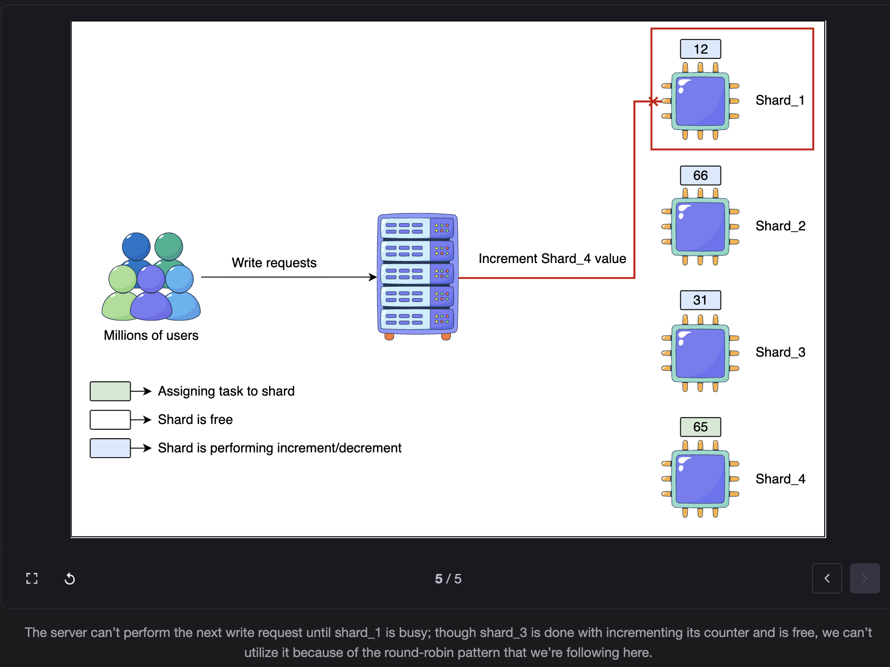
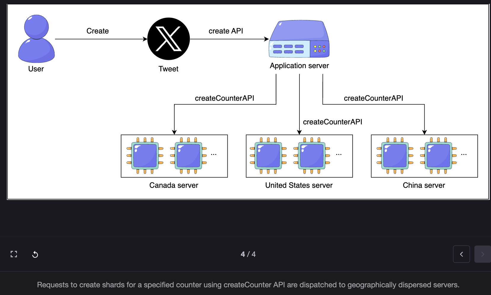
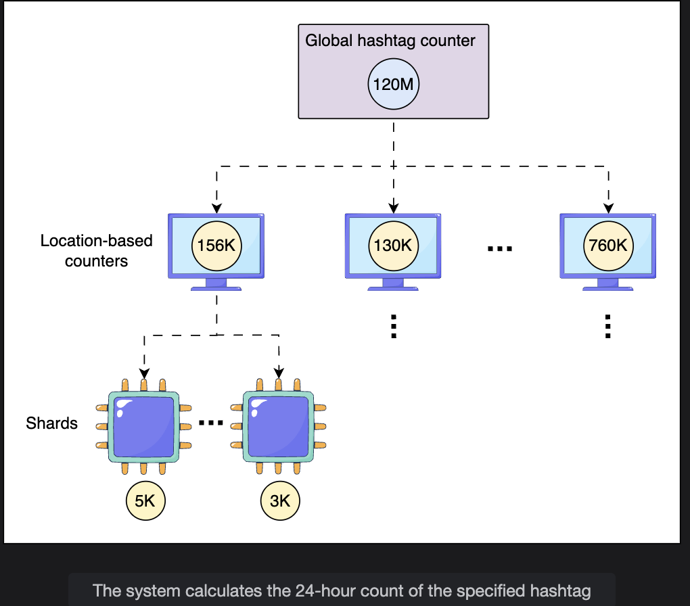
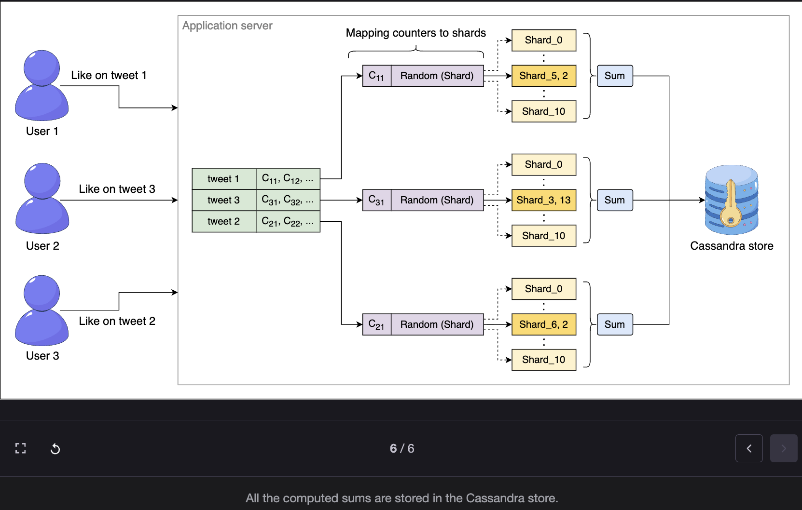

# Detailed Design of Sharded Counters

> Deep-diving into creation, write routing, read aggregation, Top K trends, counter placement, and requirements compliance — using Twitter as the primary example.

---

## Table of Contents

1. [Sharded Counter Creation](#1-sharded-counter-creation)
2. [Write Routing Strategies](#2-write-routing-strategies)
3. [Managing Read Requests](#3-managing-read-requests)
4. [Sharded Counters for the Top K Problem](#4-sharded-counters-for-the-top-k-problem)
5. [Placement of Sharded Counters](#5-placement-of-sharded-counters)
6. [Storage Architecture](#6-storage-architecture)
7. [Requirements Compliance](#7-requirements-compliance)
8. [Key Design Questions and Answers](#8-key-design-questions-and-answers)
9. [Conclusion](#9-conclusion)

---

## 1. Sharded Counter Creation

### What Gets Created

When a user posts a tweet, `createCounter` is called to initialize **multiple counters** for that tweet simultaneously:

```
User posts tweet_id=456
        |
        v
createCounter("counter_tweet_456_likes",     N_likes)
createCounter("counter_tweet_456_replies",   N_replies)
createCounter("counter_tweet_456_retweets",  N_retweets)
createCounter("counter_tweet_456_views",     N_views)   <- video tweets only

  Each counter gets its own set of independent shards.
  Different counters for the same tweet can have DIFFERENT shard counts
  (e.g., likes usually get more engagement than replies -> more shards)
```

---

### The Write vs Read Trade-off in Shard Count

Choosing the number of shards is the most critical decision at creation time. It directly controls a fundamental trade-off:

```
Too few shards:
  High write contention -> writes queue up -> throughput drops -> latency spikes
  Example: 10 shards for a celebrity tweet with 100,000 writes/second
  -> 10,000 writes/second per shard -> contention returns

Too many shards:
  Low write contention -> writes fast ✅
  BUT: read amplification increases
  -> readCounter must query ALL N shards in parallel
  -> 1,000 shards = 1,000 parallel read queries per read request
  -> Network overhead, coordination cost, aggregation latency all rise

The fundamental trade-off:
  +----------------------------+-------------------------+-------------------------+
  | Shard Count                | Write Performance       | Read Performance        |
  +----------------------------+-------------------------+-------------------------+
  | Very low (1-5)             | Poor (high contention)  | Excellent (few queries) |
  | Optimal (10-100)           | Good                    | Good                    |
  | Very high (1,000+)         | Excellent               | Poor (read amplification)|
  +----------------------------+-------------------------+-------------------------+
```

---

### Predicting Initial Shard Count

The shard count is estimated from signals that predict near-term write traffic:

```
Signal 1: follower_count
  More followers -> more people who might engage -> more writes
  Celebrity with 10M followers:   50-100 shards
  Regular user with 500 followers: 1-3 shards

Signal 2: content_type
  Video tweets: attract views + likes + comments -> more counters, more shards
  Text-only tweets: typically lower engagement
  Public tweets: more shards than protected (limited audience) tweets

Signal 3: historical engagement rate
  Users who consistently get high engagement on previous tweets
  -> system learns their typical engagement velocity
  -> assigns shards proportional to expected rate
```

---

### Dynamic Shard Adjustment

Tweet engagement follows a **bursty, long-tailed pattern**:

```
Typical tweet engagement curve:

  Likes/minute
       |
  500  |  *
  400  |  * *
  300  |    * *
  200  |      * * *
  100  |          * * * * *
   50  |                  * * * * * * * * *
    0  +-------------------------------------------> time after posting
       0  5  10  15  20  30  60  2h  6h  24h

  Peak:  First 5-15 minutes (burst)
  Tail:  Gradually declining for hours/days
```

The initial shard count is appropriate for the burst but may be over-provisioned for the tail. The system must adapt:

```
Monitoring feedback loop:

  [Load Balancer / Monitoring Service]
  Continuously tracks:
    - Write requests/second per shard
    - Write latency per shard
    - Shard utilization (idle vs busy)
          |
          v
  High write load detected (shard nearing capacity):
    -> ADD shards: provision new shard records, update routing table
    -> New writes distributed across expanded shard set

  Low write load detected (most shards nearly idle):
    -> REMOVE shards: drain remaining values into survivors, delete shard records
    -> Fewer shards to query on reads (read amplification reduced)
```

---

### Why Initial Shard Count Still Matters

> **Q: If the system can dynamically expand or shrink shards, why is it still important to predict a reasonable initial count?**

**A: Four reasons make the initial estimate critical:**

```
1. Cold start latency:
   Dynamic expansion takes time (detect overload -> provision shards -> update routing).
   During this window, the original shard count must absorb the burst.
   A tweet from a celebrity gets 50,000 likes in the first second.
   If you start with 1 shard, that 1 shard is overwhelmed BEFORE expansion triggers.

2. Cost of expansion during peak:
   Provisioning new shards under extreme load is expensive and slow.
   The system is already stressed when expansion is triggered.
   Starting with enough shards avoids expansion during the worst moment.

3. User experience:
   The first seconds/minutes of a viral tweet are the most critical.
   Slow like confirmation during peak moment = poor user experience.
   A good initial estimate ensures smooth handling from the first write.

4. Operational simplicity:
   Frequent shard adjustments create operational complexity.
   A reasonably accurate initial estimate means fewer dynamic adjustments,
   simpler routing tables, and more stable system behavior.
```

---

### Viral Unexpected Growth

> **Q: What happens when a user with few followers has a post go viral unexpectedly?**

```
Normal case: User has 200 followers -> 2 shards assigned
Unexpected: Tweet embedded in a viral thread -> receives 10,000 likes in 1 minute

Detection:
  Monitoring tracks write latency per shard.
  Shard 0 and Shard 1: write latency spikes from 1ms to 200ms
  Threshold exceeded -> alert triggered

Response:
  System dynamically allocates 48 more shards (total: 50)
  Routing table updated: writes now distributed across 50 shards
  Latency returns to normal within seconds

This is the feedback mechanism in action.
```

---

## 2. Write Routing Strategies

When a write arrives, the system must route it to a specific shard. Three strategies exist, each with distinct trade-offs.

---

### Strategy 1: Round Robin

```
How it works:
  Shards numbered 0 to N-1.
  Requests routed sequentially: shard 0, then 1, then 2, ..., then N-1, then 0 again.

Example (4 shards):
  Write 1 -> Shard 0
  Write 2 -> Shard 1
  Write 3 -> Shard 2
  Write 4 -> Shard 3
  Write 5 -> Shard 0  (cycle restarts)
  ...
```

**The problem:**

```
Write goes to Shard 1, but Shard 1 is currently busy (previous write not yet complete).
Server must WAIT for Shard 1 even though Shard 3 is idle.

  [Server] -> Shard 0 (busy) -> WAIT
  [Server] -> Shard 1 (assigned) -> BUSY, WAIT
  [Server] -> Shard 2 (idle) -> SKIPPED (round robin ignores it)
  [Server] -> Shard 3 (idle) -> SKIPPED (round robin ignores it)

Round robin does NOT observe current shard load.
Uniform only when request processing times are uniform.
In practice, network jitter and node heterogeneity cause uneven load.
```

| Pros | Cons |
|---|---|
| Very simple to implement | Ignores current shard load |
| No state required at the router | Some shards overloaded, others idle |
| Works well for uniform, equal-cost requests | Can wait for busy shards unnecessarily |


---

### Strategy 2: Random Selection

```
How it works:
  For each write, select a shard uniformly at random from [0, N-1].

  shard_id = random.randint(0, N-1)

Example (4 shards, 1,000,000 writes):
  By the law of large numbers:
  Each shard receives ~250,000 writes (25% each)
  Distribution converges to uniform over time
```

| Pros | Cons |
|---|---|
| Simple, no state required | Same blind-to-load problem as round robin |
| Statistically uniform at scale | Short-term variance (shard may get extra writes) |
| No sequential dependency | Node heterogeneity ignored |

**Both random and round robin share the same weakness:** they don't account for the actual current load on each shard's host node. A node running 10 other services may be CPU-bound even if it hasn't received many shard writes recently.

---

### Strategy 3: Metrics-Based Selection (Recommended)

```
How it works:
  A dedicated component (load balancer or shard manager) continuously
  monitors each shard's write latency and queue depth.

  Before routing a write:
    Query: "which shard currently has the lowest latency / shortest queue?"
    Select that shard.
    Route the write there.

  This feedback loop ensures writes always go to the least loaded shard,
  regardless of which node it lives on or what else that node is doing.
```

```
Metrics tracked per shard:
  - Average write latency (last N seconds)
  - Current queue depth
  - CPU utilization of the host node
  - Memory pressure on the host node

Routing decision:
  Score each shard:
    score = w1 × latency + w2 × queue_depth + w3 × cpu_util

  Select shard with lowest score (least loaded).
  Route write to that shard.
```

| Pros | Cons |
|---|---|
| Optimal load distribution | More complex to implement |
| Adapts to node heterogeneity | Requires real-time metrics collection |
| Prevents hot shards | Adds monitoring overhead |
| Best performance under variable load | Routing decisions have slight latency |


---

### Which Strategy to Use?

> **Q: When millions of likes arrive for a celebrity's tweet, which shard selection strategy would you use and why?**

**A: Metrics-based selection**, for two reasons:

```
1. Celebrity tweet = extreme burst + unpredictable load on nodes:
   During a burst, individual nodes may be handling other traffic too.
   Round robin and random ignore this -> some shards get overwhelmed.
   Metrics-based sees actual load -> routes around overloaded nodes.

2. Even small improvements matter at massive scale:
   With 1,000,000 writes in 1 minute, a 1% routing inefficiency
   = 10,000 writes going to overloaded shards = measurable latency spike.

   Round robin / random: acceptable at moderate scale
   Metrics-based: necessary at celebrity-tweet scale (100K+ writes/minute)

Practical deployment:
   Use metrics-based at the load balancer level.
   Each server that receives routed requests uses random selection
   among the top-N least-loaded shards (hybrid approach).
   This reduces the overhead of querying all N shards for every write.
```

---

## 3. Managing Read Requests

### The Aggregation Challenge

Every `readCounter` must sum values across all N shards:

```
readCounter("counter_tweet_456_likes")
  -> Query all 50 shards in parallel
  -> Wait for all 50 responses
  -> Sum: 2,011 + 1,998 + 2,034 + ... = 100,000
  -> Return: 100,000

With high write traffic:
  By the time all 50 shard reads complete (even in parallel),
  more writes have already arrived.
  The returned value is ALREADY STALE.

  There is NO way to get a perfectly accurate real-time count
  without locking all shards simultaneously — which destroys write performance.
```

### The Solution: Periodic Aggregation + Caching

```
Instead of aggregating on every read:

  Background job runs periodically (e.g., every 5 seconds):
    1. Reads all shard values for each counter
    2. Sums them
    3. Writes the total to a cache (e.g., Cassandra or Redis)

  On each read request:
    readCounter(counter_id)
      -> Read the cached aggregate value
      -> Return instantly (no shard queries needed)

  Result:
    Read latency: near-zero (cache hit)
    Accuracy: value is at most 5 seconds stale
    Write performance: unaffected (reads don't touch shards)
```

```
Aggregation interval trade-off:

  Interval = 1 second:   Near-real-time accuracy, high aggregation load
  Interval = 5 seconds:  Good balance for social media use case
  Interval = 60 seconds: Very low aggregation load, count may lag noticeably

For a tweet with 100K likes: being off by 500 (5 seconds × 100 writes/sec)
is invisible to users. "100,000 likes" and "99,547 likes" look the same.
```

### When NOT to Lock All Shards for a Read

> **Q: Should we lock all shards of a counter before accumulating their values?**

**A: No.** Cross-shard locking for reads would eliminate the entire benefit of sharding:

```
If we locked all shards before each read:
  -> All writes must wait while the read lock is held
  -> This is EXACTLY the single-counter bottleneck we were trying to escape
  -> Write throughput collapses back to single-counter levels

Under relaxed consistency (which social media counters use):
  -> Reads happen concurrently with writes
  -> Value may be off by a few counts in either direction
  -> This is acceptable: the count changes immediately after reading anyway

Exception: Use locking only when:
  - Read frequency is extremely low (lock overhead is acceptable)
  - Strong consistency is required (financial transactions, inventory counts)
  - The system supports read-then-write operations that require exact values
```

### When Sharded Counters with Relaxed Consistency Are NOT Suitable

> **Q: Can you think of a use case where this consistency model might not be suitable?**

```
Read-then-write scenarios requiring exact values:

  Example 1: Limited edition item with exactly 100 units
    "You are buying the last unit" requires knowing the exact count.
    If the count is stale by even 1, two users could buy the "last" unit.
    -> Need strong consistency -> sharded counters with relaxed model are wrong here

  Example 2: Bank balance
    "Transfer $100 if balance >= $100"
    A stale balance read could trigger an overdraft.
    -> Need strong consistency + transaction support

  Example 3: Capacity-limited event tickets
    "Only 500 seats remain" -> selling 510 tickets is a real problem.
    -> Strong consistency required

  In all these cases: use traditional transactional databases with locking,
  not sharded counters with periodic aggregation.
```

---

## 4. Sharded Counters for the Top K Problem

### The Twitter Trends Problem

Twitter must surface the **top K trending hashtags** for each user, localized to their region, updated in near real-time. Millions of hashtags are used daily — tracking and ranking all of them is a massive counting problem.

---

### How Sharded Counters Enable Top K

```
For each hashtag (e.g., #WorldCup):
  createCounter("counter_hashtag_worldcup_global", N_global)
  createCounter("counter_hashtag_worldcup_NewYork", N_regional)
  createCounter("counter_hashtag_worldcup_London", N_regional)
  createCounter("counter_hashtag_worldcup_Tokyo", N_regional)
  ... (one per major region)

When a tweet containing #WorldCup is posted from New York:
  writeCounter("counter_hashtag_worldcup_NewYork", "increment")
  writeCounter("counter_hashtag_worldcup_global", "increment")
```

### Multi-Level Counter Structure

```
Global Counter:
  Aggregates all regional counters
  Determines if a hashtag trends worldwide

Regional Counters (one per geographic area):
  Tracks usage within a specific region
  Determines if a hashtag trends locally

  Example for #WorldCup:
    New York region:  45,000 uses in last hour  -> trending in NYC?
    London region:    82,000 uses in last hour  -> trending in London?
    Tokyo region:     31,000 uses in last hour  -> trending in Tokyo?
    Global total:    158,000 uses in last hour  -> trending globally?
```

### Thresholds and Time Windows

```
Trending determination:
  Each region has a predefined threshold (e.g., 10,000 uses within 1 hour).
  If regional_count >= threshold within time_window:
    -> Hashtag appears in that region's trends timeline

  If multiple regions cross their thresholds:
    -> Hashtag elevates to global trends

Time window matters:
  A hashtag with 10,000 uses over 7 days is NOT trending.
  A hashtag with 10,000 uses in 10 minutes IS trending.
  Time window + rate of growth = trending signal.
```

### Computing Top K

```
Computing Top K trends for a user in New York:

  Step 1: Aggregation service reads regional counters for all hashtags
          (periodically, e.g., every 60 seconds)

  Step 2: Ranks hashtags by count within the time window for NY region

  Step 3: Selects top K (e.g., K=10) hashtags

  Step 4: Pushes local top-K list to application server

  Step 5: Application server merges local top-K lists from multiple regions
          to produce a global top-K list

  Step 6: Results cached and pushed to user's client
```

### Top K for User Home Timeline

Beyond hashtags, Twitter applies similar logic to tweets:

```
Top K tweets for a user's timeline:

  Ranked by:
    follower_count of the tweet author (high-follower accounts get boosted)
    recency (newer tweets ranked higher)
    engagement_velocity (likes + retweets in the last N minutes)
    user_location (locally relevant content boosted)

  Twitter also surfaces:
    Promoted tweets (paid advertising)
    Popular tweets from non-followed accounts (discovery)
    Both ranked using the same sharded counter signals
```


---

## 5. Placement of Sharded Counters

### Where Should Shards Live?

The optimal placement depends on workload characteristics:

```
Option 1: On application servers (co-located)
  Shards run on the same servers as the application logic.
  Advantage: Low latency for writes (local memory access)
  Disadvantage: Shard state lost if server restarts; not isolated

Option 2: On dedicated cluster nodes
  Separate cluster of nodes dedicated entirely to counter shards.
  Advantage: Independent scaling, isolation, specialized hardware
  Disadvantage: Network hop for every write/read

Option 3: At the edge (CDN / edge nodes)
  Counter writes processed close to the user's geographic location.
  Advantage: Minimum write latency for geographically distributed traffic
  Best for: Global platforms with users in many regions
  Disadvantage: Aggregation across edge nodes adds complexity

Best for social feed workloads:
  Deploy counters close to users (edge or regional nodes)
  Reduces write latency for high-frequency like/view events
  Aggregation can happen at a regional level before going global
```

---

## 6. Storage Architecture

### Data Store for Aggregated Counts (Cassandra)

```
Purpose: Store periodically aggregated shard totals for fast reads.

Why Cassandra:
  - High write throughput (handles millions of writes/second)
  - Horizontally scalable (add nodes as needed)
  - Region-aware (stores region-specific counts natively)
  - Eventually consistent (acceptable for social media counters)

What it stores:
  { counter_id: "counter_tweet_456_likes",
    region: "global",
    aggregated_count: 100000,
    last_updated: "2024-03-15T14:32:00Z" }

  { counter_id: "counter_hashtag_worldcup_NewYork",
    region: "NewYork",
    aggregated_count: 45000,
    time_window_start: "2024-03-15T13:32:00Z" }
```

### Metadata Store (Redis / Memcache)

```
Purpose: Fast lookup of counter IDs and shard locations.

What it stores:
  tweet_id -> counter_ids mapping:
    Key: "tweet:456:counters"
    Value: {
      likes:    "counter_tweet_456_likes",
      replies:  "counter_tweet_456_replies",
      retweets: "counter_tweet_456_retweets"
    }

  counter_id -> shard list mapping:
    Key: "counter:counter_tweet_456_likes:shards"
    Value: [shard_0_location, shard_1_location, ..., shard_49_location]

Why Redis / Memcache:
  - In-memory: sub-millisecond lookup
  - These lookups happen on EVERY write and read
  - Must be extremely fast
  - Data fits in memory (metadata is small compared to actual counts)
```

### Full Read Path

```
User loads timeline, needs like count for tweet_456:

  1. readCounter request received
     |
     v
  2. Redis lookup: tweet_id=456 -> counter_id="counter_tweet_456_likes"
     |
     v
  3. Redis lookup: counter_id -> shard locations [shard_0...shard_49]
     |
     v
  4. Check Cassandra cache: is there a recent aggregated count?
     Hit: return cached value immediately (no shard queries)
     Miss: query all 50 shards in parallel -> aggregate -> store in Cassandra
     |
     v
  5. Return: 100,000 likes
```

### Write Path with Parallel Processing

```
User likes tweet_456:

  1. writeCounter("counter_tweet_456_likes", "increment") received
     |
     v
  2. Redis lookup: counter_id -> shard list (sub-millisecond)
     |
     v
  3. Select shard (random or metrics-based)
     |
     v
  4. Atomic increment on selected shard node
     |
     v
  5. Return: success

  All steps happen in parallel for concurrent writes from different users.
  Each write touches only ONE shard (no coordination across shards).
```

---

## 7. Requirements Compliance

### Availability

```
Traditional single counter:
  ONE database record = ONE point of failure
  That record's node fails -> counter unavailable -> likes can't be processed

Sharded counter (50 shards):
  50 independent nodes, each holding one shard
  Any subset of nodes can fail without total counter failure

  5 shards fail -> 45 shards still accept writes ✅
  Counter remains available and approximately correct
  (total count may undercount by ~10% while failed shards are offline)
  Automatic recovery: failed shards re-initialized from backup

  Result: No single point of failure for any counter.
```

### Scalability

```
Sharded counters scale HORIZONTALLY at every dimension:

  Write throughput too low?
    -> Add shards (route more writes per second)
    -> Each shard on its own node -> linear throughput increase

  Too many counters?
    -> Add more storage nodes to hold shard records

  Reads too slow?
    -> Add more Cassandra nodes for cached aggregations
    -> Add Redis replicas for faster metadata lookups

  More tenants / more tweets?
    -> Each tweet gets its own independent set of shards
    -> No inter-tweet contention (tweet A's shards don't affect tweet B's)

  The system scales from handling 1 tweet to 1 billion tweets
  without architectural changes.
```

### Reliability

```
No write request is lost:
  Each write is routed to a specific shard immediately upon arrival.
  No buffering (no risk of lost writes on buffer flush).
  No queueing (writes go directly to a shard node, not a queue first).

Shard failure handling:
  If a shard node fails, writes are rerouted to other shards.
  The failed shard's count is recovered from backup/replica.

Periodic persistence:
  Background aggregation job saves shard totals to Cassandra periodically.
  Even if many shards fail simultaneously:
    -> Last aggregated count in Cassandra + live shard values = recovery point
    -> Data loss bounded to the aggregation interval (e.g., last 5 seconds)
```

---

## 8. Key Design Questions and Answers

### Summary of Design Questions Answered

| Question | Answer |
|---|---|
| Why does initial shard count still matter if we can scale dynamically? | Cold start: first seconds of a viral tweet must be handled by initial shards; dynamic expansion has lag |
| What happens when an unexpected post goes viral? | Monitor write latency; detect threshold breach; dynamically add shards; update routing table |
| Which routing strategy for a celebrity tweet burst? | Metrics-based: observes actual shard load; prevents hot shards during burst |
| Should we lock all shards before reading? | No: destroys write performance; accept approximate reads under relaxed consistency |
| When is relaxed consistency NOT suitable? | Read-then-write scenarios requiring exact values: inventory, bank balance, limited capacity |

---

## 9. Conclusion

```
WHAT SHARDED COUNTERS ARE:
  A counter split into N independent shards, each on a separate node.
  Writes distributed across all shards (no single serialization point).
  Total = sum of all shard values (aggregated periodically and cached).

KEY DESIGN DECISIONS:

  Shard count:
    Determined by follower_count + post_type + historical engagement rate.
    Too few: write contention. Too many: read amplification.
    Dynamic adjustment handles unexpected viral growth.

  Write routing:
    Round robin: simple, ignores load.
    Random: simple, statistically even, ignores load.
    Metrics-based: optimal, adapts to actual shard load. (Recommended for burst)

  Read strategy:
    Periodic background aggregation -> cached in Cassandra.
    Reads serve cached value (fast, approximate).
    No cross-shard locking (would destroy write performance).

  Consistency model:
    Relaxed: counts may be off by seconds' worth of writes.
    Appropriate for social media (likes, views, trends).
    NOT appropriate for exact read-then-write scenarios.

  Top K application:
    Sharded counters + regional counters + time windows = trending hashtags.
    Local top-K lists merged to produce global top-K.

WHAT SHARDED COUNTERS ACHIEVE:
  Availability:  No single point of failure; partial shard failure tolerated.
  Scalability:   Linear horizontal scaling by adding shards.
  Reliability:   Every write handled immediately; no queue buildup; periodic persistence.
  Performance:   Write latency sub-millisecond per shard; read latency from cache.
```

---

