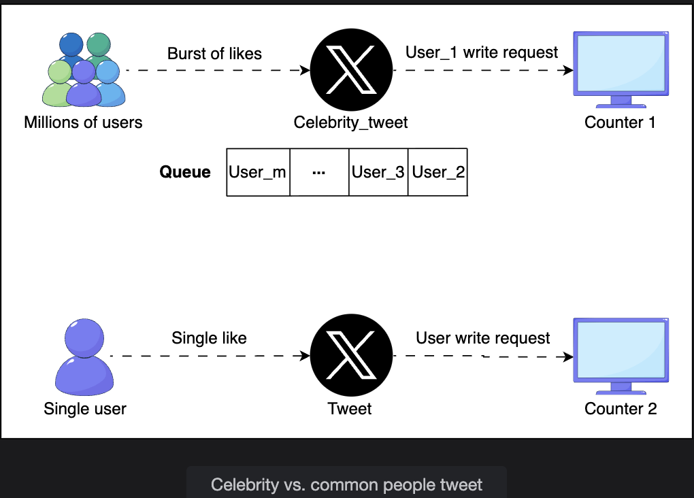
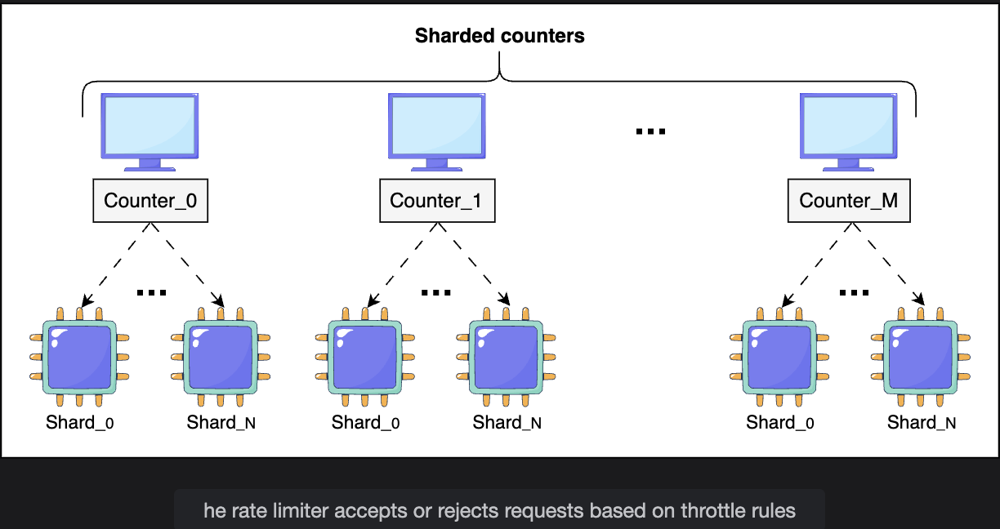

# High-Level Design of Sharded Counters

> Eliminating write contention through parallel shards, designing the three core APIs, and determining the right number of shards for any high-volume counting scenario.

---

## Table of Contents

1. [High-Level Solution](#1-high-level-solution)
2. [How Sharded Counters Work](#2-how-sharded-counters-work)
3. [Determining the Number of Shards](#3-determining-the-number-of-shards)
4. [API Design](#4-api-design)
   - [Create Counter](#create-counter)
   - [Write Counter](#write-counter)
   - [Read Counter](#read-counter)
5. [Decrement-Heavy Counters](#5-decrement-heavy-counters)
6. [End-to-End Example: Twitter Like](#6-end-to-end-example-twitter-like)
7. [Summary](#7-summary)

---

## 1. High-Level Solution

### The Core Problem

When millions of users like the same tweet simultaneously, every like becomes a write request targeting **the same counter**. All those writes must be serialized at one point:

```
Celebrity tweet goes viral:

  100,000 users like the tweet in the same second
  Each like = a write to counter: { tweet_id: 123, likes: ??? }

  Single counter behavior:
    Write 1:  acquires lock -> reads 0 -> writes 1 -> releases lock
    Write 2:  acquires lock -> reads 1 -> writes 2 -> releases lock
    Write 3:  acquires lock -> reads 2 -> writes 3 -> releases lock
    ...
    Write 99,998:  still waiting for the lock (queued for seconds)
    Write 99,999:  still waiting
    Write 100,000: still waiting

  Result:
    Users experience 5-10 second delays before their like registers
    OR: writes time out and are silently dropped
    OR: the database node handling this counter becomes a hot spot
        and slows down ALL other operations on that node
```

### The Solution: Split the Counter into Shards

Instead of one counter, create **N independent shards** — each running on a different node, each accepting its own stream of writes independently.

```
Celebrity tweet (tweet_id=123) with N=5 shards:

  Shard 0:  { tweet_id: 123, shard: 0, count: 20,000 }   <- on Node A
  Shard 1:  { tweet_id: 123, shard: 1, count: 20,200 }   <- on Node B
  Shard 2:  { tweet_id: 123, shard: 2, count: 19,800 }   <- on Node C
  Shard 3:  { tweet_id: 123, shard: 3, count: 20,100 }   <- on Node D
  Shard 4:  { tweet_id: 123, shard: 4, count: 19,900 }   <- on Node E

  Total likes = 20,000 + 20,200 + 19,800 + 20,100 + 19,900 = 100,000

  Each shard receives ~20,000 writes/second (not 100,000 to one node)
  Each node has 5x less contention
  Throughput scales linearly with N
```

---



## 2. How Sharded Counters Work

### Write Flow

```
User likes a tweet
       |
       v
[Counter Service]
  1. Receives the like event with tweet_id
  2. Looks up the counter_id for tweet_id's like counter
  3. Selects a shard to update (routing logic below)
  4. Sends increment to the selected shard
       |
       v
[Selected Shard Node]
  Increments its local count atomically
  Acknowledges success
       |
       v
Response to user: "Like registered" ✅
```

### Shard Selection Strategies

```
Strategy 1: Random routing
  Select a shard at random from [0, N-1]
  Advantage: Even distribution with no state required
  Disadvantage: Slight variance (one shard may get slightly more writes)
  Best for: High-volume uniform traffic

  shard_id = random.randint(0, N-1)

Strategy 2: Hash-based routing
  Hash a property of the request to determine the shard
  Advantage: Deterministic — same input always goes to same shard
  Disadvantage: Can cause hot shards if hash input is skewed

  shard_id = hash(user_id) % N

Strategy 3: Load-based routing
  Monitor current write load on each shard
  Route to the least loaded shard
  Advantage: Optimal load balancing
  Disadvantage: Requires real-time shard load tracking

  shard_id = least_loaded_shard()
```

### Read Flow (Aggregation)

```
User views a tweet (or timeline loads tweet counts)
       |
       v
[Counter Service] receives readCounter(counter_id)
       |
       v
Query ALL shards for this counter_id:
  Shard 0: 20,000
  Shard 1: 20,200
  Shard 2: 19,800
  Shard 3: 20,100
  Shard 4: 19,900
       |
       v
Aggregate: 20,000 + 20,200 + 19,800 + 20,100 + 19,900 = 100,000
       |
       v
Return: 100,000 likes ✅
```

### Why Reads Can Be Slightly Stale (and That's OK)

```
During aggregation:
  New writes are landing on shards continuously
  The aggregation reads shards at slightly different moments

  Read Shard 0 at t=0.000: count = 20,000
  Read Shard 1 at t=0.001: count = 20,201  <- 1 new write happened
  Read Shard 2 at t=0.002: count = 19,800
  ...

  The total may be off by a few counts in either direction.

Why this is acceptable:
  For a tweet with 100,000 likes, being off by 3-5 likes is invisible to users.
  Social media platforms do NOT guarantee exact real-time counts.
  "Approximate now, exact eventually" is the standard trade-off.
  Exact counts can be computed via a background aggregation job periodically.
```

---

## 3. Determining the Number of Shards

The optimal `number_of_shards` is determined at **counter creation time** using heuristics about expected load.

### Heuristics for Shard Count

**Heuristic 1: Follower Count (`followers_count`)**

```
Follower count predicts potential engagement (how many people might interact).

  0 - 1,000 followers:        1-2 shards     (small audience, low traffic)
  1,000 - 100,000 followers:  3-10 shards    (medium audience)
  100,000 - 1M followers:     10-50 shards   (large audience, viral potential)
  > 1M followers (celebrity): 50-500 shards  (massive burst expected)

  Why this works:
    A tweet from an account with 10M followers can go viral.
    A tweet from an account with 50 followers almost certainly won't.
    Followers = best predictor of potential writes/second.
```

**Heuristic 2: Post Type (`post_type`)**

```
Public posts:     Visible to everyone, can be shared/retweeted/liked globally
                  -> More shards (higher viral potential)

Protected posts:  Only visible to approved followers
                  -> Fewer shards (limited audience ceiling)

Example:
  Public tweet from 1M-follower account:   50 shards
  Protected tweet from 1M-follower account: 10 shards
```

**Combined heuristic formula:**

```
base_shards = log10(followers_count)       <- logarithmic scaling
multiplier  = 1.0 if protected, 5.0 if public
number_of_shards = ceil(base_shards * multiplier)

Examples:
  10,000 followers,  public:   ceil(log10(10000) * 5.0) = ceil(4 * 5) = 20 shards
  10,000 followers,  protected: ceil(log10(10000) * 1.0) = ceil(4 * 1) = 4 shards
  10,000,000 followers, public: ceil(log10(10000000) * 5.0) = ceil(7 * 5) = 35 shards
```

### Dynamic Shard Adjustment

```
Initial shard count is an estimate. Real traffic may differ.

If a post unexpectedly goes viral:
  -> Monitor write latency on shards
  -> If latency exceeds threshold: trigger shard expansion
  -> New shards added dynamically
  -> Write router updated to include new shards

If a post's traffic drops:
  -> Monitor shard utilization
  -> If utilization below threshold: consolidate shards
  -> Reduces storage and operational overhead
```

---

## 4. API Design

### Create Counter

Initializes a sharded counter when a new item (tweet, video, post) is created.

```
createCounter(counter_id, number_of_shards)
```

| Parameter | Description |
|---|---|
| `counter_id` | Unique identifier for this counter. Generated by a sequencer service to guarantee global uniqueness across all distributed nodes. |
| `number_of_shards` | Number of shards to initialize for this counter. Determined by heuristics at creation time. |

**What happens internally:**

```
createCounter("counter_tweet_123_likes", 50)
       |
       v
  Counter service:
    1. Creates 50 shard records in the data store:
       { counter_id: "counter_tweet_123_likes", shard_id: 0, count: 0 }
       { counter_id: "counter_tweet_123_likes", shard_id: 1, count: 0 }
       ...
       { counter_id: "counter_tweet_123_likes", shard_id: 49, count: 0 }

    2. Stores metadata in the data store:
       { counter_id: "counter_tweet_123_likes",
         shard_count: 50,
         shard_locations: [Node_A, Node_B, ..., Node_AX] }

    3. Returns: { counter_id: "counter_tweet_123_likes", status: "created" }
```

**When is `createCounter` called?**

```
Counter is created at the same time as the item it tracks:

  New tweet published:
    -> createCounter("counter_tweet_123_likes", N)
    -> createCounter("counter_tweet_123_retweets", N)
    -> createCounter("counter_tweet_123_replies", N)

  New YouTube video uploaded:
    -> createCounter("counter_video_abc_views", N)
    -> createCounter("counter_video_abc_likes", N)

  The content_type parameter helps determine which counters are needed:
    Videos: create view counter + like counter
    Tweets: create like counter + retweet counter + reply counter
    Photos: create like counter + comment counter
```

---

### Write Counter

Increments or decrements a counter shard when a user interaction occurs.

```
writeCounter(counter_id, action_type)
```

| Parameter | Description |
|---|---|
| `counter_id` | The unique counter identifier (provided at creation time). |
| `action_type` | The operation to perform: `increment` (e.g., user liked) or `decrement` (e.g., user unliked). |

**What happens internally:**

```
User likes tweet_123:
  writeCounter("counter_tweet_123_likes", "increment")
        |
        v
  Counter service:
    1. Looks up counter metadata: shard_count=50, shard_locations=[...]
    2. Selects a shard (e.g., random: shard_id=23)
    3. Sends atomic increment to Node containing Shard 23
    4. Shard 23: count += 1  (atomic operation, no race condition within shard)
    5. Returns: { status: "success" }

User unlikes tweet_123:
  writeCounter("counter_tweet_123_likes", "decrement")
    -> Same flow, but count -= 1 on selected shard
```

**In Twitter's context:**

```
Event               | counter_id                       | action_type
--------------------|----------------------------------|------------
User likes tweet    | counter_tweet_123_likes          | increment
User unlikes tweet  | counter_tweet_123_likes          | decrement
User retweets       | counter_tweet_123_retweets       | increment
User un-retweets    | counter_tweet_123_retweets       | decrement
User replies        | counter_tweet_123_replies        | increment
User deletes reply  | counter_tweet_123_replies        | decrement
```

---

### Read Counter

Retrieves the current total count by aggregating all shard values.

```
readCounter(counter_id)
```

| Parameter | Description |
|---|---|
| `counter_id` | The unique counter identifier (provided at creation time). |

**What happens internally:**

```
User views tweet_123 (or timeline loads):
  readCounter("counter_tweet_123_likes")
        |
        v
  Counter service:
    1. Looks up metadata: counter has 50 shards on [Node_A, Node_B, ..., Node_AX]
    2. Sends parallel read requests to all 50 shards simultaneously
    3. Waits for all shard responses:
       Shard 0:  2,011
       Shard 1:  1,998
       Shard 2:  2,034
       ...
       Shard 49: 2,003
    4. Aggregates: sum of all 50 shard values
    5. Returns: { counter_id: "counter_tweet_123_likes", total: 100,000 }
```

**How tweet_id maps to counter_id:**

```
Twitter uses tweet_id as the lookup key:

  tweet_id = 123

  System maps tweet_id to all associated counter_ids:
    tweet_id=123 -> {
      likes_counter:    "counter_tweet_123_likes",
      retweets_counter: "counter_tweet_123_retweets",
      replies_counter:  "counter_tweet_123_replies"
    }

  This mapping stored in the data store at tweet creation time.

  When user views tweet 123:
    -> readCounter("counter_tweet_123_likes")
    -> readCounter("counter_tweet_123_retweets")
    -> readCounter("counter_tweet_123_replies")
    -> All three called in parallel
    -> Results displayed together: "100K likes | 23K retweets | 5K replies"
```

---

## 5. Decrement-Heavy Counters

> **Q: Could sharded counters be used for decrement-heavy counters (like dislikes) as efficiently as for increment-heavy counters? Why or why not?**

**A: Yes, sharded counters work equally well for decrement-heavy workloads.** The mechanism is symmetric — shards accept both increment and decrement operations with the same efficiency. However, there are nuances worth considering:

### Why It Works Just as Well

```
Decrement operation on a shard:

  writeCounter("counter_video_abc_dislikes", "decrement")

  This is identical in cost to an increment:
    1. Select a shard
    2. Acquire lock on that shard only (not the whole counter)
    3. count -= 1
    4. Release lock

  The sharding benefit (distributing writes across N nodes) applies equally
  to decrements. Whether 100,000 users dislike a video or like it,
  the load distribution is the same.
```

### One Subtle Complication: Negative Shard Values

```
Scenario: Counter tracks "net score" = likes - dislikes

  Shard 3 receives: 100 increments, then 150 decrements
  Shard 3 count: 100 - 150 = -50

  This is valid! Shard values CAN be negative.
  The total (sum of all shards) will still be correct:

  Shard 0: +2000 (more likes)
  Shard 1: +1500
  Shard 2: +800
  Shard 3: -50   <- net negative on this shard (many unlikes landed here)
  Total:   +4250 (correct overall score)
```

### A More Interesting Complication: Separate vs Combined Counters

```
Option A: Separate counters (likes counter + dislikes counter)
  Like event   -> increment likes_counter (shard selected)
  Dislike event -> increment dislikes_counter (shard selected)
  Display: readCounter(likes) - readCounter(dislikes)

  Advantage: Each counter is monotonically increasing (never negative shards)
             Cleaner, simpler logic

Option B: Single net counter (increment on like, decrement on dislike)
  Like event    -> increment net_counter (shard selected)
  Dislike event -> decrement net_counter (shard selected)
  Display: readCounter(net_counter)

  Advantage: One aggregation query instead of two
  Disadvantage: Individual shard values can be negative or misleading

Recommendation: Option A (separate counters) for features like
  YouTube's like/dislike, Reddit's upvote/downvote
  Easier to understand, audit, and display breakdown statistics.
```

### Temporary Floor Issue (Edge Case)

```
Potential problem: User unlikes a tweet they liked, but the unlike
goes to a DIFFERENT shard than where the original like landed.

  Original like:  -> Shard 2 incremented to 1
  Unlike:         -> Shard 7 decremented to -1

  At this moment:
    Shard 2: count = 1 (stale)
    Shard 7: count = -1

  Total = 1 + (-1) = 0 ✅ (correct overall)

  Individual shard 7 shows -1 temporarily, but the aggregate is correct.
  This is acceptable — we never display individual shard values to users.
```

---

## 6. End-to-End Example: Twitter Like

```
Scenario: @elonmusk posts a tweet. Within 1 minute, 500,000 users like it.
          Account has 100M followers. Public tweet.

STEP 1 — Counter Creation (at tweet publish time):

  Heuristics:
    followers_count = 100,000,000 -> log10 = 8
    post_type = public -> multiplier = 5
    number_of_shards = ceil(8 * 5) = 40

  createCounter("counter_tweet_456_likes", 40)
  -> 40 shard records created, distributed across 40 nodes
  -> Metadata stored: counter_id maps to 40 shard locations


STEP 2 — Write (each like, 500,000 times in 1 minute):

  User clicks like button
  writeCounter("counter_tweet_456_likes", "increment")
  -> Counter service selects random shard [0-39]
  -> Atomic increment on selected shard
  -> Response: "success" in < 5ms

  Each shard receives ~12,500 writes over 1 minute
  = ~208 writes/second per shard (very manageable)
  vs. 8,333 writes/second on a single counter (would collapse)


STEP 3 — Read (when any user views the tweet):

  User opens tweet
  readCounter("counter_tweet_456_likes")
  -> 40 parallel reads to all shards
  -> Aggregate: sum of all 40 shard values
  -> Returns: 500,000 (or very close to it)
  -> Displayed on tweet: "500K likes"
```

---

## 7. Summary

### How Sharded Counters Solve the Problem

```
Traditional counter:
  1 counter = 1 serialization point = 1 write at a time

  100,000 writes/second to 1 counter:
  -> All wait for one lock -> throughput collapses -> latency spikes

Sharded counter (N=100):
  100 independent shards = 100 parallel serialization points

  100,000 writes/second distributed across 100 shards:
  -> 1,000 writes/second per shard -> no contention -> low latency
  -> Total throughput = N x (single shard throughput)
  -> Throughput scales linearly by adding shards
```

### API Summary

| API | Trigger | What it does |
|---|---|---|
| `createCounter(counter_id, number_of_shards)` | New tweet/video/post published | Initializes N shards in the data store, stores metadata |
| `writeCounter(counter_id, action_type)` | User likes/unlikes/retweets | Selects a shard, atomically increments or decrements it |
| `readCounter(counter_id)` | User views tweet/timeline | Queries all shards in parallel, aggregates total |

### Key Design Trade-offs

```
+----------------------------+--------------------------------+
| Decision                   | Trade-off                      |
+----------------------------+--------------------------------+
| More shards                | Higher throughput,             |
|                            | more storage + reads           |
+----------------------------+--------------------------------+
| Fewer shards               | Less overhead,                 |
|                            | lower throughput ceiling       |
+----------------------------+--------------------------------+
| Random shard routing       | Even distribution,             |
|                            | slight variance                |
+----------------------------+--------------------------------+
| Hash-based shard routing   | Deterministic,                 |
|                            | risk of hot shards             |
+----------------------------+--------------------------------+
| Approximate read total     | Very fast reads,               |
|                            | count may be off by a few      |
+----------------------------+--------------------------------+
| Exact read (background job)| Precise count,                 |
|                            | not real-time                  |
+----------------------------+--------------------------------+
```

---

