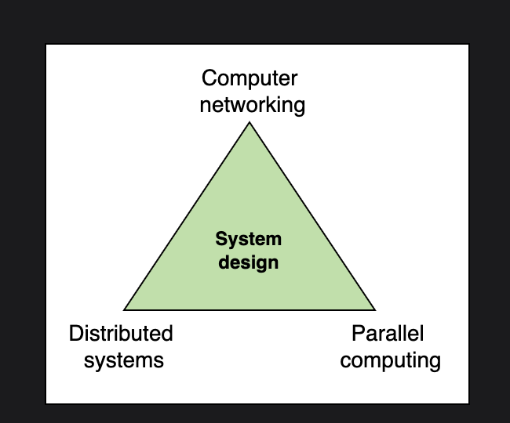
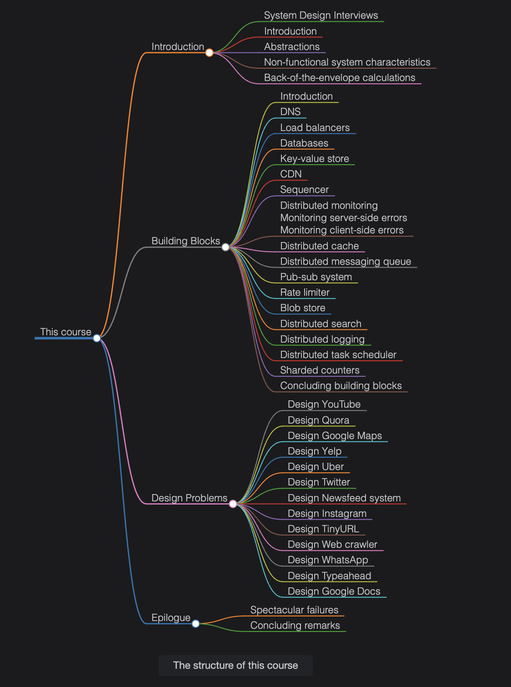

## Understanding System Design
**System design** is the process of defining components and their integration, APIs, and data models to build large-scale systems that meet a specified set of functional and non-functional requirements.

System design uses the concepts of computer networking, parallel computing, and distributed systems to craft systems that scale well and are performant. Distributed systems scale well by nature. However, distributed systems are inherently complex. The discipline of system design helps us tame this complexity and get the work done.

System design aims to build systems that are reliable, effective, and maintainable, among other characteristics.

- **Reliable systems** handle faults, failures, and errors.

- **Effective systems** meet all user needs and business requirements.

- **Maintainable systems** are flexible and easy to scale up or down. The ability to add new features also comes under the umbrella of maintainability.

**Iterative process:** Systems, in reality, improve over iterations. We often start with something simple, but when bottlenecks arise in one or more of the system’s parts, a new design becomes necessary. In some design problems, we make one design, identify bottlenecks, and improve on it. Working under time constraints might not permit iterations on the design. However, we still recommend two iterations—first, where we do our best to come up with a design (that takes about 80 percent of our time), and a second iteration for improvements. Another choice is to change things as we figure out new insights. Inevitably, we discover new details as we spend more time working with a problem.

**Interactive learning:** We provide ample opportunities to get experience with system design. Some design problems guide learners through many steps to design a system. We also have a few examples where the learner designs the full system end-to-end without any guided steps. We reinforce the important concepts by testing learners with questions and quizzes.

**CourseStructure**

