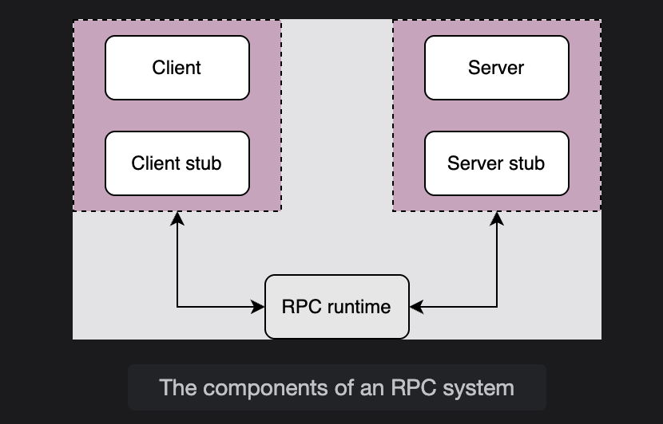
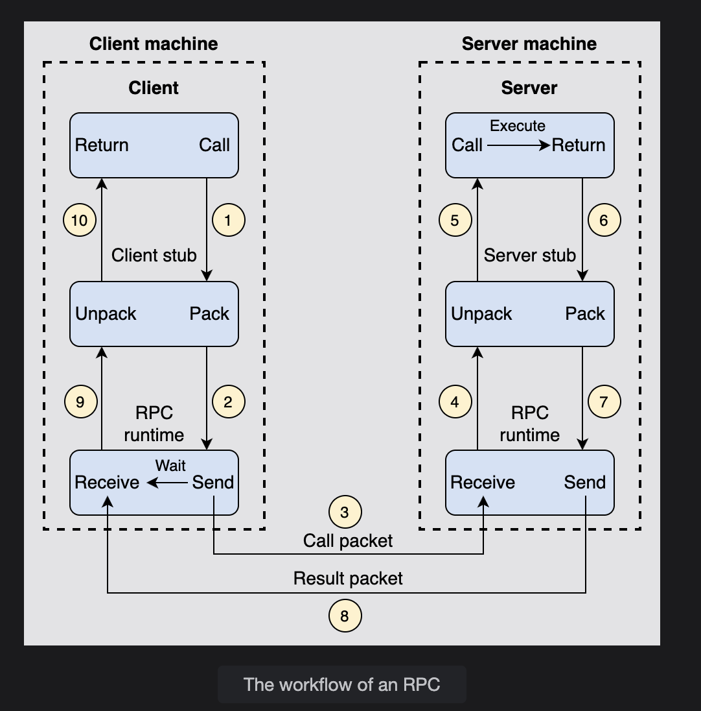

# 📌 Abstraction & Its Importance

## 🔹 What is Abstraction?
- **Definition:** Hiding unnecessary details and focusing on the **big picture**.  
- Helps us stay focused on goals instead of being stuck in complexities.  

---

## 🔹 Why is Abstraction Important?
1. **Simplifies Complexity** → hides inner details, shows only what matters.  
2. **Focus on Goal** → keeps us focused on solving the problem, not low-level details.  
3. **Reusability** → good abstractions (like libraries) can be reused in multiple projects.  
4. **Productivity** → saves time; developers don’t need to rebuild everything from scratch.  

---

## 🔹 Examples
- **Bird Abstraction** → Instead of one specific bird, we talk about “birds” in general.  
- **Libraries in Programming** → give simple interfaces, hide complex implementations.  
- **Database Transactions** → hide concurrency issues, provide simple `commit` or `abort`.  -- **Transactions** is a database abstraction that hides many problematic outcomes when concurrent users are reading, writing, or mutating the data and gives a simple interface of commit, in case of success, or abort, in case of failure. Either way, the data moves from one consistent state to a new consistent state. The transaction enables end users to not be bogged down by the subtle corner-cases of concurrent data mutation, but rather concentrate on their business logic.  
- **Distributed Systems (AWS, GCP, Azure)** → hide complex infrastructure, let developers focus on applications.  

---

## 🔹 Key Takeaway
👉 **Abstraction = Shield against complexity**  
It lets engineers & users **focus on business logic and big picture**, not messy details (hardware, concurrency, infra, etc.).  

# 🌐 Network Abstractions: Remote Procedure Calls (RPC)

## 🔹 What are Remote Procedure Calls?
- **Definition:** RPCs provide an abstraction of a local procedure call by **hiding network complexities**.  
- They manage:
  - Packing & sending arguments to the remote server  
  - Receiving return values  
  - Handling retries & failures  

👉 To the developer, it looks like a **normal function call**.

---

## 🔹 What is an RPC?
- **RPC (Remote Procedure Call)** → an **interprocess communication protocol** used in distributed systems.  
- Works across the **Transport** & **Application layers** (OSI model).  
- Executes a procedure in a **separate address space**.  
- Programmer just writes a local call — RPC framework handles networking.  

---

## 🔹 How does RPC Work?
1. Client calls a **client stub** with parameters (like a local call).  
2. **Client stub**:
   - Converts parameters into a standardized format  
   - Packs them into a message  
   - Passes message to **RPC runtime**  
3. **Client RPC runtime** delivers the message to **Server RPC runtime**.  
4. **Server stub** unpacks message & calls server routine (local call).  
5. **Server routine** executes, returns result to **server stub**.  
6. **Server stub** packs result → sends to server RPC runtime.  
7. **Server RPC runtime** sends result back to **Client RPC runtime**.  
8. **Client stub** unpacks result → returns to calling program.  

---

## 🔹 Components of an RPC System
- **Client** → initiates call  
- **Client Stub** → packs params  
- **Client RPC Runtime** → sends msg  
- **Server Stub** → unpacks msg  
- **Server RPC Runtime** → delivers msg  
- **Server Routine** → executes logic  

👉 The runtime also handles retransmission, acknowledgment, & encryption.

---

## 🔹 Real-World Usage
- **Google** → uses `gRPC` for distributed services (Search, YouTube, etc.).  
- **Uber** → uses RPC for ride matching, location tracking, and app-server communication.  
- **Facebook** → uses `Thrift` for RPC and storage system serialization.  

---

## 🔹 Summary
- RPC ≈ local function call ✨ but runs on a **different machine**.  
- **Hides network details**, letting devs focus on design & logic.  
- Widely used in **distributed systems** for high performance & simplicity.  

