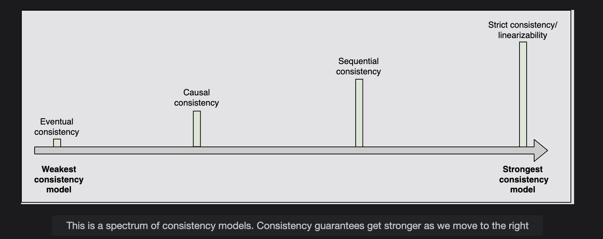
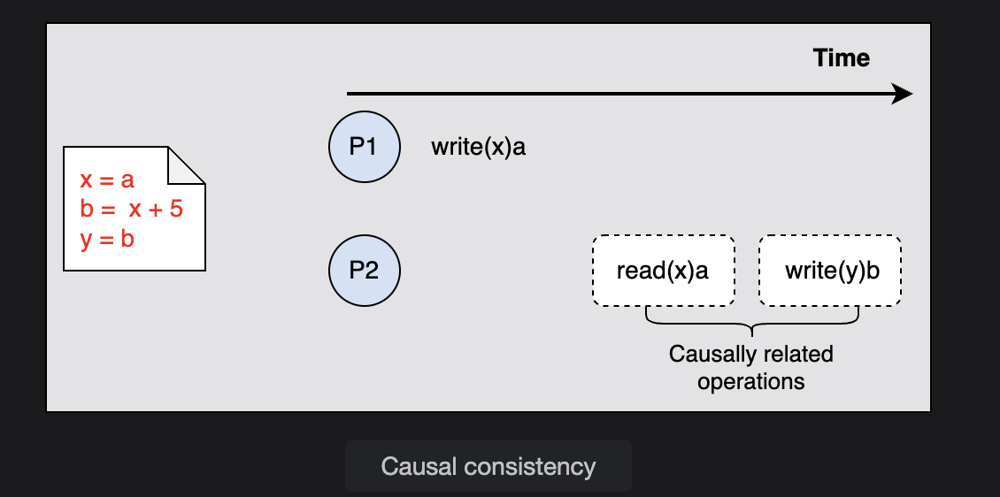
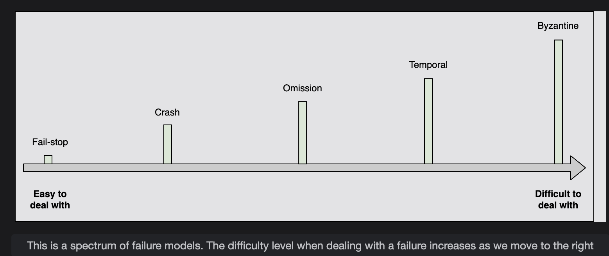

# Spectrum of Consistency Models

Learn about consistency models and see which model suits the requirements of our application.

---

## 🔹 What is Consistency?
In distributed systems, **consistency** can mean:
1. Every replica node has the same view of data at a given time.  
2. Every read request gets the most recent write.  

👉 Consistency models are abstractions that help us reason about correctness when multiple clients are **reading/writing concurrently**.

For example:  
If we want to use a third-party storage system like **S3** or **Cassandra**, we check their *consistency guarantees* before deciding.

---

## 🔹 Consistency Spectrum
- **Strongest consistency (Linearizability / Strict consistency)**  
- **Weakest consistency (Eventual consistency)**  
- Models in between: **Causal consistency** and **Sequential consistency**  

👉 The stronger we go → the more predictable and safe, but usually with higher **latency** and lower **availability**.  
👉 The weaker we go → better **performance/availability**, but clients may temporarily see **stale data**.

---

## ⚡ Eventual Consistency (Weakest)
- All replicas **eventually converge** to the same value after some time (if no new writes come in).  
- Until convergence, different replicas may return different values.  
- Provides **high availability**, but **not always the latest write**.

**Example:**  
- **DNS system** → caches may not reflect the latest update immediately, but eventually converge.  
- **Cassandra** (NoSQL DB) → uses eventual consistency for scalability.

---

## ⚡ Causal Consistency
- Preserves the **cause-and-effect** relationship between operations.  
- **Causally related operations** (dependent) must be seen in the same order.  
- **Independent operations** can appear in different orders.  

**Example:**  
- **Commenting system (Facebook replies):** A reply should never appear before the comment it replies to.  
- Stronger than eventual consistency but weaker than sequential consistency.

👉 **In terms of nodes:**  
- If NodeA writes `x=5` and NodeB calculates `y=x+5`, then NodeB’s write depends on NodeA.  
- Causal consistency ensures all nodes respect this order.

---

## ⚡ Sequential Consistency
- Stronger than causal.  
- Preserves the order of operations **per client/program**.  
- Doesn’t require global real-time ordering.  
- Different clients may see writes at slightly different times, but **each client’s own writes** appear in order.

**Example:**  
- In social media:  
  - Posts from *one friend* should appear in order they were posted.  
  - But across friends, order can vary.  

---

## ⚡ Strict Consistency (Linearizability – Strongest)
- **Guarantee:** Once a write is acknowledged, *all future reads on any node will return that value*.  
- Reads always return the **latest committed write**.  
- Requires **synchronous replication** and often **consensus algorithms** (Paxos, Raft).  
- Very expensive and reduces availability.

**Example:**  
- Updating a **bank account password**. Once you change it, no one should be able to log in with the old password anymore.  

👉 **In terms of nodes (timeline example):**  
- Person1 writes `x=5` on NodeA.  
- If NodeA ACKs before syncing with NodeB/NodeC → Person2 reading from NodeC might still see `x=2` → **NOT strong consistency**.  
- For **linearizability**, NodeA should ACK *only after* NodeB and NodeC also confirm the update.  
- That way, Person2 **never sees stale data**.

---

## 🔹 Difference: ACID vs CAP Consistency
- **ACID consistency:** Focused on database rules (e.g., uniqueness, foreign keys, integrity).  
- **CAP consistency:** Guarantees all replicas return the same logical value, even with delays.  

---

## 🔹 Summary
- **Eventual consistency:** Highly available, replicas converge over time (DNS, Cassandra).  
- **Causal consistency:** Preserves cause-effect order (comment + reply systems).  
- **Sequential consistency:** Preserves each client’s program order (friends’ posts in correct order).  
- **Strict consistency (Linearizability):** Strongest model, always latest value after ACK (bank passwords).  

👉 Stronger consistency → safer, but lower availability & higher latency.  
👉 Weaker consistency → faster and more available, but might see stale data.

---

======================================================================================================================

# Failure Models in Distributed Systems

Failures are common in distributed systems. They can appear in different forms, from simple crashes to complex malicious behaviors.  
Here’s a breakdown of **failure models** with examples:

---

## 1. Fail-stop
- **Definition**: A node halts permanently but other nodes can detect it has failed (e.g., through heartbeats).
- **Example**:  
  A **database replica server** shuts down because its disk is corrupted. Other nodes detect failure via heartbeat check.
- **Explanation**:  
  Easiest to handle since the system *knows* the node is dead and reroutes traffic.

---

## 2. Crash Failure
- **Definition**: A node halts silently without notifying others. Other nodes can’t easily detect if it’s down or just slow.
- **Example**:  
  A **payment service node** crashes due to out-of-memory. Other nodes send requests but never receive a response.
- **Explanation**:  
  Harder than fail-stop because the system cannot distinguish between a crash and slowness.

---

## 3. Omission Failures
- **Definition**: A node fails to send or receive some messages.
  - **Send omission**: Node fails to send a response.
  - **Receive omission**: Node fails to receive a request.
- **Example**:  
  - **Send omission**: An **email server** receives a request but never forwards the email.  
  - **Receive omission**: A **load balancer** forwards a request, but the target node never receives it due to packet loss.
- **Explanation**:  
  Causes partial failures → some operations succeed while others silently fail.

---

## 4. Temporal Failures
- **Definition**: A node produces correct results but too late to be useful.
- **Example**:  
  In a **stock trading platform**, a node returns the correct stock price but after 10 seconds, making the info outdated.
- **Explanation**:  
  Timeliness is as important as correctness. Timeouts are key to handling this.

---

## 5. Byzantine Failures
- **Definition**: A node behaves arbitrarily — sending wrong, inconsistent, or even malicious responses.
- **Example**:  
  - A **bank server** shows `$1000` balance to one client and `$500` to another.  
  - A **malicious blockchain node** validates fake transactions.
- **Explanation**:  
  Hardest failure to handle. Requires consensus algorithms like **Paxos, Raft, PBFT**.

---

## Spectrum Recap
From easiest to hardest to handle:

**Fail-stop → Crash → Omission → Temporal → Byzantine**
