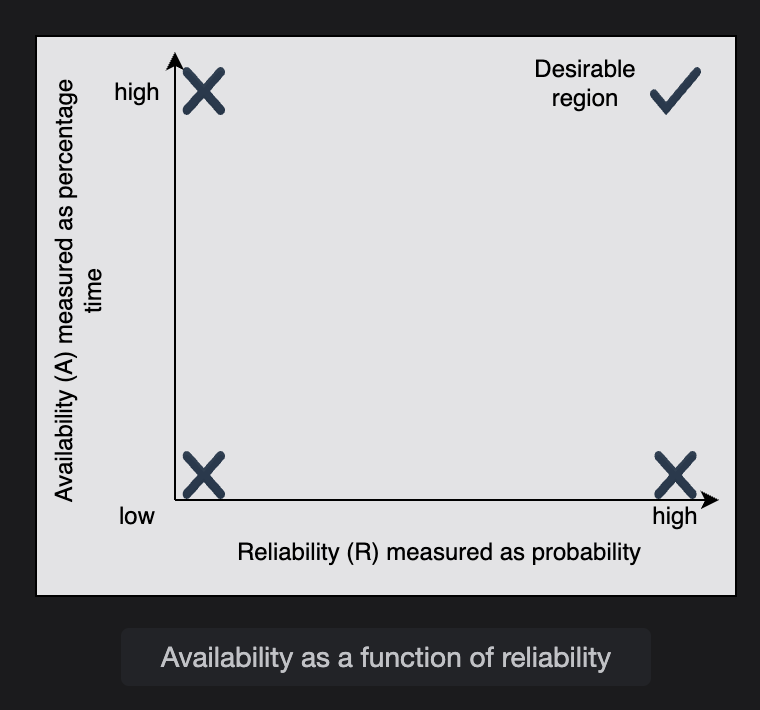

# Reliability

## What is Reliability?
Reliability is the probability that a service will perform its functions for a specified time without failure.  
It measures how consistently the system operates under varying conditions.

---

## Key Metrics

### 1. MTBF (Mean Time Between Failures)  
**Formula:**  
MTBF = (Total Elapsed Time - Sum of Downtime) / Total Number of Failures

**Example:**  
A payment processing service runs for 1000 hours.  
- During this period, it fails 5 times.  
- The total downtime across those failures is 50 hours.  

MTBF = (1000 - 50) / 5 = 950 / 5 = 190 hours 

→ On average, the system runs **190 hours** before failing again.

---

### 2. MTTR (Mean Time To Repair)  
**Formula:**  
MTTR = Total Maintenance Time / Total Number of Repairs

**Example:**  
If the 5 failures above required a total of 10 hours to repair:  
MTTR = 10 / 5 = 2 hours

→ On average, each failure takes **2 hours** to fix.

---

## Reliability vs Availability

- **Reliability** → How consistently the system works without failing.  
- **Availability** → How often the system is up and accessible.  

---

## Scenarios

1. **Low Availability, Low Reliability**  
   Example: A cheap web hosting server crashes frequently (low reliability) and takes hours to restart (low availability).

2. **Low Availability, High Reliability**  
   Example: A database cluster that rarely fails (high reliability), but when it does, repairs take days due to lack of spare parts (low availability).

3. **High Availability, Low Reliability**  
   Example: A streaming service that fails frequently (low reliability), but is restored in seconds using automated failover (high availability).

4. **High Availability, High Reliability (Desirable)**  
   Example: A cloud provider like AWS, GCP, or Azure where failures are rare (high reliability) and repairs happen quickly with redundancy (high availability).

---

## Availability as a Function of Reliability

**Formula:**  
Availability (A) = MTBF / (MTBF + MTTR)

If **MTBF is high** (failures are rare) and **MTTR is low** (repairs are quick), then Availability approaches **100%**.

---

## Extra Note: MTTF vs MTBF

- **MTTF (Mean Time To Failure):** Used when a component cannot be repaired (e.g., bulb, disk).  
- **MTBF:** Used when failures are repairable.

---

## Key Difference Between Reliability and Availability

- **Reliability =** How long the system works correctly without failure.  
- **Availability =** How often the system is accessible when needed.  

**Example:**  
A car that rarely breaks down (**high reliability**) but sits in the garage for weeks waiting for parts (**low availability**).

### Question 
 **What is the difference between reliability and availability?**   
 **Reliability** measures how well a system performs its intended operations (functional requirements). We use averages for that (Mean Time to Failure, Mean Time to Repair, etc.)

**Availability** measures the percentage of time a system accepts requests and responds to clients.

**Example** 1: A certain system may be 90% available but only reliable 80% of the time.

**Example** 2: Suppose we consider our “system” the stuff inside a data center (hardware + software). Let’s assume this data center suffers a network failure such that no outsider traffic is coming in and no insider traffic is going out. In this case, instantaneous availability might be zero (because clients cannot reach the service) even though inside the data center, all systems are perfectly functioning (instantaneous reliability 100%).

We use both of them (reliability and availability) in different contexts. For example, storage vendors often quote MTTF for their disks. Most online services use uptime (as a measure of availability) in their SLAs. For example, the uptime of EC2 virtual machines is 99.95%.

