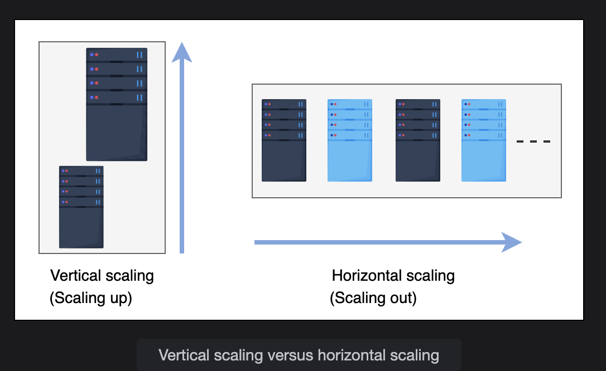

# Scalability
Learn about scalability and its importance in system design.

---

## What is Scalability?
Scalability is the ability of a system to handle an increasing amount of workload without compromising performance.  
A search engine, for example, must accommodate increasing numbers of users, as well as the amount of data it indexes.

The workload can be of different types, including the following:

- **Request workload**: The number of requests served by the system.  
- **Data/storage workload**: The amount of data stored by the system.  

---

## Dimensions of Scalability
Here are the different dimensions of scalability:

- **Size scalability**: A system is scalable in size if we can simply add additional users and resources to it.  
- **Administrative scalability**: The capacity for a growing number of organizations or users to share a single distributed system with ease.  
- **Geographical scalability**: How easily the program can cater to other regions while maintaining acceptable performance.  
  - The system should be able to service a broad geographical region as well as a smaller one.

---

## Different Approaches of Scalability

### 1. Vertical Scalability (Scaling Up)
- Refers to scaling by **adding more capabilities** (CPU, RAM, etc.) to an existing device.  
- Expands present hardware/software capacity.  
- **Limitations**: Growth is capped by the maximum limits of a single server.  
- **Cost**: Usually high, since exotic and expensive components may be required.

### 2. Horizontal Scalability (Scaling Out)
- Refers to **increasing the number of machines** in the network.  
- Uses commodity nodes because they are cheaper and provide cost benefits.  
- **Catch**: The system must be designed such that many nodes can work collectively like a single large server.  

---

